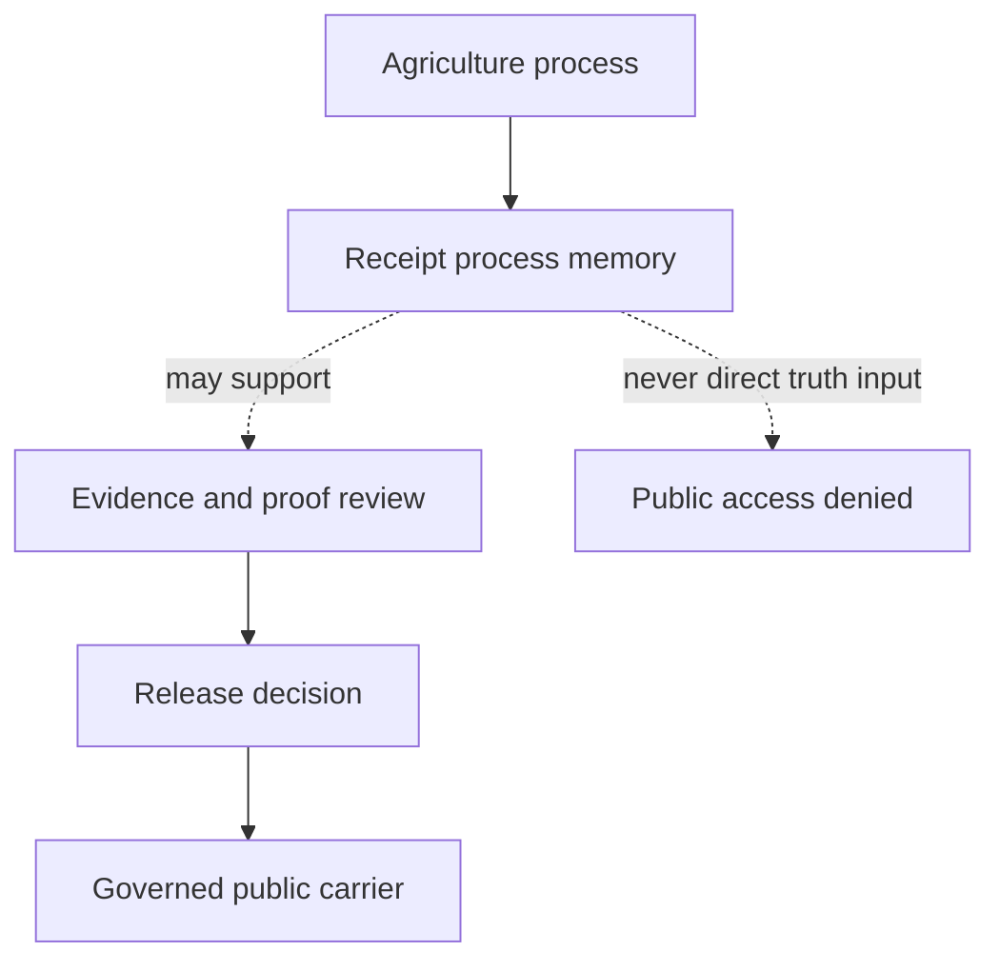

<!-- [KFM_META_BLOCK_V2]
doc_id: kfm://data/receipts/agriculture/readme
name: Agriculture Receipts README
path: data/receipts/agriculture/README.md
type: data-receipts-domain-lane-readme; boundary-compact
version: v0.2.0
status: draft; repository-grounded; README-only; lane-unregistered; enforcement-unverified
owners:
  - NEEDS VERIFICATION — receipt steward assignment
  - NEEDS VERIFICATION — Agriculture domain steward assignment
  - NEEDS VERIFICATION — data and provenance steward assignments
  - NEEDS VERIFICATION — rights, sensitivity, and policy steward assignments
  - NEEDS VERIFICATION — contract, schema, validation, proof, and release steward assignments
created: 2026-06-28
updated: 2026-07-26
policy_label: restricted-review; receipt-internal; no-direct-public-path; release-gated
truth_posture: >-
  CONFIRMED exact target, sparse tracked subtree, accepted Directory Rules v2
  adoption, current parent and aggregation sibling, empty proposed machine
  registers, draft semantic contract, permissive scaffold schemas, placeholder
  policy/tests/fixtures/validators, and explicit workflow holds / PROPOSED
  minimum future receipt content and direct-child grammar / CONFLICTED exact
  domain-first, object-family-first, or stage-first payload layout / UNKNOWN
  external storage, runtime writers and consumers, retention, signing,
  correction propagation, and public effects / NEEDS VERIFICATION accountable
  owners, accepted identity and machine contracts, executable validation,
  evidence closure, review, release, correction, and rollback integration
responsibility_root: data/
authority_owner: receipt process memory
domain: agriculture
artifact_family: agriculture-receipts
readme_profile: BOUNDARY_COMPACT
path_posture: existing-domain-receipt-boundary; PLACE README; HOLD_UNRESOLVED new payload writes
sensitivity_posture: receipt-internal; no-public-path; process-memory-not-proof; source-role-preserving; private-join-denial-defaults; aggregation-does-not-launder-rights-or-sensitivity; release-blocked
prepared_under_prompt: KFM Markdown Modernization & GitHub Documentation Implementation Agent v4.0.0
evidence_snapshot:
  repository: bartytime4life/Kansas-Frontier-Matrix
  base_ref: main
  base_commit: 6c7170dc8216d07fcd33af82f747fe33c03607b6
  prior_blob: 66c0ae417166717479fe77606706e8f5538c0a8b
  target_tree: be3361d18d6a2d5c89679805f8402cab1dd0f058
  parent_receipts_blob: 041f205dd5e618185fc7c75e95c85872fc9bbf69
  aggregation_sibling_blob: ac012c25d942735d4204ef885042f83ed2707117
  directory_rules_blob: fd49a0b83e55cef52c1124281f093e263526898d
  directory_rules_decision_blob: cd044a38047cc9b3725d2e083eb201eb86109308
  domain_lane_register_blob: 81b23beb3178b59d5c1fdb50edbc9f98f8664930
  object_family_register_blob: 930a9da30d5481f8d7ed5b7789d7846a30d3f4e1
  aggregation_contract_blob: 7a658c579011dad0636025f502419372294d9086
  aggregation_schema_blob: 16c55157c07d3115bfb540b2064e0401bc71b564
  agriculture_object_families_blob: 382af1e7d53477ac89b7ef01c1e8f4b4352258c6
  aggregation_policy_blob: b5482dc8306c225e718e64fe6d5d879742e93654
  threshold_placeholder_blob: 31947ca3e468a967aed3fc5d44699130b7d588fd
  agriculture_fixture_readme_blob: 68660dfb8e64dc39a146964866f4ddcec36d6e1e
  catalog_placeholder_test_blob: 0ba84246303e04c112a9c403e057fffb36078d12
  agriculture_workflow_blob: 1dd9938b92de61c7d905f30170cf6394e6c06ea1
  method: exact commit-pinned tree and file inspection plus connected authority, register, contract, schema, policy, fixture, test, validator, and workflow inspection; no runtime execution
related:
  - ../README.md
  - ../aggregation/README.md
  - ../../README.md
  - ../../raw/agriculture/README.md
  - ../../processed/agriculture/README.md
  - ../../proofs/README.md
  - ../../catalog/domain/agriculture/README.md
  - ../../published/layers/agriculture/README.md
  - ../../../release/manifests/README.md
  - ../../../docs/doctrine/directory-rules.md
  - ../../../docs/adr/ADR-0029-adopt-directory-governance-standard-v2.md
  - ../../../docs/adr/ADR-0011-receipts-vs-proofs-vs-manifests-vs-catalog-separation.md
  - ../../../docs/standards/RUN_RECEIPT.md
  - ../../../docs/domains/agriculture/CANONICAL_PATHS.md
  - ../../../docs/domains/agriculture/PIPELINE.md
  - ../../../docs/domains/agriculture/OBJECT_FAMILIES.md
  - ../../../contracts/domains/agriculture/aggregation-receipt.md
  - ../../../schemas/contracts/v1/domains/agriculture/aggregation_receipt.schema.json
  - ../../../policy/domains/agriculture/aggregation_thresholds/README.md
  - ../../../policy/sensitivity/agriculture/aggregation_thresholds.yaml
  - ../../../control_plane/domain_lane_register.yaml
  - ../../../control_plane/object_family_register.yaml
  - ../../../fixtures/domains/agriculture/README.md
  - ../../../tests/domains/agriculture/test_nass_aggregate_only.py
  - ../../../tests/domains/agriculture/test_catalog_closure.py
  - ../../../tools/validators/agriculture/README.md
  - ../../../.github/workflows/domain-agriculture.yml
tags:
  - kfm
  - data
  - receipts
  - agriculture
  - aggregation-receipt
  - run-receipt
  - transform-receipt
  - validation-receipt
  - process-memory
  - source-role
  - provenance
  - no-public-path
  - evidence-first
  - bounded-authority
  - fail-closed
  - correction-ready
  - rollback-aware
notes:
  - "This revision changes only `data/receipts/agriculture/README.md`; it creates no receipt payload, directory, contract, schema, policy, fixture, validator, workflow, proof, release record, or public artifact."
  - "Accepted ADR-0029 makes `docs/doctrine/directory-rules.md` the sole writable human Directory Rules authority; the adopted source retains its frozen pre-adoption status text."
  - "Direct tracked children are exactly `.gitkeep` and `README.md`; no Agriculture receipt instance is established in this Git tree."
  - "The proposed machine domain and object-family registers both contain `entries: []`; adoption of human doctrine does not register this payload lane."
  - "New receipt payload writes remain `HOLD_UNRESOLVED` until domain-first, object-family-first, and stage-first layout conflicts are resolved through accepted governance and machine enforcement."
[/KFM_META_BLOCK_V2] -->

<a id="top"></a>

# `data/receipts/agriculture/` — Agriculture Process Memory

> **One-line purpose.** Define the existing Agriculture receipt boundary as durable process memory without treating a README, receipt, aggregate, workflow result, or repository path as evidence truth, proof, policy permission, release approval, or publication.

[](#status-notes)
[](#directory-map)
[](#path-posture)
[](#repo-fit)
[](#receipt-boundary)
[](#scope)

> [!IMPORTANT]
> [ADR-0029](../../../docs/adr/ADR-0029-adopt-directory-governance-standard-v2.md) is accepted and adopts the exact [Directory Rules v2](../../../docs/doctrine/directory-rules.md) bytes. Those rules establish `data/receipts/` as durable process memory and permit sparse domain lanes inside responsibility roots. They do not register a payload grammar for this exact child.

> [!CAUTION]
> `data/receipts/agriculture/` is not a public-serving path. Its presence cannot prove Agriculture truth, cure weak provenance, clear rights, remove sensitivity, authorize a private join, satisfy evidence closure, approve a release, or publish an artifact.

**Quick navigation:** [Scope](#scope) · [Path posture](#path-posture) · [Repo fit](#repo-fit) · [Receipt families](#receipt-families) · [Receipt boundary](#receipt-boundary) · [Accepted material](#accepted-material) · [Exclusions](#exclusions) · [Directory map](#directory-map) · [Exit gates](#exit-gates) · [Forbidden shortcut](#forbidden-shortcut) · [Checks](#required-checks-before-use) · [Status](#status-notes) · [Related files](#related-files)

---

## Scope

This README is the same-path boundary contract for the existing Agriculture segment under the `data/receipts/` responsibility root. Its concern is process accountability: enough durable, inspectable memory to reconstruct what an Agriculture process declared it did, with which inputs, tools, methods, policies, and outputs.

A governed receipt may eventually carry or reference:

- deterministic receipt and run identities;
- source, input, output, and evidence references;
- input and output-set digests;
- method, recipe, schema, contract, and policy-profile versions;
- aggregation unit, threshold-profile, suppression, and generalization context;
- actor or runner identity and timestamps;
- finite validation, review, correction, supersession, and rollback references.

Those are minimum design expectations, not evidence that this lane currently emits or validates them. At the pinned repository state, the tracked subtree contains only this README and an empty `.gitkeep`.

### Truth and authority posture

| Label | Meaning in this README |
|---|---|
| **CONFIRMED** | Verified from the pinned Git tree, exact repository bytes, accepted ADR, or inspected repository artifacts. |
| **PROPOSED** | A future receipt field, child grammar, validation layer, or operating rule not established by accepted machine enforcement. |
| **CONFLICTED** | Current documents imply incompatible domain-first, object-family-first, or stage-first receipt placement. |
| **UNKNOWN** | Runtime state, external storage, writers, consumers, retention, signing, or deployed effects not proved by repository evidence. |
| **NEEDS VERIFICATION** | A checkable owner, contract, schema, policy, test, validator, review, correction, or release integration claim not yet closed. |
| **DENY** | Any inference that receipt presence alone proves truth, safety, review, release, or publication. |

Receipts can support review and later proof or release decisions. They do not become those decisions.

[Back to top](#top)

---

## Path posture

### Placement result

| Target | Outcome | Basis |
|---|---|---|
| Existing `data/receipts/agriculture/README.md` | **PLACE** | Same-path `BOUNDARY_COMPACT` refinement inside the receipt responsibility root. |
| New receipt instances or child directories | **HOLD_UNRESOLVED** | Exact payload identity, ordering, machine registration, writer, contract, schema, validation, retention, and review authority are not closed. |
| Direct public or ordinary UI consumption | **DENY** | Internal process memory is not a governed public carrier. |

The [machine domain-lane register](../../../control_plane/domain_lane_register.yaml) is `PROPOSED` and currently states:

```yaml
entries: []
```

The [object-family register](../../../control_plane/object_family_register.yaml) is likewise proposed and empty. Human Directory Rules adoption therefore establishes responsibility boundaries but does not prove that this exact payload lane is registered or enforced.

### Unresolved layout conflict

| Observed or proposed arrangement | Evidence status | Required handling |
|---|---|---|
| `data/receipts/agriculture/` | Existing sparse domain boundary | Preserve README; do not infer payload authority. |
| `data/receipts/aggregation/` | Existing sparse object-family boundary, modernized in merged PR #1782 | Treat as adjacent evidence; do not duplicate a writer. |
| Stage-first receipt homes | Draft Agriculture and RunReceipt design lineage | Do not treat as accepted implementation or placement authority. |

No accepted ADR or populated alias/deprecation register selects one ordering, and the `ADR-S-03` label in draft documents does not resolve the conflict. This README records the hold instead of manufacturing a winner.

[Back to top](#top)

---

## Repo fit

| Field | Current repository result |
|---|---|
| Path | `data/receipts/agriculture/README.md` |
| Responsibility root | `data/` |
| Authority owner | Receipt process memory |
| Domain lane | Agriculture |
| README profile | `BOUNDARY_COMPACT` |
| Tracked direct children | `.gitkeep`, `README.md` |
| Tracked Agriculture receipt instances | None at the pinned Git tree |
| External or runtime receipt storage | **UNKNOWN** |
| Parent receipt boundary | Repository-grounded `v0.4.0`; not a greenfield stub |
| Machine lane and object-family registration | `PROPOSED`; both registers have `entries: []` |
| AggregationReceipt contract | Draft and path-conflicted |
| AggregationReceipt schema | `PROPOSED`, empty `properties`, `additionalProperties: true` |
| Threshold policy | README-only draft; numeric YAML is a placeholder |
| Fixtures | No tracked machine fixture payloads in the inspected Agriculture fixture tree |
| Tests | Smoke assertion or docstring-only placeholders; no receipt conformance suite |
| Validators | Direct lane is README-only; adjacent domain validators raise `NotImplementedError` |
| Agriculture workflow | Read-only readiness checks with explicit validation, proof, and release holds |
| Public access | Direct access denied |
| Release/publication effect of this README | None |

### Responsibility map

| Concern | Owning surface | This README's role |
|---|---|---|
| Process memory | `data/receipts/` | Boundary and evidence index only |
| Object meaning | `contracts/` | Link to proposed meaning; no adoption |
| Machine shape | `schemas/` | Link to scaffold; no conformance claim |
| Rights, sensitivity, thresholds, release policy | `policy/` | Preserve fail-closed dependency |
| Fixtures, tests, validators, workflows | `fixtures/`, `tests/`, `tools/`, `.github/workflows/` | Report executable maturity accurately |
| Evidence and proof | `data/proofs/` | Receipts may be referenced; never substituted |
| Catalog projection | `data/catalog/` | Separate discovery/projection authority |
| Release, correction, rollback decisions | `release/` | Separate decision authority |
| Public carriers | `data/published/` and governed APIs | Never read this lane as truth directly |

[Back to top](#top)

---

## Receipt families

The exact subtype placement and machine contracts remain unresolved. A future accepted Agriculture receipt profile may distinguish these process-memory roles:

| Receipt family | Bounded purpose | Non-authority boundary |
|---|---|---|
| **Intake / source-refresh receipt** | Record a source observation, source-head state, declared source role, digests, and admission outcome. | Does not establish source truth, rights clearance, or publication. |
| **Transform receipt** | Record normalization, mapping, crosswalk, or derived-object process memory. | Does not replace processed-object validation or evidence closure. |
| **Aggregation receipt** | Record aggregation method, input digests, unit, threshold/profile context, suppression/generalization state, and affected outputs. | Does not prove an aggregate is true, non-reconstructable, or public-safe. |
| **Validation receipt** | Record what validation ran and its finite outcome. | Does not become proof, catalog closure, review approval, or release authorization. |
| **Policy-evaluation or AI-assistance receipt** | Record or reference a policy evaluation or bounded AI contribution. | Policy stays authoritative in `policy/`; AI remains interpretive, not root truth. |
| **Correction, migration, rollback, or release-support receipt** | Record process memory for reconciliation, migration, correction propagation, rollback execution support, or release review. | Decision records remain in their owning proof/release families. |

The draft [RunReceipt standard](../../../docs/standards/RUN_RECEIPT.md) and [AggregationReceipt contract](../../../contracts/domains/agriculture/aggregation-receipt.md) are design lineage. Their draft status and path conflicts prevent this README from treating their fields or homes as accepted implementation.

[Back to top](#top)

---

## Receipt boundary

| Invariant | Required handling |
|---|---|
| Receipt is process memory | Record what a process declared it did; do not treat the record as factual proof by itself. |
| Producer does not choose authority | Route each output to its responsibility family even when one run produces receipts, proofs, catalog records, and carriers. |
| Lifecycle data stays separate | Source rows and normalized Agriculture objects remain in RAW, WORK/QUARANTINE, and PROCESSED lanes. |
| Source role survives transformation | Preserve source identity, version, authority role, and input lineage through aggregation and derived outputs. |
| Aggregation does not erase provenance | Retain deterministic input references/digests and method/profile context. |
| Aggregation does not launder sensitivity | Do not infer that aggregation clears rights, privacy, cultural, ecological, infrastructure, operator, parcel, field, or location risk. |
| Private joins fail closed | Person, operator, ownership, parcel, and field-resolution joins require explicit policy and review; receipt presence is never approval. |
| Evidence remains resolvable | EvidenceRef-dependent claims must resolve through the proof/evidence family before public use. |
| Public clients do not read receipts directly | Normal APIs, MapLibre, search, graphs, indexes, and governed AI consume released public carriers through governed interfaces. |

### Authority flow



The dotted edges are support and denial relationships, not lifecycle promotion. A receipt does not automatically flow into proof, release, or publication.

[Back to top](#top)

---

## Accepted material

### Accepted while payload placement remains held

- this boundary README;
- the existing empty `.gitkeep`;
- repository-grounded inventory and disposition notes;
- compatibility or migration analysis that does not establish a second writer;
- links to owning contract, schema, policy, validation, proof, and release surfaces;
- public-safe verification findings that expose no protected data, credentials, secret thresholds, or reconstructable detail.

### Eligible only after governance and enforcement graduation

The legacy filename concepts remain preserved as proposals, not current tracked state:

- `run_receipt.json`;
- `aggregation_receipt.json`;
- `checksums.sha256`;
- `signature.bundle`;
- `index.local.json`.

A future accepted receipt instance may also carry stable identity, run identity, immutable/hash-bound content, input/output digests, method and profile versions, evidence references, review/correction/rollback references, and governed DSSE/cosign or equivalent attestation sidecars. Before any such write, placement, machine contracts, validation, retention, and accountable review must be accepted and tested.

No content in this section authorizes child creation or claims these files exist.

[Back to top](#top)

---

## Exclusions

| Do not place or authorize here | Correct authority home or action |
|---|---|
| Full source rows or source payloads | `data/raw/agriculture/`, `data/work/agriculture/`, `data/quarantine/agriculture/`, or `data/processed/agriculture/` as governed |
| EvidenceBundle, ProofPack, CatalogMatrix, citation validation, or integrity proof | `data/proofs/` |
| STAC, DCAT, PROV, or domain discovery records | `data/catalog/` |
| SourceDescriptor or source-activation decision | `data/registry/sources/` and governing review |
| ReleaseManifest, promotion decision, correction notice, rollback card, withdrawal notice, or release signature | `release/` |
| Public layer, PMTiles, report, story, API payload, download, or generated public output | `data/published/` only after governed release |
| Aggregation threshold, private-join, sensitivity, or release policy | `policy/` |
| Receipt meaning or machine shape | `contracts/` and `schemas/` |
| Fixture, test, validator, or CI workflow | `fixtures/`, `tests/`, `tools/`, `.github/workflows/` |
| Raw logs, caches, or disposable build output | Runtime/log/artifact homes selected by their own responsibility |
| Generated answer text or vector/graph truth | Governed answer/public interfaces after evidence, policy, review, and release checks |

The repository's draft Agriculture pipeline contains a receipt-as-proof contradiction. Accepted Directory Rules control: receipt and proof authority remain separate.

[Back to top](#top)

---

## Directory map

### Verified tracked boundary

Direct children are only `.gitkeep` and `README.md`.

```text
data/receipts/agriculture/
├── .gitkeep
└── README.md
```

This exact direct-child map follows the adopted Directory Rules. It establishes no tracked receipt instance, local index, checksum, signature, run directory, or aggregation child.

### Proposed future direct-child grammar

Only after the placement hold closes, an accepted profile may define one or more direct children such as:

```text
data/receipts/agriculture/
├── <accepted-receipt-family-or-partition>/
└── <accepted-lane-index-or-manifest>
```

Names, nesting, identity, retention, and migration behavior remain **PROPOSED**. The object-family sibling at `../aggregation/` must be reconciled before a domain-local aggregation writer can exist.

[Back to top](#top)

---

## Exit gates

| Outcome | Minimum evidence and disposition |
|---|---|
| **STAY_RECEIPT_LOCAL** | Process memory is retained but has no downstream authority effect. |
| **HOLD** | Identity, source role, input digest, method, threshold/profile, evidence reference, policy context, owner, review, correction, or rollback information is incomplete. |
| **QUARANTINE_OR_CORRECT** | The receipt conflicts with inputs, omits required lineage, exposes protected detail, violates policy, or points to unreconcilable outputs. Preserve prior bytes and correction lineage. |
| **REFERENCE_FROM_PROOF** | A proof object may cite the receipt as process support only when it independently closes evidence, integrity, sensitivity, rights, and review requirements. |
| **REFERENCE_FROM_CATALOG** | A catalog projection may point to released/supporting objects without turning the receipt into discovery or truth authority. |
| **REFERENCE_FROM_RELEASE** | A release decision may cite receipt lineage only after proof, policy, review, correction, and rollback gates close. |
| **ABSTAIN_OR_DENY** | Public use remains unsupported, unsafe, rights-unclear, sensitivity-unclear, or unreleased. |

Promotion is a governed state transition. A file move, README update, commit, green workflow, PR, merge, badge, or receipt does not perform it.

[Back to top](#top)

---

## Forbidden shortcut

The following direct or implied path is forbidden:

```text
data/receipts/agriculture/
→ data/proofs/
→ data/catalog/
→ data/published/
→ public API / MapLibre / PMTiles / report / story / graph / vector index / generated answer
```

These families are not a universal linear conveyor. Receipts may support proof and release review; proofs may support release; catalogs project governed discovery; published carriers require a separate release decision. Each authority transition must have its own inspectable evidence and finite outcome.

Also forbidden:

- accepting a receipt because its producer completed successfully;
- treating a signature as truth, rights clearance, or release approval;
- copying internal receipt content into a public payload;
- using a receipt identifier as an EvidenceBundle substitute;
- creating both domain-first and object-family-first writers without accepted migration and alias rules;
- overwriting prior process memory to make a correction appear clean.

[Back to top](#top)

---

## Required checks before use

### Placement and identity

- [ ] Confirm the accepted receipt root, direct-child grammar, and domain/object/stage ordering.
- [ ] Confirm the Agriculture lane and receipt object family are present in accepted machine registers; `entries: []` is not registration.
- [ ] Confirm a deterministic receipt ID, run ID, canonicalization algorithm, digest profile, filename grammar, and collision rule.
- [ ] Confirm no second writer or unresolved alias targets the same process memory.

### Meaning, evidence, policy, and sensitivity

- [ ] Confirm receipt meaning and required fields through an accepted semantic contract and enforcing schema.
- [ ] Confirm source/input/output references, input digests, method identity, timestamps, actor/runner identity, and status are present where applicable.
- [ ] Confirm aggregation unit, threshold/profile context, suppression/generalization state, and provenance survive aggregation.
- [ ] Confirm evidence references resolve to proof-side EvidenceBundle support before any public claim path uses the receipt.
- [ ] Confirm aggregation did not erase rights, privacy, sensitivity, sovereignty, source-role, private-join, or reconstructability obligations.
- [ ] Confirm no secret threshold value, credential, private URL, precise protected location, operator identity, or restricted payload is exposed.

### Validation, review, correction, and rollback

- [ ] Confirm deterministic public-safe positive and negative fixtures exist.
- [ ] Confirm executable validators reject malformed identity, digest, lineage, method, threshold/profile, policy, and evidence closure.
- [ ] Confirm review ownership, separation of duties, correction propagation, supersession, retention, legal hold, and rollback behavior.
- [ ] Confirm receipt payloads are immutable or append-only/hash-bound and never silently overwritten.
- [ ] Confirm workflow success is not represented as receipt validity, proof, or release.
- [ ] Confirm public APIs, maps, search, graphs, indexes, and AI cannot read this internal lane directly.

[Back to top](#top)

---

## Status notes

### Evidence-backed status

| Claim | Result |
|---|---|
| Target and same-path README identity exist at the pinned base. | **CONFIRMED** |
| Direct tracked children are exactly `.gitkeep` and `README.md`. | **CONFIRMED** |
| A tracked Agriculture receipt instance exists in this subtree. | **CONFIRMED absent at the pinned Git tree** |
| External/runtime receipt instances exist elsewhere. | **UNKNOWN** |
| Parent `data/receipts/README.md` is a greenfield stub. | **STALE / corrected** — current parent is repository-grounded `v0.4.0`. |
| ADR-0029 accepts the exact Directory Rules v2 bytes and makes the doctrine path writable authority. | **CONFIRMED** |
| The restored architecture Directory Rules body is current writable authority. | **DENY** — it is legacy read-only compatibility; deletion remains separately held. |
| `data/receipts/` owns durable process memory. | **CONFIRMED doctrine** |
| This exact payload lane is registered by machine governance. | **DENY current claim** — proposed registers contain `entries: []`. |
| `../aggregation/` settles domain/object/stage ordering. | **DENY** — it records an adjacent, conflicting candidate and placement hold. |
| ADR-0011 separates receipts, proofs, catalogs, manifests, and publication. | **CONFIRMED design text / ADR remains proposed** |
| Draft Agriculture pipeline or canonical-path prose controls current placement. | **DENY** — design lineage only; some claims conflict with accepted separation. |
| AggregationReceipt meaning is accepted and machine-enforced. | **DENY current claim** — contract is draft/path-conflicted and schema is permissive. |
| Accepted numeric aggregation thresholds are executable. | **DENY current claim** — policy YAML is a placeholder. |
| Agriculture fixtures/tests/validators establish receipt conformance. | **DENY current claim** — no machine fixtures, substantive receipt tests, or executable receipt validator were established. |
| Agriculture workflow proves receipt validity, proof closure, or release readiness. | **DENY** — it records explicit readiness holds. |
| This README authorizes truth, policy, proof, release, publication, or public access. | **DENY** |

### Open verification register

| ID | Question | Closure evidence | Current state |
|---|---|---|---|
| `AG-REC-01` | Which domain/object/stage ordering owns Agriculture receipt instances? | Accepted ADR/migration, populated registers, alias rules, and one writer | `HOLD_UNRESOLVED` |
| `AG-REC-02` | What is the accepted receipt identity and shape? | Accepted contract/schema, canonicalization and digest profile, fixtures, validators | `NEEDS VERIFICATION` |
| `AG-REC-03` | Who owns admission, review, correction, and release support? | Named accountable owners and review evidence | `NEEDS VERIFICATION` |
| `AG-REC-04` | Are there active writers, consumers, or external stores? | Runtime inventory and governed storage evidence | `UNKNOWN` |
| `AG-REC-05` | How are retention, signing, legal hold, supersession, and recovery enforced? | Accepted policies, drills, and receipts | `NEEDS VERIFICATION` |
| `AG-REC-06` | Do evidence references resolve and remain policy-safe? | EvidenceRef-to-EvidenceBundle tests and policy-negative fixtures | `NEEDS VERIFICATION` |
| `AG-REC-07` | Is direct public consumption denied in deployed clients? | API/UI/map/search/AI integration tests and release evidence | `NEEDS VERIFICATION` |

### No-loss and change ledger

| Disposition | Material |
|---|---|
| **KEEP** | Stable `doc_id`, name, path, type, created date, Agriculture and receipt identity, all baseline tags, thirteen section contracts, named receipt roles, exclusions, gates, filename concepts, related targets, and final boundary rule. |
| **CLARIFY** | Process-memory purpose, public-access denial, evidence references, source-role preservation, private-join risk, aggregation safeguards, and proof/release relationships. |
| **REPAIR** | Literal owner placeholders, stale parent claim, legacy-only Directory Rules routing, unregistered-lane ambiguity, `ADR-S-03` implication, deep-tree map, and generic maturity claims. |
| **ENRICH** | Commit/blob evidence snapshot, exact direct-child inventory, placement conflict, responsibility map, compact authority flow, open verification register, correction triggers, and rollback target. |
| **REMOVE WITH EVIDENCE** | Unverified nested current-state tree and any implication that tracked receipt payloads, indexes, signatures, validators, or release integration already exist. |

### Maintenance, correction, and rollback

Update this README when any of these changes:

- ADR or machine-register placement authority;
- tracked direct children;
- receipt contract/schema identity or required fields;
- policy thresholds, sensitivity profiles, or public-access rules;
- fixtures, tests, validators, workflow posture, writers, or consumers;
- retention, signing, review, correction, release, or rollback integration.

If documentation claims become wrong, preserve the earlier bytes, correct the claim in review, identify affected references, and record why the evidence changed. Do not rewrite receipt history or silently repair a public claim through README prose.

Before merge, close the draft PR and leave the branch unmerged. After merge, revert the modernization commit or restore prior blob `66c0ae417166717479fe77606706e8f5538c0a8b`. This documentation rollback does not delete receipts, reverse a release, or change runtime data.

[Back to top](#top)

---

## Related files

### Receipt, lifecycle, proof, catalog, and release boundaries

- [`../README.md`](../README.md) — parent process-memory contract.
- [`../aggregation/README.md`](../aggregation/README.md) — adjacent object-family candidate and placement-conflict evidence.
- [`../../README.md`](../../README.md) — `data/` responsibility and lifecycle boundary.
- [`../../raw/agriculture/README.md`](../../raw/agriculture/README.md) — Agriculture RAW payload boundary.
- [`../../processed/agriculture/README.md`](../../processed/agriculture/README.md) — Agriculture PROCESSED payload boundary.
- [`../../proofs/README.md`](../../proofs/README.md) — proof/evidence authority.
- [`../../catalog/domain/agriculture/README.md`](../../catalog/domain/agriculture/README.md) — Agriculture catalog projection.
- [`../../published/layers/agriculture/README.md`](../../published/layers/agriculture/README.md) — released public-layer carrier boundary.
- [`../../../release/manifests/README.md`](../../../release/manifests/README.md) — release-manifest authority.

### Doctrine, decisions, and design lineage

- [`../../../docs/doctrine/directory-rules.md`](../../../docs/doctrine/directory-rules.md) — adopted writable Directory Rules authority.
- [`../../../docs/adr/ADR-0029-adopt-directory-governance-standard-v2.md`](../../../docs/adr/ADR-0029-adopt-directory-governance-standard-v2.md) — accepted adoption decision.
- [`../../../docs/adr/ADR-0011-receipts-vs-proofs-vs-manifests-vs-catalog-separation.md`](../../../docs/adr/ADR-0011-receipts-vs-proofs-vs-manifests-vs-catalog-separation.md) — proposed separation ADR; supporting design context.
- [`../../../docs/standards/RUN_RECEIPT.md`](../../../docs/standards/RUN_RECEIPT.md) — draft envelope design.
- [`../../../docs/domains/agriculture/CANONICAL_PATHS.md`](../../../docs/domains/agriculture/CANONICAL_PATHS.md) — draft path lineage; not current placement authority.
- [`../../../docs/domains/agriculture/PIPELINE.md`](../../../docs/domains/agriculture/PIPELINE.md) — draft pipeline lineage; receipt-as-proof text is not authoritative.
- [`../../../docs/domains/agriculture/OBJECT_FAMILIES.md`](../../../docs/domains/agriculture/OBJECT_FAMILIES.md) — draft Agriculture object-family lineage.

### Meaning, shape, policy, and enforcement

- [`../../../contracts/domains/agriculture/aggregation-receipt.md`](../../../contracts/domains/agriculture/aggregation-receipt.md) — draft semantic contract.
- [`../../../schemas/contracts/v1/domains/agriculture/aggregation_receipt.schema.json`](../../../schemas/contracts/v1/domains/agriculture/aggregation_receipt.schema.json) — permissive scaffold schema.
- [`../../../policy/domains/agriculture/aggregation_thresholds/README.md`](../../../policy/domains/agriculture/aggregation_thresholds/README.md) — draft threshold-policy boundary.
- [`../../../policy/sensitivity/agriculture/aggregation_thresholds.yaml`](../../../policy/sensitivity/agriculture/aggregation_thresholds.yaml) — proposed placeholder; not accepted numeric policy.
- [`../../../control_plane/domain_lane_register.yaml`](../../../control_plane/domain_lane_register.yaml) — proposed empty domain register.
- [`../../../control_plane/object_family_register.yaml`](../../../control_plane/object_family_register.yaml) — proposed empty object-family register.
- [`../../../fixtures/domains/agriculture/README.md`](../../../fixtures/domains/agriculture/README.md) — fixture boundary; no machine receipt fixture is established.
- [`../../../tests/domains/agriculture/test_nass_aggregate_only.py`](../../../tests/domains/agriculture/test_nass_aggregate_only.py) — docstring-only readiness placeholder.
- [`../../../tests/domains/agriculture/test_catalog_closure.py`](../../../tests/domains/agriculture/test_catalog_closure.py) — additional docstring-only placeholder that trips the current readiness guard.
- [`../../../tools/validators/agriculture/README.md`](../../../tools/validators/agriculture/README.md) — README-only direct validator boundary.
- [`../../../.github/workflows/domain-agriculture.yml`](../../../.github/workflows/domain-agriculture.yml) — readiness workflow with explicit holds.

---

KFM rule: `data/receipts/agriculture/` is an Agriculture receipt lane for process memory only. It is not proof, catalog, registry, policy, release, publication, crop truth, field truth, private-join authority, public artifact authority, graph authority, vector-index authority, or generated-answer truth.

[Back to top](#top)
