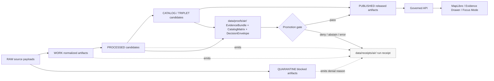

<!-- [KFM_META_BLOCK_V2]
doc_id: kfm://doc/TODO-uuid
title: Air Receipts
type: standard
version: v1
status: draft
owners: TODO: confirm data/steward owner
created: 2026-05-01
updated: 2026-05-01
policy_label: TODO: confirm public|restricted label for receipt documentation and receipt contents
related: [TODO: verify data/receipts/atmosphere/, TODO: verify docs/domains/atmosphere/, TODO: verify schemas/contracts/v1/atmosphere/]
tags: [kfm, receipts, air, atmosphere, provenance, process-memory]
notes: [Target path supplied as data/receipts/air; KFM corpus more often uses atmosphere receipts. Confirm whether air is an alias, sublane, or migration target before automation.]
[/KFM_META_BLOCK_V2] -->

# Air Receipts

Receipt-only process memory for Atmosphere / Air runs; not canonical truth, not release proof, and not a public data surface.

<a id="top"></a>

> [!IMPORTANT]
> **Status:** experimental  
> **Owners:** TODO: confirm data/steward owner  
> **Path:** `data/receipts/air/`  
> **File role:** directory README, inferred as `data/receipts/air/README.md`  
> **Implementation depth:** UNKNOWN until the mounted repository is inspected  
>
> 
> 
> 
> 

**Quick jumps:** [Scope](#scope) · [Repo fit](#repo-fit) · [Inputs](#inputs) · [Exclusions](#exclusions) · [Directory tree](#directory-tree) · [Receipt rules](#receipt-rules) · [Lifecycle diagram](#lifecycle-diagram) · [Review gates](#review-gates) · [FAQ](#faq)

---

## Scope

`data/receipts/air/` is for **process receipts** emitted by governed Atmosphere / Air workflows.

Receipts answer questions like:

- What run happened?
- Which inputs, transforms, and outputs were involved?
- Which validation and policy checks ran?
- What failed, abstained, was denied, or remained blocked?
- Which proof, catalog, rollback, or review object should a maintainer inspect next?

Receipts do **not** answer “what is true?” on their own. KFM’s public value is the inspectable claim, and a claim must resolve through evidence, source role, policy posture, review state, release state, and correction lineage before it is treated as public-facing knowledge.

> [!WARNING]
> A receipt is process memory. It is not an `EvidenceBundle`, not a `CatalogMatrix`, not a `ReleaseManifest`, and not a license to publish.

---

## Repo fit

| Boundary | Path from this README | Status | Role |
|---|---:|---|---|
| Current directory | `./` | **INFERRED** | Holds air-lane process receipts. |
| Atmosphere canonical receipt sibling | [`../atmosphere/`](../atmosphere/) | **NEEDS VERIFICATION** | KFM atmosphere report uses `data/receipts/atmosphere/<run_id>.json`; confirm whether `air` is an alias or separate sublane. |
| Work artifacts | [`../../work/air/`](../../work/air/) | **PROPOSED** | Normalized observations, sites, and QC reports before promotion. |
| Quarantine artifacts | [`../../quarantine/air/`](../../quarantine/air/) | **PROPOSED** | Invalid, rights-blocked, conflicted, or unsafe artifacts. |
| Proof objects | [`../../proofs/air/`](../../proofs/air/) | **PROPOSED** | Candidate `EvidenceBundle`, `CatalogMatrix`, `DecisionEnvelope`, and preservation proof objects. |
| Catalog records | [`../../catalog/`](../../catalog/) | **PROPOSED** | STAC, DCAT, layer descriptors, and catalog closure surfaces. |
| Published artifacts | [`../../published/air/`](../../published/air/) | **PROPOSED** | Released public-safe artifacts only after gates pass. |
| Domain docs | [`../../../docs/domains/atmosphere/`](../../../docs/domains/atmosphere/) | **PROPOSED / NEEDS VERIFICATION** | Architecture, registries, runbook, promotion, rollback, and source-role documentation. |
| Machine schemas | [`../../../schemas/contracts/v1/atmosphere/`](../../../schemas/contracts/v1/atmosphere/) | **PROPOSED / NEEDS VERIFICATION** | Expected schema family for Atmosphere / Air objects if repo conventions match the corpus. |

### Naming decision: `air` vs. `atmosphere`

The supplied target path is `data/receipts/air`. The KFM Atmosphere / Air corpus more consistently names the lane `atmosphere` and proposes receipt artifacts under `data/receipts/atmosphere/`.

**NEEDS VERIFICATION:** before adding automation, choose one of these patterns:

| Option | Meaning | Required guard |
|---|---|---|
| `air` as alias | `data/receipts/air/` points to the same lane as `data/receipts/atmosphere/`. | Add ADR or alias registry; prevent duplicate receipt homes. |
| `air` as sublane | `air` covers air-quality receipts, while `atmosphere` covers wider climate, smoke, EO, model, anomaly, and fusion context. | Define sublane boundaries and cross-links. |
| migrate to `atmosphere` | This README becomes a transitional note and receipts move to `../atmosphere/`. | Emit migration note and rollback reference. |

> [!CAUTION]
> Do not keep both `air` and `atmosphere` active as independent receipt homes without a documented routing rule. Split receipt homes make proof lookup, rollback, and audit trails fragile.

[Back to top](#top)

---

## Inputs

Only receipt-class artifacts belong here.

| Accepted input | Example name | Status | Minimum expectation |
|---|---|---|---|
| Run receipt | `<run_id>.json` | **PROPOSED for this path** | Captures run ID, source IDs, source roles, transform hash, input/output digests, validation status, policy outcome, and lifecycle disposition. |
| Rollback receipt | `rollback/<rollback_id>.json` | **PROPOSED** | Records alias movement from one immutable `spec_hash` to another and points to prior proof references. |
| Validation receipt | `validation/<run_id>.json` | **PROPOSED** | Summarizes schema, policy, QC, and catalog-closure checks without embedding raw payloads. |
| Source verification receipt | `source-verification/<source_id>-<checked_at>.json` | **PROPOSED** | Records source descriptor verification, rights status, cadence, and access notes when the repo defines this receipt type. |
| Migration receipt | `migration/<migration_id>.json` | **PROPOSED** | Records path, schema, alias, or compatibility migration with rollback target. |

A valid receipt should be small, structured, traceable, and reviewable. It should point to artifacts; it should not become the artifact.

---

## Exclusions

| Does **not** belong here | Why | Preferred home |
|---|---|---|
| Raw source payloads | Receipts must not expose unreviewed source content. | [`../../raw/air/`](../../raw/air/) or `../../raw/atmosphere/` after path decision. |
| Normalized observations or sites | These are work/processed data, not receipts. | [`../../work/air/`](../../work/air/) or [`../../processed/air/`](../../processed/air/). |
| QC reports used as data artifacts | QC outputs may feed receipts but should not be confused with receipts. | [`../../work/air/`](../../work/air/) or build output, per repo convention. |
| `EvidenceBundle` objects | Evidence proof is stronger than process memory and must remain separate. | [`../../proofs/air/`](../../proofs/air/). |
| `CatalogMatrix` / release proof | Catalog closure and release proof are not receipt-only records. | [`../../proofs/air/`](../../proofs/air/). |
| STAC / DCAT / PROV records | Catalog and provenance records are catalog/prov surfaces. | [`../../catalog/`](../../catalog/) and [`../../prov/air/`](../../prov/air/). |
| Layer descriptors / Evidence Drawer payloads | UI descriptors are downstream delivery candidates. | [`../../catalog/layers/`](../../catalog/layers/). |
| Published PMTiles, COGs, GeoJSON, CSV, or exports | Published outputs require release state and public-safe review. | [`../../published/air/`](../../published/air/). |
| Secrets, tokens, credentials, private chain-of-thought | Never valid KFM receipt content. | Do not store in repo. |

---

## Directory tree

**PROPOSED until repo conventions are verified.**

```text
data/receipts/air/
├── README.md
├── <run_id>.json
├── validation/
│   └── <run_id>.json
├── rollback/
│   └── <rollback_id>.json
├── migration/
│   └── <migration_id>.json
└── source-verification/
    └── <source_id>-<checked_at>.json
```

> [!NOTE]
> If the repo already uses `data/receipts/atmosphere/`, prefer the established path and convert this directory into an alias note or migration note rather than creating parallel receipt streams.

---

## Receipt rules

### 1. Keep receipts downstream of the run

A receipt may summarize a run, validation, rollback, source verification, or migration. It must not initiate publication, define truth, or override a failed gate.

### 2. Preserve source-role and knowledge-character labels

Air and atmosphere records are easy to overstate. A receipt should preserve labels that distinguish, at minimum:

| Label family | Examples | Rule |
|---|---|---|
| Source role | `OBSERVED_SENSOR`, `REGULATORY_ARCHIVE`, `MODEL_FIELD`, `REMOTE_MASK`, `DERIVED_FUSION` | Do not collapse source roles into generic “air data.” |
| Knowledge character | observed, modeled, advisory, anomaly, fusion, baseline context | Do not relabel model fields, AQI, AOD, smoke masks, or fusion outputs as direct observations. |
| Lifecycle disposition | WORK, QUARANTINE, PROCESSED, CATALOG, TRIPLET, PUBLISHED | Receipt must name the stage it records and the next allowed gate. |

### 3. Receipt alone cannot publish

A receipt can support audit, replay, rollback, validation, and review. Public release still requires evidence closure, catalog closure, policy compliance, review state, and release decision.

### 4. Fail closed when evidence or rights are missing

Receipt records should make denial and abstention visible. Missing evidence refs, unknown rights, unsupported source role, unresolved proof, or stale validation should block public promotion.

---

## Lifecycle diagram



---

## Quickstart

> [!IMPORTANT]
> These commands are discovery-oriented and must be adapted to actual repo tooling. Do not add broad new workflow commands until package manager, test runner, and schema home are confirmed.

```bash
# Confirm the repository and target path before editing.
git status --short
find data/receipts/air -maxdepth 3 -type f | sort
find data/receipts/atmosphere -maxdepth 3 -type f | sort 2>/dev/null || true
```

```bash
# PROPOSED validation shape only.
# Replace with repo-native validator once schema and tool locations are confirmed.
python tools/validators/atmosphere/validate_receipts.py data/receipts/air
pytest -q tests/atmosphere
```

```bash
# Receipt/proof separation check.
# Receipts should point to proof objects; proof objects should not be stored here.
find data/receipts/air -type f \( -name '*evidence_bundle*' -o -name '*catalog_matrix*' -o -name '*decision_envelope*' \) -print
```

Expected result for the final command: no files.

---

## Receipt checklist

Before committing a receipt file:

- [ ] The receipt is generated by a governed pipeline, validator, migration, rollback, or source-verification step.
- [ ] The receipt has a stable `run_id`, `receipt_id`, or equivalent repo-defined identifier.
- [ ] The receipt records source IDs and source roles when source data are involved.
- [ ] Input and output artifact references use digests or immutable references where available.
- [ ] `transform_spec_hash` or equivalent transform identity is present when data were transformed.
- [ ] Validation result is explicit: `pass`, `fail`, `deny`, `abstain`, `error`, or repo-equivalent finite status.
- [ ] Public release is not implied by receipt existence.
- [ ] Raw payloads, secrets, credentials, and private reasoning are absent.
- [ ] Any proof references resolve outside this directory.
- [ ] Any rollback receipt preserves the prior artifact reference and does not delete prior receipts.

[Back to top](#top)

---

## Review gates

| Gate | Question | Pass condition | Fail behavior |
|---|---|---|---|
| Path gate | Is `air` the correct receipt home? | ADR or existing repo convention confirms it. | Mark `NEEDS VERIFICATION`; do not automate writes. |
| Schema gate | Does the receipt validate? | Receipt conforms to repo-approved run/rollback/migration schema. | `ERROR` or `DENY`; quarantine candidate output if needed. |
| Evidence gate | Are referenced evidence objects resolvable? | Every consequential reference resolves to an `EvidenceBundle` or explicit abstention reason. | `DENY` public claim path. |
| Rights gate | Are source rights known enough for downstream use? | Source descriptor permits the requested release class. | `DENY` public release; preserve receipt. |
| Catalog gate | Do catalog/prov/proof references close? | STAC/DCAT/PROV/proof digests align where required. | `DENY` promotion; emit validation receipt. |
| Rollback gate | Can the state be reversed? | Prior `spec_hash` or rollback target is recorded and verified. | Block promotion until rollback target exists. |

---

## FAQ

### Is a receipt a proof?

No. A receipt records that a process occurred and what it touched. Proof objects belong under the proof surface and must carry stronger evidence, catalog, policy, and release relationships.

### Can a receipt be public?

Maybe. The README can be public after review, but receipt contents may expose source IDs, station/site references, internal paths, source-access notes, or validation details. Confirm policy label before public release.

### Can Focus Mode use these receipts?

Only indirectly. Focus Mode should consume governed envelopes and resolved evidence, not raw receipt files. A receipt may support audit or traceability after the governed API has resolved evidence and policy state.

### What happens if `data/receipts/atmosphere/` already exists?

Treat this `air` directory as a path conflict until an ADR or migration note resolves it. Do not duplicate receipts across both homes without a stable alias rule.

---

## Appendix

<details>
<summary>Illustrative receipt header sketch — PROPOSED, replace with repo schema</summary>

```json
{
  "receipt_id": "TODO-receipt-id",
  "run_id": "TODO-run-id",
  "domain": "air",
  "lane_alias_for": "atmosphere",
  "receipt_type": "run_receipt",
  "lifecycle_stage": "WORK",
  "source_refs": [
    {
      "source_id": "TODO-source-id",
      "source_role": "OBSERVED_SENSOR",
      "rights_status": "UNKNOWN"
    }
  ],
  "input_artifact_refs": [],
  "output_artifact_refs": [],
  "transform_spec_hash": "TODO-transform-hash",
  "validation": {
    "schema": "TODO-schema-ref",
    "status": "TODO-pass-deny-abstain-error"
  },
  "policy": {
    "public_release_allowed": false,
    "decision": "DENY",
    "reason_codes": ["TODO-reason-code"]
  },
  "proof_refs": [],
  "created_at": "TODO-ISO-8601",
  "created_by": "TODO-tool-or-actor",
  "notes": "Illustrative only. Do not use until repo schema is confirmed."
}
```

</details>

<details>
<summary>Receipt anti-patterns</summary>

| Anti-pattern | Why it is unsafe |
|---|---|
| Treating `run_receipt` as release proof | Skips evidence, catalog, policy, and review closure. |
| Storing normalized observations in receipts | Blurs process memory with data products. |
| Recording AQI as a concentration | Collapses public index semantics into measurement semantics. |
| Recording AOD as PM2.5 without model assumptions | Turns remote optical context into unsupported surface concentration. |
| Dropping failed validation details | Weakens auditability and correction lineage. |
| Publishing because “a receipt exists” | Violates promotion as governed state transition. |

</details>

[Back to top](#top)
