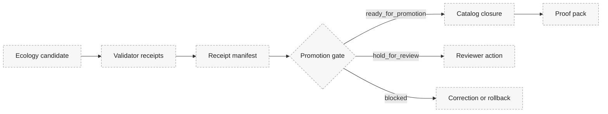

<!-- [KFM_META_BLOCK_V2]
doc_id: kfm://doc/<NEEDS_VERIFICATION_UUID>
title: Ecology Receipt Aggregation
type: standard
version: v1
status: draft
owners: @bartytime4life
created: <NEEDS_VERIFICATION_CREATED_DATE>
updated: 2026-04-24
policy_label: <NEEDS_VERIFICATION_POLICY_LABEL>
related: [
  ../../../tools/validators/ecology_index/README.md,
  ../../../tools/validators/promotion_gate/ecology_index.md,
  ../../../data/receipts/README.md,
  ../../../data/proofs/README.md,
  ../../../schemas/ecology/kfm_eco_index.schema.json
]
tags: [kfm, ecology, receipts, aggregation, promotion, proofs]
notes: [
  "PROPOSED directory README for ecology receipt aggregation.",
  "Does not claim aggregation tooling, manifest schema, or promotion-gate ingestion currently exists.",
  "Target path, related links, policy label, created date, and manifest schema require active-branch verification."
]
[/KFM_META_BLOCK_V2] -->

<a id="top"></a>

# Ecology Receipt Aggregation

Group ecology validator receipts into a reviewable promotion-ready manifest without turning receipts into proofs, catalogs, or canonical truth.


> [!NOTE]
> **Status:** experimental / draft  
> **Truth posture:** `PROPOSED`  
> **Owners:** `@bartytime4life`  
> **Suggested path:** `data/receipts/ecology/README.md` — `NEEDS VERIFICATION`  
> **Audience:** ecology lane maintainers, validator authors, promotion reviewers, proof-pack maintainers

**Quick jumps:** [Scope](#scope) · [Repo fit](#repo-fit) · [Accepted inputs](#accepted-inputs) · [Exclusions](#exclusions) · [Suggested layout](#suggested-layout) · [Manifest shape](#receipt-manifest-shape) · [Aggregation rules](#aggregation-rules) · [Promotion handoff](#promotion-handoff) · [Fail-closed conditions](#fail-closed-conditions) · [Definition of done](#definition-of-done) · [Open verification](#open-verification-items)

---

## Scope

Ecology workflows may produce multiple receipts before a candidate can be promoted or included in a proof pack. This lane defines a proposed place and review pattern for grouping those receipts into one manifest that the promotion gate can inspect.

This document covers receipts for ecology-facing objects such as:

- eco index candidates;
- ecological claims;
- ecology map layers;
- processed ecology artifacts;
- declared candidate dependencies.

The manifest is a grouping and decision object. It does **not** make a candidate true. It says whether the available receipt set appears ready, blocked, or review-bound for the next governed step.

### Reader convention

| Label | Meaning in this document |
|---|---|
| `PROPOSED` | Design guidance or file placement not verified as current implementation. |
| `NEEDS VERIFICATION` | A check required in the active branch before treating the item as current repo fact. |
| `UNKNOWN` | Not resolvable from the currently visible evidence. |

[Back to top](#top)

---

## Repo fit

> [!CAUTION]
> The path and adjacent links below are proposed until verified in the active repository branch.

| Surface | Proposed link from this README | Role |
|---|---:|---|
| Parent receipt lane | [`../README.md`](../README.md) | General receipt storage and naming guidance. |
| Ecology validator | [`../../../tools/validators/ecology_index/README.md`](../../../tools/validators/ecology_index/README.md) | Upstream producer of ecology validator receipts. |
| Promotion gate note | [`../../../tools/validators/promotion_gate/ecology_index.md`](../../../tools/validators/promotion_gate/ecology_index.md) | Downstream consumer or reviewer of aggregated manifest decisions. |
| Ecology schema | [`../../../schemas/ecology/kfm_eco_index.schema.json`](../../../schemas/ecology/kfm_eco_index.schema.json) | Candidate schema whose `spec_hash` may be referenced by receipts. |
| Proof lane | [`../../proofs/README.md`](../../proofs/README.md) | Downstream proof-pack surface; receipts may support proof packs but are not themselves proofs. |

### Upstream / downstream boundary



The diagram is `PROPOSED`. It reflects the intended responsibility boundary, not verified route, tool, or schema implementation.

[Back to top](#top)

---

## Accepted inputs

This directory should contain only ecology receipt instances and receipt-manifest instances that are ready to be reviewed as emitted artifacts.

| Input family | Belongs here? | Notes |
|---|---:|---|
| Ecology validator receipt | Yes | Example: schema validation, semantic join validation, fixture validation. |
| Promotion preflight receipt | Yes | Only when it references the same candidate or a declared dependency. |
| Catalog closure receipt | Yes | Only when it is part of the ecology candidate’s promotion evidence chain. |
| Receipt manifest | Yes | Aggregates receipt refs and states the manifest-level decision. |
| Failed receipt | Yes | Preserve visibly; never overwrite or hide failed receipt history. |
| Declared dependency receipt | Yes, with dependency metadata | Must be labeled as dependency evidence rather than direct candidate evidence. |

[Back to top](#top)

---

## Exclusions

This lane must not become a dumping ground for source data, proof packs, catalog records, or model output.

| Does not belong here | Send it instead to | Why |
|---|---|---|
| RAW, WORK, or QUARANTINE ecology data | Lifecycle storage selected by the active repo | Receipts are emitted validation artifacts, not canonical or working source data. |
| JSON Schema or contract definitions | `../../../schemas/` or `../../../contracts/` after schema-home verification | Definitions are not emitted receipt instances. |
| Proof packs | `../../proofs/` | Proof packs may include receipt refs, but receipts and proofs are different object families. |
| Catalog records | Catalog lane selected by active repo | Catalog closure is downstream of validation and promotion. |
| AI summaries or Focus Mode responses | Governed AI / runtime response surfaces | Generated language must not replace receipt evidence. |
| Public map tiles or layer outputs | Published artifact / layer delivery lane | Receipts can support promotion but are not the public layer itself. |

[Back to top](#top)

---

## Suggested layout

```text
data/receipts/ecology/
├── README.md
├── index/
│   └── <spec_hash>.validator_receipt.json
├── promotion/
│   └── <candidate_id>.promotion_receipts.json
└── manifests/
    └── <candidate_id>.receipt_manifest.json
```

> [!IMPORTANT]
> Layout is `PROPOSED`. Confirm parent `data/receipts/` conventions before creating folders or moving emitted artifacts.

### Directory roles

| Directory | Role | Write rule |
|---|---|---|
| `index/` | Ecology index validator receipts keyed by `spec_hash`. | Append or version; do not overwrite failed receipts. |
| `promotion/` | Promotion preflight and gate-adjacent receipt bundles. | Keep candidate identity explicit. |
| `manifests/` | Aggregated receipt manifests. | Stable ordering; one manifest decision per candidate attempt. |

[Back to top](#top)

---

## Receipt manifest shape

This manifest shape is `PROPOSED` until a schema is verified or created.

```json
{
  "schema_version": "kfm.receipt_manifest.ecology.v1",
  "manifest_id": "kfm.receipt_manifest.ecology.<candidate_id>",
  "candidate": {
    "candidate_id": "<candidate-id>",
    "candidate_type": "eco_index|ecological_claim|map_layer|processed_artifact",
    "candidate_ref": "<repo-or-artifact-ref>",
    "spec_hash": "sha256:<hex>"
  },
  "receipts": [
    {
      "receipt_type": "validator_result",
      "validator": "tools/validators/ecology_index",
      "receipt_ref": "data/receipts/ecology/index/<spec_hash>.validator_receipt.json",
      "decision": "pass",
      "generated_at": "<timestamp>",
      "applies_to": "candidate"
    }
  ],
  "required_receipts": [
    "schema_validation",
    "semantic_join_validation",
    "promotion_preflight"
  ],
  "decision": "ready_for_promotion|hold_for_review|blocked",
  "generated_at": "<timestamp>",
  "notes": [
    "Manifest shape is proposed until schema-home verification is complete."
  ]
}
```

### Decision vocabulary

| Decision | Meaning | Next step |
|---|---|---|
| `ready_for_promotion` | Required receipts are present, well-formed, non-conflicting, and passing. | Send to promotion gate. |
| `hold_for_review` | Receipts are not failing, but a reviewer must resolve unknown type, dependency, policy, or identity issues. | Reviewer decision required. |
| `blocked` | A required receipt failed, is missing, malformed, conflicting, or identity-breaking. | Stop promotion; preserve failure and open correction path. |

[Back to top](#top)

---

## Aggregation rules

| Rule | Requirement | Failure posture |
|---|---|---|
| Same candidate | All direct receipts must reference the same `candidate_id`. | `blocked` |
| Declared dependencies | Dependency receipts must identify their dependency and relation to the candidate. | `hold_for_review` or `blocked` |
| Same spec hash | Validator receipts must match the candidate `spec_hash` unless explicitly scoped to a dependency. | `blocked` |
| No failed required receipts | Any required receipt with `decision = fail` blocks promotion. | `blocked` |
| No unknown receipt types | Unknown receipt type requires review before promotion. | `hold_for_review` |
| Preserve failures | Failed receipts remain visible and must not be overwritten by later passing receipts. | `blocked` if overwritten or hidden |
| Deterministic manifest | Same receipt set should produce stable manifest content except `generated_at`. | `hold_for_review` until determinism is restored |
| Conflict detection | Duplicate `receipt_ref` values with different payload hashes or decisions must be surfaced. | `blocked` |

### Deterministic ordering

Manifest generation should sort receipt entries by:

1. `receipt_type`;
2. `validator`;
3. `receipt_ref`;
4. `generated_at`.

If the active repo later defines a different canonical ordering rule, prefer the verified repo convention and update this section.

[Back to top](#top)

---

## Promotion handoff

```text
validator receipt(s)
  -> receipt manifest
  -> promotion gate
  -> catalog closure
  -> proof pack
```

The handoff is intended to keep each object family inspectable:

| Object | Carries | Must not be mistaken for |
|---|---|---|
| Validator receipt | Result of one validator or preflight action. | Proof pack, catalog, canonical data. |
| Receipt manifest | Grouping and manifest-level readiness decision. | Promotion decision unless promotion gate adopts it. |
| Promotion gate output | Gate decision and obligations. | Raw validator log. |
| Catalog closure | Publication/catalog completeness evidence. | Canonical truth. |
| Proof pack | Higher-order evidence bundle for review, audit, or promotion. | Receipt storage. |

[Back to top](#top)

---

## Fail-closed conditions

Aggregation must fail closed when any of the following are true:

- required validator receipt is missing;
- any required receipt has `decision = fail`;
- receipt `spec_hash` differs from manifest `spec_hash` without a declared dependency reason;
- receipt is malformed or cannot be parsed;
- duplicate receipt refs conflict;
- candidate identity cannot be resolved;
- receipt type is unknown and no reviewer override is recorded;
- failed receipt history is missing after a known failed run;
- manifest decision cannot be reproduced from the receipt set.

[Back to top](#top)

---

## Manual review checklist

Until aggregation tooling is verified, use this checklist before handing a manifest to promotion review.

| Check | Status |
|---|---|
| Candidate ID is stable and matches every direct receipt. | `NEEDS VERIFICATION` |
| Candidate type is one of the accepted manifest values. | `NEEDS VERIFICATION` |
| Candidate `spec_hash` is present and normalized. | `NEEDS VERIFICATION` |
| Required receipt list is declared. | `NEEDS VERIFICATION` |
| Every required receipt is present. | `NEEDS VERIFICATION` |
| No required receipt is failed. | `NEEDS VERIFICATION` |
| Failed receipts remain visible in storage. | `NEEDS VERIFICATION` |
| Duplicate receipt refs do not conflict. | `NEEDS VERIFICATION` |
| Unknown receipt types are routed to reviewer action. | `NEEDS VERIFICATION` |
| Promotion handoff target is confirmed. | `NEEDS VERIFICATION` |

[Back to top](#top)

---

## Definition of done

This README can move from `draft` to `review` only after the active branch confirms or updates the proposed homes and adds executable support where needed.

- [ ] `data/receipts/ecology/` exists or an ADR selects a different ecology receipt home.
- [ ] Parent receipt README links this lane or explicitly rejects this lane.
- [ ] Manifest schema home is confirmed.
- [ ] At least one valid manifest fixture exists.
- [ ] At least one invalid fixture covers each fail-closed condition.
- [ ] Aggregation tooling or manual runbook names the emitted receipt manifest path.
- [ ] Promotion gate documentation states whether it consumes `receipt_manifest.json` directly.
- [ ] Proof-pack documentation states how receipt refs are included or excluded.
- [ ] Failed receipt preservation is tested or documented as a reviewer obligation.
- [ ] Policy label, created date, and `doc_id` are resolved in the meta block.

[Back to top](#top)

---

## Open verification items

| Item | Status | Why it matters |
|---|---:|---|
| `doc_id` UUID | `NEEDS VERIFICATION` | Avoids fabricated document identity. |
| Created date | `NEEDS VERIFICATION` | Must reflect repo/document creation history. |
| Policy label | `NEEDS VERIFICATION` | Determines publication and access posture. |
| Target path | `NEEDS VERIFICATION` | Prevents creating a parallel receipt lane. |
| Manifest schema path | `NEEDS VERIFICATION` | Determines executable validation home. |
| Aggregation tool path | `NEEDS VERIFICATION` | Avoids claiming non-existent automation. |
| Candidate ID convention | `NEEDS VERIFICATION` | Required for deterministic grouping. |
| Receipt storage layout | `NEEDS VERIFICATION` | Prevents sprawl across receipt/proof/catalog directories. |
| Promotion gate manifest ingestion | `NEEDS VERIFICATION` | Determines whether manifest is consumed directly or reviewed manually. |
| Proof-pack handoff | `NEEDS VERIFICATION` | Keeps receipts and proofs separate while preserving traceability. |
| Badge targets | `NEEDS VERIFICATION` | Current badges are static placeholders only. |

[Back to top](#top)
