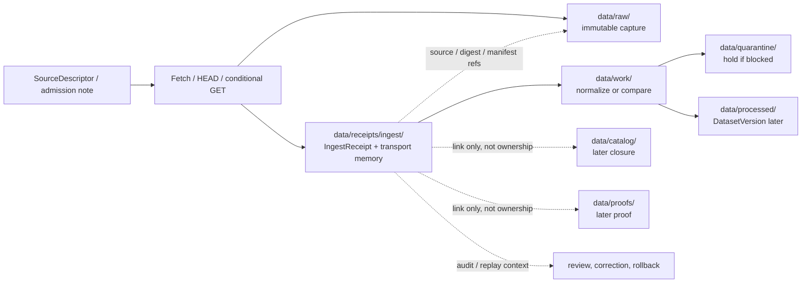

<!--
KFM Meta Block V2
doc_id: kfm://doc/<NEEDS_VERIFICATION_UUID>
title: data/receipts/ingest
type: standard
version: v1
status: draft
owners: @bartytime4life
created: <NEEDS_VERIFICATION_CREATED_DATE>
updated: 2026-04-16
policy_label: <NEEDS_VERIFICATION_POLICY_LABEL>
related:
  - ../README.md
  - ../../README.md
  - ../../raw/README.md
  - ../../work/README.md
  - ../../quarantine/README.md
  - ../../processed/README.md
  - ../../catalog/README.md
  - ../../published/README.md
  - ../../proofs/README.md
  - ../../registry/README.md
  - ../../../contracts/README.md
  - ../../../schemas/README.md
  - ../../../policy/README.md
  - ../../../tests/README.md
  - ../../../tools/validators/README.md
  - ../../../tools/validators/connector_gate/README.md
  - ../../../tools/validators/promotion_gate/README.md
  - ../../../tools/probes/README.md
  - ../../../tools/attest/README.md
  - ../../../.github/workflows/README.md
  - ../../../.github/watchers/README.md
  - ../../../.github/CODEOWNERS
  - ../../../.github/PULL_REQUEST_TEMPLATE.md
tags:
  - kfm
  - data
  - receipts
  - ingest
  - process-memory
  - source-admission
  - raw-landing
notes:
  - Owner is grounded in current public CODEOWNERS coverage used by adjacent `data/` and `.github/` README revisions.
  - Current public `main` proves the parent `data/receipts/` lane but does not yet prove this child lane as checked-in inventory.
  - This README therefore treats `data/receipts/ingest/` as a repo-native target lane aligned to KFM lifecycle doctrine rather than a confirmed public-main subtree.
  - This revision normalizes ingest receipts under the single central `data/receipts/` process-memory doctrine.
  - doc_id, created date, and policy_label remain NEEDS VERIFICATION.
-->

<a id="top"></a>

# `data/receipts/ingest/`

Fetch- and landing-stage **process-memory** lane for source-edge receipts, raw-landing linkage, and replayable intake evidence in KFM.

<div align="left">


</div>

| Field | Value |
|---|---|
| **Status** | experimental |
| **Document status** | draft |
| **Owners** | `@bartytime4life` |
| **Path** | [`data/receipts/ingest/README.md`](./README.md) |
| **Repo fit** | child lane under [`../README.md`](../README.md) |
| **Quick jumps** | [Scope](#scope) · [Repo fit](#repo-fit) · [Accepted inputs](#accepted-inputs) · [Exclusions](#exclusions) · [Current verified snapshot](#current-verified-snapshot) · [Directory tree](#directory-tree) · [Quickstart](#quickstart) · [Usage](#usage) · [Diagram](#diagram) · [Reference tables](#reference-tables) · [Task list](#task-list) · [FAQ](#faq) · [Appendix](#appendix) |

> [!IMPORTANT]
> This child lane is a **repo-native target** for KFM’s source-edge process memory, but it is **not** currently proven as a checked-in public-`main` subtree.
>
> Keep four things separate here:
>
> - **source admission** and raw-landing memory
> - **bounded work / quarantine** state
> - **release-significant proofs**
> - **runtime trust objects**

> [!TIP]
> In KFM terms:
>
> **ingest receipt ≠ raw capture ≠ validation report ≠ proof pack**
>
> This lane should explain **what was attempted or landed** at the source edge, **what immutable capture or manifest it touched**, and **where downstream work continues**.

> [!CAUTION]
> If content here starts behaving like a canonical schema, a release proof, a public runtime object, or an ad hoc raw-data dump, it is in the wrong place.

---

## Scope

`data/receipts/ingest/` is the ingest-facing child lane under `data/receipts/` for **source-edge process memory**.

It exists for the narrow seam where KFM moves from:

- named source admission,
- conditional fetch or landing,
- immutable RAW capture memory,
- and reviewable handoff

into later work, validation, quarantine, and release paths.

This README is intentionally **boundary-first**. It defines role, placement rules, and repo fit without pretending that all lower-level filenames, schemas, or workflow emitters are already settled on the target branch.

### Evidence posture used here

| Marker | Meaning in this README |
|---|---|
| **CONFIRMED** | Directly visible in current public tree state or directly aligned with stable KFM lifecycle doctrine already expressed in neighboring docs |
| **INFERRED** | Conservative completion that fits adjacent checked-in docs, but is not yet directly proven as mounted branch detail |
| **PROPOSED** | Starter shape, filename pattern, or emitter behavior that fits doctrine but is not yet proven as current branch reality |
| **UNKNOWN / NEEDS VERIFICATION** | Any checked-out branch detail, emitted file inventory, exact validator wiring, or schema-home decision not proven from current visible evidence |

### Working rule

Use `data/receipts/ingest/` for receipt-shaped artifacts that must stay easy to resolve during:

- replay of fetch or landing decisions
- correction and rollback investigation
- release review of source-edge behavior
- incident reconstruction
- audit-facing explanation of what entered RAW and why

If a source family keeps its ingest receipts **beside RAW or beside a versioned audited pack**, that is still acceptable. This README governs the **role** of ingest receipts more than one mandatory storage pattern.

### Normalization rule

This child lane assumes **one central process-memory lane**:

```text
data/receipts/
```

That means ingest receipts here are not a second receipt system and not a special run-receipt doctrine.  
They are simply an **ingest-scoped child family** within the broader receipts surface.

If a source-edge receipt describes one bounded fetch or landing event, that still does **not** require a separate sibling lane. It remains a receipt-shaped process-memory object unless repo law explicitly splits the storage model.

[Back to top](#top)

---

## Repo fit

**Path:** `data/receipts/ingest/README.md`  
**Role:** directory README for source-edge process memory inside the broader KFM `data/receipts/` surface.

### Upstream and adjacent anchors

| Relation | Surface | Status | Why it matters |
|---|---|---:|---|
| Parent lane | [`../README.md`](../README.md) | **CONFIRMED** | Defines `data/receipts/` as queryable process memory distinct from proofs, catalog closure, canonical authority, and public runtime truth |
| Source admission | [`../../registry/README.md`](../../registry/README.md) | **CONFIRMED path / INFERRED role** | Source admission should be reviewable before fetch and should carry role, cadence, rights, policy label, semantics, and downstream intent |
| RAW landing | [`../../raw/README.md`](../../raw/README.md) | **CONFIRMED path / CONFIRMED doctrinal role** | Raw bytes and immutable acquisition captures belong in RAW, not in receipt memory |
| Bounded work | [`../../work/README.md`](../../work/README.md) | **CONFIRMED path / CONFIRMED doctrinal role** | Temporary normalization, repair, and transform state should stay separate from committed process memory |
| Hold state | [`../../quarantine/README.md`](../../quarantine/README.md) | **CONFIRMED path / CONFIRMED doctrinal role** | Rights-unclear, invalid, or blocked material should remain explicitly held rather than quietly progressing |
| Later authority | [`../../processed/README.md`](../../processed/README.md) | **CONFIRMED path / CONFIRMED doctrinal role** | `DatasetVersion` and other canonical publishable authority live downstream |
| Later outward closure | [`../../catalog/README.md`](../../catalog/README.md) | **CONFIRMED path / CONFIRMED doctrinal role** | `DCAT + STAC + PROV` closure is a later, different seam |
| Later proof | [`../../proofs/README.md`](../../proofs/README.md) | **CONFIRMED path / CONFIRMED doctrinal role** | Release-significant manifests, attestations, and rollback/correction proof remain stronger trust objects |
| Shared authority | [`../../../contracts/README.md`](../../../contracts/README.md) · [`../../../schemas/README.md`](../../../schemas/README.md) · [`../../../policy/README.md`](../../../policy/README.md) | **CONFIRMED** | Contracts, schema authority, and executable policy must not silently migrate into an ingest receipts lane |
| Adjacent validator boundary | [`../../../tools/validators/connector_gate/README.md`](../../../tools/validators/connector_gate/README.md) | **INFERRED** | Connector admission should emit receipt-shaped process memory on allow, deny, or abstain paths without becoming a release gate |
| Adjacent probe / watcher boundaries | [`../../../tools/probes/README.md`](../../../tools/probes/README.md) · [`../../../.github/watchers/README.md`](../../../.github/watchers/README.md) · [`../../../.github/workflows/README.md`](../../../.github/workflows/README.md) | **CONFIRMED path / INFERRED role** | Probes, watchers, and workflows may emit or validate receipts, but they do not redefine the role of ingest receipts |

### Current verified snapshot

| Item | Status | Current meaning |
|---|---:|---|
| `data/receipts/` exists on public `main` | **CONFIRMED** | The parent process-memory lane is real |
| `data/receipts/README.md` exists | **CONFIRMED** | The parent lane already documents receipt/proof separation and bounded placement rules |
| Current public listing shows additional visible child files or folders under `data/receipts/` | **CONFIRMED no** | Public `main` currently shows the parent lane as README-first |
| `data/receipts/ingest/` is visible on current public `main` | **CONFIRMED no** | This child lane should be treated as a target-branch addition unless the checked-out branch proves otherwise |
| Current public `data/` shows sibling lifecycle directories such as `raw/`, `work/`, `quarantine/`, `processed/`, `catalog/`, `published/`, `proofs/`, and `registry/` | **CONFIRMED** | The broader lifecycle map is already present and should anchor this child lane |
| Parent receipts docs already document `ingest/` as a starter-shape child | **PROPOSED** | This target path is doctrine-aligned even though it is not yet proven as public-main inventory |
| Exact ingest validator, watcher, or workflow emitters | **UNKNOWN / NEEDS VERIFICATION** | The checked-out branch must prove current runnable emitters before this README names them as fact |

[Back to top](#top)

---

## Accepted inputs

Use this child lane for the **smallest reviewable source-edge artifacts** needed to reconstruct what an ingest decision or landing event did.

| Input class | Examples | Why it belongs here |
|---|---|---|
| Admission references | `SourceDescriptor` ref, registry entry ref, admissibility note ref | Ingest receipts should point back to the named source role and rights posture that governed the fetch |
| Ingest receipt body | `IngestReceipt`, fetch receipt, landing receipt, HEAD/conditional-fetch memory | This is the primary process-memory object for the seam |
| Transport-state memory | `ETag`, `Last-Modified`, content length, response code, selected request headers | Explains why a fetch was skipped, repeated, accepted, or held |
| Canonical identity anchors | `spec_hash`, canonical spec ref, dataset key, source family id | Keeps source-edge identity stable without collapsing into transport metadata |
| RAW landing linkage | raw object manifest ref, raw capture digest, immutable object ref | Ties the receipt to what actually landed without storing the source-native bytes here |
| Handoff linkage | work ref, validation ref, quarantine ref, connector-admission ref | Makes the next lane explicit instead of forcing reviewers to infer it |
| Audit and review linkage | `audit_ref`, decision/refusal reference, incident ref | Keeps ingest memory useful during release review and later reconstruction |
| Redacted mirrors | receipt-safe mirror of operational details when direct values are sensitive | Lets the repo retain process memory without leaking secrets or unsafe URLs |

### Input rules

1. Prefer **text-first, diff-friendly** artifacts such as JSON, NDJSON, or YAML.
2. Prefer **stable refs** to raw payloads instead of duplicating source bytes.
3. Preserve **enough transport memory** to explain replay decisions without keeping secrets verbatim.
4. Keep **source identity** and **transport state** separate where possible.
5. If a blocked landing matters later, preserve a **receipt** even when no promotion happens.
6. When a stronger lane already owns the authoritative object, **link** rather than fork it.

[Back to top](#top)

---

## Exclusions

Keep these out of `data/receipts/ingest/` unless there is a very narrow documentation reason.

| Does **not** belong here | Put it here instead | Why |
|---|---|---|
| Raw source bytes, zip files, shapefiles, API payload dumps, or full landing blobs | [`../../raw/README.md`](../../raw/README.md) | RAW owns immutable source-native capture |
| Temporary normalization state, scratch joins, or retry-local caches | [`../../work/README.md`](../../work/README.md) | Work state is bounded and temporary |
| Unresolved rights or sensitivity material treated as “warning only” | [`../../quarantine/README.md`](../../quarantine/README.md) | Hold state must remain explicit |
| `DatasetVersion` or other canonical processed authority | [`../../processed/README.md`](../../processed/README.md) | Ingest memory should point to authority, not replace it |
| `DCAT + STAC + PROV` closure artifacts | [`../../catalog/README.md`](../../catalog/README.md) | Catalog closure is a different seam |
| `ReleaseManifest`, `ReleaseProofPack`, DSSE bundles, attestations, or rollback proof | [`../../proofs/README.md`](../../proofs/README.md) | Proofs are release-significant, not just ingest memory |
| Public runtime envelopes or `EvidenceBundle` payloads | governed runtime / evidence surfaces | Runtime trust objects are downstream consumers |
| Canonical schemas, contracts, or vocab registries | [`../../../contracts/README.md`](../../../contracts/README.md) · [`../../../schemas/README.md`](../../../schemas/README.md) | This lane may consume authority, not fork it |
| Executable policy bundles or deny-by-default rule sources | [`../../../policy/README.md`](../../../policy/README.md) | Policy meaning must stay independently reviewable |
| Secrets, tokens, signed URLs, machine-local dumps, or credentials | secret handling or redacted external reference | Auditability is not permission to leak sensitive operational detail |

> [!WARNING]
> If an ingest receipt starts behaving like a release proof, a raw archive, or a canonical schema, the lane boundary has already slipped.

[Back to top](#top)

---

## Directory tree

### Current public snapshot

```text
data/
└── receipts/
    └── README.md
```

### Proposed target landing shape

```text
data/
└── receipts/
    └── ingest/
        ├── README.md
        └── <source-family>/
            └── <receipt files>
```

### Optional slightly richer landing shape (`PROPOSED`)

```text
data/
└── receipts/
    └── ingest/
        ├── README.md
        ├── <source-family>/
        │   └── <yyyy-mm-dd>/
        │       └── <receipt-id>.json
        └── _lookup/
            └── <small index files>
```

> [!NOTE]
> The trees above are **starter shapes**, not statements that the checked-out branch already exposes them.
>
> If a source lane already keeps ingest receipts beside RAW or beside a versioned audited pack, prefer **stable linking** over gratuitous duplication.

[Back to top](#top)

---

## Quickstart

Start by rechecking the branch you actually plan to change.

### 1) Confirm the current receipt surface

```bash
find data/receipts -maxdepth 4 \( -type f -o -type d \) | sort
```

### 2) Recheck the lifecycle and authority surfaces this lane depends on

```bash
for p in \
  data/receipts/README.md \
  data/raw/README.md \
  data/work/README.md \
  data/quarantine/README.md \
  data/registry/README.md \
  contracts/README.md \
  schemas/README.md \
  policy/README.md \
  tools/validators/connector_gate/README.md \
  tools/probes/README.md \
  .github/watchers/README.md \
  .github/workflows/README.md \
  .github/CODEOWNERS \
  .github/PULL_REQUEST_TEMPLATE.md
do
  echo
  echo "== $p =="
  sed -n '1,260p' "$p" 2>/dev/null || true
done
```

### 3) Inspect ingest-oriented object names before adding new prose

```bash
grep -RIn \
  "SourceDescriptor\|IngestReceipt\|raw object manifest\|request headers\|spec_hash\|conditional-fetch\|etag\|last_modified\|quarantine_ref\|audit_ref" \
  data contracts schemas policy tools docs .github 2>/dev/null || true
```

### 4) Verify what the target branch actually proves

Before merging this README, confirm all four:

1. whether `data/receipts/ingest/` is the intended checked-in path
2. whether the first emitter is a probe, watcher, workflow, script, or lane-local process
3. whether receipt schemas live under `contracts/`, `schemas/`, or a generated/shared surface
4. whether headers, signed URLs, or source terms require redaction before commit

> [!TIP]
> Inspection-first is safer than inventing an ingest subtree or emitter contract in README prose.  
> Let the checked-out branch prove the runner, schema, and gate wiring before this file names them as fact.

[Back to top](#top)

---

## Usage

### What `data/receipts/ingest/` is

`data/receipts/ingest/` is:

- the source-edge home for **fetch and landing process memory** when central receipt placement is useful
- the place where replay, correction, and release review can quickly answer **what source was touched, under what basis, and with what raw-landing outcome**
- a stable bridge between source admission and later work / quarantine / processed / catalog / proof lanes
- a safe place for **receipt-shaped** memory, not a shortcut around raw capture, policy, or release proof

### Placement rules

1. Prefer **small, diff-friendly** JSON/NDJSON/YAML receipts over opaque blobs.
2. Preserve **stable join points** across source, run, raw capture, work, quarantine, release, proof, and audit contexts.
3. Store **refs to raw captures or manifests**, not the source-native bytes themselves.
4. Capture **enough transport memory** to explain skip/re-fetch/accept decisions:
   - status code
   - `ETag`
   - `Last-Modified`
   - selected request headers
   - content length or equivalent
5. Treat `spec_hash` or canonical spec identity as **source-spec identity**, not as a synonym for HTTP transport state.
6. Emit ingest receipts for both **successful** and **blocked** paths when later review depends on them.
7. If a source family already keeps receipt packs beside RAW or beside a versioned audit surface, use **stable linking** instead of duplicating the whole pack here.
8. Redact or externalize secret-bearing operational detail before commit.

### What `data/receipts/ingest/` is not

`data/receipts/ingest/` is **not**:

- a second RAW lane
- a policy bundle lane
- a schema registry
- a proof pack lane
- a public runtime evidence surface
- a generic artifact bucket
- a license to keep unsafe URLs, secrets, or machine-local dumps in Git

### Ingest-stage questions this lane should help answer

A healthy ingest receipt lane should make these questions easy:

1. **What source family or endpoint was being touched?**
2. **What source-admission basis or descriptor governed that touch?**
3. **Why did the system fetch, skip, retry, or hold?**
4. **What immutable raw capture or raw manifest did that action produce?**
5. **Where did the result go next: work, quarantine, or no-change?**

### Normalized receipt rule

An ingest-local object here is still just a **receipt-shaped process-memory artifact**.

That means:

- it belongs under `data/receipts/`
- it does not create a second receipt doctrine
- it may later be referenced by validators, policy, workflows, proofs, or review surfaces without changing artifact class
- it should remain source-edge memory rather than release truth

[Back to top](#top)

---

## Diagram



> [!IMPORTANT]
> The split above is the main boundary to preserve:
>
> - **RAW** owns captured bytes
> - **ingest receipts** own process memory about source-edge actions
> - **later lanes** own validation, publication, proof, and runtime trust

[Back to top](#top)

---

## Reference tables

### Ingest boundary map

| Object family | Normal home | Keep in `data/receipts/ingest/`? | Why |
|---|---|---:|---|
| `SourceDescriptor` | registry / contracts / source-admission surface | **By ref** | Admission authority stays upstream |
| `IngestReceipt` | ingest receipt lane or RAW-adjacent audited surface | **Yes** | This is the primary object this child lane exists to hold |
| raw object manifest | RAW-adjacent or by ref | **Sometimes** | Useful by reference when replay depends on it |
| request-header subset / conditional-fetch evidence | ingest receipt lane | **Yes** | Important for skip/re-fetch reasoning |
| validation-local receipt | validation lane or work/quarantine surface | **Link or sometimes** | Full validation is later than source-edge landing |
| `DatasetVersion` | `processed/` | **No** | Canonical publishable authority belongs elsewhere |
| `DecisionEnvelope` / `ReviewRecord` | control / review lanes | **Link only** | Do not collapse later decision objects into ingest memory |
| `ReleaseManifest` / `ReleaseProofPack` | `proofs/` or release bundle | **No** | Release-significant evidence is not ingest memory |
| `EvidenceBundle` / `RuntimeResponseEnvelope` | runtime / evidence surface | **No** | Runtime trust objects are downstream |
| `CorrectionNotice` | release / published lineage surface | **No** | Public correction lineage should stay visibly correction-bearing |

### Minimum ingest linkage expectations (`PROPOSED starter rule`)

| Link target | Why it matters |
|---|---|
| source or admission reference | reconstruct which governed source basis allowed the action |
| `source_uri` or source-family id | identify what was actually being checked or fetched |
| raw manifest or raw capture reference | prove what landed without storing raw bytes here |
| `spec_hash` or canonical spec ref | anchor source-spec identity beyond transport metadata |
| work / validation / quarantine handoff reference | keep later lane transition explicit |
| proof or release reference | connect forward when later trust objects exist |
| audit reference | support replay, incident reconstruction, or external explanation |

### Starter field pressure (`PROPOSED`)

| Concern | Why it matters | Illustrative fields |
|---|---|---|
| transport change detection | explains skip vs fetch | `etag`, `last_modified`, `content_length`, `status_code` |
| source identity | prevents vague “some endpoint changed” memory | `source_uri`, `dataset_key`, `source_descriptor_ref` |
| canonical source-spec identity | ties later comparison to declared source meaning | `spec_hash`, `canonical_spec_ref` |
| raw landing integrity | proves what immutable capture was touched | `raw_manifest_ref`, `raw_digest`, `artifact_refs` |
| blocked-path visibility | preserves hold/deny/error state for later review | `reason`, `obligations`, `quarantine_ref` |
| audit continuity | supports replay and correction | `run_id`, `audit_ref`, `checked_at` |

[Back to top](#top)

---

## Task list

- [ ] replace meta-block placeholders for `doc_id`, `created`, and `policy_label`
- [ ] verify that the target branch actually introduces `data/receipts/ingest/`
- [ ] confirm whether ingest receipts stay central, RAW-adjacent, or hybrid on the checked-out branch
- [ ] confirm the authoritative schema home before adding any contract-shaped files here
- [ ] add at least one real emitted ingest receipt example once the branch exposes it
- [ ] verify whether transport-state fields need redaction or partial mirroring
- [ ] verify all relative links against the checked-out branch
- [ ] name the first actual emitter path only after it is directly surfaced and reviewable
- [ ] confirm how this lane links into work, quarantine, proof, release, and correction review paths
- [ ] confirm whether watcher or probe families land under a bounded subtree such as `data/receipts/ingest/<source-family>/`

### Definition of done

This README is in a healthy state when:

- it describes the **real current branch** more strongly than hopeful future structure
- it keeps **ingest memory**, **raw capture**, **validation**, **proof**, and **runtime trust** visibly distinct
- it gives contributors a clear home for source-edge receipt artifacts without creating a second authority path
- it keeps source identity, transport memory, and later proof objects connected by references instead of by duplication
- it does not overstate workflow, validator, schema, or branch inventory that the branch cannot prove

[Back to top](#top)

---

## FAQ

### Is this the same as `data/raw/`?

No.

`data/raw/` is where immutable source-native capture belongs.  
`data/receipts/ingest/` is where the **process memory about that capture** belongs.

### Is this the same as `data/receipts/`?

No.

`data/receipts/` is the broader parent zone for receipt-shaped process memory.  
`data/receipts/ingest/` is the narrower child lane for **source-edge fetch and landing** context.

### Is this the same as a later run or pipeline receipt lane?

Not exactly.

A broader receipt may describe normalization, validation, policy, or promotion.  
This child lane should stay focused on **source admission, fetch/landing, and raw-linkage** memory.

### Can a source family keep ingest receipts beside RAW or beside a versioned audited pack instead?

Yes.

KFM doctrine allows **central** receipt placement or **version-adjacent** audited placement.  
What matters is that replay, correction, and release review remain easy and that the boundary stays explicit.

### Can probes, watchers, or workflows emit receipts into this lane?

Yes.

They may emit or validate ingest receipts here **if** the checked-out branch chooses central placement.  
That does not give those surfaces publish authority, schema ownership, or proof ownership.

### Should `ETag`, `Last-Modified`, signed URLs, or tokens be stored verbatim?

Only the replay-relevant subset should survive here.

Keep:

- replay-relevant transport memory
- stable identifiers
- safe metadata

Do **not** commit:

- secrets
- tokens
- machine-local credentials
- unsafe signed URLs
- full private headers when a redacted mirror is sufficient

### Should schemas or policy bundles live here?

No.

This child lane may **consume** or **link to** contracts and policy.  
It must not quietly become their canonical home.

---

## Appendix

<details>
<summary><strong>Illustrative filename patterns</strong> (<code>PROPOSED</code>)</summary>

```text
data/receipts/ingest/<source-family>/<yyyy-mm-dd>/<receipt-id>.json
data/receipts/ingest/<source-family>/<yyyy-mm-dd>/<receipt-id>.ndjson
data/receipts/ingest/_lookup/<source-family>.index.json
```

Use these as starter ideas only.  
The checked-out branch should prove the final pattern before any workflow or validator hard-codes it.

</details>

<details>
<summary><strong>Illustrative JSON shape</strong> (<code>PROPOSED</code>)</summary>

> [!NOTE]
> This is a review aid, not a canonical schema.
> Authoritative machine-contract ownership should stay in the repo’s contract/schema lanes once the checked-out branch settles them.

```json
{
  "kind": "IngestReceipt",
  "version": "v1",
  "run_id": "run-2026-04-16-001",
  "source_uri": "https://example.org/feed.json",
  "dataset_key": "hydrology.example.feed",
  "checked_at": "2026-04-16T12:00:00Z",
  "source_descriptor_ref": "kfm://source/hydrology.example.feed",
  "spec_hash": "<sha256-of-canonical-source-spec>",
  "transport": {
    "status_code": 200,
    "etag": "\"abc123\"",
    "last_modified": "Wed, 15 Apr 2026 18:00:00 GMT",
    "content_length": 18432
  },
  "artifact_refs": {
    "raw_manifest": "kfm://artifact/raw/example-001"
  },
  "handoff_refs": {
    "work": "kfm://work/example-001"
  },
  "audit_ref": "kfm://audit/example-001",
  "notes": "Illustrative only; redact or externalize any unsafe transport details."
}
```

</details>

[Back to top](#top)
