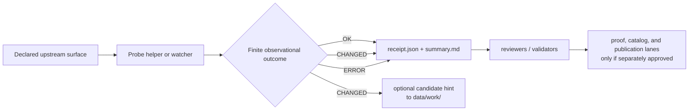

<!-- [KFM_META_BLOCK_V2]
doc_id: kfm://doc/NEEDS_VERIFICATION
title: Probe Receipt Packs (`data/receipts/probes/`)
type: standard
version: v1
status: draft
owners: [@bartytime4life]
created: NEEDS-VERIFICATION
updated: 2026-04-18
policy_label: NEEDS-VERIFICATION
related: [../README.md, ../../README.md, ../../raw/README.md, ../../work/README.md, ../../quarantine/README.md, ../../processed/README.md, ../../catalog/README.md, ../../published/README.md, ../../proofs/README.md, ../../registry/README.md, ../../../tools/probes/README.md, ../../../tools/validators/README.md, ../../../tools/validators/promotion_gate/README.md, ../../../tools/attest/README.md, ../../../contracts/README.md, ../../../schemas/README.md, ../../../policy/README.md, ../../../tests/README.md, ../../../.github/workflows/README.md, ../../../.github/CODEOWNERS, ../../../.github/PULL_REQUEST_TEMPLATE.md]
tags: [kfm, data, receipts, probes, process-memory, watchers, audit, drift]
notes: [Parent `data/receipts/` and sibling `tools/probes/` lanes are current public-main surfaces. This leaf is documented as a truthful landing contract and should not be read as proof that `data/receipts/probes/` is already populated on the target branch. April 2026 probe thin-slice materials are used as the nearest lane-specific baseline. This revision normalizes probe receipts under the single central `data/receipts/` process-memory doctrine while preserving separation from proofs, policy, catalog closure, and publication. doc_id, created date, policy_label, and exact checked-in leaf inventory remain NEEDS VERIFICATION.]
[/KFM_META_BLOCK_V2] -->

<a id="top"></a>

# Probe Receipt Packs (`data/receipts/probes/`)

Receipt-pack landing page for read-only probe runs that observe upstream drift and preserve reviewable process memory without changing KFM trust state.

<div align="left">


</div>

| Field | Value |
|---|---|
| **Status** | experimental |
| **Document status** | draft |
| **Owners** | `@bartytime4life` |
| **Path target** | `data/receipts/probes/README.md` |
| **Role** | probe-scoped child lane under the central `data/receipts/` process-memory surface |
| **Evidence posture** | doctrine-grounded · parent-lane and sibling-lane grounded · exact checked-in subtree inventory remains bounded |
| **Quick jumps** | [Scope](#scope) · [Repo fit](#repo-fit) · [Accepted inputs](#accepted-inputs) · [Exclusions](#exclusions) · [Directory tree](#directory-tree) · [Quickstart](#quickstart) · [Usage](#usage) · [Hydrology probe thread](#hydrology-probe-thread-proposed) · [Diagram](#diagram) · [Reference tables](#reference-tables) · [Task list](#task-list) · [FAQ](#faq) · [Appendix](#appendix) |

> [!IMPORTANT]
> This surface is for **probe receipts and summaries only**.
>
> In KFM terms:
>
> **probe helper ≠ receipt pack ≠ validator ≠ proof ≠ catalog ≠ publication**
>
> A probe may observe change.  
> A probe may not publish or promote that change.

> [!TIP]
> This README assumes **one central process-memory lane**:
>
> ```text
> data/receipts/
> ```
>
> Probe receipts are a **child family** within that lane, not a second receipt doctrine and not a release surface.

> [!WARNING]
> Current public-tree evidence confirms the parent `data/receipts/` lane and the sibling `tools/probes/` lane. It does **not** by itself prove that this leaf already exists on the target branch as a populated subtree.
>
> Treat this README as a **truthful landing contract** for a likely repo leaf, not as a blanket claim of current checked-in inventory.

---

## Scope

`data/receipts/probes/` is the receipt-pack surface for **bounded observation runs**.

Its job is to preserve **process memory** for probe-style automation and operator tooling that:

- checks whether a source or service is reachable
- measures freshness, lag, or visible drift
- compares prior and current counts, timestamps, metadata versions, or geometry hashes
- emits a machine-readable receipt plus a reviewer-readable summary
- hands off a **review candidate hint** without asserting publish authority

This lane answers questions like:

- Did an upstream surface change?
- Was the Kansas-filtered scope stable?
- Did the visible response shape drift?
- Was a candidate work-path identified for downstream review?
- Did the probe finish with a finite observational outcome?

### What this lane is for

Use this surface for **probe-run memory**, not for trust-state movement.

Typical contents include:

- `receipt.json`
- `summary.md`
- optional bounded source-side manifests or tiny sidecar notes
- optional candidate-work hints pointing to `data/work/`

### What this lane is not for

This is **not** the place for:

- published artifacts
- promotion approvals
- policy decisions as authoritative truth
- STAC/DCAT/PROV release closure
- release manifests, attestation bundles, or proof packs
- long-running runtime logic
- schema-home authority

### Normalization rule

This child lane assumes that probe-originated process memory still belongs under the broader central receipts surface:

```text
data/receipts/
```

That means a probe receipt is still just a **receipt type**:

- it belongs under `data/receipts/`
- it may represent one bounded observation run
- it does **not** become a proof or release object because it detected drift
- it may point at `data/work/`, validators, policy, or review without authorizing publication

[Back to top](#top)

---

## Repo fit

`data/receipts/probes/` sits at the intersection of two already-documented surfaces:

- **parent data-side process memory** in [`../README.md`](../README.md)
- **probe/helper behavior** in [`../../../tools/probes/README.md`](../../../tools/probes/README.md)

### Path and adjacent surfaces

| Relation | Surface | Status | Why it matters |
|---|---|---:|---|
| Parent | [`../README.md`](../README.md) | **CONFIRMED** | Defines `data/receipts/` as audit-facing process memory and keeps receipts separate from proofs, catalog closure, and publication |
| Parent family | [`../../README.md`](../../README.md) | **CONFIRMED / INFERRED** | Places receipts in the wider RAW → WORK / QUARANTINE → PROCESSED → CATALOG → PUBLISHED lifecycle |
| Upstream helper lane | [`../../../tools/probes/README.md`](../../../tools/probes/README.md) | **CONFIRMED** | Defines probes as bounded readers/reporters whose main job is observe → summarize → report |
| Validation handoff | [`../../../tools/validators/README.md`](../../../tools/validators/README.md) | **CONFIRMED** | Validators may consume receipts but should not own or redefine them |
| Promotion boundary | [`../../../tools/validators/promotion_gate/README.md`](../../../tools/validators/promotion_gate/README.md) | **INFERRED / NEEDS VERIFICATION** | Probe packs may inform stronger gates later, but do not themselves authorize promotion |
| Work handoff | [`../../work/README.md`](../../work/README.md) | **CONFIRMED path / INFERRED role** | A `CHANGED` probe may point toward `data/work/` for downstream review |
| Proof boundary | [`../../proofs/README.md`](../../proofs/README.md) | **CONFIRMED** | Release-significant evidence belongs there, not here |
| Publication boundary | [`../../published/README.md`](../../published/README.md) | **CONFIRMED** | Publication is downstream of stronger review, closure, and proof |
| Catalog boundary | [`../../catalog/README.md`](../../catalog/README.md) | **CONFIRMED path / INFERRED role** | Catalog surfaces close outward discovery after stronger gates, not at probe time |
| Shared authority | [`../../../contracts/README.md`](../../../contracts/README.md) · [`../../../schemas/README.md`](../../../schemas/README.md) · [`../../../policy/README.md`](../../../policy/README.md) | **CONFIRMED** | Contract grammar, schema authority, and policy logic stay outside receipt packs |
| Automation control | [`../../../.github/workflows/README.md`](../../../.github/workflows/README.md) | **CONFIRMED / INFERRED** | Receipt-bearing probe automation is a documented direction, but exact landed workflow inventory still needs branch verification |

### Current evidence snapshot

| Evidence item | Status | Current meaning |
|---|---:|---|
| `data/receipts/README.md` exists | **CONFIRMED** | The parent receipt lane is real and documented |
| `tools/probes/README.md` exists | **CONFIRMED** | The helper lane that should emit probe outputs is real and documented |
| Current public `data/receipts/` view is README-first | **CONFIRMED** | Public-tree evidence does not yet prove a populated `probes/` subtree |
| April 2026 thin-slice materials use `data/receipts/probes/<source>/<date>/receipt.json` and `summary.md` | **CONFIRMED** | This is the nearest lane-specific structural baseline for this README |
| Exact checked-in presence of `data/receipts/probes/` on the target branch | **NEEDS VERIFICATION** | Recheck before merge |
| Canonical settled machine shape for all probe receipts | **NEEDS VERIFICATION** | Packet examples converge strongly but still show minor field-shape drift |
| Merge-blocking workflows that already emit this leaf today | **UNKNOWN / NEEDS VERIFICATION** | The workflow lane documents receipts-first probe intent, but exact active-branch YAML inventory still needs confirmation |

[Back to top](#top)

---

## Accepted inputs

The following belong in this leaf when the lane is being used correctly:

| Accepted input | Why it belongs here | Typical file |
|---|---|---|
| Machine-readable probe receipt | Primary process-memory object for the observation run | `receipt.json` |
| Reviewer-readable run summary | Human-readable explanation of what drift or non-drift was observed | `summary.md` |
| Declared probe identifiers | Keeps the observation tied to a named helper and source identity | receipt fields |
| Observation-time fields | Preserves replayability and review context | `ran_at`, `as_of` |
| Declared scope/filter inputs | Keeps the observation bounded and inspectable | `spatial_filter`, source-specific scope |
| Prior-state reference | Allows drift comparison without hidden lookup assumptions | `prior_snapshot_ref` |
| Observed drift values | Preserves the measurable reason the receipt exists | counts, versions, hashes, timestamps |
| Optional candidate work-path hint | Allows handoff to downstream review without implying promotion | path under `data/work/` |
| Optional small raw-manifest sidecar | Useful when a tiny, bounded source manifest helps review | `raw-manifest.json` |

### Typical probe receipt fields

The packet family repeatedly converges on fields such as:

- `receipt_type`
- `probe_id`
- `source_id`
- `ran_at`
- `status`
- `inputs`
- `observed`
- `decision_hint` or equivalent handoff fields
- optional `artifacts` / `outputs` sidecars

### Good fit examples

- a Kansas-filtered record-count drift receipt
- a metadata-version drift receipt
- a geometry-hash drift receipt
- a source-reachability probe with finite outcome
- a bounded trust-surface presence probe

[Back to top](#top)

---

## Exclusions

| Does **not** belong here | Put it in | Why |
|---|---|---|
| Executable probe code | [`../../../tools/probes/README.md`](../../../tools/probes/README.md) | Helper logic should stay in the tool lane, not the data lane |
| Published artifacts | [`../../published/README.md`](../../published/README.md) | A probe observes; it does not publish |
| Release manifests, proof packs, signatures, attestation bundles | [`../../proofs/README.md`](../../proofs/README.md) | Proof is stronger than process memory |
| STAC/DCAT/PROV release closure | [`../../catalog/README.md`](../../catalog/README.md) | Discovery/provenance closure is downstream of review |
| Policy authority or policy decisions | [`../../../policy/README.md`](../../../policy/README.md) | Policy remains sovereign and separate |
| Contract ownership | [`../../../contracts/README.md`](../../../contracts/README.md) | Receipt packs may conform to contracts but should not redefine them |
| Canonical schema-home decisions | [`../../../schemas/README.md`](../../../schemas/README.md) | Validation shape authority stays outside this leaf |
| Long-running runtime code or governed API behavior | app/package/runtime lanes | This is a data-side process-memory surface |
| Hidden publish or approval shortcuts | nowhere | KFM doctrine rejects silent trust-state mutation |

[Back to top](#top)

---

## Directory tree

### Current safe public-tree claim

```text
data/receipts/
└── README.md
```

### Branch-target starter shape (`PROPOSED`)

```text
data/receipts/probes/
├── README.md
└── <source_id_family>/
    └── YYYY-MM-DD/
        ├── receipt.json
        ├── summary.md
        └── raw-manifest.json   # optional
```

### Thin-slice example grounded in the April 2026 packet family

```text
data/receipts/probes/
└── usfws/
    └── 2026-04-13/
        ├── receipt.json
        └── summary.md
```

### Placement rule

Use the tree above as a **landing contract**, not as a claim that the target branch already contains all of it.

If a lane already keeps receipt-like process memory:

- beside a versioned dataset release
- beside a lane-local audited surface
- or under a more specific reviewed subtree

prefer **stable linking** over duplicate copies.

[Back to top](#top)

---

## Quickstart

### 1. Inspect the current branch before trusting this leaf

```bash
# inspect what actually exists under the parent receipts surface
find data/receipts -maxdepth 4 \( -type f -o -type d \) | sort

# inspect the neighboring helper and validation lanes
sed -n '1,260p' data/receipts/README.md 2>/dev/null
sed -n '1,260p' tools/probes/README.md 2>/dev/null
sed -n '1,220p' tools/validators/README.md 2>/dev/null
sed -n '1,220p' tools/validators/promotion_gate/README.md 2>/dev/null

# inspect adjacent stronger trust surfaces
sed -n '1,220p' data/proofs/README.md 2>/dev/null
sed -n '1,220p' data/published/README.md 2>/dev/null
sed -n '1,220p' .github/workflows/README.md 2>/dev/null
```

### 2. Search for probe-pack vocabulary before introducing a new shape

```bash
rg -n \
  "probe_receipt|data/receipts/probes|geometry_hash|record_count_current|metadata_version_current|decision_hint|raw-manifest|review_required|stats_receipt|decision_envelope" \
  data tools contracts schemas policy tests .github -S 2>/dev/null
```

### 3. Recheck the leaf itself before merge

```bash
find data/receipts/probes -maxdepth 4 \( -type f -o -type d \) 2>/dev/null | sort
```

> [!TIP]
> If that last command returns nothing, keep this README truthful:
>
> - document the **intended leaf contract**
> - do **not** pretend checked-in receipt packs already exist

[Back to top](#top)

---

## Usage

### Reach for this lane when

Use `data/receipts/probes/` when the main job is:

> **observe → summarize → preserve process memory**

Good fits include:

1. a source-reachability check
2. a freshness or lag observation
3. a Kansas-filtered count comparison
4. a metadata-version drift observation
5. a geometry-hash drift observation
6. a small review handoff that points at `data/work/` without implying promotion

### Do not reach for this lane when

Move out of this surface when the main job becomes:

> **decide → mutate → publish → own trust state**

That means this is the wrong place for:

- release approval
- policy adjudication
- schema authorship
- signed proof assembly
- catalog closure
- publication state changes

### Probe rules that should stay visible here

Receipt packs should preserve the constraints their emitting probes followed:

- use explicitly declared source surfaces
- normalize hashing consistently
- record timestamps in UTC
- avoid hidden retries that change observed semantics
- never enrich observational process memory with silent policy outcomes

### Failure posture

A probe-facing receipt pack should fail closed when observable conditions are not trustworthy enough to summarize cleanly, such as:

- malformed upstream response
- geometry cannot be normalized consistently
- declared source cannot be mapped to registry identity
- Kansas scope cannot be applied deterministically

In those cases, the probe should still produce a bounded record if possible, with a finite non-promotional status such as `ERROR`.

### Normalized receipt rule

A probe receipt here is still just a **receipt-shaped process-memory artifact**.

That means:

- it belongs under `data/receipts/`
- it does not create a second receipt doctrine
- it may later be referenced by validators, policy, workflows, proofs, or review surfaces without changing artifact class
- it should remain observational rather than promotional

[Back to top](#top)

---

## Hydrology probe thread (**PROPOSED**)

A probe-first hydrology watcher can fit this receipt lane **only while** its emitted artifacts remain process memory rather than runtime-proof or publication authority.

### Likely hydrology receipt family

If a streamflow probe lands under `tools/probes/hydro-watcher/`, the most natural receipt-side shape is still a child of the central receipts lane:

```text
data/receipts/probes/
└── usgs-water/
    └── YYYY-MM-DD/
        └── <run_id>.json
```

### What belongs here from that thread

Plausible hydrology probe process-memory artifacts include:

- one `run_receipt` for the streamflow probe run
- bounded request parameters and date windows
- `spec_hash`
- upstream response digests
- a machine-readable run outcome such as `ANSWER`, `ABSTAIN`, `DENY`, or `ERROR` **only as observational process memory**
- links or paths to `data/work/.../records.ndjson` and `run_manifest.json`

### What does **not** move here automatically

The following should remain outside this leaf unless stronger repo evidence says otherwise:

- runtime-proof fixtures
- schema-home contracts
- policy authority
- public-alert publication
- proof packs
- release manifests
- UI-facing evidence drawer logic

### Boundary reminder

A hydrology `decision_envelope.json` or `stats_receipt.json` may exist in a work or event sub-lane as a **PROPOSED** design direction, but that does **not** make this receipt leaf the owner of runtime-proof or baseline authority.

[Back to top](#top)

---

## Diagram



> [!IMPORTANT]
> The probe path ends at **process memory** and **review handoff**.
>
> Stronger trust objects belong to stronger lanes.

[Back to top](#top)

---

## Reference tables

### Finite observational outcomes

| Outcome | Meaning | What it does **not** authorize |
|---|---|---|
| `OK` | No meaningful drift observed | publication, promotion, approval |
| `CHANGED` | Observable drift detected; a review candidate may exist | publication, promotion, proof assembly |
| `ERROR` | Observation failed or source state was unusable | silent retry into trust-state movement |

### Receipt-pack artifacts

| Artifact | Required | Role |
|---|---:|---|
| `receipt.json` | yes | Machine-readable process-memory anchor |
| `summary.md` | yes | Reviewer-readable explanation of what was observed |
| `raw-manifest.json` | no | Optional bounded sidecar for source-memory inspection |
| candidate work-path hint | no | Optional pointer for downstream review only |

### Surface split

| Surface | Main responsibility |
|---|---|
| `tools/probes/` | bounded helper logic and observation CLIs |
| `data/receipts/probes/` | probe-run process memory packs |
| `tools/validators/` | fail-closed checking of declared shapes and linkage |
| `data/proofs/` | release-significant proof objects |
| `data/catalog/` | outward discovery and provenance closure |
| `data/published/` | release-backed materialized scope |

### Illustrative hydrology receipt split

| Artifact | Example location | Role | Boundary reminder |
|---|---|---|---|
| Run receipt | `data/receipts/probes/usgs-water/YYYY-MM-DD/<run_id>.json` | process memory for one bounded probe run | receipt, not proof |
| Work records | `data/work/hydrology/usgs-water/<run_id>/records.ndjson` | staging/work output | not receipt authority |
| Run manifest | `data/work/hydrology/usgs-water/<run_id>/run_manifest.json` | local run summary | not release manifest authority |
| Stats receipt | `data/work/hydrology/usgs-water-events/<run_id>/<site_id>/stats_receipt.json` | bounded baseline fetch memory | **PROPOSED** and not this lane by default |
| Decision envelope | `data/work/hydrology/usgs-water-events/<run_id>/<site_id>/decision_envelope.json` | bounded event summary | **PROPOSED** and not public-alert authority |

[Back to top](#top)

---

## Task list

### Definition of done

- [ ] The target branch is rechecked to confirm whether `data/receipts/probes/` already exists.
- [ ] Parent and sibling lane boundaries remain explicit: probes, receipts, validators, proofs, catalog, and published.
- [ ] No text here implies that `CHANGED` is a publish or promotion decision.
- [ ] At least one grounded example pack is referenced truthfully, or the README clearly stays contract-only.
- [ ] The chosen receipt shape is made explicit if implementation lands (`artifacts` vs `outputs` should not drift silently).
- [ ] Relative links resolve correctly from this leaf.
- [ ] `data/receipts/README.md`, `tools/probes/README.md`, and any new probe docs stay in sync.
- [ ] Unknowns remain visible instead of being rewritten as certainty.
- [ ] Any hydrology-specific examples remain clearly marked **PROPOSED** until the branch inventory is verified.

[Back to top](#top)

---

## FAQ

### Is this the same as `tools/probes/`?

No.

`tools/probes/` is the helper-code lane. `data/receipts/probes/` is the process-memory lane for what those helpers observed.

### Is this the same as `data/proofs/`?

No.

`data/proofs/` is for stronger release-significant trust objects. Probe receipt packs are observational memory, not release proof.

### Does `CHANGED` mean “publish this”?

No.

`CHANGED` means observable drift was detected. It may justify review. It does not authorize publication, promotion, or approval.

### Should policy decisions live here?

No.

Policy may be linked from stronger downstream lanes, but policy authority and policy decision objects should remain separate.

### Why is the directory tree partly proposed?

Because current public-tree evidence confirms the **parent** receipt lane and the **sibling** probe lane, while direct checked-in proof of this exact leaf still needs branch verification.

### Can a probe point at `data/work/`?

Yes, as a **review candidate hint** only.

That is a handoff convenience, not a publication decision.

### Can a hydrology probe receipt live here if the probe emits decision-like objects elsewhere?

Yes. The run receipt can still live here as process memory. That does not grant this lane ownership of runtime-proof, stats-baseline, or publication logic.

[Back to top](#top)

---

## Appendix

<details>
<summary><strong>Illustrative receipt-pack shape grounded to the April 2026 thin slice</strong></summary>

### Example pack

```text
data/receipts/probes/usfws/2026-04-13/
├── receipt.json
└── summary.md
```

### Illustrative `receipt.json`

```json
{
  "receipt_type": "probe_receipt",
  "probe_id": "usfws_critical_habitat_probe",
  "source_id": "usfws_critical_habitat",
  "ran_at": "2026-04-13T14:00:00Z",
  "status": "CHANGED",
  "inputs": {
    "upstream_endpoint": "https://example.invalid/usfws/ecos/critical-habitat/service",
    "spatial_filter": "Kansas",
    "prior_snapshot_ref": "kfm://receipt/probes/usfws/2026-03-15"
  },
  "observed": {
    "record_count_prior": 141,
    "record_count_current": 143,
    "metadata_version_prior": "2025-12-10",
    "metadata_version_current": "2026-02-01",
    "geometry_hash_prior": "sha256:...",
    "geometry_hash_current": "sha256:..."
  },
  "artifacts": {
    "summary_md": "data/receipts/probes/usfws/2026-04-13/summary.md"
  },
  "decision_hint": {
    "next_action": "review_required",
    "promotion_candidate": true
  }
}
```

### Reading rule for this example

This example is **grounded**, but not fully normalized as a settled canonical contract.

The April 2026 packet family shows a small shape tension between:

- `artifacts`
- `outputs`

If the repo lands an executable or schema-backed implementation, normalize that choice deliberately and update this README to match.

</details>

<details>
<summary><strong>Illustrative hydrology run receipt (`PROPOSED`)</strong></summary>

```json
{
  "receipt_type": "run_receipt",
  "run_id": "usgs-water-continuous-00060-06891000-06892350-20260418T000000Z",
  "source_id": "usgs-waterdata-ogc",
  "collection": "continuous",
  "policy_label": "public-safe",
  "spec_hash": "sha256:...",
  "query": {
    "sites": ["06891000", "06892350"],
    "parameter": "00060",
    "start": "2026-03-01T00:00:00Z",
    "end": "2026-04-01T00:00:00Z"
  },
  "outcome": "ANSWER",
  "record_count": 123,
  "artifacts": {
    "records_ndjson": "data/work/hydrology/usgs-water/.../records.ndjson",
    "run_manifest": "data/work/hydrology/usgs-water/.../run_manifest.json"
  }
}
```

### Reading rule for this example

This is a **PROPOSED** design-aligned example only.

It is included so this receipt leaf can acknowledge the likely streamflow watcher direction without claiming that these exact files or fields are already merged on the target branch.

</details>

<details>
<summary><strong>Evidence boundary for this README</strong></summary>

| Claim class | What is safe to say here |
|---|---|
| **CONFIRMED** | `data/receipts/README.md` and `tools/probes/README.md` are real documented lanes; parent receipt doctrine keeps receipts separate from proofs; probe doctrine keeps probes read-only and non-promotional |
| **CONFIRMED** | The April 2026 packet family uses `data/receipts/probes/usfws/2026-04-13/receipt.json` and `summary.md` as a thin-slice example |
| **INFERRED** | This leaf is a strong repo-native fit because parent and sibling lanes already exist and the packet family names a concrete receipt-pack path under them |
| **PROPOSED** | The generalized subtree shape for `data/receipts/probes/<source>/<date>/...` |
| **PROPOSED** | Hydrology run-receipt examples and watcher-aligned receipt vocabulary |
| **UNKNOWN / NEEDS VERIFICATION** | Exact checked-in leaf inventory, final schema authority for probe receipts, exact workflow emitters, and current active-branch automation that writes this path |

</details>

[Back to top](#top)
