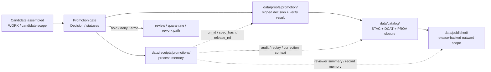

<!--
KFM Meta Block V2
doc_id: kfm://doc/NEEDS-VERIFICATION
title: promotions
type: standard
version: v1
status: draft
owners: @bartytime4life
created: NEEDS-VERIFICATION
updated: 2026-04-16
policy_label: NEEDS-VERIFICATION
related:
  - ../README.md
  - ../../README.md
  - ../../catalog/README.md
  - ../../catalog/stac/README.md
  - ../../catalog/dcat/README.md
  - ../../catalog/prov/README.md
  - ../../proofs/README.md
  - ../../published/README.md
  - ../../../contracts/README.md
  - ../../../schemas/README.md
  - ../../../policy/README.md
  - ../../../tools/validators/README.md
  - ../../../tools/validators/promotion_gate/README.md
  - ../../../tools/attest/README.md
  - ../../../tools/ci/README.md
  - ../../../.github/workflows/README.md
  - ../../../tests/README.md
tags:
  - kfm
  - data
  - receipts
  - promotions
  - process-memory
  - review
  - spec_hash
notes:
  - Child-lane path and emitted subtree contents remain NEEDS VERIFICATION against the checked-out branch.
  - Owner is inherited from surfaced parent-path ownership notes used across adjacent repo-facing docs.
  - This README keeps promotion receipts explicitly separate from proofs, catalog closure, and published scope.
  - This revision normalizes promotion-process memory around the single central `data/receipts/` lane rather than implying a second receipt doctrine.
-->

<a id="top"></a>

# `data/receipts/promotions/`

Promotion-process memory lane for governed promotion receipts, reviewer-facing summaries, and audit-ready handoff context under `data/receipts/`.

<div align="left">


</div>

| Field | Value |
|---|---|
| **Status** | experimental |
| **Owners** | `@bartytime4life` *(inherited from surfaced parent-path ownership notes; leaf-level confirmation still needs checkout proof)* |
| **Path** | `data/receipts/promotions/README.md` |
| **Repo fit** | child lane of [`../README.md`](../README.md) inside the `data/receipts/` process-memory boundary |
| **Quick jumps** | [Scope](#scope) · [Repo fit](#repo-fit) · [Accepted inputs](#accepted-inputs) · [Exclusions](#exclusions) · [Current evidence snapshot](#current-evidence-snapshot) · [Directory tree](#directory-tree) · [Quickstart](#quickstart) · [Usage](#usage) · [Diagram](#diagram) · [Operating tables](#operating-tables) · [Task list](#task-list--definition-of-done) · [FAQ](#faq) · [Appendix](#appendix) |

> [!WARNING]
> This lane is for **promotion-process memory**, not for promotion authority by itself.  
> A file here should help reviewers, replay, correction, and audit. It should **not** silently become the proof pack, the catalog closure, the publish surface, or the policy source of truth.

> [!TIP]
> This README assumes **one central process-memory lane**:
>
> ```text
> data/receipts/
> ```
>
> Promotion receipts are a **child family** within that lane, not a parallel receipt doctrine and not a proof surface.

---

## Scope

`data/receipts/promotions/` is the narrow receipt lane for **promotion-adjacent process memory**.

Use it when the job is to keep one promotion attempt inspectable after candidate assembly and gate evaluation, including:

- a finite machine-readable decision or decision reference
- reviewer-facing summary material that stays subordinate to machine artifacts
- compact promotion-run ledger entries
- audit-ready references to proofs, catalogs, review, and release state

This lane is **not** publication itself.

It exists so that promotion review can answer:

- what candidate was being evaluated
- which `spec_hash` or prior/current identity anchor was in play
- what finite decision or receipt-local outcome was recorded
- where the stronger proof objects live
- how the review trail can be replayed later without reconstructing it from workflow logs

### Normalization rule

This child lane assumes that promotion-process memory belongs under the broader central receipts surface:

```text
data/receipts/
```

That means a promotion receipt is still just a **receipt type**:

- it belongs under `data/receipts/`
- it may describe one bounded promotion attempt
- it does **not** become proof merely because promotion is trust-significant
- it may link to proofs, release refs, catalog refs, and published scope without becoming those objects

[Back to top](#top)

## Repo fit

### Path and neighboring authority surfaces

| Relation | Surface | Why it matters |
|---|---|---|
| Parent | [`../README.md`](../README.md) | Defines the broader receipts boundary: process memory, not proofs |
| Upstream data lane | [`../../README.md`](../../README.md) | Keeps this child lane inside the wider `RAW → WORK / QUARANTINE → PROCESSED → CATALOG → PUBLISHED` lifecycle |
| Adjacent release evidence | [`../../proofs/README.md`](../../proofs/README.md) | Signed decisions, attestation bundles, manifests, and proof packs belong there conceptually |
| Adjacent outward scope | [`../../published/README.md`](../../published/README.md) | Publication is a later, release-backed state, not a receipt file |
| Adjacent catalog closure | [`../../catalog/README.md`](../../catalog/README.md) | `DCAT + STAC + PROV` closure is a separate release seam |
| Validator lane | [`../../../tools/validators/promotion_gate/README.md`](../../../tools/validators/promotion_gate/README.md) | Promotion validation decides readiness; this lane keeps the resulting process memory easy to inspect |
| Attestation lane | [`../../../tools/attest/README.md`](../../../tools/attest/README.md) | Signing and verification helpers may consume receipt refs without becoming receipt ownership |
| Renderer lane | [`../../../tools/ci/README.md`](../../../tools/ci/README.md) | Reviewer Markdown is derived output, not the decision source of truth |
| Contract authority | [`../../../contracts/README.md`](../../../contracts/README.md) | Contract semantics should stay upstream and explicit |
| Schema authority | [`../../../schemas/README.md`](../../../schemas/README.md) | Canonical machine shape belongs in schema surfaces, not inside receipt storage by accident |
| Policy authority | [`../../../policy/README.md`](../../../policy/README.md) | Deny-by-default, obligations, and sensitivity logic remain policy-owned |
| Workflow boundary | [`../../../.github/workflows/README.md`](../../../.github/workflows/README.md) | Orchestration may write or upload receipts, but workflow YAML must not become the only audit surface |

### Repo-fit summary

| Question | Answer |
|---|---|
| What belongs here? | Promotion-process memory that helps replay, review, audit, correction, and incident reconstruction |
| What does **not** belong here? | Proof packs, signed attestations as primary truth, catalog closure, or already published outward scope |
| What should stay linked instead of copied? | Release manifests, signed decisions, STAC/DCAT/PROV records, correction lineage, and proof bundles |
| What is the safest posture? | Keep receipts small, linked, and explicit; keep stronger trust objects elsewhere |

[Back to top](#top)

## Accepted inputs

Promotion receipts should stay **small, linked, and role-correct**.

| Candidate object | Keep here? | Why |
|---|---:|---|
| `decision.json` | Yes, when this lane is the chosen receipt home | A finite machine-readable promotion decision is core process memory |
| `promotion-summary.md` | Sometimes | Reviewer-facing summary is acceptable when it stays derived and subordinate |
| `promotion-record.json` | Yes | Compact governed ledger entry fits the process-memory role |
| `promotion-prov.json` | Sometimes | Useful when the active lane keeps promotion activity memory beside the receipt; stricter splits may move this outward later |
| upstream receipt references | Yes, by link | Promotion often depends on earlier process memory without re-hosting its entire payload |
| `proof_ref`, `release_ref`, `audit_ref` | Yes | This lane should connect forward to stronger trust objects rather than imitate them |
| `reason_codes` / `obligations` | Yes | Review and replay degrade quickly when blocked paths lose reasons |
| reviewer handoff reference | Sometimes | Store a stable pointer if a steward-facing handoff is emitted elsewhere |

### Minimal linkage expectations

A promotion receipt in this lane should be able to point outward to at least most of the following:

| Link target | Why it matters |
|---|---|
| subject reference | identify the candidate, dataset family, or release subject under review |
| `spec_hash` and optional `prior_spec_hash` | preserve deterministic identity and supersession context |
| decision or gate reference | show what finite evaluation result was reached |
| proof reference | connect process memory to signed or release-significant trust objects |
| release reference | tie the receipt forward to the release-bearing unit when one exists |
| catalog reference | help trace outward identity closure |
| audit reference | support incident reconstruction or external explanation |

> [!TIP]
> Prefer **stable references** over bloated inline duplication.  
> The receipt should explain the promotion event, not re-embed every proof artifact.

[Back to top](#top)

## Exclusions

Keep this boundary crisp.

| Do not store here as the primary record | Put it here instead | Why |
|---|---|---|
| `ReleaseManifest` / `ReleaseProofPack` | [`../../proofs/README.md`](../../proofs/README.md) or release-bearing bundle surfaces | Those are release-significant proof objects, not just process memory |
| Signed `DecisionEnvelope` / DSSE / attestation verify results | proof-bearing surfaces plus attestation helpers | Signing and verification strengthen trust, but they are not receipts |
| `DCAT + STAC + PROV` closure docs as the main record | [`../../catalog/README.md`](../../catalog/README.md) and sublanes | Catalog closure is outward discoverability and lineage, not receipt storage |
| Published files or outward materialized release scope | [`../../published/README.md`](../../published/README.md) | Publication is downstream of review and proof |
| Policy bundles or Rego as authority | [`../../../policy/README.md`](../../../policy/README.md) | Policy should remain executable and versioned upstream |
| Generic CI artifacts with no replay or audit value | workflow artifact storage only | Not every log or upload deserves receipt status |
| Raw unresolved inputs, rights-unclear material, or sensitive payloads | `raw/`, `work/`, or `quarantine/` | `promotions/` is not a bypass around admission, rights, or sensitivity control |

[Back to top](#top)

## Current evidence snapshot

| Evidence item | Status | Why it matters here |
|---|---|---|
| `data/receipts/README.md` is the surfaced parent lane | **CONFIRMED** | The parent boundary is real and already process-memory-first |
| Nearby `data/` README surfaces exist (`catalog`, `processed`, `proofs`, `published`, `quarantine`, `raw`, `registry`, `work`) | **CONFIRMED** | Sibling lifecycle boundaries are already part of the repo-facing documentation pattern |
| Receipts vs proofs is a strong KFM doctrine | **CONFIRMED** | This child lane must preserve that split visibly |
| `data/receipts/promotions/` exists on the checked-out branch | **NEEDS VERIFICATION** | This target file is a safe lane-specific landing, but child subtree proof still needs checkout confirmation |
| Promotion-gate validation is described as an experimental thin slice | **DOCUMENTED / NEEDS VERIFICATION** | The surrounding promotion-control surface is concrete enough to document, but exact mounted inventory still needs proof |
| Promotion attestation helpers are documented as separate tools | **DOCUMENTED / NEEDS VERIFICATION** | Supports the boundary rule that signed decisions belong beside proofs, not inside receipts |
| Exact workflow callers, artifact upload rules, and merge-blocking enforcement | **UNKNOWN / NEEDS VERIFICATION** | Do not overclaim CI maturity from README surfaces alone |

[Back to top](#top)

## Directory tree

### Current confirmed parent snapshot

```text
data/receipts/
└── README.md
```

### Confirmed nearby README surfaces

```text
data/
├── README.md
├── catalog/README.md
├── processed/README.md
├── proofs/README.md
├── published/README.md
├── quarantine/README.md
├── raw/README.md
├── receipts/README.md
├── registry/README.md
└── work/README.md
```

> [!NOTE]
> The map above is a **README-surface inventory**, not a claim about every emitted child file or subtree.

### Promotion receipt landing (`PROPOSED`)

```text
data/receipts/promotions/
├── README.md
└── runs/
    └── promote/
        └── <run-id>/
            ├── decision.json
            ├── promotion-summary.md
            ├── promotion-record.json
            └── promotion-prov.json
```

### Stricter receipt / proof split (`PROPOSED`)

```text
data/receipts/promotions/
└── runs/
    └── promote/
        └── <run-id>/
            ├── decision.json
            ├── promotion-summary.md
            └── promotion-record.json

data/proofs/promotion/
└── <candidate-id>/
    └── <spec-hash>/
        ├── decision.dsse.json
        └── verify-result.json
```

### Placement rule

Use the trees above as **starter shapes**, not as claims that those paths already exist on the current branch.

If a lane already keeps promotion receipts beside:

- a dataset version
- a release bundle
- a lane-local audited surface

prefer **stable linking** over gratuitous duplication.

[Back to top](#top)

## Quickstart

Start by rechecking the real branch before relying on the starter layout.

### 1. Inspect the live subtree

```bash
find data/receipts/promotions -maxdepth 5 \( -type f -o -type d \) 2>/dev/null | sort
```

### 2. Recheck the adjacent doctrine and control docs

```bash
for p in \
  data/receipts/README.md \
  data/proofs/README.md \
  data/published/README.md \
  data/catalog/README.md \
  tools/validators/promotion_gate/README.md \
  tools/attest/README.md \
  tools/ci/README.md \
  .github/workflows/README.md \
  contracts/README.md \
  schemas/README.md \
  policy/README.md
do
  echo
  echo "== $p =="
  sed -n '1,260p' "$p" 2>/dev/null || true
done
```

### 3. Inspect promotion-shaped terms and storage hints

```bash
grep -RIn \
  "promotion-record\|promotion-prov\|decision\.json\|DecisionEnvelope\|spec_hash\|proof_ref\|release_ref\|audit_ref\|data/receipts" \
  data tools contracts schemas policy tests .github 2>/dev/null || true
```

### 4. If the documented thin slice is mounted, run the upstream proof surface

```bash
pytest -q tests/validators/test_promotion_gate_e2e.py
```

> [!NOTE]
> Keep the local runner aligned to the **real checked-out branch**.  
> If the target branch uses a different test command, wrapper, or module entrypoint, update this README to the real invocation.

[Back to top](#top)

## Usage

### Write here when the promotion event needs replayable memory

Use this lane when a promotion attempt has already become review-relevant and you need to preserve:

1. which candidate was evaluated
2. which finite decision or receipt-local outcome was recorded
3. which stronger proof objects or catalog objects were linked
4. which reviewer summary or audit reference helps explain the event later

### Keep the receipt small and role-correct

A healthy promotion receipt usually includes:

- stable subject identity
- `spec_hash` and, when relevant, `prior_spec_hash`
- a finite outcome or decision reference
- concise `reason` and explicit `obligations`
- release, proof, and audit references
- only the process-memory fields needed for replay, review, and incident reconstruction

### Do not flatten adjacent lanes

Keep these distinctions visible:

- **validator** decides whether a candidate is promotable
- **receipt** records the process memory of that attempt
- **proof** records the stronger trust objects that justify release
- **catalog** closes outward identity across `DCAT + STAC + PROV`
- **published** is already release-backed outward scope

### Recommended starter pack for one promotion run

```text
<run-id>/
├── decision.json
├── promotion-summary.md
├── promotion-record.json
└── promotion-prov.json
```

Use that pack only when it matches the checked-out branch.  
If the active branch keeps `promotion-prov.json` or the reviewer handoff elsewhere, link to it instead of copying.

### Normalized receipt rule

A promotion receipt here is still just a **receipt-shaped process-memory artifact**.

That means:

- it belongs under `data/receipts/`
- it does not create a second receipt doctrine
- it may later be referenced by validators, policy, proofs, workflows, catalog closure, or published scope without changing artifact class
- it should remain narrower than proof and narrower than publication state

[Back to top](#top)

## Diagram



[Back to top](#top)

## Operating tables

### Promotion receipt boundary map

| Object family | Normal home | Keep in `data/receipts/promotions/`? | Why |
|---|---|---:|---|
| Promotion decision memory (`decision.json`) | promotion receipt surface or lane-adjacent audit surface | **Yes** | Core process memory for one promotion attempt |
| `promotion-summary.md` | receipt-adjacent or CI-rendered review surface | **Sometimes** | Useful when clearly derived and subordinate |
| `promotion-record.json` | promotion receipt surface | **Yes** | Compact ledger entry fits this lane well |
| `promotion-prov.json` | receipt-adjacent or `catalog/prov/` | **Sometimes** | Keep where the real branch stores promotion activity memory |
| Signed decision / DSSE / verify result | proof-bearing surface | **No** | Signed trust artifacts are stronger than receipts |
| `promotion-bundle.json` | proof-bearing or review bundle surface | **Usually no** | Bundle truth should not be collapsed into receipt memory |
| `promotion-bundle-diff*.json` | validator / review bundle surfaces | **No** | Comparison and drift interpretation are adjacent review objects |
| `ReleaseManifest` / `ReleaseProofPack` | proof-bearing surface | **No** | Release truth is not the same as process memory |
| STAC/DCAT/PROV primary records | catalog surfaces | **No** | Outward identity closure is a distinct seam |

### Finite vocabulary map

The corpus currently carries **more than one** finite vocabulary across promotion-adjacent surfaces.  
This lane should preserve those differences rather than flatten them by tone.

| Surface | Current or recommended vocabulary | Meaning |
|---|---|---|
| Standalone policy decision | `ALLOW`, `DENY`, `ABSTAIN`, `ERROR` | Policy reasoning outcome |
| Promotion gate / validator decision | `ANSWER`, `ABSTAIN`, `DENY`, `ERROR` **or** a future-normalized gate vocabulary | Machine decision emitted by the gate surface |
| Receipt-local final outcome | `NO_CHANGE`, `PROMOTED`, `QUARANTINED`, `HELD`, `ERROR` | What happened to the candidate in receipt memory |

> [!CAUTION]
> Grammar normalization is still an active KFM concern.  
> Do not silently replace one surface’s finite vocabulary with another just because the words feel close.

### Minimal link pack for one receipt

| Field or ref | Why it matters |
|---|---|
| `run_id` | keeps the promotion attempt stable across logs, receipts, and review |
| `spec_hash` | anchors candidate identity deterministically |
| `prior_spec_hash` | supports rollback, supersession, or comparison context |
| `reason` / `reason_codes` | keeps blocked or held states inspectable |
| `obligations` | preserves what must happen before trust widens |
| `release_ref` | connects forward to the outward release unit when one exists |
| `proof_ref` | preserves receipt/proof separation while keeping review explainable |
| `audit_ref` | supports incident response or external explanation |
| `summary_ref` | keeps reviewer Markdown derived rather than sovereign |

[Back to top](#top)

## Task list / Definition of done

### Review tasks

- [ ] confirm whether `data/receipts/promotions/` already exists on the checked-out branch
- [ ] confirm whether promotion receipts live centrally, version-adjacently, or in a hybrid pattern
- [ ] confirm the exact emitted filenames for the mounted promotion thin slice
- [ ] recheck all relative links against the target branch
- [ ] add one real emitted promotion receipt example once the branch exposes it
- [ ] confirm whether `promotion-prov.json` belongs here or under `data/catalog/prov/`
- [ ] confirm which workflow or script writes the first real receipt set
- [ ] keep signed decisions and verify results out of this lane unless the branch explicitly models them as receipt-like support objects

### Definition of done

This README is in a healthy state when:

- it describes the **real current branch** more strongly than the starter shape
- it keeps **receipt**, **proof**, **catalog**, **policy**, and **published** roles visibly distinct
- it helps contributors store promotion-process memory without inventing a second authority path
- it does not overclaim mounted workflow inventory, merge-blocking enforcement, or signed proof presence
- it gives reviewers a clear mental model for where promotion memory stops and release proof begins

[Back to top](#top)

## FAQ

### Is this the same thing as `data/proofs/`?

No.

`data/receipts/promotions/` is for **promotion-process memory**.  
`data/proofs/` is for **release-significant evidence** such as manifests, proof packs, signed decisions, attestation bundles, and verification results.

### Does a receipt here mean something was published?

No.

A receipt here means a promotion attempt became replayable and reviewable.  
Publication is a later, release-backed outward state.

### Should signed `DecisionEnvelope` files live here?

Not as the primary trust record.

Link to them from here if needed, but keep the signed artifact and verification result in proof-bearing surfaces.

### Can this lane keep reviewer Markdown?

Yes, when that Markdown is clearly **derived**, **stable**, and **subordinate** to machine artifacts.

`promotion-summary.md` can fit here.  
A fully composed steward handoff may also be referenced from here, but it should not replace the underlying bundle, diff, or decision artifacts.

### Can a dataset version keep promotion receipts beside itself instead?

Yes.

The surrounding receipts doctrine allows lane-adjacent storage when replay and review stay easy.  
What matters is **stable linking**, not one mandatory folder for every lane.

### Should policy bundles or schemas live here?

No.

Keep policy in `policy/`, contracts in `contracts/`, and machine structure in `schemas/`.

[Back to top](#top)

## Appendix

<details>
<summary><strong>Starter storage recipes</strong></summary>

### A. Receipt-first storage recipe

```text
data/receipts/promotions/
└── runs/
    └── promote/
        └── <run-id>/
            ├── decision.json
            ├── promotion-summary.md
            ├── promotion-record.json
            └── summary.ref.txt
```

Use this when the checked-out branch keeps promotion memory central and lightweight.

### B. Split receipt / proof recipe

```text
data/receipts/promotions/
└── runs/
    └── promote/
        └── <run-id>/
            ├── decision.json
            ├── promotion-summary.md
            └── promotion-record.json

data/proofs/promotion/
└── <candidate-id>/
    └── <spec-hash>/
        ├── decision.dsse.json
        ├── verify-result.json
        └── promotion-bundle.json
```

Use this when the branch keeps cryptographic or release-significant artifacts separate from process memory.

### C. Minimal field family checklist

A safe first-wave promotion receipt will usually need some combination of:

- **identity:** `run_id`, `candidate_id`, `spec_hash`, optional `prior_spec_hash`
- **result:** receipt-local final outcome or a linked decision object
- **explanation:** `reason`, `reason_codes`, `obligations`
- **linkage:** `release_ref`, `proof_ref`, `audit_ref`, optional `catalog_ref`
- **review support:** `summary_ref`, optional steward note ref

</details>

[Back to top](#top)
