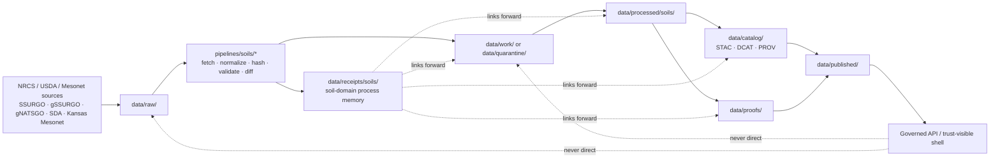

<!-- [KFM_META_BLOCK_V2]
doc_id: kfm://doc/NEEDS_VERIFICATION__data_receipts_soils_readme
title: data/receipts/soils
type: standard
version: v1
status: draft
owners: @bartytime4life
created: NEEDS_VERIFICATION__YYYY-MM-DD
updated: 2026-04-17
policy_label: NEEDS_VERIFICATION__public_safe_or_internal
related: [
  ../README.md,
  ../../README.md,
  ../../raw/README.md,
  ../../work/README.md,
  ../../quarantine/README.md,
  ../../processed/README.md,
  ../../catalog/README.md,
  ../../catalog/stac/README.md,
  ../../catalog/dcat/README.md,
  ../../catalog/prov/README.md,
  ../../published/README.md,
  ../../proofs/README.md,
  ../../registry/README.md,
  ../../../pipelines/README.md,
  ../../../pipelines/soils/README.md,
  ../../../pipelines/soils/gssurgo-ks/README.md,
  ../../../contracts/README.md,
  ../../../schemas/README.md,
  ../../../policy/README.md,
  ../../../tests/README.md,
  ../../../tools/validators/README.md,
  ../../../tools/validators/promotion_gate/README.md,
  ../../../tools/attest/README.md,
  ../../../.github/workflows/README.md,
  ../../../.github/CODEOWNERS
]
tags: [kfm, data, receipts, soils, spec_hash, run_receipt, replay, audit]
notes: [
  "Parent `data/receipts/` lane is strongly evidenced as a real process-memory boundary.",
  "The strongest surfaced soil-specific receipt example currently uses `provenance/receipts/soils/ks/` rather than `data/receipts/soils/`; this README keeps that path tension explicit instead of inventing settled placement.",
  "Owner is inherited from current `/data/` path signals and should be rechecked for this exact leaf before merge.",
  "Created date and final policy label remain verification items."
]
[/KFM_META_BLOCK_V2] -->

<a id="top"></a>

# `data/receipts/soils`

Receipt-scoped **process memory** for soil-domain runs, refresh diffs, validation outcomes, and replay / audit context in KFM.

[](#current-evidence-snapshot)
[](#repo-fit)
[](#scope)
[](#accepted-inputs)
[](#scope)
[](#exclusions)
[](#current-evidence-snapshot)

> [!NOTE]
> **Status:** `experimental`  
> **Document status:** `draft`  
> **Owners:** `@bartytime4life` *(inherited from current `/data/` path signals; verify exact leaf ownership before merge)*  
> **Path:** `data/receipts/soils/README.md`  
> **Repo fit:** child README for soil-domain process memory beneath the broader [`data/receipts/`](../README.md) lane  
> **Accepted inputs:** soil receipt artifacts, validator-linked run memory, small diff summaries, source-validator state, and forward links into processed, catalog, proof, or quarantine surfaces  
> **Exclusions:** raw source captures, canonical processed artifacts, catalog closure records, proof packs, policy bundles, schema authority, and public runtime envelopes

**Quick jumps:** [Scope](#scope) · [Repo fit](#repo-fit) · [Accepted inputs](#accepted-inputs) · [Exclusions](#exclusions) · [Current evidence snapshot](#current-evidence-snapshot) · [Directory tree](#directory-tree) · [Quickstart](#quickstart) · [Usage](#usage) · [Diagram](#diagram) · [Reference tables](#reference-tables) · [Task list](#task-list) · [FAQ](#faq) · [Appendix](#appendix)

> [!IMPORTANT]
> This file is written as a **repo-ready child-lane addition**.
>
> The parent `data/receipts/` lane is a real public-facing repo surface in the supplied evidence, but the exact `data/receipts/soils/` child subtree is still **INFERRED / NEEDS VERIFICATION** unless the checked-out branch proves it directly.

> [!TIP]
> In KFM terms:
>
> **soil receipt ≠ processed soil dataset ≠ catalog closure ≠ proof pack**
>
> This lane keeps soil-domain **process memory** reviewable without flattening `processed/`, `catalog/`, `proofs/`, or `published/` into one object family.

> [!CAUTION]
> Do not let this child lane become:
>
> - a shadow home for raw `SSURGO` / `gSSURGO` / `gNATSGO` captures
> - a second `data/proofs/` lane
> - a stealth schema registry
> - a quiet substitute for `policy/`, `contracts/`, or `schemas/`
> - a place where outward release truth is implied by file presence alone

---

## Scope

`data/receipts/soils/` is the narrow process-memory lane for **soil-domain receipt artifacts** that must stay resolvable during replay, correction, release review, and incident reconstruction.

This README is intentionally narrower than the parent [`../README.md`](../README.md) zone doc. It exists to answer questions such as:

- what soil subject, batch, or snapshot was checked
- which `run_id` and `spec_hash` the run belongs to
- which source validator state mattered
- what changed, what did not, and why
- what stronger downstream surface should be inspected next

### Working rule

Use this lane for **small, machine-readable soil receipts** that explain one governed run or check without pretending to be:

- the canonical processed soil dataset
- the outward `STAC + DCAT + PROV` closure record
- the release-significant proof bundle
- the public runtime answer object

### Name caution

This child path does **not** settle the canonical machine-object name by itself.

The branch may ultimately prove:

- a lane-local `run_receipt`
- a `ValidationReport`
- a receipt wrapper with soil-specific keys
- a hybrid pattern where central receipts link to version-adjacent audited packs

This README therefore documents the **boundary and role first**, not a prematurely canonized schema label.

[Back to top](#top)

---

## Repo fit

**Path:** `data/receipts/soils/README.md`  
**Role:** soil-specific child README for process memory beneath the broader `data/receipts/` lane

### Path and adjacent surfaces

| Relation | Surface | Status | Why it matters |
|---|---|---:|---|
| Parent lane | [`../README.md`](../README.md) | **CONFIRMED** | Defines `receipts/` as replay-, correction-, review-, and audit-facing process memory |
| Parent `data/` lifecycle | [`../../README.md`](../../README.md) | **CONFIRMED via adjacent documentation** | Keeps this child lane inside the broader truth-path surface |
| Adjacent lifecycle | [`../../raw/README.md`](../../raw/README.md) · [`../../work/README.md`](../../work/README.md) · [`../../quarantine/README.md`](../../quarantine/README.md) · [`../../processed/README.md`](../../processed/README.md) · [`../../catalog/README.md`](../../catalog/README.md) · [`../../published/README.md`](../../published/README.md) · [`../../proofs/README.md`](../../proofs/README.md) · [`../../registry/README.md`](../../registry/README.md) | **CONFIRMED at README-surface level** | Clarifies where soil receipt memory stops and stronger trust objects begin |
| Soil execution lane | [`../../../pipelines/soils/README.md`](../../../pipelines/soils/README.md) | **CONFIRMED** | Parent execution index for soils work |
| Kansas soil slice | [`../../../pipelines/soils/gssurgo-ks/README.md`](../../../pipelines/soils/gssurgo-ks/README.md) | **CONFIRMED** | Closest visible pipeline leaf for Kansas soil work |
| Shared contract boundary | [`../../../contracts/README.md`](../../../contracts/README.md) | **CONFIRMED** | Human-readable contract law should stay there, not be re-authored here |
| Shared schema boundary | [`../../../schemas/README.md`](../../../schemas/README.md) | **CONFIRMED** | Machine shape authority remains upstream |
| Policy authority | [`../../../policy/README.md`](../../../policy/README.md) | **CONFIRMED** | Allow / deny / obligation semantics belong in executable policy surfaces |
| Validator lanes | [`../../../tools/validators/README.md`](../../../tools/validators/README.md) · [`../../../tools/validators/promotion_gate/README.md`](../../../tools/validators/promotion_gate/README.md) | **CONFIRMED** | Validators consume receipt linkage; they do not grant release authority |
| Attestation helper lane | [`../../../tools/attest/README.md`](../../../tools/attest/README.md) | **CONFIRMED / bounded** | Proof-adjacent helpers may complement this lane without redefining it |
| Workflow / control surface | [`../../../.github/workflows/README.md`](../../../.github/workflows/README.md) | **CONFIRMED** | Receipt-bearing automation belongs to the control plane, not to the receipt lane itself |
| Ownership / control clues | [`../../../.github/CODEOWNERS`](../../../.github/CODEOWNERS) | **CONFIRMED at broader path scope** | Current owner signal is inherited, not leaf-proven |

### Boundary rule

Use `data/receipts/soils/` for **soil-domain process memory**.

Do **not** use it to:

- store the canonical soil output pack
- replace `STAC + DCAT + PROV` closure
- inline proof bundles, DSSE payloads, or release manifests
- act as a schema home
- silently settle central-vs-adjacent storage decisions without branch proof

[Back to top](#top)

---

## Accepted inputs

The following belong here when they stay **receipt-shaped**, **soil-specific**, and **reviewable**.

### Strong fits

| Input class | Why it belongs here | Status |
|---|---|---:|
| Soil refresh `run_receipt` | Anchors one governed refresh event to `spec_hash`, source validator state, and outcome | **CONFIRMED doctrine / soil example surfaced** |
| Soil validation-linked receipt | Keeps pass / fail / hold context replayable without collapsing it into proofs | **CONFIRMED doctrine** |
| Soil diff summary keyed to one run | Lets reviewers inspect “what changed” without re-running the whole lane | **INFERRED / PROPOSED starter** |
| Source-validator memory (`ETag`, `Last-Modified`, equivalent) | Explains freshness and no-change decisions | **CONFIRMED direction** |
| Forward refs to processed / catalog / proof / quarantine surfaces | Keeps receipts linked without inlining stronger trust objects | **CONFIRMED doctrine** |
| Small grouped review indexes or lookup aids | Helps replay and incident review at soil-lane scope | **PROPOSED starter** |

### Soil-specific starter fields (`DOCUMENTED starter shape`, not schema authority)

The strongest currently surfaced soil receipt example carries fields in this family:

| Field | Why it matters here | Status |
|---|---|---:|
| `type` | Names the receipt family at run time | **CONFIRMED in soil packet** |
| `source_url` | Records the fetched source surface | **CONFIRMED in soil packet** |
| `fetched_at` | Anchors run timing | **CONFIRMED in soil packet** |
| `etag` / `last_modified` | Supports no-change and refresh reasoning | **CONFIRMED in soil packet** |
| `spec_hash` | Identity anchor for soil refresh and diff logic | **CONFIRMED in soil packet** |
| `artifact_digests` | Links run memory to emitted artifacts without flattening release proof | **CONFIRMED in soil packet** |
| `prov_bundle_url` | Keeps forward provenance linkage visible | **CONFIRMED in soil packet** |
| `run_receipt` path / ref | Makes the receipt locatable from other surfaces | **CONFIRMED in soil packet** |

### Minimum local reading (`PROPOSED starter rule`)

A soil-local receipt or receipt wrapper should make it easy to answer at least these questions:

| Signal | Why it matters |
|---|---|
| `run_id` or equivalent run key | links the receipt to one governed run |
| `spec_hash` | anchors the receipt to the deterministic soil candidate or snapshot |
| `subject_ref`, `dataset_key`, or equivalent | identifies what was actually checked |
| source identity | keeps source-role truth explicit |
| source validators | explains no-change vs changed decisions |
| validator / rule surface | explains what produced the outcome |
| validation or policy outcome | keeps hold / deny / error states reviewable |
| concise reason text | prevents unexplained advancement |
| forward refs | links to processed, catalog, proof, or quarantine surfaces when relevant |

> [!TIP]
> Stable soil identifiers such as `mukey`, `cokey`, and `chkey` may need to remain visible in nearby subject or diff references when the receipt is tied to map-unit or component-level reasoning, but this README does **not** force one canonical keying strategy before branch verification.

[Back to top](#top)

---

## Exclusions

| Does **not** belong here | Put it here instead | Why |
|---|---|---|
| `GeoParquet`, `COG`, `PMTiles`, or other canonical processed soil artifacts | [`../../processed/README.md`](../../processed/README.md) | Canonical authority belongs downstream |
| `STAC + DCAT + PROV` closure docs or sidecars as the main record | [`../../catalog/README.md`](../../catalog/README.md) and child catalog lanes | Outward discoverability and lineage closure are distinct surfaces |
| `ReleaseManifest`, proof pack, DSSE bundle, cosign bundle, attestation payloads | [`../../proofs/README.md`](../../proofs/README.md) | Release-significant evidence is stronger than receipt memory |
| Raw `SSURGO`, `gSSURGO`, `gNATSGO`, `SDA`, or other source-native captures | [`../../raw/README.md`](../../raw/README.md) | This lane is not an intake archive |
| Unresolved rights / sensitivity material | [`../../quarantine/README.md`](../../quarantine/README.md) | Blocked or unclear material should remain explicit |
| Working caches, temp files, or transform intermediates | [`../../work/README.md`](../../work/README.md) | Temporary state should stay bounded |
| Canonical schema or vocabulary registries | [`../../../schemas/README.md`](../../../schemas/README.md) | This child lane is not a schema home |
| Policy bundles or standalone policy-decision records | [`../../../policy/README.md`](../../../policy/README.md) | Policy remains sovereign and separate |
| Public runtime envelopes | governed API and runtime trust surfaces | Runtime truth objects are downstream consumers |

> [!WARNING]
> If a file here starts behaving like a proof pack, a policy bundle, or a public runtime answer object, it is in the wrong place.

[Back to top](#top)

---

## Current evidence snapshot

| Evidence item | Status | Current meaning |
|---|---:|---|
| `data/receipts/README.md` is a real public-main lane | **CONFIRMED** | Parent boundary is documented and process-memory-first |
| Public `data/receipts/` currently appears README-first | **CONFIRMED** | Current public evidence does not prove a populated `soils/` child subtree |
| `pipelines/soils/README.md` exists | **CONFIRMED** | Soil execution family is visible in the repo-facing surface |
| `pipelines/soils/gssurgo-ks/README.md` exists | **CONFIRMED** | There is a small but real Kansas soil execution slice |
| Soils / agriculture are the next strong watcher territory after hydrology and hazards | **CONFIRMED doctrine** | This makes a soil receipts leaf repo-fit rather than arbitrary |
| The strongest surfaced soil receipt example currently writes to `provenance/receipts/soils/ks/` | **CONFIRMED** | Central `data/receipts/soils/` placement remains a normalization decision, not a proven existing path |
| Packet-family first meaningful artifact is a Kansas soils snapshot with `spec_hash`, diff summary, signed `run_receipt`, and catalog-ready outputs | **CONFIRMED / PROPOSED execution target** | Strong direction for what this lane should be able to reference |
| Exact checked-in `data/receipts/soils/` subtree inventory | **NEEDS VERIFICATION** | Do not imply leaf existence from doctrine alone |
| Exact canonical schema home for soil receipts | **NEEDS VERIFICATION** | Human-readable boundary is clearer than machine-home authority right now |

[Back to top](#top)

---

## Directory tree

### Current confirmed snapshot

```text
data/receipts/
└── README.md
```

### Current reading for this child lane

```text
data/receipts/soils/
└── README.md   # target file for this addition; exact live branch presence still needs verification
```

> [!NOTE]
> The snippet above is a **target-file map**, not proof that the child subtree already exists on the current branch.

### Doctrine-aligned starter shape (`PROPOSED`)

```text
data/receipts/soils/
├── README.md
├── ks/
│   ├── refresh/
│   │   └── <run_id-or-spec_hash>.json
│   ├── validation/
│   │   └── <run_id>.json
│   ├── diffs/
│   │   └── <run_id-or-spec_hash>.json
│   └── _lookup/
│       └── latest.json
└── _index/
    └── by-dataset-key.json
```

### Packet-family variant already surfaced elsewhere (`DOCUMENTED`, not normalized here)

```text
provenance/receipts/soils/ks/
└── run-receipt-<spec_hash>.json
```

### Placement rule

Use the trees above as **starter shapes**, not as claims about checked-in inventory.

If the active branch already keeps soil receipts:

- beside a versioned dataset pack
- under a provenance-oriented lane
- or beside a lane-local audited surface

prefer **stable linking** over duplicate copies.

[Back to top](#top)

---

## Quickstart

### 1. Inspect the current branch before trusting this leaf

```bash
find data/receipts -maxdepth 5 \( -type f -o -type d \) 2>/dev/null | sort
find data/receipts/soils -maxdepth 5 \( -type f -o -type d \) 2>/dev/null | sort

sed -n '1,260p' data/receipts/README.md 2>/dev/null || true
sed -n '1,240p' data/work/README.md 2>/dev/null || true
sed -n '1,220p' data/proofs/README.md 2>/dev/null || true
sed -n '1,220p' data/catalog/README.md 2>/dev/null || true
sed -n '1,220p' pipelines/soils/README.md 2>/dev/null || true
sed -n '1,220p' pipelines/soils/gssurgo-ks/README.md 2>/dev/null || true
sed -n '1,220p' tools/validators/README.md 2>/dev/null || true
sed -n '1,220p' tools/validators/promotion_gate/README.md 2>/dev/null || true
```

### 2. Reconfirm soil vocabulary before inventing a new local shape

```bash
git grep -n "mukey\|cokey\|chkey\|spec_hash\|run_receipt\|SSURGO\|gSSURGO\|gNATSGO\|Soil Data Access\|Kansas Mesonet" -- \
  tools data docs policy schemas contracts tests pipelines .github 2>/dev/null || true
```

### 3. Add the smallest credible leaf

```bash
mkdir -p data/receipts/soils/ks/{refresh,validation,diffs,_lookup}
touch data/receipts/soils/README.md
```

### 4. Prefer linking before copying

If the active branch already writes soil receipts under another audited surface, add:

- a stable forward ref
- a tiny lookup file
- or a README-documented routing rule

before you duplicate files.

[Back to top](#top)

---

## Usage

Use this lane when the main question is:

> “What exactly happened in a soil-domain run, which `spec_hash` anchors it, and what should downstream review inspect next?”

### Use this lane when

- the soil candidate already exists and now needs replayable process memory
- deterministic soil snapshotting or diffing matters
- reviewer-visible run history is needed
- downstream promotion should not shoulder basic replay context
- the receipt needs to stay easy to resolve during correction or incident review

### Do not use this lane when

- the main burden is raw ingestion
- the main burden is storing the processed soil artifact itself
- the main burden is `STAC + DCAT + PROV` closure
- the main burden is cryptographic release proof
- the main burden is runtime answer behavior

### Finite outcomes: preserve, do not own

This lane should be able to **carry** finite outcomes used by adjacent validators or policies without pretending to own those grammars.

| Outcome family | Examples | Reading here |
|---|---|---|
| Validation-local | `PASS`, `FAIL`, `SKIPPED`, `ERROR` | acceptable when the producing validator uses them |
| Policy-local | `ALLOW`, `ABSTAIN`, `DENY`, `ERROR` | acceptable when linked from or embedded by a stronger policy surface |
| Release-local | `PROMOTED`, `QUARANTINED`, `HELD`, `ERROR` | useful as forward state, but not this lane’s authority |

> [!IMPORTANT]
> A soil receipt can preserve a result. It should not silently redefine the repo’s runtime, gate, or release-state vocabularies.

### Illustrative receipt shape (`DOCUMENTED starter shape`, not schema authority)

```json
{
  "type": "kfm.run_receipt.soils.ks",
  "source_url": "https://sdmdataaccess.sc.egov.usda.gov/Tabular/post.rest",
  "fetched_at": "2026-04-17T00:00:00Z",
  "etag": "\"NEEDS_VERIFICATION\"",
  "last_modified": "NEEDS_VERIFICATION",
  "spec_hash": "<sha256>",
  "artifact_digests": {
    "components_parquet_sha256": "<sha256>",
    "mukey_cog_sha256": "<sha256>"
  },
  "prov_bundle_url": "https://provenance.kfm/receipts/<spec_hash>.json",
  "run_receipt": "provenance/receipts/soils/ks/run-receipt-<spec_hash>.json"
}
```

### Practical reading rule

If a receipt here mentions:

- `spec_hash`
- diff summary
- artifact digests
- source validators
- proof refs

treat it as **process memory with forward linkage**, not as release proof by itself.

[Back to top](#top)

---

## Diagram



### Reading rule

The critical relationship is not just the left-to-right flow. It is the **separation**:

- receipts preserve soil-lane process memory
- processed surfaces preserve canonical soil outputs
- catalog surfaces preserve outward discoverability and lineage closure
- proof surfaces preserve release-significant trust artifacts

[Back to top](#top)

---

## Reference tables

### Soil receipt boundary map

| Object family | Normal home | Keep in `data/receipts/soils/`? | Why |
|---|---|---:|---|
| Soil `run_receipt` | central or lane-adjacent receipt surface | **Yes** | Core process memory |
| Soil validation-linked receipt / report | central or lane-adjacent receipt surface | **Yes** | Keeps fail-closed outcomes replayable |
| Soil diff summary | receipt lane or version-adjacent audited surface | **Sometimes** | Useful review memory if tightly bound to one run |
| Processed `GeoParquet` / `COG` / `PMTiles` | `processed/` | **No** | Canonical authority belongs elsewhere |
| STAC / DCAT / PROV closure | `catalog/` | **No** | Outward identity closure is distinct |
| `ReleaseManifest` / proof pack / DSSE / cosign bundle | `proofs/` | **No** | Release-significant evidence is stronger than receipt memory |
| `DatasetVersion` | `processed/` | **No** | Stable publishable identity belongs elsewhere |
| Quarantine review state | `quarantine/` | **No** | Blocked-state objects should stay explicit |
| Public runtime envelope | runtime surface | **No** | Downstream consumer, not receipt memory |

### Soil source families this lane may need to reference

| Source family | Typical receipt role | Current posture |
|---|---|---:|
| `SSURGO` / `gSSURGO` / `gNATSGO` / `Soil Data Access` | map-unit snapshot, diff, validation, refresh memory | **CONFIRMED direction** |
| `Kansas Mesonet` | contextual or soil-moisture watcher memory | **CONFIRMED source relevance / broader receipt shape still branch-level** |
| `NRCS SCAN` / `NOAA USCRN` / `SMAP` | watcher-oriented soil-moisture context | **INFERRED / PROPOSED for this exact leaf** |
| `USDA NASS Quick Stats` | agriculture-side context or trigger memory | **INFERRED / PROPOSED for this exact leaf** |

### Minimum linkage expectations (`PROPOSED starter rule`)

| Link target | Why it matters |
|---|---|
| source or admission reference | reconstruct what was touched |
| subject reference | identify the soil subject, dataset, or batch |
| validator or rule reference | explain what produced the outcome |
| processed reference | connect process memory forward to stable output |
| proof reference | connect process memory to stronger trust objects without collapsing them |
| quarantine reference | preserve blocked-state visibility when relevant |
| audit reference | support review, incident reconstruction, or external explanation |

[Back to top](#top)

---

## Task list

### Review checks before merge

- [ ] Replace remaining meta-block placeholders for `doc_id`, `created`, and `policy_label`.
- [ ] Recheck whether `data/receipts/soils/` already exists on the target branch.
- [ ] Decide whether soil receipts stay central under `data/receipts/soils/`, remain provenance-adjacent, or use a hybrid linked pattern.
- [ ] Add one real emitted soil receipt example once the branch exposes it.
- [ ] Confirm whether the strongest current path `provenance/receipts/soils/ks/` is retained, migrated, or linked.
- [ ] Verify all relative links against the checked-out branch.
- [ ] Name the first actual validator, workflow, or writer path only after it is directly surfaced and reviewable.
- [ ] Keep receipt / proof separation explicit in any examples added later.

### Definition of done

This README is in a healthy state when:

- it describes the **real current branch** more strongly than hopeful future structure
- it keeps **soil receipts**, **processed outputs**, **catalog closure**, and **proofs** visibly distinct
- it no longer hides the path tension between central receipts and provenance-adjacent receipt examples
- it gives contributors a clear place to put soil-domain process memory without creating a second authority path

[Back to top](#top)

---

## FAQ

### Is this where the soil `GeoParquet` or `COG` goes?

No.

Those belong in the processed or release-bearing data surfaces, not in a receipts child lane.

### Is `data/receipts/soils/` the same as `provenance/receipts/soils/ks/`?

Not automatically.

The strongest surfaced soil packet currently uses `provenance/receipts/soils/ks/run-receipt-<spec_hash>.json`. This README documents a **repo-fit central receipt landing candidate** under `data/receipts/`, but keeps the path relationship explicit until the branch proves one standard.

### Should signed bundles live here?

No.

Keep DSSE bundles, cosign bundles, and release manifests in proof-bearing surfaces. This lane may link to them, but should not become their authority home.

### Can a processed soil version keep its own receipt pack outside this directory?

Yes.

KFM receipt doctrine allows central or version-adjacent audited storage as long as replay, correction, and release review remain easy. Link cleanly instead of duplicating silently.

### Do soil-moisture watcher receipts belong here too?

Maybe.

The corpus strongly supports soil-moisture watcher logic, but the exact landing pattern for those receipts still needs active-branch confirmation. Use stable linking if another lane already owns that process memory.

### Does a receipt here imply approval?

No.

Receipt presence records process memory. It does **not** imply promotion, proof completeness, or publication.

[Back to top](#top)

---

## Appendix

<details>
<summary><strong>Confirmed current public-tree and doctrine signals</strong></summary>

### Confirmed in the supplied repo-facing material

- `data/receipts/README.md` is a real surfaced lane.
- Current public `data/receipts/` evidence is README-first.
- `data/` visibly includes `catalog/`, `processed/`, `proofs/`, `published/`, `quarantine/`, `raw/`, `receipts/`, `registry/`, and `work/`.
- `pipelines/` visibly includes a soils parent README and a `soils/gssurgo-ks/` child README.
- Public path ownership signals currently route `/data/` through `@bartytime4life`.

### Confirmed in the attached KFM doctrine / material

- Soils, land cover, and agriculture are a strong deterministic watcher territory after hydrology and hazards.
- A meaningful first soils thin slice is a Kansas soils snapshot with:
  - `spec_hash`
  - diff summary
  - signed `run_receipt`
  - catalog-ready outputs
- Stable identifiers such as `MUKEY` make deterministic snapshotting and diffing plausible.
- Source families repeatedly associated with this lane include:
  - `SSURGO`
  - `gSSURGO`
  - `gNATSGO`
  - `Soil Data Access`
  - `Kansas Mesonet`

### Still unproven at leaf depth

- exact `data/receipts/soils/` checked-in subtree inventory
- exact local schema-home path for soil receipt objects
- actual emitted receipt examples on the checked-out branch
- exact workflow callers, upload rules, and merge-blocking enforcement for this leaf

</details>

[Back to top](#top)
