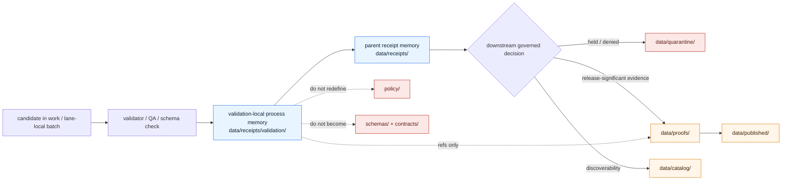

<!--
KFM Meta Block V2
doc_id: kfm://doc/NEEDS_VERIFICATION__data_receipts_validation_readme
title: data/receipts/validation
type: standard
version: v1
status: draft
owners: @bartytime4life
created: NEEDS_VERIFICATION__YYYY-MM-DD
updated: 2026-04-16
policy_label: NEEDS_VERIFICATION__public_safe_or_internal
related:
  - ../README.md
  - ../../README.md
  - ../../raw/README.md
  - ../../work/README.md
  - ../../quarantine/README.md
  - ../../processed/README.md
  - ../../catalog/README.md
  - ../../published/README.md
  - ../../proofs/README.md
  - ../../registry/README.md
  - ../../../contracts/README.md
  - ../../../schemas/README.md
  - ../../../policy/README.md
  - ../../../tests/README.md
  - ../../../tools/validators/README.md
  - ../../../tools/validators/promotion_gate/README.md
  - ../../../tools/attest/README.md
  - ../../../.github/workflows/README.md
  - ../../../.github/CODEOWNERS
  - ../../../.github/PULL_REQUEST_TEMPLATE.md
tags:
  - kfm
  - data
  - receipts
  - validation
  - process-memory
  - replay
  - audit
notes:
  - Parent `data/receipts/` is confirmed as a real public-main README-first lane; this child README is written as a repo-fit addition aligned to that parent doctrine rather than as proof that the leaf subtree already exists.
  - Owner is inherited from current parent-path public signals and should still be rechecked for this exact leaf path.
  - This revision normalizes validation memory around the single central `data/receipts/` process-memory lane rather than implying a parallel receipt doctrine.
  - doc_id, created date, and policy_label remain NEEDS VERIFICATION.
-->

<a id="top"></a>

# `data/receipts/validation/`

Receipt-linked validation lane for governed process-memory artifacts that explain what was checked, against what subject, and with what fail-closed outcome.

<div align="left">


</div>

| Field | Value |
|---|---|
| **Status** | experimental |
| **Document status** | draft |
| **Owners** | `@bartytime4life` *(inherited from current parent-path signals; verify exact leaf ownership before merge)* |
| **Path** | `data/receipts/validation/README.md` |
| **Role** | child README for validation-specific process memory under the broader `data/receipts/` lane |
| **Quick jumps** | [Scope](#scope) · [Repo fit](#repo-fit) · [Accepted inputs](#accepted-inputs) · [Exclusions](#exclusions) · [Directory tree](#directory-tree) · [Quickstart](#quickstart) · [Usage](#usage) · [Diagram](#diagram) · [Reference tables](#reference-tables) · [Task list](#task-list) · [FAQ](#faq) · [Appendix](#appendix) |

> [!IMPORTANT]
> This file is written as a **repo-ready child-lane addition**.
>
> The parent `data/receipts/` lane is a real public-main surface, but the exact `validation/` child subtree is still **INFERRED / NEEDS VERIFICATION** unless the checked-out branch proves it.

> [!TIP]
> In KFM terms:
>
> **validation receipt ≠ proof ≠ policy decision ≠ promotion result**
>
> This lane keeps **validation-linked process memory** reviewable without flattening policy, quarantine, proof, or publication into one object.

> [!CAUTION]
> Do not let this child lane become:
>
> - a stealth schema home
> - a second `data/proofs/` lane
> - a generic CI artifact dump
> - a quiet substitute for `policy/`, `contracts/`, or `schemas/`

---

## Scope

`data/receipts/validation/` is the narrow process-memory lane for **validation-linked receipt artifacts** that must stay resolvable during replay, correction, release review, and incident reconstruction.

This README is intentionally narrower than the parent `data/receipts/` zone doc. It does three things:

1. defines what belongs in a validation-specific receipts child lane
2. keeps receipt/proof/policy/promotion boundaries explicit
3. preserves uncertainty where the current branch has not yet proved leaf-level inventory

### Working rule

Use this lane for small, machine-readable records that answer questions such as:

- what subject or batch was validated
- which `run_id` and `spec_hash` the validation belongs to
- what validator or check surface ran
- what the validation outcome was
- what the next governed handoff should inspect

If an artifact starts behaving like release proof, a policy decision record, or a public runtime trust object, it belongs elsewhere.

### Normalization rule

This child path assumes **one central process-memory lane**:

```text
data/receipts/
```

That means validation-linked receipts here are not a special second receipt system.  
They are simply a **validation-scoped child family** within the broader receipts surface.

If a validation artifact is tied to one bounded run, that does **not** by itself require a second sibling storage doctrine. It remains a receipt-shaped process-memory object unless repo law explicitly splits it further.

### Name caution

This child path does **not** settle the canonical object-family name by itself.

The branch may ultimately prove a lane-local `ValidationReport`, receipt wrapper, or another machine-contract name. This README therefore documents the **boundary and role** first, not a prematurely canonized schema label.

[Back to top](#top)

---

## Repo fit

**Path:** `data/receipts/validation/README.md`  
**Role:** child README for validation-specific process memory under the broader `data/receipts/` lane.

### Path and adjacent surfaces

| Relation | Surface | Status | Why it matters |
|---|---|---:|---|
| Parent lane | [`../README.md`](../README.md) | **CONFIRMED** | Defines `receipts/` as process memory and keeps receipts separate from proofs, catalogs, and publication |
| Parent `data/` lifecycle | [`../../README.md`](../../README.md) | **CONFIRMED via adjacent documentation** | Keeps this child lane inside the broader truth-path surface |
| Adjacent lifecycle | [`../../raw/README.md`](../../raw/README.md) · [`../../work/README.md`](../../work/README.md) · [`../../quarantine/README.md`](../../quarantine/README.md) · [`../../processed/README.md`](../../processed/README.md) · [`../../catalog/README.md`](../../catalog/README.md) · [`../../published/README.md`](../../published/README.md) · [`../../proofs/README.md`](../../proofs/README.md) · [`../../registry/README.md`](../../registry/README.md) | **CONFIRMED at README-surface level** | Clarifies where validation memory stops and stronger trust or outward objects begin |
| Shared contract boundary | [`../../../contracts/README.md`](../../../contracts/README.md) | **CONFIRMED** | Human-readable contract law should stay there, not be re-authored here |
| Shared schema boundary | [`../../../schemas/README.md`](../../../schemas/README.md) | **CONFIRMED** | Machine shape and schema-home authority remain upstream concerns |
| Policy authority | [`../../../policy/README.md`](../../../policy/README.md) | **CONFIRMED** | Allow/deny/obligation semantics belong in executable policy surfaces |
| Verification families | [`../../../tests/README.md`](../../../tests/README.md) | **CONFIRMED** | Fixtures and fail-closed validator proof should usually live under `tests/`, not in process-memory storage |
| Validator lanes | [`../../../tools/validators/README.md`](../../../tools/validators/README.md) · [`../../../tools/validators/promotion_gate/README.md`](../../../tools/validators/promotion_gate/README.md) | **CONFIRMED** | Validation tooling consumes these objects; it does not grant them release authority |
| Workflow/control surface | [`../../../.github/workflows/README.md`](../../../.github/workflows/README.md) | **CONFIRMED** | Receipt-bearing automation is part of the trust membrane, but exact branch-level workflow coverage still needs verification |

### Current reading of this child path

| Claim | Status | Reading rule |
|---|---:|---|
| `data/receipts/` is a real public-main directory | **CONFIRMED** | Parent lane is present and README-first |
| `data/receipts/validation/` exists on the current public branch | **UNKNOWN / NEEDS VERIFICATION** | The target path is repo-fit and doctrine-fit, but leaf inventory was not directly surfaced |
| Parent receipts starter shape naturally pressures a `validation/` child lane | **PROPOSED / strongly supported** | Good fit for a new child README, not proof of pre-existing subtree |
| Validation memory should stay distinct from proofs and promotion outputs | **CONFIRMED doctrine** | This is a boundary rule, not a cosmetic preference |

### Path reconciliation note

The current repo-facing materials point to **two adjacent authority seams**, and this README should not pick a winner silently:

- [`../../../contracts/README.md`](../../../contracts/README.md) for human-readable contract law
- [`../../../schemas/README.md`](../../../schemas/README.md) and visible schema subtrees for machine-file shape

This child lane should **consume** whichever authority the branch actually settles, not manufacture a second schema universe in `data/receipts/validation/`.

[Back to top](#top)

---

## Accepted inputs

Only keep artifacts here if they are small, replay-relevant, and validation-local.

| Accepted input | Why it belongs here | Posture |
|---|---|---|
| Receipt-linked validation record for one run or batch | Preserves what was checked and how the run moved forward | **INFERRED / repo-fit** |
| Validation outcome memory tied by `run_id` and `spec_hash` | Keeps cross-object linkage reconstructable | **CONFIRMED doctrine / PROPOSED local lane** |
| Compact QC or validator outputs that explain `PASS`, `FAIL`, `SKIPPED`, or `ERROR` | Useful for replay, correction, incident review, and release review | **INFERRED** |
| References to candidate artifacts, proof refs, or quarantine refs | Keeps this lane linked without inlining stronger trust objects | **CONFIRMED doctrine** |
| Small grouped review indexes or lookup aids | Can make repeated audit/replay work easier without replacing authority | **PROPOSED starter** |

### Minimum local reading (`PROPOSED starter rule`)

A validation-local receipt or report should make it easy to answer at least these questions:

| Signal | Why it matters |
|---|---|
| `run_id` | links this validation memory to a governed run |
| `spec_hash` | anchors the validation against canonical source identity |
| `subject_ref` or `dataset_key` | identifies what was actually checked |
| validator / schema / rule surface | explains what produced the outcome |
| validation outcome | shows the validator-local result without jumping ahead to release truth |
| reason codes or concise reason text | keeps failure and hold states reviewable |
| forward refs | link to parent receipts, proof refs, or `QuarantineRecord` when relevant |

[Back to top](#top)

---

## Exclusions

| Does **not** belong here | Put it here instead | Why |
|---|---|---|
| Proof packs, DSSE bundles, attestations, or release manifests | [`../../proofs/README.md`](../../proofs/README.md) and release-bearing surfaces | Those are release-significant trust objects, not validation memory |
| Standalone `PolicyDecision` records | contract/schema/policy-owned surfaces | Policy reasoning stays separate and linkable |
| Full quarantine review state | [`../../quarantine/README.md`](../../quarantine/README.md) | Blocked-state objects should remain explicit and separate |
| Canonical schemas or vocabulary registries | [`../../../schemas/README.md`](../../../schemas/README.md) and adjacent schema lanes | `data/receipts/validation/` is not a schema home |
| Generic CI renderer output with no replay/correction role | helper-proof or workflow artifact lanes | Not every summary deserves process-memory status |
| Raw source bytes or unresolved sensitive material | [`../../raw/README.md`](../../raw/README.md) or [`../../quarantine/README.md`](../../quarantine/README.md) | This lane is not a bypass around rights or sensitivity handling |
| Public runtime envelopes or outward catalog payloads | governed API and catalog surfaces | Runtime trust objects and discoverability objects are downstream consumers |
| Working caches or ephemeral temp files | [`../../work/README.md`](../../work/README.md) | Temporary state should stay bounded |

> [!WARNING]
> If a file here starts behaving like a proof pack, a policy bundle, or a public runtime answer object, it is in the wrong place.

[Back to top](#top)

---

## Directory tree

### Current confirmed snapshot

```text
data/receipts/
└── README.md
```

### Current reading for this child lane

```text
data/receipts/validation/
└── README.md   # target file for this addition; exact live branch presence still needs verification
```

> [!NOTE]
> The snippet above is a **target-file map**, not proof that the child subtree already exists on the current branch.

### Doctrine-aligned starter shape (`PROPOSED`)

```text
data/receipts/validation/
├── README.md
├── runs/                    # per-run validation memory grouped by run_id or batch
├── subjects/                # optional grouped views by dataset_key / subject_ref
├── summaries/               # compact review/replay indexes derived from authoritative validation outputs
└── _lookup/                 # tiny resolver aids for grouped review or incident reconstruction
```

### Watcher- and runtime-oriented variant (`PROPOSED`)

```text
data/receipts/validation/
├── watchers/
│   └── <watcher-family>/
│       └── <receipt-linked validation outputs>
└── runtime/
    └── <runtime-proof validation outputs>
```

### Placement rule

Use the trees above as **starter shapes**, not as claims about current checked-in inventory.

If a lane already keeps validation memory beside:

- a `DatasetVersion`
- a lane-local audited pack
- a released or quarantined unit with stable IDs

prefer **stable linking** over gratuitous duplication.

[Back to top](#top)

---

## Quickstart

### Safe inspection commands

```bash
# inspect the parent receipts surface and this child path if it already exists
find data/receipts -maxdepth 4 -type f 2>/dev/null | sort
find data/receipts/validation -maxdepth 4 -type f 2>/dev/null | sort

# re-read adjacent authority surfaces before changing boundaries
for p in \
  data/receipts/README.md \
  data/quarantine/README.md \
  data/proofs/README.md \
  data/work/README.md \
  contracts/README.md \
  schemas/README.md \
  policy/README.md \
  tests/README.md \
  tools/validators/README.md \
  tools/validators/promotion_gate/README.md \
  .github/workflows/README.md
do
  echo
  echo "== $p =="
  sed -n '1,220p' "$p" 2>/dev/null || true
done

# inspect validation/receipt/proof grammar without assuming workflow enforcement
grep -RInE \
  'run_receipt|ValidationReport|validation_outcome|policy_outcome|final_outcome|spec_hash|proof_refs|quarantine_ref|DecisionEnvelope|attestation' \
  data contracts schemas policy tests tools docs .github 2>/dev/null || true
```

### First local review pass

1. Confirm whether the checked-out branch already contains `data/receipts/validation/`.
2. Confirm whether this lane is meant to centralize validation memory, stay version-adjacent, or support a hybrid pattern.
3. Confirm the current schema home before adding any contract-shaped JSON here.
4. Confirm which workflows, if any, emit validation-local receipts or reports into this path.
5. Confirm how this lane links forward to parent receipts, `PolicyDecision`, `QuarantineRecord`, proof refs, and promotion review.

[Back to top](#top)

---

## Usage

### When to write here

Use this lane when the artifact is:

- small enough to stay reviewable
- tied to a governed run by `run_id`
- anchored by `spec_hash` or equivalent stable identity
- useful during replay, correction, audit, or release review
- still narrower than release proof

### When *not* to write here

Do not use this lane when the object’s real job is to:

- authorize policy
- define machine-contract shape
- carry release-significant proof
- become outward publication truth
- stand in for quarantine review state

### Local usage pattern

| If you are storing… | Prefer this reading |
|---|---|
| validator-local pass/fail memory | keep it here if it needs replay/audit value |
| schema-only example fixtures | prefer `tests/` or schema-side fixture lanes |
| promotion-facing decision inputs/outputs | keep them under promotion validator or proof/release surfaces |
| reviewable blocked-state details | link to quarantine rather than flattening them here |
| downstream trust objects | link forward; do not duplicate payloads |

### Illustrative local handoff (`PROPOSED example`)

```text
candidate batch
  → validator / QA surface
  → validation-local receipt or report under data/receipts/validation/
  → parent receipt pack under data/receipts/
  → policy / quarantine / proof / promotion surfaces by reference
```

### Normalized receipt rule

A validation-local object here is still just a **receipt-shaped process-memory artifact**.

That means:

- it belongs under `data/receipts/`
- it does not create a second receipt doctrine
- it may later be referenced by validators, policy, workflows, proofs, or review surfaces without changing artifact class
- it should remain narrower than release proof and narrower than canonical policy or schema authority

[Back to top](#top)

---

## Diagram



[Back to top](#top)

---

## Reference tables

### Outcome layers and what they mean here

| Layer | Grammar | Why this child lane cares | Posture |
|---|---|---|---|
| Validation-local result | `PASS` · `FAIL` · `SKIPPED` · `ERROR` | Explains validator-local judgment without pretending to be release truth | **PROPOSED local use / strongly supported by run-receipt wave** |
| Policy-local result | `ALLOW` · `DENY` · `ABSTAIN` · `ERROR` · `SKIPPED` | May be echoed or linked, but should remain distinct from validation and promotion | **PROPOSED cross-family alignment** |
| Parent receipt final outcome | `NO_CHANGE` · `PROMOTED` · `QUARANTINED` · `HELD` · `ERROR` | Helps this lane know what it may need to link forward to | **PROPOSED cross-family alignment** |
| Promotion-gate result | `PASS` · `HOLD` · `DENY` · `ERROR` | Downstream membrane; do not flatten it back into validation-local memory | **PROPOSED cross-family alignment** |

### Cross-family linkage cues

| Link target | Why it matters here |
|---|---|
| `run_id` | stable run identity across adjacent governed objects |
| `spec_hash` | canonical source-spec identity anchor |
| subject / dataset reference | tells reviewers what was actually validated |
| proof refs | links forward to stronger trust objects without merging roles |
| quarantine ref | keeps blocked-state review visible when validation or policy forces quarantine |
| audit / review ref | helps incident reconstruction and release review |

### Naming pressure for new cross-family reason codes (`PROPOSED`)

Use `lowercase_snake_case` for new cross-family and contract-level reason codes unless a mounted narrow-family validator already owns a narrower legacy form.

Representative families already surfaced in the corpus include:

- `schema_invalid`
- `missing_required_input`
- `spec_hash_mismatch`
- `invalid_final_outcome_mapping`
- `missing_quarantine_ref`
- `attestation_unverified`
- `policy_evaluation_failed`

[Back to top](#top)

---

## Task list

### Minimum credible definition of done

- [ ] This README keeps `validation` memory clearly subordinate to `receipts/`, `policy/`, `schemas/`, and `proofs/`.
- [ ] The file does not imply that `data/receipts/validation/` already exists unless the branch proves it.
- [ ] One meaningful Mermaid diagram explains the child-lane boundary.
- [ ] Accepted inputs and exclusions stay explicit and reviewable.
- [ ] Any path claim below this README is marked **PROPOSED** unless branch-visible.
- [ ] The doc tells maintainers how to verify or downgrade child-lane claims locally.
- [ ] Receipt/proof/policy/quarantine/promotion boundaries remain explicit.
- [ ] Long reference material stays in appendices rather than bloating the main flow.

### Review checks before merge

- [ ] Replace `doc_id`, `created`, and `policy_label` placeholders with repo-backed values.
- [ ] Recheck whether `/data/receipts/validation/` already exists on the active branch before merging this file as a “revision.”
- [ ] Verify whether the exact owner for this leaf path is still inherited from parent-path coverage.
- [ ] Confirm whether validation-local artifacts are emitted centrally here, version-adjacently, or by a hybrid pattern.
- [ ] Confirm the authoritative schema home before referencing a concrete validation schema path.
- [ ] Confirm any workflow names or validator executables before describing them as current branch reality.
- [ ] Add one real emitted example once the active branch proves a live validation artifact path.
- [ ] Keep this file synchronized with `data/receipts/README.md`, `data/quarantine/README.md`, `data/proofs/README.md`, `tools/validators/README.md`, and `.github/workflows/README.md`.

[Back to top](#top)

---

## FAQ

### Is this the same as `data/proofs/`?

No.

This lane is for validation-linked **process memory**. `data/proofs/` is for release-significant evidence such as manifests, attestations, proof packs, and correction or rollback proof.

### Is this where `run-receipt.schema.json` should live?

No.

Current repo-facing doctrine and adjacent docs point toward `contracts/` and `schemas/` as the authority seams for contract shape. `data/receipts/validation/` should consume those seams, not replace them.

### Does a passing validation artifact here mean promotion passed?

No.

Promotion uses a downstream, separate grammar. Validation-local success may support a promotable state, but it does not replace promotion-gate evaluation.

### Should validator fixtures live here?

Usually no.

If the file is a true process-memory artifact from a governed run, it can live here. If it is a stable example used to prove validator behavior, prefer `tests/` or schema-side fixture scaffolds.

### Can watcher-oriented validation receipts land here?

Yes, if the branch intentionally centralizes **receipt-linked validation memory** in this child lane and keeps proof/promotion separation intact. That storage pattern still needs direct branch verification.

[Back to top](#top)

---

## Appendix

<details>
<summary><strong>Appendix A — Direct verification still needed before merge</strong></summary>

Before treating this README as a settled local-checkout description, verify:

- whether `data/receipts/validation/` already exists
- whether the branch uses a central validation-memory lane, version-adjacent packs, or a hybrid
- exact child files, subdirectories, and any emitted artifact filenames
- whether a validator or workflow actually writes to this path
- whether sibling docs use `ValidationReport`, `run_receipt`, or another object name for the same seam
- whether the canonical schema-home decision has moved since the surfaced drafts
- whether this lane should link to `PolicyDecision`, `QuarantineRecord`, `DecisionEnvelope`, or all three in current branch practice
- whether any of the content here should be narrowed because the live branch already split this seam differently

</details>

<details>
<summary><strong>Appendix B — Reading rule if the active branch differs</strong></summary>

If the checked-out branch later differs from this README:

1. preserve the boundary law first
2. replace path claims with branch-visible paths immediately
3. keep **process memory** distinct from **proof**, **policy**, **catalog**, and **publication**
4. keep schema-home uncertainty visible until the branch truly resolves it
5. downgrade any unsupported child-inventory statement to **UNKNOWN** or **NEEDS VERIFICATION**

The goal is not to preserve a guessed subtree.  
The goal is to preserve truthful boundary documentation.

</details>

<details>
<summary><strong>Appendix C — Cross-family reminder</strong></summary>

The current KFM direction repeatedly treats adjacent governed objects as separate but linked:

- validation-local receipts preserve validator-facing process memory
- parent receipts preserve broader process memory
- `PolicyDecision` preserves finite policy reasoning
- `QuarantineRecord` preserves blocked review state
- linkage validation checks consistency across `run_id` and `spec_hash`
- promotion gates evaluate release readiness downstream

This child README therefore keeps validation-local memory **small, linked, and reversible** instead of turning it into a one-file sovereignty layer.

</details>

[Back to top](#top)
