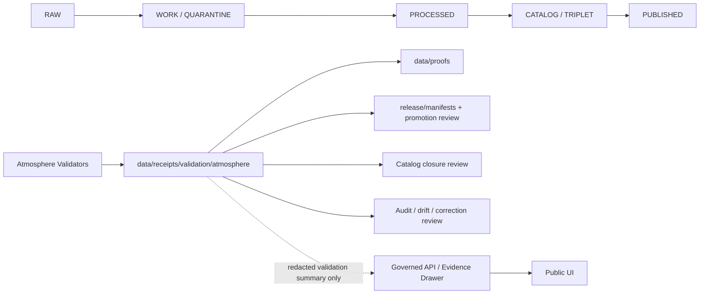

<!-- [KFM_META_BLOCK_V2]
doc_id: kfm://doc/data-receipts-validation-atmosphere-readme
title: Atmosphere Validation Receipts
type: README
version: v0.1
status: draft
owners:
  - <PLACEHOLDER — atmosphere lane steward>
  - <PLACEHOLDER — validation steward>
  - <PLACEHOLDER — release steward>
  - <PLACEHOLDER — docs steward>
created: 2026-06-28
updated: 2026-06-28
policy_label: internal-governance
related:
  - data/receipts/README.md
  - data/receipts/validation/README.md
  - data/proofs/README.md
  - data/catalog/README.md
  - data/registry/README.md
  - release/manifests/
  - contracts/
  - schemas/contracts/v1/
  - policy/
  - docs/doctrine/directory-rules.md
tags:
  - kfm
  - data
  - receipts
  - validation
  - atmosphere
  - air
  - evidence
  - policy
  - knowledge-character
notes:
  - "README created as a repo-ready draft for data/receipts/validation/atmosphere/README.md."
  - "Parent path, validator names, schemas, fixtures, and emitted receipt examples remain NEEDS VERIFICATION until checked in a mounted repository."
  - "Atmosphere validation receipts are internal governance records. They are not public air-quality guidance, emergency alerts, source data, catalog records, proof packs, or release decisions."
[/KFM_META_BLOCK_V2] -->

<a id="top"></a>

# Atmosphere Validation Receipts

> Deterministic, audit-ready validation receipts for KFM Atmosphere/Air source descriptors, datasets, layer candidates, evidence bundles, policy checks, and release candidates.


| Field | Value |
|---|---|
| **Status** | `draft` |
| **Target path** | `data/receipts/validation/atmosphere/README.md` |
| **Owning root** | `data/` |
| **Lifecycle phase** | `receipts / validation` |
| **Domain lane** | `atmosphere` |
| **Primary audience** | atmosphere lane maintainers, validator authors, source stewards, policy reviewers, release stewards, API/UI maintainers, and auditors |
| **Public posture** | Not a public data surface. Public air, climate, smoke, or Earth-observation summaries must go through governed APIs, released artifacts, EvidenceBundle resolution, policy decisions, and appropriate disclaimers. |
| **Implementation depth** | **NEEDS VERIFICATION** — no live repo checkout, CI run, validator output, emitted receipt, dashboard, or release manifest was inspected while drafting this file. |

**Quick links:** [Scope](#scope) · [Repo fit](#repo-fit) · [Accepted inputs](#accepted-inputs) · [Exclusions](#exclusions) · [Receipt families](#receipt-families) · [Minimum fields](#minimum-fields) · [Validation gates](#validation-gates) · [Review checklist](#review-checklist)

---

## Scope

`data/receipts/validation/atmosphere/` is the lifecycle home for validation receipts emitted by KFM Atmosphere/Air checks.

These receipts answer bounded governance questions such as:

- Did an atmosphere source descriptor pass required identity, rights, source-role, and sensitivity checks?
- Did an air-quality, climate, smoke, sensor, raster, model, or Earth-observation candidate pass schema and policy validation?
- Did the validator preserve the difference between observed measurements, model products, public reports, regulatory archives, remote-sensing detections, anomaly surfaces, and reviewed claims?
- Did the candidate declare time support, source time, retrieval time, valid time, release time, and stale-state behavior where required?
- Did validation prevent model fields, satellite-derived indicators, smoke masks, low-cost sensor records, or public AQI reports from masquerading as interchangeable truth?
- Did the release candidate carry `not_for_life_safety` / `not_emergency_alerting` posture where the surface could be mistaken for operational guidance?

A validation receipt records **the outcome of validation**. It is not the source payload, not the validator implementation, not a proof pack, not a catalog record, not a release manifest, and not a public claim.

> [!IMPORTANT]
> Atmosphere validation receipts may support later proofs, catalog closure, release review, Evidence Drawer payloads, or public-safe summaries, but they do not replace any of those objects. Receipts, proofs, catalogs, release decisions, and claims remain separate.

---

## Repo fit

| Direction | Relationship |
|---|---|
| **Path** | `data/receipts/validation/atmosphere/` |
| **Responsibility root** | `data/` stores lifecycle data and emitted receipt/proof objects. |
| **Lifecycle segment** | `receipts/validation` records validator outcomes beside, not inside, `raw`, `work`, `quarantine`, `processed`, `catalog`, `triplets`, or `published`. |
| **Domain segment** | `atmosphere` narrows these receipts to Atmosphere/Air validation outcomes without creating a new root. |
| **Upstream producers** | atmosphere validators, source descriptor validators, schema validators, policy checks, no-network dry runs, fixture tests, layer manifest checks, release dry-runs, and CI jobs. |
| **Downstream consumers** | proof assembly, catalog closure, release review, drift review, correction review, rollback analysis, Evidence Drawer payload review, and governed API/UI readiness checks. |
| **Not downstream to** | public clients reading this folder directly. Public clients must use governed APIs, released artifacts, approved layer manifests, and EvidenceBundle-backed responses. |

### Lifecycle position



---

## Accepted inputs

Atmosphere validation receipts may summarize validation outcomes for:

- source descriptors for air-quality, climate, smoke, atmospheric, meteorological, sensor, remote-sensing, and regulatory archive sources;
- schema validation for atmosphere observations, model products, raster derivatives, layer manifests, EvidenceBundle candidates, and release candidates;
- policy validation for rights, source terms, sensitivity, stale state, public-safe exposure, and no-life-safety disclaimers;
- knowledge-character checks that distinguish observations, public reports, regulatory archives, model fields, satellite-derived indicators, masks, anomaly surfaces, fusion products, operational context, and reviewed claims;
- temporal checks for valid time, observed time, source time, retrieval time, release time, correction time, and stale-state rules;
- unit and measurement checks, including required unit declarations, conversions, thresholds, confidence fields, sensor caveats, and aggregation logic;
- geospatial checks for CRS, bounds, grid alignment, tile coverage, geometry precision, generalization, and public-safe location exposure;
- no-network dry-run validations using fixtures rather than live endpoints;
- release-readiness checks for EvidenceBundle references, proof pointers, catalog references, layer manifests, rollback targets, and correction paths.

Accepted receipts should be compact, deterministic, and reference external reports or artifacts by stable path, digest, or receipt ID instead of embedding bulky validation reports.

---

## Exclusions

Do **not** put these materials in `data/receipts/validation/atmosphere/`:

| Excluded material | Correct handling |
|---|---|
| Raw source payloads, station records, raster files, grids, satellite scenes, or model outputs | `data/raw/`, `data/work/`, `data/quarantine/`, or `data/processed/`, depending on lifecycle state. |
| Full validation reports, large logs, stack traces, debug dumps, or CI transcripts | Store in the appropriate private CI/runtime/log system or generated QA artifact path; reference only bounded digests or report paths. |
| Validator code or executable checks | `tools/`, `packages/`, `pipelines/`, or the appropriate implementation root. |
| Validator schemas or field-level contracts | `schemas/contracts/v1/` and `contracts/`, as governed by accepted ADRs and Directory Rules. |
| Policy rules, OPA/Rego bundles, sensitivity rules, or access-control logic | `policy/` or release policy paths, not receipt storage. |
| Proof packs, signatures, attestations, or release evidence bundles | `data/proofs/` unless the object is only a validation receipt pointer. |
| Catalog records, STAC/DCAT/PROV emissions, or source registry entries | `data/catalog/` or `data/registry/`, as appropriate. |
| Promotion decisions, release manifests, rollback cards, or correction notices | `release/` or the governed release/correction path. |
| Public-facing air-quality guidance, emergency alerts, advisories, or life-safety instructions | Outside KFM’s public claim surface; public UI should refer users to official emergency or regulatory authorities where appropriate. |

> [!CAUTION]
> Atmosphere and hazards-adjacent material can be misread as current operational guidance. Validation receipts must preserve `not_for_life_safety`, source-role, knowledge-character, time-support, and policy posture when the validated object could affect public interpretation.

---

## Receipt families

The following receipt families are **PROPOSED** until canonical contracts, schemas, validators, and fixture examples are verified in the repository.

| Receipt family | Purpose | Typical producer | Downstream use |
|---|---|---|---|
| `AtmosphereValidationReceipt` | General validation receipt for Atmosphere/Air objects or artifacts. | atmosphere validator | proof assembly, release review |
| `AtmosphereSourceDescriptorValidationReceipt` | Records whether a source descriptor passes identity, source-role, rights, terms, and sensitivity checks. | source descriptor validator | source registry review, intake readiness |
| `AtmosphereSchemaValidationReceipt` | Records schema conformance for observations, model products, layer manifests, or candidate EvidenceBundles. | schema validator | CI gate, proof candidate support |
| `AtmospherePolicyValidationReceipt` | Records policy, rights, sensitivity, stale-state, no-alerting, and public-safe exposure outcomes. | policy validator | release gate, Evidence Drawer readiness |
| `AtmosphereKnowledgeCharacterValidationReceipt` | Records separation among observation, model, remote-sensing, public report, regulatory archive, operational context, and reviewed-claim objects. | domain validator | anti-collapse review, API/UI payload review |
| `AtmosphereTemporalValidationReceipt` | Records freshness, time-kind, stale-state, correction-time, and release-time validation. | temporal validator | stale-state display, release review |
| `AtmosphereLayerValidationReceipt` | Records map/layer/tile/raster/vector validation for public-safe layer candidates. | layer validator, MapLibre artifact checker | layer release, UI smoke tests |
| `AtmosphereReleaseCandidateValidationReceipt` | Records release-candidate readiness without making the promotion decision. | release dry-run validator | promotion review, rollback readiness |

---

## Minimum fields

A validation receipt should include enough information for deterministic re-checking, audit, policy review, and downstream release decisions.

| Field | Requirement | Notes |
|---|---:|---|
| `receipt_id` | Required | Stable deterministic ID or generated ID pinned to content digest. |
| `receipt_type` | Required | One approved atmosphere validation receipt family. |
| `domain` | Required | Use `atmosphere` unless an accepted contract says otherwise. |
| `generated_at` | Required | UTC timestamp. |
| `producer` | Required | Tool, workflow, package, validator, or CI job that emitted the receipt. |
| `validator_id` | Required | Validator name or stable validator identifier. |
| `validator_version` | Required | Version, digest, or commit reference for the validator. |
| `run_id` | Required | Stable run identifier, CI job ID, or validation batch ID. |
| `spec_hash` | Required | Hash of schema, contract, policy, fixture set, or validator specification. |
| `validation_target` | Required | Object, file, manifest, source descriptor, EvidenceBundle candidate, or release candidate being validated. |
| `input_refs` | Required | References to candidate files, descriptors, manifests, receipts, proofs, or fixtures. Do not embed raw payloads. |
| `output_refs` | Conditional | References to generated reports, summaries, proof candidates, or follow-up receipts. |
| `knowledge_character` | Conditional | Required when validating atmosphere data or layer candidates. |
| `source_role` | Conditional | Required when source authority is material to validation. |
| `time_support` | Conditional | Required when freshness, stale state, or time-kind support is material. |
| `policy_result` | Required | `allow`, `restrict`, `deny`, `abstain`, or `needs_review`, as applicable. |
| `validation_result` | Required | `passed`, `failed`, `warning`, `denied`, `abstained`, `error`, or `needs_review`. |
| `gate_results` | Required | Bounded list of gate names and finite outcomes. |
| `evidence_refs` | Conditional | EvidenceBundle, source descriptor, proof, catalog, manifest, or prior receipt references. |
| `not_for_life_safety` | Required | Boolean or policy outcome indicating whether the validated surface could be mistaken for operational guidance. |
| `errors` | Conditional | Bounded error codes or references, not raw stack traces. |
| `retention_class` | Required | Retention and access label for the receipt. |

<details>
<summary>Example validation receipt skeleton</summary>

```json
{
  "receipt_id": "validation:atmosphere:example:20260628T000000Z:sha256-placeholder",
  "receipt_type": "AtmosphereValidationReceipt",
  "domain": "atmosphere",
  "generated_at": "2026-06-28T00:00:00Z",
  "producer": "atmosphere-validation-suite",
  "validator_id": "validate_atmosphere_candidate",
  "validator_version": "sha256:VALIDATOR_PLACEHOLDER",
  "run_id": "run-placeholder",
  "spec_hash": "sha256:SPEC_PLACEHOLDER",
  "validation_target": "data/processed/atmosphere/example-candidate.json",
  "input_refs": [
    "data/registry/sources/example-atmosphere-source.json",
    "fixtures/atmosphere/valid/example-candidate.json"
  ],
  "output_refs": [
    "data/receipts/validation/atmosphere/example.receipt.json"
  ],
  "knowledge_character": "model_product",
  "source_role": "context",
  "time_support": {
    "valid_time_present": true,
    "observed_time_present": false,
    "source_time_present": true,
    "retrieval_time_present": true,
    "stale_state_rule": "required_before_public_release"
  },
  "policy_result": "needs_review",
  "validation_result": "warning",
  "gate_results": [
    {
      "gate": "schema_shape",
      "outcome": "passed"
    },
    {
      "gate": "knowledge_character",
      "outcome": "passed"
    },
    {
      "gate": "not_for_life_safety",
      "outcome": "warning"
    }
  ],
  "evidence_refs": [],
  "not_for_life_safety": true,
  "errors": [
    {
      "code": "EXAMPLE_REVIEW_REQUIRED",
      "message": "Replace with schema-governed error vocabulary."
    }
  ],
  "retention_class": "internal-governance"
}
```

</details>

---

## Directory tree

The target directory starts with this README. Subdirectories should be added only when the producing validator, schema, fixture set, and policy owner are clear.

```text
data/receipts/validation/atmosphere/
├── README.md
├── sources/              # PROPOSED — source descriptor validation receipts
├── schema/               # PROPOSED — schema-conformance receipt outputs
├── policy/               # PROPOSED — rights, sensitivity, stale-state, and exposure receipt outputs
├── knowledge-character/  # PROPOSED — anti-collapse validation receipts
├── temporal/             # PROPOSED — time-kind, freshness, stale-state receipts
├── layers/               # PROPOSED — map/layer/tile/raster/vector validation receipts
├── release-candidates/   # PROPOSED — pre-promotion validation receipts
└── fixtures/             # PROPOSED — fixture-run receipts, not fixture source files
```

If a validation receipt becomes more specific, keep the domain as a segment inside the receipt phase, for example `data/receipts/validation/atmosphere/knowledge-character/`, not as a new root folder.

---

## Validation gates

Validation should fail closed. A receipt is not usable downstream until schema, policy, reference, and domain-specific checks pass or produce an explicit finite outcome.

| Gate | Expected check |
|---|---|
| Schema shape | Receipt conforms to the approved validation receipt schema. |
| Required fields | `receipt_id`, `receipt_type`, `domain`, `generated_at`, `producer`, `validator_id`, `validator_version`, `run_id`, `spec_hash`, `validation_target`, `input_refs`, `policy_result`, `validation_result`, `gate_results`, `not_for_life_safety`, and `retention_class` are present. |
| Reference integrity | Referenced descriptors, candidates, fixtures, proofs, catalogs, manifests, prior receipts, and validation reports exist or are explicitly marked external/unavailable. |
| Source-role separation | Source role is declared where the validated object depends on source authority. |
| Knowledge-character separation | Observation, model product, remote-sensing detection, public report, regulatory archive, operational context, and reviewed claim are not collapsed. |
| Temporal support | Required time kinds, freshness windows, stale-state rules, and correction/release time references are present. |
| Unit and measurement checks | Units, thresholds, conversions, uncertainty, confidence, aggregation, and sensor caveats are explicit where material. |
| Geometry and layer safety | CRS, bounds, tiling, precision, generalization, and public-safe exposure are checked for map/layer candidates. |
| Policy outcome | Rights, terms, sensitivity, release state, and no-life-safety posture produce an explicit finite outcome. |
| Downstream separation | Receipt does not masquerade as a proof, catalog record, promotion decision, release manifest, public claim, or emergency alert. |

```bash
# PROPOSED — verify actual validator path and arguments before use.
python tools/validators/validate_receipts.py --family validation --domain atmosphere --root data/receipts/validation/atmosphere
```

```bash
# PROPOSED — use the repository's canonical all-check command when verified.
python tools/validate_all.py
```

---

## Review checklist

Before adding or changing atmosphere validation receipts, reviewers should confirm:

- [ ] The receipt belongs in `data/receipts/validation/atmosphere/` rather than `data/proofs/`, `data/catalog/`, `release/`, `policy/`, `schemas/`, `tools/`, or `docs/`.
- [ ] The receipt is deterministic, small, and outcome-oriented.
- [ ] The receipt references validation targets and reports without embedding bulky source data, logs, or raw outputs.
- [ ] Source role and knowledge character are explicit when the object could be confused with a different authority class.
- [ ] The receipt distinguishes observed measurements, model fields, public reports, regulatory archives, remote-sensing detections, operational context, and reviewed claims.
- [ ] Temporal support, freshness, stale-state, and correction/release posture are explicit where material.
- [ ] Rights, source terms, sensitivity, and public-safe exposure checks are present.
- [ ] `not_for_life_safety` / `not_emergency_alerting` posture is present for hazards-adjacent or public-facing surfaces.
- [ ] Downstream references resolve or are clearly marked unavailable.
- [ ] Any schema, contract, policy, validator, fixture, proof, catalog, or release-manifest change is included in the same PR or filed as a linked follow-up.

---

## Correction and rollback posture

Validation receipts should be append-only. If a receipt is wrong, unsafe, stale, or superseded:

1. Do not silently edit or delete the historical receipt unless legal or security policy requires removal.
2. Emit a correction, invalidation, or supersession record that references the original `receipt_id`.
3. Remove the unsafe receipt from downstream use by policy or release decision.
4. Re-run affected validators and regenerate downstream proof, catalog, release-candidate, Evidence Drawer, or public-summary outputs that depended on the invalidated receipt.
5. Preserve enough audit trail for maintainers to understand why the receipt stopped being trusted.

---

## Open verification backlog

| Item | Status | Verification needed |
|---|---|---|
| Parent directory presence | NEEDS VERIFICATION | Confirm `data/receipts/validation/atmosphere/` exists or create it in the same PR as this README. |
| Parent `data/receipts/validation/README.md` | NEEDS VERIFICATION | Confirm parent README contract and align section wording. |
| Atmosphere validation receipt schema | PROPOSED | Confirm canonical schema home under `schemas/contracts/v1/` before linking. |
| Atmosphere validation contract | PROPOSED | Confirm object meaning under `contracts/` before enforcing terms. |
| Validator command | PROPOSED | Confirm validator path, arguments, fixture roots, and CI integration. |
| Knowledge-character enum | PROPOSED | Confirm accepted values for observation, model product, public report, regulatory archive, remote-sensing detection, operational context, and reviewed claim. |
| No-life-safety policy | NEEDS VERIFICATION | Confirm exact policy wording and public UI label for atmosphere and hazards-adjacent surfaces. |
| Source rights and endpoint behavior | NEEDS VERIFICATION | Verify current source terms, source-head checks, retrieval posture, and live/archived endpoint behavior before activation. |
| MapLibre/Evidence Drawer integration | NEEDS VERIFICATION | Confirm public surface uses governed API payloads and released artifacts, not direct reads from this directory. |

---

## Maintainer notes

- Keep this README focused on **atmosphere validation receipts**, not general Atmosphere/Air architecture.
- Do not create a parallel validation schema, policy, proof, catalog, release, source registry, or dashboard home from this directory.
- Prefer explicit denial, abstention, or `needs_review` over ambiguous validation success when evidence, freshness, source authority, or public-safety posture is unclear.
- Update this README when the atmosphere validation receipt schema, contract, validator, fixture set, or policy becomes accepted.

[Back to top](#top)

