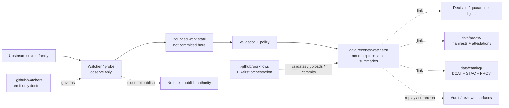

<!--
KFM Meta Block V2
doc_id: kfm://doc/NEEDS_VERIFICATION__data_receipts_watchers_readme
title: data/receipts/watchers
type: standard
version: v1
status: draft
owners: @bartytime4life
created: NEEDS_VERIFICATION__YYYY-MM-DD
updated: 2026-04-16
policy_label: NEEDS_VERIFICATION__public_or_internal
related:
  - ../README.md
  - ../../README.md
  - ../../raw/README.md
  - ../../work/README.md
  - ../../quarantine/README.md
  - ../../processed/README.md
  - ../../catalog/README.md
  - ../../published/README.md
  - ../../proofs/README.md
  - ../../registry/README.md
  - ../../../.github/watchers/README.md
  - ../../../.github/workflows/README.md
  - ../../../contracts/README.md
  - ../../../schemas/README.md
  - ../../../policy/README.md
  - ../../../tests/README.md
  - ../../../tools/validators/README.md
  - ../../../tools/validators/promotion_gate/README.md
  - ../../../tools/probes/README.md
  - ../../../tools/attest/README.md
  - ../../../.github/CODEOWNERS
  - ../../../.github/PULL_REQUEST_TEMPLATE.md
tags:
  - kfm
  - data
  - receipts
  - watchers
  - process-memory
  - replay
  - correction
  - audit
  - emit-only
  - pr-first
notes:
  - Child receipt lane derived from the surfaced `data/receipts/` README and the surfaced `.github/watchers/` / `.github/workflows/` doctrine.
  - This revision normalizes watcher receipt language around a single central `data/receipts/` process-memory lane.
  - Current checked-in subtree beyond this requested README target remains NEEDS VERIFICATION.
  - This lane is for watcher process memory, not release-significant proofs, canonical schemas, or runtime watcher code.
-->

<a id="top"></a>

# `data/receipts/watchers/`

Watcher-facing child lane for **receipt-shaped process memory**, drift summaries, and replay-ready audit linkage under `data/receipts/`.

<div align="left">


</div>

| Field | Value |
|---|---|
| **Status** | experimental |
| **Document status** | draft |
| **Owners** | `@bartytime4life` *(inherited from surfaced `/data/` and `/.github/` coverage; leaf-specific confirmation is still worth rechecking before merge)* |
| **Path target** | `data/receipts/watchers/README.md` |
| **Repo fit** | child watcher-process-memory lane under [`../README.md`](../README.md) |
| **Quick jumps** | [Scope](#scope) · [Repo fit](#repo-fit) · [Accepted inputs](#accepted-inputs) · [Exclusions](#exclusions) · [Directory tree](#directory-tree) · [Quickstart](#quickstart) · [Usage](#usage) · [Diagram](#diagram) · [Reference tables](#reference-tables) · [Task list](#task-list--definition-of-done) · [FAQ](#faq) · [Appendix](#appendix) |

> [!IMPORTANT]
> This leaf is strongest on **lane boundary**, **process-memory posture**, and **handoff discipline**.
>
> What is already well supported:
>
> - watcher receipts are valid occupants of the broader `data/receipts/` process-memory surface
> - watcher doctrine is **emit-only**, **review-bearing**, and **PR-first**
> - workflow orchestration may validate, upload, or commit receipts under governed conditions
>
> What still needs direct branch proof:
>
> - exact checked-in child inventory under `data/receipts/watchers/`
> - live watcher adapters or runtime code
> - checked-in workflow YAML calling this lane
> - first emitted watcher receipt example
> - exact canonical schema home for watcher receipt contracts

> [!CAUTION]
> `data/receipts/watchers/` should not quietly become:
>
> - the runtime watcher directory
> - the proof-pack or attestation home
> - a second policy lane
> - a stealth schema registry
> - a scratch cache for temporary watcher state

---

## Scope

`data/receipts/watchers/` is the child receipt lane for watcher-originated process memory when **central receipt placement** is the clearest review and replay choice.

This directory exists to keep watcher-side evidence small, explicit, and inspectable:

- what source family was being watched
- what stable identity or `spec_hash` was derived
- whether change was detected
- what validation and policy concluded
- how the run handed off to later review, quarantine, proof, or promotion surfaces

### Current evidence posture

The surfaced docs support four narrow conclusions:

1. The parent `data/receipts/` lane already treats watcher receipts as valid process memory.
2. The gatehouse watcher lane under `.github/` is currently a **docs-only** doctrine surface, not proven runtime code.
3. Workflow orchestration is a separate boundary from receipt ownership.
4. The child watcher subtree is doctrinally useful, but its exact current branch inventory remains **NEEDS VERIFICATION**.

In other words, this README should define the **lane contract**, not pretend the runtime subtree is already fully populated.

### Normalization rule

This leaf assumes **one central process-memory lane**:

```text
data/receipts/
```

That means watcher receipts here are not a special second receipt system.  
They are simply a **watcher-scoped child family** within the broader receipts surface.

If a watcher emits one receipt per run, that object is still a **receipt type**, not a separate storage doctrine that requires a parallel `data/run_receipts/` lane.

[Back to top](#top)

---

## Repo fit

`watchers/` is a child lane of `data/receipts/`, not a sibling authority to contracts, policy, proofs, or runtime.

| Relation | Surface | Status in this README | Why it matters |
| --- | --- | --- | --- |
| Parent lane | [`../README.md`](../README.md) | **CONFIRMED** | Defines receipts as process memory, not release proof |
| Broader data lifecycle | [`../../README.md`](../../README.md) | **CONFIRMED path / INFERRED role** | Keeps this leaf subordinate to the wider `RAW → WORK/QUARANTINE → PROCESSED → CATALOG → PUBLISHED` story |
| Gatehouse watcher doctrine | [`../../../.github/watchers/README.md`](../../../.github/watchers/README.md) | **CONFIRMED** | Establishes emit-only, docs-first, review-bearing watcher posture |
| Workflow boundary | [`../../../.github/workflows/README.md`](../../../.github/workflows/README.md) | **CONFIRMED** | Separates orchestration from receipt ownership |
| Shared authority | [`../../../contracts/README.md`](../../../contracts/README.md) · [`../../../schemas/README.md`](../../../schemas/README.md) · [`../../../policy/README.md`](../../../policy/README.md) | **CONFIRMED** | Contracts, schemas, and policy should stay upstream |
| Validator pressure | [`../../../tools/validators/README.md`](../../../tools/validators/README.md) · [`../../../tools/validators/promotion_gate/README.md`](../../../tools/validators/promotion_gate/README.md) | **CONFIRMED / INFERRED** | Validators may consume watcher receipts, but should not silently own them |
| Probe/helper pressure | [`../../../tools/probes/README.md`](../../../tools/probes/README.md) · [`../../../tools/attest/README.md`](../../../tools/attest/README.md) | **INFERRED / NEEDS VERIFICATION** | Probe and attestation helpers may touch this lane, but deeper checked-in parity still needs branch proof |
| Downstream release evidence | [`../../proofs/README.md`](../../proofs/README.md) | **CONFIRMED** | Proof packs, manifests, and attestations remain separate |
| Downstream catalog and publication | [`../../catalog/README.md`](../../catalog/README.md) · [`../../published/README.md`](../../published/README.md) | **CONFIRMED** | Catalog closure and publication state are later seams |

### Canonical one-line repo fit

This leaf is where **watcher process memory** can live when central receipt storage is useful; it should always point outward to stronger authority instead of becoming stronger authority itself.

[Back to top](#top)

---

## Accepted inputs

Use this child lane for receipt-shaped watcher outputs that are reviewable, replayable, and clearly subordinate to stronger truth surfaces.

| Accepted input | Examples | Why it belongs here |
| --- | --- | --- |
| Watcher run receipts | `run_receipt`, change-detection result, no-change receipt, held/quarantined run record | Core process memory for one bounded watcher execution |
| Receipt-linked validation outputs | small JSON result, QC summary, schema-check result, compact validator report | Proves the receipt was not blindly emitted |
| Drift or diff summaries | changed keys, counts, hashes, small reviewer-readable Markdown summary | Helpful when a watcher opens a review path or draft PR |
| Stable linkage refs | source ref, subject ref, decision ref, proof ref, release ref, audit ref | Keeps replay and correction joins explicit |
| Redacted operational mirrors | masked endpoint details, redacted actor context, redacted scheduler note | Allows auditability without leaking sensitive runtime detail |
| Small family-local indexes | minimal lookup or summary file that groups watcher receipts by family or date | Useful when review/replay is easier with one compact index |

### Input rules

1. Prefer **text-first, diff-friendly** files.
2. Keep **temporary state** outside this directory.
3. Preserve **stable joins** across source, subject, decision, proof, release, and audit contexts.
4. If a watcher emits receipts for both changed and no-change paths, keep both understandable.
5. When a separate policy-decision or quarantine object exists, **link it** instead of flattening it.
6. If a family keeps receipt packs beside a dataset version or release candidate, mirror here only when central lookup clearly helps.

---

## Exclusions

This leaf is narrower than “anything related to watchers.”

| Does **not** belong here | Put it here instead | Why |
| --- | --- | --- |
| Runtime watcher code, adapters, or schedulers | gatehouse docs, runtime pipeline, or probe/helper lanes | Code is not process memory |
| Workflow YAML, job orchestration, or step wrappers | [`../../../.github/workflows/README.md`](../../../.github/workflows/README.md) | Orchestration is a separate control boundary |
| Canonical receipt schema or contract ownership | [`../../../contracts/README.md`](../../../contracts/README.md) and [`../../../schemas/README.md`](../../../schemas/README.md) | This leaf should consume, not own, contract truth |
| Policy bundles or organization-level allow/deny law | [`../../../policy/README.md`](../../../policy/README.md) | Policy meaning stays upstream |
| Release manifests, attestation bundles, or proof packs | [`../../proofs/README.md`](../../proofs/README.md) | Release-significant trust objects stay under proofs or release surfaces |
| DatasetVersion objects or outward catalog closure | [`../../processed/README.md`](../../processed/README.md) and [`../../catalog/README.md`](../../catalog/README.md) | Receipts should point to authority, not replace it |
| Raw captures, unresolved sensitive material, or quarantine state itself | [`../../raw/README.md`](../../raw/README.md) and [`../../quarantine/README.md`](../../quarantine/README.md) | Rights and sensitivity boundaries remain real |
| Generic CI artifacts with no replay, correction, or audit value | workflow artifact storage only | Not every artifact deserves receipt status |
| Secrets, tokens, host-local dumps, or live credentials | runtime secret handling | Auditability is not permission to leak |

> [!WARNING]
> If a file here starts behaving like the primary release proof, primary policy record, or primary schema authority, it is in the wrong lane.

[Back to top](#top)

---

## Directory tree

### Current evidence-backed parent snapshot

```text
data/receipts/
└── README.md
```

### Requested child target (`NEEDS VERIFICATION` until checked-out branch confirms it)

```text
data/receipts/
└── watchers/
    └── README.md
```

### Watcher-oriented starter shape (`PROPOSED`)

```text
data/receipts/watchers/
├── README.md
└── <watcher-family>/
    └── <yyyy-mm-dd>/
        ├── <run-receipt>.json
        ├── <summary>.md
        └── <linked-validation>.json
```

### One named starter family already mentioned in surfaced sibling docs

```text
data/receipts/watchers/
└── incremental_stac/
    └── <receipt files>
```

> [!NOTE]
> `incremental_stac/` is the only child family name surfaced directly in adjacent receipt/workflow docs here.  
> Add further family names only after the checked-out branch or adjacent child lanes make them reviewable.

---

## Quickstart

### Safe inspection commands

```bash
# read the parent lane, this child leaf, and the gatehouse doctrine together
for p in \
  data/receipts/README.md \
  data/receipts/watchers/README.md \
  .github/watchers/README.md \
  .github/workflows/README.md \
  contracts/README.md \
  schemas/README.md \
  policy/README.md \
  tools/validators/README.md \
  tools/validators/promotion_gate/README.md \
  tools/attest/README.md \
  tests/README.md
do
  echo
  echo "== $p =="
  sed -n '1,260p' "$p" 2>/dev/null || true
done

# inspect currently checked-in watcher receipt files, if any are present
find data/receipts/watchers -maxdepth 4 -type f | sort 2>/dev/null || true

# search the repo for watcher-receipt identity and linkage terms
grep -RIn \
  "run_receipt\|spec_hash\|change_detected\|validation_outcome\|policy_outcome\|final_outcome\|proof_refs\|quarantine_ref\|data/receipts/watchers" \
  data .github tools contracts schemas policy tests 2>/dev/null || true
```

### First local review pass

```bash
# if a real watcher family exists, open one emitted receipt next to its linked artifacts
jq -C . data/receipts/watchers/<watcher-family>/<yyyy-mm-dd>/<run-receipt>.json 2>/dev/null || true

# compare receipt fields against the strongest currently documented starter contract
sed -n '1,260p' contracts/run_receipt/README.md 2>/dev/null || true
sed -n '1,260p' schemas/run-receipt.schema.json 2>/dev/null || true
```

> [!TIP]
> Inspection-first is safer than inventing a child-family convention in README prose.  
> Let the checked-out branch prove the actual family names, validator path, and workflow wiring before this file upgrades them from **PROPOSED** to fact.

[Back to top](#top)

---

## Usage

### Use this lane when

Use `data/receipts/watchers/` when central watcher receipt placement makes review and replay easier:

- a watcher is **emit-only** and should leave an auditable process-memory trace
- a draft PR or reviewer handoff needs a compact receipt plus small linked summaries
- a watcher family must preserve both **changed** and **no-change** executions
- the child family benefits from date-grouped lookup under one receipt-focused subtree
- downstream proof or publication surfaces need stable references back to watcher process memory

### Do not use this lane when

Do **not** use this leaf when the main burden is:

- writing or running watcher adapters
- owning canonical contracts or schemas
- storing release-significant proofs
- holding temp work state
- deciding policy in the canonical sense
- bypassing rights or sensitivity review

### Placement rules

1. Keep watcher receipts **write-once** and diff-friendly.
2. Preserve `spec_hash` or the family’s equivalent stable identity seam when that doctrine applies.
3. Keep **validation**, **policy**, and **final** outcomes distinct instead of compressing them into one boolean.
4. Link forward to stronger objects rather than copying them wholesale.
5. Keep temp work references explicit so reviewers can tell **work state** from **committed process memory**.
6. If a family uses quarantine, leave a clear `quarantine_ref` or equivalent join.
7. Validate receipt shape before commit, publish-facing side effects, or proof generation.
8. Prefer central placement here only when it helps replay, correction, release review, or grouped audit explanation.

### Canonical lane posture

Watcher receipts here should support **PR-first, review-bearing, fail-closed** choreography:

- observe change or no-change
- validate deterministically
- preserve receipt-shaped process memory
- link to stronger review/proof surfaces
- never turn this child lane into direct publish authority

### Normalized receipt rule

A watcher receipt here is still just a **receipt type**.

That means:

- it belongs under `data/receipts/`
- it may represent one bounded run
- it does **not** need a separate sibling storage doctrine
- it may later be referenced by validators, policy, workflows, proofs, or release review without changing artifact class

[Back to top](#top)

---

## Diagram



[Back to top](#top)

---

## Reference tables

### Watcher receipt boundary map

| Object or artifact | Keep in `data/receipts/watchers/`? | Why |
| --- | ---: | --- |
| Watcher `run_receipt` | **Yes** | Core process memory for one bounded watcher execution |
| Small drift or diff summary | **Yes, when scoped** | Helps reviewers understand a change without inflating this lane into proof storage |
| Linked validation result | **Yes, when compact** | Shows the receipt was checked |
| Standalone policy-decision record | **Link, do not own** | Policy remains its own object |
| Standalone quarantine record | **Link, do not own** | Quarantine state should stay explicit and separate |
| `DatasetVersion` or processed candidate | **No** | Canonical authority belongs elsewhere |
| `ReleaseManifest`, `ReleaseProofPack`, attestation bundle | **No** | Release-significant trust objects stay under proofs or release surfaces |
| Temporary work cache or fetch scratch | **No** | Keep work state outside committed receipts |
| Public runtime envelope / `EvidenceBundle` | **No** | Runtime trust objects are downstream consumers |

### Minimum watcher receipt joins (`PROPOSED` starter rule)

| Field or join | Why it matters |
| --- | --- |
| source URI, source descriptor, or source family ref | reconstruct what was being watched |
| dataset or subject ref | identify the watched family, batch, or candidate |
| `checked_at` or equivalent | preserve timing and freshness context |
| `spec_hash` plus prior hash when available | make change detection and replay explicit |
| validation result | prove the receipt was not blindly accepted |
| policy result | prove fail-closed review logic ran |
| final outcome | preserve handoff state without ambiguity |
| candidate artifact refs | point to candidate files without flattening them |
| proof refs | connect forward to stronger release evidence |
| quarantine ref | keep blocked or ambiguous paths reviewable |

### Candidate thin-slice families (`PROPOSED`)

| Candidate family | Representative sources | Typical receipt pressure | Why it is a plausible first wave |
| --- | --- | --- | --- |
| hydrology / soil moisture | Kansas Mesonet, USGS NWIS | freshness, no-change vs changed, explicit support window, validation/policy outcomes | strongest hydrology-first proof bias |
| soils / agriculture baseline | SSURGO, gSSURGO, SDA, Mesonet context | `MUKEY` snapshot hash, diff summary, deterministic changed fields | good fit for spec-hashed watcher logic |
| vegetation change | HLS VI plus corroborating disturbance/context sources | support counts, change masks, explicit no-data / atmosphere reasoning | strong map value with bounded review |
| air / atmospheric context | public air-quality feeds | anomaly counts, freshness, source-role clarity | compact, public-safe drift logic |
| stewardship / notice families | USFWS or similar authority notices | metadata drift, release/version change, low-risk review handoff | clear PR-first documentation burden |

> [!TIP]
> Hydrology is the safest child-family starting point.  
> Broaden only after one family proves receipt shape, validation, and review handoff cleanly.

[Back to top](#top)

---

## Task list & definition of done

### Open verification tasks

- [ ] replace remaining meta-block placeholders for `doc_id`, created date, and `policy_label`
- [ ] confirm whether `data/receipts/watchers/` already exists on the target branch or is being introduced by this change
- [ ] confirm leaf-specific ownership if it differs from broader `/data/` coverage
- [ ] verify all relative links against the checked-out branch
- [ ] confirm the canonical schema home for watcher run receipts
- [ ] add at least one real emitted watcher receipt example once visible
- [ ] add one linked validation example once visible
- [ ] confirm whether `incremental_stac/` is a real checked-in family or still a starter-only name
- [ ] confirm the first actual workflow or probe/helper path that writes into this lane
- [ ] keep proof, catalog, decision, and quarantine joins explicit instead of embedding those objects inline

### Definition of done

This README is in a healthy state when:

- it describes the **real checked-out branch** more strongly than hopeful future shape
- it keeps **receipts**, **proofs**, **catalog**, **contracts**, and **runtime trust objects** distinct
- it keeps **watcher doctrine**, **workflow orchestration**, and **process memory** separate
- it does not imply runtime watcher code or workflow YAML without proof
- it names at least one real child watcher family only after the branch exposes it
- it gives contributors a clear, non-destructive place to put watcher receipts without inventing a second authority path

[Back to top](#top)

---

## FAQ

### Is this the runtime watcher directory?

No.

This is the **receipt** child lane for watcher process memory. Runtime watcher code should stay in its own runtime/probe/helper surface.

### Can watcher receipts stay beside a dataset version or release instead?

Yes.

The broader `data/receipts/` guidance already allows central placement **or** a version-adjacent audited surface.  
What matters is explicit linking, easy replay, and no confusion between receipt memory and stronger proof/publication objects.

### Should this leaf hold proof packs or attestation bundles?

No.

Link them. Do not move them here as primary truth.

### Do no-change watcher runs belong here?

Usually yes, when the family’s review logic needs a visible “nothing changed” path rather than silent absence.

### What is the smallest credible first family?

A **hydrology-first**, read-only watcher that derives a stable identity seam, emits a compact receipt, records validation and policy outcomes, and hands off to review without direct publish authority.

### Can this lane store sensitive detail?

Only under explicit policy control.

If a receipt contains operational detail that should not live in the repo unchanged, commit a redacted mirror here and keep the stronger source elsewhere.

---

## Appendix

<details>
<summary><strong>Illustrative starter conventions</strong> (<code>PROPOSED</code>)</summary>

### Filename ideas

```text
data/receipts/watchers/<watcher-family>/<yyyy-mm-dd>/<run-id>.json
data/receipts/watchers/<watcher-family>/<yyyy-mm-dd>/<run-id>.summary.md
data/receipts/watchers/<watcher-family>/<yyyy-mm-dd>/<run-id>.validation.json
```

### Illustrative receipt shape

> [!NOTE]
> This shape is intentionally conservative and linkage-first.  
> Use the authoritative contract lane once the target branch confirms canonical schema placement.

```json
{
  "version": "v1",
  "run_id": "run-001",
  "source_uri": "https://example.org/data/source.csv",
  "dataset_key": "hydrology.example.dataset",
  "checked_at": "2026-04-12T12:00:00Z",
  "spec_hash": "aaaaaaaaaaaaaaaaaaaaaaaaaaaaaaaaaaaaaaaaaaaaaaaaaaaaaaaaaaaaaaaa",
  "previous_spec_hash": null,
  "change_detected": true,
  "validation_outcome": "PASS",
  "policy_outcome": "ALLOW",
  "final_outcome": "PROMOTED",
  "reason": "Candidate changed and passed validation and policy.",
  "obligations": [],
  "canonical_spec_ref": "kfm://spec/example-001",
  "candidate_artifact_refs": {
    "raw": "kfm://artifact/raw/example-001"
  },
  "proof_refs": {
    "receipt_bundle": "kfm://proof/example-001"
  },
  "quarantine_ref": null
}
```

### Small naming rules worth preserving

- prefer sortable, stable IDs
- keep filenames lowercase and diff-friendly
- use explicit timestamps instead of ambiguous local dates
- link forward to stronger authority rather than copying large objects into receipts
- preserve changed, no-change, held, quarantined, and error paths explicitly when the family depends on finite outcomes

</details>

[Back to top](#top)
