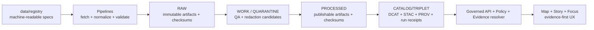

# Data Registry
Machine-readable registries that define what KFM ingests **and how it is governed** (inputs to promotion gates).

**Status:** Draft (vNext) • **Owners:** See `CODEOWNERS` (or repository governance owners) • **Scope:** `data/registry/**`


**Navigate:** [Purpose](#purpose) • [What lives here](#what-lives-here) • [Truth path fit](#truth-path-fit) • [Registry contracts](#registry-contracts) • [Registry types](#registry-types) • [How to change](#how-to-add-or-change-a-registry-entry) • [Validation and CI](#validation-and-ci) • [Security and sensitivity](#security-and-sensitivity) • [Glossary](#glossary)

---

## Purpose

`data/registry/` is the **canonical** home for *machine-readable* registry entries that drive:

- **Ingestion** (what sources exist, how they’re accessed, cadence).
- **Governance** (license/rights, sensitivity classification, policy labels + obligations).
- **Promotion gating** (what MUST be present before a dataset version can be served).
- **Evidence resolution** (stable references and cross-links that let UI/Focus show “why you can trust this”).

This directory is intentionally treated like **code**: reviewed, validated, and **fail-closed**.

> NOTE  
> In KFM, the registry is not optional documentation; it is an **input to promotion gates**.  
> If it can’t be validated, signed/hashed where required, and reviewed, it must not drive automation or runtime serving.

[[Back to top]](#data-registry)

---

## What lives here

**Registry entries** and **controlled vocabularies** such as:

- Source/dataset registry entries (authority, access method, cadence, license snapshot, sensitivity).
- Watcher allow-lists for automated update detection (poll/webhook schedules, endpoints, outputs).
- Policy label taxonomy + obligation templates (e.g., “show notice”, “generalize geometry”).
- Mapping rules needed for consistent downstream projections (e.g., graph mapping conventions).

### What must NOT live here

- Raw or processed data payloads (those belong in lifecycle zones like `raw/`, `work/`, `processed/`).
- Secrets (tokens, API keys, credentials files).
- Precise locations for sensitive heritage sites unless policy explicitly allows and storage is appropriately restricted.

[[Back to top]](#data-registry)

---

## Truth path fit

Registries are upstream inputs; they *constrain* what pipelines may do and what runtime is allowed to serve.



**Operational rule of thumb:** if it affects what can be promoted or served, it belongs in a validated registry (or an equivalent policy-controlled contract surface).

[[Back to top]](#data-registry)

---

## Registry contracts

### 1) Deterministic identity and versioning

Registry entries MUST be stable and reproducible.

- Use stable identifiers for **datasets** and **watchers**.
- Changes to meaningfully relevant fields MUST produce a new **spec hash** (and therefore new derived versions where applicable).
- Prefer canonical JSON hashing (or another deterministic canonicalization strategy) to prevent “hash drift”.

### 2) Fail-closed by default

- If a registry entry is missing required fields, invalid against schema, unsigned when required, or references disallowed endpoints/providers, then:
  - **automation MUST NOT run**, and
  - **promotion MUST be blocked**.

### 3) Policy labels + obligations are first-class

Every source/dataset entry MUST include (or map to):

- A `policy_label` (see starter list below),
- Any obligations required for safe serving (e.g., “generalize geometry”, “show notice”).

### 4) Registry ↔ catalogs ↔ receipts must cross-link

Downstream artifacts must remain evidence-resolvable:

- Each produced artifact MUST link back to a **run receipt** (directly or through catalogs).
- Catalog records MUST carry enough identifiers to connect to:
  - dataset identity,
  - dataset version identity,
  - policy label,
  - provenance.

[[Back to top]](#data-registry)

---

## Registry types

> This table describes **logical types**. Your repo may split them into subfolders (recommended) or consolidate them into a single registry file.

| Registry type | What it controls | Typical format | Minimum contract expectations |
|---|---|---:|---|
| Source / Dataset registry | Authority, access method, cadence, license snapshot, sensitivity, QA expectations | YAML or JSON | Stable ID; license/rights captured; sensitivity classified; policy label assigned; known limitations + QA checks recorded |
| Watcher allow-list | Which automated update checks are allowed to run | JSON (schema-validated), sometimes YAML authored | Signed allow-list; strict fields; endpoint + poll schedule; outputs declared; spec hash |
| Policy label taxonomy | Controlled vocabulary for labels + obligation templates | YAML/JSON | Versioned; referenced by other registries; used by policy tests |
| Mapping rules | Normalization conventions for derived projections (e.g., graph labels/edges) | YAML | Deterministic; reviewed; tested against fixtures |

[[Back to top]](#data-registry)

---

## Policy label starter list

The project should maintain a controlled vocabulary. A practical starter set is:

- `public`
- `public_generalized`
- `restricted`
- `restricted_sensitive_location`
- `internal`
- `embargoed`
- `quarantine`

> TIP  
> “public_generalized” is useful when the source can’t be safely published with precise geometry, but a generalized representation is allowed.

[[Back to top]](#data-registry)

---

## How to add or change a registry entry

### A. Changes that are always required

- [ ] Registry entry validates against its schema (or structural contract).
- [ ] ID remains stable; any meaningfully material change updates spec hash (where used).
- [ ] License + rights holder information is explicit (or entry is routed to quarantine).
- [ ] Sensitivity classification + policy label is present.
- [ ] Known limitations + QA checks are documented in the entry.
- [ ] Any redaction/generalization requirements are captured as obligations (and later recorded in provenance when executed).

### B. Changes that require extra review

- Any move from `restricted*` → `public*`
- Introducing a new automation watcher
- Adding endpoints that require credentials
- Adding new controlled vocabulary values (labels, themes, citation kinds)

### C. Suggested workflow

1. Create or edit the registry entry (keep changes small and reviewable).
2. Run local validation (schema + lint + signature verification if applicable).
3. Open a PR that includes:
   - the updated registry entry,
   - any fixtures/tests needed for policy gating,
   - a brief explanation of the change’s materiality.

[[Back to top]](#data-registry)

---

## Validation and CI

**CI SHOULD** treat these as merge-blocking gates:

- Schema validation for registry entries.
- Policy tests (allow/deny + obligations) using fixtures.
- Cross-link checks (registries → receipts → catalogs) where applicable.

### Example validations (adjust to your repo’s tooling)

- Validate JSON entries against JSON Schema.
- Validate signatures (e.g., sigstore/cosign) when registry is a signed allow-list.
- Ensure that changes don’t break evidence resolution (at least one EvidenceRef can resolve in CI for touched datasets).

[[Back to top]](#data-registry)

---

## Security and sensitivity

### Trust membrane reminder

- Frontend/external clients must not access storage/DB directly.
- Policy decisions belong in CI/runtime/evidence resolver — not the UI.
- Never leak restricted metadata through error messages or “helpful” logs.

### Sensitive locations

Default posture:

- Store precise geometries only in restricted datasets.
- If any public representation is allowed, generate a separate **public generalized** dataset version.
- Don’t embed precise coordinates in story content or AI outputs unless policy explicitly allows.

### Licensing and rights

Operational expectations:

- “Online availability” is not permission to reuse.
- Promotion gates require license + rights holder for distributions.
- Metadata-only cataloging is permitted when mirroring is disallowed by rights.

[[Back to top]](#data-registry)

---

## Glossary

- **Dataset**: logical dataset identity (e.g., “USGS NWIS Kansas”).  
- **DatasetVersion**: immutable version corresponding to a specific promoted output set.  
- **Artifact**: concrete file/object produced by a run (GeoParquet, PMTiles, COG, JSONL, PDF).  
- **EvidenceRef**: stable reference scheme (`dcat://`, `stac://`, `prov://`, `doc://`, `graph://`).  
- **EvidenceBundle**: resolved evidence view returned by the evidence resolver; includes human + machine fields and policy decisions; immutable by digest.

---

<details>
<summary><strong>Appendix: Watcher entry shape (illustrative)</strong></summary>

This is an *illustrative* shape for a watcher allow-list entry. Treat watcher registries as signed allow-lists and validate them strictly.

```json
{
  "watcher_id": "example:usgs:nwis",
  "canonical_id": "usgs-nwis-kansas",
  "endpoint": "https://example.org/api/...",
  "poll": { "interval_seconds": 3600, "mode": "poll" },
  "policy": { "staleness_s": 86400, "spec_change_pct": 0.05, "geom_shift_m": 25 },
  "outputs": ["dataset:usgs-nwis-kansas"],
  "schema_url": "https://kfm.org/schemas/watcher.v1.json",
  "version": "1",
  "spec_hash": "sha256:...",
  "signature_ref": "sigstore:..."
}
```

</details>
