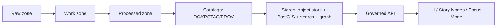

<!--
File: data/registry/README.md
Kansas Frontier Matrix (KFM) — Governed Data Registry
-->

# KFM Data Registry (`data/registry/`) 🧭🗂️


This folder is the **single, human-reviewable source of truth** for:

- **What** KFM ingests (datasets, sources, watchers)
- **How** KFM ingests (connector parameters, schedules, incremental cursors, backfills)
- **What must be true before publishing** (schemas, validation gates, promotion contract)
- **How trust is proven** (checksums, canonical hashes, signatures, catalog/provenance requirements)

> [!IMPORTANT]
> **Registry-driven is non-negotiable.**  
> If a dataset, watcher, policy label, or catalog template is not declared here (and validated in CI), it **must not** be promoted to publishable outputs.

---

## Non-negotiables (KFM governance invariants)

### Trust membrane (access boundary)
- **No UI or external client may access databases or object storage directly.**
- All reads go through the **governed API boundary** where **policy-as-code** is evaluated.
- Registry changes are “governed artifact changes”: versioned, reviewed, validated, and auditable.

### Publish only from Processed (truth path)
KFM’s “truth path” is:



Raw and Work are **never** served directly. Processed is the only publishable source.

### Fail-closed by default
- If validation, policy checks, or signature verification fails, the system **blocks promotion**.
- “Unknown” must be treated as **deny**, not “allow”.

---

## What lives here (and what does not)

### ✅ Lives here
- **Dataset registry** entries (what we ingest + how we publish)
- **Connector registry** entries (how to acquire/normalize/validate)
- **Watcher registry** entries (poll/webhook/hybrid monitors that emit receipts)
- **Schemas** (JSON Schema / schema bundles) used for merge-blocking validation
- **Policy taxonomy** (controlled vocabulary) used in enforcement + UI treatment
- **Catalog templates** (minimum required fields for DCAT/STAC/PROV)
- **Examples + fixtures** (small deterministic samples for CI)

### ❌ Does not live here
- Secrets, API keys, tokens, credentials (**vault only**)
- Raw data files, large fixtures, or production datasets
- Runtime code (connectors/watchers are implemented elsewhere; only **declared** here)

---

## Directory layout

> If a directory below does not exist yet in your repo, **create it** and follow the structure as written.  
> This README is the contract for the registry layer.

| Path | Purpose | Typical contents |
|---|---|---|
| `data/registry/README.md` | You are here | Contract + workflow |
| `data/registry/datasets/` | Dataset registry (source-of-truth list) | `*.dataset.yaml` |
| `data/registry/connectors/` | Connector registry | `*.connector.yaml` |
| `data/registry/watchers/` | Watcher registry | `*.watcher.json` |
| `data/registry/policy/` | Policy taxonomy + rules metadata | `taxonomy.yaml`, `tags.yaml` |
| `data/registry/schemas/` | JSON Schemas for registries + catalogs | `*.schema.json` |
| `data/registry/catalog-templates/` | Minimum field templates (DCAT/STAC/PROV) | `dcat.min.jsonld`, `stac.collection.min.json`, `prov.min.json` |
| `data/registry/examples/` | Small fixtures for CI | sample dataset/watcher/receipt fixtures |

---

## Registry object types (contracts)

### 1) Dataset Registry (`datasets/*.dataset.yaml`)

A **Dataset** in KFM is a governed product with explicit versioning and provenance. Each ingest run yields:
- a new **DatasetVersion** (checksums + run metadata),
- a **DCAT dataset** record,
- a **PROV activity** linking raw assets to derivatives,
- and **STAC** assets when spatial rasters/vectors are involved.

#### Dataset registry minimal fields
Dataset entries MUST include enough metadata to emit DCAT and to drive ingestion orchestration.

```yaml
# data/registry/datasets/example.dataset.yaml
dataset_id: kfm.<domain>.<source>.<name>
title: "Human readable title"
description: "What is this dataset, why it exists, what it supports."
domain: <land|water|heritage|climate|census|...>

publisher:
  org_id: "<stable org id>"
  name: "Publisher name"

license:
  spdx_or_url: "CC-BY-4.0" # or URL
  attribution: "Required attribution text (if any)"

coverage:
  spatial:
    # one of:
    bbox_wgs84: [-102.05, 36.99, -94.60, 40.00]
    # or:
    admin: ["US-KS"]
  temporal:
    start: "1854-01-01"
    end: "2026-02-01"  # can be rolling; update as derived

cadence:
  accrual_periodicity: "monthly"  # aligned with DCAT dct:accrualPeriodicity
  freshness_slo: "P30D"           # ISO 8601 duration recommended

classification:
  policy_label: public  # public | restricted | sensitive-location | aggregate-only
  policy_tags:
    - care:tribal_sensitive=false
    - redistribution:allowed=true

ingestion:
  connector_id: kfm.connector.<provider>.<name>
  schedule: "infrequent"          # static_historical | ongoing | infrequent | realtime | ...
  incremental_cursor: "modified_date"  # or eventDate/publicationDate; else snapshot+diff
  format_targets: ["parquet", "geojson"] # tabular/spatial/artifact targets

backfill:
  enabled: true
  strategy: "range-batched"
  historical_coverage:
    start: "1854-01-01"
    end: "1950-12-31"
  batching:
    window: "P1Y"  # ISO 8601 duration windows (e.g., 1 year batches)
  expected_runtime: "PT8H" # ISO 8601 duration (estimate)

publish:
  catalogs:
    dcat: required
    prov: required
    stac: conditional  # required for spatial assets
  distributions:
    - kind: "api"
      accessURL: "https://api.example/kfm/v1/..."
    - kind: "download"
      accessURL: "https://download.example/kfm/..."
```

> [!NOTE]
> The **registry is the authoritative place** to declare: cadence, policy label, backfill coverage, and expected runtimes.  
> These are required for operational freshness checks and safe backfills.

---

### 2) Connector Registry (`connectors/*.connector.yaml`)

A **Connector** is a governed ingestion adapter declaration. The registry stores **config defaults** and **constraints** that drive the ingestion framework.

#### Required connector fields (recommended baseline)
```yaml
# data/registry/connectors/example.connector.yaml
connector_id: kfm.connector.<provider>.<name>
provider: "<upstream org/provider name>"
upstream:
  accessURL: "https://provider.example/api"
  auth: none  # none | api_key | oauth | signed_url
  rate_limit:
    strategy: "respect-provider"
    backoff: "exponential"
  caching:
    conditional_fetch: true  # use ETag / If-Modified-Since when available

defaults:
  schedule: "static_historical"
  incremental_cursor: "publicationDate"
  format_targets: ["json", "csv", "parquet", "geojson", "cog", "pdf", "png"]

policy:
  default_policy_label: public
  redaction_supported: true

validation:
  schema_ids:
    - "kfm.schema.<domain>.<name>.v1"
  geometry_rules:
    wgs84_required: true
    validate_topology: true
  temporal_rules:
    forbid_future_dates: true
```

> [!IMPORTANT]
> **Secrets must never be committed.**  
> If upstream requires credentials, store them in a vault/secret manager and reference them only by name/handle in runtime configuration (not in this registry).

---

### 3) Watcher Registry (`watchers/*.watcher.json`)

A **Watcher** is an always-on monitor that detects upstream changes, produces **typed receipts** (`run_manifest` / `run_receipt`), and triggers CI validation and promotion.

#### Watcher schema: required fields
Watcher JSON MUST include:

- `watcher_id`
- `endpoint`
- `poll`
- `policy`
- `outputs`
- `spec_hash`
- `signature_ref`

```json
{
  "watcher_id": "kfm.watcher.<provider>.<dataset>.<purpose>",
  "endpoint": {
    "accessURL": "https://provider.example/api",
    "method": "GET"
  },
  "poll": {
    "enabled": true,
    "interval": "PT6H",
    "conditional_fetch": {
      "etag": true,
      "last_modified": true
    }
  },
  "policy": {
    "policy_label": "public",
    "policy_tags": [
      "care:tribal_sensitive=false",
      "redistribution:allowed=true"
    ]
  },
  "outputs": {
    "receipts": ["kfm.run_receipt.v1", "kfm.run_manifest.v1"],
    "catalogs": ["dcat", "prov", "stac"]
  },
  "spec_hash": "sha256:<hex>", 
  "signature_ref": "cosign://<registry>/<path>@sha256:<digest>"
}
```

#### `spec_hash` (deterministic hashing)
To prevent hash drift and enable reproducible provenance checks:

- Compute `spec_hash = sha256(JCS(spec))`
- `spec` MUST be a schema-defined object
- Record both `spec_schema_id` and `spec_recipe_version` in receipts/manifests when applicable

> [!IMPORTANT]
> Canonical JSON hashing MUST use **RFC 8785** (JSON Canonicalization Scheme) to ensure stable hashes across languages and platforms.

---

### 4) Schema Registry (`schemas/`)

Schemas are used for **merge-blocking validation** in CI. This includes:

- registry schemas (dataset/connector/watcher)
- receipt schemas (`run_manifest`, `run_receipt`)
- catalog schemas (DCAT/STAC/PROV minimum conformance)

#### Minimum expectations
- Schemas MUST be versioned (`v1`, `v2`, …) and backwards compatibility MUST be explicit.
- A schema change is a governed change (requires review and CI updates).
- CI MUST include:
  - schema validation tests for each connector/watcher
  - golden-file tests for catalog outputs

---

### 5) Policy taxonomy (`policy/`)

KFM uses a controlled vocabulary for classification and enforcement. At minimum:

| `policy_label` | Meaning | Typical enforcement |
|---|---|---|
| `public` | safe to publish without redaction | normal access |
| `restricted` | requires role-based access | authz required; redact fields for unauthorized |
| `sensitive-location` | precise coords must be generalized/suppressed | never return high-precision geometry without grant |
| `aggregate-only` | only publish above thresholds | k-anonymity / minimum-count gates |

**Redaction is a first-class transformation**:
- redactions MUST be recorded in PROV
- raw remains immutable
- redacted derivative is a separate DatasetVersion (often separate dataset_id) with documented policy label

---

### 6) Catalog templates (`catalog-templates/`)

These templates define **minimum required fields** for the catalog layer. They should be implemented as **schema-validated emitters**.

#### DCAT minimum fields (dataset metadata)
- `dct:title`, `dct:description`
- `dct:publisher` (org id)
- `dct:license` (SPDX or URL)
- `dct:spatial` (bbox or admin coverage)
- `dct:temporal` (start/end)
- `dct:accrualPeriodicity` (update cadence)
- `dcat:distribution` (download/API endpoints)
- `prov:wasGeneratedBy` (link to PROV activity)

#### STAC minimum fields (spatial assets)
Collection:
- `id`, `title`, `description`, `license`
- `extent.spatial` (bbox), `extent.temporal` (interval)
- `keywords`, `providers`

Item:
- `id`, `geometry`, `bbox`, `datetime`
- `assets` (`data`, `thumbnail`, `metadata`) with roles + hrefs
- `links` including provenance linkage (`derived_from`), plus `self`, `collection`

#### PROV minimum fields (lineage)
- Entities (raw_asset, normalized_table, derived_tile, ocr_text, …)
- Activities (ingest_run, transform_job, redaction_job)
- Agents (connector/service, steward approval)
- Relationships: `wasGeneratedBy`, `used`, `wasDerivedFrom`, `wasAssociatedWith`

---

## Promotion contract (merge-blocking CI expectations)

A dataset/watcher change MUST NOT be promotable unless CI verifies:

### Registry validation
- [ ] Dataset/connector/watcher registry files validate against JSON Schema
- [ ] Policy labels and tags validate against controlled vocabulary
- [ ] No secrets are present in registry artifacts

### Data integrity + provenance
- [ ] Deterministic manifests exist (stable ordering + stable hashing)
- [ ] Checksums exist for promoted artifacts
- [ ] PROV chain exists for every promoted artifact
- [ ] `spec_hash` reproducibility checks pass (canonical JSON hashing)

### Catalog conformance
- [ ] DCAT emitted and valid (always required)
- [ ] STAC valid when spatial assets are present
- [ ] PROV emitted and cross-links with DCAT/STAC
- [ ] Golden-file tests for catalog outputs pass (to prevent drift)

### Policy regression suite (non-regression)
- [ ] Queries that previously leaked restricted data **must fail forever**
- [ ] Sensitive-location outputs cannot be returned at high precision without grant
- [ ] Field-level redaction tests pass (names, small counts, precise coords, etc.)
- [ ] Every API response includes audit reference + evidence bundle hash

### API contract tests
- [ ] Representative query returns data **with** provenance bundle references
- [ ] Responses respect policy redaction rules

> [!IMPORTANT]
> Promotion is blocked if **any** gate fails. This is how KFM maintains evidence-first trust at scale.

---

## Backfills and historical coverage

Backfills are **explicit** and governed:

- The registry MUST define:
  - historical coverage (start/end)
  - batching strategy (windows)
  - expected runtime estimate
- Backfills MUST create **new DatasetVersions** with their own provenance.
- Backfills MUST NEVER overwrite existing releases.

---

## Change workflow (how to add/update registry entries)

### Add a new dataset (happy path)
1. Create `data/registry/datasets/<dataset_id>.dataset.yaml`
2. Ensure:
   - DCAT-minimum metadata is present
   - classification/policy label is set correctly
   - backfill coverage is explicit (or explicitly disabled)
3. Create/confirm connector entry:
   - `data/registry/connectors/<connector_id>.connector.yaml`
4. Add or update schemas in `data/registry/schemas/`
5. Add deterministic example fixtures in `data/registry/examples/` (small + stable)
6. Verify that:
   - catalogs validate (DCAT always; STAC/PROV as applicable)
   - policy regression tests cover any sensitive/restricted fields
7. Submit PR; CI must pass all promotion gates.

### Add or update a watcher
1. Create/update `data/registry/watchers/<watcher_id>.watcher.json`
2. Compute and set `spec_hash` (RFC 8785 canonical JSON hash)
3. Ensure `signature_ref` points to a verifiable signed artifact (if your org uses signing)
4. Add/update receipt fixtures to keep CI deterministic.

---

## Troubleshooting

### “Schema validation failed”
- Confirm you used the correct schema version (e.g., `kfm.schema.watcher.v1`)
- Ensure required fields exist and are correctly typed (strings vs objects vs arrays)

### “Policy tag rejected”
- Policy tags must come from controlled vocabulary in `data/registry/policy/`
- If you need a new tag, update taxonomy and add tests (do not “invent” tags ad hoc)

### “Catalog validation failed”
- Check minimum field requirements for DCAT/STAC/PROV
- Ensure cross-linking fields exist (e.g., DCAT references PROV activity; STAC items link to provenance)

### “Promotion blocked: sensitive-location”
- Either:
  - generalize/suppress geometry in derived outputs, or
  - implement role-based grant handling and add deny-by-default tests
- Ensure redaction is modeled as a PROV-recorded transformation and a distinct DatasetVersion

---

## Glossary

| Term | Meaning |
|---|---|
| Dataset | A governed collection of records/assets with metadata + policy + provenance requirements |
| DatasetVersion | An immutable version produced by an ingest run, with checksums + run metadata |
| Connector | Adapter definition for acquisition/normalization/validation |
| Watcher | Monitor that detects upstream changes and emits receipts to trigger validation/promotion |
| Run manifest / run receipt | Typed receipt artifacts describing what was fetched, when, and how it hashes |
| Promotion gate | Merge/publish-blocking checks required to move artifacts to publishable state |
| DCAT | Dataset catalog metadata vocabulary |
| STAC | Spatiotemporal asset catalog format for geospatial assets |
| PROV | Provenance model for lineage and transformation history |
| `spec_hash` | Deterministic hash of a schema-defined spec (`sha256(JCS(spec))`) |

---

## Governance review triggers (when to require explicit signoff)

- Any dataset with `policy_label != public`
- Any dataset that includes precise locations for:
  - protected sites, sensitive species, or culturally restricted places
- Any policy taxonomy change
- Any schema change (registry, receipts, catalogs)
- Any change that alters promotion contract or CI gates

> [!IMPORTANT]
> If the risk is “inadvertent disclosure,” the default answer is **block promotion** until policy + tests are in place.

