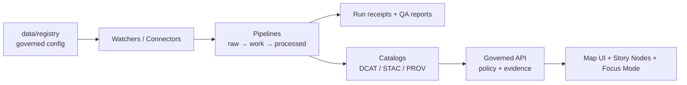

# 🗂️ `data/registry/` — KFM Data Registry


> **Single source of truth** for what upstream data KFM is allowed to ingest, how it is governed (rights + sensitivity), and which automations are allowed to touch it.

---

## Why this folder exists

KFM ingestion is connector-driven and governance-first: **if it can be cited by Story Nodes or Focus Mode, it must be reproducible, policy-checked, and traceable to evidence**.

This registry is where we declare (and version-control) the *inputs* to that trust model:

- what the dataset is (`dataset_id`, title, domain)
- where it comes from (upstream access + cadence)
- what we’re allowed to do with it (license, attribution, restrictions)
- how it must be protected (sensitivity classes + redaction strategy)
- which pipelines/watchers may operate on it (allow-lists)

> [!IMPORTANT]
> **Registry changes are governed changes.** They can alter what gets ingested, published, or exposed. All changes must be PR-reviewed and must pass schema + policy gates.

---

## What belongs here

- **Dataset registry entries** (one file per dataset/source)
- **Automation allow-lists** (e.g., a signed Watchers Registry)
- **Controlled vocabularies** used by policy gates and UI (sensitivity classes, policy labels, domains)

## What must NOT belong here

- ❌ **Secrets** (API keys, tokens, passwords)
- ❌ Raw/work/processed **data assets**
- ❌ **Restricted coordinates** or restricted attributes for sensitive records
- ❌ Per-run artifacts (run receipts, QA reports) — these are **emitted by pipelines** and stored with run outputs/provenance

> [!CAUTION]
> If a file contains restricted fields, it **must not** be committed here. Store restricted information only in controlled stores and publish generalized derivatives.

---

## Directory layout

```text
data/registry/
  README.md

  datasets/              # Dataset/source registry entries (YAML/JSON)
  watchers/              # Watcher/automation allow-list(s)
  vocab/                 # Controlled vocabularies used by policy + UI
  profiles/              # Optional: mapping hints to canonical concepts
```

> [!NOTE]
> Folder names and schema filenames below are **proposed defaults** (not confirmed in repo).  
> If your repo already uses different paths, prefer the repo reality and update this README.

---

## How it fits into the KFM “truth path”



---

## Registry invariants

> [!IMPORTANT]
> **Fail closed by default.** If required rights/sensitivity metadata is missing, the dataset is **not promotable** and must not be displayed as “trusted.”

- **Determinism:** canonicalize → hash → diff so identical inputs yield identical outputs (or the run records why not).
- **License-first:** capture and enforce license/attribution at ingest; block promotion if unknown/forbidden.
- **Provenance by default:** every promoted artifact links to a PROV chain and deterministic checksums.
- **No overwrites:** new runs produce new versions; prior versions remain addressable.
- **Trust membrane:** no external client reaches storage directly; access flows through governed APIs + policy.
- **Authority boundaries:** do not overwrite a “golden source” with derived fusion; keep derived products ethically bounded.

---

## IDs and versioning

KFM distinguishes:

- **Dataset (stable):** `dataset_id` is stable and human-meaningful (publisher + product + scope).
- **DatasetVersion (content-addressed):** version IDs should be derived from content (e.g., hash of raw manifest + metadata).
- **Evidence citations:** should reference `DatasetVersion` plus stable upstream `source_record_id`(s) where applicable.

> [!TIP]
> Prefer IDs that remain stable even if file paths change. Treat paths as *storage layout*, not identity.

---

## Dataset registry entries

Each dataset entry captures:
1) **What it is** (title/description/domain)  
2) **How we acquire it** (access + endpoint + cadence)  
3) **What we’re allowed to do** (license + attribution + restrictions)  
4) **How we protect it** (sensitivity class + redaction strategy)  
5) **How it is ingested/published** (connector + catalogs identifiers)

### Required fields (minimum)

| Field | Type | Why it exists |
|---|---|---|
| `dataset_id` | string | Stable dataset identifier |
| `title` | string | Catalog + UI name |
| `domain` | string | Routing / governance grouping |
| `upstream.access` | enum | `api` / `download` / `ftp` / `manual` |
| `upstream.cadence` | string | Freshness expectations |
| `rights.license_spdx` | string | Machine-checkable license gate |
| `rights.attribution` | string | Required attribution shown in UI |
| `sensitivity.class` | enum | `public` / `restricted` / `sensitive-location` / `aggregate-only` |
| `pipelines.connector` | string | Connector/adapter used by orchestration |
| `publish.catalogs` | object | DCAT dataset id and STAC collection id (if spatial) |
| `stewards` | list | Responsible owner(s) / groups |

### Sensitivity handling

Use policy-enforced sensitivity metadata. Minimum recommended classes:

- **Public:** safe to publish without redaction.
- **Restricted:** role-based access required.
- **Sensitive-location:** coordinates must be generalized or suppressed.
- **Aggregate-only:** only publish above thresholds (avoid small-count disclosure).

For **sensitive-location** datasets, prefer **dual-asset publication**:

- **Public derivative dataset** (generalized geometry + redaction provenance)
- **Restricted dataset** (precise geometry + access controls)
- Separate provenance chains for each derivative

---

### Template: dataset registry entry

<details>
<summary><strong>Dataset entry template (YAML)</strong></summary>

```yaml
# data/registry/datasets/<dataset_id>.yaml
# (Schema path is a placeholder; confirm actual schema location in-repo.)
$schema: ../../schemas/dataset-registry.v1.schema.json

dataset_id: "kfm.<publisher>.<product>.<scope>"
title: "Human-readable dataset title"
description: "What this dataset is and why it matters."

domain: "heritage | hazards | ecology | agriculture | ..."

upstream:
  access: "api | download | ftp | manual"
  endpoint: "https://example.org/api"              # never commit secrets
  cadence: "daily | weekly | monthly | occasional"
  upstream_id: "provider-specific id (if any)"
  rate_limit_notes: "respect provider limits; backoff; cache common queries"

rights:
  license_spdx: "CC-BY-4.0"                        # must be verified
  attribution: "Provider / required attribution text"
  restrictions: "Redistribution limits / usage notes"

sensitivity:
  class: "public | restricted | sensitive-location | aggregate-only"
  notes: "What is sensitive and why"
  public_derivative: true                          # required if class != public
  redaction_strategy: "generalize | suppress | threshold | role-gate"

stewards:
  - "group:kfm-data-stewards"
  - "person:<maintainer-handle>"

pipelines:
  connector: "src/connectors/<name>"
  contract: "discover -> acquire -> normalize -> validate -> publish"
  mapping_profile: "profiles/<domain>/<profile>.yaml"

publish:
  catalogs:
    dcat_dataset_id: "dcat:<id>"
    stac_collection_id: "stac:<id>"                # if spatial
  outputs:
    formats: ["GeoParquet", "PMTiles"]             # example only
    truth_path:
      raw: "data/raw/<dataset_id>/"
      work: "data/work/<dataset_id>/"
      processed: "data/processed/<dataset_id>/"
```
</details>

---

## Watchers / automation allow-lists

Watchers detect upstream change, trigger pipeline runs, and open PRs with updated catalogs/receipts.

> [!IMPORTANT]
> Treat watcher configuration as **high-trust**. Prefer a **signed Watchers Registry** as the single allow-list for automation identities and their permissions.

### Template: watcher entry

<details>
<summary><strong>Watcher entry template (YAML)</strong></summary>

```yaml
# data/registry/watchers/<watcher_id>.yaml
$schema: ../../schemas/watcher-registry.v1.schema.json

watcher_id: "kfm-watcher-<name>"
display_name: "KFM Watcher — <name>"

runner:
  type: "github-actions | openshift | kubernetes | manual"
  ref: ".github/workflows/<workflow>.yml"

permissions:
  datasets:
    - "kfm.<publisher>.<product>.<scope>"
  actions:
    - "discover"
    - "ingest"
    - "draft_pr"

attestation:
  required: true
  verifier: "cosign"                               # example only; confirm tooling
```
</details>

---

## Controlled vocabularies

Use vocabularies to avoid “stringly typed” policy and UI logic.

Suggested files:

- `vocab/sensitivity-classes.yaml`
- `vocab/policy-labels.yaml`
- `vocab/domains.yaml`
- `vocab/licenses-spdx.yaml` *(optional; CI can validate against SPDX list)*

---

## Validation and CI gates

This folder is meant to be **machine-validated**.

### Minimum gates (recommended)

- ✅ Registry entries validate against JSON Schemas (deny unknown/invalid fields).
- ✅ Policy checks (OPA/Conftest) enforce:
  - missing/unknown license blocks promotion
  - missing sensitivity class blocks promotion
  - sensitive-location requires a public derivative and recorded redaction strategy
- ✅ Secrets never committed (pattern scans).
- ✅ Catalog writers produce link-check-clean DCAT/STAC/PROV (as applicable).

> [!TIP]
> Treat “schema validation” and “policy gate” as **required status checks** on `main`.

---

## Workflow: adding a new dataset

### 1) Create the registry entry

- [ ] Add `data/registry/datasets/<dataset_id>.yaml`
- [ ] Fill **rights + sensitivity first**
- [ ] Declare cadence (drives freshness/SLO expectations)
- [ ] Reference (or create) a canonical mapping profile

### 2) Implement the connector/pipeline

- [ ] Implement `discover → acquire → normalize → validate → publish`
- [ ] Raw acquisition produces deterministic manifest + checksums
- [ ] Validation gates implemented and enforced in CI
- [ ] Emit catalogs (DCAT always; STAC/PROV as applicable)

### 3) Prove it in CI

- [ ] Unit tests for mapping + coercion rules
- [ ] Integration test against a fixed small slice (stable checksums + counts)
- [ ] Contract test that API responses include provenance and respect redaction

### 4) Open a PR

- [ ] Include updated registry entry and any required catalog template changes
- [ ] Ensure schema + policy gates pass (fail-closed)
- [ ] Request review from dataset stewards / governance owners

---

## References (design authority)

- **KFM Data Source Integration Blueprint v1.0 (2026‑02‑12)** — ingestion workflow, minimum validation gates, sensitivity classes, and ID strategy.
- **KFM Integration Idea Pack (2026‑02‑15)** — contracts-first approach, watchers registry, CI policy gates, fail-closed promotion.
- **KFM Project Blueprint / invariants** — trust membrane, determinism, provenance-first promotion (if present in repo).