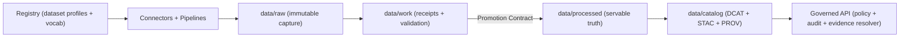

# `data/registry/` — KFM Dataset Registry (Build Driver) + Controlled Vocabularies  
     

> [!IMPORTANT]
> The registry is the **authoritative inventory + obligation ledger** for datasets in KFM.
>
> **If it isn’t registered, it isn’t real.**  
> Unregistered datasets must not be ingested, promoted, served, or cited.

---

## Governance header

| Field | Value |
|---|---|
| Document | `data/registry/README.md` |
| Status | **Governed** |
| Scope | Dataset inventory, dataset profile contracts, controlled vocabulary for classification/sensitivity, optional source capability manifests, schema/tool pins |
| Version | `v1.0.0` |
| Effective date | `2026-02-16` (America/Chicago) |
| Owners | `.github/CODEOWNERS` *(required; if missing → governance gap)* |
| Change control | **Fail closed**: missing/invalid registry entries → deny ingestion/promotion/serve |
| Enforcement truth source | `../../.github/README.md` *(authoritative list of merge-blocking gates)* |

---

## Table of contents

- [What this folder is](#what-this-folder-is)
- [What must never live here](#what-must-never-live-here)
- [Directory layout](#directory-layout)
- [Registry contracts](#registry-contracts)
  - [Dataset profiles](#dataset-profiles)
  - [Controlled vocabulary](#controlled-vocabulary)
  - [Optional registries](#optional-registries)
- [How to register a dataset](#how-to-register-a-dataset)
- [Change management](#change-management)
- [Validation expectations](#validation-expectations)
- [See also](#see-also)

---

## What this folder is

`data/registry/` is a **governed input surface** that drives the rest of the KFM truth path:

- **Pipelines** use the registry as the build plan (connectors, cadence, backfills, expected outputs).
- **Promotion gates** use the registry as the obligation baseline (license, sensitivity, validation thresholds).
- **Policy** uses registry labels/taxonomy as enforceable inputs (default-deny if missing/unknown).
- **UI / Story Nodes / Focus Mode** depend on registry-backed identities and metadata to avoid “mystery datasets.”

### The registry’s job (in one sentence)
Turn “a dataset exists somewhere” into “KFM has a **defined, reviewable, enforceable contract** for that dataset.”



> [!CAUTION]
> Editing registry files can change what the system is allowed to ingest, promote, serve, and cite.  
> Treat registry changes like production changes.

---

## What must never live here

To preserve the trust boundary and reduce leak risk:

- **No secrets** (tokens, API keys, credentials, cookies, signed URLs).
- **No raw datasets** (CSV dumps, GeoJSON exports, PDFs as “evidence blobs”, etc.).
- **No personal contact details** unless governance-approved; prefer team aliases and role-based contacts.
- **No precise sensitive locations** (if you need a reference, register the dataset and handle precision via policy + derived artifacts + PROV).

> [!WARNING]
> If you find secrets here, treat it as a security incident: rotate credentials and purge history where required by policy.

---

## Directory layout

This is the **target governed layout** for `data/registry/`.

```text
data/registry/
├─ README.md                 # (this file) registry contract + how-to
├─ datasets/                 # one dataset profile per dataset_id (governed)
│  └─ <dataset_id>.yml
├─ policy_taxonomy.yml       # controlled vocab for classification/sensitivity/constraints (recommended)
├─ sources.yml               # optional: upstream capabilities (formats, limits, rate rules)
└─ schemas.lock.yml          # optional: schema/tool pins for reproducibility
```

> [!NOTE]
> Some optional files may not exist yet. That is acceptable **only if** the repo documents the gap and fails closed where the missing file would otherwise be required.

---

## Registry contracts

### Dataset profiles

A **dataset profile** is the registry entry that declares:

- identity (`dataset_id`, title, description)
- source access method and constraints
- license + attribution + redistribution rules
- cadence / freshness expectations
- sensitivity labels (classification + flags) and expected redaction/generalization posture
- output types and canonical formats (tabular/vector/raster/media/tiles)
- validation requirements and acceptance thresholds
- backfill policy (time ranges, batching, idempotency)
- governance contacts (role-based)

#### File naming and IDs

- Profile path: `data/registry/datasets/<dataset_id>.yml`
- `<dataset_id>` SHOULD be stable, lowercase, `snake_case`
- Recommended regex: `^[a-z][a-z0-9_]{2,63}$`

> [!IMPORTANT]
> `dataset_id` is a governance identifier. Renaming it is a breaking change across pipelines, catalogs, policy inputs, and citations.

#### Minimum fields (promotion blockers)

These are the fields that SHOULD be treated as **required** for ingestion/promotion:

| Field | Why it’s required |
|---|---|
| `dataset_id` | stable identity + joins across catalogs/provenance/policy |
| `title` | user-facing name and catalog identity |
| `source` | tells connectors how acquisition works |
| `license` | rights-first publishing; missing rights → deny |
| `cadence` | freshness expectations + monitoring |
| `sensitivity` | policy enforcement; unknown labels → deny |
| `outputs` | expected shapes/formats so validators can run |
| `validation` | defines gates and thresholds |
| `backfill` | makes backfills explicit and reproducible |
| `contacts` | escalation path for governance and incidents |

<details>
<summary><strong>Dataset profile template (YAML — illustrative)</strong></summary>

> This template is intentionally verbose. The schema in your repo may be stricter or differently named.  
> If a schema is missing, treat it as a governance gap and close it (fail-closed posture).

```yaml
# data/registry/datasets/<dataset_id>.yml

dataset_id: example_dataset
title: "Example Dataset"
description: "Short description of what this dataset is and why it exists in KFM."

# Optional but recommended: make schema identity explicit for validation + evolution
profile_schema_id: "kfm.registry.dataset_profile.v1"   # (repo-defined)
profile_version: "1.0.0"                                # (semver recommended)

source:
  kind: "api|file|scrape|archive|manual"
  provider: "Provider org or collection name"
  homepage: "https://example.org/datasets/example"
  access:
    method: "https|s3|ftp|manual"
    url: "https://example.org/data/download"
    authentication: "none|api_key|oauth2|session|manual"
    rate_limits:
      requests_per_minute: 60
    notes: "Any special terms, headers, usage constraints, or gotchas."

license:
  id: "CC-BY-4.0|ODC-By|custom|unknown"
  name: "Human-readable license name"
  url: "https://example.org/license"
  attribution: "Required attribution statement (as required by licensor)"
  redistribution: "allowed|restricted|unknown"
  notes: "Any relevant rights constraints or special requirements."

cadence:
  expected: "daily|weekly|monthly|quarterly|annual|static"
  freshness_slo_hours: 240
  timezone: "UTC"

sensitivity:
  classification: "public|restricted|internal"  # MUST come from policy taxonomy
  flags:
    - "sensitive_location"                      # MUST come from policy taxonomy
  notes: "Describe expected redaction/generalization posture."

outputs:
  - output_id: "primary"
    kind: "vector|tabular|raster|media|tiles"
    canonical_format: "GeoParquet|Parquet|COG|PMTiles|PDF|PNG"
    geometry:
      type: "Point|LineString|Polygon|Mixed|None"
      crs: "EPSG:4326"
    temporal:
      kind: "instant|interval|none"
      timezone: "UTC"
      fields:
        start: "start_date"
        end: "end_date"
    schema:
      # repo-defined: either explicit column schema or a pointer to a schema artifact
      ref: "schema://kfm/schemas/example_dataset/v1"

validation:
  required:
    - check: "license"
    - check: "schema"
    - check: "geo"       # if geometry exists
    - check: "time"      # if temporal exists
    - check: "policy"    # classification + flags recognized; default deny on unknown
  thresholds:
    max_null_pct: 0.02
    max_geometry_error_pct: 0.00
    max_duplicate_key_pct: 0.00

backfill:
  allowed: true
  default_range: "1854-01-01/1900-12-31"
  batching: "year"
  idempotency_required: true

contacts:
  - role: "steward"
    name: "KFM Data Stewards"
    email: "data-stewards@example.org"   # prefer group alias
  - role: "source_owner"
    name: "Provider Support"
    url: "https://example.org/support"
```
</details>

---

### Controlled vocabulary

The registry SHOULD include a controlled taxonomy file so that:

- dataset `classification` values are recognized and enforceable
- sensitivity flags are validated (unknown flag → fail closed)
- policy can translate labels into obligations (e.g., generalize geometry)

Recommended file: `data/registry/policy_taxonomy.yml`

A controlled vocabulary should cover (minimum):

- **classification** (`public`, `restricted`, …)
- **sensitivity flags** (`sensitive_location`, `culturally_sensitive`, `pii_risk`, …)
- **redistribution constraints**
- **precision rules** (e.g., when/how to generalize geometry)
- **authority/consent metadata** (CARE alignment)
- **retention rules** (where applicable)

> [!IMPORTANT]
> Labels are policy inputs, not documentation.  
> If a label is not recognized, policy must deny by default.

<details>
<summary><strong>Policy taxonomy sketch (YAML — illustrative)</strong></summary>

```yaml
version: 1

classification:
  - id: public
    description: "Safe to publish to the public."
  - id: restricted
    description: "Requires role-based access; deny to public by default."
  - id: internal
    description: "Non-public; intended for maintainers/reviewers only."

sensitivity_flags:
  - id: sensitive_location
    description: "Coordinates must be generalized or suppressed for public outputs."
    default_obligations:
      - type: generalize_geometry
        precision: "coarse"
  - id: culturally_sensitive
    description: "May require community governance review before publishing."
  - id: pii_risk
    description: "Contains or could infer personal data; enforce redaction/aggregation."

redistribution:
  - id: allowed
  - id: restricted
  - id: unknown
```
</details>

---

### Optional registries

#### `sources.yml` (optional)
A normalized list of upstream providers/systems and their capabilities:

- preferred formats
- stable endpoints
- rate limits / quotas
- required headers / auth patterns
- “watch” support (ETag / Last-Modified)
- terms of use notes

This helps connectors avoid “tribal knowledge.”

#### `schemas.lock.yml` (optional)
Pins schema/tool/profile versions for reproducibility, e.g.:

- registry profile schema version(s)
- DCAT/STAC/PROV profile versions
- validator tool versions

This enables deterministic replays and prevents “same dataset profile, different validation semantics.”

---

## How to register a dataset

1) Create a dataset profile:  
   `data/registry/datasets/<dataset_id>.yml`

2) Ensure:
   - required minimum fields are present
   - `classification` and `flags` exist in `policy_taxonomy.yml` *(or the repo’s authoritative taxonomy source)*
   - license and attribution are explicit (rights-first)

3) Run registry validation (repo-dependent; fail closed).  
   If no validator exists, open a governance issue and treat it as a P0 gap.

4) Open a PR and get CODEOWNERS review.

5) Only after the dataset is merged into the registry should ingestion begin.  
   Next step: follow `data/README.md` for raw → work → processed → catalogs.

---

## Change management

### PR checklist (registry)

- [ ] Change is scoped and reversible
- [ ] Dataset profile still satisfies minimum required fields
- [ ] Any new taxonomy labels are added to `policy_taxonomy.yml` **and** policy is updated accordingly
- [ ] No secrets added (explicit scan)
- [ ] No sensitive location leakage introduced
- [ ] If renaming `dataset_id`: migration plan included (catalog/policy/citation impacts)
- [ ] CI/validators updated if the schema meaning changed
- [ ] References updated in: `../README.md` (data plane) if layout responsibilities change

> [!WARNING]
> Changing the meaning of registry fields without updating validators is “paper governance.”  
> Treat as a governance incident until resolved.

---

## Validation expectations

Registry validation SHOULD include (minimum):

- schema validation of every `datasets/*.yml`
- `dataset_id` format validation + uniqueness
- controlled vocab validation:
  - unknown `classification` → fail
  - unknown `flags` → fail
- required fields present (promotion blockers)
- “no secrets” scanning for registry files
- optional: link validation (homepage/license URLs), if allowed by CI environment

> [!TIP]
> The authoritative list of **merge-blocking** CI gates lives in `../../.github/README.md`.

---

## See also

- Data plane contract: `../README.md`
- Repo guarantees (trust membrane, truth path, promotion contract): `../../README.md`
- Policy library (default deny, sensitivity and redaction): `../../policy/README.md`
- Backend architecture (registry readers, promotion/pipeline flow): `../../src/README.md`
- Governance gatehouse (what CI actually enforces): `../../.github/README.md`