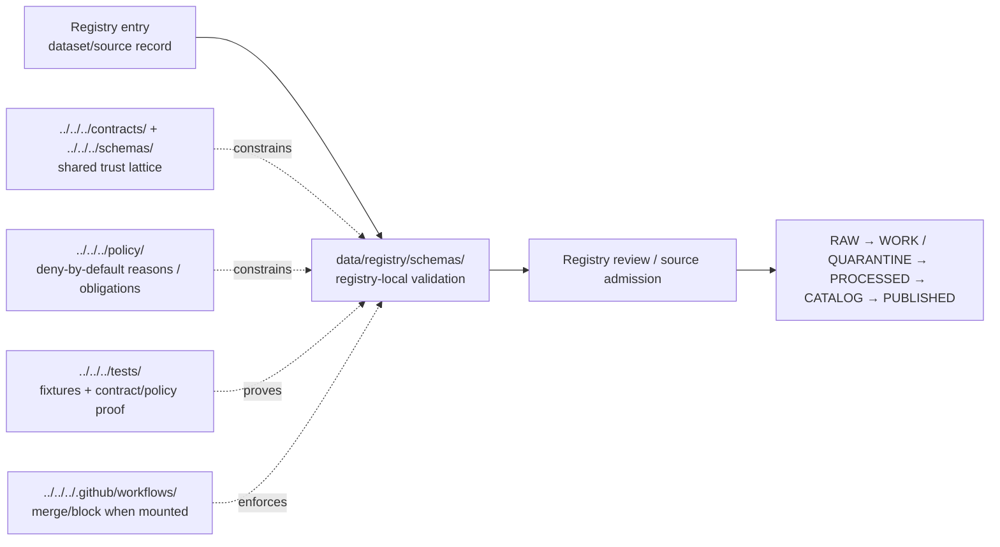

<!-- [KFM_META_BLOCK_V2]
doc_id: kfm://doc/<TODO-UUID>
title: Data Registry Schemas
type: standard
version: v1
status: draft
owners: @bartytime4life
created: 2026-02-14
updated: 2026-03-22
policy_label: <TODO: verify public|restricted|...>
related: [../README.md, ../../README.md, ../../../contracts/README.md, ../../../schemas/README.md, ../../../tests/README.md, ../../../policy/README.md, ../../../.github/workflows/README.md, ../../../.github/CODEOWNERS]
tags: [kfm, data, registry, schemas]
notes: [Created/updated dates grounded from current public GitHub file history; current public main shows a README-only schema subtree; doc_id and policy_label remain unverified and should be replaced before merge]
[/KFM_META_BLOCK_V2] -->

# Data Registry Schemas

Registry-local schema surface for KFM dataset and source registration entries, kept intentionally narrow so shared contract authority does not drift.

> **Status:** `experimental`  
> **Owners:** `@bartytime4life`  
> **Repo fit:** `data/registry/schemas/README.md`  
> **Badges:**       
> **Quick jumps:** [Scope](#scope) · [Repo fit](#repo-fit) · [Inputs](#inputs) · [Exclusions](#exclusions) · [Directory tree](#directory-tree) · [Quickstart](#quickstart) · [Usage](#usage) · [Diagram](#diagram) · [Tables](#tables) · [Definition of done](#definition-of-done) · [FAQ](#faq)

> [!IMPORTANT]
> Current public `main` shows `data/registry/schemas/` as a scaffolded directory containing `README.md` only. Treat any concrete schema filenames in this subtree as **NEEDS VERIFICATION** until the checked-out branch proves them.

> [!CAUTION]
> KFM already has stronger shared schema/contract responsibility maps in [Contracts][contracts-readme] and [Schemas][schemas-readme]. Keep this directory local and narrow; do not let it become a third competing authority layer.

---

## Scope

This directory is for machine-readable schemas that validate registry-local entries and closely related local fragments. It exists to make source and dataset registration reviewable, machine-checkable, and easy to keep adjacent to the registry surface they govern.

This directory is **not** the default home for the shared KFM trust lattice. Release, runtime, correction, and other cross-cutting trust objects should stay in the repo’s authoritative shared schema or contract home.

| Status label | Meaning here |
| --- | --- |
| **CONFIRMED** | The current public tree or adjacent repo docs clearly show it now |
| **INFERRED** | Strong continuity signal from adjacent docs, but not proven in this subtree on current public `main` |
| **PROPOSED** | Recommended local shape that fits current doctrine but is not yet proven in-tree |
| **NEEDS VERIFICATION** | Must be checked against the live branch before treating as implemented |

[Back to top](#data-registry-schemas)

## Repo fit

### Path and role

| Item | Value |
| --- | --- |
| Path | `data/registry/schemas/README.md` |
| Local role | Registry-local schema/index surface |
| Parent | [`../README.md`][registry-readme] |
| Wider data lifecycle | [`../../README.md`][data-readme] |
| Shared contract authority | [`../../../contracts/README.md`][contracts-readme] |
| Shared schema authority | [`../../../schemas/README.md`][schemas-readme] |

### Upstream and downstream links

| Direction | Link | Why it matters |
| --- | --- | --- |
| Upstream | [Registry README][registry-readme] | Owns registry entries that local schemas would validate |
| Upstream | [Data README][data-readme] | Defines the governed truth path and wider `data/` responsibilities |
| Upstream | [Contracts README][contracts-readme] | Owns the shared trust-bearing contract lattice |
| Upstream | [Schemas README][schemas-readme] | Describes shared schema-home placement rules and drift hazards |
| Constraint | [Policy README][policy-readme] | Carries deny-by-default and outcome vocabulary expectations |
| Downstream | [Tests README][tests-readme] | Fixtures and proof surfaces should follow schema work |
| Downstream | [Workflows README][workflows-readme] | Enforcement belongs here once real validator and merge/block workflows are mounted |
| Ownership | [CODEOWNERS][codeowners] | Review routing for `/data/` |

### Path resolution rule

If the checked-out branch keeps registry-entry schemas local, this README acts as the narrow home for that family.

If the branch has consolidated those schemas into the shared repo-wide schema or contract surface, this README should remain as a small signpost and should not duplicate that authority.

[Back to top](#data-registry-schemas)

## Inputs

### Accepted inputs

- Registry-entry JSON Schema files that validate dataset, source, or closely related registry records
- Registry-local shared fragments used only by those entry families
- Small compatibility notes for field evolution that are specific to registry-entry validation
- Human guidance that explains how local schemas relate to shared contract authority

### Preferred naming

| Pattern | Use |
| --- | --- |
| `<entry_family>.schema.json` | Canonical local schema filename |
| `<entry_family>.example.<validity>.json` | Review fixtures when examples live beside the schema |
| `fragments/<name>.schema.json` | Registry-local fragments only when reuse is truly local |

### Continuity signals

- `dataset_entry.schema.json` is a strong **INFERRED** candidate name because adjacent KFM documentation and earlier repo-aligned materials reference it, but the current public `main` tree does not prove it exists in this directory now.
- Any additional local family should be added only after checking that it is not already owned by the shared schema or contract surface.

## Exclusions

This directory should not contain:

- Shared KFM trust-object schemas such as `DecisionEnvelope`, `EvidenceBundle`, `RuntimeResponseEnvelope`, `CorrectionNotice`, or `ReleaseManifest`
- Policy bundles, reason registries, obligation registries, or deny-by-default rule files
- Emitted registry entries, catalogs, proof packs, receipts, or published artifacts
- STAC, DCAT, or PROV outputs
- Outward API DTOs or OpenAPI source files
- Duplicate copies of schemas already treated as authoritative under [Contracts][contracts-readme] or [Schemas][schemas-readme]

> [!NOTE]
> The easiest way to create schema drift is to let local convenience copies accumulate here after a shared contract home already exists elsewhere.

[Back to top](#data-registry-schemas)

## Directory tree

### Current public `main` snapshot

```text
data/
└── registry/
    ├── README.md
    └── schemas/
        └── README.md
```

### Narrow local shape if this subtree becomes active

```text
data/registry/schemas/
├── README.md
├── dataset_entry.schema.json          # INFERRED continuity signal; verify on branch
├── fragments/                         # PROPOSED; only for registry-local reuse
│   └── <name>.schema.json
├── examples/                          # PROPOSED; keep valid/invalid examples reviewable
│   ├── valid/
│   └── invalid/
└── migrations/                        # PROPOSED; only when field changes need explicit notes
```

### Reading rule

| Tree view | Status | How to read it |
| --- | --- | --- |
| `README.md` only | **CONFIRMED** | Present on current public `main` |
| `dataset_entry.schema.json` local file | **INFERRED / NEEDS VERIFICATION** | Strong continuity signal, not current public-tree proof |
| `fragments/`, `examples/`, `migrations/` | **PROPOSED** | Helpful local structure only if the branch actually activates this subtree |

## Quickstart

### 1) Inspect the live branch before assuming local schema authority

```bash
find data/registry -maxdepth 3 -print | sort

sed -n '1,220p' data/registry/README.md
sed -n '1,240p' data/registry/schemas/README.md

sed -n '1,260p' contracts/README.md
sed -n '1,260p' schemas/README.md
sed -n '1,220p' policy/README.md
sed -n '1,220p' tests/README.md
sed -n '1,220p' .github/workflows/README.md

find .github/workflows -maxdepth 1 -type f | sort
```

### 2) Check whether a local registry-entry schema already exists

```bash
find data/registry/schemas -maxdepth 2 -type f | sort

test -f data/registry/schemas/dataset_entry.schema.json \
  && sed -n '1,200p' data/registry/schemas/dataset_entry.schema.json \
  || echo "dataset_entry.schema.json is not proven on this branch"
```

### 3) Make the smallest safe change

```bash
# Good first pass:
# - decide whether local authority is still needed
# - if yes, add one local schema family plus examples
# - if no, keep this README as a narrow index and point to the shared schema home
```

[Back to top](#data-registry-schemas)

## Usage

### Working rules

1. Decide local versus shared authority first.
2. Keep registry entries one level up in [Registry README][registry-readme]; keep only their validation contracts here.
3. Move schema, examples, tests, and documentation together.
4. Prefer additive evolution and explicit migration notes over silent field breakage.
5. If this directory remains scaffold-only, say so plainly rather than implying executable authority.

### What “good” looks like

- A reviewer can tell in under a minute whether this subtree is active or only an index.
- If active, one registry-entry family has a clearly named schema and review examples.
- If inactive, the README still prevents drift by pointing contributors to the authoritative shared home.
- No file here duplicates cross-cutting families already governed elsewhere.

## Diagram


```mermaid
flowchart LR
    Entry["Registry entry<br/>dataset/source record"] --> Local["data/registry/schemas/<br/>registry-local validation"]
    Shared["../../../contracts/ + ../../../schemas/<br/>shared trust lattice"] -. constrains .-> Local
    Policy["../../../policy/<br/>deny-by-default reasons / obligations"] -. constrains .-> Local
    Tests["../../../tests/<br/>fixtures + contract/policy proof"] -. proves .-> Local
    Workflows["../../../.github/workflows/<br/>merge/block when mounted"] -. enforces .-> Local
    Local --> Review["Registry review / source admission"]
    Review --> Flow["RAW → WORK / QUARANTINE → PROCESSED → CATALOG → PUBLISHED"]
```

## Tables

### Current evidence snapshot

| Claim | Status | Notes |
| --- | --- | --- |
| `data/registry/schemas/` exists on current public `main` | **CONFIRMED** | Directory is visible in the repo tree |
| This subtree currently shows `README.md` only | **CONFIRMED** | No concrete schema files are visible in the current public tree |
| `data/registry/` currently shows `README.md` and `schemas/README.md` only | **CONFIRMED** | Parent registry lane is present, but current public tree still reads as scaffold-first |
| `data/registry/README.md` currently owns the local registry description | **CONFIRMED** | Parent surface exists and is now documented as the source-registration lane |
| The repo already has shared `contracts/README.md` and `schemas/README.md` boundary surfaces | **CONFIRMED** | Stronger global placement guidance already exists |
| `.github/workflows/` currently shows `README.md` only | **CONFIRMED** | Current public listing does not show checked-in workflow YAML files |
| A local `dataset_entry.schema.json` family is still mounted here | **NEEDS VERIFICATION** | Referenced in continuity materials, not proven in the current public tree |

### Placement matrix

| Schema kind | Best home | Why |
| --- | --- | --- |
| Registry-entry validation | `data/registry/schemas/` only when proven local | Keeps entry rules close to the registry surface |
| Shared trust-bearing object families | Shared authority in `contracts/` and/or top-level `schemas/` | Prevents parallel schema universes |
| Policy vocab / deny-by-default rules | `policy/` | Policy should stay executable and separately reviewable |
| API/public payload shapes | Shared API/schema home | Keeps external surface contracts centralized |
| Emitted metadata artifacts | `data/catalog/` or generated outputs | These are outputs, not local entry-validation schemas |

### Candidate local wave if authority stays here

| Candidate | Status | Purpose | Notes |
| --- | --- | --- | --- |
| `dataset_entry.schema.json` | **INFERRED** | Validate registry-entry shape | Verify on branch before treating as active |
| `fragments/<name>.schema.json` | **PROPOSED** | Local enums or reusable local fragments | Only if reuse is truly local |
| `examples/valid/*` | **PROPOSED** | Positive review fixtures | Can live here or point to the testing surface |
| `examples/invalid/*` | **PROPOSED** | Negative review fixtures | Must fail deterministically and legibly |

## Definition of done

- [ ] Verify whether this subtree is still an active schema home on the checked-out branch
- [ ] If active, add the first confirmed local schema family with at least one valid and one invalid example
- [ ] If inactive, keep this README narrow and link contributors to the shared authority surface
- [ ] Confirm `doc_id` and `policy_label` in the meta block before merge
- [ ] Ensure parent and sibling READMEs do not contradict this placement rule
- [ ] Do not claim merge-blocking validation until a real workflow YAML and validator path are visible
- [ ] Keep local names, examples, and migration notes in sync in the same PR

[Back to top](#data-registry-schemas)

## FAQ

### Why not put every KFM schema under `data/registry/schemas/`?

Because the repo already has shared contract/schema guidance at higher levels. Putting every family here would blur local registry-entry validation with the repo-wide trust lattice.

### Does current public `main` prove `dataset_entry.schema.json` lives here?

No. It is a continuity signal, not current-tree proof.

### When should a schema live here instead of in the shared schema or contract home?

Only when it validates registry-local entry shapes and does not create duplicate authority for a shared KFM object family.

### Why are `doc_id` and `policy_label` still placeholders?

Because the current public repo evidence confirms the file, owner, neighboring lanes, and file history, but it does not surface a verified document UUID or an explicit policy label for this README. Those values should be resolved on the working branch before merge.

### Where should fixtures live?

Prefer the repo’s testing/proof surfaces when they already exist. If a branch deliberately keeps tiny local examples beside a schema for reviewer clarity, make that choice explicit and non-authoritative.

## Appendix

<details>
<summary><strong>Verification backlog</strong></summary>

| Question | Why it matters | Current posture |
| --- | --- | --- |
| Is `data/registry/schemas/` meant to stay active on the working branch? | Determines whether this README is a local home or just an index | **NEEDS VERIFICATION** |
| Does `dataset_entry.schema.json` exist here on the working branch? | Confirms whether the older registry-entry pattern still holds | **NEEDS VERIFICATION** |
| Where do valid/invalid fixtures live now? | Needed to avoid splitting examples across competing homes | **NEEDS VERIFICATION** |
| Is there a mounted validator command for registry-entry schemas? | Needed before calling anything enforced | **NEEDS VERIFICATION** |
| Do actual workflow YAMLs exist for this surface on the working branch? | Needed before claiming CI gate behavior | **NEEDS VERIFICATION** |

</details>

<details>
<summary><strong>Continuity note</strong></summary>

Older repo-aligned materials and KFM compendium passages referenced a registry-entry schema such as `dataset_entry.schema.json`. That is useful as a continuity hint, but this README intentionally does not promote it to **CONFIRMED** unless the checked-out branch proves the file is present and still authoritative.

</details>

---

[registry-readme]: ../README.md
[data-readme]: ../../README.md
[contracts-readme]: ../../../contracts/README.md
[schemas-readme]: ../../../schemas/README.md
[policy-readme]: ../../../policy/README.md
[tests-readme]: ../../../tests/README.md
[workflows-readme]: ../../../.github/workflows/README.md
[codeowners]: ../../../.github/CODEOWNERS
