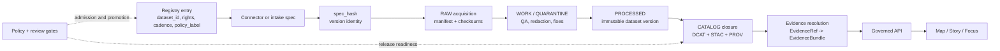

<!-- [KFM_META_BLOCK_V2]
doc_id: kfm://doc/TODO-VERIFY
title: Data Registry
type: standard
version: v1
status: draft
owners: @bartytime4life
created: TODO-VERIFY
updated: 2026-03-22
policy_label: TODO-VERIFY
related: [../README.md, ./schemas/README.md, ../../contracts/README.md, ../../policy/README.md, ../../tests/README.md, ../catalog/stac/README.md, ../../.github/workflows/README.md]
tags: [kfm, data, registry, onboarding, catalog, provenance]
notes: [doc_id and created date need verification from repo history; current public main confirms README.md plus schemas/README.md only; authoritative registry-schema home remains unresolved]
[/KFM_META_BLOCK_V2] -->

# Data Registry
Governed source-registration surface for KFM dataset identity, onboarding, and catalog handoff.

> **Status:** experimental  
> **Owners:** `@bartytime4life`  
> **Path:** `data/registry/README.md`  
>        
> **Quick jumps:** [Scope](#scope) · [Repo fit](#repo-fit) · [Accepted inputs](#accepted-inputs) · [Exclusions](#exclusions) · [Directory tree](#directory-tree) · [Quickstart](#quickstart) · [Usage](#usage) · [Diagram](#diagram) · [Tables](#tables) · [Task list](#task-list--definition-of-done) · [FAQ](#faq) · [Appendix](#appendix)  
> **Repo fit:** parent [`../README.md`](../README.md) · local [`./schemas/README.md`](./schemas/README.md) · shared contracts [`../../contracts/README.md`](../../contracts/README.md) · policy [`../../policy/README.md`](../../policy/README.md) · tests [`../../tests/README.md`](../../tests/README.md) · docs [`../../docs/README.md`](../../docs/README.md) · catalog [`../catalog/stac/README.md`](../catalog/stac/README.md)
>
> [!IMPORTANT]
> Current public `main` confirms that `data/registry/` currently contains `README.md` and `schemas/README.md` only.  
> Treat dataset entry inventories, fixtures, and authoritative registry-schema placement as **PROPOSED** or **NEEDS VERIFICATION** until the active branch proves them.

## Scope
`data/registry/` is the KFM lane where source admission becomes reviewable before publication work begins.

In practical terms, this directory should capture the stable identity and governance posture of a dataset or source family: what it is, who publishes it, how it is acquired, what rights or restrictions apply, what cadence is expected, what policy label is the default starting point, and which downstream catalog or processing surfaces it is meant to feed.

It is **not** a data lake, a runtime database, or a place to drop raw downloads “for now.” Registry material should stay small, explicit, diffable, and PR-reviewable.

### Truth labels used here

| Label | Meaning in this README |
|---|---|
| **CONFIRMED** | Directly supported by current public repo evidence or stable March 2026 KFM doctrine |
| **INFERRED** | Strongly suggested by adjacent repo docs or continuity artifacts, but not freshly proven from a mounted local checkout in this session |
| **PROPOSED** | Doctrine-consistent target shape or working rule that fits KFM but is not yet proven as current branch reality |
| **NEEDS VERIFICATION** | A path, owner, schema-home choice, command, or implementation detail that should be checked before merge |
| **UNKNOWN** | Not supported strongly enough in this session to present as current repo fact |

### Current evidence boundary

| Signal | Current reading |
|---|---|
| Public repo tree | **CONFIRMED:** `data/registry/README.md` exists and `data/registry/` currently shows `README.md` plus `schemas/README.md` |
| Current repo neighbors | **CONFIRMED:** `data/README.md`, `../../contracts/README.md`, `../../policy/README.md`, `../../tests/README.md`, `../../tools/README.md`, and `../../.github/workflows/README.md` all exist as directory-level documentation surfaces |
| Strong doctrine | **CONFIRMED:** KFM treats source onboarding as contract-bearing, uses a governed truth path, requires catalog-triplet closure before publication, and prefers deterministic version identity tied to `spec_hash` |
| Not proven here | **NEEDS VERIFICATION:** current dataset entry inventory, live fixtures, runnable validators, merge-blocking workflow YAML, and the final authoritative home for registry-entry schemas |

[Back to top](#data-registry)

## Repo fit
`data/registry/` sits at the seam between **source onboarding** and the broader **truth path**.

It should describe what KFM intends to integrate and under what governance, while downstream zones and services prove acquisition, transformation, catalog closure, evidence resolution, and public-safe release.

| Relation | Path | Status here | Why it matters |
|---|---|---|---|
| Parent | [`../README.md`](../README.md) | **CONFIRMED** | `data/` defines the governed lifecycle surface and already points to `./registry/README.md` as the likely registration lane |
| Local | [`./schemas/README.md`](./schemas/README.md) | **CONFIRMED** | Registry-local schema boundary exists publicly, but the subtree is README-only today |
| Sibling | [`../catalog/README.md`](../catalog/README.md) | **CONFIRMED** | Catalog lane exists publicly, though it is scaffold-level on current `main` |
| Sibling | [`../catalog/stac/README.md`](../catalog/stac/README.md) | **CONFIRMED** | STAC lane exists publicly, though it is scaffold-level on current `main` |
| Shared machine contract lane | [`../../contracts/README.md`](../../contracts/README.md) | **CONFIRMED** | Strongest current public signal for versioned machine contracts and fixture-linked enforcement planning |
| Top-level schema boundary | [`../../schemas/README.md`](../../schemas/README.md) | **CONFIRMED** | Keeps schema-home ambiguity visible and explicitly warns against parallel authority |
| Shared policy lane | [`../../policy/README.md`](../../policy/README.md) | **CONFIRMED** | Default-deny, reasons/obligations, and finite outcomes should shape registry review and downstream access |
| Verification lane | [`../../tests/README.md`](../../tests/README.md) | **CONFIRMED** | Registry contracts should eventually be exercised by fixtures and negative-path validation |
| Tooling lane | [`../../tools/README.md`](../../tools/README.md) | **CONFIRMED** | Validators, diff helpers, and registry-health tooling belong there rather than inside registry entries |
| Workflow lane | [`../../.github/workflows/README.md`](../../.github/workflows/README.md) | **CONFIRMED** | Current public workflow lane is README-only, so any enforcement described here remains target-state until YAML gates land |
| Downstream consumers | governed APIs, evidence resolution, catalog builders, release proof packs | **PROPOSED** | Registry entries should feed these surfaces, not replace them |

### Working interpretation
A good `data/registry/` README does three jobs at once:

1. make the current public tree legible without exaggerating maturity,
2. define what a source or dataset registration surface is responsible for, and
3. prevent silent drift between registry-local notes, shared contracts, policy, and the governed runtime.

[Back to top](#data-registry)

## Accepted inputs
The following belong in `data/registry/` or in immediately adjacent registry-owned subpaths when the repo chooses to grow them.

| Belongs here | Why it belongs here | Current posture |
|---|---|---|
| Registry README and boundary notes | The lane exists publicly today and needs an explicit operating contract | **CONFIRMED** |
| One file per dataset or source registration entry | Small, reviewable identity and governance records are the core purpose of the registry lane | **PROPOSED** |
| Registry-local schema notes or entry schemas | Useful only if the repo explicitly assigns local authority here instead of a shared top-level contract home | **NEEDS VERIFICATION** |
| Tiny valid/invalid fixtures for registry-entry validation | Keep onboarding reviewable and fail-closed once validators exist | **PROPOSED** |
| Controlled vocab references or narrowly scoped registry vocab files | Useful when they stabilize registry fields such as acquisition method or cadence without creating a second uncontrolled vocabulary universe | **PROPOSED** |
| Cross-links to pipeline spec, connector contract, or downstream catalog targets | Registry entries should point to the governed path they expect to feed | **PROPOSED** |
| Steward notes and governance flags tied directly to a dataset entry | Rights, sensitivity, and escalation information belong close to admission records | **PROPOSED** |

### Minimum intent for a registry entry
A registry entry should be able to answer these questions without requiring a reviewer to reverse-engineer the whole system:

- What is this dataset or source called in KFM?
- Who publishes or controls it?
- How is it acquired?
- What formats and cadence are expected?
- What rights or restrictions apply?
- What default policy label or review posture applies before promotion?
- What canonical spec or connector definition will eventually drive version identity?
- Where should catalog closure and release evidence land downstream?

[Back to top](#data-registry)

## Exclusions
The registry lane should stay focused. The following do **not** belong here as authoritative storage or control surfaces.

| Exclusion | Goes instead | Why |
|---|---|---|
| Raw downloads, acquisition snapshots, and checksum manifests | `../raw/` or the storage analogue the repo uses for RAW | Registry records describe admission; they are not the captured bytes |
| Work outputs, QA scratch files, redaction experiments, or temporary joins | `../work/` or `../quarantine/` analogue | Reviewable transformation state belongs in lifecycle zones, not registry definitions |
| Canonical processed artifacts and published dataset versions | `../processed/` and `../published/` analogues | Registry entries should point to governed outputs, not become them |
| DCAT, STAC, and PROV closure artifacts | `../catalog/` | Catalog triplet records are boundary artifacts of releasable scope |
| Executable policy bundles, deny rules, and decision tests | `../../policy/` | Policy should remain separately reviewable and executable |
| Shared contract law duplicated across multiple homes | one canonical shared contract home | Duplicated authority is drift, not resilience |
| Runtime API handlers, UI payloads, or evidence resolvers | `../../apps/` or `../../packages/` | Registry is admission and identity, not runtime behavior |
| Secrets, tokens, signed URLs, or sensitive acquisition credentials | protected config or secret-management surfaces | Public repo docs must not become secret-handling channels |
| Free-text policy labels, rights buckets, or acquisition methods that bypass controlled vocabularies | canonical vocab registry once chosen | Governance becomes untestable when field values drift into prose |

> [!WARNING]
> The most likely failure mode here is **parallel authority**: a registry-local schema or vocabulary quietly drifting away from the top-level contract or policy lane.  
> Until the repo lands an explicit ADR or equivalent decision, treat shared machine-readable law as singular, not duplicated.

[Back to top](#data-registry)

## Directory tree

### Current verified snapshot

```text
data/registry/
├── README.md
└── schemas/
    └── README.md
```

### Doctrine-aligned target shape *(PROPOSED)*

```text
data/registry/
├── README.md
├── schemas/
│   ├── README.md
│   └── dataset_entry.schema.json        # only if registry-local schema authority is explicit
├── datasets/
│   └── <dataset_slug>.yml
├── fixtures/
│   ├── valid/
│   └── invalid/
├── vocab/
│   ├── acquisition_method.yml
│   ├── cadence.yml
│   └── policy_label.yml
└── examples/
    └── public_sample_dataset.yml
```

> [!NOTE]
> The current public repo gives a stronger signal for **shared** machine contracts in [`../../contracts/`](../../contracts/README.md) than for a second authoritative contract universe under `data/registry/`.  
> Use the target shape above only after the repo makes ownership explicit.

[Back to top](#data-registry)

## Quickstart
Start with inspection, not assumption.

```bash
# inspect the current registry lane
find data/registry -maxdepth 3 -type f | sort

# read the local and shared boundary docs side by side
sed -n '1,240p' data/registry/README.md
sed -n '1,240p' data/registry/schemas/README.md
sed -n '1,240p' data/README.md
sed -n '1,240p' contracts/README.md
sed -n '1,240p' policy/README.md
sed -n '1,240p' tests/README.md
sed -n '1,240p' .github/workflows/README.md

# search the repo for registry-relevant vocabulary
grep -RIn "dataset_entry\|source registry\|spec_hash\|policy_label\|EvidenceBundle" \
  data contracts policy docs tests tools 2>/dev/null || true
```

### Minimal review order
1. Confirm what currently exists under `data/registry/` on the active branch.
2. Confirm where the authoritative registry-entry schema is supposed to live.
3. Confirm which controlled vocabularies are already canonical versus still documentary.
4. Confirm whether any validator, fixture, or workflow gate already consumes this directory.
5. Only then add entry files, local schemas, or fixtures.

> [!TIP]
> If a new registry field requires a shared contract, vocabulary, or policy change, update the owning lane in the same change set rather than hiding the meaning inside one README.

[Back to top](#data-registry)

## Usage

### Add a new registry entry safely
1. Choose a **stable** `dataset_slug` and `dataset_id`.
2. Record publisher/owner, acquisition method, expected formats, expected cadence, and contact/escalation details.
3. Capture rights, redistribution posture, and the default policy label or review-needed posture.
4. Link the canonical intake/connector/pipeline spec that will eventually participate in version identity.
5. Record planned catalog handoff targets or catalog family ownership, even if generation is not implemented yet.
6. Add or update the canonical schema and fixture surfaces that prove the entry is reviewable.
7. Open a PR with evidence, review notes, and any sensitivity/redaction obligations called out explicitly.

### Starter registry-entry contract
Use the table below as a **minimum working contract** until the repo’s authoritative schema home is fixed and published.

| Field | Minimum posture | Why it matters |
|---|---|---|
| `dataset_slug` | Required | Stable short name for filenames, IDs, and review conversations |
| `dataset_id` | Required | Canonical KFM identifier for the dataset/source lane |
| `title` | Required | Human-readable name used in review and downstream discovery |
| `description` | Required | Explains what the dataset/source is and what it is for |
| `publisher` or `owner` | Required | Identifies the upstream publisher or controlling steward |
| `acquisition_method` | Required | Makes fetch/upload expectations reviewable |
| `expected_formats` | Required | Helps validate intake and downstream artifact expectations |
| `expected_cadence` or `static_snapshot` | Required | Clarifies freshness expectations and versioning posture |
| `spatial_coverage` | Required | States geography, grain, or bounds of relevance |
| `temporal_coverage` | Required | States time bounds or the absence of time semantics |
| `rights` / `license` capture | Required | Promotion should fail closed if rights are unclear |
| `default_policy_label` | Required | Establishes the first review posture before runtime filtering or release |
| `contact` / `escalation` | Required | Gives reviewers and operators a real owner path |
| `pipeline_spec_ref` or `connector_ref` | Required | Links registry identity to the governed build path that will create versioned outputs |
| `catalog_targets` | Recommended | Prevents registry work from stopping at admission without a discoverable handoff |
| `notes` / `governance` | Recommended | Preserves special handling, redaction duties, or steward guidance |

### Identity, versioning, and `spec_hash`
KFM’s doctrine is consistent on this point: stable dataset identity should be separate from **version identity**, and version identity should be deterministic enough to audit and rebuild.

**Working rules:**

- Keep `dataset_slug` stable, lowercase, and date-free.
- Use a stable dataset identifier family such as `kfm://dataset/<slug>`.
- Derive `dataset_version_id` from a canonical spec and its `spec_hash`, not from ephemeral runtime details.
- Include registry identity fields and transform rules that change output meaning in the hash input.
- Exclude run IDs, staging paths, and non-semantic timestamps from the hash input.
- Store the exact canonicalized spec next to the computed hash whenever the implementation lands.

**Illustrative identifier families:**

```text
kfm://dataset/<slug>
kfm://run/<run_id>
kfm://artifact/sha256:<digest>
kfm://evidence/<resolver_safe_token>
```

[Back to top](#data-registry)

## Diagram


```mermaid
flowchart LR
    R[Registry entry<br/>dataset_id, rights, cadence, policy_label] --> S[Connector or intake spec]
    S --> H[spec_hash<br/>version identity]
    H --> RAW[RAW acquisition<br/>manifest + checksums]
    RAW --> W[WORK / QUARANTINE<br/>QA, redaction, fixes]
    W --> P[PROCESSED<br/>immutable dataset version]
    P --> C[CATALOG closure<br/>DCAT + STAC + PROV]
    C --> E[Evidence resolution<br/>EvidenceRef -> EvidenceBundle]
    E --> A[Governed API]
    A --> U[Map / Story / Focus]
    POL[Policy + review gates] -. admission and promotion .-> R
    POL -. release readiness .-> C
```

This is the operating intent: registry work should start the governed path, not replace it.

[Back to top](#data-registry)

## Tables

### Admission and promotion gates that matter to the registry lane

| Gate | Minimum proof | Registry implication | Block if |
|---|---|---|---|
| A — Identity and versioning | stable `dataset_id`, version rule, `spec_hash`, naming discipline | Registry entries must not allow unstable or duplicate identity | identity is missing, duplicated, or semantically unstable |
| B — Rights and license clarity | explicit license/rights basis, source-terms capture, obligations | Registry entry must make rights posture reviewable before promotion | rights are missing, unclear, or incompatible |
| C — Sensitivity and redaction | classification, default policy label, redaction/generalization plan when needed | Registry entry must surface whether review stops, narrows, or generalizes output | sensitivity is unresolved or no handling plan exists |
| D — Catalog triplet validity | `DCAT + STAC + PROV` generated, valid, and cross-linked | Registry should point toward catalog closure instead of stopping at admission | catalog closure is missing or inconsistent |
| E — Run receipt and checksums | acquisition manifest, run receipt, output digests | Registry should tie identity to replayable build memory | lineage cannot be reconstructed |
| F — Policy and contract tests | schema, policy, link, and negative-path checks pass | Registry entry must be exercisable by validation, not prose-only | any blocking validation or policy failure remains |
| G — Operational readiness | owner, rollback path, monitoring/review posture | Registry should not feed public release lanes without named responsibility | owner, rollback, or support posture is missing |

### Authority split to retire explicitly

| Concern | Current confirmed signal | Working rule until the repo decides |
|---|---|---|
| Shared machine contract home | [`../../contracts/README.md`](../../contracts/README.md) is the strongest current public signal for versioned machine contracts | Treat shared registry-entry schemas as belonging to the canonical shared home once chosen; do not duplicate by habit |
| Top-level schema boundary | [`../../schemas/README.md`](../../schemas/README.md) exists publicly and warns against parallel schema authority | Keep `schemas/` as a boundary surface, not a second silent registry of truth |
| Registry-local schema lane | `data/registry/schemas/README.md` exists publicly but is README-only today | Add local schema files only with an explicit ownership note or ADR |
| Controlled vocab ownership | Doctrine strongly wants controlled vocabularies; public tree does not yet prove one settled home for every registry-related value set | Pick one canonical home per vocabulary and link to it; avoid shadow copies |
| Validation ownership | `../../tests/README.md`, `../../tools/README.md`, and `.github/workflows/README.md` describe validation families, helper tooling, and workflow gates as separate surfaces | Registry README should describe the burden, not quietly own executable validation logic |

[Back to top](#data-registry)

## Task list & definition of done

### Definition of done for this README
- [ ] Current public-tree fact is clearly separated from doctrine-aligned target shape.
- [ ] Upstream, sibling, and downstream links resolve relative to `data/registry/README.md`.
- [ ] Schema-home ambiguity is made explicit instead of glossed over.
- [ ] No sentence implies live CI gates, validators, or fixtures unless they are branch-confirmed.
- [ ] Commands are either verified shell inspection steps or clearly marked illustrative.
- [ ] Long-form reference material stays in the appendix, not in the scanning path.

### Definition of done for a registry-entry PR
- [ ] The entry validates against the **canonical** schema home.
- [ ] Rights/license posture is explicit and reviewable.
- [ ] Default policy label or review-needed posture is recorded.
- [ ] Source owner/publisher and escalation contact are named.
- [ ] Canonical pipeline/connector spec reference is present.
- [ ] Planned catalog handoff is named.
- [ ] Any sensitivity or redaction obligations are stated explicitly.
- [ ] At least one validation path, fixture, or downstream proof obligation is referenced.
- [ ] The PR keeps `CONFIRMED`, `PROPOSED`, and `NEEDS VERIFICATION` claims honest.

[Back to top](#data-registry)

## FAQ

### Does this directory store datasets?
No. The registry lane should store **registration records and boundary guidance**, not the raw or processed dataset payloads themselves.

### Is a registry entry the same thing as a published dataset version?
No. A registry entry is an admission and identity artifact. Publication still depends on acquisition, QA, processed outputs, catalog closure, policy/review, receipts, and release proof.

### Should registry-entry schemas live in `data/registry/schemas/`?
Not automatically. The current public repo exposes that path, but the stronger current signal for shared machine contracts is still `../../contracts/`. Treat local schema placement as **NEEDS VERIFICATION** until the repo makes authority explicit.

### Can the UI or API read registry files directly?
Not as a trust shortcut. Runtime claim surfaces should still go through governed APIs, policy mediation, catalog closure, and evidence resolution.

### What should happen when rights or sensitivity are unclear?
Fail closed. Keep the work out of release surfaces until the rights posture and required handling plan are explicit.

[Back to top](#data-registry)

## Appendix

<details>
<summary><strong>Illustrative starter registry entry (example only — adapt field names to the canonical schema home before commit)</strong></summary>

```yaml
dataset_slug: ks_census_1870_population
dataset_id: kfm://dataset/ks_census_1870_population
title: Kansas 1870 Census Population by County
description: County-level population counts for Kansas from the 1870 census.
publisher: IPUMS NHGIS
acquisition_method: bulk_download
expected_formats:
  - csv
  - parquet
expected_cadence: static_snapshot
spatial_coverage:
  grain: county
  area: Kansas
temporal_coverage:
  start: 1870-01-01
  end: 1870-12-31
rights:
  license: US-PD
  rights_holder: IPUMS NHGIS
  attribution: IPUMS NHGIS / source publication
default_policy_label: public
contact:
  steward: TODO-VERIFY
  escalation: TODO-VERIFY
pipeline_spec_ref: <VERIFY-CANONICAL-SCHEMA-HOME-AND-PATH>
catalog_targets:
  dcat: <VERIFY>
  stac_collection: <VERIFY>
  prov: <VERIFY>
notes:
  - Example only; keep field names aligned to the canonical registry-entry schema.
  - Do not commit unresolved rights or sensitivity as if they were public-safe facts.
```

### Quick reviewer prompts
- Does the entry describe a **source or dataset lane**, not a runtime payload?
- Are rights, cadence, and policy posture explicit?
- Is the version-identity path (`spec_hash` / canonical spec) understandable?
- Does the entry point toward catalog closure and evidence resolution rather than stopping at acquisition?
- Would a steward know who to contact if something is wrong?

</details>

[Back to top](#data-registry)
