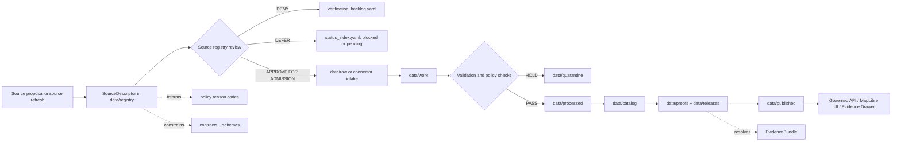

<!-- [KFM_META_BLOCK_V2]
doc_id: kfm://doc/TODO-uuid-data-registry-readme
title: Data Registry
type: standard
version: v1
status: draft
owners: NEEDS_VERIFICATION:data-registry-steward
created: 2026-04-22
updated: 2026-04-22
policy_label: NEEDS_VERIFICATION-public
related: [../README.md, ../../docs/sources/README.md, ../../contracts/objects/source-descriptor/README.md, ../../policy/README.md, ../receipts/README.md, ../proofs/README.md]
tags: [kfm, data, registry, source-descriptor, source-admission]
notes: [Created from attached KFM corpus and visible workspace scan; verify owners, links, UUID, and current registry contents before publication.]
[/KFM_META_BLOCK_V2] -->

# Data Registry

Source-admission control plane for KFM source descriptors, source-role truth, refresh records, and registry-backed publication readiness.

<p>
  
  
  
  
</p>

| Impact field | Value |
| --- | --- |
| **Status** | **experimental** until the live `data/registry/` tree, owners, schemas, and validators are verified |
| **Owners** | `NEEDS VERIFICATION: data/registry steward` |
| **Path** | `data/registry/README.md` |
| **Primary job** | Keep source identity, source role, rights, sensitivity, cadence, and downstream intent explicit before data enters work lanes |
| **Quick jumps** | [Scope](#scope) · [Repo fit](#repo-fit) · [Inputs](#inputs) · [Exclusions](#exclusions) · [Directory tree](#directory-tree) · [SourceDescriptor standard](#sourcedescriptor-standard) · [Flow](#flow) · [Quickstart](#quickstart) · [Review gates](#review-gates) · [FAQ](#faq) |

> [!IMPORTANT]
> `data/registry/` is not a dumping ground for harvested data. It is the reviewable admission surface that says what a source is, what it is allowed to mean, how it may be used, and what still blocks promotion.

---

## Scope

`data/registry/` holds registry records that make source admission inspectable before KFM pipelines, validators, map layers, AI summaries, or publication flows rely on a source.

This directory should answer five questions:

1. **What is the source?** Publisher, system, access mode, family, domain lane, and stable identifier.
2. **What can it mean?** Source role, authoritative tier, observation/model/regulatory/derived distinction, and known caveats.
3. **May KFM use it?** Rights, attribution, redistribution posture, sensitivity, policy label, and review state.
4. **How does it change?** Cadence, freshness expectation, change signals, snapshot/hash strategy, and deactivation rules.
5. **Where does it go next?** RAW/WORK/QUARANTINE handoff, receipts, validation, catalog closure, proofs, release manifests, governed APIs, and UI surfaces.

### Truth posture

| Claim | Label | Notes |
| --- | --- | --- |
| KFM uses a governed evidence-first lifecycle from source intake toward publication | **CONFIRMED doctrine** | Applies across this README. |
| `data/registry/` is the intended home for source descriptors, catalog/registry truth, and source refresh records | **CONFIRMED doctrine / PROPOSED implementation** | Repo inventory still needs verification. |
| Current source descriptor files, owners, validators, and exact path style under this directory | **UNKNOWN** | Must be checked in a mounted repo before publication. |
| Layout examples in this README | **PROPOSED** | Use them as the starting contract unless the live repo proves a different convention. |

[Back to top](#data-registry)

---

## Repo fit

| Relation | Surface | Role | Verification |
| --- | --- | --- | --- |
| Parent data lane | [`../README.md`](../README.md) | Explains lifecycle zones and data-layer boundaries | **NEEDS VERIFICATION** |
| Source doctrine | [`../../docs/sources/README.md`](../../docs/sources/README.md) | Human-facing source admission and source-role guidance | **NEEDS VERIFICATION** |
| SourceDescriptor contract | [`../../contracts/objects/source-descriptor/README.md`](../../contracts/objects/source-descriptor/README.md) | Machine contract and examples for registry entries | **NEEDS VERIFICATION** |
| Policy rules | [`../../policy/README.md`](../../policy/README.md) | Rights, sensitivity, deny/allow/abstain, and promotion rules | **NEEDS VERIFICATION** |
| Process memory | [`../receipts/README.md`](../receipts/README.md) | Run, probe, ingest, and validation receipts | **NEEDS VERIFICATION** |
| Release evidence | [`../proofs/README.md`](../proofs/README.md) | Proof packs, release evidence, rollback references | **NEEDS VERIFICATION** |
| Catalog closure | `../catalog/` | STAC/DCAT/PROV-style catalog outputs downstream of processed artifacts | **NEEDS VERIFICATION** |
| Published artifacts | `../published/` | Immutable or versioned public-safe release outputs | **NEEDS VERIFICATION** |

### Boundary rule

`data/registry/` sits **before** live ingestion and publication. It may point to sources, expected formats, validation gates, and downstream consumers, but it must not behave as raw storage, proof storage, a catalog, or the canonical schema home.

[Back to top](#data-registry)

---

## Inputs

The following belong in `data/registry/` when they are reviewable, explicit, and tied to source admission.

| Accepted input | Why it belongs here | Minimum posture |
| --- | --- | --- |
| `SourceDescriptor` records | Establish source identity, role, rights, cadence, and lifecycle intent | **Required before fetch or scheduling** |
| Source-role registries | Prevent observation/model/regulatory/derived collapse | **Fail closed on unknown roles** |
| Dataset registries | Track dataset instances, versions, snapshots, checksums, and review state | **History-aware** |
| Layer registries | Declare delivery-layer identity without turning tiles into truth | **Derived, downstream-aware** |
| Refresh records | Track source refresh expectations, watch signals, and endpoint/version changes | **Reviewable** |
| Status indexes | Mark active, inactive, deprecated, blocked, superseded, or withdrawn source families | **Append-only where possible** |
| Verification backlog | Record unresolved endpoint, rights, cadence, steward, schema, or policy questions | **Visible blockers** |
| Continuity maps | Preserve old IDs, aliases, supersession notes, and migration status | **No silent renames** |

> [!TIP]
> Descriptor-first onboarding is the safest default: one valid descriptor, one invalid fixture, one policy example, and one review note before any connector is treated as ready.

[Back to top](#data-registry)

---

## Exclusions

These do **not** belong in `data/registry/`.

| Excluded material | Why not here | Put it here instead |
| --- | --- | --- |
| Raw API payloads, downloaded shapefiles, rasters, CSVs, or archives | Registry records are admission metadata, not source-native captures | `../raw/` or lane-specific RAW intake |
| Intermediate normalized files | Work products need receipts and validation state | `../work/` or `../processed/` |
| Quarantined data | Quarantine must preserve reason and review state separately | `../quarantine/` |
| Evidence bundles, proof packs, release manifests, DSSE bundles, signatures | Emitted proof objects are downstream release evidence | `../evidence/`, `../proofs/`, `../releases/` |
| STAC/DCAT/PROV catalog outputs | Catalog closure is downstream of processed artifacts | `../catalog/` |
| Public release artifacts | Published outputs must be immutable/versioned and release-gated | `../published/` |
| Executable policy bodies | Registry entries expose policy posture; policy rules remain executable elsewhere | `../../policy/` |
| Canonical schemas | Registry entries conform to schemas; they do not define the schemas | `../../contracts/` or `../../schemas/` after ADR |
| Secrets, API keys, tokens, private credentials | Never commit credentials or source access secrets | Secret manager / deployment config only |
| AI-generated summaries without evidence resolution | Generation cannot become source truth | Governed API response envelopes and EvidenceBundle-backed surfaces |

[Back to top](#data-registry)

---

## Directory tree

### Recommended starting shape

> [!NOTE]
> Domain blueprints currently imply more than one registry layout style. Until the mounted repo resolves the convention, this README governs **responsibility** and **admission rules**. Normalizing path style should be done through an ADR, not by silently moving records.

```text
data/registry/
├── README.md
├── sources/
│   ├── README.md                         # SourceDescriptor directory guide
│   └── <lane>/
│       ├── _index.yaml                   # lane source index
│       └── <source_id>.yaml              # one source descriptor per source family
├── datasets/
│   └── <lane>.yaml                       # dataset/version registry
├── layers/
│   └── <lane>.yaml                       # derived map/API layer registry
├── source_roles.yaml                     # role enum and compatibility matrix
├── status_index.yaml                     # active/blocked/deprecated/superseded state
├── sensitivity_defaults.yaml             # lane-aware sensitivity defaults
├── refresh_backlog.yaml                  # source-refresh and endpoint verification queue
└── verification_backlog.yaml             # unresolved registry blockers
```

### Existing-layout compatibility

If the live repo already uses a lane-root pattern such as `data/registry/<lane>/sources.yaml`, preserve it during the first pass and add an ADR before migration.

| Pattern | Status | Handling |
| --- | --- | --- |
| `data/registry/sources/<lane>/<source_id>.yaml` | **PROPOSED preferred greenfield shape** | Best for many individual SourceDescriptor files. |
| `data/registry/<lane>/sources.yaml` | **PROPOSED compatibility shape** | Best for compact lane bundles; keep if already in use. |
| `data/registry/<source_id>.yaml` | **LINEAGE / thin-slice shape** | Accept only with index/crosswalk to avoid top-level sprawl. |

[Back to top](#data-registry)

---

## SourceDescriptor standard

Every source descriptor should be explicit enough that a reviewer can deny, defer, or approve admission without reading connector code.

| Field group | Required questions | Example fields |
| --- | --- | --- |
| Identity | What is this source and how is it named? | `id`, `title`, `publisher`, `system`, `source_family`, `homepage` |
| Source role | What can this source mean? | `source_role`, `authoritative_tier`, `modeled`, `geometry_role`, `knowledge_character` |
| Scope | Where and when does the source apply? | `spatial_scope`, `temporal_scope`, `subject_domains`, `jurisdiction` |
| Acquisition | How can it be obtained or watched? | `access_modes`, `method`, `cadence`, `expected_formats`, `change_signal` |
| Rights | What may KFM do with it? | `license_expression`, `attribution_required`, `redistribution_review`, `terms_url` |
| Policy | What release posture applies? | `policy_label`, `sensitivity`, `default_visibility`, `release_gate`, `review_required` |
| Quality | What must be present before admission? | `required_fields`, `crs`, `geometry_requirements`, `freshness_expectation_days`, `uncertainty_fields` |
| Normalization | What deterministic fields are derived? | `target_crs`, `id_pattern`, `geometry_hash`, `spec_hash`, `source_snapshot_at` |
| Downstream | What consumes it after admission? | `raw_target`, `work_target`, `quarantine_target`, `publish_to`, `consumed_by` |
| Continuity | What history must be preserved? | `previous_ids`, `supersedes`, `deactivated_at`, `compatibility_notes` |
| Verification | What is still unresolved? | `verification_status`, `open_questions`, `last_reviewed_at`, `reviewer` |

### Required denial defaults

Registry validators and human review should block admission when any of these are unresolved:

- unknown source role
- missing rights or redistribution posture
- missing sensitivity/default visibility posture
- unclear observation-versus-model-versus-regulatory character
- missing spatial or temporal scope
- missing CRS/geometry expectations for spatial sources
- unverified source identity or unstable source ID
- public-release intent without release gate
- live connector request before descriptor review

[Back to top](#data-registry)

---

## Flow


```mermaid
flowchart LR
  A[Source proposal or source refresh] --> B[SourceDescriptor in data/registry]
  B --> C{Source registry review}

  C -- DENY --> D[verification_backlog.yaml]
  C -- DEFER --> E[status_index.yaml: blocked or pending]
  C -- APPROVE FOR ADMISSION --> F[data/raw or connector intake]

  F --> G[data/work]
  G --> H{Validation and policy checks}
  H -- HOLD --> I[data/quarantine]
  H -- PASS --> J[data/processed]

  J --> K[data/catalog]
  K --> L[data/proofs + data/releases]
  L --> M[data/published]
  M --> N[Governed API / MapLibre UI / Evidence Drawer]

  B -. informs .-> O[policy reason codes]
  B -. constrains .-> P[contracts + schemas]
  L -. resolves .-> Q[EvidenceBundle]
```

The registry does not publish. It defines the admission facts that later lifecycle stages must preserve, validate, cite, or reject.

[Back to top](#data-registry)

---

## Quickstart

Use a verification-first loop before editing registry records.

### 1. Verify the working tree

```bash
git status --short
git branch --show-current
```

### 2. Inventory the registry surface

```bash
find data/registry -maxdepth 4 -type f | sort
```

### 3. Check likely adjacent surfaces

```bash
for path in \
  data/receipts \
  data/proofs \
  data/catalog \
  data/published \
  contracts \
  schemas \
  policy \
  tools/validators
do
  echo "== ${path} =="
  find "${path}" -maxdepth 2 -type f 2>/dev/null | sort | sed -n '1,80p'
done
```

### 4. Run registry validation when available

```bash
if [ -f tools/validators/source_registry/evaluate.py ]; then
  python tools/validators/source_registry/evaluate.py --root data/registry
else
  echo "NEEDS VERIFICATION: source registry validator not found"
fi
```

### 5. Confirm no secrets entered the registry

```bash
grep -RInE '(api[_-]?key|token|secret|password|bearer|credential)' data/registry || true
```

> [!CAUTION]
> A matching line is not always a secret, but every match must be reviewed before merge.

[Back to top](#data-registry)

---

## Usage

### Add or update a source descriptor

1. Create or update a descriptor under the repo-approved registry layout.
2. Mark `verification_status: draft` until rights, cadence, source role, sensitivity, and access mode are reviewed.
3. Add or update one valid fixture and one invalid fixture if descriptor schemas exist.
4. Confirm downstream targets do not point directly to public surfaces unless release gates are present.
5. Record unresolved facts in `verification_backlog.yaml`.
6. Run registry, schema, policy, and secret checks.
7. Request data/registry steward review.

### Deactivate a source

Do not delete a source descriptor merely because a service changed, disappeared, or became unsuitable.

Use a status transition instead:

| Transition | Use when | Required record |
| --- | --- | --- |
| `active -> blocked` | Rights, sensitivity, endpoint, or schema status becomes unsafe | reason, date, reviewer, blocking condition |
| `active -> deprecated` | Better source replaces it, but older releases still cite it | successor ID, compatibility notes |
| `deprecated -> withdrawn` | Public release must be pulled or corrected | correction notice and rollback reference |
| `draft -> rejected` | Proposed source should not enter KFM | rationale and source family |

[Back to top](#data-registry)

---

## Review gates

| Gate | Question | Pass condition | Fail-closed result |
| --- | --- | --- | --- |
| Identity | Is the source named deterministically? | Stable `id`, publisher/system, family, access path | `DENY` or `DEFER` |
| Role | Is the source role explicit? | observation/model/regulatory/derived/candidate role recorded | `DENY` |
| Rights | Is use and redistribution posture reviewable? | license/terms, attribution, redistribution review fields present | `DENY` |
| Sensitivity | Could public release expose protected locations or people? | sensitivity and visibility defaults present | `DENY` or `QUARANTINE` |
| Spatial support | Is CRS/geometry/support meaningful? | CRS, geometry role, precision/support caveats recorded | `DEFER` |
| Temporal support | Is time basis clear? | publication date, observed time, valid time, or cadence represented | `DEFER` |
| Change detection | Can drift be noticed? | cadence, snapshot, checksum/hash, or change signal defined | `DEFER` |
| Downstream intent | Is the next lifecycle stage clear? | RAW/WORK/QUARANTINE targets and receipt expectations set | `DEFER` |
| Public path safety | Is publication gated? | release gate and policy label present before public target | `DENY` |

[Back to top](#data-registry)

---

## Definition of done

A registry change is reviewable when all applicable items are checked:

- [ ] Existing registry layout was inspected before adding a new path style.
- [ ] Descriptor has stable ID, source role, rights, sensitivity, scope, cadence, and downstream intent.
- [ ] Unknown rights or sensitivity blocks public release by default.
- [ ] Observation, model, regulatory, candidate, and derived meanings are not collapsed.
- [ ] Spatial sources include CRS, geometry role, and precision/support caveats.
- [ ] Temporal sources include publication/observation/valid-time distinction where relevant.
- [ ] One valid and one invalid fixture exist when descriptor schemas are present.
- [ ] Registry validation was run, or the missing validator is recorded as `NEEDS VERIFICATION`.
- [ ] No secrets or credentials are committed.
- [ ] Downstream release, proof, catalog, and published paths are referenced but not fabricated as complete.
- [ ] Reviewer, date, and unresolved questions are recorded.

[Back to top](#data-registry)

---

## FAQ

### Is a registry entry evidence?

Not by itself. A registry entry is admission metadata. It can describe where evidence comes from, how it is constrained, and how later EvidenceBundles should resolve support, but it is not a substitute for source captures, receipts, proof packs, or catalog closure.

### Can a connector run before a descriptor exists?

No for governed lanes. A connector-facing candidate should be explainable before it runs: source identity, role, rights, sensitivity, cadence, expected formats, downstream targets, and denial conditions must be visible first.

### Can a map layer cite `data/registry/` directly?

A map layer may reference registry identity and source role, but consequential claims should resolve through released artifacts and EvidenceBundle-backed support. Registry metadata helps interpret the source; it does not replace evidence.

### Should domain lanes keep their own registry files?

Yes, when lane burden matters. Sensitive species, archaeology, infrastructure, hazards, hydrology, geology, soils, agriculture, and people/land records carry different rights and sensitivity burdens. Keep lane-specific source posture visible, and use shared contracts where possible.

### What happens when a source changes terms or endpoint shape?

Mark the source status as blocked, deprecated, or needs review. Preserve previous descriptor state for release lineage and record the refresh or drift event. Do not silently edit history in a way that breaks older citations.

[Back to top](#data-registry)

---

## Appendix

<details>
<summary><strong>Illustrative SourceDescriptor skeleton</strong></summary>

```yaml
id: NEEDS_VERIFICATION_source_id
title: NEEDS_VERIFICATION_source_title
status: draft
owners:
  - NEEDS_VERIFICATION:data-registry-steward

source:
  publisher: NEEDS_VERIFICATION
  system: NEEDS_VERIFICATION
  category: NEEDS_VERIFICATION
  homepage: NEEDS_VERIFICATION
  access_modes:
    - NEEDS_VERIFICATION

identity:
  dataset_family: NEEDS_VERIFICATION
  source_role: NEEDS_VERIFICATION
  authoritative_tier: NEEDS_VERIFICATION
  jurisdiction: NEEDS_VERIFICATION
  spatial_scope: NEEDS_VERIFICATION
  temporal_scope: NEEDS_VERIFICATION
  entity_type: NEEDS_VERIFICATION
  subject_domains:
    - NEEDS_VERIFICATION

acquisition:
  method: NEEDS_VERIFICATION
  cadence: NEEDS_VERIFICATION
  change_signal:
    - NEEDS_VERIFICATION
  expected_formats:
    - NEEDS_VERIFICATION

governance:
  policy_label: NEEDS_VERIFICATION
  sensitivity: NEEDS_VERIFICATION
  default_visibility: NEEDS_VERIFICATION
  release_gate: required
  modeled: NEEDS_VERIFICATION

rights:
  license_expression: NEEDS_VERIFICATION
  attribution_required: NEEDS_VERIFICATION
  redistribution_review: true
  notes:
    - NEEDS_VERIFICATION

quality:
  required_fields:
    - NEEDS_VERIFICATION
  geometry_requirements:
    - NEEDS_VERIFICATION
  crs: NEEDS_VERIFICATION
  freshness_expectation_days: NEEDS_VERIFICATION

normalization:
  target_crs: NEEDS_VERIFICATION
  id_pattern: NEEDS_VERIFICATION
  required_derived_fields:
    - geometry_hash
    - spec_hash
    - source_snapshot_at
    - normalized_at

downstream:
  raw_target: NEEDS_VERIFICATION
  work_target: NEEDS_VERIFICATION
  quarantine_target: NEEDS_VERIFICATION
  publish_to: []
  consumed_by: []

continuity:
  previous_ids: []
  supersedes: []
  compatibility_notes: []
  minimum_preserved_behaviors: []

verification:
  verification_status: draft
  open_questions:
    - NEEDS_VERIFICATION
  last_reviewed_at: NEEDS_VERIFICATION
  reviewer: NEEDS_VERIFICATION
```

</details>

<details>
<summary><strong>Truth-label glossary used in this README</strong></summary>

| Label | Meaning |
| --- | --- |
| **CONFIRMED** | Verified from KFM doctrine, visible source evidence, current workspace inspection, or checked artifacts |
| **INFERRED** | Strongly suggested by corpus patterns but not directly verified as implementation |
| **PROPOSED** | Recommended design or path consistent with KFM doctrine, not verified as present |
| **UNKNOWN** | Not currently verifiable from available evidence |
| **NEEDS VERIFICATION** | Concrete check required before stronger wording, merge, source activation, or publication |

</details>

<details>
<summary><strong>Pre-publish checklist</strong></summary>

- [ ] Replace `TODO-uuid-data-registry-readme` with an approved `kfm://doc/<uuid>`.
- [ ] Confirm owner names or team handles.
- [ ] Verify every relative link in the impact block and repo-fit table.
- [ ] Inventory current `data/registry/` contents and update the directory tree.
- [ ] Resolve or reference the schema-home ADR if descriptor schemas exist.
- [ ] Confirm source registry validator command and update Quickstart.
- [ ] Add links to valid/invalid fixtures once they exist.
- [ ] Confirm whether this README should remain `draft` or move to `review`.
- [ ] Run repo-native Markdown lint/link checks.
- [ ] Confirm no source credentials or restricted source details are exposed.

</details>

[Back to top](#data-registry)
