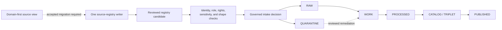

<!-- [KFM_META_BLOCK_V2]
doc_id: kfm://data/registry/agriculture/readme
name: Agriculture Registry README
path: data/registry/agriculture/README.md
type: data-registry-domain-parent-readme
version: v0.3.0
status: draft
owners:
  - <registry-steward>
  - <source-registry-steward>
  - <agriculture-domain-steward>
  - <rights-reviewer>
  - <policy-steward>
  - <validation-steward>
  - <docs-steward>
created: 2026-06-28
updated: 2026-07-27
policy_label: internal-governance
truth_posture: cite-or-abstain
responsibility_root: data/
artifact_family: registry
registry_scope: agriculture-domain-registry-parent
domain: agriculture
path_posture: domain-registry-parent-confirmed; source-child-compatibility-view; independent-source-writes-denied-pending-accepted-topology
sensitivity_posture: registry-internal; aggregate-or-permissioned-public-posture; field-level-and-private-operator-data-fail-closed; rights-and-source-terms-required-before-activation
related:
  - ../README.md
  - ../sources/README.md
  - ../sources/agriculture/README.md
  - ../source_descriptors/README.md
  - sources/README.md
  - ../../raw/agriculture/README.md
  - ../../work/agriculture/README.md
  - ../../quarantine/agriculture/README.md
  - ../../processed/agriculture/README.md
  - ../../receipts/README.md
  - ../../proofs/README.md
  - ../../catalog/README.md
  - ../../../docs/domains/agriculture/SOURCE_REGISTRY.md
  - ../../../docs/domains/agriculture/SOURCES.md
  - ../../../docs/domains/agriculture/SENSITIVITY.md
  - ../../../docs/domains/agriculture/LIFECYCLE.md
  - ../../../docs/domains/agriculture/VERIFICATION_BACKLOG.md
  - ../../../docs/architecture/directory-rules.md
  - ../../../docs/sources/SOURCE_DESCRIPTOR_STANDARD.md
  - ../../../docs/adr/ADR-0017-source-descriptor-admission-process.md
  - ../../../control_plane/source_authority_register.yaml
  - ../../../contracts/source/SOURCE_DESCRIPTOR.md
  - ../../../schemas/contracts/v1/source/source_descriptor.schema.json
  - ../../../policy/domains/agriculture/
tags:
  - kfm
  - data
  - registry
  - agriculture
  - source-descriptor
  - source-role
  - admission-control
  - rights
  - sensitivity
  - quarantine
  - cite-or-abstain
notes:
  - "This README preserves the stable identity and stub-replacement lineage of `data/registry/agriculture/README.md`."
  - "The current directory contains registry scaffolds plus a `sources/` compatibility view; it does not establish active registry consumers or source admission."
  - "The source-registry topology remains conflicted. Independent source-descriptor writes in the domain-first child are denied pending an accepted decision and reversible migration."
  - "This directory is not raw source data, a receipt or proof store, catalog output, release state, policy source, or public Agriculture truth."
[/KFM_META_BLOCK_V2] -->

<a id="top"></a>

# Agriculture Registry

[](#status)
[](#authority-level)
[](#source-registry-topology)
[](#outputs)

Agriculture-scoped routing and scaffold inventory inside KFM's canonical `data/registry/` responsibility root.

> [!CAUTION]
> This directory is not a source of Agriculture truth and has no publication authority. Its `sources/` child is a **NEEDS VERIFICATION / CONFLICTED compatibility view**: do not add or update authoritative SourceDescriptor records there until an accepted topology decision and reversible migration establish one writer.

**Navigation:** [Purpose](#purpose) · [Authority](#authority-level) · [Status](#status) · [Contents](#what-belongs-here) · [Exclusions](#what-does-not-belong-here) · [Inputs](#inputs) · [Outputs](#outputs) · [Inventory](#current-directory-map) · [Source topology](#source-registry-topology) · [Lifecycle](#lifecycle-and-publication-boundary) · [Validation](#validation) · [Review](#review-burden) · [Related folders](#related-folders) · [ADRs](#adrs) · [Rollback](#rollback) · [Last reviewed](#last-reviewed)

---

<a id="scope"></a>

## Purpose

`data/registry/agriculture/` groups Agriculture-scoped registry routing and currently checked-in scaffold records. It helps maintainers distinguish registry identity and treatment metadata from lifecycle payloads, evidence, catalog projections, release decisions, and public delivery.

The directory currently supports two bounded functions:

1. document the Agriculture domain registry boundary and its current direct children; and
2. preserve migration-visible scaffolds while the source-registry topology and operational consumers remain unresolved.

It does **not** activate a source, admit a payload, resolve rights or sensitivity, create an EvidenceBundle, approve a release, or publish content.

<a id="repo-fit"></a>
<a id="registry-boundary"></a>

## Authority level

| Surface | Authority posture |
|---|---|
| `data/registry/` responsibility root | **Canonical** for append-only source, layer, dataset, rights, and sensitivity records under current [Directory Rules](../../../docs/architecture/directory-rules.md). |
| This Agriculture directory | **CONFIRMED nested domain registry parent**; its existence does not choose the canonical source-descriptor topology. |
| Direct non-README files | **CONFIRMED scaffolds**; four YAML files have `entries: []`, two JSONL files are zero bytes, and `.gitkeep` is empty. |
| `sources/` child | **CONFLICTED compatibility view** with independent descriptor writes denied pending an accepted topology decision and migration. |
| Contracts, schemas, policy, evidence, and release | Remain authoritative in their own responsibility roots; this README may link to them but cannot replace them. |
| Public or publication authority | **None.** Ordinary clients must use governed APIs and released artifacts, never this directory directly. |

Current Directory Rules `4 permits `data/registry/<domain>/` or `data/registry/sources/<domain>/`, while `12 uses subtype-first source-registry examples. That variance is not resolved by this README. Creating or hardening parallel registry authority requires an accepted ADR under Directory Rules `2.4.

<a id="status-notes"></a>

## Status

| Claim | State | Evidence boundary |
|---|---:|---|
| Target path and stable document identity | **CONFIRMED** | `data/registry/agriculture/README.md` at the pinned base |
| Parent directory inventory | **CONFIRMED** | Eight direct files plus the `sources/` directory |
| Root-level machine records | **CONFIRMED empty scaffolds** | Four `entries: []` YAML files and two zero-byte JSONL files |
| Domain-first source child | **CONFIRMED compatibility view** | Child README plus four `PROPOSED` greenfield YAML templates |
| Source-template readiness | **PROPOSED / not activation-eligible** | Core role, authority, rights, sensitivity, cadence, access, and citation values remain `TBD`; the child README records detailed schema gaps |
| Subtype-first Agriculture source lane | **CONFIRMED competing lane** | `data/registry/sources/agriculture/` contains a README and fourteen YAML placeholders |
| Source-registry topology | **NEEDS VERIFICATION / CONFLICTED** | No accepted topology ADR or completed migration was verified |
| Source authority register | **CONFIRMED empty / PROPOSED** | `control_plane/source_authority_register.yaml` has `entries: []` |
| Registry consumer or admission runtime | **UNKNOWN / NOT ESTABLISHED** | No supported operational consumer or admission engine was verified |
| Release or publication effect | **None** | Documentation and scaffold presence do not create KFM publication |

> [!IMPORTANT]
> A non-empty file, valid YAML document, schema pass, workflow pass, commit, pull request, or merge is not source admission, activation, evidence closure, release, or publication.

<a id="accepted-material"></a>

## What belongs here

At the current maturity level:

- this boundary README and direct-child routing;
- the existing empty domain scaffold indexes while their contracts, writers, consumers, and migration posture are reviewed;
- links to the canonical contract, schema, policy, lifecycle, evidence, and release surfaces;
- explicit conflict, verification, correction, supersession, and rollback notes;
- migration-only maintenance of the existing `sources/` compatibility view.

Future non-empty registry records belong here only after the owning contract, schema, writer, consumer, identity rules, rights and sensitivity posture, validation, review burden, and canonical relationship are accepted and testable.

<a id="exclusions"></a>

## What does NOT belong here

| Do not place here | Owning responsibility |
|---|---|
| Downloaded payloads, API responses, imagery, statistics, field or operator records, and source-native packages | `data/raw/agriculture/` or governed restricted storage; unresolved material goes to `data/quarantine/agriculture/` |
| Work-in-progress transforms or unresolved derived candidates | `data/work/agriculture/` |
| Validated domain objects or public-safe derivatives | `data/processed/agriculture/`; `data/published/` only after governed release |
| Duplicate authoritative SourceDescriptor records | One accepted source-registry home after a reviewed migration |
| Run, validation, redaction, aggregation, AI, telemetry, or release-support receipts | `data/receipts/` |
| EvidenceBundle, ProofPack, citation validation, or integrity proof | `data/proofs/` |
| STAC, DCAT, PROV, discovery, or public catalog projections | `data/catalog/` |
| ReleaseManifest, PromotionDecision, ReviewRecord, CorrectionNotice, withdrawal, or rollback decision | `release/` |
| Semantic contracts, machine schemas, or executable policy | `contracts/`, `schemas/`, and `policy/` |
| Connector, watcher, pipeline, validator, fixture, test, or workflow code | Their implementation and validation roots |
| Credentials, private endpoints, private operator details, restricted identifiers, or sensitive exact geometry | Approved secret or restricted systems; fail closed when the home is unresolved |
| Public map, API, UI, graph, vector-index, report, dashboard, or generated-answer payloads | Governed downstream surfaces after evidence, policy, review, release, correction, and rollback gates close |

## Inputs

Permitted inputs are reviewed registry candidates or migration evidence, not source payloads. A future non-empty record should be supported by:

- deterministic source or registry identity;
- current provider and source-family evidence;
- source role and authority limits;
- rights, terms, attribution, access, and redistribution review;
- sensitivity and public-release classification;
- cadence, freshness, stale-state, correction, and supersession rules;
- references to accepted contracts, schemas, policy, validators, evidence requirements, review, release, and rollback.

The current direct scaffold files contain none of that operational closure.

## Outputs

This directory currently emits no verified runtime output. Its checked-in content provides:

- human routing and boundary documentation;
- empty, machine-readable scaffold files;
- four `PROPOSED` source-template candidates inside the compatibility child;
- explicit verification and migration work.

A future governed registry record may support admission and downstream processing, but it must not itself be treated as a receipt, proof, catalog record, policy decision, release decision, or public artifact.

<a id="suggested-directory-shape"></a>

## Current directory map

The following is the **CONFIRMED current direct-child tree** at the evidence commit. It is an inventory, not an aspirational design:

```text
data/registry/agriculture/
├── .gitkeep                       # empty placeholder
├── README.md                      # this boundary document
├── file_register.yaml             # greenfield template; entries: []
├── missing_or_planned_files.yaml  # entries: []
├── preservation_matrix.yaml       # entries: []
├── release_index.jsonl            # zero bytes
├── source_state_index.jsonl       # zero bytes
├── verification_backlog.yaml      # entries: []
└── sources/                       # compatibility view; deeper inventory owned by its README
```

| Direct child | Current content | Safe conclusion |
|---|---|---|
| `.gitkeep` | Zero bytes | No authority or implementation claim |
| `file_register.yaml` | Comment plus `entries: []` | Empty greenfield scaffold |
| `missing_or_planned_files.yaml` | Comment plus `entries: []` | Empty planning scaffold |
| `preservation_matrix.yaml` | Comment plus `entries: []` | Empty preservation scaffold |
| `release_index.jsonl` | Zero bytes | No release record; this path cannot grant release authority |
| `source_state_index.jsonl` | Zero bytes | No source state record or activation |
| `verification_backlog.yaml` | Comment plus `entries: []` | Empty local backlog scaffold |
| [`sources/`](sources/README.md) | README plus four `PROPOSED` YAML templates | Compatibility view; no independent writer |

The `sources/` README owns its deeper file inventory. This parent does not duplicate or silently redefine that child contract.

<a id="confirmed-child-lanes"></a>
<a id="path-posture"></a>

## Source-registry topology

| Path | Verified repository state | Posture |
|---|---|---|
| `data/registry/agriculture/sources/` | README plus four legacy-shaped, `PROPOSED` Agriculture YAML templates | Domain-first compatibility view; independent writes denied |
| [`data/registry/sources/agriculture/`](../sources/agriculture/README.md) | README plus fourteen YAML placeholders | Subtype-first lane and primary current reference target; operational conformance remains unproved |
| [`data/registry/source_descriptors/`](../source_descriptors/README.md) | Compatibility README; no Agriculture child was found at the evidence commit | Routing/compatibility surface, not a third writer |

The exact filename `nass_quickstats.yaml` exists in both Agriculture source lanes. That collision is migration evidence, not permission to synchronize by hand or choose a winner by filename.

[ADR-0017](../../../docs/adr/ADR-0017-source-descriptor-admission-process.md) names `data/registry/sources/` as the intended registry instance root, but both its source metadata and effective decision status remain `proposed`. The [Source Descriptor Standard](../../../docs/sources/SOURCE_DESCRIPTOR_STANDARD.md) is also draft/proposed. Until accepted governance resolves the topology:

1. do not add or modify authoritative source records in this domain-first child;
2. do not copy fields between lanes without a field-level preservation and identity review;
3. preserve original blobs, IDs, source-role meaning, rights, sensitivity, cadence, and correction lineage;
4. resolve collisions through an accepted migration record;
5. leave one authoritative writer and make any compatibility view reproducible and non-evolving.

## Lifecycle and publication boundary



The diagram shows responsibility flow, not current runtime proof. Promotion remains a governed state transition. Registry metadata never skips evidence resolution, policy, validation, review, release, correction, or rollback.

<a id="required-checks-before-use"></a>

## Validation

### Documentation checks

For this README, verify:

- one H1 and logical heading order;
- unique explicit anchors and balanced code fences;
- GitHub-compatible alerts, tables, and Mermaid syntax;
- exact-case local files and heading fragments;
- reachable badge images and useful local destinations;
- preservation of `doc_id`, path, created date, draft status, truth posture, and final newline;
- no secret, private identifier, restricted location, or unsupported implementation claim.

### Registry checks

No repository-wide registry admission command was verified for this directory. The [`source-descriptor-validate` workflow](../../../.github/workflows/source-descriptor-validate.yml) validates its currently wired detailed-schema fixture family and explicitly does **not** scan registry records or admit, activate, review, release, or publish a source.

Before any direct scaffold becomes non-empty or any source record changes:

- [ ] resolve the canonical path and one-writer relationship;
- [ ] verify the record's accepted contract and schema;
- [ ] verify deterministic identity and collision handling;
- [ ] verify source role, provider authority, rights, terms, attribution, and redistribution;
- [ ] verify sensitivity, public-release class, exact-location limits, and aggregation requirements;
- [ ] verify cadence, freshness, stale state, correction, deactivation, and supersession;
- [ ] verify the writer, reader, precedence, fallback, and deny behavior;
- [ ] verify fixtures and negative-path tests without live source access where practical;
- [ ] verify evidence, policy, review, release, correction, and rollback references;
- [ ] confirm public clients cannot read this registry directory directly.

A passing parse or shape check proves only that bounded check.

## Review burden

[`.github/CODEOWNERS`](../../../.github/CODEOWNERS) routes `/data/registry/` review to `@bartytime4life`. That is GitHub review routing, not a StewardshipAssignment, rights decision, sensitivity review, policy approval, release approval, or proof of separation of duties.

The placeholder roles in this README's metadata remain **NEEDS VERIFICATION** as real assignments. Non-empty or authority-changing changes require review appropriate to the affected surface, including source/domain stewardship, rights and sensitivity, contracts and schemas, policy and validation, and release governance when downstream release state is implicated.

Re-review this README when:

- a direct child becomes non-empty or gains a consumer;
- the source-registry topology, writer, or migration changes;
- an applicable ADR is accepted, superseded, or rejected;
- rights, sensitivity, public exposure, CODEOWNERS, validation, or workflow behavior changes;
- a correction, withdrawal, deactivation, or rollback exposes a documentation gap.

## Related folders

| Relationship | Path |
|---|---|
| Registry parent | [`data/registry/`](../README.md) |
| Source-registry root | [`data/registry/sources/`](../sources/README.md) |
| Agriculture subtype-first source lane | [`data/registry/sources/agriculture/`](../sources/agriculture/README.md) |
| Agriculture domain-first source view | [`sources/`](sources/README.md) |
| Source-descriptor compatibility root | [`data/registry/source_descriptors/`](../source_descriptors/README.md) |
| Agriculture lifecycle | [RAW](../../raw/agriculture/README.md) · [WORK](../../work/agriculture/README.md) · [QUARANTINE](../../quarantine/agriculture/README.md) · [PROCESSED](../../processed/agriculture/README.md) |
| Receipts, proofs, and catalog | [Receipts](../../receipts/README.md) · [Proofs](../../proofs/README.md) · [Catalog](../../catalog/README.md) |
| Agriculture source guidance | [Source registry](../../../docs/domains/agriculture/SOURCE_REGISTRY.md) · [Source families](../../../docs/domains/agriculture/SOURCES.md) |
| Agriculture sensitivity and lifecycle | [Sensitivity](../../../docs/domains/agriculture/SENSITIVITY.md) · [Lifecycle](../../../docs/domains/agriculture/LIFECYCLE.md) |
| SourceDescriptor meaning and shape | [Compatibility contract](../../../contracts/source/SOURCE_DESCRIPTOR.md) · [Detailed proposed schema](../../../schemas/contracts/v1/source/source_descriptor.schema.json) |
| Authority register | [`control_plane/source_authority_register.yaml`](../../../control_plane/source_authority_register.yaml) |

## ADRs

| Decision surface | Current status | Effect here |
|---|---:|---|
| [ADR-0017 — Source Descriptor Admission Process](../../../docs/adr/ADR-0017-source-descriptor-admission-process.md) | `proposed` | Names an intended source-registry home and admission model; does not accept topology or activate records |
| [ADR-0012 — Connector outputs to RAW or QUARANTINE only](../../../docs/adr/ADR-0012-connector-outputs-to-data-raw-or-data-quarantine-only.md) | `draft` / effective `proposed` | Preserves connector non-publisher and registry non-writer boundaries; not accepted implementation proof |
| Source-registry topology decision | **NEEDS VERIFICATION / not established** | Required before divergent source lanes can converge or this compatibility view can gain a writer |

## Rollback

This documentation-only revision changes no registry payload, source state, policy, lifecycle object, release record, or public surface.

- Before merge: leave or close the draft PR without merging.
- After merge: use a transparent revert of the implementation commit.
- For a later registry migration: preserve prior blobs and IDs, record the old and new authoritative paths, validate one-writer behavior, keep a reversible compatibility mapping, and test correction/deactivation before removing any old path.

Never force-push or rewrite shared registry history to hide a path conflict.

## Last reviewed

| Field | Value |
|---|---|
| Review date | `2026-07-27` |
| Evidence commit | `main@f64f80c7b94fe81903b543158f8ce749b8681ec8` |
| Prior README blob | `020b7257626c248e86ff7ce8b8dd697d73e5a5a7` |
| Review scope | Complete README, direct-child tree, both Agriculture source lanes, source contract/schema, proposed admission ADR, authority register, CODEOWNERS, and applicable workflows |
| Runtime boundary | No live source, credentialed endpoint, deployed registry, policy evaluator, release environment, or public client was exercised |

## Maintainer note

Keep the chain explicit:

```text
registry candidate
  -> governed admission and lifecycle handling
  -> receipts and evidence
  -> policy and review
  -> release decision
  -> governed public surface
```

Never collapse it into:

```text
registry file -> public Agriculture truth
```

[Back to top](#top)
