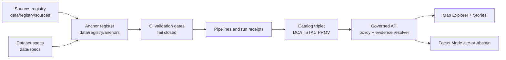

<!-- [KFM_META_BLOCK_V2]
doc_id: kfm://doc/0f1f9f2b-0c3a-4f2c-9ad9-6f8a2e8a5e9f
title: Anchors Registry
type: standard
version: v1
status: draft
owners: KFM Data Stewardship + Governance
created: 2026-03-02
updated: 2026-03-02
policy_label: public
related:
  - ../../../README.md
  - ../README.md
  - ../sources/README.md
  - ../../specs/README.md
  - ../vocab/README.md
  - ../schemas/README.md
tags: [kfm, data-registry, anchors]
notes:
  - Machine-readable anchor set used by CI gates and vNext build order.
[/KFM_META_BLOCK_V2] -->

# Anchors Registry
**One-line purpose:** A small, versioned **anchor dataset allow-list** that defines the vNext baseline and must be **promotable**, **citable**, and **policy-safe**.


**Status:** Draft (vNext) • **Owners:** TBD (Data Stewards + Governance) • **Scope:** `data/registry/anchors/`

---

## Quick navigation
- [Where this fits](#where-this-fits)
- [What belongs here](#what-belongs-here)
- [What must not go here](#what-must-not-go-here)
- [Key concepts](#key-concepts)
- [Anchor register format](#anchor-register-format)
- [Validation and gates](#validation-and-gates)
- [How to add or change an anchor](#how-to-add-or-change-an-anchor)
- [Definition of Done](#definition-of-done)
- [Directory layout](#directory-layout)
- [Security and governance notes](#security-and-governance-notes)
- [See also](#see-also)

---

## Where this fits

This folder is part of the **trust membrane**: it is a small, reviewable control surface that declares which datasets are considered **anchors** for vNext.

Anchors are intentionally treated differently than “all known datasets”:
- **`data/registry/`** answers: *what sources/datasets exist and under what governance?*
- **`data/specs/`** answers: *what is the canonical onboarding spec we hash into a DatasetVersion?*
- **`data/registry/anchors/`** answers: *which datasets are the baseline anchors that must be build-first and continuously validated?*



> [!IMPORTANT]
> The anchor register is **not** a substitute for dataset specs, catalogs, or evidence.
> It is a **small allow-list** used to keep the vNext build order testable and reversible.

[Back to top](#anchors-registry)

---

## What belongs here

✅ **Acceptable inputs**
- A **machine-readable anchor register** (recommended: `anchors.v1.json`)
- Optional schema and fixtures to keep the register **validator-friendly** in CI
- Minimal documentation and templates that make PR review consistent

Typical “anchor record” data is:
- `tier` (0/1/2/R)
- `source_id` (must exist in Sources Registry)
- `dataset_slug` (must exist in Dataset Specs)
- `domain` (controlled vocabulary)
- `access_posture` (policy label intent)
- `required_artifacts` (what vNext needs to function)
- `notes` (short, factual reviewer context)

[Back to top](#anchors-registry)

---

## What must not go here

❌ **Exclusions**
- Dataset payloads (rasters, vectors, tables, tiles, dumps)
- Secrets (API keys, tokens, credentials, private endpoints)
- Anything that would bypass governed access (e.g., “direct DB connection details”)
- Precise locations for sensitive/vulnerable/culturally restricted sites
- Huge narrative write-ups (put those in `/docs` and link from here)

> [!WARNING]
> If an anchor includes sensitive locations, this folder must store **policy-safe metadata only**.
> Publish generalized derivatives via specs + pipelines; never store precise coordinates here “for convenience.”

[Back to top](#anchors-registry)

---

## Key concepts

### What is an anchor dataset?
An **anchor** is a dataset/source that the system treats as a baseline reference:
- it unblocks Map Explorer + core stories
- other layers join to it (boundaries, time series baselines, canonical reference frames)
- it should be durable, auditable, and safe to serve according to policy

### Tiering
| Tier | Meaning | Typical use |
|---:|---|---|
| 0 | Build-first anchors | Foundational baselayers + core time-series (unblocks vNext UX) |
| 1 | Expand safely | High-leverage enrichers after trust primitives are proven |
| 2 | Contextual enrichment | Valuable but rights/sensitivity complexity or optional UX |
| R | Restricted / high-risk | Known-important but **default-deny**; only generalized/public-safe derivatives are publishable |

> [!TIP]
> If you are unsure whether something belongs in Tier 0: it probably doesn’t.
> Keep Tier 0 small so it’s continuously promotable in CI.

[Back to top](#anchors-registry)

---

## Anchor register format

### Canonical file
**Recommended:** `anchors.v1.json`

Why JSON here:
- easy to schema-validate strictly
- friendly for canonicalization/hashing in tooling
- consistent with “contract surface” posture

### Suggested top-level shape
```json
{
  "kfm_anchor_register_version": "v1",
  "updated": "2026-03-02",
  "anchors": [
    {
      "tier": 0,
      "source_id": "us_census_tiger",
      "dataset_slug": "us_census_tiger",
      "domain": "boundaries",
      "access_posture": "public",
      "required_artifacts": ["geoparquet", "pmtiles"],
      "notes": "County/tract/city boundaries used for joins and baselines."
    }
  ]
}
```

### Field reference
| Field | Required | Meaning | Gate impact |
|---|:---:|---|---|
| `kfm_anchor_register_version` | ✅ | Register schema/version | Breaks CI if unknown |
| `updated` | ✅ | Last update date | Audit/review cue |
| `anchors[]` | ✅ | List of anchor records | CI enumerates anchors |
| `anchors[].tier` | ✅ | 0/1/2/R | Build order + policy triggers |
| `anchors[].source_id` | ✅ | Must exist in Sources Registry | Cross-link gate |
| `anchors[].dataset_slug` | ✅ | Must exist in Dataset Specs | Cross-link gate |
| `anchors[].domain` | ✅ | Category for grouping/filtering | Vocab gate |
| `anchors[].access_posture` | ✅ | Policy label intent | Policy gate |
| `anchors[].required_artifacts[]` | ✅ | Artifact classes required for vNext | Promotion readiness |
| `anchors[].notes` | ⛳ | Short reviewer context | PR quality |

⛳ = recommended but may start optional while wiring the system.

### Cross-reference invariants
Every anchor entry is expected to be “grounded” by:
- a **Sources Registry** entry for `source_id` (rights/terms snapshot + sensitivity intent)
- a **Dataset Spec** for `dataset_slug` (canonical onboarding spec used for `spec_hash`)
- pipeline receipts + catalogs after promotion (DCAT/STAC/PROV)

[Back to top](#anchors-registry)

---

## Validation and gates

This directory is designed to support **fail-closed** enforcement.

### Minimum recommended CI validations
- **Schema validation**
  - `anchors.v1.json` validates against an `anchors_register.v1.schema.json` (location repo-defined)
- **Controlled vocab validation**
  - validate `tier`, `domain`, `access_posture`, and `required_artifacts` values
- **Cross-link validation**
  - every `source_id` exists in `data/registry/sources/`
  - every `dataset_slug` exists in `data/specs/`
- **Safety rules**
  - if `access_posture` is restricted/sensitive, a public-safe derivative spec must exist **or**
    the anchor must be explicitly “non-public by design”
- **Terms snapshot rule**
  - anchors must not be promotable without a terms snapshot pointer in the source record and/or acquisition manifest(s)

> [!IMPORTANT]
> Don’t “fix” a failing anchor gate by weakening validation.
> Fix the missing registry/spec/evidence inputs.

[Back to top](#anchors-registry)

---

## How to add or change an anchor

1) **Ensure the source is registered**
- Add/update the relevant entry under `data/registry/sources/`
- Rights/terms snapshot + sensitivity intent must be explicit

2) **Ensure the dataset spec exists**
- Add/update `data/specs/...` for the `dataset_slug`
- Spec must be schema-valid and suitable as an input to `spec_hash`

3) **Update the anchor register**
- Add the anchor record to `anchors.v1.json` (or the active version)
- Keep diffs small: ideally **one new anchor per PR**

4) **Add fixtures**
- Add/update minimal fixtures so CI can validate:
  - schema correctness
  - cross-links
  - policy defaults

5) **Open PR with governance notes**
- If rights/sensitivity are non-trivial, add a short reviewer note:
  - why this belongs as an anchor
  - what obligations apply (generalization, attribution, redistribution constraints)

[Back to top](#anchors-registry)

---

## Definition of Done

### DoD for an anchor addition PR
- [ ] Anchor register validates (schema + vocab)
- [ ] `source_id` exists in Sources Registry and includes rights/terms snapshot reference
- [ ] `dataset_slug` exists in Dataset Specs and is hashable
- [ ] `access_posture` matches handling plan
- [ ] If sensitive/restricted: a public-safe derivative spec exists (or anchor is explicitly non-public)
- [ ] CI gates pass without weakening validators
- [ ] Notes are factual and short (no narratives, no secrets)

[Back to top](#anchors-registry)

---

## Directory layout

> [!NOTE]
> This README defines the intended structure.
> If some files/folders don’t exist yet on your branch, treat them as **PROPOSED** and add them as you wire the gates.

```text
data/registry/anchors/
├─ README.md                  # (this file) contract + workflow for anchor allow-list
├─ anchors.v1.json             # PROPOSED: canonical machine-readable anchor register
├─ anchors_register.v1.schema.json  # PROPOSED: schema for anchors.v1.json
├─ fixtures/                   # PROPOSED: tiny valid/invalid examples for CI
│  ├─ anchors.v1.valid.json
│  └─ anchors.v1.invalid.missing_source_id.json
└─ templates/                  # PROPOSED: copy/paste scaffolds
   └─ anchor_record.template.json
```

[Back to top](#anchors-registry)

---

## Security and governance notes

- **Default-deny:** if rights or sensitivity are unclear, do not include as a promotable anchor.
- **No secrets:** anchors are reviewed in PRs; keep them safe to publish.
- **Sensitive locations:** never store precise points here. Require generalized derivatives and document the method.
- **Rights complexity:** some sources may be metadata-first or allow derived products only. Encode that as obligations and keep the anchor non-public if needed.

[Back to top](#anchors-registry)

---

## See also
- Repo operating model: `../../../README.md`
- Data registry overview: `../README.md`
- Sources registry: `../sources/README.md`
- Dataset onboarding specs: `../../specs/README.md`
- Controlled vocabularies: `../vocab/README.md`
- Registry schemas: `../schemas/README.md`
