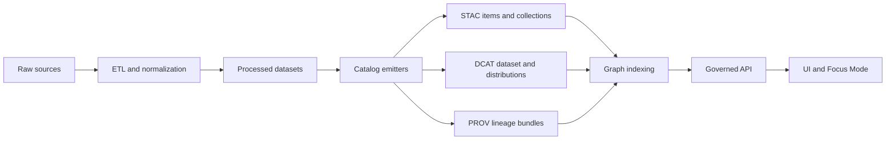

# Catalog templates registry


This directory contains **governed catalog templates** used by Kansas Frontier Matrix to generate the **publication artifacts** that make data *findable*, *auditable*, and *safe to expose*:

- **DCAT** for dataset/distribution discovery views  
- **STAC** for geospatial collection/item indexing  
- **PROV** for provenance and lineage bundles  

> [!IMPORTANT]
> **These templates are contracts.**  
> Any change here can impact downstream indexing, evidence resolution, and what the UI is allowed to show. Treat template changes like production changes.

---

## Quick links

- KFM DCAT profile: `../../../docs/standards/KFM_DCAT_PROFILE.md`
- KFM STAC profile: `../../../docs/standards/KFM_STAC_PROFILE.md`
- KFM PROV profile: `../../../docs/standards/KFM_PROV_PROFILE.md`
- Output catalogs:
  - STAC outputs: `../../stac/`
  - DCAT outputs: `../../catalog/dcat/`
  - PROV outputs: `../../prov/`
- Schemas: `../../../schemas/`
- ETL & catalog emitters: `../../../src/pipelines/`
- Validators & lint tools: `../../../tools/`

---

## What lives here

**This folder is a registry of “how we publish metadata”** — not the published metadata itself.

✅ **Lives here**
- DCAT / STAC / PROV template skeletons
- Shared namespace/context fragments used by multiple templates
- KFM-specific “profile overlay” fragments used consistently across domains

❌ **Does not live here**
- Actual emitted catalogs (those belong in `data/stac/`, `data/catalog/dcat/`, `data/prov/`)
- Raw, working, or processed datasets (those belong under domain folders in `data/…`)
- UI-ready narrative content (Story Nodes belong under `docs/reports/story_nodes/…`)

---

## How templates fit the KFM pipeline



**Key idea:** catalogs are “boundary artifacts” between data production and everything downstream (graph, API, UI). If the catalogs are wrong, downstream behavior is wrong.

---

## Directory layout

### This directory

```text
data/
└── registry/
    └── catalog-templates/                         # Canonical templates for KFM catalogs (STAC/DCAT/PROV)
        ├── README.md                              # How templates are used, naming rules, and validation expectations
        │
        ├── dcat/                                  # DCAT JSON-LD templates (dataset/distribution patterns)
        │   └── *.template.jsonld                  # Reusable DCAT shapes (fill-in placeholders; keep stable IDs/contexts)
        │
        ├── stac/                                  # STAC JSON templates (Collections/Items/Assets patterns)
        │   └── *.template.json                    # Reusable STAC shapes (minimal → extended; link/asset conventions)
        │
        ├── prov/                                  # PROV JSON templates (activities/entities/agents/linking patterns)
        │   └── *.template.json                    # Reusable PROV shapes (lineage prerequisites + run linkage)
        │
        └── shared/                                # Shared building blocks referenced by templates across standards
            ├── contexts/                          # JSON-LD contexts (namespace mappings; versioned + audited)
            │   └── *.json                         # Context files used by DCAT (and any JSON-LD in the system)
            │
            └── vocab/                             # Controlled vocabularies/enums used across templates
                └── *.json                         # Canonical terms (licenses, roles, sensitivity levels, etc.)
```

### Related canonical output locations

```text
data/
├── stac/                                   # STAC catalog (spatial/temporal asset discovery)
│   ├── collections/                        # STAC Collections (groupings by theme/region/time/source)
│   └── items/                              # STAC Items (atomic assets w/ geometry + datetime + asset links)
│
├── catalog/                                # Non-STAC catalogs (registry-style metadata)
│   └── dcat/                               # DCAT datasets/distributions (publishable metadata index)
│
└── prov/                                   # PROV lineage (how/when/with-what inputs outputs were produced)
```

---

## Contract-first rules

> [!NOTE]
> KFM treats schemas and contracts as first-class artifacts. Templates must remain aligned with the project’s profiles and JSON Schemas.

**Rules**
1. **Fail-closed**: if a required field can’t be produced, the pipeline should fail the promotion gate.
2. **Schema-validated emitters**: templates are implemented via code that emits JSON/JSON-LD and validates against schemas/profiles before publish.
3. **Deterministic**: given the same inputs, emitted catalogs should be byte-stable or the differences must be explained and versioned.

---

## Minimum required fields

This section defines what *must* be present at minimum, even for early prototypes.  
Use this as your “you can’t merge without this” checklist.

### DCAT minimum fields

| Field | Required | Purpose | Notes |
|------:|:--------:|---------|------|
| `dct:title` | ✅ | Human-readable name | Stable across versions unless meaning changes |
| `dct:description` | ✅ | Summary for discovery | Keep plain language; include scope + limitations |
| `dct:publisher` | ✅ | Organization identifier | Prefer stable org IDs (not just free text) |
| `dct:license` | ✅ | License expression | Use SPDX ID or a canonical license URL |
| `dct:spatial` | ✅ | Spatial coverage | BBOX or admin coverage; must match STAC extent |
| `dct:temporal` | ✅ | Temporal coverage | Start/end; must match STAC extent |
| `dct:accrualPeriodicity` | ✅ | Update cadence | “static”, “daily”, “monthly”, etc. |
| `dcat:distribution` | ✅ | Access endpoints | Download URL, API endpoint, and/or STAC links |
| `prov:wasGeneratedBy` | ✅ | Provenance linkage | Links to the PROV activity for the emitted artifact |

> [!TIP]
> DCAT is always required for publication. Even if you skip STAC for a purely non-spatial dataset, DCAT + PROV still apply.

### STAC minimum fields

#### STAC collection minimum fields

| Field | Required | Purpose |
|------:|:--------:|---------|
| `id` | ✅ | Stable identifier |
| `title` | ✅ | Human-readable name |
| `description` | ✅ | Summary |
| `license` | ✅ | License |
| `extent.spatial.bbox` | ✅ | Spatial coverage |
| `extent.temporal.interval` | ✅ | Temporal coverage |
| `keywords` | ✅ | Discovery tags |
| `providers` | ✅ | Source + publisher attribution |

#### STAC item minimum fields

| Field | Required | Purpose | Notes |
|------:|:--------:|---------|------|
| `id` | ✅ | Stable identifier | Dataset versioning should not silently overwrite |
| `geometry` | ✅ | GeoJSON geometry | Must be valid |
| `bbox` | ✅ | BBOX | Must align with geometry |
| `datetime` | ✅ | Timestamp | Use `datetime` or an interval pattern consistently |
| `properties.proj:epsg` | ✅ | CRS | Use EPSG when known |
| `assets` | ✅ | Data links | Must include roles + hrefs |
| `links` | ✅ | Cross-object linkage | Must include `self` + `collection`; include provenance linkage |

**STAC item properties guidance**
- Recommended: `platform`, `instruments`, `gsd` (if known)  
- Optional: `eo:bands`  

**STAC assets guidance**
- Include assets for: `data`, `thumbnail`, `metadata` when applicable  
- Each asset should include: `href`, `roles`, and a media type when known.

---

### PROV minimum fields

PROV bundles must be sufficient to trace a published artifact back to source and processing steps.

#### Required conceptual object types

| Type | Required | Examples |
|------|:--------:|----------|
| Entity | ✅ | `raw_asset`, `normalized_table`, `derived_tile`, `ocr_text` |
| Activity | ✅ | `ingest_run`, `transform_job`, `redaction_job` |
| Agent | ✅ | connector/service, steward approval |

#### Required relations

| Relation | Required | Meaning |
|---------|:--------:|---------|
| `wasGeneratedBy(entity, activity)` | ✅ | How an artifact was created |
| `used(activity, entity)` | ✅ | What inputs were consumed |
| `wasDerivedFrom(derived, source)` | ✅ | Lineage chain |
| `wasAssociatedWith(activity, agent)` | ✅ | Responsibility / accountability |

---

## Cross-catalog linkage rules

To keep discovery, provenance, and UI evidence resolution in sync:

### 1) Every published dataset must be linkable across DCAT, STAC, and PROV

- DCAT Dataset ➜ references distributions that resolve to data access *and/or* STAC objects  
- STAC Item/Collection ➜ includes provenance links (derived-from) to PROV  
- PROV ➜ includes the activity that generated the dataset artifacts and references used inputs

### 2) Stable locators are mandatory

Templates must support emitting **stable locators** for:
- dataset ID + version
- STAC collection/item IDs
- DCAT dataset/distribution IDs
- PROV activity/entity IDs

> [!IMPORTANT]
> Evidence references must remain valid across exports and audits. Do not emit ephemeral IDs.

### 3) Spatial/temporal consistency is mandatory

- `dct:spatial` ↔ STAC `extent.spatial.bbox` ↔ STAC Item `bbox/geometry` must agree  
- `dct:temporal` ↔ STAC `extent.temporal.interval` ↔ STAC Item `datetime` must agree

---

## Validation and CI gates

Template-driven emitters must be enforced by CI at publication time.

### Required checks

- [ ] JSON/JSON-LD conforms to KFM profiles and JSON Schemas
- [ ] Minimum required fields present (see tables above)
- [ ] Links resolve (relative repo links or absolute URLs) and are “link-check clean”
- [ ] License + attribution are present and consistent
- [ ] Provenance completeness: every promoted artifact has a PROV chain
- [ ] Deterministic checksums/manifests exist for promoted artifacts
- [ ] Policy labels exist and restricted fields/locations are redacted per rules

> [!CAUTION]
> If you cannot emit compliant metadata, **do not publish**. Fix the pipeline inputs or mapping first.

---

## Governance and sensitivity handling

Catalog templates influence what becomes discoverable and what evidence can be cited.

**You must flag for governance review if a template change:**
- changes required fields
- changes identifier construction rules
- introduces new sensitive fields or more precise location/time disclosure
- affects redaction or classification semantics

**Sensitivity defaults**
- Prefer generalized spatial references when appropriate (admin coverage, coarse bbox)
- Do not embed private individual identifiers
- Prefer linking to governed evidence endpoints over embedding raw sensitive values

---

## How to add or modify a template

### Change process

1. **Edit the template** under `dcat/`, `stac/`, or `prov/`.
2. **Ensure the minimum fields** remain present (or deliberately add new required fields).
3. **Update schemas/profiles** under `schemas/` and `docs/standards/` as needed.
4. **Update emitters** in `src/pipelines/` to fill and validate the template deterministically.
5. **Run validators** (local or CI) and ensure link checks pass.

### Pull request checklist

- [ ] Template change is scoped and reviewed
- [ ] Schema/profile updates included when needed
- [ ] Generated outputs remain valid
- [ ] Backwards compatibility considered (or version bump documented)
- [ ] Governance review performed if required by policy

---

## Template authoring conventions

- **Prefer explicit fields over “magic inference.”**
- **Do not overload semantics** (e.g., don’t store license info in free-text notes).
- **Keep templates minimal**: only fields that can be reliably emitted should be required.
- **Document any KFM-specific extensions** using a consistent `kfm:*` namespace in a shared context fragment.

---

## FAQ

### Why store templates under `data/registry/`?

Because they function like a registry of publication contracts that must evolve with governance, not like ad-hoc generator code snippets.

### Where are the actual catalogs?

- STAC: `data/stac/collections/` and `data/stac/items/`
- DCAT: `data/catalog/dcat/`
- PROV: `data/prov/`

### What happens if a dataset has no STAC?

If a dataset truly has no spatial/temporal asset semantics, STAC may not apply — but DCAT + PROV still apply, and DCAT remains required for publication.

---

