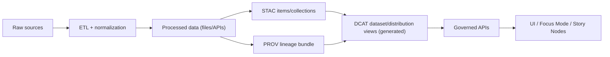

# DCAT catalog templates (KFM)


> [!IMPORTANT]
> Templates in this directory are **governed contract artifacts**. Changing them can change what KFM publishes in its DCAT catalog and what downstream services/API clients can rely on.

## Purpose

This folder stores the **DCAT template set** used to emit KFM’s DCAT dataset/distribution records (typically JSON-LD) during publish/promotion.

DCAT is KFM’s **dataset discovery layer**:

- **STAC** describes geospatial assets (items/collections)
- **DCAT** describes datasets + distributions and points to STAC and/or download endpoints
- **PROV** describes lineage and processing runs

See:

- `docs/MASTER_GUIDE_v13.md`
- `docs/standards/KFM_DCAT_PROFILE.md`

## How it fits into the KFM pipeline



> [!NOTE]
> The folder you are reading now (`data/registry/...`) contains **templates and validation helpers**.
> The generated DCAT catalog output belongs under `data/catalog/dcat/`.

## Where the generated catalog lives

These templates are used by pipeline/CI tooling to write DCAT outputs into the canonical catalog location:

- `data/catalog/dcat/` (DCAT dataset entries / catalog views)

## Directory layout

```text
data/
└─ registry/
   └─ catalog-templates/
      └─ dcat/
         ├─ README.md
         ├─ templates/                 # Jinja2/Handlebars/etc. (implementation-defined)
         ├─ contexts/                  # JSON-LD @context(s)
         ├─ shapes/                    # SHACL shapes (optional but recommended)
         └─ examples/                  # minimal golden examples (CI fixtures)
```

> [!WARNING]
> The exact template engine is intentionally unspecified here.
>
> **Hard requirement:** rendered outputs must **conform to KFM’s DCAT profile** and remain **deterministic**.

## Contract: inputs and outputs

### Inputs

Templates are rendered from a *governed dataset descriptor* (registry record) plus a *promotion/run context*.

Minimum expected input concepts (names are illustrative; map from your actual registry schema):

| Concept | Required | Example | Notes |
|---|:---:|---|---|
| Dataset ID | ✅ | `kfm:soils:sda` | Stable ID (not a random UUID) |
| Dataset version | ✅ | `2026-02-17` or digest | Prefer content-addressed or explicit version IDs |
| Title / description | ✅ | `"Soil Survey"` | Human-readable |
| License | ✅ | `CC-BY-4.0` | Prefer SPDX identifier/URI |
| Publisher / contact | ✅ | org + email | Use stable org IDs where possible |
| Spatial / temporal coverage | ✅* | bbox + date range | Coverage required when known; may be generalized if sensitive |
| Distributions | ✅ | 1..n | Files + APIs; should include access URLs |
| Links to STAC | ⛳ | `stac_collection_id` | Required when the dataset has STAC assets |
| Links to PROV | ⛳ | `prov_activity_id` | Required for promoted artifacts |

\*If coverage is unknown, templates must render a valid record **without inventing coverage**.

<details>
<summary><strong>Suggested variable glossary (implementation-defined)</strong></summary>

| Variable | Type | Typical use |
|---|---|---|
| `dataset_id` | string | Dataset identifier / slug |
| `dataset_version` | string | Version string or digest |
| `title` | string | `dct:title` |
| `description` | string | `dct:description` |
| `keywords` | list[string] | `dcat:keyword` |
| `themes` | list[uri] | `dcat:theme` (controlled vocab) |
| `publisher_uri` | uri | `dct:publisher` |
| `contact_email` | string | `dcat:contactPoint` (vCard) |
| `spatial` | bbox/geometry | `dct:spatial` (generalize if sensitive) |
| `temporal_start` / `temporal_end` | date | `dct:temporal` / `dcat:startDate` / `dcat:endDate` |
| `distributions[]` | objects | Each becomes a `dcat:Distribution` |
| `distributions[].access_url` | url | `dcat:accessURL` |
| `distributions[].download_url` | url | `dcat:downloadURL` (when applicable) |
| `distributions[].media_type` | string | `dcat:mediaType` |
| `distributions[].format` | string | `dct:format` |
| `distributions[].sha256` | string | checksum signal (SPDX) |
| `prov_activity_id` | uri | `prov:wasGeneratedBy` |
| `stac_collection_id` | string/uri | distribution link or related resource |
| `generated_at` | datetime | catalog record metadata (if used) |
| `git_commit` | string | provenance hook (if used) |

</details>

### Outputs

Templates SHOULD be able to emit (at least) the following DCAT resources:

- `dcat:Dataset` records (the thing users search for)
- `dcat:Distribution` records (download/access endpoints)
- `dcat:DataService` records for API endpoints (optional but supported)

## Deterministic identifiers

KFM requires deterministic, reviewable IDs.

**Do:**

- Derive `@id` / `dct:identifier` from stable inputs: dataset ID + version + distribution ID.
- Keep IDs stable across re-renders when inputs do not change.

**Don’t:**

- Generate random UUIDs at render time.
- Embed environment-specific hostnames into identifiers unless explicitly intended (e.g., production catalog base URL).

> [!TIP]
> A good pattern is:
>
> - dataset URI: `urn:kfm:dataset:<dataset_id>:<dataset_version>`
> - distribution URI: `urn:kfm:dist:<dataset_id>:<dataset_version>:<dist_id>`

## Provenance and quality hooks

DCAT supports (and KFM expects) cross-vocabulary links:

- Link datasets to processing activities via **PROV-O** (e.g., `prov:wasGeneratedBy`).
- Optionally express quality measurements via **DQV** (e.g., `dqv:QualityMeasurement`).
- Use checksums where possible (DCAT 3 and common profiles interoperate well with SPDX-style license/checksum signals).

> [!IMPORTANT]
> Metadata should **describe** the dataset, not *contain* the dataset. Avoid inlining large samples or payloads in DCAT.

## Governance and sensitivity

DCAT metadata can leak sensitive details (especially spatial extents, site locations, and contact info).

Templates MUST:

- Respect KFM policy labels / sensitivity flags when present.
- Render **generalized** spatial coverage when required by policy.
- Prefer linking to governed API endpoints rather than raw object-store URLs.

## Validation gates

A PR that changes these templates is expected to include:

- [ ] Golden example output updated under `examples/`
- [ ] JSON-LD parse validation passes
- [ ] SHACL validation passes (when shapes are present)
- [ ] Link-check clean (no broken internal references)
- [ ] Governance review checkbox completed if fields affect sensitivity/license/provenance

### Suggested checks (tooling is repo-dependent)

```bash
# 1) render templates against examples
# 2) JSON-LD parse check (jq or jsonld tooling)
# 3) SHACL validation (pyshacl or RDF4J/Jena)
# 4) policy checks (OPA/Conftest) for required fields
```

## Example: minimal dataset record (JSON-LD)

```json
{
  "@context": {
    "dcat": "http://www.w3.org/ns/dcat#",
    "dct": "http://purl.org/dc/terms/",
    "prov": "http://www.w3.org/ns/prov#",
    "spdx": "http://spdx.org/rdf/terms#"
  },
  "@id": "urn:kfm:dataset:kfm:example:2026-02-17",
  "@type": "dcat:Dataset",
  "dct:identifier": "kfm:example",
  "dct:title": "Example Dataset",
  "dct:description": "Short, non-sensitive description.",
  "dct:license": "https://spdx.org/licenses/CC-BY-4.0.html",
  "dcat:distribution": [
    {
      "@id": "urn:kfm:dist:kfm:example:2026-02-17:primary",
      "@type": "dcat:Distribution",
      "dcat:accessURL": "https://api.kfm.example/v1/datasets/kfm:example"
    }
  ],
  "prov:wasGeneratedBy": {
    "@id": "urn:kfm:prov:activity:run:2026-02-17T12:00:00Z"
  }
}
```

> [!NOTE]
> The JSON-LD above is illustrative. The authoritative constraints are in:
>
> - `docs/standards/KFM_DCAT_PROFILE.md` (profile)
> - `docs/standards/KFM_PROV_PROFILE.md` (lineage profile)

## How to extend

When you need a new field:

1. Add it to the **profile** first (or confirm it is already allowed).
2. Add it to templates (keep defaults safe; never invent missing values).
3. Add/refresh golden examples.
4. Update validators/policy checks.

> [!CAUTION]
> If you change required/mandatory fields, treat it as a breaking change:
> coordinate with Standards + API owners and version accordingly.

---

## Definition of Done for template changes

- [ ] Outputs conform to KFM DCAT profile
- [ ] Deterministic IDs (no randomness)
- [ ] Links to STAC and PROV preserved where applicable
- [ ] Sensitivity flags respected (generalize/redact as required)
- [ ] CI validation gates pass
- [ ] Docs updated (this README + examples)