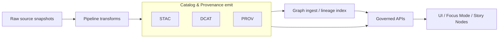

# PROV catalog templates (registry)


-orange)


> [!IMPORTANT]
> This folder is a **governed registry surface**. Changing these templates can change what the system
> considers “traceable evidence,” how lineage is rendered in UI, and what Focus Mode / Story Nodes can cite.
> Treat edits here as **production changes** (reviewed, validated, versioned).

## What this directory is

This directory contains **canonical, reusable PROV template(s)** used by KFM tooling (pipelines, PR-bots,
promotion workflows) to emit **consistent provenance bundles** for:

- ingestion & promotion runs (activities)
- datasets & derived artifacts (entities)
- automated agents and human reviewers (agents)
- sensitivity handling / redaction steps (activities + entity revisions)

These templates exist so provenance is **uniform across dataset families**, and can be validated and policy-gated
before anything is promoted or referenced by user-facing experiences.

## What this directory is not

- Not the **runtime outputs** produced by pipelines.
- Not the “source of truth” for a specific dataset’s lineage history.

If you’re looking for emitted lineage artifacts, see the runtime output area (commonly `data/prov/` in the
repo’s data layout).

## Directory boundaries and trust membrane

KFM’s trust membrane means external clients (including the UI) should consume provenance only via **governed APIs**
(or approved exported artifacts), never by direct storage access.

This registry is part of the *inputs* to that governed flow: template changes alter what pipelines emit, and therefore
what APIs can serve.



## Template inventory

> [!NOTE]
> The exact filenames in this folder may evolve. What matters is that **template IDs, versioning, and required fields**
> remain stable and machine-checkable.

| Template kind | Intended use | Typical emits | Notes |
|---|---|---|---|
| **Run bundle** | One provenance “bundle” per pipeline run / promotion event | `prov:Bundle` (JSON-LD) | Top-level envelope linking to receipts, catalogs, and git sha |
| **Activity templates** | Standardized activity shapes (ingest/normalize/validate/publish/redact) | `prov:Activity` nodes | Should include start/end time + tool/version identifiers |
| **Entity templates** | Dataset snapshots, artifacts, distributions, derived tiles | `prov:Entity` nodes | Must be version-aware and support revision links |
| **Agent templates** | Automated runner, org, reviewer, data steward | `prov:Agent` nodes | Avoid leaking personal data in public bundles |
| **Redaction templates** | Model generalization/redaction as first-class transformation | `prov:Activity` + new `prov:Entity` | Must preserve linkage to original without revealing restricted detail |

## Output contract

All emitted PROV derived from templates in this registry should satisfy:

### Required cross-links

- Links to **source inputs** (raw snapshots) and **outputs** (processed artifacts).
- Links to catalog identifiers:
  - **STAC** collection/item IDs (where applicable)
  - **DCAT** dataset/distribution IDs (where applicable)
- Links to the **run receipt** (or promotion receipt) and the pipeline **code version** (git SHA or immutable build ID).
- A consistent notion of *who/what/when/where* (agent, activity, time, and—when appropriate—location context).

### Determinism and identity

- IDs should be stable and deterministic wherever possible:
  - use canonical JSON serialization + hashing for “spec hash” style identifiers (when applicable)
  - prefer content-addressed digests for immutable artifacts
- When something changes materially, create a **new entity version** and link with revision/derivation relationships.

> [!TIP]
> Provenance is most useful when consumers can answer: *what changed, why, and under which rules*—without guessing.

## Sensitivity and redaction

Provenance can itself be sensitive (e.g., precise locations, restricted cultural knowledge, personal data, or access
roles). Templates must support emitting **public-safe** provenance without breaking auditability.

Recommended pattern:

- **Internal bundle**: complete detail (restricted access)
- **Public bundle**: generalized/abstracted detail + explicit redaction provenance

Model redaction as an explicit activity:

- input entity: original sensitive dataset/artifact
- redaction activity: “generalize”, “mask”, “spatial blur”, “field removal”
- output entity: redacted/public artifact
- link output to input via derivation + revision metadata

> [!WARNING]
> Never “silently” remove sensitive fields. If data is altered for safety, provenance must record **that a redaction occurred**
> and the **policy basis** (without disclosing restricted specifics).

## Validation gates (expected)

Template-driven PROV outputs should be blocked from promotion when validation fails. Typical checks:

- **Schema validation** against repo-controlled JSON Schema(s)
- **JSON-LD sanity** (context, expansion/compaction, stable key presence)
- **PROV constraints** validation (where toolchain exists)
- **Policy-as-code** checks (OPA/Rego/Conftest): required fields, sensitivity labels, license constraints, evidence link completeness
- **Cross-link integrity**: referenced STAC/DCAT/run-receipt identifiers resolve (or are present in the same promotion bundle)

<details>
<summary><strong>Minimum “must have” fields (guidance)</strong></summary>

The following is a practical minimum for KFM-style provenance bundles:

- Bundle:
  - `@context`, `@id`, `@type` includes `prov:Bundle`
  - bundle-level timestamps (generated time)
  - a pointer to run receipt / promotion receipt
  - code identity (git SHA or immutable build ID)
- Activity:
  - `prov:startedAtTime`, `prov:endedAtTime` (or one timestamp + duration when appropriate)
  - association to an agent (`prov:wasAssociatedWith`)
  - input usage (`prov:used`) and output generation (`prov:generated`)
- Entity:
  - stable identifier + version/digest info
  - derivation or revision links when updated
  - license/sensitivity references where applicable (or pointers to where those are expressed)

</details>

## Example skeleton (illustrative)

> [!NOTE]
> This is an illustrative skeleton for documentation only. Replace namespaces and IDs with KFM’s canonical choices.

```jsonc
{
  "@context": {
    "prov": "http://www.w3.org/ns/prov#",
    "dcterms": "http://purl.org/dc/terms/",
    "xsd": "http://www.w3.org/2001/XMLSchema#",
    "kfm": "https://example.org/kfm/ns#"
  },
  "@id": "kfm:prov/bundle/{{bundle_id}}",
  "@type": ["prov:Bundle"],
  "prov:generatedAtTime": "{{generated_at_iso}}",

  "kfm:run_receipt_ref": "{{run_receipt_ref}}",
  "kfm:git_sha": "{{git_sha}}",
  "kfm:policy_gate_id": "{{policy_gate_id}}",

  "kfm:activity": {
    "@id": "kfm:activity/{{run_id}}",
    "@type": ["prov:Activity"],
    "prov:startedAtTime": "{{started_at_iso}}",
    "prov:endedAtTime": "{{ended_at_iso}}",
    "prov:wasAssociatedWith": { "@id": "kfm:agent/{{agent_id}}" },
    "prov:used": [{ "@id": "kfm:entity/{{raw_input_id}}" }],
    "prov:generated": [{ "@id": "kfm:entity/{{processed_output_id}}" }]
  },

  "kfm:agent": {
    "@id": "kfm:agent/{{agent_id}}",
    "@type": ["prov:Agent"],
    "dcterms:title": "{{agent_display_name}}"
  },

  "kfm:entities": [
    {
      "@id": "kfm:entity/{{raw_input_id}}",
      "@type": ["prov:Entity"],
      "dcterms:title": "Raw snapshot",
      "kfm:artifact_digest": "{{raw_digest}}"
    },
    {
      "@id": "kfm:entity/{{processed_output_id}}",
      "@type": ["prov:Entity"],
      "dcterms:title": "Processed output",
      "kfm:artifact_digest": "{{processed_digest}}",
      "prov:wasDerivedFrom": [{ "@id": "kfm:entity/{{raw_input_id}}" }]
    }
  ]
}
```

## How to change templates safely

### Change-control checklist

- [ ] Update template(s) and **bump template version** (major bump if breaking).
- [ ] Update or add corresponding **schema/shape** (JSON Schema and/or SHACL if used).
- [ ] Add/update **golden fixtures** used by tests (example emitted bundles).
- [ ] Ensure CI enforces:
  - [ ] schema validation
  - [ ] policy-as-code checks
  - [ ] cross-link integrity checks
- [ ] Document the change in a short “changelog” note (what changed + why + impact).
- [ ] Governance review if:
  - [ ] sensitivity handling changes
  - [ ] new identifiers / namespaces introduced
  - [ ] new fields affect what can be shown publicly

> [!IMPORTANT]
> If templates change the meaning of evidence objects, update downstream consumers:
> API response shapes, UI lineage views, and Focus Mode citation requirements.

## References (repo-local)

- `KFM_Masterpiece_Vision.pdf` — high-level “truth path” and provenance-by-default framing
- `KFM-Bluprint-&-Ideas.pdf` — integration kit patterns: STAC/DCAT/PROV publish gates, deterministic IDs, policy gating
- `docs/MASTER_GUIDE_v13.md` — directory layout and governed documentation conventions

---
**File:** `data/registry/catalog-templates/prov/README.md`