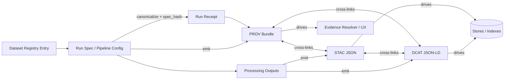

# Shared Catalog Templates (STAC • DCAT • PROV)


This folder contains **shared, reusable catalog template building blocks** used to emit **KFM-standard** catalog artifacts:

- **STAC** (asset/collection discovery)
- **DCAT** (dataset catalog/discovery)
- **PROV** (lineage, run evidence, reproducibility)

These templates are designed to support KFM’s **evidence-first, governance-first** “truth path” and to ensure that emitted catalogs are **cross-linked**, **policy-checkable**, and **reproducible**.

---

## What lives here

This `shared/` directory should contain **template fragments** and **common assets** that multiple dataset families and domains can reuse, such as:

- shared `@context` fragments for JSON-LD
- shared “license/rights” fragments
- shared “CARE/sensitivity labeling” fragments
- shared “provenance pointers” fragments (run receipts / PROV bundle links)
- shared spatial/temporal extent fragments

> [!IMPORTANT]
> **This folder is for templates, not outputs.**  
> Generated catalog outputs belong in the governed output locations (e.g., `data/stac/`, `data/catalog/dcat/`, `data/prov/`), not here.

---

## How shared templates fit into the KFM truth path



---

## Directory layout (recommended)

> [!NOTE]
> Exact filenames may vary by implementation, but keep the *shape* predictable for automation and review.

```text
data/registry/catalog-templates/
├── shared/
│   ├── README.md                         # (this file)
│   ├── contexts/                         # JSON-LD @context fragments (DCAT/PROV)
│   ├── fragments/                        # Reusable field blocks (license, CARE, etc.)
│   ├── vocab/                            # Controlled vocabularies (keywords, policy labels)
│   └── examples/                         # Minimal rendered examples (human review)
├── dcat/                                 # (optional) top-level DCAT templates
├── stac/                                 # (optional) top-level STAC templates
└── prov/                                 # (optional) top-level PROV templates
```

---

## Non-negotiable design rules (shared templates must support these)

### 1) Deterministic identity + reproducibility

Shared templates must be compatible with deterministic identity workflows:

- inputs are **canonicalized**
- a **stable hash** (e.g., `spec_hash`) is derived from the canonical spec
- emitted catalogs can be regenerated and compared without drift

> [!CAUTION]
> If template rendering introduces nondeterminism (timestamps, random IDs, unstable ordering), it breaks reproducibility.  
> Avoid “hidden defaults” and **never generate random identifiers** in a template.

### 2) License-first + rights/CARE labeling

Catalog templates must carry enough information for **policy-as-code** gating:

- license / rights URL or identifier
- redistribution constraints (if any)
- sensitivity / CARE flags
- “default deny when unknown”

### 3) Cross-link contract (STAC ⇄ DCAT ⇄ PROV)

Every emitted record must be able to **link outward**:

- **STAC** should link to relevant **DCAT dataset** and **PROV** bundle/receipt
- **DCAT** should link to relevant **STAC** entries and the **run provenance**
- **PROV** should link raw inputs → processing → outputs and point to the run receipt

> [!TIP]
> Prefer stable identifiers/URIs and store “heavy” details in catalogs, not in the graph.  
> The graph should reference catalog IDs/URIs rather than duplicating full payloads.

### 4) Sensitive locations and restricted knowledge

Some KFM domains include **high-risk spatial data** (e.g., archaeology/cultural locations).

Shared templates must support:

- labeling a record as **restricted**
- supporting a “dual asset” approach (public generalized geometry vs. restricted precise geometry)
- omission/redaction of restricted fields in public outputs

> [!WARNING]
> Do **not** encode precise sensitive coordinates into “public” templates.  
> Treat sensitivity as a first-class field used by policy gates and API responses.

---

## Template mechanics

> [!NOTE]
> **Template engine and syntax are not confirmed in repo.**  
> This folder defines *contract intent* and *content structure*; the renderer may be Jinja/Mustache/YAML-merge/etc.

### Template constraints (apply regardless of engine)

- After rendering, outputs MUST be valid **JSON** or **JSON-LD** (as applicable).
- Rendering MUST be deterministic: identical inputs → identical outputs.
- Avoid implicit current-time injection (if timestamps are required, they belong in run receipts / PROV activities, not arbitrary template fragments).

---

## Shared fragments index (recommended)

| Fragment | Purpose | Used by |
|---|---|---|
| `fragments/license.*` | Standardize `license/rights` fields for policy gates | DCAT, STAC |
| `fragments/care_sensitivity.*` | CARE labels, policy labels, redaction flags | DCAT, STAC, PROV |
| `fragments/provenance_links.*` | Common fields to point at run receipts / PROV bundles | DCAT, STAC |
| `fragments/spatial_extent.*` | Standard CRS-aware extent patterns | STAC, DCAT |
| `fragments/temporal_extent.*` | Temporal interval patterns | STAC, DCAT |
| `contexts/dcat.context.jsonld` | JSON-LD contexts shared by DCAT records | DCAT |
| `contexts/prov.context.jsonld` | JSON-LD contexts shared by PROV exports (if JSON-LD) | PROV |

---

## Minimum required fields (policy + interoperability)

This is a pragmatic “minimum” to keep templates compatible with:

- discovery and interoperability (DCAT/STAC)
- auditability and reproducibility (PROV / receipts)
- policy gates (license + sensitivity)

### DCAT Dataset minimums

- stable dataset identifier (`dct:identifier` or equivalent)
- title + description
- license/rights
- keywords/tags
- at least one distribution (access URL and format)
- provenance pointer (e.g., `prov:wasGeneratedBy` or a link to PROV)

### STAC minimums

- stable id + title + description
- license
- spatial extent + temporal extent (or explicit “unknown” markers)
- asset links to processed outputs
- “via” links to DCAT + PROV evidence objects

### PROV minimums

- entity: raw inputs + processed outputs
- activity: pipeline run (with parameters/spec reference)
- agent: pipeline software + operator/organization (as appropriate)
- link from activity → entities (`used`, `generated`) and to run receipt

> [!IMPORTANT]
> **If an artifact can be cited by Story Nodes or Focus Mode, it must be resolvable to source inputs and run receipts.**

---

## How to use shared templates (typical workflow)

1. **Start from the dataset family contract**
   - A dataset family should define `pipeline.yaml`, `schemas/`, `qa/`, and templates for `stac/`, `dcat/`, `prov/`.

2. **Reference shared fragments**
   - Domain templates should reuse the shared blocks (license, CARE, provenance links) rather than copy/paste.

3. **Render outputs**
   - Render templates into the governed output locations (e.g., `data/catalog/dcat/`, `data/stac/`, `data/prov/`).

4. **Run validation gates (fail closed)**
   - Schema validation (JSON Schema / SHACL where applicable)
   - Cross-link validation (STAC↔DCAT↔PROV)
   - Policy validation (license present, restricted fields handled, insecure URLs rejected)

---

## Contribution rules

### When you change anything in `shared/`

Treat changes here as **platform-level governance changes**, because they affect:

- catalog emission semantics
- policy gating inputs
- evidence traceability
- downstream API/UI resolvers

> [!CAUTION]
> Changes to shared fragments can silently alter many datasets.  
> Prefer additive changes; if behavior changes, bump versions and provide migration notes.

### Definition of Done

- [ ] Fragment has clear purpose and naming
- [ ] Fragment includes at least one `examples/` rendered output
- [ ] Schema validations updated (if required)
- [ ] Cross-link expectations still satisfied
- [ ] Policy gates still pass (license + CARE/sensitivity + receipt/prov pointers)
- [ ] Determinism check: rerender twice → identical bytes
- [ ] Reviewer sign-off from governance/stewardship roles (CODEOWNERS applies)

---

## FAQ

### “Why do we need shared templates?”
To prevent drift. Shared fragments keep licensing, sensitivity labeling, and provenance pointers consistent across all dataset families.

### “Can I manually edit generated DCAT/STAC/PROV outputs?”
Prefer **no**. Outputs should be generated from templates and source registry specs so they can be rebuilt and audited. If a manual hotfix is unavoidable, document it and immediately upstream the fix into templates/specs.

### “Where do I put domain-specific templates?”
In the dataset family’s template folder (not in `shared/`). `shared/` is only for fragments used by *many* dataset families.

---

## Related docs (expected)

- `docs/standards/` — KFM profiles (STAC/DCAT/PROV)
- `schemas/` — JSON Schemas / SHACL shapes for validation
- `policy/` — OPA/Rego + Conftest gates (“fail closed”)
- `data/prov/` — run receipts and provenance bundles (outputs)
- `data/catalog/` and `data/stac/` — catalog outputs