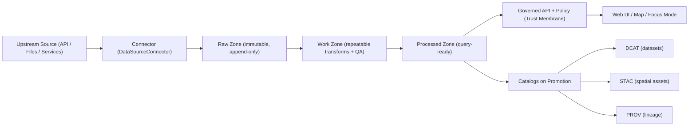

<!--
Path: data/registry/connectors/README.md
Kansas Frontier Matrix (KFM) — Governed Registry Artifact
-->

# 🔌 KFM Connector Registry (data/registry/connectors)


> [!IMPORTANT]
> This directory is a **governed registry** that impacts system behavior.  
> Changes here affect ingestion scheduling, dataset promotion, API policy behavior, and evidence/provenance guarantees.  
> Treat changes as production changes: **reviewable, testable, and audit-ready**.

---

## 📌 What lives here

This folder contains **connector registry entries**: small, explicit specs that declare how KFM ingests an upstream data source into a governed KFM **Dataset** with explicit **DatasetVersion** outputs.

A “connector” in KFM is:

- **Code** implementing the `DataSourceConnector` contract (see below).
- **Configuration** stored in this registry describing cadence, auth posture, rate limits, formats, policy label(s), and backfill strategy.
- **Governance metadata** that enables CI gates, catalog generation, and safe publication through the trust membrane.

---

## ✅ Non‑negotiables (KFM “boss mode”)

KFM connectors and this registry exist to enforce these invariants:

1. **Trust membrane**: UI and external clients **never access databases directly**; all access is via the **governed API + policy boundary**.  
2. **Fail‑closed policy**: policy is evaluated on every request; denial is the default if uncertain.  
3. **Promotion gates**: dataset flow is **Raw → Work → Processed**; promotion requires checksums + catalogs (DCAT/STAC/PROV).  
4. **Evidence-first**: Focus Mode and story outputs must **cite or abstain**; every answer yields an audit reference.

---

## 🧭 Where connectors sit in the system



> [!NOTE]
> “Publish” is not merely writing to storage. In KFM it means:
> - Promotion to **Processed**
> - Catalog updates (**DCAT always**, plus STAC/PROV as applicable)
> - Index refresh (search/graph) where relevant

---

## 🗂️ Directory layout

This directory is intentionally simple and flat.

```text
data/
└── registry/
    └── connectors/
        ├── README.md                         # you are here
        ├── schema/                           # registry schema(s) used by CI
        │   └── connector.registry.v1.json    # JSON Schema for ConnectorSpec v1
        ├── examples/                         # examples (non-production)
        │   ├── plss-grid.connector.yaml
        │   └── openfema-disaster.connector.yaml
        └── *.connector.yaml                  # one file per connector (production)
```

> [!TIP]
> If your repo does not yet contain `schema/` and `examples/`, create them.
> This registry is designed to be **CI-validated** and **diff-friendly**.

---

## 🧩 Core concepts

| Term | Meaning in KFM | Why it matters |
|---|---|---|
| **Connector** | An ingestion adapter (code + config) that acquires and publishes governed DatasetVersions | System scalability + repeatability |
| **Dataset** | A governed logical dataset in KFM | Allows policy, cataloging, discovery |
| **DatasetVersion** | Immutable, versioned release produced by a run | Reproducible evidence + rollback |
| **Raw Manifest** | Deterministic inventory of acquired artifacts + checksums | Guarantees immutability + provenance |
| **PROV Activity** | Provenance record linking raw → derived outputs | Evidence chain for citations |
| **Policy label** | Declares sensitivity constraints (e.g., restricted / sensitive-location) | Safe publication + redaction |

---

## 🧾 Connector contract (required)

All connectors must implement the **same interface**, so orchestration and testing stay consistent.

```ts
// DataSourceConnector — KFM contract (v1)
interface DataSourceConnector {
  discover(ctx): Capabilities
  acquire(ctx, plan): RawManifest
  transform(ctx, manifest): WorkArtifacts
  validate(ctx, work): ValidationReport
  publish(ctx, work, report): DatasetVersionRef
}
```

### How the contract maps to the KFM ingestion workflow

| KFM workflow step | Contract method | Output |
|---|---|---|
| Discover | `discover()` | Capabilities + parameters |
| Acquire | `acquire()` | Raw manifest + checksums |
| Normalize + Enrich | `transform()` | Work artifacts (canonical formats) |
| Validate | `validate()` | Validation report + gate results |
| Publish | `publish()` | DatasetVersion reference + catalogs |

---

## 📄 Registry entry format (ConnectorSpec v1)

### File naming

- **One connector = one YAML file**
- File name must be:  
  `(<connector_id>).connector.yaml`

Where:

- `connector_id` is **kebab-case**, stable, globally unique within KFM.
- Rename is considered a **breaking change** and requires a migration plan.

### Minimal required structure

Every connector registry entry MUST follow this top-level shape:

```yaml
apiVersion: kfm.registry.connector/v1
kind: Connector
metadata:
  id: plss-grid
  title: "PLSS Grid (Township-Range-Section)"
  domain: land
spec:
  dataset_id: land.plss_grid
  schedule:
    cadence: static
    timezone: America/Chicago
  acquisition:
    mode: snapshot
    incremental_cursor: null
    auth:
      scheme: none
    rate_limit:
      strategy: respect-provider
  format_targets:
    - GeoJSON
    - Parquet
  policy:
    policy_label: public
  backfill:
    mode: snapshot-full
    coverage:
      start: null
      end: null
    batching:
      strategy: none
  validation:
    gates:
      - row-schema
      - geometry-validity
      - temporal-consistency
      - license-attribution
      - provenance-completeness
  publish:
    zones:
      - raw
      - work
      - processed
    catalogs:
      - dcat
      - stac
      - prov
  observability:
    freshness_slo: "static-exempt"
```

> [!IMPORTANT]
> `incremental_cursor: null` is valid only when `acquisition.mode: snapshot`.

---

## 🔧 Standard config keys (KFM defaults)

These keys appear across KFM connector profiles and are considered **standard**:

| Key | Purpose | Examples / Rules |
|---|---|---|
| `schedule.cadence` | How often to run | `near-real-time`, `hourly`, `daily`, `weekly`, `annual`, `infrequent`, `static` |
| `acquisition.incremental_cursor` | Field/strategy for incrementality | `modified_date`, `eventDate`, `publicationDate`, or snapshot+diff |
| `acquisition.auth` | Auth posture | `none` or upstream key/OAuth **stored in vault** (never committed) |
| `acquisition.rate_limit` | Provider-friendly ingestion | Respect provider limits; exponential backoff; caching where safe |
| `format_targets` | Canonical targets | Tabular: JSON/CSV/Parquet; Vector: GeoJSON/Parquet; Raster: COG; Artifacts: PDF/JPEG/PNG |
| `policy.policy_label` | Safety constraints | `public`, `restricted`, `sensitive-location`, `aggregate-only` |

---

## 🧱 Data zones & promotion gates

KFM enforces a three-zone model:

| Zone | Purpose | Allowed operations | Promotion prerequisites |
|---|---|---|---|
| **Raw** | Immutable capture of source-of-truth data | Append-only, no transforms | Checksums + deterministic raw manifest + source license |
| **Work** | Repeatable transforms + QA | Normalize/enrich/derive | PROV activity + QA reports |
| **Processed** | Query-ready | Indexed, API-served | Passed validation gates + catalogs + policy labeling |

Promotion to Processed must be **CI-enforced** and **auditable**.

---

## ✅ Minimum validation gates (must be implemented)

Registry entries must declare these gates and connector code must enforce them:

- `row-schema` — required fields present; type coercion rules documented  
- `geometry-validity` — validity + bounds checks for spatial data  
- `temporal-consistency` — timestamp sanity (no future dates for historical archives; no negative durations)  
- `license-attribution` — license + attribution captured and policy-encoded  
- `provenance-completeness` — every promoted artifact has a PROV chain + deterministic checksum  

> [!NOTE]
> Add source-specific gates as needed (e.g., “aggregation-thresholds” for health/crime).

---

## 🧪 CI expectations (connector test plan)

Every connector MUST have CI coverage spanning:

- **Unit**: schema mapping/type coercion; geometry helpers; incremental window logic  
- **Integration**: run against a fixed small slice; assert stable checksums + counts  
- **Contract**: API response includes provenance bundle; policy redaction enforced  
- **Regression**: profiling metrics stable (null rates, min/max, distinct keys) or intentionally versioned

---

## 📌 Definition of Done (for connector work)

When a connector is added or materially changed, the work is “done” only when:

- [ ] Connector is implemented and registered in this registry
- [ ] Raw acquisition produces deterministic manifest + checksums
- [ ] Normalization emits canonical schema and/or STAC assets
- [ ] Validation gates implemented and enforced in CI
- [ ] Policy labels defined; restricted fields/locations redacted per rules
- [ ] Catalogs emitted (DCAT always; STAC/PROV as applicable) and link-check clean
- [ ] API contract tests pass for at least one representative query
- [ ] Backfill strategy documented (ranges + expected runtime)

---

## 🕰️ Backfills & idempotency

Backfills are treated as explicit runs with their own audit trail.

### Required properties

- Jobs must be **idempotent**: re-running never mutates a published DatasetVersion.
- Backfills must:
  - declare historical coverage and batching strategy in the registry
  - produce new DatasetVersions (never overwrite existing releases)

### Suggested backfill section shape

```yaml
backfill:
  mode: incremental-range
  coverage:
    start: "1950-01-01"
    end: null
  batching:
    strategy: time-window
    window: "P30D"      # ISO 8601 duration: 30 days
    max_parallel: 2
  expected_runtime:
    per_window: "PT15M" # 15 minutes
    total: "PT6H"       # 6 hours
```

> [!IMPORTANT]
> Backfill configuration belongs in the registry so it can be audited and reproduced.

---

## 🛡️ Sensitivity & policy labeling

KFM uses sensitivity labels to ensure safe publication:

| Policy label | Meaning | Typical handling |
|---|---|---|
| `public` | Safe to publish without redaction | Publish as-is |
| `restricted` | Requires role-based access | Field-level redaction + RBAC |
| `sensitive-location` | Coordinates must be generalized/suppressed | Generalize geometry; suppress high precision |
| `aggregate-only` | Only publish above thresholds | Suppress small counts; enforce k-anonymity-style floors |

### Redaction is a first-class transformation

Redaction must be:
- recorded in PROV
- published as a **separate DatasetVersion** (raw remains immutable)
- governed by policy label(s)

---

## 🔍 Trust membrane reminder (connectors don’t “bypass” governance)

Connectors may write to storage zones, but **all reads/writes crossing the trust membrane** must pass through:

- authentication
- policy evaluation
- query shaping / redaction
- audit + provenance logging

This is a build invariant enforced by tests.

---

## 📈 Observability & SLOs

Each connector entry must declare **freshness expectations** so staleness can be detected.

### Required observability signals

- ingest runs: success/fail, duration, rows/bytes processed, retry counts
- freshness: last successful run timestamp + expected cadence
- quality drift: distribution checks, missingness, geometry errors
- API: latency, cache hit rate, policy denials, evidence resolution failures
- storage: object store growth, PostGIS index health, search index lag

### Example SLO block

```yaml
observability:
  freshness_slo: "P1D"     # ISO 8601 duration (e.g., 1 day)
  alert_on_violation: true
  signals:
    - runs
    - freshness
    - quality-drift
    - api
    - storage
```

---

## 🧬 Cross‑source alignment (joins that make stories possible)

Connectors should be designed to enable alignment across sources:

- **Geography**: normalize to GeoIDs; maintain boundary vintages + crosswalks
- **Time**: normalize to a shared time model; store both reported + derived timestamps
- **Entity resolution**: match cautiously; record confidence; never merge silently
- **Events**: create event nodes and link supporting observations/artifacts as evidence

> [!TIP]
> If your connector produces join keys or match candidates, model them explicitly and treat them as governed derivations.

---

## 🧾 Examples (registry entries)

<details>
<summary><strong>Example: Static snapshot connector (PLSS Grid)</strong></summary>

```yaml
apiVersion: kfm.registry.connector/v1
kind: Connector
metadata:
  id: plss-grid
  title: "PLSS Grid (Township-Range-Section)"
  description: "Cadastral boundaries used for land description joins and map overlays."
  domain: land
  maintainers:
    - name: "KFM Data Engineering"
      role: "maintainer"
spec:
  dataset_id: land.plss_grid
  source:
    name: "BLM / Kansas Geoportal"
    access: "Shapefile/Geodatabase distribution"
    license: "Public domain"
  schedule:
    cadence: static
    timezone: America/Chicago
  acquisition:
    mode: snapshot
    incremental_cursor: null
    auth:
      scheme: none
    rate_limit:
      strategy: respect-provider
      backoff: exponential
      cache: true
  format_targets:
    - GeoJSON
    - Parquet
  policy:
    policy_label: public
  backfill:
    mode: snapshot-full
    coverage:
      start: null
      end: null
    batching:
      strategy: none
  validation:
    gates:
      - row-schema
      - geometry-validity
      - temporal-consistency
      - license-attribution
      - provenance-completeness
  publish:
    zones:
      - raw
      - work
      - processed
    catalogs:
      - dcat
      - stac
      - prov
  observability:
    freshness_slo: "static-exempt"
    alert_on_violation: false
```

</details>

<details>
<summary><strong>Example: Near real-time incremental connector (OpenFEMA Disaster Declarations)</strong></summary>

```yaml
apiVersion: kfm.registry.connector/v1
kind: Connector
metadata:
  id: openfema-disaster-declarations
  title: "FEMA Disaster Declarations (OpenFEMA)"
  description: "Disaster declarations and affected geographies for hazards analysis and timeline mapping."
  domain: hazards
  maintainers:
    - name: "KFM Data Engineering"
      role: "maintainer"
spec:
  dataset_id: hazards.fema_disaster_declarations
  source:
    name: "OpenFEMA"
    access: "Open data API (CSV/JSON)"
    license: "Public domain"
  schedule:
    cadence: near-real-time
    timezone: America/Chicago
  acquisition:
    mode: incremental
    incremental_cursor: "modified_date"
    auth:
      scheme: none
    rate_limit:
      strategy: respect-provider
      backoff: exponential
      cache: true
  format_targets:
    - JSON
    - Parquet
    - GeoJSON
  policy:
    policy_label: public
  backfill:
    mode: incremental-range
    coverage:
      start: "1950-01-01"
      end: null
    batching:
      strategy: time-window
      window: "P30D"
      max_parallel: 2
    expected_runtime:
      per_window: "PT10M"
      total: "PT4H"
  validation:
    gates:
      - row-schema
      - geometry-validity
      - temporal-consistency
      - license-attribution
      - provenance-completeness
  publish:
    zones:
      - raw
      - work
      - processed
    catalogs:
      - dcat
      - stac
      - prov
  observability:
    freshness_slo: "P2D"
    alert_on_violation: true
    signals:
      - runs
      - freshness
      - quality-drift
      - api
      - storage
```

</details>

> [!CAUTION]
> Examples are illustrative. Production connectors must match the actual upstream semantics and KFM policy rules.

---

## 🔁 Change process (PR checklist)

When updating or adding a connector spec in this folder:

- [ ] Update/create `*.connector.yaml`
- [ ] Ensure schema validation passes (registry schema)
- [ ] Ensure connector code implements the contract
- [ ] Ensure validation gates + policy rules are enforced in CI
- [ ] Ensure catalogs (DCAT/STAC/PROV) are generated on publish
- [ ] Ensure backfill strategy is documented and reproducible
- [ ] Ensure no secrets are committed (auth must reference vault/secret manager)
- [ ] Ensure audit/provenance requirements are met

---

## ❓FAQ

### Why do we keep connector specs in Git?
Because KFM is registry-driven: ingestion is a governed workflow, and “what runs” must be reviewable, testable, and auditable.

### Can a connector publish directly to the UI?
No. All consumer access must pass through the governed API and policy boundary (trust membrane).

### Can I “fix” a dataset by editing a published DatasetVersion?
No. Published versions are immutable. Produce a new DatasetVersion via a new run (or redaction/derivation run recorded in PROV).

---

