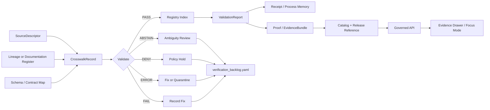
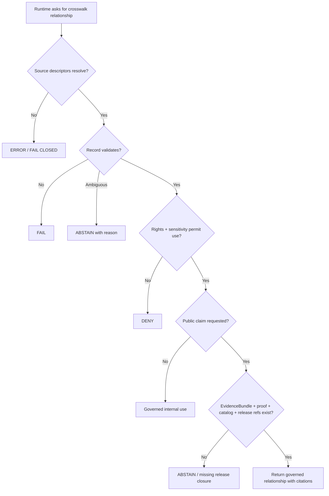

<!-- [KFM_META_BLOCK_V2]
doc_id: kfm://doc/NEEDS_VERIFICATION__data-registry-crosswalk-readme
title: Crosswalk Registry
type: standard
version: v1
status: draft
owners: NEEDS_VERIFICATION__data_registry_steward
created: NEEDS_VERIFICATION__YYYY-MM-DD
updated: NEEDS_VERIFICATION__YYYY-MM-DD
policy_label: NEEDS_VERIFICATION__public_or_restricted
intended_path: data/registry/crosswalk/README.md
evidence_mode: CORPUS_ONLY__NO_LOCAL_REPO_EVIDENCE
truth_posture: PROPOSED_UNTIL_REPO_CONFIRMED
related:
  - NEEDS_VERIFICATION__../README.md
  - NEEDS_VERIFICATION__../../README.md
  - NEEDS_VERIFICATION__../../../docs/registers/source-descriptor-index.md
  - NEEDS_VERIFICATION__../../../docs/registers/verification-backlog.md
  - NEEDS_VERIFICATION__../../../schemas/contracts/v1/crosswalk/README.md
  - NEEDS_VERIFICATION__../../../tools/validators/crosswalk/README.md
tags:
  - kfm
  - data
  - registry
  - crosswalk
  - source-descriptor
  - identity
  - lineage
  - evidence-bundle
  - promotion-gate
notes:
  - README-like directory doc for the requested target path.
  - Actual repo tree, owners, dates, policy label, schema home, validator paths, workflow paths, CODEOWNERS coverage, and sibling registry files remain NEEDS VERIFICATION until a mounted KFM checkout is inspected.
  - This document defines operating doctrine and proposed repository shape; it does not prove current implementation behavior.
[/KFM_META_BLOCK_V2] -->

<a id="top"></a>

# Crosswalk Registry

Governed registry surface for identifier, source-family, documentation, schema, and release-reference crosswalks that must remain **evidence-bound, reviewable, reversible, and safe to use downstream**.

<div align="left">


</div>

> [!IMPORTANT]
> **Status:** `draft` · **Truth posture:** `PROPOSED / NEEDS VERIFICATION`  
> **Owners:** `NEEDS_VERIFICATION__data_registry_steward`  
> **Target path:** `data/registry/crosswalk/README.md`  
> **Primary rule:** a crosswalk can help KFM decide how records relate, but it **does not become canonical truth by itself**.

> [!NOTE]
> This directory is a **control-plane registry**, not a data warehouse, proof store, release store, policy body, or AI context cache. Public or semi-public use requires source identity, validation, policy posture, review state, catalog/proof closure, and a release-facing reference.

---

## Quick navigation

| Start here | Operate | Validate | Govern |
|---|---|---|---|
| [Purpose](#purpose) | [Accepted inputs](#accepted-inputs) | [Validation gates](#validation-gates) | [Authority boundary](#authority-boundary) |
| [At a glance](#at-a-glance) | [Directory layout](#directory-layout) | [Runtime and UI use](#runtime-and-ui-use) | [Rights, sensitivity, and policy](#rights-sensitivity-and-policy) |
| [Repo fit](#repo-fit) | [Record contract](#record-contract) | [Definition of done](#definition-of-done) | [Rollback and correction](#rollback-and-correction) |
| [Crosswalk families](#crosswalk-families) | [Quickstart](#quickstart) | [Operating tables](#operating-tables) | [Appendices](#appendices) |

---

## Purpose

The crosswalk registry records governed mappings that are useful only when their **source identity, relationship type, time scope, evidence, validation result, and review state** remain visible.

Use it to answer questions like:

- Which source identifier replaced or corresponds to another identifier?
- Which upstream source family maps to a normalized KFM source family?
- Which outside report, manual, or corpus family maps to a repo-native canonical document home?
- Which semantic contract object maps to which machine schema path?
- Which released artifact resolves to which catalog, proof, EvidenceBundle, or runtime reference?

The crosswalk registry exists to stop convenience joins from becoming invisible authority.

### Non-goals

This registry does **not**:

- store raw source datasets;
- publish public claims;
- replace source descriptors;
- define all schema semantics;
- store proof packs, run receipts, or EvidenceBundles;
- authorize public release;
- override policy, steward review, or release state;
- let AI or UI surfaces infer relationships that validation has not accepted.

[Back to top](#top)

---

## At a glance

| Field | Value |
|---|---|
| **Registry class** | Control-plane registry for relationship records. |
| **Target path** | `data/registry/crosswalk/` — `NEEDS VERIFICATION` until repo inspection. |
| **Primary unit** | `CrosswalkRecord` grouped into a `CrosswalkFamily`. |
| **Required anchors** | Source descriptor or lineage record, relationship type, temporal scope where applicable, evidence or verification status, validation result, review state. |
| **Public-use posture** | Deny or abstain unless release-facing evidence closure exists. |
| **Runtime posture** | Governed API only; no public client reads raw registry rows as truth. |
| **Failure posture** | `FAIL`, `ABSTAIN`, `DENY`, or `ERROR` are first-class outcomes. |
| **Rollback posture** | Supersede, disable, or retire records by state transition; never silently overwrite meaning. |

### Truth labels used here

| Label | Meaning in this README |
|---|---|
| `CONFIRMED` | Verified from current-session evidence or explicitly supplied doctrine. |
| `PROPOSED` | Recommended design or file shape not verified in the mounted repo. |
| `UNKNOWN` | Not known without repo, workflow, runtime, owner, or source inspection. |
| `NEEDS VERIFICATION` | Checkable item that must be resolved before relying on it. |
| `BLOCKED` | Use is held because rights, sensitivity, evidence, policy, or validation is insufficient. |

[Back to top](#top)

---

## Authority boundary

A crosswalk is a **relationship record**. It may support a downstream claim only after the surrounding trust chain is intact.

```text
SourceDescriptor / LineageRecord
        ↓
CrosswalkRecord
        ↓
ValidationReport + ReviewState
        ↓
EvidenceBundle / Proof / Catalog closure
        ↓
Release reference
        ↓
Governed API
        ↓
Evidence Drawer / Focus Mode / map popup / export
```

> [!WARNING]
> A crosswalk row must not be used as a silent lookup table for public claims. If the row has not passed validation and release-facing closure, public clients should receive `ABSTAIN`, `DENY`, or a bounded explanation rather than a confident relationship claim.

[Back to top](#top)

---

## Repo fit

| Field | Value |
|---|---|
| **Target path** | `data/registry/crosswalk/README.md` |
| **Parent surface** | `data/registry/` — `NEEDS VERIFICATION` |
| **Primary role** | Directory README and operating guide for crosswalk registry records. |
| **Upstream inputs** | Source descriptors, source intake records, documentation lineage registers, schema/contract maps, release manifests, catalog records, validation reports. |
| **Downstream consumers** | Crosswalk validators, diff tools, promotion gates, catalog/proof builders, governed API responses, Evidence Drawer payloads, Focus Mode citation context. |
| **Authority boundary** | Records relationships and join decisions. Does not replace canonical source records, EvidenceBundles, policies, or release manifests. |
| **Sibling surfaces to verify** | `data/registry/README.md`, `data/registry/sources/`, `schemas/contracts/v1/crosswalk/`, `tools/validators/crosswalk/`, `docs/registers/source-descriptor-index.md`. |
| **Rollback posture** | Disable or supersede a crosswalk family by registry state; preserve old records, validation reports, receipts, and supersession notes. |

[Back to top](#top)

---

## Crosswalk families

| Crosswalk family | Example | Why it belongs here | Default public posture |
|---|---|---|---|
| **Identifier bridges** | NHDPlus HR Permanent Identifier ↔ legacy COMID / reachcode | Prevents convenience joins from becoming unreviewed truth. | Release-gated. |
| **Source-family bridges** | Upstream source descriptor ↔ normalized KFM source family | Keeps source role, cadence, rights, sensitivity, and freshness explicit. | Registry-visible; public use depends on source terms. |
| **Documentation/corpus bridges** | external/manual lineage family ↔ repo-native canonical home | Stops outside or lineage material from floating as invisible authority. | Usually internal/control-plane. |
| **Schema/contract bridges** | semantic contract object ↔ machine schema path | Makes schema-home ambiguity and migration visible. | Internal/control-plane. |
| **Release/reference bridges** | released artifact ↔ catalog/proof/runtime reference | Keeps public-facing references tied to release state and evidence closure. | Public only through governed release references. |
| **Alias / supersession bridges** | old file path ↔ new canonical home | Preserves continuity during refactors and migrations. | Internal unless release notes expose it. |
| **Blocked or retired bridges** | candidate relationship held by rights or sensitivity issue | Makes denial/hold decisions auditable. | Deny public use. |

[Back to top](#top)

---

## Accepted inputs

Crosswalk registry records may include the following materials when they are source-bound and reviewable.

| Input | Required posture | Notes |
|---|---|---|
| Source descriptor references | **Required** | Every crosswalk family must identify the source systems or corpus families being bridged. |
| Relationship classification | **Required** | Use explicit relationship types such as `exact`, `split`, `merge`, `ambiguous`, `no_match`, `superseded`, or `blocked`. |
| Temporal scope | **Required where applicable** | Use `valid_from`, `valid_to`, `observed_at`, `ingested_at`, `source_version`, or equivalent fields; crosswalks drift over time. |
| Evidence references | **Required for consequential use** | Reference EvidenceBundle, proof, receipt, catalog, or review artifacts as appropriate. |
| `spec_hash` / source-state hash | **Required where available** | Used to prove which source version or registry definition produced the crosswalk. |
| Validation report reference | **Required before promotion** | Crosswalk validation must be reviewable and fail closed. |
| Supersession note | **Required on replacement** | Replacements must preserve lineage and explain compatibility impact. |
| Verification backlog item | **Accepted** | Use when a useful row or family cannot yet be promoted because evidence is incomplete. |

[Back to top](#top)

---

## Exclusions

| Do not put here | Put it here instead | Reason |
|---|---|---|
| Raw source datasets | `data/raw/<domain>/` | RAW material must stay in the lifecycle intake zone. |
| Per-run normalized artifacts | `data/work/<domain>/` or `data/processed/<domain>/` | Crosswalk registry records should point to artifacts, not become the artifact store. |
| Quarantined candidates | `data/quarantine/<domain>/` | Quarantine carries its own reasons, receipts, and review state. |
| Proof packs or EvidenceBundles | `data/proofs/` or repo-confirmed proof-object lane | Proof objects are not registry rows. |
| Run receipts | `data/receipts/` | Receipts are process memory and must remain separate from release proof. |
| STAC/DCAT/PROV catalog records | `data/catalog/` | Catalog objects are publication closure, not registry configuration. |
| Policy bodies | `policy/` | Policy must remain executable or reviewable in the policy lane. |
| Machine schemas | `schemas/contracts/v1/crosswalk/` or repo-confirmed schema lane | Schema authority must not be hidden in a README. |
| Human semantic object definitions | `contracts/` or repo-confirmed contract lane | This registry consumes object definitions; it does not define all object semantics. |
| Public map tiles, PMTiles, COGs, scenes, or graph projections | `data/published/`, `data/triplets/`, or release lane | Delivery artifacts are rebuildable derivatives and must stay downstream of promotion. |

[Back to top](#top)

---

## Lifecycle and state model

### Registry state

| State | Meaning | Allowed downstream use |
|---|---|---|
| `draft` | Record is being written; source and validation may be incomplete. | No public use. |
| `candidate` | Required fields are present but validation or review is not complete. | Internal review only. |
| `validated` | Record passed schema and semantic validation. | Internal use; public use still needs release closure. |
| `reviewed` | Steward or reviewer accepted the record for a defined purpose. | Governed use only within the reviewed purpose. |
| `release_referenced` | Public-facing release/catalog/proof reference exists. | Public use permitted only through governed API and policy-permitted scopes. |
| `blocked` | Rights, sensitivity, evidence, or policy blocks use. | Deny public use. |
| `superseded` | Replaced by a newer record or family. | Use replacement pointer; keep queryable for lineage. |
| `retired` | No longer active but retained for audit and rollback. | No new use; may support historical explanation. |

### Validation outcomes

| Outcome | Meaning | Required behavior |
|---|---|---|
| `PASS` | Record passed all applicable gates for the requested purpose. | May proceed to review or governed use. |
| `FAIL` | Record is structurally or semantically invalid. | Block use; fix or quarantine. |
| `ABSTAIN` | Relationship cannot be resolved safely. | Return bounded uncertainty; create review/backlog item. |
| `DENY` | Policy, rights, sensitivity, or release state forbids use. | Deny public or requested use. |
| `ERROR` | Validator, source, schema, or reference failed unexpectedly. | Fail closed; investigate before use. |

[Back to top](#top)

---

## Directory layout

Proposed minimum layout after repo verification:

```text
data/registry/crosswalk/
├── README.md
├── registry.yaml
├── verification_backlog.yaml
├── source_state_index.jsonl
├── CHANGELOG.md
├── records/
│   ├── README.md
│   ├── hydrology/
│   │   └── nhdplus_hr_legacy_comid.yaml
│   ├── documentation/
│   │   └── corpus_to_repo_doc_families.yaml
│   ├── schemas/
│   │   └── contract_schema_home_map.yaml
│   └── releases/
│       └── artifact_catalog_release_refs.yaml
└── fixtures/
    ├── valid/
    │   └── exact_identifier_bridge.yaml
    └── invalid/
        ├── ambiguous_without_reason.yaml
        ├── missing_source_descriptor.yaml
        ├── public_use_without_release_ref.yaml
        └── receipt_proof_catalog_flattened.yaml
```

> [!CAUTION]
> The tree above is `PROPOSED`. Create or adapt it only after checking the actual repo layout, sibling `data/registry/` conventions, schema-home ADR, and CODEOWNERS coverage.

[Back to top](#top)

---

## Record contract

This example is intentionally minimal and **not** a confirmed schema.

```yaml
schema_version: crosswalk.registry.v1
crosswalk_id: kfm.crosswalk.hydrology.nhdplus_hr_legacy_comid
family_id: kfm.crosswalk.family.hydrology.identifier_bridge
status: draft
truth_label: PROPOSED
owners:
  - NEEDS_VERIFICATION__data_registry_steward

subject:
  domain: hydrology
  relationship_family: identifier_bridge
  source_system_a: usgs_nhdplus_hr
  source_system_b: legacy_nhdplusv2
  public_use_requested: false

relationship:
  type: exact # exact | split | merge | ambiguous | no_match | superseded | blocked | reference_only
  confidence: NEEDS_VERIFICATION
  ambiguity_reason: null
  method: NEEDS_VERIFICATION__manual_review_or_validator_name
  method_version: NEEDS_VERIFICATION

keys:
  source_identifier:
    name: permanent_id
    value: NEEDS_VERIFICATION
  target_identifier:
    name: comid
    value: NEEDS_VERIFICATION

time:
  valid_from: NEEDS_VERIFICATION__YYYY-MM-DD
  valid_to: null
  observed_at: null
  ingested_at: NEEDS_VERIFICATION__YYYY-MM-DDTHH:MM:SSZ
  source_version: NEEDS_VERIFICATION

evidence:
  source_descriptor_refs:
    - data/registry/hydrology/sources/nhdplus_hr.yaml
    - data/registry/hydrology/sources/nhdhr_crosswalk.yaml
  evidence_bundle_ref: NEEDS_VERIFICATION
  validation_report_ref: NEEDS_VERIFICATION
  run_receipt_ref: NEEDS_VERIFICATION
  release_ref: null

integrity:
  spec_hash: NEEDS_VERIFICATION__sha256
  source_state_hash: NEEDS_VERIFICATION__sha256
  record_hash: NEEDS_VERIFICATION__sha256

policy:
  rights_status: NEEDS_VERIFICATION
  sensitivity_label: NEEDS_VERIFICATION
  public_release_allowed: false
  denial_reason: null

review:
  decision: NEEDS_VERIFICATION
  reviewer: NEEDS_VERIFICATION
  reviewed_at: null
  notes:
    - Relationship is illustrative until real source files, schemas, and validators are inspected.

lineage:
  supersedes: []
  superseded_by: null
  compatibility_note: null
```

### Minimum fields by use case

| Use case | Minimum record support |
|---|---|
| Internal draft | `crosswalk_id`, `status`, source systems, relationship family, truth label. |
| Validator candidate | Draft fields plus relationship type, key fields, source descriptors, temporal/source-state fields where applicable. |
| Reviewed internal use | Candidate fields plus validation report, reviewer, review decision, and source-state hash where available. |
| Public-facing use | Reviewed fields plus rights/sensitivity decision, EvidenceBundle/proof/catalog closure, release reference, and runtime caveat. |

[Back to top](#top)

---

## Registry index contract

`registry.yaml` should answer four questions without opening every record:

1. What crosswalk families exist?
2. Which source systems or documentation families do they bridge?
3. Which schema and validator versions govern them?
4. Which records are active, blocked, superseded, or retired?

Proposed index shape:

```yaml
schema_version: crosswalk.registry_index.v1
updated: NEEDS_VERIFICATION__YYYY-MM-DD
owner: NEEDS_VERIFICATION__data_registry_steward

families:
  - family_id: kfm.crosswalk.family.hydrology.identifier_bridge
    status: draft
    domain: hydrology
    relationship_family: identifier_bridge
    records_path: records/hydrology/
    schema_ref: NEEDS_VERIFICATION__schemas/contracts/v1/crosswalk/crosswalk_record.schema.json
    validator_ref: NEEDS_VERIFICATION__tools/validators/crosswalk/validate_registry.py
    source_systems:
      - usgs_nhdplus_hr
      - legacy_nhdplusv2
    active_records: 0
    blocked_records: 0
    superseded_records: 0
    release_referenced_records: 0
    notes:
      - Initial family is proposed pending repo and source inspection.
```

[Back to top](#top)

---

## Quickstart

### 1. Inspect before editing

```bash
# Non-destructive repo inspection.
pwd
git status --short
find data/registry -maxdepth 3 -type f | sort
find schemas contracts policy tools tests docs -maxdepth 4 -type f 2>/dev/null | sort | sed -n '1,200p'
```

Expected result before first implementation: actual paths and owners are either confirmed or moved into `verification_backlog.yaml`.

### 2. Check whether this README is still a proposal

```bash
# Non-destructive target-path check.
test -f data/registry/crosswalk/README.md && echo "crosswalk README exists" || echo "crosswalk README missing"
find data/registry/crosswalk -maxdepth 3 -type f 2>/dev/null | sort
```

### 3. Validate records after the validator exists

```bash
# NEEDS VERIFICATION: command shape depends on the real validator lane.
python -m tools.validators.crosswalk.validate_registry \
  --registry data/registry/crosswalk/registry.yaml \
  --records data/registry/crosswalk/records \
  --fixtures tests/fixtures/crosswalk
```

> [!IMPORTANT]
> Validator failure should block promotion-facing use. Missing source descriptors, unresolved ambiguity, rights/sensitivity gaps, or absent release references must yield `FAIL`, `ABSTAIN`, `DENY`, or `ERROR`, not best-effort success.

[Back to top](#top)

---

## Usage

### Add a new crosswalk family

1. Confirm source systems or documentation families have source descriptors or lineage records.
2. Create a draft record under `records/<family>/`.
3. Add the crosswalk family to `registry.yaml`.
4. Add one valid fixture and at least one invalid fixture.
5. Run schema validation and crosswalk semantic validation.
6. Record the validation report and any run receipt outside this directory.
7. Link the record to catalog/proof/release objects only after promotion review.
8. Update `CHANGELOG.md` and any source-descriptor, schema, validator, policy, and docs indexes affected by the new mapping.

### Update an existing crosswalk

Use append-or-supersede discipline:

| Change | Default action |
|---|---|
| Source version changes | Append a new source-state row and recompute `source_state_hash`. |
| Relationship classification changes | Supersede the old row; preserve the prior relationship and reason. |
| Identifier split/merge appears | Create explicit `split` or `merge` rows; do not collapse into `exact`. |
| Relationship is ambiguous | Mark `ambiguous`; require reason and review; runtime consumers should abstain from exact claims. |
| Rights or sensitivity changes | Hold or deny public use until policy review completes. |
| Schema changes | Version schema and fixtures; keep compatibility notes. |
| Public release affected | Add correction or withdrawal references in the release/correction lane. |

[Back to top](#top)

---

## Diagrams

### Crosswalk trust flow



### Public-use decision tree



**Reading rule:** crosswalks move from source descriptors and lineage records into validated registry state, then into proof/catalog/release surfaces. They do not bypass policy, proof, or governed APIs.

[Back to top](#top)

---

## Validation gates

| Gate | Check | Fail-closed outcome |
|---|---|---|
| G1 source identity | Crosswalk resolves to known source descriptors or lineage records. | `FAIL` if missing; `ERROR` if unreadable. |
| G2 relationship semantics | Relationship type is explicit and allowed for the family. | `ABSTAIN` on ambiguity; `FAIL` on invalid type. |
| G3 temporal scope | Effective dates or source-state windows are present where needed. | `FAIL` if temporal claims cannot be bounded. |
| G4 integrity anchors | `spec_hash` or source-state hash exists where the source supports it. | `FAIL` for promotion-facing use. |
| G5 receipt/proof separation | Run receipts, proofs, and EvidenceBundles are referenced but not flattened into registry rows. | `FAIL` if object families are mixed. |
| G6 rights and sensitivity | Source terms and sensitivity labels allow the intended use. | `DENY` or hold when unclear. |
| G7 catalog/release linkage | Public-facing use has release or catalog references. | `FAIL` or `ABSTAIN` if release-facing refs are missing. |
| G8 runtime readiness | Runtime examples cite released evidence, not raw source state. | `ABSTAIN` or `FAIL` until citation path is complete. |
| G9 supersession hygiene | Replaced records point forward and backward. | `FAIL` on orphaned replacement. |
| G10 fixture coverage | Valid and invalid fixtures cover each relationship family. | `FAIL` if behavior is untested. |

### Recommended invalid fixtures

| Fixture | Purpose |
|---|---|
| `missing_source_descriptor.yaml` | Confirms source identity is mandatory. |
| `ambiguous_without_reason.yaml` | Confirms ambiguity must be explained. |
| `public_use_without_release_ref.yaml` | Confirms public use requires release-facing closure. |
| `blocked_rights_claimed_public.yaml` | Confirms rights block cannot be bypassed. |
| `split_marked_exact.yaml` | Confirms split/merge cases cannot masquerade as exact. |
| `receipt_proof_catalog_flattened.yaml` | Confirms object families remain separated. |
| `superseded_without_replacement.yaml` | Confirms lineage must be navigable. |

[Back to top](#top)

---

## Runtime and UI use

Runtime surfaces may use crosswalks only when:

- the crosswalk family is indexed;
- the row validates against the active schema;
- source descriptors resolve;
- ambiguity handling is explicit;
- policy and sensitivity posture permit the requested use;
- catalog/proof/release references exist for public-facing claims; and
- Evidence Drawer or Focus Mode can show why the relationship was accepted, rejected, or abstained.

### API response posture

A governed API should return a bounded envelope rather than raw crosswalk rows:

```json
{
  "outcome": "ANSWER",
  "relationship": {
    "type": "exact",
    "crosswalk_id": "kfm.crosswalk.hydrology.nhdplus_hr_legacy_comid",
    "source_identifier": "NEEDS_VERIFICATION",
    "target_identifier": "NEEDS_VERIFICATION"
  },
  "evidence": {
    "evidence_bundle_ref": "NEEDS_VERIFICATION",
    "validation_report_ref": "NEEDS_VERIFICATION",
    "release_ref": "NEEDS_VERIFICATION"
  },
  "policy": {
    "public_release_allowed": true,
    "sensitivity_label": "NEEDS_VERIFICATION"
  },
  "caveats": [
    "Relationship is only valid for the stated source version and time window."
  ]
}
```

For `ABSTAIN`, `DENY`, or `ERROR`, the same envelope should explain the boundary without leaking restricted information.

[Back to top](#top)

---

## Operating tables

### File inventory matrix

| Path | Status | Purpose | Truth role | Update trigger | Owner / authority | Lineage / supersession rule |
|---|---|---|---|---|---|---|
| `data/registry/crosswalk/README.md` | PROPOSED | Directory orientation and operating rules | Human-facing control plane | Directory creation or registry rule change | `NEEDS_VERIFICATION__data_registry_steward` | Version by PR; preserve stable headings where possible. |
| `data/registry/crosswalk/registry.yaml` | PROPOSED | Aggregate index of crosswalk families | Machine-readable registry | New family, retired family, status change | Data registry steward | Append status transitions; do not silently delete. |
| `data/registry/crosswalk/records/` | PROPOSED | Crosswalk record families | Machine-readable records | New or updated mapping family | Domain steward + data registry steward | Supersede rows with explicit prior refs. |
| `data/registry/crosswalk/records/hydrology/nhdplus_hr_legacy_comid.yaml` | PROPOSED | Hydrology identifier bridge example | Machine-readable crosswalk | Source download, schema drift, relationship reclassification | Hydrology steward + data registry steward | Preserve prior source-state and validation reports. |
| `data/registry/crosswalk/records/documentation/corpus_to_repo_doc_families.yaml` | PROPOSED | Corpus/manual family to repo-native home map | Human + machine review support | Corpus intake, canonization, archive movement | Documentation governance owner | Archive old mappings with replacement pointers. |
| `data/registry/crosswalk/verification_backlog.yaml` | PROPOSED | Unresolved checks and blocked rows | Review-supporting registry | Any `NEEDS VERIFICATION`, `ABSTAIN`, `DENY`, or `ERROR` result | Data registry steward | Append until closed; closure must cite evidence. |
| `data/registry/crosswalk/source_state_index.jsonl` | PROPOSED | Source-state hash history | Append-only machine index | Source descriptor or source-state change | Data registry steward | Append-only; never rewrite old hashes. |
| `data/registry/crosswalk/CHANGELOG.md` | PROPOSED | Human-readable change history | Review-supporting history | Any registry or semantics change | Data registry steward | Append or version; cite PR / review artifacts. |
| `schemas/contracts/v1/crosswalk/*.schema.json` | NEEDS VERIFICATION | Executable schema family | Machine contract | Schema addition or version bump | Schema/contract owner | Version schemas; keep compatibility notes. |
| `tools/validators/crosswalk/*` | NEEDS VERIFICATION | Crosswalk validators and diff tools | Verification support | New gate, record shape, or relationship logic | Validator/tooling owner | Validator changes require fixtures and reports. |
| `tests/fixtures/crosswalk/valid/*` | NEEDS VERIFICATION | Positive fixtures | Verification support | New schema or validator behavior | Test/fixture owner | Fixtures version with schema. |
| `tests/fixtures/crosswalk/invalid/*` | NEEDS VERIFICATION | Fail-closed fixtures | Verification support | New denial, abstain, or error mode | Test/fixture owner | Keep invalid fixtures for regression. |

### Relationship type vocabulary

| Relationship | Meaning | Public-use posture |
|---|---|---|
| `exact` | One identifier or record maps to one counterpart with no known ambiguity. | Allowed only after validation and release gating. |
| `split` | One prior identifier maps to multiple current identifiers. | Must show split rule and abstain from single-target claims. |
| `merge` | Multiple prior identifiers map to one current identifier. | Must show merge rule and preserve prior identities. |
| `ambiguous` | Relationship cannot be resolved safely. | Runtime should abstain or request review. |
| `no_match` | No valid counterpart found. | May support negative lookup only with evidence and caveat. |
| `superseded` | Earlier mapping replaced by newer evidence or schema. | Use replacement pointer; keep old row queryable. |
| `blocked` | Rights, sensitivity, policy, or source-state problem blocks use. | Deny public use until resolved. |
| `reference_only` | Useful context, not a join rule. | Must not drive canonical joins or public claims. |

### Sanity checks validators should express

```sql
-- Ambiguous relationships need a reason.
SELECT crosswalk_id
FROM crosswalk_records
WHERE relationship_type = 'ambiguous'
  AND (ambiguity_reason IS NULL OR ambiguity_reason = '');

-- Public-facing records need release closure.
SELECT crosswalk_id
FROM crosswalk_records
WHERE public_use_requested = true
  AND release_ref IS NULL;

-- Exact relationships should not have multi-target shape.
SELECT crosswalk_id
FROM crosswalk_records
WHERE relationship_type = 'exact'
  AND target_count <> 1;
```

> [!NOTE]
> SQL above is illustrative validator logic, not a confirmed database schema.

[Back to top](#top)

---

## Rights, sensitivity, and policy

Crosswalks can expose more than they appear to expose. A join may reveal restricted geometry, source lineage, steward-controlled records, sensitive research, cultural context, or publication status.

Default rules:

- Unknown rights block public release.
- Unknown sensitivity blocks public release for sensitive lanes.
- Restricted source terms block public release even if the relationship validates.
- Exact joins for sensitive records require policy review and may require redaction, generalization, delayed release, or denial.
- Documentation/corpus crosswalks should not turn exploratory or lineage material into canon without authority review.
- AI context must receive only policy-permitted, released, evidence-bound material.

[Back to top](#top)

---

## Rollback and correction

A crosswalk registry rollback is a governed state transition, not a filesystem cleanup.

| Scenario | Action | Required record |
|---|---|---|
| Bad row added | Mark row `blocked` or `retired`; add correction note. | Changelog entry + validation report. |
| Relationship was too confident | Supersede `exact` with `ambiguous`, `split`, `merge`, or `no_match`. | Supersession note + compatibility impact. |
| Source state changed | Append source-state hash; rerun validation. | `source_state_index.jsonl` entry + report. |
| Public release affected | Issue correction, withdrawal, or replacement in release lane. | Release/correction reference. |
| Schema changed | Version schema and fixtures; keep old schema reference queryable. | Schema changelog + migration note. |
| Policy denies use | Mark records `blocked`; preserve denial reason. | Policy decision reference. |

Rollback must preserve enough information to reconstruct what was believed, when it was used, which evidence supported it, why it changed, and which public surfaces were affected.

[Back to top](#top)

---

## Definition of done

A crosswalk registry change is not ready for merge until the reviewer can check all applicable items.

- [ ] Target path and sibling registry conventions are verified in the mounted repo.
- [ ] Owner coverage is confirmed or clearly marked `NEEDS VERIFICATION`.
- [ ] KFM Meta Block V2 values are reviewed and placeholders are resolved where possible.
- [ ] Each crosswalk family has source descriptors or lineage records.
- [ ] Relationship types are explicit and tested with valid and invalid fixtures.
- [ ] Ambiguous joins produce `ABSTAIN` or review backlog entries, not silent exact matches.
- [ ] Rights and sensitivity posture are checked before public-facing use.
- [ ] Schema-home decision is recorded or this README keeps schema paths as `NEEDS VERIFICATION`.
- [ ] Validator command shape is confirmed or documented as provisional.
- [ ] Receipts, proof objects, catalog records, and release manifests remain separate.
- [ ] Public runtime or UI examples resolve to released artifacts and EvidenceBundle references.
- [ ] `CHANGELOG.md`, registry index, source-state index, and verification backlog are updated.
- [ ] Rollback or supersession path is documented for every replacement or deletion.
- [ ] No public client path reads RAW, WORK, QUARANTINE, or unpublished candidate crosswalk state.

[Back to top](#top)

---

## Recommended first PR

If the repo is mounted and no stronger existing convention overrides this README, the smallest safe PR is:

1. Add or update `data/registry/crosswalk/README.md`.
2. Add empty or placeholder-safe `registry.yaml`, `verification_backlog.yaml`, and `CHANGELOG.md`.
3. Add one valid synthetic fixture and several invalid fixtures.
4. Add or reference a schema-home ADR if `contracts/` versus `schemas/` is unresolved.
5. Add no live source connector and no public runtime binding.
6. Add validator stubs only if the repo's tooling conventions are confirmed.
7. Add CI checks only after the validator can run offline.

[Back to top](#top)

---

## FAQ

### Is a crosswalk canonical truth?

No. A crosswalk is a governed relationship record. It can support a claim only when the relevant source descriptors, evidence, validation, policy, review, and release state support that use.

### Can a crosswalk be generated?

Yes, but generated crosswalk outputs belong in lifecycle storage first. The registry should point to the generated artifact, validation report, receipt, proof, and release reference rather than storing large generated datasets inline.

### What happens when a source changes?

Append a new source-state entry, recompute integrity anchors, rerun validation, and supersede affected rows explicitly. Do not overwrite prior crosswalk meaning silently.

### What happens when a relationship is ambiguous?

Mark it `ambiguous`, explain the ambiguity, and route it to `verification_backlog.yaml`. Runtime and UI consumers should abstain from exact claims.

### Who owns this directory?

`NEEDS VERIFICATION`. The likely authority is a data registry or source steward, with domain steward review for lane-specific crosswalks and schema/policy/tooling review for machine-contract changes.

### Can Focus Mode answer from this registry?

Only through a governed API response that resolves evidence and passes policy. Focus Mode should not inspect registry files directly or turn draft registry rows into public truth.

[Back to top](#top)

---

## Appendices

<details>
<summary><strong>Appendix A — minimum crosswalk family checklist</strong></summary>

| Requirement | Minimum acceptable state |
|---|---|
| Family ID | Stable, namespaced, and unique. |
| Source descriptors | Present or linked to a verification backlog item. |
| Relationship vocabulary | Explicit and schema-checked. |
| Temporal fields | Present where source versions or identity windows matter. |
| Integrity anchor | `spec_hash`, `source_state_hash`, checksum, or documented reason for absence. |
| Fixtures | At least one valid and one invalid fixture. |
| Validation report | Required before promotion-facing use. |
| Policy posture | Required for public-facing use or sensitive lanes. |
| Supersession rule | Required for updates, deletes, and renames. |
| Runtime caveat | Required when a crosswalk powers API, Evidence Drawer, Focus Mode, map popup, or export output. |

</details>

<details>
<summary><strong>Appendix B — open verification backlog starter rows</strong></summary>

| Item | Why it matters | Current label |
|---|---|---|
| Confirm `data/registry/crosswalk/` exists or should be created. | Prevents invented path claims. | NEEDS VERIFICATION |
| Confirm parent `data/registry/README.md` conventions. | Keeps this README repo-native. | NEEDS VERIFICATION |
| Confirm schema home for crosswalk records. | Avoids `contracts/` versus `schemas/` drift. | NEEDS VERIFICATION |
| Confirm validator command and fixture layout. | Prevents non-runnable quickstart claims. | NEEDS VERIFICATION |
| Confirm CODEOWNERS coverage. | Owner badge and review routing should not be guessed. | NEEDS VERIFICATION |
| Confirm whether documentation/corpus crosswalk records belong in this directory or `docs/registers/`. | Avoids mixing data registry and documentation governance unexpectedly. | NEEDS VERIFICATION |
| Confirm release/proof/citation reference path. | Required before public runtime use. | NEEDS VERIFICATION |
| Confirm runtime envelope fields for crosswalk-backed API responses. | Prevents UI/AI from reading raw registry rows. | NEEDS VERIFICATION |
| Confirm whether `source_state_index.jsonl` should be append-only or generated. | Affects audit and rollback semantics. | NEEDS VERIFICATION |

</details>

<details>
<summary><strong>Appendix C — pre-publish checklist</strong></summary>

- [ ] Badges present.
- [ ] Owners present or placeholder clearly marked.
- [ ] Status present.
- [ ] Quick navigation present.
- [ ] Repo fit includes path and upstream/downstream surfaces.
- [ ] Accepted inputs and exclusions present.
- [ ] Directory tree included and truth-labeled.
- [ ] Mermaid diagrams included.
- [ ] Tables used for file inventory, relationship vocabulary, and gates.
- [ ] Task list includes definition of done.
- [ ] Code fences are language-tagged.
- [ ] Long reference material is wrapped in `<details>`.
- [ ] Relative path claims are not rendered as verified links unless repo inspection confirms them.
- [ ] No section claims implementation, workflow, validator, schema, ownership, or release maturity without evidence.

</details>

<details>
<summary><strong>Appendix D — suggested changelog format</strong></summary>

```markdown
# Crosswalk Registry Changelog

## YYYY-MM-DD — NEEDS_VERIFICATION__short-title

**Status:** draft | candidate | validated | blocked | superseded | retired  
**Changed by:** NEEDS_VERIFICATION  
**Review ref:** NEEDS_VERIFICATION  
**Validation report:** NEEDS_VERIFICATION  
**Affected families:** NEEDS_VERIFICATION

### Change

Describe the record, family, schema, validator, or policy update.

### Evidence

List source descriptors, evidence refs, receipts, proof refs, and release refs without flattening them.

### Compatibility impact

Describe API, UI, catalog, proof, release, and rollback effects.

### Rollback

Describe the state transition or supersession path.
```

</details>

[Back to top](#top)
