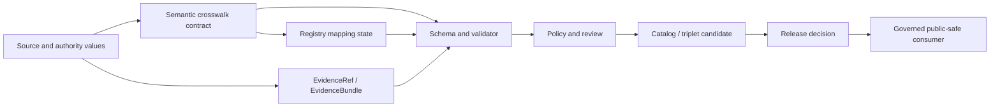

<!-- [KFM_META_BLOCK_V2]
doc_id: kfm://data/registry/crosswalks/readme
name: Crosswalk Registry README
path: data/registry/crosswalks/README.md
type: data-registry-crosswalks-readme
version: v0.4.0
status: draft
owners:
  - "NEEDS VERIFICATION: registry steward"
  - "NEEDS VERIFICATION: crosswalk steward"
  - "NEEDS VERIFICATION: source and domain stewards"
  - "NEEDS VERIFICATION: contract, schema, and policy stewards"
  - "NEEDS VERIFICATION: validation, proof, and release stewards"
created: 2026-06-28
updated: 2026-07-30
policy_label: internal-governance
truth_posture: cite-or-abstain
responsibility_root: data/
artifact_family: registry
registry_scope: governed-crosswalk-mapping-state
path_posture: confirmed-live-registry-lane; tracked-subtree-inventory-confirmed; water-planning-record-validated; registry-wide-schema-and-enforcement-partial; no-public-path
sensitivity_posture: registry-internal; no-public-path; source-role-preserving; evidence-aware; policy-aware; rights-and-sensitivity-fail-closed; release-blocked-until-gates-close
related:
  - ../README.md
  - ../sources/README.md
  - ../../receipts/README.md
  - ../../proofs/README.md
  - ../../catalog/README.md
  - ../../../docs/doctrine/directory-rules.md
  - ../../../docs/adr/ADR-0029-adopt-directory-governance-standard-v2.md
  - ../../../contracts/crosswalks/README.md
  - ../../../contracts/crosswalks/taxonomy/README.md
  - ../../../contracts/domains/flora/flora_taxon_crosswalk.md
  - ../../../docs/sources/catalog/CROSSWALKS.md
  - ../../../docs/domains/flora/CROSSWALKS.md
  - ../../../docs/domains/hydrology/CROSSWALK_RULES.md
  - ../../../schemas/contracts/v1/
  - ../../../schemas/contracts/v1/crosswalks/README.md
  - ../../../schemas/contracts/v1/domains/water_planning/rac_county_crosswalk_registry.schema.json
  - ../../../policy/
  - ../../../tools/validators/hydro/check_crosswalk.py
  - ../../../tools/validators/domains/water_planning/validate_rac_registry.py
  - ../../../tests/domains/water_planning/test_rac_registry.py
  - ../../../.github/workflows/briefing-integration.yml
  - ../../../.github/CODEOWNERS
  - ../../../tests/
  - ../../../fixtures/
  - ../../../release/
tags:
  - kfm
  - data
  - registry
  - crosswalks
  - mappings
  - authority-ids
  - taxonomy
  - source-fields
  - vocabulary
  - provenance
  - evidence
  - source-role
  - policy-aware
  - correction
  - rollback
  - no-public-path
evidence_snapshot:
  repository: bartytime4life/Kansas-Frontier-Matrix
  base_commit: 101fa24730bc12f451d978b3cbeb6194e39a462a
  prior_blob: 9dde427a583266de65338e9c1e41c027d9cb8612
  directory_rules_blob: fd49a0b83e55cef52c1124281f093e263526898d
  adr_0029_blob: cd044a38047cc9b3725d2e083eb201eb86109308
  crosswalk_contracts_blob: 7dd131c6b6b5339eb6e433940d7ace169a350dbc
  crosswalk_schema_index_blob: 5357824d233379b8c3ac757ffc95e1a812777b5b
  water_planning_readme_blob: c227baa985be778f3b0614f3d1a78627cf6bdc20
  water_planning_crosswalk_blob: 95166f71f45907ffdaa5dfbb661cf044be8a2f34
  water_planning_schema_blob: e95e1175493b970aa286f47ff1d90ae6bbeda09a
  water_planning_validator_blob: 11c26cc4ed3d387ab1669e30a71434ffc1aab873
  water_planning_test_blob: a5779da0e9190c7d0a7d1960e7a52bfac6d97cbf
  briefing_workflow_blob: d076618e57770b1e2bb0ff419faaab38442ce7e8
  codeowners_blob: dd2a84aa514d8ecd9208bc347f90f9a2ed37dd61
  inspection_date: 2026-07-30
notes:
  - "This README preserves the existing crosswalk registry lane and updates its claims against current repository evidence."
  - "Crosswalk registry records are mapping-state records. They do not define semantic meaning, machine schema shape, policy, validator behavior, proof, catalog closure, release decisions, or public claims."
  - "The pinned recursive tree contains exactly three tracked paths: this README, one water-planning child README, and one 209-row RAC/county crosswalk record."
  - "The water-planning validator and eight no-network regression tests passed at the pinned base; registry-wide schema and validator coverage remains partial."
  - "The tracked-tree inventory does not prove external stores, deployed consumers, release readiness, or KFM publication."
[/KFM_META_BLOCK_V2] -->

<a id="top"></a>

# Crosswalk Registry

[](#status)
[](#repository-fit)
[](#crosswalk-boundary)
[](#lifecycle-and-publication-boundary)
[](#validation-and-maintenance)

> Governed registry lane for crosswalk mapping state. It records how identities, fields, names, vocabularies, and relations are mapped without turning those mappings into semantic contracts, proof, policy, release authority, or public truth.

> [!CAUTION]
> A crosswalk row is a consequential mapping claim. Missing anchors, stale authority versions, ambiguity, conflict, rights gaps, sensitivity gaps, or evidence gaps must remain visible and fail closed. Do not silently normalize uncertainty into an accepted mapping.

## Navigation

[Status](#status) · [Scope](#scope) · [Path posture](#path-posture) · [Inventory](#current-inventory) · [Repository fit](#repository-fit) · [Crosswalk boundary](#crosswalk-boundary) · [Accepted material](#accepted-material) · [Exclusions](#exclusions) · [Lifecycle](#lifecycle-and-publication-boundary) · [Validation](#validation-and-maintenance) · [Required checks](#required-checks-before-use) · [Open verification](#open-verification-items) · [Rollback](#rollback) · [History](#change-history)

---

## Status

| Field | Current result |
|---|---|
| Repository path | `data/registry/crosswalks/` — **CONFIRMED** at the pinned base |
| Document lifecycle | `draft` |
| README profile | Registry-lane `BOUNDARY_COMPACT` |
| Artifact family | Crosswalk mapping-state registry |
| Semantic contract home | [`contracts/crosswalks/`](../../../contracts/crosswalks/README.md) |
| Concrete child contract evidence | [`contracts/crosswalks/taxonomy/`](../../../contracts/crosswalks/taxonomy/README.md) |
| Tracked subtree inventory | **CONFIRMED** — three tracked blobs: this README, one child README, and one JSON record |
| Concrete registry record | [`water_planning/kwo_rac_counties_2026-06-24__tiger2025.json`](water_planning/kwo_rac_counties_2026-06-24__tiger2025.json) — 209 mappings / 105 counties / 14 regions / `not-released` |
| Machine-shape evidence | [`rac_county_crosswalk_registry.schema.json`](../../../schemas/contracts/v1/domains/water_planning/rac_county_crosswalk_registry.schema.json) — bounded water-planning schema with `x-kfm.status: PROPOSED` |
| Executable validation | [`validate_rac_registry.py`](../../../tools/validators/domains/water_planning/validate_rac_registry.py) plus [eight no-network regression tests](../../../tests/domains/water_planning/test_rac_registry.py) |
| Declared CI wiring | [`briefing-integration.yml`](../../../.github/workflows/briefing-integration.yml) covers the `water_planning/**` child; an observed run was not inspected |
| Complete crosswalk schema family | **NEEDS VERIFICATION** |
| Direct public access | **DENY** |
| KFM publication effect | None |
| CODEOWNERS review route | [`@bartytime4life`](../../../.github/CODEOWNERS) for `/data/registry/`; routing is not stewardship or approval evidence |
| Accountable stewardship assignments | **NEEDS VERIFICATION** |

A file, row, valid schema instance, passing validator, catalog entry, or merged pull request does not establish mapping truth, release approval, or publication.

---

## Scope

`data/registry/crosswalks/` stores governed mapping-state records across KFM object families, source systems, authority systems, names, identifiers, fields, vocabularies, and domain lanes.

A crosswalk registry record may answer bounded questions such as:

- Which source-native identifier maps to which KFM identity, candidate identity, authority identifier, vocabulary term, field, or relation?
- Which source descriptor, authority namespace, authority version, retrieval time, review state, evidence support, and policy posture support the mapping?
- Is the mapping exact, inferred, provisional, ambiguous, conflicted, stale, deprecated, denied, superseded, or withdrawn?
- Which downstream consumers may rely on it, and which must abstain, hold, deny, or require review?
- Which correction, supersession, redaction, release, and rollback constraints apply?

This lane stores mapping state and registry-local indexes. It does not define what a crosswalk means, how its schema is shaped, whether use is allowed, whether evidence is sufficient, or whether a public release is approved.

---

## Path posture

The current path is a registry lane under the canonical `data/` responsibility root:

```text
data/registry/crosswalks/
```

Adopted Directory Rules v2 recognizes `registry` as an accountability plane under `data/`. Crosswalk mapping-state records therefore belong here rather than under a new root or inside the semantic-contract tree.

This path must not absorb:

- crosswalk semantic contracts from `contracts/crosswalks/`;
- machine schemas from `schemas/`;
- policy from `policy/`;
- validator code from `tools/`, packages, or pipelines;
- receipts, proofs, catalogs, or release decisions;
- public API, map, search, graph, export, or AI payloads.

The pinned tree has one crosswalk-registry home and one concrete child lane. No alternate writable registry home or migration target is established by the inspected authority evidence. The complete Git-tracked subtree is inventoried; registry-wide enforcement and any external or non-Git stores and consumers remain unresolved.

---

## Current inventory

At the pinned base, a recursive Git tree inspection returns exactly three regular tracked files under this lane. No Git LFS attribute or special file mode applies to them.

The directory map intentionally shows direct children only, as required by Directory Rules v2 `DIR-README-003` and `DIR-README-004`:

```text
data/registry/crosswalks/
├── README.md          # Registry-lane boundary and maintainer guidance
└── water_planning/    # Bounded water-planning mapping-state child lane
```

| Tracked path | Role | Bounded state |
|---|---|---|
| [`README.md`](README.md) | This lane contract | Draft; no publication effect |
| [`water_planning/README.md`](water_planning/README.md) | Child-lane boundary | Documents one derived RAC/county record |
| [`water_planning/kwo_rac_counties_2026-06-24__tiger2025.json`](water_planning/kwo_rac_counties_2026-06-24__tiger2025.json) | RAC-region to county positive-area mapping state | `current`, `not-released`, 209 mappings, 105 counties, 14 regions |

This is a complete inventory of the pinned Git subtree, not proof that no external registry, deployed database, object store, generated mirror, or downstream consumer exists.

---

## Repository fit

| Responsibility | Owning surface | Relationship to this lane |
|---|---|---|
| Registry governance | [`data/registry/README.md`](../README.md) | Parent responsibility and registry boundary |
| Crosswalk mapping state | `data/registry/crosswalks/` | Mapping records, state indexes, correction and supersession pointers |
| Source identity and role | [`data/registry/sources/`](../sources/README.md) | SourceDescriptor, rights, cadence, role, and authority inputs |
| Semantic meaning | [`contracts/crosswalks/`](../../../contracts/crosswalks/README.md) and domain contracts | Defines mapping semantics and invariants |
| Machine shape | [`schemas/contracts/v1/crosswalks/`](../../../schemas/contracts/v1/crosswalks/README.md) and [domain schemas](../../../schemas/contracts/v1/domains/water_planning/rac_county_crosswalk_registry.schema.json) | The shared lane is a compatibility index; the water-planning schema is concrete but `PROPOSED` |
| Policy | `policy/` | Admissibility, source-role, rights, sensitivity, and public-use decisions |
| Validator code | [`validate_rac_registry.py`](../../../tools/validators/domains/water_planning/validate_rac_registry.py), `tools/`, packages, and pipelines | Executable validation and resolution logic; only the bounded water-planning run is verified here |
| Validation receipts | `data/receipts/` | Run-specific process memory, not registry truth |
| Evidence and proof | `data/proofs/` | EvidenceBundle, proof, citation, integrity, and review support |
| Catalog and discovery | `data/catalog/` | STAC/DCAT/PROV and catalog closure |
| Release and correction | `release/` | Promotion, correction, withdrawal, supersession, rollback, and manifest authority |
| Public consumers | Governed APIs and released artifacts | Must not read registry internals directly |

The current repository also contains domain-specific crosswalk contracts and documentation, including Flora, Fauna, Habitat, Hydrology, Atmosphere, and Settlements/Infrastructure surfaces. Those documents do not automatically create registry records here.

---

## Crosswalk boundary

| Rule | Required handling |
|---|---|
| Crosswalk row is a claim | Consequential mappings must be evidence-bound, reviewable, correctable, and rollback-aware. |
| Preserve source-native values | Keep source names, IDs, fields, vocabularies, statuses, versions, and authority namespaces. |
| Preserve both sides' identity | A crosswalk links identities; it must not silently replace one side with the other. |
| Preserve source role | Do not upgrade observed, regulatory, modeled, aggregate, administrative, candidate, synthetic, contextual, or restricted material through mapping. |
| Preserve temporal context | Record source/authority version time, retrieval time, review time, release time, and supersession time where material. |
| Preserve mapping class | Exact, equivalent, synonym, broader, narrower, inferred, ambiguous, rejected, and denied are not interchangeable. |
| Fail closed on uncertainty | Use contract-defined finite outcomes or explicit unresolved state; never coerce ambiguity into acceptance. |
| Registry is not semantic authority | Meaning remains under `contracts/`. |
| Registry is not proof or release | Evidence closure and release decisions retain separate authority homes. |
| AI and maps are downstream | Generated text, graph projections, tiles, and map proximity cannot prove a mapping. |

Outcome vocabularies vary by applicable contract and validator. This README does not invent one universal enum. Where a contract uses `ALLOW`, `DENY`, `ABSTAIN`, `ERROR`, `HOLD`, `CONFLICT`, or another finite state, preserve that surface exactly.

---

## Accepted material

This lane may contain only crosswalk registry records and registry-local support material, including:

- authority-identifier mappings;
- source-field to canonical-field mappings;
- taxonomy, name, and synonym mappings;
- vocabulary and controlled-term mappings;
- domain-to-domain relation mappings;
- public-safe derived mapping records after applicable policy and review gates;
- candidate, ambiguity, conflict, denial, stale, supersession, withdrawal, correction, and rollback state;
- pointer-only references to source descriptors, contracts, schemas, policies, evidence, receipts, proofs, catalogs, releases, corrections, and rollback objects;
- registry-local indexes that do not become proof, catalog, search, vector, graph, map, release, or generated-answer authority;
- integrity metadata for registry state where the governing contract requires it;
- README files that explain the registry boundary.

Registry records should remain compact and pointer-based. Do not embed source payloads or duplicate authority objects.

---

## Exclusions

| Do not place here | Owning surface |
|---|---|
| Raw source payloads, full extracts, restricted tables, private identifiers, tokens, or credentials | `data/raw/`, `data/work/`, `data/quarantine/`, or approved restricted storage |
| Crosswalk semantic contract documents | `contracts/crosswalks/` or domain contract lanes |
| JSON Schema or machine contract shape | `schemas/contracts/v1/` |
| Policy, rights, sensitivity, access-control, or release rules | `policy/` |
| Validator/resolver code or transformation logic | `tools/`, `packages/`, `pipelines/`, or `connectors/` |
| Fixtures and tests | `fixtures/` and `tests/` |
| Run or validation receipts | `data/receipts/` |
| EvidenceBundle, proof packs, signatures, or citation closure | `data/proofs/` |
| STAC, DCAT, PROV, catalog, or discovery records | `data/catalog/` |
| Published artifacts, layers, tiles, reports, dashboards, API payloads, graph exports, or generated answers | `data/published/` and governed delivery surfaces after release |
| Release manifests, promotion decisions, correction notices, withdrawal notices, supersession notices, or rollback cards | `release/` |
| Documentation-only crosswalk registers | `docs/` lanes such as `docs/sources/catalog/CROSSWALKS.md` |

---

## Lifecycle and publication boundary



The diagram shows responsibility flow, not implementation maturity. Registry state does not bypass validation, evidence, policy, catalog, review, release, correction, or rollback.

| Transition | Minimum posture |
|---|---|
| Candidate mapping enters registry | Stable source/target identities, explicit mapping class, source role, authority/version context, and unresolved state visible |
| Mapping becomes dependable processed support | Applicable contract/schema validation, evidence support, conflict checks, rights/sensitivity checks, and review |
| Mapping contributes to catalog/triplet output | Provenance and catalog closure; derived relationship remains evidence-subordinate |
| Mapping reaches a public surface | Governed release, public-safe transform where needed, correction path, rollback target, and consumer caveats |

---

## Validation and maintenance

### Confirmed evidence

- The target README exists as a regular UTF-8 tracked file at the same canonical path.
- The recursive Git subtree contains exactly this README, one water-planning child README, and one JSON record.
- `contracts/crosswalks/README.md` exists and defines crosswalk semantic boundaries.
- `contracts/crosswalks/taxonomy/README.md` exists.
- `schemas/contracts/v1/crosswalks/README.md` is a compatibility/index document, not a populated shared schema family.
- Multiple domain-specific crosswalk documents exist.
- `tools/validators/hydro/check_crosswalk.py` exists as executable Hydrology-specific validation evidence.
- `tools/validators/domains/water_planning/validate_rac_registry.py` pins the concrete RAC/county mapping digest, 105-county inventory, 14-region inventory, overlap classes, source activation hold, and release hold.
- `.github/CODEOWNERS` routes `/data/registry/` review to `@bartytime4life`; it does not establish stewardship, independent review, or approval.

### Run the bounded validation

From the repository root:

```bash
python tools/validators/domains/water_planning/validate_rac_registry.py
python -m unittest tests.domains.water_planning.test_rac_registry -v
```

At the pinned base, the validator returned:

```text
RAC_REGISTRY_OK regions=14 counties=105 mappings=209
```

All eight no-network regression tests passed. Those checks prove only the declared water-planning slice and checked-in bytes. They do not prove a registry-wide schema, public safety, release approval, or publication.

The inspected [`briefing-integration.yml`](../../../.github/workflows/briefing-integration.yml) declares pull-request and `main` push coverage for `data/registry/crosswalks/water_planning/**`, then runs the water-planning suite and validator. This parent README is outside that path filter, and no workflow run was inspected during this update.

### Needs verification

- External or non-Git registry stores, generated mirrors, and deployed consumers not represented by the pinned tracked tree.
- A registry-wide crosswalk schema; the water-planning slice now has a domain schema and `$id`.
- Registry-wide validators, fixtures, negative cases, and CI wiring beyond the concrete water-planning slice.
- Observed Actions execution for the current head and any documentation-wide check that covers this parent README.
- Which domain validators write or consume registry state.
- Crosswalk correction, supersession, and rollback behavior in emitted artifacts.
- Public API, MapLibre, graph, search, export, and AI consumer behavior.
- Accountable steward and reviewer assignments.

Passing a domain validator proves only its declared scope. It does not establish registry-wide conformance or public release readiness.

---

## Required checks before use

- [ ] Confirm the record belongs under `data/registry/crosswalks/`, not a contract, schema, policy, source, receipt, proof, catalog, release, or delivery root.
- [ ] Confirm stable source and target identities, namespaces, versions, and labels.
- [ ] Preserve source-native values and each participating source/domain's authority.
- [ ] Make mapping class and uncertainty explicit.
- [ ] Confirm source role is preserved and not upgraded by normalization, inference, aggregation, graph projection, mapping, AI, or release.
- [ ] Confirm authority currency, temporal scope, and stale-state behavior.
- [ ] Resolve or explicitly preserve ambiguity, conflict, denial, rights, sensitivity, and evidence gaps.
- [ ] Resolve consequential EvidenceRefs to EvidenceBundles before authoritative use.
- [ ] Confirm applicable contract, schema, policy, validator, fixture, receipt, proof, catalog, release, correction, and rollback references.
- [ ] Confirm no public client or generated-answer surface reads candidate or internal mapping rows directly.
- [ ] Confirm no credential, private identifier, restricted relationship, or harmful precision is exposed.

---

## Open verification items

| Item | Status | Required evidence |
|---|---:|---|
| Complete tracked-subtree inventory | **CONFIRMED** | Pinned recursive tree: one root README, one child README, one JSON record |
| External or non-Git inventory | **NEEDS VERIFICATION** | Registry/database/object-store manifests and deployed writer/consumer inventory |
| Canonical registry-record schema | **PARTIAL** | Water-planning schema exists; registry-wide schema/compatibility policy remains unresolved |
| Registry-wide validator coverage | **PARTIAL** | Water-planning validator/tests/CI exist; remaining registry families need coverage |
| Observed CI execution | **NEEDS VERIFICATION** | Workflow run, job, step, and head SHA; parent README path coverage remains absent |
| Source/target authority versioning | **NEEDS VERIFICATION** | Contract and registry examples with stale/superseded cases |
| Correction and rollback propagation | **NEEDS VERIFICATION** | Corrected mapping fixture, receipt, catalog/release delta, consumer behavior |
| Public-consumer isolation | **NEEDS VERIFICATION** | API/UI/search/graph tests denying internal or candidate registry reads |
| Steward assignments | **NEEDS VERIFICATION** | Accepted authority register or stewardship assignment; CODEOWNERS supplies routing only |

---

## Rollback

Before merge, close the draft pull request and leave the branch unmerged.

After merge, revert the documentation commit and repeat the Markdown, link, sensitive-content, and changed-path checks. Documentation rollback must not delete or rewrite registry records, source payloads, receipts, proofs, catalogs, release objects, correction history, or published artifacts.

A future crosswalk-record correction must preserve the prior mapping state and add explicit correction or supersession lineage rather than silently overwriting history.

---

## Change history

| Version | Date | Documentation change |
|---|---|---|
| `v0.4.0` | 2026-07-30 | Confirmed the complete tracked subtree, added the direct-child map and bounded validation commands, linked the exact schema/test/workflow evidence, and separated review routing from stewardship. |
| `v0.3.0` | 2026-07-30 | Recorded the first concrete water-planning RAC/county crosswalk and bounded validator coverage. |

---

## Maintainer rule

```text
source and authority values
  -> semantic contract
  -> governed mapping-state record
  -> evidence + validation + policy + review
  -> catalog/release candidate
  -> governed public-safe consumer
```

Never collapse the chain into:

```text
similar names, IDs, fields, or geometry
  -> accepted identity or relationship
```

[Back to top](#top)
