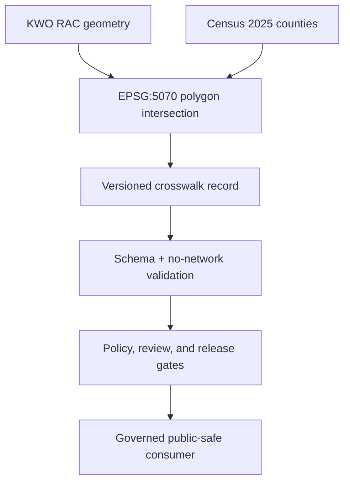

<a id="top"></a>

# Water-planning crosswalk registry

[](https://github.com/bartytime4life/Kansas-Frontier-Matrix/actions/workflows/briefing-integration.yml)
[](#status-and-scope)
[](../../../../docs/doctrine/truth-posture.md)

**Purpose.** This subtype-first registry lane holds the versioned mapping state between Kansas Water Office Regional Advisory Committee (RAC) planning-area geometry and 2025 U.S. Census Bureau Kansas county geometry.

> [!IMPORTANT]
> Every row records a measured positive-area polygon intersection. It does **not** establish political, administrative, advisory, funding, or governance membership. Consumers that need a binary county list must define, document, and review their own materiality rule.

## Quick navigation

- [Status and scope](#status-and-scope)
- [Registry inventory](#registry-inventory)
- [Mapping semantics](#mapping-semantics)
- [Inputs and outputs](#inputs-and-outputs)
- [Lifecycle and authority boundary](#lifecycle-and-authority-boundary)
- [Validation](#validation)
- [Maintenance, correction, and rollback](#maintenance-correction-and-rollback)
- [Open verification items](#open-verification-items)
- [Related authority](#related-authority)

## Status and scope

| Field | Current posture |
|---|---|
| Parent boundary | [`data/registry/crosswalks/`](../README.md) |
| Owning responsibility root | `data/` |
| README profile | `BOUNDARY_COMPACT` |
| Scope ID | `water_planning` |
| Artifact family | Crosswalk mapping-state registry |
| Concrete inventory | One JSON record |
| Record state | `current` |
| Release state | `not-released` |
| Repository visibility | Public-repository bytes; no KFM public-serving or publication authority |
| Review routing | [`.github/CODEOWNERS`](../../../../.github/CODEOWNERS) routes `data/registry/` to `@bartytime4life` |
| Local steward | **NEEDS VERIFICATION** |

This is a nested boundary under the canonical subtype-first `data/registry/crosswalks/` lane. It stores compact crosswalk identity and mapping state, not source payloads, canonical domain facts, semantic contracts, policy decisions, proofs, release decisions, or published geometry.

## Registry inventory

| Record | Stable identity | Coverage | State |
|---|---|---:|---|
| [`kwo_rac_counties_2026-06-24__tiger2025.json`](./kwo_rac_counties_2026-06-24__tiger2025.json) | `kfm:crosswalk:water-planning:kwo-rac-to-county:2026-06-24:tiger-2025` | 209 mappings; 105 counties; 14 regions | `current`; `not-released` |

<details>
<summary><strong>Pinned record identity and lineage</strong></summary>

| Field | Value |
|---|---|
| Record type | `water-planning-rac-county-crosswalk` |
| Schema version | `1.0.0` |
| Region dataset reference | `kfm:dataset-version:water-planning:kwo-rac-regions:2026-06-24` |
| Mapping digest | `sha256:2f1c713d996cca97bc6cc3b553e25e2045d986399b6232378d69f9b903f08c74` |
| Correction status | `current` |
| Supersedes | `null` |

</details>

`record_status: current` identifies the current internal registry pointer for the pinned source versions. It is independent of `release_status: not-released`.

## Mapping semantics

The record was derived by intersecting KWO RAC polygons with Kansas county polygons in `EPSG:5070`. Line-only and point-only touches are excluded. A positive-area intersection is retained only when it is at least 10,000 square metres and at least `0.000001` of the county area.

| Overlap class | County-area-share rule | Pinned rows | Meaning |
|---|---:|---:|---|
| `dominant` | share ≥ `0.999` | 50 | One RAC polygon covers at least 99.9% of the county geometry |
| `material-partial` | `0.001` ≤ share < `0.999` | 122 | Material partial-county overlap |
| `boundary-sliver` | share < `0.001` | 37 | Small measured edge overlap retained for audit |

The derivation records five intersections excluded by the minimum thresholds. Retained rows are ordered by county GEOID and region reference and carry:

- county GEOID and name;
- stable RAC region reference;
- `spatial-intersection` relation;
- county-area and region-area shares;
- intersection area in square kilometres;
- overlap class.

These fields describe geometry only. Names, proximity, majority area, or a `dominant` classification must not be promoted into an official county-membership claim.

## Inputs and outputs

| Role | Governed artifact | Boundary |
|---|---|---|
| RAC dataset identity | [`kwo_rac_regions_2026-06-24.json`](../../datasets/water_planning/kwo_rac_regions_2026-06-24.json) | Pinned dataset registry record; not a geometry payload |
| RAC geometry | [`kwo_rac_regions_2026-06-24.geojson`](../../../processed/water_planning/rac_regions/kwo_rac_regions_2026-06-24.geojson) | Processed internal geometry; not released |
| KWO source identity | [`kwo_rac_feature_service.source.json`](../../sources/water_planning/kwo_rac_feature_service.source.json) | `needs_review`, proposed, not released; connector disabled |
| County source identity | [`census_tigerweb_counties_2025.source.json`](../../sources/water_planning/census_tigerweb_counties_2025.source.json) | 2025 Census county geometry descriptor; connector disabled |
| Crosswalk output | [`kwo_rac_counties_2026-06-24__tiger2025.json`](./kwo_rac_counties_2026-06-24__tiger2025.json) | Compact, digest-pinned registry mapping state |

The source URLs are mutable. A later source change requires a new observation and digest, deterministic validation, and either a new version or an explicit correction. This lane does not perform source refresh or spatial derivation.

## Lifecycle and authority boundary



The first three nodes describe the recorded derivation, not an active repository connector or CI transformation. The validator checks checked-in bytes and metadata; it does not refetch sources or recompute intersections.

| This lane owns | This lane must not own or imply |
|---|---|
| Stable crosswalk identity, version, ordered mappings, digest, source references, correction state, and release state | Official KWO county membership or administrative boundaries |
| Geometry-derived overlap measures and auditable overlap classes | Source admission, source freshness, rights clearance, or policy approval |
| Pointers to dataset, source, contract, schema, validator, tests, and release boundaries | Geometry payloads, EvidenceBundles, receipts, proofs, catalogs, or release manifests |
| Versioned correction and supersession references | Direct public API, map, search, graph, export, or AI access |

Registry placement, schema conformance, validator success, a pull request, or a merge does not release or publish the crosswalk.

## Validation

Run from the repository root:

```bash
python tools/validators/domains/water_planning/validate_rac_registry.py
```

The bounded success line is:

```text
RAC_REGISTRY_OK regions=14 counties=105 mappings=209
```

Run the focused no-network regression suite:

```bash
python -m unittest discover \
  --start-directory tests/domains/water_planning \
  --pattern 'test_rac_registry.py' \
  --verbose
```

| Validation layer | Confirmed behavior | Authority limit |
|---|---|---|
| [JSON Schema](../../../../schemas/contracts/v1/domains/water_planning/rac_county_crosswalk_registry.schema.json) | Constrains the record shape, identifiers, source metadata, thresholds, mapping fields, correction state, and `not-released` state | Shape is not semantic or release authority |
| [No-network validator](../../../../tools/validators/domains/water_planning/validate_rac_registry.py) | Pins source, geometry, mapping, identity, count, ordering, overlap-class, correction, and release constraints | Does not refresh sources or recompute intersections |
| [Regression tests](../../../../tests/domains/water_planning/test_rac_registry.py) | Exercise canonical success and deterministic failures for digest, order, identity, overlap class, duplicate keys, release overclaim, and source activation | Passing tests do not establish freshness, rights, membership, or publication |
| [`briefing-integration` workflow](../../../../.github/workflows/briefing-integration.yml) | Runs the water-planning suite and canonical registry validator for pull requests touching this lane with read-only contents permission | A green job is not evidence closure, policy approval, release, deployment, or publication |

> [!NOTE]
> Validation is deliberately non-vacuous and fail-closed within its declared scope. It proves only that the pinned repository slice satisfies the encoded checks.

## Maintenance, correction, and rollback

- Treat the crosswalk record, mapping digest, source digests, and source versions as one review unit.
- Do not edit rows to make a preferred county list. Re-derive from pinned source observations and preserve the documented thresholds.
- A correction or refresh must preserve the prior digest and version, identify the successor, update forward/backward lineage, rerun deterministic checks, and separately review downstream release.
- Re-review this README when the record inventory, source version, derivation method, schema, validator, test coverage, exposure, correction state, or release state changes.
- Before merge, rollback is closing the draft pull request and leaving its branch unmerged.
- After merge, revert the documentation commit and rerun the same Markdown and link checks. Reverting this README must not mutate registry records or erase correction history.

## Open verification items

| Item | Status | Evidence needed |
|---|---|---|
| Current upstream freshness | **NEEDS VERIFICATION** | New bounded source observations and digest comparison |
| Rights clearance for downstream use | **NEEDS VERIFICATION** | Reviewed source-rights decision and permitted-use scope |
| Official county-membership semantics | **UNKNOWN** | Explicit KWO authority; geometry overlap must not substitute |
| Independent domain stewardship | **NEEDS VERIFICATION** | Accepted stewardship assignment beyond CODEOWNERS routing |
| Public-release eligibility | **NEEDS VERIFICATION** | Evidence, policy, review, release, correction, and rollback closure |

## Related authority

- [Parent crosswalk registry boundary](../README.md)
- [RAC geometry and county-crosswalk contract](../../../../contracts/domains/water_planning/rac_geometry_registry.md)
- [RAC county-crosswalk registry schema](../../../../schemas/contracts/v1/domains/water_planning/rac_county_crosswalk_registry.schema.json)
- [Water-planning validator documentation](../../../../tools/validators/domains/water_planning/README.md)
- [Water-planning registry tests](../../../../tests/domains/water_planning/test_rac_registry.py)
- [KFM policy responsibility root](../../../../policy/README.md)
- [KFM release responsibility root](../../../../release/README.md)
- [Directory Rules v2](../../../../docs/doctrine/directory-rules.md)
- [ADR-0029: Adopt Directory Governance Standard v2](../../../../docs/adr/ADR-0029-adopt-directory-governance-standard-v2.md)

[Back to top](#top)
