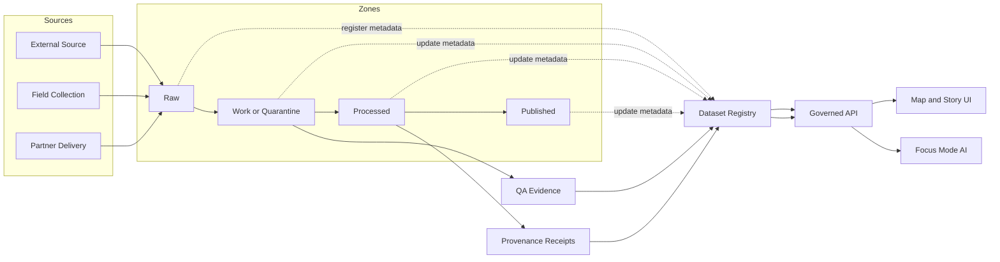

<!-- [KFM_META_BLOCK_V2]
doc_id: kfm://doc/f27cc3ef-3db8-48d8-abd3-8d89ba8474fa
title: Dataset Registry
type: standard
version: v1
status: draft
owners: KFM Maintainers
created: 2026-02-24
updated: 2026-02-24
policy_label: public
related:
  - data/registry
  - data
tags: [kfm, data-registry, datasets, governance]
notes:
  - Defines how datasets are registered for discovery, provenance, and promotion gates.
[/KFM_META_BLOCK_V2] -->

# Dataset Registry

**One-line purpose:** A governed, evidence-first catalog of datasets used by the KFM system.


> NOTE  
> This folder stores **dataset registry artifacts** (metadata, schemas, templates).  
> It intentionally does **not** store the dataset payloads themselves.

## Quick navigation

- [Where this fits](#where-this-fits)
- [What belongs here](#what-belongs-here)
- [What must not go here](#what-must-not-go-here)
- [Directory structure](#directory-structure)
- [Registry concepts](#registry-concepts)
- [How the registry is used](#how-the-registry-is-used)
- [How to add a dataset](#how-to-add-a-dataset)
- [Required fields and gates](#required-fields-and-gates)
- [Validation](#validation)
- [Change management](#change-management)
- [Appendix](#appendix)

---

## Where this fits

This directory is the **dataset “control plane”** for KFM:

- Downstream pipelines and tools should treat `entries/*.yaml` as the **source of truth** for:
  - dataset identity (`dataset_id`)
  - governance (license, attribution, sensitivity, policy label)
  - lineage and provenance receipts (when applicable)
  - QA expectations and results

- UI and AI clients should consume datasets via **governed APIs** (policy boundary), not by reading storage directly.

[Back to top](#dataset-registry)

---

## What belongs here

✅ **Acceptable inputs** (what this directory is for):

- `index.yaml` (lightweight registry index)
- `entries/*.yaml` (one dataset = one entry file; authoritative metadata)
- schemas for validation (e.g., JSON Schema)
- templates for new dataset entries
- documentation clarifying governance and promotion gates

[Back to top](#dataset-registry)

---

## What must not go here

🚫 **Exclusions** (what does *not* belong here):

- Dataset payloads (CSV/Parquet/GeoPackage/rasters/tiles/etc.)
- Secrets (API keys, credentials, tokens, private URLs)
- Anything that would bypass the **governed API / policy boundary**
- Precise coordinates or operational details for sensitive/vulnerable/culturally restricted sites

> WARNING  
> If a dataset contains sensitive locations, culturally restricted knowledge, or personally identifiable information (PII),
> record only **coarse extents** and the **minimum metadata needed for governance**. Flag for governance review.

[Back to top](#dataset-registry)

---

## Directory structure

```
data/registry/datasets/
  README.md                      # this document
  index.yaml                     # registry index (list of datasets + file paths)

  entries/                       # one YAML file per dataset (authoritative metadata)
    .gitkeep

  templates/
    dataset_entry.template.yaml  # copy/paste template for new datasets

  schemas/
    dataset_entry.schema.json    # JSON Schema for entries/*.yaml
```

[Back to top](#dataset-registry)

---

## Registry concepts

### Index vs entry files

- `index.yaml` is for **fast enumeration** (think “table of contents”).
- `entries/<dataset_id>.yaml` is the **authoritative record** for that dataset.

Keep the index stable and small; put rich detail in the per-dataset entry file.

### Zones and promotion

Every dataset has a lifecycle zone:

- `raw` → `work` → `processed` → `published`

**Rule of thumb:** the closer to `published`, the more evidence is required in the entry file.

[Back to top](#dataset-registry)

---

## How the registry is used



Key idea: **Every user-facing claim should be traceable** to a dataset entry + its evidence.

[Back to top](#dataset-registry)

---

## How to add a dataset

1. **Create an entry file**
   - Copy: `templates/dataset_entry.template.yaml`
   - To: `entries/<dataset_id>.yaml`

2. **Populate required fields**
   - Use stable `dataset_id` (snake_case)
   - Set `policy_label` and `sensitivity` early
   - Keep spatial extents coarse if sensitive

3. **Register it in the index**
   - Add a row to `index.yaml` pointing at your entry file

Example (shell):

```bash
cp data/registry/datasets/templates/dataset_entry.template.yaml \
   data/registry/datasets/entries/my_dataset.yaml
# edit the new YAML file
```

> TIP  
> Keep diffs reviewable: one dataset per PR is ideal.

[Back to top](#dataset-registry)

---

## Required fields and gates

### Minimum required fields (always)

Even for `raw`, an entry must include:

- **Identity:** `dataset_id`, `title`, `description`
- **Ownership:** `owners`, `contacts`
- **Governance:** `license`, `policy_label`, `sensitivity`
- **Scope:** `extents` (temporal + spatial; coarse if needed)
- **Storage pointers:** `storage.canonical_uri` (no secrets)

### Promotion gates

Use this checklist when promoting to `processed` or `published`:

- [ ] Schema is defined (`schema.kind`, `schema.schema_ref` or minimal inline fields)
- [ ] QA checks listed and results recorded (`qa.status`, `qa.checks[]`)
- [ ] License verified (SPDX + URL + attribution text)
- [ ] Provenance recorded (inputs, transforms, toolchain versions)
- [ ] Integrity recorded (checksums / hashes for canonical artifacts)
- [ ] Audit trail updated (`audit.created_by`, review metadata)

> NOTE  
> The `dataset_entry.schema.json` is strict (`additionalProperties: false`).  
> If you need new fields, **extend the schema first** so changes remain governed and reviewable.

[Back to top](#dataset-registry)

---

## Validation

This folder includes a JSON Schema:

- `schemas/dataset_entry.schema.json`

**Expected behavior:** `entries/*.yaml` should validate against it before promotion.

**Proposed validation approach (not confirmed in repo):**

- Convert YAML → JSON
- Validate with a schema validator (e.g., `jsonschema` in Python or `ajv` in Node)
- Fail CI if:
  - required fields are missing
  - enums are violated (e.g., `policy_label`, `zone`)
  - unexpected fields are added

[Back to top](#dataset-registry)

---

## Change management

### Deprecating a dataset

When a dataset is no longer valid or should not be used:

1. Set `status: deprecated`
2. Add a `notes:` item explaining:
   - why it’s deprecated
   - what replaces it (if anything)
3. Keep the entry file (do not delete) to preserve provenance.

### Renaming a dataset_id

Avoid renames. If unavoidable:

- Treat it as creating a **new dataset** and deprecating the old one.
- Record the relationship in `notes` and `provenance.inputs`.

[Back to top](#dataset-registry)

---

## Appendix

<details>
<summary>Design notes</summary>

- One dataset per file keeps diffs small and code reviews fast.
- The index is intentionally lightweight so downstream tools can enumerate datasets cheaply.
- Governance fields (license, policy label, sensitivity) are part of the **trust membrane** and should be present early.
- Sensitive location handling defaults to **coarse extents** and “needs review” notes.

</details>
