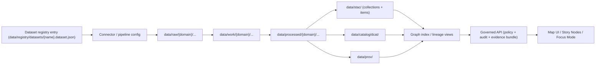

# Kansas Frontier Matrix (KFM) — Dataset Registry
<!-- Path: data/registry/datasets/README.md -->


This folder is the **authoritative registry** of all datasets that KFM can ingest, version, validate, govern, and publish.

It exists to prevent the “data sources get overlooked” failure mode by making every dataset a **tracked integration deliverable** with:
- a machine-readable registry entry,
- deterministic acquisition + checksums,
- validation gates,
- policy classification (including sensitive-location handling),
- and published **boundary artifacts** (DCAT + STAC + PROV) before the dataset is exposed to the graph/API/UI.

> [!IMPORTANT]
> **This directory is configuration + metadata (registry entries), not the data itself.**
> Actual dataset files live under the data lifecycle directories:
> `data/raw/`, `data/work/`, and `data/processed/`.
> Catalog outputs live under `data/stac/`, `data/catalog/dcat/`, and `data/prov/`.

---

## What “dataset” means in KFM

A **Dataset** in KFM is a governed, versioned unit of information that is:
1. **Ingested** from an upstream source (API, files, etc.)
2. **Promoted** through the lifecycle **Raw → Work → Processed**
3. **Published** with boundary artifacts:
   - **DCAT** dataset entry (discovery/distributions)
   - **STAC** collection/items (spatial/temporal assets)
   - **PROV** lineage bundle (how it was produced)
4. **Served** only through the governed API boundary (policy + audit + evidence bundle)

> [!NOTE]
> Each ingest run produces a new **DatasetVersion** with its own checksums + run metadata. Backfills and reprocessing create new versions; they do **not** overwrite existing releases.

---

## Non-negotiable invariants (boss-mode rules)

These are **system invariants** that every dataset registry entry must respect:

- **Trust membrane:** UI/external clients never access databases directly; all access is via governed APIs + policy boundary.
- **Fail-closed:** if a policy, provenance, or validation check cannot be verified, the system must refuse promotion/exposure rather than guessing.
- **Promotion gates:** no dataset is considered published unless it is promoted Raw → Work → Processed with checksums and required catalogs.
- **Evidence-first UI:** Focus Mode and narrative surfaces must cite or abstain; every answer produces an audit reference.

---

## Directory layout

```text
data/
└── registry/
    └── datasets/
        ├── README.md                 # (this file)
        ├── *.dataset.json            # one dataset entry per file (recommended)
        ├── index.json                # OPTIONAL: generated index (do not hand-edit)
        ├── schemas/                  # OPTIONAL: JSON Schemas for registry validation
        └── examples/                 # OPTIONAL: curated examples for contributors
```

> [!TIP]
> If your repo uses YAML instead of JSON, ensure it is **canonicalized** deterministically for hashing and CI checks.
> KFM strongly prefers deterministic canonical JSON hashing for “spec hash” stability.

---

## How the dataset registry fits into the pipeline



---

## Quickstart: add or update a dataset entry

### Add a new dataset (new upstream or new product)

1. Create a new registry entry file:
   - **Recommended filename:** `<dataset_id>.dataset.json`
2. Fill out **all required fields** in the Dataset Entry Contract (below).
3. Set `lifecycle.status = "proposed"` until the first successful end-to-end run publishes catalogs.
4. Implement or reference the connector/pipeline config referenced by the entry.
5. Run your repo’s validation/verification checks (CI will also enforce them).
6. After the dataset successfully publishes:
   - update `lifecycle.status = "active"`
   - add the published catalog references and storage paths

### Update an existing dataset

- Update the registry entry **only** in a PR that includes:
  - validation passing,
  - any required policy updates,
  - and (if relevant) updated catalogs for the changed outputs.

> [!WARNING]
> **Never edit “published” data in-place to change history.**
> Changes must produce new dataset versions with new provenance and checksums.

---

## Dataset Entry Contract (v1)

### Required entry shape

Each dataset entry is a single JSON object with:
- a stable `dataset_id`
- a deterministic `spec_hash` (or the input needed to compute it)
- lifecycle status + governance classification
- upstream source definition
- pipeline/config references
- storage + catalogs references (required for `active`)

> [!IMPORTANT]
> The dataset registry is the system’s **source-of-truth** for:
> - what datasets exist,
> - how they are acquired/validated,
> - how they are classified/redacted,
> - and where their published catalogs can be found.

---

## Identifier rules (recommended)

| Identifier | Purpose | Stability rule |
|---|---|---|
| `dataset_id` | KFM canonical dataset identifier | Stable forever; do not recycle |
| `upstream_id` | Provider’s dataset identifier | Stable per upstream semantics |
| `dataset_version_id` | Version identifier for a particular published release | Derived from deterministic input (e.g., content hash of raw manifest) |
| `spec_hash` | Deterministic hash of the registry entry spec (canonicalized) | Must be reproducible from the entry body |

**Recommended namespace conventions**
- `dataset_id`: `kfm.dataset.<domain>.<slug>`
- `connector_id`: `kfm.connector.<provider>.<slug>`

> [!NOTE]
> The exact namespace scheme can be adapted to your repo conventions, but must remain stable and deterministic.

---

## Lifecycle status and what’s required

A dataset entry’s `lifecycle.status` determines what fields must be populated.

| Status | Meaning | Minimum required |
|---|---|---|
| `proposed` | Defined and under development/review | Upstream + governance + pipeline references |
| `active` | Published and available through catalogs/API | Everything in `proposed` **plus** storage paths, catalogs refs, ops SLOs |
| `deprecated` | Still kept for reproducibility but no longer updated | Deprecation notice + successor mapping (if any) |

---

## Governance & sensitivity model

KFM uses explicit dataset-level sensitivity labels (and may apply record/field-level rules as well).

### Policy labels (recommended)

- `public` — safe to publish without redaction  
- `restricted` — requires role-based access (e.g., parcel ownership data)  
- `sensitive-location` — coordinates must be generalized or suppressed (e.g., archaeology, sensitive species)  
- `aggregate-only` — publish only above safe thresholds (e.g., small counts health/crime)

> [!IMPORTANT]
> **Redaction is a first-class transformation.**
> The raw dataset remains immutable; the redacted derivative is a separate dataset version (often a separate `dataset_id`) and must be recorded in PROV.

---

## Validation gates (minimum expectations)

Every dataset must define and pass **minimum validation gates** before promotion/publishing:

- row-level schema validation (required fields and coercion rules)
- geometry validity and bounds checks (when spatial)
- temporal consistency checks (no impossible/future timestamps for historical archives; no negative durations)
- license + attribution captured in DCAT; restrictions encoded in policy
- provenance completeness: every promoted artifact has a PROV chain and deterministic checksum

> [!NOTE]
> These gates should be implemented in CI and enforced fail-closed.

---

## Promotion gates & CI checks (fail-closed)

A dataset may be promoted/published only if the following conditions hold:

### Promotion checklist

- [ ] Registry entry passes schema validation
- [ ] Deterministic `spec_hash` computed from canonical form matches expected (reproducible)
- [ ] Raw acquisition produced deterministic manifest + checksums
- [ ] Work/processed outputs are deterministic for the same inputs (or intentionally versioned)
- [ ] Policy label exists and any redaction rules are explicitly defined
- [ ] Catalog boundary artifacts exist and validate:
  - [ ] DCAT dataset record
  - [ ] STAC collection + items (as applicable)
  - [ ] PROV bundle for lineage
- [ ] API contract tests pass for at least one representative query (for datasets exposed via API)
- [ ] Backfill strategy documented (if historical coverage is expected)

> [!WARNING]
> If any required artifact is missing or fails validation, promotion **must not** occur.

---

## Operations: freshness SLOs, monitoring, and backfills

### Freshness SLO

Each dataset should declare a freshness expectation (“SLO”) consistent with its cadence, so alerting can detect staleness.

Include:
- expected update cadence
- last successful run timestamp (produced by run receipts, not hand-edited)
- alerting target (channel/service) as appropriate

### Backfills (explicit)

Backfills are explicit and must be described in the registry entry:
- historical coverage ranges to backfill
- batching strategy
- expected runtime/cost envelope

Backfills produce new dataset versions with their own provenance; they never overwrite existing releases.

---

## Dataset entry file format (recommended)

### File naming

Use one file per dataset:
- **Filename:** `<dataset_id>.dataset.json`
- **Example:** `kfm.dataset.hazards.noaa_storm_events.dataset.json`

### Top-level fields (v1)

| Field | Type | Required | Notes |
|---|---:|:---:|---|
| `registry_schema` | string | ✅ | E.g., `kfm.dataset.registry.v1` |
| `dataset_id` | string | ✅ | Stable canonical ID |
| `title` | string | ✅ | Human-readable |
| `description` | string | ✅ | What it is + why it matters |
| `domain` | string | ✅ | E.g., `hazards`, `heritage`, `transportation` |
| `owners` | object | ✅ | Steward/maintainer/governance contacts |
| `upstream` | object | ✅ | Provider, endpoints, cadence, auth |
| `license` | object | ✅ | License id/url + attribution requirements |
| `governance` | object | ✅ | policy_label + redaction rules |
| `pipeline` | object | ✅ | connector id, config path, schedule, validation |
| `storage` | object | ⚠️* | Required when `active` |
| `catalogs` | object | ⚠️* | Required when `active` |
| `operations` | object | ⚠️* | Required when `active` |
| `lifecycle` | object | ✅ | status + dates + deprecation mapping |
| `provenance_notes` | object | ✅ | Source references (e.g., inventory page/section) |

\* Required when `lifecycle.status = "active"`.

---

## Complete example dataset entry (v1)

<details>
<summary><strong>Click to expand example JSON</strong></summary>

```json
{
  "registry_schema": "kfm.dataset.registry.v1",
  "dataset_id": "kfm.dataset.hazards.example_storm_events",
  "title": "Example — Storm Events (Demonstration Only)",
  "description": "Demonstration dataset entry showing required registry fields. Replace with a real source definition and remove demo placeholders before activation.",
  "domain": "hazards",
  "tags": ["hazards", "events", "time-series", "geospatial"],

  "owners": {
    "data_steward": {
      "name": "KFM Domain Steward (Hazards)",
      "contact": "stewards@example.org"
    },
    "maintainer": {
      "name": "KFM Data Engineering",
      "contact": "data-eng@example.org"
    },
    "security_owner": {
      "name": "KFM Security/Compliance",
      "contact": "security@example.org"
    }
  },

  "upstream": {
    "provider_name": "Example Provider",
    "upstream_id": "provider-dataset-id-123",
    "access_method": "api",
    "endpoints": [
      {
        "name": "events",
        "url": "https://example.org/api/events",
        "method": "GET",
        "pagination": "cursor",
        "rate_limit": {
          "requests_per_minute": 60,
          "backoff": "exponential"
        }
      }
    ],
    "cadence": {
      "type": "periodic",
      "expected_interval": "P30D",
      "notes": "Monthly refresh expected."
    },
    "auth": {
      "type": "none",
      "notes": "If keys are required, store secrets in vault and never commit."
    }
  },

  "license": {
    "license_id": "CC-BY-4.0",
    "license_url": "https://creativecommons.org/licenses/by/4.0/",
    "attribution": "Example Provider; accessed by KFM pipeline; see DCAT for full attribution string."
  },

  "governance": {
    "policy_label": "public",
    "sensitivity_rationale": "No sensitive locations or restricted fields expected in this demo dataset.",
    "redaction": {
      "enabled": false,
      "rules": []
    }
  },

  "pipeline": {
    "connector_id": "kfm.connector.example.storm_events",
    "config_ref": "pipelines/hazards/example_storm_events/config.json",
    "incremental_cursor": "modified_date",
    "format_targets": ["geojson", "parquet"],
    "validation": {
      "schema_contract_ref": "schemas/hazards/example_storm_events.schema.json",
      "checks": [
        "row_schema_required_fields",
        "geometry_validity",
        "temporal_consistency",
        "license_present",
        "prov_required_for_promotion"
      ]
    },
    "promotion": {
      "required_catalogs": ["dcat", "prov", "stac"],
      "require_checksums": true
    },
    "backfill": {
      "enabled": true,
      "coverage": {
        "start": "2000-01-01",
        "end": "2020-12-31"
      },
      "batching": {
        "strategy": "year",
        "batch_size": 1
      },
      "expected_runtime": "PT2H",
      "notes": "Backfill creates new dataset versions; never overwrites."
    }
  },

  "storage": {
    "raw_path": "data/raw/hazards/example_storm_events/",
    "work_path": "data/work/hazards/example_storm_events/",
    "processed_path": "data/processed/hazards/example_storm_events/",
    "primary_assets": [
      {
        "name": "events_parquet",
        "relative_path": "events.parquet",
        "media_type": "application/x-parquet"
      }
    ]
  },

  "catalogs": {
    "dcat": {
      "relative_path": "data/catalog/dcat/kfm.dataset.hazards.example_storm_events.jsonld"
    },
    "stac": {
      "collection_id": "kfm-hazards-example-storm-events",
      "collection_relative_path": "data/stac/collections/kfm-hazards-example-storm-events.json",
      "items_prefix": "data/stac/items/kfm-hazards-example-storm-events/"
    },
    "prov": {
      "bundle_relative_path": "data/prov/kfm.dataset.hazards.example_storm_events.prov.json"
    }
  },

  "operations": {
    "freshness_slo": {
      "max_age": "P45D",
      "notes": "Alert if no successful run within 45 days."
    },
    "observability": {
      "required_signals": [
        "last_success_timestamp",
        "bytes_processed",
        "records_processed",
        "retry_count",
        "policy_denials"
      ]
    }
  },

  "lifecycle": {
    "status": "proposed",
    "created": "2026-02-14",
    "last_reviewed": "2026-02-14",
    "deprecation": null
  },

  "provenance_notes": {
    "inventory_source": "KFM Data Sources inventory (internal governed reference)",
    "source_reference": "Example row/page reference; replace with real citation pointer."
  }
}
```

</details>

> [!WARNING]
> The example above includes demo values (like `example.org`). For real datasets, ensure upstream terms, licenses, and policy constraints are accurate and reviewable.

---

## Deprecation & breaking changes

### Deprecating a dataset

When a dataset is no longer maintained:
1. Set `lifecycle.status = "deprecated"`
2. Add a reason and (if applicable) a successor dataset mapping:
   - successor `dataset_id`
   - migration notes
3. Preserve catalogs and provenance for historical reproducibility.

### Breaking schema changes

If the dataset entry schema changes incompatibly:
- bump `registry_schema` version (e.g., `...v2`)
- provide a migration script/process (repo-specific)
- preserve the ability to resolve historical references

---

## PR review checklist (dataset registry changes)

- [ ] License and attribution are correct and captured
- [ ] Governance label is set (`public`, `restricted`, `sensitive-location`, `aggregate-only`)
- [ ] Redaction rules are explicit and testable (if needed)
- [ ] Validation gates are declared and implemented in CI
- [ ] Storage paths follow Raw → Work → Processed lifecycle
- [ ] Catalog outputs exist/are updated and validate (DCAT/STAC/PROV)
- [ ] API contract tests exist if the dataset is exposed through API endpoints
- [ ] Backfill strategy is explicit (if historical)

---

## FAQ

**Q: Why do we need a registry entry at all?**  
A: The registry is the system’s guardrail: it makes datasets discoverable, governable, testable, and difficult to “forget.”

**Q: Can we store sensitive coordinates?**  
A: Not in public outputs. If a dataset contains sensitive locations, classify as `sensitive-location` and ensure the published derivative generalizes or suppresses coordinates. Record the transformation in PROV.

**Q: What if an upstream license is unclear?**  
A: The dataset must remain `proposed` and must not be published until license/attribution are captured and approved.

---

## References (internal KFM docs)

These documents define the system invariants this registry supports:
- **KFM Comprehensive Data Source Integration Blueprint** (promotion gates, validation gates, backfills, policy labels)
- **KFM Next-Gen Blueprint & Primary Guide** (promotion checklist patterns, run records)
- **KFM Master Guide v13 draft** (canonical data lifecycle layout; STAC/DCAT/PROV alignment rules)
- **Focus Mode / Story Node guidance** (cite-or-abstain requirements)

---

