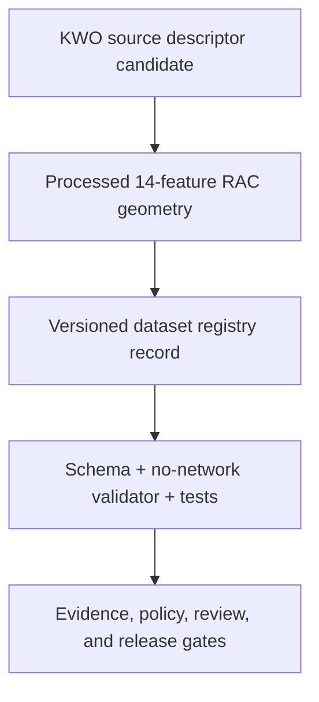

<!-- [KFM_META_BLOCK_V2]
doc_id: kfm://data/registry/datasets/readme
name: Dataset Registry README
path: data/registry/datasets/README.md
type: data-registry-datasets-parent-readme
version: v0.5.0
status: draft
owners:
  - "NEEDS VERIFICATION: registry steward"
  - "NEEDS VERIFICATION: dataset steward"
  - "NEEDS VERIFICATION: source and domain stewards"
  - "NEEDS VERIFICATION: contract, schema, and policy stewards"
  - "NEEDS VERIFICATION: validation, evidence, and release stewards"
created: 2026-06-28
updated: 2026-07-30
policy_label: internal-governance
truth_posture: cite-or-abstain
responsibility_root: data/
artifact_family: registry
registry_scope: dataset-identity-and-state
path_posture: confirmed-live-canonical-subtype-first-parent; flora-child-confirmed; water-planning-child-and-record-confirmed; complete-inventory-partial; shared-schema-and-registry-wide-validator-coverage-partial
sensitivity_posture: registry-internal; no-public-path; source-role-preserving; rights-and-sensitivity-fail-closed; evidence-aware; policy-aware; release-blocked-until-gates-close
related:
  - ../README.md
  - ../sources/README.md
  - ../layers/README.md
  - ../rights/README.md
  - ../sensitivity/README.md
  - ../crosswalks/README.md
  - flora/README.md
  - water_planning/README.md
  - ../../raw/README.md
  - ../../work/README.md
  - ../../quarantine/README.md
  - ../../processed/README.md
  - ../../catalog/README.md
  - ../../receipts/README.md
  - ../../proofs/README.md
  - ../../published/README.md
  - ../../../contracts/data/dataset_version.md
  - ../../../schemas/contracts/v1/registries/README.md
  - ../../../policy/README.md
  - ../../../fixtures/README.md
  - ../../../tests/README.md
  - ../../../release/README.md
  - ../../../docs/doctrine/directory-rules.md
  - ../../../docs/adr/ADR-0029-adopt-directory-governance-standard-v2.md
tags:
  - kfm
  - data
  - registry
  - datasets
  - dataset-identity
  - source-role
  - provenance
  - evidence
  - rights
  - sensitivity
  - correction
  - rollback
  - release-gated
  - no-public-path
evidence_snapshot:
  repository: bartytime4life/Kansas-Frontier-Matrix
  base_commit: 0f93ec146d61fde5309fa386f02908e9f0e5d5bd
  prior_blob: a49b5be1f508dfc33715316f25f83c2517cfc629
  flora_child_blob: 025cade8130a07ee2e5243ee5929d86c182e8162
  water_planning_child_blob: 36522cd91ca05ced03bcf0a3cdb7500c7aeb6f33
  water_planning_record_blob: 6969df8d5125a64c7dd52a07b80a9bfa196a1077
  rac_contract_blob: 8dba083a2d7a9023e786372a809edd7ca802ea61
  rac_dataset_schema_blob: f2ec9b87107e7c431c3332da8df060f0c9e81a3f
  rac_validator_blob: 11c26cc4ed3d387ab1669e30a71434ffc1aab873
  rac_tests_blob: a5779da0e9190c7d0a7d1960e7a52bfac6d97cbf
  briefing_workflow_blob: d076618e57770b1e2bb0ff419faaab38442ce7e8
  directory_rules_blob: fd49a0b83e55cef52c1124281f093e263526898d
  adr_0029_blob: cd044a38047cc9b3725d2e083eb201eb86109308
  registry_schema_guardrail_blob: 9af6574ec32bde3d60a904fccf9b0dc4bb71703b
  dataset_version_contract_blob: 06a0345b19f753632068978c61d5d0e50011305d
  inspection_date: 2026-07-30
notes:
  - "This README preserves and upgrades the existing document at the same canonical subtype-first registry path."
  - "ADR-0029 accepted Directory Rules v2; its topology resolves `data/registry/datasets/` as the canonical dataset registry parent."
  - "Current repository evidence confirms the Flora child README, the water-planning child README, and one concrete RAC geometry dataset record; complete lane inventory remains partial."
  - "The water-planning slice has a proposed contract, a concrete schema, a deterministic no-network validator, focused tests, and path-scoped read-only CI; those checks do not close registry-wide validation, rights, evidence, review, release, or publication."
  - "The shared registry-schema lane is README-only and names `dataset_registry_record.schema.json` as a candidate that is not present."
  - "The adjacent `DatasetVersion` contract is draft and its paired schema is explicitly a permissive placeholder."
  - "Registry presence does not admit a source, validate a dataset, prove a claim, clear rights or sensitivity, authorize release, or publish KFM content."
[/KFM_META_BLOCK_V2] -->

<a id="top"></a>

# Dataset Registry

[](#status)
[](#authority-and-path-posture)
[](#dataset-registry-boundary)
[](#lifecycle-and-publication-boundary)
[](#validation-and-maintenance)

> **One-line purpose.** Govern stable dataset identity and dataset state without storing dataset payloads or taking over source, contract, schema, policy, evidence, catalog, release, or publication authority.

> [!CAUTION]
> A dataset registry record is a governance handle, not source truth, domain truth, proof, catalog closure, release approval, or a public dataset. Unresolved identity, source role, rights, sensitivity, evidence, validation, review, correction, or rollback conditions must remain visible and fail closed.

## Navigation

[Status](#status) · [Scope](#scope) · [Authority](#authority-and-path-posture) · [Repository fit](#repository-fit) · [Boundary](#dataset-registry-boundary) · [Inventory](#confirmed-inventory) · [Implemented slice](#implemented-water-planning-slice) · [Belongs](#what-belongs-here) · [Exclusions](#what-does-not-belong-here) · [Inputs and outputs](#inputs-and-outputs) · [Lifecycle](#lifecycle-and-publication-boundary) · [Semantic concerns](#minimum-semantic-concerns) · [Validation](#validation-and-maintenance) · [Review](#review-burden) · [Checks](#required-checks-before-use) · [Verification](#open-verification-items) · [Rollback](#correction-supersession-and-rollback)

---

## Status

| Field | Evidence-backed state |
|---|---|
| Repository path | `data/registry/datasets/` — **CONFIRMED** at the pinned base |
| README profile | Parent-lane `BOUNDARY_COMPACT` |
| Directory placement | **CONFIRMED canonical** subtype-first registry topology under accepted Directory Rules v2 |
| Placement outcome | `PLACE` at the existing path |
| Document lifecycle | `draft` |
| Confirmed child lanes | [`flora/`](flora/README.md) — detailed boundary README; [`water_planning/`](water_planning/README.md) — compact boundary README plus one concrete RAC geometry record |
| Concrete dataset-registry record inventory | [`water_planning/kwo_rac_regions_2026-06-24.json`](water_planning/kwo_rac_regions_2026-06-24.json) — one digest-pinned 14-feature internal record; complete lane inventory remains partial |
| Accepted shared dataset-registry schema | **NEEDS VERIFICATION**; the shared registry-schema lane is README-only |
| Adjacent `DatasetVersion` contract | **CONFIRMED draft**; its paired schema is explicitly a permissive placeholder |
| Dataset-registry validators, fixtures, tests, and CI | **PARTIAL** — concrete water-planning validator/tests/path-scoped read-only CI; registry-wide coverage remains unresolved |
| Review routing | [`.github/CODEOWNERS`](../../../.github/CODEOWNERS) routes `data/registry/` to `@bartytime4life`; routing is not independent approval or proof of review |
| Accountable registry, dataset, and domain stewards | **NEEDS VERIFICATION** |
| Direct public access | **DENY** |
| KFM publication effect | None |

A file, stable ID, schema-valid object, passing workflow, commit, pull request, or merge does not establish dataset correctness, source authority, rights clearance, sensitivity clearance, evidence closure, release approval, or KFM publication.

---

## Scope

`data/registry/datasets/` is the canonical parent for governed dataset identity and dataset-state records across KFM domains and shared dataset families.

A record may answer bounded governance questions:

- Which stable dataset family or dataset version is being referenced?
- Which source identities, source roles, rights terms, access terms, cadence, stewardship obligations, and authority limits apply?
- Which RAW, WORK, QUARANTINE, PROCESSED, CATALOG, TRIPLETS, or PUBLISHED objects are related?
- Which validation receipts, EvidenceRefs, EvidenceBundles, policy decisions, reviews, catalogs, release decisions, corrections, supersessions, withdrawals, and rollback targets support governed use?
- Which unresolved conditions require hold, restriction, denial, quarantine, abstention, correction, or withdrawal under the applicable contract?

Registry records help route admission, refresh, validation, cataloging, correction, release review, withdrawal, and rollback. They do not contain dataset payloads and do not publish anything by themselves.

This README defines the parent boundary. It does not define a universal dataset-registry contract, schema, status vocabulary, file format, filename, or domain inventory.

---

## Authority and path posture

Accepted [Directory Rules v2](../../../docs/doctrine/directory-rules.md), adopted through [ADR-0029](../../../docs/adr/ADR-0029-adopt-directory-governance-standard-v2.md), separates registry identity from lifecycle payloads and makes registry placement subtype-first:

```text
data/registry/
├── sources/
├── datasets/
├── layers/
├── domains/
├── rights/
├── sensitivity/
└── crosswalks/
```

Dataset lanes therefore resolve as:

```text
data/registry/datasets/<domain-or-accepted-scope>/
```

| Responsibility-signature axis | Resolved value |
|---|---|
| Artifact kind | Dataset registry record or registry boundary documentation |
| Authority owner | Dataset identity, state, routing, and lineage |
| Lifecycle stage | Registry accountability and identity store |
| Scope | Shared parent with governed domain or accepted-scope children |
| Exposure | Internal or restricted unless a separate released projection exists |
| Placement outcome | `PLACE` at `data/registry/datasets/` |

The path is canonical even though implementation maturity remains incomplete. Placement does not prove that registry payloads, contracts, schemas, validators, producers, consumers, correction hooks, rollback drills, or public-safe projections exist.

Domain-first registry paths such as `data/registry/<domain>/datasets/` must not become parallel writers for dataset records owned here. Any compatibility view requires an accepted migration, a canonical target, no independent edits, parity checks, and explicit exit conditions.

---

## Repository fit

| Responsibility | Owning surface | Relationship to this lane |
|---|---|---|
| Registry governance | [`data/registry/`](../README.md) | Parent identity and routing boundary |
| Dataset registry records | `data/registry/datasets/` | Stable dataset identity, state, routing, lineage, and correction pointers |
| Source identity | [`data/registry/sources/`](../sources/README.md) | Source identity, role, authority, rights, terms, and cadence |
| Layer identity | [`data/registry/layers/`](../layers/README.md) | Layer registry state; does not replace dataset identity |
| Rights and sensitivity identity | [Rights](../rights/README.md) and [sensitivity](../sensitivity/README.md) registries | References to governed rights and sensitivity state |
| Crosswalk mapping state | [`data/registry/crosswalks/`](../crosswalks/README.md) | Mapping claims between identities and vocabularies |
| Dataset-version meaning | [`DatasetVersion`](../../../contracts/data/dataset_version.md) | Adjacent draft semantic contract; not a complete dataset-registry contract |
| Registry machine shape | [`schemas/contracts/v1/registries/`](../../../schemas/contracts/v1/registries/README.md) | README-only guardrail; accepted dataset-registry schema not verified |
| Policy and admissibility | [`policy/`](../../../policy/README.md) | Rights, sensitivity, geoprivacy, access, source-role, and release rules |
| Lifecycle payloads | [RAW](../../raw/README.md), [WORK](../../work/README.md), [QUARANTINE](../../quarantine/README.md), and [PROCESSED](../../processed/README.md) | Actual dataset bytes and governed transforms; never stored here |
| Process and evidence support | [Receipts](../../receipts/README.md) and [proofs](../../proofs/README.md) | Process memory and evidence support; neither is registry state |
| Catalog projections | [`data/catalog/`](../../catalog/README.md) | Discovery and provenance projections; not registry authority |
| Validation evidence | [Fixtures](../../../fixtures/README.md) and [tests](../../../tests/README.md) | Valid/invalid examples and executable checks when implemented |
| Release and delivery | [`release/`](../../../release/README.md) and [published carriers](../../published/README.md) | Separate release decision and public-delivery boundaries |

---

## Dataset registry boundary

| Rule | Required handling |
|---|---|
| Registry record is a handle | Identify and route governed dataset state; never embed the full dataset payload. |
| Dataset family and version differ | Preserve stable family identity separately from a particular representation or version. |
| Registry state is not source truth | Resolve source identity and role; do not upgrade authority through registry presence. |
| Source role is preserved | Observed, regulatory, modeled, aggregate, administrative, synthetic, contextual, candidate, and restricted roles remain distinct under their governing contract. |
| Registry is not validation | Point to validation and run receipts; do not restate a run as registry truth. |
| Registry is not proof | Resolve EvidenceRef to EvidenceBundle or accepted proof support for consequential claims. |
| Registry is not policy | Reference policy decisions; do not decide rights, sensitivity, access, or release here. |
| Registry is not catalog | Point to catalog projections; do not duplicate STAC, DCAT, PROV, or domain catalog records. |
| Registry is not release | Reference release decisions; do not infer publication from status, schema validity, or merge state. |
| Public clients do not read this lane | Public UI, API, map, graph, search, and AI surfaces consume governed interfaces or release-approved carriers. |
| Changes remain auditable | Preserve identity, version, digest, source refs, lifecycle refs, correction state, supersession, withdrawal, and rollback lineage. |

---

## Confirmed inventory

| Path | Current evidence | Boundary |
|---|---|---|
| `data/registry/datasets/README.md` | **CONFIRMED** parent README | Documentation and placement boundary only |
| [`data/registry/datasets/flora/`](flora/README.md) | **CONFIRMED** child README | Flora dataset-registry boundary; not proof of emitted records |
| [`data/registry/datasets/water_planning/`](water_planning/README.md) | **CONFIRMED** child README | Water-planning dataset-registry boundary; one record is currently inventoried |
| [`data/registry/datasets/water_planning/kwo_rac_regions_2026-06-24.json`](water_planning/kwo_rac_regions_2026-06-24.json) | **CONFIRMED concrete record** | Stable dataset and version IDs; `current`; `not-released`; points to a digest-pinned 14-feature processed GeoJSON |
| Complete machine-readable dataset-registry inventory | **PARTIAL** | One water-planning record is concrete; do not infer completeness for other domains |
| Shared `dataset_registry_record` schema | **NOT FOUND / NEEDS VERIFICATION** | Candidate name only in the shared schema guardrail |
| Registry-wide validator, fixture, test, or CI lane | **NEEDS VERIFICATION** | The bounded water-planning slice is concrete; no registry-wide completeness claim |

This inventory is intentionally bounded. The water-planning record is concrete; search-limited repository inspection is not proof of completeness outside the surfaced paths.

---

## Implemented water-planning slice

The current repository contains one bounded dataset-registry implementation. Its dependency and authority flow is:


```mermaid
flowchart TD
    S["KWO source descriptor candidate"] --> P["Processed 14-feature RAC geometry"]
    P --> R["Versioned dataset registry record"]
    R --> V["Schema + no-network validator + tests"]
    V --> G["Evidence, policy, review, and release gates"]
```

The first four nodes are confirmed repository surfaces at the pinned base. The source descriptor remains `proposed`, `needs_review`, `not_released`, and connector-disabled. The final gates are not closed; this flow does not assert active ingestion, source freshness, rights clearance, evidence closure, release, or publication.

| Surface | Confirmed role | Authority limit |
|---|---|---|
| [KWO source descriptor candidate](../sources/water_planning/kwo_rac_feature_service.source.json) | Identifies the observed KWO Regional Planning Areas source and pins the observed source-response digest | Does not activate a recurring connector or clear independent rights review |
| [Processed RAC geometry](../../processed/water_planning/rac_regions/kwo_rac_regions_2026-06-24.geojson) | 14-feature GeoJSON payload referenced by path, byte count, CRS, and SHA-256 | Processed bytes are not automatically public or released |
| [Dataset registry record](water_planning/kwo_rac_regions_2026-06-24.json) | Preserves stable dataset/version IDs, source lineage, payload digest, correction state, and `not-released` state | Registry state is not source truth, policy, proof, or release authority |
| [Semantic contract](../../../contracts/domains/water_planning/rac_geometry_registry.md) and [machine schema](../../../schemas/contracts/v1/domains/water_planning/rac_geometry_dataset_registry.schema.json) | Define the proposed RAC registry meaning and concrete record shape | The contract remains proposed; schema conformance does not prove semantics or admissibility |
| [Validator](../../../tools/validators/domains/water_planning/validate_rac_registry.py), [tests](../../../tests/domains/water_planning/test_rac_registry.py), and [workflow](../../../.github/workflows/briefing-integration.yml) | Check pinned repository bytes deterministically without network access for the declared water-planning scope | The workflow path filter covers the water-planning child, not this parent README, and no green check grants release or publication authority |

---

## What belongs here

Only artifacts owned by the dataset-registry responsibility may live under this lane:

- accepted machine-readable dataset registry instances;
- domain or accepted-scope dataset registry child lanes;
- boundary README files and registry-local navigation;
- stable dataset-family and dataset-version identities;
- source identity and source-role references;
- rights, sensitivity, cadence, authority, spatial-scope, temporal-scope, and lifecycle-state references;
- EvidenceRef, receipt, policy, review, catalog, release, correction, supersession, withdrawal, and rollback references;
- registry-local indexes, manifests, checksums, or signatures only when an accepted contract defines their authority and they do not duplicate another canonical family.

Registry records should point outward through stable IDs, paths, URIs, digests, or governed references. They should not copy source payloads, proof material, policy decisions, catalog records, or release objects into this lane.

---

## What does not belong here

| Do not place here | Correct authority home |
|---|---|
| RAW source bytes, transformed tables, restricted payloads, exact sensitive locations, rasters, vectors, archives, or published datasets | Governed [RAW](../../raw/README.md), [WORK](../../work/README.md), [QUARANTINE](../../quarantine/README.md), [PROCESSED](../../processed/README.md), or [PUBLISHED](../../published/README.md) lanes |
| Source descriptors, source terms, source-role definitions, or source activation decisions | [`data/registry/sources/`](../sources/README.md), paired contracts, and source governance |
| Layer registry records | [`data/registry/layers/`](../layers/README.md) |
| Rights or sensitivity registry records | [Rights](../rights/README.md) or [sensitivity](../sensitivity/README.md) registry lanes |
| Crosswalk mapping records | [`data/registry/crosswalks/`](../crosswalks/README.md) |
| Semantic contracts | [`contracts/`](../../../contracts/data/dataset_version.md) or another accepted contract lane |
| JSON Schema or machine-shape authority | [`schemas/contracts/v1/`](../../../schemas/contracts/v1/registries/README.md) |
| Policy rules or decisions | [`policy/`](../../../policy/README.md) |
| Validators, connectors, pipelines, packages, applications, fixtures, tests, or workflows | Their owning code, fixture, test, or platform roots |
| Validation receipts or run receipts | [`data/receipts/`](../../receipts/README.md) |
| EvidenceBundle records, proof packs, citation closure, or integrity evidence | [`data/proofs/`](../../proofs/README.md) |
| STAC, DCAT, PROV, or domain catalog records | [`data/catalog/`](../../catalog/README.md) |
| Release manifests, promotion decisions, correction notices, withdrawal notices, or rollback cards | [`release/`](../../../release/README.md) |
| Public API payloads, map layers, tiles, dashboards, reports, or generated answers | Governed application interfaces and [release-approved published carriers](../../published/README.md) |

---

## Inputs and outputs

### Inputs

A dataset registry record may consume references to:

- accepted source identities and source roles;
- a paired semantic contract and machine schema;
- dataset-family and dataset-version identifiers;
- retrieval, observation, valid-time, update, and supersession metadata;
- lifecycle objects and digests;
- rights, sensitivity, sovereignty, cultural, living-person, archaeology, infrastructure, rare-species, and geoprivacy decisions;
- validation and run receipts;
- EvidenceRefs, EvidenceBundles, proof support, reviews, and catalog projections;
- release, correction, withdrawal, and rollback objects.

### Outputs

The lane may emit or maintain:

- versioned dataset registry records;
- registry-local navigation or indexes under an accepted contract;
- stable pointers used by internal validation, catalog, review, correction, and release workflows;
- explicit blocker, stale, superseded, withdrawn, restricted, or denied state under a governing vocabulary.

Outputs remain internal governance state. They do not become public artifacts merely because they validate, merge, or appear in a registry.

---

## Lifecycle and publication boundary

Registry is an accountability and identity store adjacent to the lifecycle; it is not a lifecycle phase and cannot perform promotion.

```text
source identity and role
  -> dataset registry identity and state
  -> RAW / WORK / QUARANTINE / PROCESSED payload
  -> validation receipt
  -> evidence + catalog + policy + review
  -> release decision
  -> release-approved public-safe carrier
```

The following shortcut is denied:

```text
registry presence or schema validity
  -> accepted truth or public release
```

Public clients and normal UI surfaces use governed APIs or release-approved carriers. They do not read registry files, internal databases, object stores, or model adapters directly.

---

## Minimum semantic concerns

The following concerns are required for a useful dataset-registry design, but this list is **not** an accepted schema or status enum:

| Concern | Why it matters |
|---|---|
| Stable dataset-family ID | Keeps family identity deterministic across versions and projections. |
| Stable version or representation ID | Makes a concrete dataset state citeable, comparable, correctable, and reversible. |
| Source identity and role refs | Preserve upstream authority, terms, cadence, and source-role limits. |
| Spatial and temporal scope | Prevents stale, out-of-scope, or time-collapsed use. |
| Lifecycle refs and digests | Connect registry state to governed payloads without embedding them. |
| Rights and sensitivity refs | Prevent unsafe or unauthorized downstream exposure. |
| Evidence, receipt, policy, and review refs | Keep support and decision authority resolvable. |
| Catalog and release refs | Separate discovery and release from identity. |
| Correction, supersession, withdrawal, and rollback refs | Preserve reversibility and historical truth. |
| Explicit blockers | Keep unresolved conditions visible and fail closed. |

Exact field names, requiredness, formats, enums, and validation outcomes remain **NEEDS VERIFICATION** until an accepted semantic contract, schema, fixtures, validator, and tests establish them.

---

## Validation and maintenance

Validation should be deterministic and no-network where practical. Network freshness and source availability checks belong in separately receipted source or runtime workflows.

### Confirmed bounded validation

Run the concrete water-planning registry checks from the repository root:

```bash
python tools/validators/domains/water_planning/validate_rac_registry.py

python -m unittest discover \
  --start-directory tests/domains/water_planning \
  --pattern 'test_rac_registry.py' \
  --verbose
```

The validator's bounded success line is:

```text
RAC_REGISTRY_OK regions=14 counties=105 mappings=209
```

These checks pin the RAC dataset record together with its processed geometry, source descriptors, county crosswalk, and release posture. They do not refetch sources, recompute geometry, prove official county membership, clear rights, close evidence, or authorize release. The [`briefing-integration` workflow](../../../.github/workflows/briefing-integration.yml) runs this slice for changes under the water-planning child and related paths; this parent README alone is outside that workflow's path filter.

### Registry-wide acceptance target

At minimum, an accepted registry-wide validator should test:

- stable and unique dataset-family and version identity;
- resolvable source identity and source-role references;
- digest and lifecycle-reference integrity;
- explicit spatial and temporal scope where the contract requires them;
- fail-closed rights and sensitivity posture;
- EvidenceRef, receipt, policy, review, catalog, release, correction, and rollback reference shape;
- prohibited payload embedding and sensitive-value leakage;
- stale, superseded, withdrawn, denied, or conflicting state handling;
- domain-lane conformance without parallel domain-first writers;
- denial of direct public-client use.

Schema validity alone is insufficient. Meaning, evidence, policy, review, release state, correction readiness, and rollback readiness remain separate gates.

---

## Required checks before use

- [ ] Confirm the object is a dataset registry record, not a source descriptor, payload, crosswalk, proof, receipt, catalog record, policy decision, or release object.
- [ ] Confirm the owning root is `data/` and the subtype-first dataset registry lane is correct.
- [ ] Confirm stable dataset-family and version identities do not collide.
- [ ] Confirm source identity, source role, rights terms, cadence, stewardship, and authority limits resolve.
- [ ] Confirm lifecycle references point to governed objects and do not collapse RAW, WORK, QUARANTINE, PROCESSED, CATALOG, TRIPLETS, or PUBLISHED state.
- [ ] Confirm sensitive details are absent from registry files, indexes, logs, fixtures, and public summaries.
- [ ] Confirm unresolved rights, sensitivity, sovereignty, cultural, living-person, rare-species, archaeology, infrastructure, precise-location, and source-term risks fail closed.
- [ ] Confirm validation and run receipts exist before catalog or release eligibility is asserted.
- [ ] Confirm consequential use resolves EvidenceRef to EvidenceBundle or accepted proof support.
- [ ] Confirm catalog and release references point to their owning objects rather than embedding them here.
- [ ] Confirm correction, supersession, withdrawal, stale-state, and rollback paths exist for mutable datasets.
- [ ] Confirm no public client, map layer, graph edge, search index, vector index, generated answer, report, or dashboard reads this lane as direct truth.

---

## Review burden

| Review concern | Current requirement |
|---|---|
| GitHub routing | [`.github/CODEOWNERS`](../../../.github/CODEOWNERS) routes this lane to `@bartytime4life`; this is review routing, not independent approval or a policy decision. |
| Local stewardship | Registry, dataset, source, domain, contract, schema, policy, validation, evidence, and release stewardship remain **NEEDS VERIFICATION**. |
| Required review triggers | Re-review when inventory, identity, source role, contract/schema, validator/fixture/test coverage, public exposure, rights/sensitivity posture, correction state, or release state changes. |
| Authority-changing edits | Require the applicable contract, schema, policy, evidence, release, migration, and rollback review; a README edit cannot self-authorize the change. |
| Independent review | **NEEDS VERIFICATION**; do not represent owner routing, self-review, or automation as independent approval. |

---

## Open verification items

- [ ] Assign accountable registry, dataset, source, domain, contract, schema, policy, validation, evidence, and release owners.
- [ ] Accept or identify the semantic contract for dataset registry records.
- [ ] Accept or identify the machine schema and canonical `$id`.
- [x] Inventory the water-planning child, its first concrete record, and its validator/CI consumers; complete registry and producer inventory remains open.
- [ ] Define stable naming, versioning, index, digest, and supersession conventions.
- [ ] Implement valid and invalid fixtures without real sensitive payloads.
- [x] Implement deterministic validation and stable failure codes for the bounded RAC geometry record; registry-wide validation remains open.
- [x] Add focused RAC registry tests and read-only CI enforcement without publication authority; other dataset families remain open.
- [ ] Define compatibility handling for any domain-first registry readers or writers.
- [ ] Verify correction, withdrawal, supersession, and rollback drills.
- [ ] Verify that public and governed-AI surfaces resolve released carriers and evidence rather than registry internals.

Do not remove these holds merely because this README is merged.

---

## Correction, supersession, and rollback

| Dimension | Parent-lane rule |
|---|---|
| Exposure | Internal governance state; ordinary public clients use governed interfaces or release-approved carriers. |
| Mutation | Version or correct records under their governing contract; never silently rewrite stable identity, source lineage, payload digest, or release state. |
| Retention | Preserve superseded identities, digests, correction lineage, and rollback targets; a time-based retention schedule remains **NEEDS VERIFICATION**. |

Dataset identities and versions must remain historically traceable:

1. preserve the prior record and digest;
2. issue a corrected or superseding record under the governing contract;
3. update forward and backward lineage;
4. identify affected lifecycle, evidence, catalog, review, release, and public carriers;
5. withdraw or correct downstream products through their owning authority;
6. retain an auditable rollback target and receipt.

For this README change:

- before merge, close the draft PR or leave it unmerged;
- after merge, use a focused revert of the scoped registry commit; preserve prior data/version lineage and do not rewrite shared history;
- do not rewrite history, move registry records, change source activation, alter release state, or treat documentation rollback as data rollback.

---

## Change history

### v0.5.0 — 2026-07-30

- promoted the confirmed water-planning child README into the parent inventory;
- documented the concrete record-to-schema-to-validator chain and its authority limits;
- added grounded no-network commands, workflow path-filter limits, review burden, and mutation/retention posture;
- preserved the existing static evidence-backed badges and kept registry-wide schema, stewardship, rights, evidence, release, and publication holds open.

### v0.4.0 — 2026-07-30

- inventoried the first concrete water-planning dataset-registry record;
- linked its 14-feature digest-pinned processed geometry, domain contract/schema, validator, tests, and read-only CI;
- kept rights review, release, publication, and complete lane inventory fail-closed.

### v0.3.0 — 2026-07-28

- aligned the parent with accepted Directory Rules v2 and canonical subtype-first registry placement;
- replaced unresolved-path language with a bounded `PLACE` decision;
- removed the speculative child tree and unaccepted example record shape;
- distinguished dataset-registry state from the draft `DatasetVersion` contract and README-only shared registry-schema family;
- preserved dataset identity, source-role, lifecycle, evidence, rights, sensitivity, correction, rollback, and public-boundary controls;
- added evidence-backed status, repository-fit, validation, and explicit verification holds.

### v0.2.0 — 2026-06-28

- replaced the original parent stub with a detailed dataset-registry boundary;
- confirmed the Flora child README;
- recorded path, schema, validator, record, and CI uncertainty then known.

[Back to top](#top)
