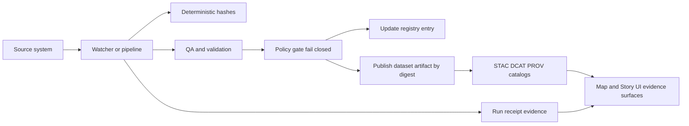

<!-- [KFM_META_BLOCK_V2]
doc_id: kfm://doc/0db3750f-25d3-4fb7-93c1-9b65e5e1b5b1
title: Dataset Registry Entries
type: standard
version: v1
status: draft
owners: TODO
created: 2026-02-24
updated: 2026-02-24
policy_label: public
related:
  - data/registry/datasets/README.md
  - data/catalog/stac/
  - data/catalog/dcat/
  - data/catalog/prov/
tags: [kfm, registry, datasets, governance]
notes:
  - This README defines what belongs in data/registry/datasets/entries.
  - Update TODOs once canonical schema and CI gates are wired in the repo.
[/KFM_META_BLOCK_V2] -->

# Dataset Registry Entries
**Purpose:** Canonical, reviewable *metadata* records for each dataset in KFM (identity, governance labels, evidence links, and publication pointers).


<!-- TODO: replace badges with repo-local / CI status badges once workflows exist -->

---

## Quick navigation
- [What this directory is](#what-this-directory-is)
- [Where it fits in the repo](#where-it-fits-in-the-repo)
- [Directory layout](#directory-layout)
- [Entry format](#entry-format)
- [Adding or updating an entry](#adding-or-updating-an-entry)
- [Validation and promotion gates](#validation-and-promotion-gates)
- [Security and sensitivity rules](#security-and-sensitivity-rules)
- [Appendix](#appendix)

---

## What this directory is

This folder contains **one “registry entry” per dataset**. An entry is the **governed source of truth for dataset identity + policy labels + evidence pointers** (receipts, STAC/DCAT/PROV records, QA outputs, and immutable artifact references).

> **NOTE**
> This directory is *metadata-only*. Raw/processed data files belong in lifecycle zones (Raw/Work/Processed/Published), not in the registry.

---

## Where it fits in the repo

Dataset entries act as the “switchboard” between:
- **Pipelines/watchers** (what ran, what changed, what evidence exists)
- **Catalogs** (STAC/DCAT/PROV cross-links)
- **Distribution** (immutable artifact references, ideally pinned by digest)
- **UI** (safe, read-only “trust surfaces” that explain *why* a dataset is trusted)

### Governance-by-construction loop (mental model)



**Invariants (non-negotiable):**
- If evidence/signatures/policy checks fail, **nothing is promoted**.  
- Receipts are first-class evidence artifacts.  
- Provenance travels with datasets (e.g., attachable referrers/attestations).  
- Catalog records (STAC/DCAT/PROV) must be created and cross-linked for promoted datasets.  

(Exact tooling + paths are repo-specific; keep this README aligned to your canonical contracts and gates.)

---

## Directory layout

> **Directory Documentation Standard**
> Include: purpose, where it fits, acceptable inputs, and exclusions.

**Proposed/expected layout (update to match actual repo):**
```text
data/registry/datasets/entries/
  README.md                      # this file
  <dataset_id>.yaml              # one entry per dataset (preferred for human edit)
  <dataset_id>.json              # (optional) if JSON is your canonical format
  templates/
    dataset_entry.template.yaml  # optional helper templates
  examples/
    valid/                       # optional fixtures used by CI
    invalid/
```

---

## Entry format

### File naming

- **One file per dataset**
- Filename should be stable and match `dataset_id`:
  - Recommended: `kebab` or `snake` style
  - Example: `kansas_soils_ssurgo.yaml`

### Minimal required fields (recommended baseline)

> **TIP**
> Prefer a schema-backed entry format (YAML or JSON) and validate it in CI. If you have `schemas/` in the repo, link the exact schema file(s) here.

```yaml
# data/registry/datasets/entries/<dataset_id>.yaml
dataset_id: kansas_soils_ssurgo          # stable ID (do not reuse)
title: "Kansas SSURGO Soils"
description: >
  Curated soils dataset used for ...
owners:
  - team: "TODO"
    contact: "TODO"

policy:
  policy_label: public                   # public | restricted | internal | etc.
  sensitivity: low                       # low | moderate | high | culturally_restricted | etc.
  pii: false
  license:
    spdx: "CC-BY-4.0"                    # or "unknown" -> must quarantine (no promotion)
    source_url: "TODO"

extents:
  temporal:
    start: "YYYY-MM-DD"
    end: "YYYY-MM-DD"
  spatial:
    bbox: [minx, miny, maxx, maxy]       # do NOT store precise sensitive locations
    crs: "EPSG:4326"

sources:
  - name: "USDA NRCS"
    type: api                            # api | file | oci | scrape | manual | etc.
    uri: "TODO"
    retrieved_at: "YYYY-MM-DD"

evidence:
  run_receipts:
    - ref: "TODO"                        # path/URL/OCI referrer to the receipt
  prov:
    - ref: "TODO"                        # PROV bundle reference
  qa_reports:
    - ref: "TODO"                        # QA output reference
  signatures:
    - ref: "TODO"                        # signature/attestation reference

catalogs:
  stac_collection: "data/catalog/stac/<dataset>/collection.json"
  dcat_record: "data/catalog/dcat/<dataset>.jsonld"
  prov_record: "data/catalog/prov/<dataset>.provn"

distribution:
  primary_artifact:
    artifact_type: "application/vnd.kfm.dataset.v1"   # TODO: define canonical types
    oci_ref: "ghcr.io/ORG/PATH@sha256:..."            # pin digest, not tag
    sha256: "..."                                     # optional if digest already present

lifecycle:
  zone: published                         # raw | work | processed | published
  updated_at: "YYYY-MM-DDTHH:MM:SSZ"
  deprecated: false
  supersedes: []                          # list of dataset_ids
```

### Allowed values and conventions

| Field | Convention | Why it matters |
|------|------------|----------------|
| `dataset_id` | stable, unique, never reused | prevents identity collisions |
| `policy.policy_label` | enum | drives access control + UI “trust” affordances |
| `license.spdx` | SPDX identifier or `unknown` | unknown licenses must not promote |
| `distribution.primary_artifact.oci_ref` | prefer `@sha256:` digests | immutability + reproducible resolution |
| `catalogs.*` | relative repo paths | enables traceability + review in PRs |

---

## Adding or updating an entry

### Add a new dataset entry
1. Copy a template (if present) or start a new `<dataset_id>.yaml`.
2. Fill **identity + policy + license + extents** first.
3. Add **evidence pointers** (receipts/QA/PROV) once produced.
4. Add/verify **catalog links** (STAC/DCAT/PROV).
5. Point `distribution.primary_artifact` at the immutable artifact reference (digest-pinned).

### Update an existing entry
- **Do not change** `dataset_id`.
- Update evidence pointers and catalog links for the new run.
- Record lifecycle changes (`zone`, `deprecated`, `supersedes`) explicitly.

> **WARNING**
> If sensitivity is unclear, default-deny: mark the entry restricted and require a governance review before publication.

---

## Validation and promotion gates

Registry entries should only “go green” when evidence exists and validations pass.

### Minimum gates (recommended)
- **Metadata validation**:
  - STAC validates
  - DCAT shape validates
  - PROV validates
  - license present and consistent
- **Data validation** (dataset-dependent):
  - schema conformity
  - geometry validity
  - null/uniqueness/domain rules
- **Promotion validation**:
  - checksums present
  - run logs/receipts exist
  - (when required) human approval

> **TIP**
> Keep gates fail-closed: if anything is missing or invalid, promotion must stop and the UI should render the dataset as explicitly untrusted.

### Example local checks (adapt to your repo tooling)
```bash
# Example: validate STAC and PROV artifacts
stac-validator data/catalog/stac/<dataset>/collection.json
provconvert -infile data/catalog/prov/<dataset>.provn -validator

# Example: policy checks (OPA/Conftest style)
conftest test data/registry/datasets/entries/<dataset_id>.yaml --policy policy/opa
```

---

## Security and sensitivity rules

**Never store:**
- secrets, tokens, credentials
- raw PII
- exact coordinates for sensitive/vulnerable/culturally restricted sites

**Do store:**
- policy label + sensitivity classification
- coarse extents where needed
- pointers to redacted/approved artifacts

---

## Appendix

### Entry lifecycle rules
- `deprecated: true` means the dataset should not be used for new work.
- `supersedes` lists prior dataset IDs replaced by this dataset.

### Glossary
- **Receipt**: per-run evidence artifact describing inputs/outputs/hashes/checks.
- **PROV**: provenance bundle showing lineage.
- **STAC/DCAT**: discovery/catalog metadata records.
- **Digest-pinned reference**: immutable pointer (e.g., `@sha256:`) rather than mutable tag.

<details>
<summary>Template (copy/paste)</summary>

```yaml
dataset_id: TODO
title: TODO
description: TODO
owners: []
policy:
  policy_label: TODO
  sensitivity: TODO
  pii: false
  license:
    spdx: TODO
    source_url: TODO
extents:
  temporal: { start: TODO, end: TODO }
  spatial: { bbox: [TODO, TODO, TODO, TODO], crs: "EPSG:4326" }
sources: []
evidence: { run_receipts: [], prov: [], qa_reports: [], signatures: [] }
catalogs: { stac_collection: TODO, dcat_record: TODO, prov_record: TODO }
distribution:
  primary_artifact: { artifact_type: TODO, oci_ref: TODO, sha256: TODO }
lifecycle: { zone: work, updated_at: TODO, deprecated: false, supersedes: [] }
```

</details>

---

<p align="right"><a href="#dataset-registry-entries">Back to top</a></p>
