# 🧾 Dataset Registry Examples


This folder contains **example dataset registry entries** used to document, test, and standardize how datasets are onboarded into the Kansas Frontier Matrix (KFM) governed pipeline.

> [!NOTE]
> These files are **examples + fixtures**. Production registry entries should live in `data/registry/datasets/` (one level up), not in `examples/`.

> [!IMPORTANT]
> **Never commit secrets** (API keys, cookies, tokens) in registry examples or production configs. Use a vault/secret reference pattern.

> [!WARNING]
> If a dataset contains **sensitive locations** (e.g., archaeological sites), examples must demonstrate **generalization + fail-closed policy** and (ideally) a split into **public vs restricted** derived products.

---

## 🗂️ Directory layout

> The exact filenames in `examples/` may vary; the shape below is the **recommended** structure for “valid vs invalid” fixtures.

```text
data/registry/datasets/
├─ <dataset-id>.{yaml|yml|json}         # production registry entries (governed)
└─ examples/
   ├─ README.md                         # (this file)
   ├─ valid/                            # example fixtures that SHOULD pass schema/policy checks
   │  ├─ public__vector_admin_boundaries.yaml
   │  ├─ public__raster_demo.yaml
   │  ├─ public__timeseries_demo.yaml
   │  ├─ public__documents_ocr_demo.yaml
   │  └─ sensitive_location__generalized.yaml
   └─ invalid/                          # example fixtures that SHOULD fail (CI regression)
      ├─ missing_license.yaml
      ├─ bad_policy_label.yaml
      └─ missing_provenance_fields.yaml
```

---

## 🧭 Where the registry fits in the KFM pipeline

The dataset registry is a **governed input** to automation: it describes the dataset, how it’s acquired, and what governance rules apply.

```mermaid
flowchart LR
  R["Dataset Registry Entry\n(data/registry/datasets/*.yaml)"] --> P["Pipelines / Watchers\n(src/pipelines/...)"]

  P --> RAW["Raw zone\n(data/raw/...)"]
  RAW --> WORK["Work zone\n(data/work/...)"]
  WORK --> PROC["Processed zone\n(data/processed/...)"]

  PROC --> CATS["Catalog boundary artifacts\nDCAT / STAC / PROV"]
  CATS --> GRAPH["Graph references catalogs\n(Neo4j)"]
  GRAPH --> API["Governed API\n(contracts + redaction)"]
  API --> UI["UI / Story / Focus\n(read-only evidence display)"]
```



---

## ✅ What every dataset registry entry should capture

Even if your exact schema differs, examples should cover the **minimum governance + automation needs** below.

| Area | Example fields / concepts | Why it exists | Typical gate |
|---|---|---|---|
| Identity | `dataset_id`, `upstream_id` | Stable internal ID + upstream traceability | Required for catalog linkage |
| Description | `title`, `summary`, `domain`, `tags/keywords` | Discovery + UX + indexing | Required for DCAT |
| Source manifest | `authoritative_urls`, `publisher`, `update_mechanism`, `retrieval_method` | Reproducibility and auditability | Required for promotion |
| License & rights | `license`, `terms`, `attribution` | Legal compliance and downstream constraints | **Fail closed** if missing/unclear |
| Sensitivity | `policy_label`, `restricted_fields`, `generalization_rules` | Prevent leakage / protect sites & people | **Fail closed** if policy missing |
| Acquisition plan | `schedule`, `incremental_cursor` or `snapshot+diff` | Deterministic + maintainable ingestion | Validated in CI |
| Auth strategy | `auth.type`, `auth.secret_ref` | No secrets committed; vault-only | Lint / policy gate |
| Rate limit | `rate_limit.strategy`, `backoff` | Respect upstream + avoid bans | Integration test |
| Output targets | `format_targets` | Standardized processed formats | Validator gate |
| Provenance anchors | `source_record_id` mapping, checksum strategy | Evidence citations + lineage integrity | PROV + checksum gate |
| Backfill plan | `backfill` notes | Expected runtime + scope | DoD checklist |

---

## 🏷️ Policy labels

Examples must demonstrate **policy intent** using consistent labels.

| `policy_label` | Use for | Typical handling |
|---|---|---|
| `public` | Open, low-risk datasets | Publish normally |
| `restricted` | PII risk / ownership / sensitive attributes | Redact or aggregate; role-based access |
| `sensitive-location` | Protected sites, fragile locations | Generalize coordinates; fail-closed; often split public vs restricted |

---

## 🔁 Versioning & provenance expectations

Examples should reflect these expectations:

- **Dataset versioning**: treat each ingest run as producing a **versioned output** (checksums + run metadata).
- **Catalog outputs**:
  - **DCAT**: always emitted for dataset discovery.
  - **STAC**: emitted for spatial assets (and optionally for consistency even when non-spatial).
  - **PROV**: emitted to link raw → work → processed and the agents/activities that produced them.
- **Stable record IDs**: `source_record_id` must be stable and suitable for evidence citations.

---

## 🧪 Minimum validation gates

Use this checklist when deciding whether an example belongs in `valid/` or `invalid/`.

- [ ] Row-level schema validation (required fields, type coercion rules documented)
- [ ] Geometry validity + bounds checks (if spatial)
- [ ] Temporal sanity (no impossible dates; no negative durations)
- [ ] License + attribution captured and policy-compatible
- [ ] Provenance completeness (PROV chain present; deterministic checksums present)

---

## 🧩 Example templates

> [!IMPORTANT]
> The YAML below is **illustrative** and intentionally “verbose” so it can teach the shape of a governed dataset onboarding entry.  
> Adapt field names to the authoritative schema used by this repo.

<details>
<summary><strong>Example: public dataset (vector)</strong> — <code>public__vector_admin_boundaries.yaml</code></summary>

```yaml
# yaml-language-server: $schema=../../schemas/dataset_registry.v1.schema.json

dataset_id: kfm.land.admin_boundaries_demo
upstream_id: "example:admin_boundaries"
title: "Administrative Boundaries (Demo)"
summary: "Example vector dataset used to exercise GeoJSON/GeoParquet outputs and catalog wiring."
domain: land
primary_data_type: vector

source_manifest:
  authoritative_urls:
    - "https://example.org/datasets/admin-boundaries"
  publisher: "Example Publisher"
  update_mechanism: "static download"
  retrieval_method: "https download"

rights:
  license: "Public domain"
  attribution: "Example Publisher (see source_manifest.authoritative_urls)"

governance:
  policy_label: public
  sensitivity: low
  restricted_fields: []
  notes: "No sensitive attributes expected."

connector:
  schedule: "static"
  incremental_cursor: null # static → no incremental cursor
  auth:
    type: none
  rate_limit:
    strategy: "respect-provider"
    backoff: "exponential"
  format_targets:
    - "geojson"
    - "geoparquet"

provenance:
  # Stable per upstream semantics; used in evidence citations.
  source_record_id:
    strategy: "field"
    field: "ADMIN_ID"
  checksums:
    algorithm: "sha256"
    scope: "raw_and_processed"

expected_catalogs:
  dcat: true
  stac: true
  prov: true

backfill:
  strategy: "single snapshot"
  notes: "Static dataset; one-time ingest."
```

</details>

<details>
<summary><strong>Example: restricted dataset (parcels / ownership risk)</strong> — <code>restricted__parcels_demo.yaml</code></summary>

```yaml
dataset_id: kfm.land.parcels_demo
upstream_id: "example:parcels"
title: "Parcels (Demo — Restricted)"
summary: "Example parcel dataset showing default-restricted treatment and a redaction plan."
domain: land
primary_data_type: vector

source_manifest:
  authoritative_urls:
    - "https://example.org/datasets/parcels"
  publisher: "Example County GIS"
  update_mechanism: "periodic download"
  retrieval_method: "https download"

rights:
  license: "Public records / county terms"
  attribution: "Example County GIS (see source_manifest.authoritative_urls)"

governance:
  policy_label: restricted
  sensitivity: high
  restricted_fields:
    - "OWNER_NAME"
    - "OWNER_ADDRESS"
    - "ASSESSED_VALUE"
  redaction_plan:
    - action: "drop_fields"
      fields: ["OWNER_NAME", "OWNER_ADDRESS"]
    - action: "bucket_numeric"
      field: "ASSESSED_VALUE"
      buckets: ["0-10k", "10k-50k", "50k-100k", "100k+"]
  access_notes: "Serve only via governed API; no direct file/UI exposure."

connector:
  schedule: "infrequent"
  incremental_cursor: "modified_date"
  auth:
    type: none
  rate_limit:
    strategy: "respect-provider"
    backoff: "exponential"
  format_targets:
    - "geoparquet" # prefer for large vectors

provenance:
  source_record_id:
    strategy: "field"
    field: "PARCEL_ID"
  checksums:
    algorithm: "sha256"
    scope: "raw_and_processed"

expected_catalogs:
  dcat: true
  stac: true
  prov: true

backfill:
  strategy: "bounded historical window"
  notes: "If history exists, backfill by year/county; document scope explicitly."
```

</details>

<details>
<summary><strong>Example: sensitive location dataset (generalize + split)</strong> — <code>sensitive_location__generalized.yaml</code></summary>

```yaml
dataset_id: kfm.heritage.sites_public_demo
upstream_id: "example:heritage_sites"
title: "Heritage Sites (Public Summary — Generalized)"
summary: "Public-facing site summaries with generalized coordinates; restricted details published separately."
domain: heritage
primary_data_type: vector

source_manifest:
  authoritative_urls:
    - "https://example.org/datasets/heritage-sites"
  publisher: "Example Heritage Office"
  update_mechanism: "ongoing"
  retrieval_method: "api"

rights:
  license: "Open with restrictions"
  attribution: "Example Heritage Office (see source_manifest.authoritative_urls)"

governance:
  policy_label: sensitive-location
  sensitivity: high
  location_handling:
    coordinate_policy: "generalize"
    generalization:
      method: "grid_snap"
      grid_size_meters: 1000
    fail_closed: true
  split_derivatives:
    public_dataset_id: "kfm.heritage.sites_public_demo"
    restricted_dataset_id: "kfm.heritage.sites_restricted_demo"

connector:
  schedule: "ongoing"
  incremental_cursor: "modified_date"
  auth:
    type: "vault_ref"
    secret_ref: "vault://kfm/sources/example-heritage-sites/api-token"
  rate_limit:
    strategy: "respect-provider"
    backoff: "exponential"
  format_targets:
    - "geoparquet"
    - "geojson"

provenance:
  source_record_id:
    strategy: "field"
    field: "SITE_ID"
  checksums:
    algorithm: "sha256"
    scope: "raw_and_processed"

expected_catalogs:
  dcat: true
  stac: true
  prov: true

backfill:
  strategy: "incremental by modified_date"
  notes: "Restricted dataset backfill requires governance approval."
```

</details>

---

## ✅ Definition of Done for adding a new dataset (copy into PR)

- [ ] Connector implemented and registered (registry + pipeline wiring)
- [ ] Raw acquisition produces deterministic manifest + checksums
- [ ] Normalization emits canonical schema and/or STAC assets
- [ ] Validation gates implemented and enforced in CI
- [ ] Policy labels defined; restricted fields/locations redacted per rules
- [ ] Catalogs emitted (DCAT always; STAC/PROV as applicable) and link-check clean
- [ ] API contract tests pass for at least one representative query
- [ ] Backfill strategy documented (historical ranges and expected runtime)

---

## 🧰 Suggested local validation workflow

> Adjust commands to match your repo tooling.

```bash
# 1) Validate registry entry shape (schema)
#   - e.g., jsonschema/yamale/ajv depending on your implementation

# 2) Run pipeline on a small slice (integration)
#   - assert stable checksums + record counts

# 3) Validate catalog artifacts (metadata)
#   - STAC validator
#   - PROV validator (tooling varies)

# 4) Enforce governance policy gate (fail-closed)
#   - conftest / OPA policies
```

---

## 🧯 Common pitfalls (examples should prevent these)

- **Missing/unclear license** → should fail promotion gates.
- **Sensitive coordinates in “public” outputs** → treat as policy failure.
- **Unstable record IDs** → breaks evidence citations and reproducibility.
- **Secrets committed** → immediate governance/security incident.
- **Catalogs emitted but not cross-linked** → breaks traceability across layers.

---