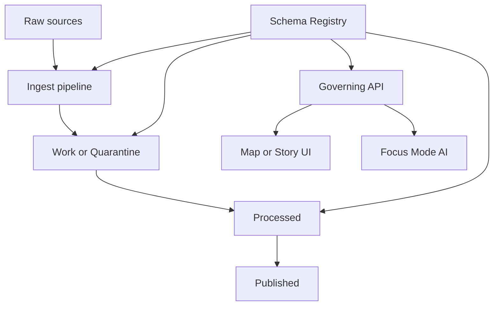

<!-- [KFM_META_BLOCK_V2]
doc_id: kfm://doc/7c9b0a5f-3dd4-4a34-9ee6-9b7d3d8c1f4d
title: Dataset Schema Registry
type: standard
version: v1
status: draft
owners: TBD
created: 2026-02-24
updated: 2026-02-24
policy_label: public
related:
  - ../README.md
  - ../../README.md
tags: [kfm, data, registry, schema]
notes:
  - Defines how dataset schemas are stored and maintained in-repo.
  - This document is intentionally format-agnostic; pick schema formats per dataset needs.
[/KFM_META_BLOCK_V2] -->

# Dataset Schema Registry
**Purpose:** Store and govern dataset *schemas* (structure, types, constraints) used for validation, publishing, and API contracts.

[](#)
[](#)
[](#) <!-- TODO: replace with real workflow badge -->
[](#)

---

## Quick links
- [What belongs here](#what-belongs-here)
- [Directory layout](#directory-layout)
- [Schema contract](#schema-contract)
- [Naming and versioning](#naming-and-versioning)
- [Schema evolution rules](#schema-evolution-rules)
- [Validation and CI gates](#validation-and-ci-gates)
- [Security and governance](#security-and-governance)
- [FAQ](#faq)

---

## Where this fits in the repo
This folder is the **schema layer** of the dataset registry:

- `data/registry/datasets/` → dataset *identity + metadata* (what it is)
- `data/registry/datasets/schemas/` → dataset *structure contracts* (how it’s shaped)

> NOTE  
> A schema is not the dataset itself. It is the contract we use to validate, transform, and expose the dataset through governed interfaces.

---

## What belongs here
✅ **Acceptable inputs**
- Schema definitions for datasets registered under `data/registry/datasets/`
- Schema metadata: owners, version, compatibility notes, constraints
- Validation artifacts (when lightweight): e.g., a small set of **non-sensitive** schema test vectors
- Documentation that explains how to interpret and validate the schema

🚫 **Exclusions**
- No raw data, sample extracts, or “handy copies” of datasets
- No secrets (API keys, tokens), private coordinates, or sensitive attributes
- No large generated artifacts (put generated outputs in the appropriate lifecycle zone, not the registry)
- No undocumented “one-off” schemas that aren’t linked to a dataset registry entry

---

## Directory layout

> TIP  
> Keep each dataset’s schemas isolated in its own folder and versioned. This makes audits and rollbacks cheap.

Recommended structure (example):

```text
data/registry/datasets/schemas/
  README.md
  _templates/
    schema.contract.yml
    jsonschema.table.schema.json
  <dataset_id>/
    README.md
    v1/
      schema.meta.yml
      table.schema.json
      geospatial.schema.yml
      checks/
        expectations.yml
    v2/
      schema.meta.yml
      table.schema.json
```

### Minimal required files (per dataset schema version)
- `schema.meta.yml` — human + machine-readable metadata about the schema
- One or more schema files (format depends on dataset): e.g. `table.schema.json`, `geospatial.schema.yml`
- Optional: `checks/` validation rules (if your pipeline uses a checks framework)

---

## Schema contract
This repo supports **multiple schema formats** (choose the one that matches your dataset + tooling). At minimum, every schema version must clearly specify:

- dataset identity (`dataset_id`)
- schema identity (`schema_id`)
- schema version (`v#` or semver)
- field definitions (names, types)
- constraints (nullability, enums, ranges, uniqueness)
- geospatial constraints when applicable (CRS, geometry type, axis order, bounds policy)

### `schema.meta.yml` (recommended) — example
```yaml
# schema.meta.yml
dataset_id: example_dataset
schema_id: example_dataset.table
schema_version: v1
status: draft            # draft|review|published
owners:
  - team: TBD            # TODO: replace with real owning team/person
source_registry_ref: ../data/registry/datasets/example_dataset.yml  # TODO: adjust to real path
compatibility:
  policy: backward-compatible   # backward-compatible|breaking|additive-only
  notes: >
    v1 introduces base columns. v2 adds optional columns and tightens constraints.
constraints:
  primary_key:
    - id
  pii: false             # mark true if schema includes any PII fields (then governance review required)
geospatial:
  enabled: true
  geometry_column: geom
  geometry_type: MultiPolygon
  crs: EPSG:4326
```

### Field definition guidance (tabular)
For tabular schemas, prefer explicit, stable typing:

| Category | Examples | Notes |
|---|---|---|
| Identifiers | `id`, `dataset_id`, `feature_id` | stable, unique when possible |
| Time | `observed_at`, `effective_date` | specify timezone expectations |
| Measures | `value`, `count`, `rate` | define units + allowed ranges |
| Geometry | `geom`, `lat`, `lon` | define CRS + precision policy |

---

## Naming and versioning

### Dataset IDs
**Rule:** `dataset_id` should be stable, lowercase, and filesystem-safe.

Recommended pattern:
- `lower_snake_case`
- no spaces
- avoid “temp”, “final”, “new”, “latest”

Examples:
- ✅ `county_boundaries`
- ✅ `road_segments_2024`
- ❌ `County Boundaries`
- ❌ `roads-final-final2`

### Schema IDs
Use a stable namespace style:
- `<dataset_id>.<scope>` (e.g., `county_boundaries.table`)
- or `<dataset_id>.<entity>` if the dataset has multiple entities

### Versioning scheme
Pick **one** per dataset and stick to it:
- `v1/`, `v2/` directory versions (simple, repo-friendly)
- OR semantic versions `1.0.0/`, `1.1.0/` if you need richer evolution modeling

---

## Schema evolution rules
Schemas are contracts. Treat changes as governed events.

### Backward-compatible (preferred)
- Add a **nullable** column
- Add a new optional enum value (if consumers can handle)
- Widen a numeric range (if it doesn’t break validation assumptions)
- Add a new file/representation while keeping the old one

### Breaking changes (require explicit version bump + comms)
- Rename/remove columns
- Change column type (e.g., `int → string`)
- Tighten constraints that may invalidate previously “valid” records
- Change geometry type or CRS (unless you publish as a new view/version)

> WARNING  
> If downstream APIs/UI or published datasets depend on a schema, a breaking change must be coordinated through the promotion gates and release process.

---

## Validation and CI gates

### What validation should do
At minimum, validation should:
1. Verify schema files are syntactically valid (JSON/YAML)
2. Verify referenced dataset registry entries exist
3. Verify schema metadata is complete (owners, version, constraints)
4. (When applicable) Validate sample fixtures against schema

### Recommended gate checklist
- [ ] Schema added under `schemas/<dataset_id>/<version>/`
- [ ] `schema.meta.yml` present and complete
- [ ] Schema file(s) present and parseable
- [ ] Compatibility policy declared
- [ ] Dataset registry entry references this schema version (or vice versa)
- [ ] Tests/fixtures updated (if used)
- [ ] Sensitive fields reviewed (PII / location sensitivity / community constraints)

### Proposed CI hooks (repo-dependent)
```bash
# TODO: wire to real tooling in this repo
make schemas-lint
make schemas-validate
make schemas-test
```

---

## Security and governance
This folder is part of the **trust membrane**.

### Default-deny principles
- If sensitivity is unclear: **do not** publish precise fields/constraints that enable harm.
- If community/Indigenous constraints exist: treat as **restricted** unless explicitly approved.

### Redaction-friendly schemas
If you need both internal and public views:
- Keep a “full” internal schema version
- Publish a “public” schema view as a separate schema_id (or separate version folder)
- Document the redaction rules in `schema.meta.yml`

---

## Architecture overview



**Intent:** pipelines and governed APIs reference schemas as the source-of-truth contracts for validation and exposure.

---

## FAQ

### Why keep schemas in-repo?
- Auditable history (diffs, code review, rollbacks)
- Coupled governance (schemas change with policy + pipelines)
- Enables “trace every claim to evidence + decisions” workflows

### Can one dataset have multiple schemas?
Yes. Common cases:
- `table` vs `geo` vs `api_view`
- Different consumer views (internal, public, partner)
- Separate entity schemas (e.g., `roads.segment`, `roads.node`)

### Where do big generated artifacts go?
Not here. This folder should remain small and reviewable. Put generated outputs in the appropriate lifecycle zone and link back to the schema + provenance.

---

## TODOs to confirm in this repo
- [ ] What schema formats are officially supported (JSON Schema, Avro, Parquet metadata, etc.)?
- [ ] Where is the canonical dataset registry entry format documented?
- [ ] Which validation tooling is the standard (Great Expectations, Pandera, custom)?
- [ ] What CI job names and commands should badges + examples reference?

