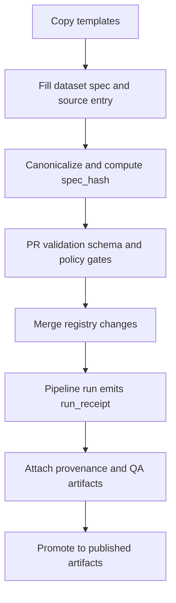

<!-- [KFM_META_BLOCK_V2]
doc_id: kfm://doc/2f6b5f8a-37ea-4c2f-9ab0-7f9a989a12b1
title: Dataset Registry Templates
type: standard
version: v1
status: draft
owners: TBD
created: 2026-02-24
updated: 2026-02-24
policy_label: public
related:
  - data/registry/datasets/README.md
  - schemas/
  - policy/
tags: [kfm, data-registry, datasets, templates]
notes:
  - Templates in this directory are copied into dataset registry entries; keep them stable and canonical.
  - Avoid embedding secrets or environment-specific values in templates.
[/KFM_META_BLOCK_V2] -->

# Dataset Registry Templates

Canonical templates for **dataset onboarding + dataset registry entries** (specs, source registry entries, and playbooks).


**Where this fits:** `data/registry/datasets/templates/` is the *template library* for the dataset registry.

- Templates here are **starting points**.
- Filled-in specs/entries belong in the **dataset registry proper** (usually one directory up).

---

## Navigation

- [What this folder is](#what-this-folder-is)
- [Directory contract](#directory-contract)
- [Template index](#template-index)
- [How templates flow into promotion](#how-templates-flow-into-promotion)
- [How to use these templates](#how-to-use-these-templates)
- [Conventions](#conventions)
- [Adding or changing templates](#adding-or-changing-templates)

---

## What this folder is

This directory exists to make dataset onboarding **repeatable** and **auditable**:

- A dataset’s onboarding spec is a canonical input into a deterministic identifier (`spec_hash`) used in run receipts and governance gates.
- Source onboarding requires a consistent **Source Registry Entry** and a per-source **Integration Playbook**.

> **NOTE**
> Treat templates as part of the system’s *trust membrane*: changing a template changes how humans generate governed inputs.

---

## Directory contract

### Acceptable inputs

This folder may contain:

- Blank templates (JSON/MD) for:
  - dataset onboarding/spec files
  - source registry entries
  - integration playbooks
  - dataset README or “consumer notes”
- Short checklists used during onboarding PRs
- Example “golden” filled-in docs **only if** they are clearly marked as examples and contain no sensitive data

### Exclusions

This folder must **not** contain:

- Real, active dataset registry entries (place those under `data/registry/datasets/...`)
- Secrets, API keys, tokens, credentials, or account-only download links
- Raw/work/processed artifacts (those belong in the data zones, not the registry)
- Generated run receipts, provenance bundles, or signatures (those are pipeline outputs)

---

## Template index

> **TIP**
> If some template files listed below do not exist yet, treat this table as the **target inventory** for this directory.

| Template (proposed filename) | Purpose | Required for onboarding? | Consumed by |
|---|---|---:|---|
| `dataset_onboarding_spec.v1.template.json` | Canonical dataset onboarding spec (input to `spec_hash`) | ✅ | CI schema/policy checks; run receipts |
| `source_registry_entry.v1.template.md` | Per-source provenance + license + access details (human-friendly template) | ✅ | Steward review; promotion gates inputs |
| `integration_playbook.v1.template.md` | “How we fetch/transform/validate/package” for a source | ✅ | Pipeline authors; review gate |
| `dataset_readme.v1.template.md` | Consumer-facing dataset notes (scope, caveats, examples) | ◻︎ | UI/Docs; evidence surfaces |

---

## How templates flow into promotion



**Key idea:** templates are upstream of deterministic IDs, receipts, and fail-closed gates.

---

## How to use these templates

### 1) Choose a dataset slug

Use a stable, human-readable slug that won’t change every time the source updates.

**Convention (recommended):**

- lowercase
- underscores or hyphens only
- include upstream authority/name when helpful
- avoid embedding a date in the slug

Examples:

- `usgs_nwis_gauges`
- `noaa_storm_events`
- `kansas_counties_admin`

### 2) Create the dataset onboarding spec

Copy `dataset_onboarding_spec.v1.template.json` into the dataset’s registry location (repo conventions vary; keep it near the dataset entry).

<details>
<summary>Minimal skeleton (illustrative)</summary>

```json
{
  "kfm_spec_version": "v1",
  "dataset_slug": "<dataset_slug>",
  "title": "<Human title>",
  "upstream": {
    "source_id": "<stable_source_id>",
    "authority": "<publisher/authority>",
    "license_terms_snapshot": {
      "retrieved_at": "<YYYY-MM-DD>",
      "license_name": "<string>",
      "license_url": "<url>",
      "notes": "<what we rely on>"
    }
  },
  "sensitivity": {
    "policy_label": "public",
    "notes": "<why this label is correct>"
  },
  "processing": {
    "determinism": {
      "tool_versions_pinned": true,
      "canonical_json": true,
      "stable_sorting": true
    }
  },
  "outputs": {
    "primary_artifact_type": "<e.g. geoparquet|pmtiles|cog|zarr>",
    "catalog_sidecars": ["stac", "prov"],
    "zones": ["raw", "work", "processed", "catalog"]
  }
}
```

</details>

> **WARNING**
> If a spec file is used as an input into hashing (`spec_hash`), keep it **strict JSON** (no comments) and keep field ordering/canonicalization rules consistent.

### 3) Create a Source Registry Entry

Copy `source_registry_entry.v1.template.md` and fill in the source’s:

- authority
- access method + cadence
- license/rights snapshot
- intended sensitivity/policy label
- known limitations and QA notes

### 4) Create an Integration Playbook

Copy `integration_playbook.v1.template.md` and describe:

- how to fetch the source
- transform/normalize steps
- validation steps
- packaging targets (STAC/PROV sidecars, deterministic output settings)
- promotion gates and “what blocks merge/publish”

---

## Conventions

### Controlled vocabulary

Use controlled vocabulary values when possible, especially for:

- `policy_label`
- artifact zones (`raw`, `work`, `processed`, `catalog`, `published`)

### Sensitivity and default-deny

If you are unsure whether a dataset contains sensitive locations or could increase harm if published precisely:

- choose a more restrictive `policy_label` (e.g., `restricted_sensitive_location`)
- document the rationale
- require a governance review before promotion

### Data zones

Pipeline outputs and catalogs should land in the canonical lifecycle zones:

- `data/raw/<dataset_slug>/...`
- `data/work/<dataset_slug>/...`
- `data/processed/<dataset_slug>/<dataset_version_id>/...`
- `data/catalog/<dataset_slug>/<dataset_version_id>/...` (DCAT/STAC/PROV/receipts)

---

## Adding or changing templates

Templates are governed artifacts because they influence:

- what metadata exists
- what gets validated
- what reviewers can verify

**Definition of Done for a template change:**

- [ ] Template is versioned (or change is backwards compatible)
- [ ] Any referenced schema/policy links are updated
- [ ] A short rationale is recorded (ADR or CHANGELOG entry)
- [ ] No secrets or environment-specific values were introduced

> **TIP**
> Prefer additive changes: add a `v2` template rather than mutating `v1` in place.

---

### Back to top

[Back to top](#dataset-registry-templates)
