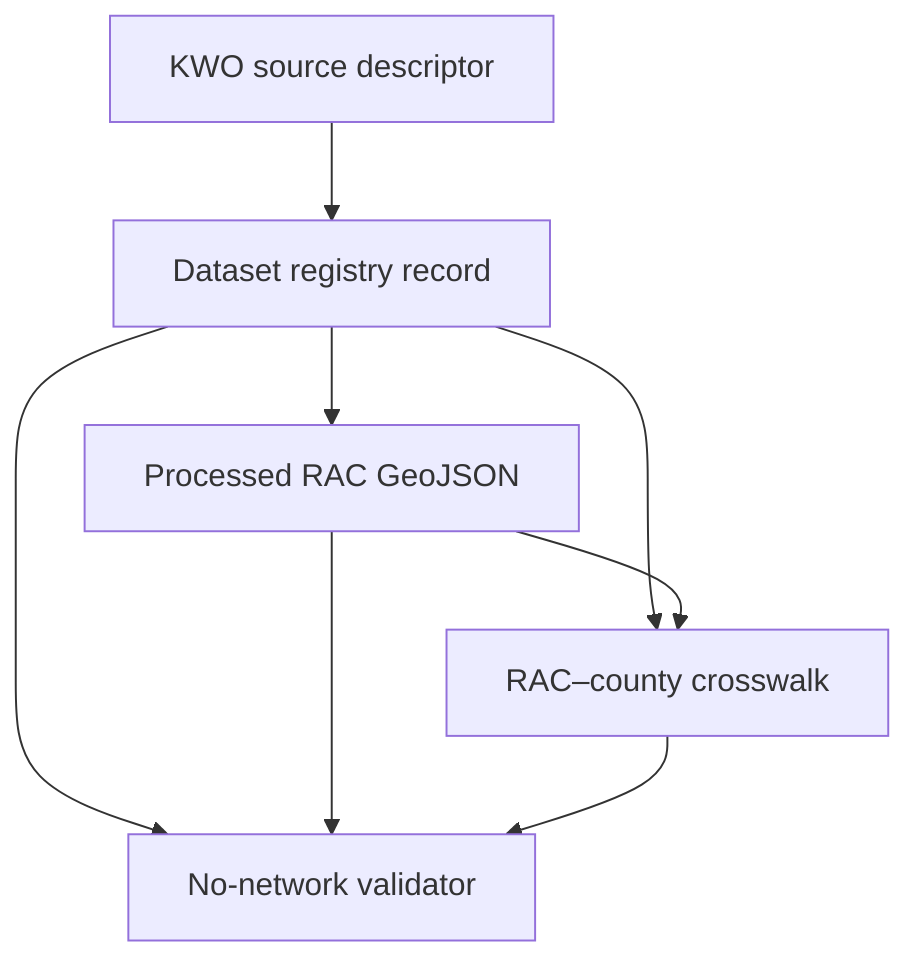

<a id="top"></a>

# Water-planning dataset registry

[](https://github.com/bartytime4life/Kansas-Frontier-Matrix/actions/workflows/briefing-integration.yml)
[](#concrete-inventory)
[](#rights-sensitivity-and-release)
[](#rights-sensitivity-and-release)

**Purpose.** This canonical registry child holds machine-readable identity and state for the pinned Kansas Water Office Regional Advisory Committee (RAC) geometry dataset; payload bytes remain in the governed `PROCESSED` lane.

> [!IMPORTANT]
> `record_status: current` identifies the current internal registry pointer for this observed source version. It does **not** admit a source, prove a claim, clear rights, release the geometry, or make this lane a public-serving surface. `release_status: not-released` remains an independent fail-closed gate.

## Quick navigation

- [Scope and placement](#scope-and-placement)
- [Status and authority](#status-and-authority)
- [Concrete inventory](#concrete-inventory)
- [Identity and claim boundaries](#identity-and-claim-boundaries)
- [Inputs and outputs](#inputs-and-outputs)
- [Lifecycle and relationships](#lifecycle-and-relationships)
- [Validation](#validation)
- [Rights, sensitivity, and release](#rights-sensitivity-and-release)
- [Maintenance, correction, and rollback](#maintenance-correction-and-rollback)
- [Open verification items](#open-verification-items)
- [Related authority](#related-authority)

## Scope and placement

| Field | Current posture |
|---|---|
| Path | `data/registry/datasets/water_planning/` |
| Inherited parent | [`data/registry/datasets/`](../README.md) |
| Owning responsibility root | `data/` — accountability and identity state |
| Registry family | `datasets` |
| Scope ID | `water_planning` |
| README profile | `BOUNDARY_COMPACT` |
| Exposure | Repository-visible internal registry metadata; no ordinary public-client path or KFM publication authority |
| Mutation and retention | Versioned, reviewed registry changes; no active connector, publisher, or independent payload writer |
| Review route | [`.github/CODEOWNERS`](../../../../.github/CODEOWNERS) routes `/data/registry/` to `@bartytime4life`; this is routing, not proof of independent review |
| Local steward | **NEEDS VERIFICATION** |

This is subtype-first placement under `data/registry/datasets/`, not a parallel `data/registry/<domain>/datasets/` authority. The accepted [Directory Rules](../../../../docs/doctrine/directory-rules.md) classify `registry/` as the stable identity lane, require subtype-first registry placement, and apply the compact boundary profile (`DIR-DATA-001` through `DIR-DATA-005`, `DIR-SOURCE-004`, and `DIR-README-001` through `DIR-README-005`). [ADR-0029](../../../../docs/adr/ADR-0029-adopt-directory-governance-standard-v2.md) adopts those exact rules.

### What belongs here

- Versioned water-planning dataset registry records with stable dataset and dataset-version identities.
- Source, payload, authority, rights, sensitivity, correction, supersession, and crosswalk references required by the governing contract and schema.
- Registry-local boundary documentation and navigation.

### What does not belong here

- Retrieved source responses or normalized geometry payloads.
- Source descriptors, crosswalk records, contracts, schemas, validators, tests, policy decisions, receipts, proofs, release decisions, or published carriers.
- Credentials, private-source material, exact restricted locations, or unrelated water-planning records.
- Direct API, map, search, graph, export, AI, release, deployment, or publication behavior.

## Status and authority

The values below describe the one checked-in record. They are not universal defaults for every KFM dataset registry.

| Surface | Current value | Consequence |
|---|---|---|
| `record_type` | `water-planning-rac-geometry-dataset` | Identifies the bounded RAC geometry registry shape. |
| `schema_version` | `1.0.0` | Selects the paired proposed machine schema. |
| `record_status` | `current` | Current internal pointer for the observed source version. |
| `correction_status` | `current`; `supersedes_ref: null` | No successor or correction is asserted by this record. |
| `release_status` | `not-released` | Public release and KFM publication remain denied. |
| `rights_status` | `source-statement-recorded-review-pending` | A source statement is recorded; KFM rights review is incomplete. |
| `sensitivity_status` | `public-administrative-boundary` | The geometry is classified as an administrative boundary; this does not clear rights or release. |
| `authority_kind` | `regional-planning-area-boundary` | Authority is bounded to the recorded planning-area geometry. |
| Source role | `official-administrative-planning-boundary` | The Kansas Water Office source supports the recorded RAC boundary geometry, not unrelated governance or project claims. |
| Contract and schema posture | `PROPOSED`, source-grounded, not released | Their repository bytes and validation relationships exist; neither file promotes the record or payload. |

## Concrete inventory

| Record | Stable identity | Payload reference | State |
|---|---|---|---|
| [`kwo_rac_regions_2026-06-24.json`](./kwo_rac_regions_2026-06-24.json) | `kfm:dataset-version:water-planning:kwo-rac-regions:2026-06-24` | [`kwo_rac_regions_2026-06-24.geojson`](../../../processed/water_planning/rac_regions/kwo_rac_regions_2026-06-24.geojson) | `current`; `not-released` |

<details>
<summary><strong>Pinned record identity and lineage</strong></summary>

| Field | Value |
|---|---|
| Dataset family ID | `kfm:dataset:water-planning:kwo-rac-regions` |
| Dataset version ID | `kfm:dataset-version:water-planning:kwo-rac-regions:2026-06-24` |
| Identity authority | `kwo:rac:regional-advisory-committees` |
| Geometry authority | `kwo:geometry:regional-planning-areas:cd87ef7a0bb34cc4a7f57e662d73ec0f:0` |
| Region identities | `kwo-rac-01` through `kwo-rac-14`, in order |
| Crosswalk reference | `kfm:crosswalk:water-planning:kwo-rac-to-county:2026-06-24:tiger-2025` |
| Correction state | `current` |
| Supersedes | `null` |

</details>

<details>
<summary><strong>Pinned payload and source observation</strong></summary>

| Field | Value |
|---|---|
| Media type | `application/geo+json` |
| Coordinate reference system | `OGC:CRS84` |
| Feature count | `14` |
| Byte count | `9,995,739` |
| Payload SHA-256 | `545b18b1b49a68c6359fefb80f8e8b80f885a94381dc87e0ef942eb8829cb738` |
| Source response SHA-256 | `872b53126963b9f580dc07f53b89b307678c37ee09af2c51dec5600afddd245a` |
| Source modified at | `2026-06-24T15:17:37Z` |
| Source observed at | `2026-07-30T17:50:58Z` |
| Source descriptor | [`kwo_rac_feature_service.source.json`](../../sources/water_planning/kwo_rac_feature_service.source.json) |

</details>

The record pins one normalized GeoJSON `FeatureCollection` containing exactly 14 `Polygon` or `MultiPolygon` features. The contract requires source coordinates to remain unsimplified, features to be ordered by stable RAC identity, and properties to remain a bounded projection of KFM identity plus source feature ID, name, and abbreviation.

## Identity and claim boundaries

| This lane owns | This lane must not own or imply |
|---|---|
| Stable dataset-family and dataset-version identity | Source admission, source freshness, or recurring retrieval authority |
| Current record, correction, supersession, and release pointers | Canonical geometry bytes or an independent geometry writer |
| Source descriptor, processed payload, and crosswalk references | An official county-membership, funding, jurisdiction, project-location, or governance claim |
| Payload path, media type, CRS, feature count, byte count, and digest | Contract meaning, schema authority, policy decisions, EvidenceBundle closure, receipts, or proofs |
| Rights and sensitivity status fields | Rights clearance, sensitivity approval for every downstream use, or public-release eligibility |
| A resolvable internal governance handle | Direct public API, UI, map, search, graph, export, or AI access |

The registry record identifies and constrains a dataset version. It does not turn geometry, a source statement, schema validity, a validator pass, a commit, a pull request, or a merge into authoritative public truth or KFM publication.

## Inputs and outputs

| Role | Governed artifact | Boundary |
|---|---|---|
| Source identity | [KWO RAC `SourceDescriptor`](../../sources/water_planning/kwo_rac_feature_service.source.json) | `proposed`, `needs_review`, connector `disabled`, and `not_released` |
| Semantic meaning | [RAC geometry registry contract](../../../../contracts/domains/water_planning/rac_geometry_registry.md) | Source-grounded `PROPOSED` contract; does not release the record |
| Machine shape | [RAC dataset registry schema](../../../../schemas/contracts/v1/domains/water_planning/rac_geometry_dataset_registry.schema.json) | Proposed JSON Schema; shape is not policy or proof |
| Registry output | [`kwo_rac_regions_2026-06-24.json`](./kwo_rac_regions_2026-06-24.json) | Stable dataset identity, version, state, lineage, and governed references |
| Processed payload | [RAC geometry GeoJSON](../../../processed/water_planning/rac_regions/kwo_rac_regions_2026-06-24.geojson) | Normalized internal bytes in `PROCESSED`; not released |
| Derived relationship | [RAC–county crosswalk record](../../crosswalks/water_planning/kwo_rac_counties_2026-06-24__tiger2025.json) | Geometry-derived mapping state; not an official membership list |

## Lifecycle and relationships



This is a checked-in reference graph, not an active ingest, derivation, promotion, or publication pipeline. The dataset record points to and digest-pins the processed geometry; the crosswalk refers back to the dataset version; the validator reads those records with their source descriptors and checked-in payload.

The registry is adjacent to the KFM lifecycle as an accountability and identity store:

```text
source observation
  -> dataset registry identity and state
  -> PROCESSED geometry reference
  -> validation and evidence support
  -> policy, review, and release decision
  -> release-approved public-safe carrier
```

Registry presence cannot skip validation, evidence, policy, review, release, correction, or rollback gates.

## Validation

Run the deterministic registry validator from the repository root:

```bash
python tools/validators/domains/water_planning/validate_rac_registry.py
```

Expected success output for the pinned checked-in slice:

```text
RAC_REGISTRY_OK regions=14 counties=105 mappings=209
```

Run the focused no-network regression module:

```bash
python -m unittest discover \
  --start-directory tests/domains/water_planning \
  --pattern 'test_rac_registry.py' \
  --verbose
```

| Validation layer | Confirmed behavior | Authority limit |
|---|---|---|
| [JSON Schema](../../../../schemas/contracts/v1/domains/water_planning/rac_geometry_dataset_registry.schema.json) | Constrains the record type, identities, source, payload, region IDs, crosswalk reference, rights, sensitivity, release, correction, and supersession fields | Machine shape does not prove semantics, admissibility, or release |
| [No-network validator](../../../../tools/validators/domains/water_planning/validate_rac_registry.py) | Checks the pinned record, geometry bytes, source descriptors, crosswalk, digests, ordering, identities, correction state, and `not-released` posture | Does not refetch a source, reconstruct the payload, independently recompute intersections, clear rights, or publish |
| [Regression tests](../../../../tests/domains/water_planning/test_rac_registry.py) | Exercise canonical success plus geometry-digest, mapping-order, identity, overlap-class, duplicate-key, release-overclaim, connector, and public-release failures while blocking network access | Passing tests remain bounded to checked-in fixtures and records |
| [`briefing-integration`](../../../../.github/workflows/briefing-integration.yml) | Triggers for this lane, declares `contents: read`, runs the water-planning test suite and registry validator, and records a bounded summary | A green workflow is not source freshness, rights clearance, evidence closure, release, deployment, or publication |

The validator returns exit `0` on success and exit `1` when finite findings exist; invalid CLI syntax may return exit `2`. Automation should use the selected validator's documented exit code and stdout, not reinterpret a nonzero result as a warning.

> [!NOTE]
> Validation is intentionally non-vacuous and fail-closed within its encoded scope. It confirms the pinned repository relationships; it does not re-observe the mutable upstream source or create release authority.

## Rights, sensitivity, and release

- The source metadata records a provider statement that there are no special restrictions on the content.
- The dataset record nevertheless keeps `rights_status: source-statement-recorded-review-pending`.
- The paired source descriptor remains `rights_status: noassertion`, `review_state: needs_review`, connector `disabled`, and public release denied.
- `sensitivity_status: public-administrative-boundary` describes the recorded geometry class. It does not override rights, evidence, policy, review, or release gates.
- `release_status: not-released` is enforced independently from `record_status: current`.

Until independent rights and domain review, evidence support, policy checks, and a release decision close, downstream public-serving use remains denied. Any public-safe projection must retain source attribution, temporal version, correction lineage, and rollback support.

## Maintenance, correction, and rollback

- Preserve the dataset family ID. Create a new dataset-version identity for a new source observation or changed payload unless a reviewed correction contract requires another disposition.
- Keep the record, processed payload path, byte count, digest, feature identities, source descriptor, and crosswalk references coherent as one review unit.
- Do not edit a digest or state merely to make validation pass. Re-observe or re-derive the owning artifact, preserve the prior version and digest, and update lineage explicitly.
- A `corrected` or `superseded` record must identify its predecessor through `supersedes_ref`; a `current` record keeps that field `null`.
- Re-run the focused validator and water-planning regression suite after any record, payload, source, crosswalk, contract, schema, or validation-baseline change.
- Re-review this README when inventory, authority, source version, rights, sensitivity, exposure, correction, validation, CODEOWNERS routing, or release posture changes.
- Before merge, rollback is closing the draft pull request and leaving its scoped branch unmerged.
- After merge, revert the documentation commit and rerun the same Markdown and link checks. Reverting this README must not mutate the registry record, payload, source descriptor, or correction history.

## Open verification items

| Item | Status | Evidence needed |
|---|---|---|
| Current upstream freshness | **NEEDS VERIFICATION** | A new bounded source-head observation and digest comparison |
| KFM rights clearance | **NEEDS VERIFICATION** | Independent review of provider terms, intended use, attribution, and redistribution |
| Independent water-planning registry stewardship | **NEEDS VERIFICATION** | Accepted stewardship assignment beyond repository-wide CODEOWNERS routing |
| Reproducible source refresh and normalization | **NEEDS VERIFICATION** | Receipted replay against a pinned source response with digest and feature-identity parity |
| Public-release eligibility | **NEEDS VERIFICATION** | Evidence, policy, review, release, correction, and rollback closure |

Until these items close, the appropriate posture remains internal, review-gated, and `not-released`.

## Related authority

| Surface | Role |
|---|---|
| [`data/registry/datasets/`](../README.md) | Parent dataset-registry authority and anti-collapse boundary |
| [Concrete dataset record](./kwo_rac_regions_2026-06-24.json) | Machine-readable dataset identity and state |
| [Water-planning source registry](../../sources/water_planning/README.md) | Source identities, source heads, rights posture, and disabled connector state |
| [Processed water-planning lane](../../../processed/water_planning/README.md) | `PROCESSED` lifecycle boundary |
| [Processed RAC geometry lane](../../../processed/water_planning/rac_regions/README.md) | Pinned normalized geometry family |
| [Water-planning crosswalk registry](../../crosswalks/water_planning/README.md) | Derived RAC–county mapping state and geometry-only semantics |
| [RAC geometry registry contract](../../../../contracts/domains/water_planning/rac_geometry_registry.md) | Semantic meaning and source/correction boundary |
| [RAC dataset registry schema](../../../../schemas/contracts/v1/domains/water_planning/rac_geometry_dataset_registry.schema.json) | Machine shape and field constraints |
| [Water-planning validator documentation](../../../../tools/validators/domains/water_planning/README.md) | CLI, finite outcomes, limitations, and maintenance |
| [RAC registry tests](../../../../tests/domains/water_planning/test_rac_registry.py) | No-network positive and negative regression coverage |
| [`briefing-integration.yml`](../../../../.github/workflows/briefing-integration.yml) | Read-only pull-request and `main` validation |
| [`policy/`](../../../../policy/README.md) | Admissibility, rights, sensitivity, and release-policy authority |
| [`release/`](../../../../release/README.md) | Release decisions, corrections, withdrawals, and rollback authority |
| [Directory Rules](../../../../docs/doctrine/directory-rules.md) | Canonical placement and README authority |
| [ADR-0029](../../../../docs/adr/ADR-0029-adopt-directory-governance-standard-v2.md) | Adoption record for Directory Rules v2 |
| [`.github/CODEOWNERS`](../../../../.github/CODEOWNERS) | GitHub review routing only |

[Back to top](#top)
