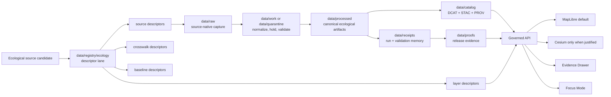

<!-- [KFM_META_BLOCK_V2]
doc_id: kfm://doc/<NEEDS_VERIFICATION_UUID>
title: data/registry/ecology
type: standard
version: v1
status: draft
owners: @bartytime4life
created: <NEEDS_VERIFICATION_CREATED_DATE>
updated: 2026-04-24
policy_label: <NEEDS_VERIFICATION_POLICY_LABEL>
related: [
  ../README.md,
  ../../README.md,
  ../../raw/README.md,
  ../../work/README.md,
  ../../quarantine/README.md,
  ../../processed/README.md,
  ../../catalog/README.md,
  ../../catalog/dcat/README.md,
  ../../catalog/stac/README.md,
  ../../catalog/prov/README.md,
  ../../receipts/README.md,
  ../../proofs/README.md,
  ../../../contracts/README.md,
  ../../../schemas/README.md,
  ../../../policy/README.md,
  ../../../tests/README.md,
  ../../../tools/validators/README.md,
  ../../../.github/CODEOWNERS
]
tags: [kfm, data, registry, ecology, flora, fauna, habitat, soil, air, vegetation, landcover, hydrology, map-rendering]
notes: [
  "Target path is proposed as data/registry/ecology/README.md and needs active-branch verification.",
  "This README defines a governed registry boundary for ecological source descriptors, crosswalk descriptors, baseline descriptors, and map-layer descriptors.",
  "This README does not claim checked-in dataset payloads, machine schemas, executable validators, source connectors, catalog records, proofs, or runtime routes.",
  "DCAT, STAC, and PROV closure remains downstream in data/catalog/.",
  "doc_id, created date, and policy_label remain NEEDS VERIFICATION."
]
[/KFM_META_BLOCK_V2] -->

<a id="top"></a>

# `data/registry/ecology/`

Governed registry lane for ecological source descriptors, cross-domain join keys, baseline descriptors, and map-layer descriptors across KFM flora, fauna, habitat, soil, air, vegetation, land-cover, and hydrology work.

> [!NOTE]
> **Status:** experimental  
> **Document status:** draft  
> **Owners:** `@bartytime4life`  
> **Path target:** `data/registry/ecology/README.md`  
> **Truth posture:** `PROPOSED` lane boundary; child files, schemas, validators, catalog records, and runtime integrations remain `NEEDS VERIFICATION` until proven in the active branch.  
> **Quick jumps:** [Scope](#scope) · [Repo fit](#repo-fit) · [Accepted inputs](#accepted-inputs) · [Exclusions](#exclusions) · [Proposed directory tree](#proposed-directory-tree) · [Operating model](#operating-model) · [Descriptor minimum](#descriptor-minimum) · [Join keys](#join-keys) · [Layer registry](#layer-registry) · [Promotion gates](#promotion-gates) · [Flow diagram](#flow-diagram) · [Task list](#task-list) · [FAQ](#faq) · [Appendix](#appendix)


> [!IMPORTANT]
> This directory is a **registry and descriptor lane**, not a canonical data payload zone.
>
> Ecological observations, rasters, vectors, model outputs, receipts, proofs, catalog records, and runtime envelopes belong in their governed lifecycle homes. This lane records **what the ecological sources and layers are**, how they may be joined, and what evidence burden they carry before promotion.

---

## Scope

`data/registry/ecology/` gives KFM a single, inspectable place to describe ecological source families and map-facing ecological layer families before they become public claims.

| Domain family | Registry role | Publication risk to keep visible |
|---|---|---|
| Flora | Plant taxonomy, occurrence-source descriptors, spatial precision, observation method, temporal coverage | Rare species, exact locations, collector/source rights |
| Fauna | Species observation descriptors, habitat-model descriptors, sensitivity and generalization posture | Nest/den/roost/spawning exposure, stewardship restrictions |
| Habitat | Crosswalks between land cover, soils, hydrology, vegetation, and species suitability | Model support being mistaken for observation truth |
| Soil and air | Baseline source descriptors, monitoring-station descriptors, temporal baseline definitions | Unit normalization, station freshness, static-vs-dynamic confusion |
| Vegetation and land-cover change | Raster-source descriptors, scene families, change-detection layer identities | Scene date, cloud/mask limitations, derivative-surface overclaiming |
| Hydrology and watershed mapping | HUC/reach/station descriptors and watershed join keys | Ambiguous crosswalks, regulatory context mistaken for observed events |
| Rendering integration | Map-layer descriptors for MapLibre-first and Cesium-when-justified presentation | Renderer output being mistaken for canonical truth |

This README defines the lane boundary only. It does **not** confirm that `sources/`, `crosswalks/`, `baselines/`, `layers/`, validators, schemas, or fixtures currently exist.

[Back to top](#top)

---

## Repo fit

From the target path `data/registry/ecology/README.md`, this lane sits between source admission and the downstream lifecycle surfaces that turn evidence into governed public artifacts.

| Relation | Surface | Role |
|---|---|---|
| Parent registry | [`../README.md`](../README.md) | Source identity, source admission metadata, descriptor governance |
| Data lifecycle | [`../../README.md`](../../README.md) | Truth-path routing across raw, work, quarantine, processed, catalog, published, receipts, and proofs |
| Raw inputs | [`../../raw/README.md`](../../raw/README.md) | Source-native ecological acquisitions |
| Work and quarantine | [`../../work/README.md`](../../work/README.md), [`../../quarantine/README.md`](../../quarantine/README.md) | Normalization, QA, holds, rejected or unresolved ecological candidates |
| Processed outputs | [`../../processed/README.md`](../../processed/README.md) | Canonical processed ecological artifacts |
| Catalog closure | [`../../catalog/README.md`](../../catalog/README.md) | Downstream DCAT + STAC + PROV discovery and lineage closure |
| Receipts and proofs | [`../../receipts/README.md`](../../receipts/README.md), [`../../proofs/README.md`](../../proofs/README.md) | Execution memory and release-significant proof objects |
| Contracts, schemas, policy | [`../../../contracts/README.md`](../../../contracts/README.md), [`../../../schemas/README.md`](../../../schemas/README.md), [`../../../policy/README.md`](../../../policy/README.md) | Object meaning, machine validation, rights, sensitivity, and review law |
| Verification | [`../../../tests/README.md`](../../../tests/README.md), [`../../../tools/validators/README.md`](../../../tools/validators/README.md) | Executable checks when implemented and proven |

> [!CAUTION]
> The links above are path targets inferred from KFM’s proposed lifecycle layout. They must be verified against the active branch before this file is marked `review` or `published`.

---

## Accepted inputs

Accepted inputs are descriptor-shaped or registry-shaped objects only.

| Accepted input | Belongs here when it records... |
|---|---|
| Ecological source descriptors | `source_id`, steward, rights, cadence, access method, source role, and domain burden |
| Taxonomic authority descriptors | Accepted taxonomy source, version, reconciliation method, and uncertainty posture |
| Observation-family descriptors | Occurrence source, precision class, observation method, temporal scope, and source limitations |
| Habitat crosswalk descriptors | NLCD-to-habitat, soil-to-habitat, hydrology-to-habitat, vegetation-to-habitat mappings |
| Baseline descriptors | Soil moisture, air quality, vegetation health, or hydrologic baseline windows |
| Join-key crosswalks | HUC12 ↔ reach ↔ station, county ↔ grid cell ↔ watershed, taxon ↔ observation mappings |
| Map-layer descriptors | `layer_id`, render type, `spec_hash`, evidence refs, source refs, and time-enabled behavior |
| Promotion-readiness metadata | Known QA burden, sensitivity posture, required receipts, required proof objects, and catalog closure expectations |

### Descriptor-shaped means

A descriptor is a **claim about a source, join, baseline, or layer**, not the source payload itself. It should be small enough to review in Git and explicit enough for validators, catalog builders, EvidenceBundle builders, and UI surfaces to refuse unsupported claims.

---

## Exclusions

| Excluded content | Correct home |
|---|---|
| Raw ecological source payloads | `data/raw/` |
| Scratch transforms and intermediate joins | `data/work/` |
| Held, rejected, or unresolved source candidates | `data/quarantine/` |
| Canonical processed ecological artifacts | `data/processed/` |
| DCAT, STAC, and PROV output records | `data/catalog/` |
| Run receipts and validation reports | `data/receipts/` |
| Release proof packs and attestations | `data/proofs/` |
| Published tiles, COGs, GeoParquet, PMTiles, scenes, or static exports | `data/published/` or release-specific publication surfaces, when confirmed |
| Runtime API envelopes | App or contract runtime surfaces |
| Map renderer implementation code | `apps/`, `web/`, `ui/`, or package surfaces, when confirmed |
| Policy rules and executable gates | `policy/` |
| Shared machine schemas | `schemas/` or `contracts/`, subject to schema-home ADR |

[Back to top](#top)

---

## Proposed directory tree

The starter tree below is intentionally small. It creates reviewable lanes for source identity, cross-domain joins, baseline windows, and map-layer descriptors without pretending that dataset payloads live here.

```text
data/registry/ecology/
├── README.md
├── sources/
│   ├── flora/
│   ├── fauna/
│   ├── habitat/
│   ├── soil/
│   ├── air/
│   ├── vegetation/
│   ├── landcover/
│   └── hydrology/
├── crosswalks/
│   ├── taxon_authority.json
│   ├── habitat_classes.json
│   ├── huc_reach_station.json
│   └── layer_domain_map.json
├── baselines/
│   ├── soil_moisture.json
│   ├── air_quality.json
│   └── vegetation_health.json
└── layers/
    ├── maplibre_layers.json
    └── cesium_layers.json
```

> [!CAUTION]
> The tree is **PROPOSED**. Do not treat these paths as checked-in inventory until the active branch proves them. If repo convention prefers YAML descriptors, nested domain registries, or `land-cover/` instead of `landcover/`, update this README and record the change in an ADR or migration note.

---

## Operating model

Ecological registry entries should move through a narrow, governed sequence before they can support public-facing claims.

```text
source candidate
  -> source descriptor
  -> rights and sensitivity review
  -> join-key declaration
  -> baseline or layer descriptor
  -> processed artifact linkage
  -> receipt and proof linkage
  -> DCAT + STAC + PROV closure
  -> governed API / map surface
```

### Registry rules

| Rule | Meaning |
|---|---|
| Describe before ingesting | A source candidate should have identity, steward, rights, cadence, and source-role posture before live ingestion is activated. |
| Join before synthesis | Cross-domain ecological claims need declared join keys before they become summaries, layers, or Focus Mode answers. |
| Generalize before public display | Sensitive taxa, habitats, private-land context, and vulnerable resources require review and public-safe geometry before publication. |
| Catalog before discovery | DCAT, STAC, and PROV records belong downstream in `data/catalog/`; this lane can reference expected closure but should not store catalog output as canonical registry truth. |
| Evidence before runtime | Map popups, Evidence Drawer payloads, Focus Mode answers, and export surfaces should resolve EvidenceRefs or abstain. |

[Back to top](#top)

---

## Descriptor minimum

The fields below are a **proposed minimum shape**, not a confirmed schema. Machine validation belongs in `schemas/` or `contracts/` after schema-home authority is verified.

```json
{
  "descriptor_id": "kfm.ecology.<domain>.<source>",
  "domain": "flora|fauna|habitat|soil|air|vegetation|landcover|hydrology",
  "source_name": "<name>",
  "source_steward": "<organization>",
  "source_role": "authority|observation|aggregator|model|baseline|regulatory_context|render_descriptor",
  "rights": "<license-or-access-note>",
  "cadence": "<refresh-cadence>",
  "spatial_grain": "point|polygon|raster|station|watershed|grid|generalized_geometry",
  "temporal_grain": "instant|daily|monthly|seasonal|annual|multi_year|event_window",
  "sensitivity": "public|generalize|restricted|review_required",
  "join_keys": [],
  "required_receipts": [],
  "required_catalog_closure": ["DCAT", "STAC", "PROV"],
  "evidence_bundle_ref": "<NEEDS_VERIFICATION>",
  "status": "PROPOSED"
}
```

### Status values

| Status | Use |
|---|---|
| `PROPOSED` | Descriptor is drafted but not verified by validator, source review, or active-branch evidence. |
| `NEEDS_VERIFICATION` | Required field, source behavior, rights, cadence, sensitivity, schema home, or evidence reference is unresolved. |
| `QUARANTINED` | Descriptor cannot support promotion because identity, rights, sensitivity, or source role is unsafe or ambiguous. |
| `ACTIVE` | Descriptor has passed the repo’s confirmed validator and policy path. Do not use until that path exists and is proven. |
| `DEPRECATED` | Descriptor is retained for lineage but should not be used for new promotion without compatibility review. |

---

## Join keys

Join keys are the ecology lane’s trust membrane against accidental synthesis. They make it visible when a claim crosses from one domain family into another.

| Join key | Domain use |
|---|---|
| `taxon_id` | Flora/fauna taxonomic reconciliation |
| `obs_id` | Observation-level provenance |
| `geom_id` | County, grid, hex, watershed, parcel-safe generalized geometry |
| `time_bucket` | Seasonal, monthly, annual, or event-window joins |
| `soil_id` | SSURGO/gSSURGO or soil map-unit joins; field naming must not erase source semantics |
| `landcover_class` | NLCD or derived habitat-class joins |
| `watershed_id` | HUC12 or other watershed alignment |
| `reach_id` | NHD/NHDPlus-style flowline alignment when verified |
| `station_id` | NWIS, Mesonet, air-monitor, or other station joins |
| `layer_id` | Runtime or map registry alignment |
| `spec_hash` | Deterministic layer, descriptor, transform, or artifact identity |

### Proposed ecological index

`kfm_eco_index` is a proposed crosswalk concept. It should become a documented crosswalk file or schema-backed table only after schema-home and storage conventions are verified.

```text
kfm_eco_index:
  geom_id
  time_bucket
  taxon_id
  obs_id
  soil_id
  landcover_class
  watershed_id
  reach_id
  station_id
  layer_id
  spec_hash
```

[Back to top](#top)

---

## Layer registry

Every map-facing ecological layer should have a descriptor before it crosses into runtime presentation.

```json
{
  "layer_id": "kfm.ecology.vegetation.ndvi_change.v1",
  "title": "NDVI change",
  "domain": "vegetation",
  "render_type": "raster|vector|timeseries|3d_tiles",
  "default_renderer": "maplibre",
  "cesium_allowed": false,
  "time_enabled": true,
  "spec_hash": "<sha256>",
  "source_descriptor_refs": [],
  "processed_artifact_refs": [],
  "receipt_refs": [],
  "evidence_bundle_ref": "<NEEDS_VERIFICATION>",
  "sensitivity": "public",
  "status": "PROPOSED"
}
```

### Rendering rule

MapLibre is the default renderer for ecological layers. Cesium should be enabled only when 3D carries a real explanatory burden, such as terrain, elevation, volumetric flood context, or vertical structure that cannot be explained cleanly in 2D.

### Layer claim rule

A layer descriptor does not make a claim true. A layer may support a consequential claim only when it can resolve:

1. source descriptor refs,
2. processed artifact refs,
3. receipt refs where applicable,
4. catalog closure refs where applicable,
5. an EvidenceBundle or an explicit abstention reason.

---

## Promotion gates

Ecological registry entries should not promote on format validity alone.

| Gate | Requirement |
|---|---|
| Source identity | Source steward, access path, rights, citation text, and cadence are explicit. |
| Source role | Authority, observation, aggregator, model, baseline, regulatory-context, or render-descriptor role is not ambiguous. |
| Spatial burden | Precision, generalization, CRS/projection, geometry validity, and public-safe geometry posture are visible. |
| Temporal burden | Observation date, baseline window, refresh cadence, and freshness posture are visible. |
| Taxonomic burden | Accepted authority, reconciliation method, and uncertainty are documented. |
| Cross-domain burden | Join keys are documented before composite claims. |
| Sensitivity burden | Species, habitat, private land, cultural, critical-resource, or vulnerable-resource review is fail-closed. |
| Receipt burden | Ingestion, transform, validation, watcher, or redaction receipts are linked where applicable. |
| Catalog burden | DCAT + STAC + PROV closure is ready before outward discovery. |
| Runtime burden | EvidenceBundle resolution or abstain behavior exists before consequential runtime claims. |

### Cross-domain integrity rule

A high-confidence ecological claim should require at least two independent domain families to agree, unless the claim is explicitly labeled as single-domain.

```text
vegetation change + soil moisture anomaly + watershed context
```

The example above is illustrative only. It is not a claim that those inputs, descriptors, or validators exist in the active branch.

[Back to top](#top)

---

## Flow diagram



---

## Task list

### Before first commit

- [ ] Verify that `data/registry/ecology/` is the correct target path in the active branch.
- [ ] Assign stable `doc_id`, `created`, and `policy_label` values.
- [ ] Confirm whether ecology belongs directly under `data/registry/` or under a broader domain registry grouping.
- [ ] Confirm whether descriptor files should be JSON, YAML, or another repo-standard format.
- [ ] Resolve schema-home authority between `contracts/` and `schemas/` before adding machine schemas.

### Before first descriptor

- [ ] Add one public-safe source descriptor each for flora, fauna, habitat, hydrology, land-cover, and soil/air baseline work.
- [ ] Add source-role fields before allowing any descriptor to support a public claim.
- [ ] Add rights, cadence, steward, citation text, and sensitivity fields for every descriptor.
- [ ] Add invalid fixtures for missing rights, unknown cadence, ambiguous source role, unresolved evidence refs, and sensitive exact geometry.

### Before first map layer

- [ ] Define and validate a layer descriptor shape.
- [ ] Confirm MapLibre runtime layer contract before marking renderer integration as implemented.
- [ ] Keep Cesium disabled by default unless a documented 3D explanatory burden exists.
- [ ] Require EvidenceBundle or abstain behavior before map popups, Evidence Drawer, Focus Mode, or export surfaces make consequential claims.

### Before promotion

- [ ] Cross-link promoted entries to processed artifacts, receipts, catalog records, proof objects, and release records.
- [ ] Verify DCAT + STAC + PROV closure downstream in `data/catalog/`.
- [ ] Emit or link review artifacts for sensitivity, rights, and source-role decisions.
- [ ] Define rollback and correction behavior for any published layer or claim that depends on this registry.

---

## FAQ

### Is this a dataset directory?

No. It is a descriptor and registry lane.

### Can this contain source payloads?

No. Payloads belong in `raw`, `work`, `quarantine`, or `processed` depending on lifecycle state.

### Why include map-rendering fields in a registry?

Because map layers are evidence-bearing presentation surfaces in KFM. A layer that cannot resolve source descriptors, processed artifacts, receipts, and evidence references should not become a consequential runtime claim.

### Why require cross-domain integrity?

Ecological claims can become misleading when vegetation, soil, hydrology, habitat, observation evidence, and source roles are separated. The registry should make those joins explicit before synthesis.

### Can AI use these descriptors directly?

Only through governed retrieval and EvidenceBundle resolution. Descriptors may help explain what a source or layer is, but generated language must not outrank evidence, policy, or review state.

---

## Appendix

<details>
<summary>Truth labels used by this README</summary>

| Label | Meaning |
|---|---|
| `CONFIRMED` | Verified from current branch evidence, current workspace evidence, or governing documents. This README has limited confirmed implementation evidence. |
| `INFERRED` | Reasonable conclusion from project doctrine or adjacent lane patterns, but not directly proven in this target path. |
| `PROPOSED` | Recommended design or path not verified as present implementation. |
| `UNKNOWN` | Not known from available evidence. |
| `NEEDS VERIFICATION` | Concrete value or behavior must be checked before use as current fact. |

</details>

<details>
<summary>Review prompts for maintainers</summary>

- Does this lane duplicate any existing flora, fauna, habitat, soil, air, hydrology, or MapLibre registry?
- Does the active branch already define a source descriptor schema that this README should reuse?
- Should `landcover/` be renamed to `land-cover/` for repo naming consistency?
- Does the repo use `spec_hash`, `content_spec_hash`, or another deterministic identity field for layer descriptors?
- Which policy labels are allowed for ecological descriptors that mention sensitive taxa or vulnerable habitats?
- What is the minimum EvidenceBundle shape required before a layer becomes visible in the Evidence Drawer?

</details>

[Back to top](#top)
