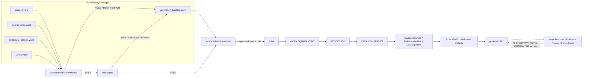

<!-- [KFM_META_BLOCK_V2]
doc_id: kfm://doc/TODO-uuid
title: Ecology Registry
type: standard
version: v1
status: draft
owners: TODO: ecology registry steward
created: 2026-04-29
updated: 2026-04-29
policy_label: TODO:public
related: [TODO:../README.md, TODO:../../../docs/domains/ecology/README.md, TODO:../../../docs/adr/ADR-ecology-registry-home.md]
tags: [kfm, ecology, registry, source-descriptor, habitat, fauna, flora, governance]
notes: [Target path provided by current request. No mounted repository was available in this session, so owners, policy label, adjacent links, schema home, validator paths, and existing sibling registries remain NEEDS VERIFICATION.]
[/KFM_META_BLOCK_V2] -->

# Ecology Registry

Registry landing page for ecological source descriptors, source roles, sensitivity policies, and public-layer eligibility across habitat, fauna, flora, and cross-domain ecology records.

> [!NOTE]
> **Status:** experimental  
> **Owners:** `TODO: ecology registry steward`  
> **Path:** `data/registry/ecology/README.md`  
> **Posture:** source-ledgered · fail-closed · fixture-first · no live-source activation by README alone  
> **Badges:**  
> 
> 
> 
> 
> 
>  
> **Quick jumps:** [Scope](#scope) · [Repo fit](#repo-fit) · [Inputs](#inputs) · [Exclusions](#exclusions) · [Directory tree](#directory-tree) · [Quickstart](#quickstart) · [Usage](#usage) · [Diagram](#diagram) · [Reference tables](#reference-tables) · [Definition of done](#definition-of-done) · [FAQ](#faq)

---

## Scope

**INFERRED:** `data/registry/ecology/` is the ecology-level registry home for cross-lane source governance. It should coordinate source descriptors and shared registry vocabulary for ecological lanes without collapsing habitat, fauna, and flora into one flat truth layer.

This directory is for **registry records**, not raw data and not public truth. A registry row can describe a source, its role, rights posture, cadence, sensitivity, validation burden, authority scope, and public eligibility. It does **not** publish data, grant rights, override policy, or prove a species, habitat, or environmental claim by itself.

### What this README governs

This README governs how contributors should treat ecology registry files when adding or reviewing:

- source descriptors
- source-role vocabularies
- sensitivity and geoprivacy profiles
- rights and publication eligibility profiles
- taxon or habitat authority references
- dataset and layer registry rows
- verification backlog entries
- aliases or migrations for prior source IDs

### What this README does not prove

**NEEDS VERIFICATION:** The mounted repository was not available in this session. This README therefore does not confirm that `data/registry/ecology/`, sibling registries, validators, policies, workflow files, schemas, or API/UI consumers already exist.

[Back to top](#ecology-registry)

---

## Repo fit

| Field | Value | Status |
|---|---|---|
| Target path | `data/registry/ecology/README.md` | CONFIRMED by request |
| Registry role | Ecology-level source governance and cross-lane registry orientation | INFERRED from KFM ecological lane doctrine |
| Upstream references | `TODO: docs/domains/ecology/`, `TODO: docs/adr/ADR-ecology-registry-home.md`, `TODO: schemas/contracts/v1/ecology/` or repo-selected equivalent | NEEDS VERIFICATION |
| Downstream dependents | validators, source probes, policy gates, catalog/proof closure, governed API envelopes, MapLibre layer metadata, Evidence Drawer payloads, Focus Mode evidence pools | PROPOSED |
| Sibling registries | `TODO: data/registry/habitat/`, `TODO: data/registry/fauna/`, `TODO: data/registry/flora/`, `TODO: data/registry/habitat_fauna/` | NEEDS VERIFICATION |
| Public boundary | published artifacts and governed APIs only; registry files are not public claims | CONFIRMED doctrine |
| Change discipline | update registry rows through PR review; preserve prior IDs through aliases or migration notes; never silently delete lineage | PROPOSED |

> [!IMPORTANT]
> Active relative links are intentionally limited to in-page anchors until the real repo tree is mounted. Replace `TODO:` path references with verified relative links during the repo-verification pass.

[Back to top](#ecology-registry)

---

## Inputs

Accepted inputs belong here only when they are reviewable, source-ledgered, and policy-aware.

| Input family | Belongs here when… | Required posture |
|---|---|---|
| Source descriptor rows | The source identity, publisher, access method, source role, cadence, rights, sensitivity, and authority scope are explicit. | Fail closed on missing rights, unclear source role, or unknown sensitivity. |
| Source-role vocabulary | The term explains what a source may support: legal status, occurrence signal, habitat model, steward review, disturbance context, or fixture. | Prevent source-role drift across habitat, fauna, and flora. |
| Sensitivity policies | The policy describes public exact, generalized, restricted, embargoed, steward-review, or quarantine classes. | No precise sensitive locations in public registry outputs. |
| Rights profiles | The profile states license/terms, attribution, redistribution review, and public-release eligibility. | Unknown rights block promotion. |
| Dataset registry rows | The row binds `source_id`, `dataset_id`, time range, checksum/spec hash, status, and lifecycle state. | Dataset rows do not replace source descriptors. |
| Layer registry rows | The row describes layer ID, delivery class, public eligibility, evidence route, freshness, and sensitivity summary. | Layer rows do not carry business truth hidden in style expressions. |
| Authority references | The row names candidate taxon, habitat, legal, or steward authority sources and their scope. | Authority scope must be explicit and testable. |
| Verification backlog | The entry records unresolved source, rights, schema, steward, endpoint, or policy questions. | Backlog entries need closure criteria. |

### Minimal descriptor fields

A source descriptor admitted under this registry should include, at minimum:

| Field | Purpose |
|---|---|
| `source_id` | Stable source identity used by validators and downstream artifacts. |
| `title` | Human-readable source name. |
| `publisher` | Source owner or publishing institution. |
| `source_role` | What this source can support in KFM. |
| `authority_scope` | Jurisdiction, domain, or claim type for which the source may be authoritative. |
| `rights_status` | License/terms/publication eligibility state. |
| `sensitivity_class` | Default public-boundary posture. |
| `cadence` | Expected update rhythm or `unknown`. |
| `access_method` | Download/API/service/manual/fixture. |
| `expected_formats` | Expected input formats. |
| `citation` | Required attribution or citation text when known. |
| `verification_status` | `verified`, `proposed`, `needs_verification`, `blocked`, or repo-native equivalent. |
| `live_connector_allowed` | Explicit boolean; default should be `false` until source activation review passes. |

[Back to top](#ecology-registry)

---

## Exclusions

Do **not** put these in `data/registry/ecology/`.

| Excluded material | Where it should go instead | Why |
|---|---|---|
| Raw source data | `data/raw/...` or repo-confirmed raw source home | Registry rows describe sources; raw data follows lifecycle controls. |
| WORK or QUARANTINE artifacts | `data/work/...`, `data/quarantine/...`, or repo-confirmed equivalents | Candidate records and rejected records need receipts and stage handling. |
| Processed/public artifacts | `data/processed/...`, `data/published/...` | Registry records are not released artifacts. |
| Receipts | `data/receipts/...` | Receipts are process memory, not source registry. |
| Proof packs / EvidenceBundles | `data/proofs/...` or repo-confirmed proof home | Proof objects support release and runtime evidence. |
| STAC/DCAT/PROV catalog records | `data/catalog/...` | Catalog closure is downstream of validation and promotion. |
| Machine schemas | `schemas/...`, `contracts/...`, or ADR-selected schema home | Avoid duplicating schema authority in registry prose. |
| Rego/policy bodies | `policy/...` | Registry can reference policy IDs; policy files enforce rules. |
| Live connector code | `pipelines/...`, `packages/...`, `tools/...`, or repo-confirmed equivalent | Connector code must not be hidden in registry folders. |
| API keys, tokens, private URLs | Secret manager or private deployment config | Never commit credentials. |
| Exact sensitive occurrence geometry | Restricted stores only, if admitted by policy | No public exact geometry for protected or sensitive records. |
| AI answers or summaries | governed API / runtime outputs only | AI is interpretive, not a registry source. |

[Back to top](#ecology-registry)

---

## Directory tree

**PROPOSED / NEEDS VERIFICATION:** Use this shape only if the mounted repo does not already define a different registry convention.

<details>
<summary>Proposed ecology registry shape</summary>

```text
data/
└── registry/
    └── ecology/
        ├── README.md
        ├── sources.yaml
        ├── source_roles.yaml
        ├── datasets.yaml
        ├── layers.yaml
        ├── sensitivity_policies.yaml
        ├── rights_profiles.yaml
        ├── taxon_authorities.yaml
        ├── habitat_surface_authorities.yaml
        ├── aliases.yaml
        └── verification_backlog.yaml
```

</details>

### File roles

| File | Role | Public-risk posture |
|---|---|---|
| `sources.yaml` | Source descriptors and source admission status. | Medium: can expose source eligibility and terms; no credentials. |
| `source_roles.yaml` | Controlled vocabulary for ecological source roles. | Low: vocabulary only. |
| `datasets.yaml` | Dataset identity, source binding, lifecycle state, checksums/spec hashes. | Medium: avoid raw URLs if restricted. |
| `layers.yaml` | Map layer IDs, public eligibility, evidence routes, freshness, sensitivity summary. | Medium/high: must not imply public eligibility without policy. |
| `sensitivity_policies.yaml` | Public exact/generalized/restricted/embargo/quarantine classes. | High: must be steward-reviewed before live sensitive data. |
| `rights_profiles.yaml` | Reusable rights and attribution profiles. | Medium: rights uncertainty blocks publication. |
| `taxon_authorities.yaml` | Candidate taxon authority sources and precedence. | Medium: ambiguity must not silently merge taxa. |
| `habitat_surface_authorities.yaml` | Candidate habitat/model/surface source authority scope. | Medium: model surfaces are ecological context, not species truth. |
| `aliases.yaml` | Source ID migrations and successor mappings. | Medium: preserves continuity during migration. |
| `verification_backlog.yaml` | Open source, rights, steward, schema, and endpoint questions. | Low/medium: no secrets or restricted details. |

[Back to top](#ecology-registry)

---

## Quickstart

Use this only as a review workflow until the repo’s actual validator and policy paths are confirmed.

### 1. Draft a source descriptor

```yaml
# data/registry/ecology/sources.yaml
# ILLUSTRATIVE ONLY — not a live-source activation.
sources:
  - source_id: example_ecology_source
    title: Example Ecology Source
    status: proposed
    publisher: TODO
    source_role: occurrence_signal
    authority_scope:
      domain: ecology
      claim_types: [occurrence_context]
      jurisdiction: TODO
    access_method: TODO
    expected_formats: [TODO]
    cadence: unknown
    rights_status: needs_verification
    sensitivity_class: unknown
    default_visibility: blocked
    live_connector_allowed: false
    citation: TODO
    verification_status: needs_verification
    notes:
      - "Descriptor is incomplete. Do not ingest, publish, or expose through runtime surfaces."
```

### 2. Validate the registry row

```bash
# PROPOSED — replace with repo-confirmed validator path.
python tools/validators/ecology/validate_source_descriptors.py \
  --registry data/registry/ecology/sources.yaml
```

### 3. Run policy checks, if policy tooling exists

```bash
# PROPOSED — replace with repo-confirmed policy command.
conftest test data/registry/ecology/sources.yaml \
  -p policy/ecology
```

### 4. Keep live connectors blocked

A descriptor can move toward source admission only after:

1. source role is explicit
2. rights and redistribution posture are known
3. sensitivity posture is known
4. expected formats are defined
5. validator and policy checks pass
6. steward or owner review is recorded where required
7. no public release path reads RAW, WORK, QUARANTINE, or restricted state directly

[Back to top](#ecology-registry)

---

## Usage

### Registry rows are gates, not claims

A registry row can allow a validator to say:

> “This source is eligible for a specific next step under a specific role and policy posture.”

It must not allow anyone to say:

> “This ecological claim is true because the source exists in the registry.”

### Source-role separation

KFM ecology work should preserve these distinctions:

- **Legal or regulatory status** is not the same as field occurrence.
- **Occurrence evidence** is a signal requiring QA, rights review, taxonomic resolution, and sensitivity handling.
- **Habitat or model surfaces** describe context or expectation; they do not prove presence.
- **Derived habitat assignment** is reproducible derived evidence; it is not canonical species truth.
- **Public layer metadata** must not silently promote restricted, stale, incomplete, or unsupported data.
- **Focus Mode** and map popups must resolve evidence through governed APIs and public-safe EvidenceBundles.

### Negative outcomes stay visible

Registry and runtime flows should preserve finite outcomes:

| Surface | Outcomes | Meaning |
|---|---|---|
| Source descriptor validation | `PASS`, `HOLD`, `DENY`, `ERROR` | A source is structurally ready, blocked for review, forbidden, or cannot be safely evaluated. |
| Runtime / Focus response | `ANSWER`, `ABSTAIN`, `DENY`, `ERROR` | Evidence supports answer, evidence is insufficient/ambiguous/stale, policy forbids answer, or infrastructure failed. |

[Back to top](#ecology-registry)

---

## Diagram



[Back to top](#ecology-registry)

---

## Reference tables

### Source roles

| Source role | Can support | Must not support |
|---|---|---|
| `legal_status_authority` | Legal or regulatory status within an explicit jurisdiction and date scope. | Occurrence truth, habitat suitability, or population abundance unless separately evidenced. |
| `occurrence_signal` | Observed, reported, or aggregated occurrence evidence after QA. | Legal status, guaranteed presence, absence, or public exact-sensitive release. |
| `habitat_model` | Habitat suitability, range context, land-cover relationship, or ecological expectation. | Exact occurrence, legal status, or confirmed species presence. |
| `habitat_surface` | Raster/grid/vector environmental surface used as context or covariate. | Species truth without an evidence-bound derivation record. |
| `steward_review_source` | Restricted or steward-mediated evidence that may require human review. | Public release without review, transform receipt, and policy decision. |
| `disturbance_context` | Fire, flood, land-cover change, or environmental disturbance context. | Species presence/absence or legal status. |
| `local_fixture` | No-network tests, examples, and reproducible dry-runs. | Real-world claims or public release. |

### Gate matrix

| Gate | Required evidence | Fail-closed trigger |
|---|---|---|
| Source identity | Stable `source_id`, publisher, title, and source role. | Missing `source_id` or ambiguous publisher. |
| Rights | License/terms, attribution, redistribution review. | Unknown rights with requested publication. |
| Sensitivity | Sensitivity class, geoprivacy posture, steward review flag. | Exact sensitive geometry in public path. |
| Cadence/freshness | Update cadence, freshness class, or explicit unknown state. | Runtime claims hide stale or unknown freshness. |
| Authority scope | Claim types and jurisdiction/source-role limits. | Occurrence aggregator used as legal authority. |
| Taxonomy | Authority source and ambiguity handling. | Ambiguous taxon silently merged. |
| Catalog/proof closure | STAC/DCAT/PROV or repo-native catalog, EvidenceBundle, release manifest. | Catalog links open or EvidenceBundle unresolved. |
| Runtime boundary | Governed API reads public-safe published artifacts only. | UI, model, or popup reads RAW/WORK/QUARANTINE directly. |

### Public-boundary rules

| Class | Public behavior |
|---|---|
| `public_exact_allowed` | Exact public geometry may publish only with rights, evidence, sensitivity, and review support. |
| `public_generalized` | Public output uses county/grid/watershed/bbox/generalized geometry with transform receipt. |
| `restricted_precise` | Precise geometry remains restricted and must not appear in public API, map, graph, search, screenshot, or Focus output. |
| `embargoed` | Public release waits until embargo expires or uses public summary only. |
| `steward_review_required` | HOLD until review decision is recorded. |
| `quarantine` | Not public; unresolved rights, sensitivity, taxonomy, geometry, or source role. |

[Back to top](#ecology-registry)

---

## Definition of done

Before this README can be treated as active repo documentation, complete the verification pass below.

- [ ] Replace `doc_id: kfm://doc/TODO-uuid` with a real KFM document ID.
- [ ] Replace `owners: TODO` with verified owner or steward group.
- [ ] Confirm the policy label for this README.
- [ ] Confirm whether `data/registry/ecology/` exists or should be created.
- [ ] Confirm whether ecology is an umbrella registry or whether records belong only in lane-specific registries.
- [ ] Confirm sibling registry homes for habitat, fauna, flora, and habitat-fauna crosswalk records.
- [ ] Confirm schema home: `contracts/`, `schemas/contracts/v1/`, or repo-selected equivalent.
- [ ] Confirm validator path and expected exit-code vocabulary.
- [ ] Confirm policy path and whether OPA/Conftest or repo-native policy tooling is used.
- [ ] Add valid and invalid descriptor fixtures.
- [ ] Add negative tests for unknown rights, unknown source role, and exact sensitive public geometry.
- [ ] Add or verify catalog/proof closure tests before any public release.
- [ ] Confirm MapLibre layer registry consumption path.
- [ ] Confirm Evidence Drawer payload contract.
- [ ] Confirm Focus Mode envelope contract and finite outcomes.
- [ ] Keep live connectors disabled until source admission review passes.

[Back to top](#ecology-registry)

---

## FAQ

### Is this the canonical ecology data store?

No. This directory is a registry/control surface. Canonical data, source payloads, derived products, proof objects, receipts, and public artifacts live in their own lifecycle homes.

### Can a source descriptor authorize publication?

No. A descriptor can make publication review possible. Publication still requires validation, policy, evidence resolution, catalog/proof closure, review state, and promotion.

### Can occurrence records be public exact points?

Only when rights, source policy, sensitivity policy, taxon status, precision, steward posture, and public-boundary checks allow it. Sensitive or uncertain records must be generalized, delayed, held, quarantined, or denied.

### Can habitat joins become canonical truth?

No. Habitat assignment is derived and must remain reproducible, invalidatable, and evidence-bound. It can support a public-safe assertion after promotion, but it does not replace canonical source evidence.

### Can Focus Mode use this registry directly?

No. Focus Mode should consume governed API envelopes and released public-safe EvidenceBundles. The registry informs validation and source admission; it is not a model context dump.

[Back to top](#ecology-registry)

---

## Appendix

<details>
<summary>Illustrative source descriptor review checklist</summary>

| Check | Reviewer question | Blocking? |
|---|---|---:|
| Identity | Does `source_id` remain stable and unique? | Yes |
| Role | Is `source_role` specific enough to prevent authority confusion? | Yes |
| Rights | Are license, attribution, redistribution, and release limits known? | Yes |
| Sensitivity | Is default sensitivity explicit and compatible with public-boundary rules? | Yes |
| Cadence | Is update cadence or unknown cadence explicit? | No, unless runtime freshness claims depend on it |
| Format | Are expected formats and geometry types known? | Yes for ingestion |
| Taxonomy | Are taxon authorities and ambiguity handling defined if the source contains taxa? | Yes |
| Geometry | Are CRS, precision, and public generalization requirements known? | Yes |
| Review | Is steward review required before source activation? | Depends on source class |
| Runtime | Are public API, Evidence Drawer, and Focus implications stated? | Yes |
| Rollback | Is disabling the source safe without deleting lineage? | Yes |

</details>

<details>
<summary>Illustrative reason codes</summary>

| Reason code | Meaning |
|---|---|
| `missing_source_role` | Descriptor does not state what the source is allowed to support. |
| `unknown_rights` | Publication cannot proceed because rights are unresolved. |
| `sensitive_exact_public_geometry` | A public artifact, layer, API, or UI payload would expose restricted precision. |
| `authority_scope_mismatch` | Source is being used for a claim outside its allowed role. |
| `taxonomy_ambiguous` | Taxon resolution has multiple plausible matches and no accepted mapping. |
| `evidence_bundle_unresolved` | Runtime claim cannot resolve EvidenceRef to EvidenceBundle. |
| `catalog_open` | Catalog/proof/release links do not close. |
| `live_connector_not_admitted` | Connector is blocked because source admission review has not passed. |
| `repo_convention_unknown` | Path/tool/schema convention is not verified in the mounted repo. |

</details>
