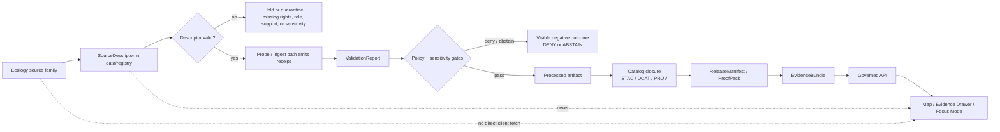

<!-- [KFM_META_BLOCK_V2]
doc_id: kfm://doc/NEEDS-VERIFICATION-data-registry-ecology-ecology-readme
title: data/registry/ecology/ecology/
type: standard
version: v1
status: draft
owners: NEEDS_VERIFICATION__data_registry_steward
created: NEEDS_VERIFICATION__YYYY-MM-DD
updated: 2026-04-29
policy_label: NEEDS_VERIFICATION__public_or_restricted
related: [../README.md, ../../README.md, ../../../README.md, ../../../catalog/README.md, ../../../receipts/README.md, ../../../proofs/README.md, ../../../published/README.md, ../../../../contracts/README.md, ../../../../schemas/README.md, ../../../../policy/README.md, ../../../../tools/validators/README.md, ../../../../tests/README.md, ../../../../docs/README.md]
tags: [kfm, data, registry, ecology, biodiversity, source-descriptor, source-role, sensitivity, evidence]
notes: [README-like standard doc for the ecology registry leaf. Exact repo presence, owner assignment, created date, policy label, parent README inventory, descriptor filenames, validator wiring, and live source activation remain NEEDS VERIFICATION. Updated date reflects this draft generation date.]
[/KFM_META_BLOCK_V2] -->

<a id="top"></a>

# `data/registry/ecology/ecology/`

Registry leaf for ecology source descriptors, source-role boundaries, rights/sensitivity posture, and evidence-ready intake metadata.

> [!IMPORTANT]
> This directory is a **source-registry surface**, not a data lake, publication gate, proof pack, or runtime answer system. It should make ecological sources governable before ingestion, validation, cataloging, publication, or map/runtime use.

| Field | Value |
|---|---|
| **Status** | `experimental` |
| **Document state** | `draft` |
| **Owners** | `NEEDS_VERIFICATION__data_registry_steward` |
| **Path** | `data/registry/ecology/ecology/README.md` |
| **Repo fit** | Child of `data/registry/ecology/`; upstream registry context in [`../../README.md`](../../README.md) and data lifecycle context in [`../../../README.md`](../../../README.md); downstream consumers should be validators, pipelines, catalog/proof surfaces, and governed APIs after verification. |
| **Badges** |      |
| **Quick jumps** | [Scope](#scope) · [Repo fit](#repo-fit) · [Accepted inputs](#accepted-inputs) · [Exclusions](#exclusions) · [Evidence posture](#evidence-posture) · [Directory tree](#directory-tree) · [Quickstart](#quickstart) · [Usage](#usage) · [Diagram](#diagram) · [Registry tables](#registry-tables) · [Definition of done](#definition-of-done) · [FAQ](#faq) · [Appendix](#appendix) |

---

## Scope

`data/registry/ecology/ecology/` is the proposed registry home for **ecology-wide source identity and source-role records** that do not fit cleanly into a single narrow flora, fauna, habitat, wetlands, landcover, or protected-area leaf.

It exists to keep these distinctions visible before any connector, validator, map layer, Evidence Drawer payload, or Focus Mode answer consumes ecological support:

- observed occurrence evidence
- habitat or landcover context
- modeled range or modeled habitat products
- regulatory or statutory habitat context
- protected-area or stewardship context
- source rights, cadence, access method, freshness, and public-use posture
- sensitivity and geoprivacy burden, especially for rare species and exact coordinates

### Working question

> Can this ecology source be identified, classified, governed, validated, and safely routed without flattening ecological evidence into one undifferentiated biodiversity bucket?

---

## Repo fit

This README should orient maintainers who are deciding where an ecology source descriptor belongs and what it is allowed to mean.

| Boundary | Relationship | Status |
|---|---|---|
| [`../../README.md`](../../README.md) | Parent `data/registry/` index and source-registry law. | `NEEDS VERIFICATION` |
| [`../README.md`](../README.md) | Ecology registry parent. | `NEEDS VERIFICATION` |
| [`../../../receipts/README.md`](../../../receipts/README.md) | Process memory for probes, watchers, validation runs, and review handoffs. | `NEEDS VERIFICATION` |
| [`../../../catalog/README.md`](../../../catalog/README.md) | Catalog closure surfaces such as STAC/DCAT/PROV after processed artifacts exist. | `NEEDS VERIFICATION` |
| [`../../../proofs/README.md`](../../../proofs/README.md) | Release/proof objects; separate from descriptors and receipts. | `NEEDS VERIFICATION` |
| [`../../../../contracts/README.md`](../../../../contracts/README.md) | Human-readable contract law for source admission, evidence objects, runtime envelopes, and review objects. | `NEEDS VERIFICATION` |
| [`../../../../schemas/README.md`](../../../../schemas/README.md) | Machine-readable schema home or mirror; exact authority split remains an ADR issue. | `NEEDS VERIFICATION` |
| [`../../../../policy/README.md`](../../../../policy/README.md) | Policy bundles for sensitivity, rights, precision, review, and release gates. | `NEEDS VERIFICATION` |
| [`../../../../tools/validators/README.md`](../../../../tools/validators/README.md) | Validator implementations that should consume descriptors; this registry should not replace them. | `NEEDS VERIFICATION` |
| [`../../../../tests/README.md`](../../../../tests/README.md) | Fixture and regression proof for descriptor validity and fail-closed behavior. | `NEEDS VERIFICATION` |

> [!NOTE]
> If the active branch already has a different ecology registry layout, preserve that layout and adapt this README through a small migration note rather than creating a parallel authority.

---

## Accepted inputs

This directory may contain compact, reviewable registry material for ecology-wide source admission.

| Accepted input | Examples | Required posture |
|---|---|---|
| Source descriptors | `*_source.yaml`, `*_descriptor.yaml`, or repo-native descriptor format | Must declare source identity, source role, rights, cadence, access class, spatial/temporal support, expected formats, sensitivity, and citation posture. |
| Source-family indexes | `_index.yaml`, `_index.md`, `source_families.md` | Must separate occurrence, habitat, regulatory, modeled, and context sources. |
| Source-role matrices | `source_roles.md`, `authority_matrix.md` | Must state what a source can and cannot support. |
| Sensitivity/publication matrices | `sensitivity_publication_matrix.md` | Must fail closed for exact sensitive locations, unresolved rights, and unreviewed public precision. |
| Review notes | `review_burden.md`, `steward_review_notes.md` | Must identify what is still `NEEDS VERIFICATION`; must not grant publication by prose alone. |
| Tiny illustrative fixtures | `examples/*.json` | Must be synthetic or public-safe; must not contain non-public exact locations or restricted records. |

---

## Exclusions

This directory should stay small and source-governance focused.

| Does **not** belong here | Put it here instead | Why |
|---|---|---|
| Raw occurrence dumps, rasters, provider downloads, scrape caches | `data/raw/`, `data/work/`, or quarantined lifecycle homes | Registry files describe sources; they do not store source payloads. |
| Restricted exact species coordinates or steward-only records | Restricted/quarantined data surfaces | Registry material should not leak sensitive ecological locations. |
| Validator code | `tools/validators/` | Validation must be executable and testable outside the registry. |
| Pipeline watchers or live connector code | `pipelines/` or `tools/probes/` | Source refresh and fetch behavior should emit receipts and stay separate from descriptors. |
| Proof packs, release manifests, signed bundles | `data/proofs/`, `data/releases/`, or release-bearing surfaces | Proof is a later release state, not a descriptor state. |
| STAC/DCAT/PROV catalog records | `data/catalog/` | Catalog records describe emitted artifacts; source descriptors describe intake authority and burden. |
| Policy rule bodies | `policy/` | This leaf declares policy-relevant metadata; it does not author allow/deny law. |
| UI drawer payloads or Focus Mode examples | App, contract, or runtime-proof surfaces | Runtime presentation must consume governed evidence, not registry prose directly. |
| Canonical taxonomic truth | Taxonomy contracts/schemas or a dedicated taxon registry | Ecology descriptors can reference taxonomy support but should not become the taxonomy authority. |

---

## Evidence posture

| Claim | Label | Basis |
|---|---|---|
| KFM treats source-role discipline, citation, policy, review state, and release state as core to public claims. | `CONFIRMED doctrine` | Attached KFM doctrine and architecture corpus. |
| Habitat, fauna, and flora should remain governed ecological lanes with taxonomic identity, occurrence evidence, habitat surfaces, sensitivity transforms, and derived joins kept distinct. | `CONFIRMED doctrine / PROPOSED realization` | Attached ecology, habitat, fauna, flora, and whole-system planning corpus. |
| This exact target path exists in the mounted repository. | `UNKNOWN` | No mounted KFM checkout was available in this session. |
| Descriptor filenames under this leaf are already branch-authoritative. | `UNKNOWN` | No active branch inventory was available. |
| `@bartytime4life` or another owner controls this exact leaf. | `NEEDS VERIFICATION` | Existing examples show owner placeholders or broad ownership patterns; leaf-level ownership must be checked. |
| Source endpoints, licenses, current API fields, and redistribution terms are safe for activation. | `NEEDS VERIFICATION` | Source activation is version-, rights-, and steward-sensitive. |
| A descriptor in this leaf grants public release. | `FALSE / not allowed` | Release requires validation, policy, catalog/proof closure, review state, and promotion. |

---

## Directory tree

### Current safe claim

This README is the only file this draft can describe without asserting branch inventory.

```text
data/registry/ecology/ecology/
└── README.md
```

### Preferred growth shape (`PROPOSED` / `NEEDS VERIFICATION`)

```text
data/registry/ecology/ecology/
├── README.md
├── _index.yaml
├── source_roles.md
├── sensitivity_publication_matrix.md
├── sources/
│   ├── nlcd_landcover.yaml
│   ├── nwi_wetlands.yaml
│   ├── usfws_critical_habitat.yaml
│   ├── gbif_occurrence.yaml
│   ├── inaturalist_occurrence.yaml
│   └── ebird_occurrence.yaml
└── examples/
    ├── source_descriptor.public-safe.example.yaml
    └── source_descriptor.invalid-missing-rights.example.yaml
```

> [!TIP]
> Add one descriptor and one invalid fixture before adding a family of descriptors. A small source-ledgered registry is safer than a broad but weakly validated one.

---

## Quickstart

Use these commands from the repository root after the real checkout is mounted.

### 1) Inspect the branch before making stronger claims

```bash
git status --short
git branch --show-current
test -d data/registry/ecology/ecology && find data/registry/ecology/ecology -maxdepth 3 -type f | sort
```

### 2) Check for adjacent ownership and registry conventions

```bash
find data/registry -maxdepth 3 -name 'README.md' -o -name '*descriptor*' -o -name '_index.*' | sort
find .github -maxdepth 3 -type f | sort
grep -RInE "data/registry|source descriptor|SourceDescriptor|ecology|biodiversity" .github docs data contracts schemas policy 2>/dev/null | head -100
```

### 3) Validate descriptors only after the schema path is verified

```bash
# Example only — replace with the repo-native validator once verified.
python -m tools.validators.source_descriptor \
  --schema schemas/contracts/v1/source/source_descriptor.schema.json \
  --path data/registry/ecology/ecology/sources
```

> [!WARNING]
> Do not run live source fetches from registry review. Descriptor validation is safe; connector activation requires source steward review, rights review, policy review, and receipt emission.

---

## Usage

### Descriptor admission rule

A source descriptor in this leaf should be admissible only when it can answer these questions:

1. **Who publishes the source?**
2. **What kind of ecological support does it provide?**
3. **What claim is it allowed to support?**
4. **What claim must it never support by itself?**
5. **What rights, license, attribution, or redistribution limits apply?**
6. **What precision can be served publicly?**
7. **What spatial and temporal support does the source actually have?**
8. **What validator and policy gates must run before downstream use?**
9. **What receipt, catalog, proof, or release objects should exist later?**

### Registry-to-runtime rule

Registry entries should feed downstream evidence systems by reference only.

```text
SourceDescriptor
  -> probe / ingest receipt
  -> validation report
  -> processed artifact
  -> catalog closure
  -> proof / release object
  -> EvidenceBundle
  -> governed API
  -> Evidence Drawer / Focus Mode
```

The registry does **not** skip directly to UI, Focus Mode, map rendering, or public release.

---

## Diagram



---

## Registry tables

### Source-role guardrail

| Source role | Typical ecology source family | Can support | Must not be treated as | Public precision posture |
|---|---|---|---|---|
| `observed_occurrence` | eBird, iNaturalist, GBIF-style occurrence extracts | Evidence that an observation was reported under declared source conditions | Regulatory truth, modeled range truth, automatic public exact-coordinate permission | Usually generalized or filtered unless rights, sensitivity, precision, and review pass. |
| `regulatory_context` | USFWS critical habitat or similar statutory context | Legal or regulatory habitat context for a taxon/place/time | Species presence, survey observation, modeled habitat suitability | Public polygons may still require source-term and date/effective-status review. |
| `modeled_range` | GAP-style species range products or model outputs | Modeled support, range context, suitability context | Observed occurrence or legal status | Must be labeled modeled; uncertainty and version must stay visible. |
| `habitat_or_landcover_context` | NLCD, LANDFIRE, NWI-style landcover/wetland layers | Environmental context and derived joins | Biological observation or statutory habitat designation | Public-safe if source terms pass; joins remain derived. |
| `protected_area_context` | PAD-US or stewardship/protected-area datasets | Access, stewardship, management, or protected-area context | Species presence or ecological condition proof | Public status depends on source terms and sensitivity review. |
| `taxonomic_context` | Taxon resolver or authority crosswalk | Name resolution, synonym handling, taxon identity support | Occurrence evidence or habitat evidence | Usually safe as metadata, but ambiguity must remain visible. |

### Descriptor minimum fields

| Field family | Required fields or review questions | Failure mode |
|---|---|---|
| Identity | `source_id`, publisher, system, source family, jurisdiction, source URL or citation surface | Hold if identity is ambiguous. |
| Role | `source_role`, allowed claim types, disallowed claim types | Hold if source role is missing or overloaded. |
| Rights | license, attribution, redistribution review, record-level license behavior | Deny or quarantine if rights are unknown for public use. |
| Sensitivity | geoprivacy flags, rare-species trigger, public precision, steward review requirement | Deny exact public output if unresolved. |
| Support | spatial support, temporal support, resolution/scale, CRS expectation, update cadence | Abstain if support cannot answer the requested claim. |
| Validation | required fields, geometry requirements, identifier rules, freshness checks | Quarantine if validation cannot run or fails. |
| Downstream | expected lifecycle zones, catalog targets, evidence bundle expectations | Do not publish if downstream closure is absent. |

### Ecological anti-collapse matrix

| Do not collapse | Why it matters |
|---|---|
| Observation and modeled range | A reported sighting and a predicted/range model answer different questions. |
| Critical habitat and occurrence | Regulatory habitat designation is not proof that a species was observed there. |
| Landcover and habitat suitability | A landcover class may support context, but does not by itself prove biological use. |
| Internal exact coordinate and public geometry | Public-safe output often requires generalization, aggregation, withholding, or steward review. |
| Registry entry and release proof | A descriptor explains a source; it does not prove an artifact passed promotion. |
| AI summary and EvidenceBundle | Generated language is downstream of evidence and policy. |

---

## Definition of done

This README should not be upgraded beyond `draft` until the following checks are complete.

- [ ] The active branch confirms this exact path or a documented replacement path.
- [ ] Parent registry README links to this leaf.
- [ ] Leaf owner is confirmed through CODEOWNERS, governance docs, or steward assignment.
- [ ] Policy label is confirmed for the README and for any descriptor files.
- [ ] At least one valid ecology descriptor fixture exists.
- [ ] At least one invalid descriptor fixture demonstrates fail-closed behavior.
- [ ] Source-role matrix is reviewed by a data/registry steward.
- [ ] Sensitivity/publication matrix is reviewed for rare species, protected locations, and restricted licenses.
- [ ] Schema-home decision is reconciled before machine validation claims are made.
- [ ] Descriptor validation is wired to the repo-native validator or explicitly deferred.
- [ ] No raw data, restricted exact coordinates, provider secrets, or live credentials are stored here.
- [ ] Downstream references to receipts, catalog, proofs, and governed APIs are linked without collapsing their authority.

---

## FAQ

### Why is the path `ecology/ecology/`?

The target path is explicit. This README treats the duplicated segment as a **leaf-level ecology registry** under a broader ecology registry parent. If the mounted repo reveals a different convention, migrate with an ADR or parent README note rather than silently renaming.

### Does this registry prove a source is safe to publish?

No. A source descriptor is an intake/control-plane object. Public release requires validation, rights/sensitivity checks, catalog closure, proof/release objects, review state, and promotion.

### Can occurrence sources be public?

Sometimes, but not by default. Public safety depends on record-level rights, source geoprivacy, taxon sensitivity, coordinate uncertainty, review status, and the precision served.

### Can ecological joins become canonical truth?

Treat joins as derived unless a stronger contract explicitly promotes them. A fauna occurrence sampled against a landcover surface can be useful and evidence-bearing, but it should remain reproducible, reversible, and versioned against both inputs.

### Should runtime routes or UI components read this registry directly?

No. Runtime and UI surfaces should consume governed API responses and EvidenceBundle-backed payloads. Registry entries may be part of upstream evidence resolution, but they are not a direct public client dependency.

[Back to top](#top)

---

## Appendix

<details>
<summary><strong>Illustrative descriptor skeleton</strong> — not branch-authoritative</summary>

```yaml
id: NEEDS_VERIFICATION__source_id
title: NEEDS_VERIFICATION__source_title
status: draft
owners:
  - NEEDS_VERIFICATION__data_registry_steward

source:
  publisher: NEEDS_VERIFICATION
  system: NEEDS_VERIFICATION
  source_family: ecology
  source_role: NEEDS_VERIFICATION__observed_occurrence_or_context_or_regulatory_or_modeled
  homepage: NEEDS_VERIFICATION
  access_modes:
    - NEEDS_VERIFICATION

scope:
  spatial_scope: NEEDS_VERIFICATION
  temporal_scope: NEEDS_VERIFICATION
  subject_domains:
    - ecology
    - biodiversity

rights:
  license_expression: NEEDS_VERIFICATION
  attribution_required: NEEDS_VERIFICATION
  redistribution_review: true
  record_level_rights: NEEDS_VERIFICATION

sensitivity:
  default_public_precision: NEEDS_VERIFICATION
  exact_location_public_allowed: false
  steward_review_required: true
  rare_species_or_protected_location_handling: fail_closed

quality:
  required_fields:
    - source_record_id
    - source_role
    - observed_or_effective_date
    - geometry_or_declared_spatial_support
    - rights_status
  geometry_requirements:
    - declared_crs
    - geometry_valid_or_spatial_support_declared
    - precision_or_resolution_declared

normalization:
  target_crs: EPSG:4326
  id_pattern: NEEDS_VERIFICATION
  required_derived_fields:
    - source_snapshot_at
    - normalized_at
    - spec_hash

downstream:
  allowed_lifecycle_targets:
    - data/work
    - data/quarantine
    - data/processed
    - data/catalog
  blocked_until_verified:
    - data/published
    - runtime_answer
    - public_exact_location
```

</details>

<details>
<summary><strong>Review checklist for a new ecology source descriptor</strong></summary>

- [ ] Does the descriptor name the publisher and source system?
- [ ] Does it declare source role without overloading one source as observation, model, legal authority, and context?
- [ ] Does it state rights and attribution expectations?
- [ ] Does it identify record-level license behavior when relevant?
- [ ] Does it declare public precision and sensitivity behavior?
- [ ] Does it identify whether exact coordinates are blocked, generalized, or steward-reviewed?
- [ ] Does it declare spatial support, temporal support, CRS, and resolution/uncertainty?
- [ ] Does it name expected validation checks?
- [ ] Does it state what claims the source cannot support?
- [ ] Does it avoid storing raw records, credentials, restricted locations, or provider caches?
- [ ] Does it link to the owning schema/contract path after schema-home verification?
- [ ] Does it leave live connector activation to probe/pipeline surfaces?

</details>
