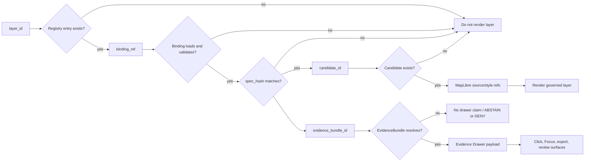

<!-- [KFM_META_BLOCK_V2]
doc_id: kfm://doc/<NEEDS_VERIFICATION_UUID>
title: Ecology Map Layer Registry
type: standard
version: v1
status: draft
owners: @bartytime4life
created: <NEEDS_VERIFICATION_CREATED_DATE>
updated: 2026-04-25
policy_label: <NEEDS_VERIFICATION_POLICY_LABEL>
related: [
  "../../../../schemas/ecology/ecology_map_layer_binding.schema.json",
  "../../../../contracts/ui/ecology_maplibre_layer_binding.md",
  "../../../../apps/governed_api/ecology/README.md",
  "../../../../apps/ui/ecology/evidence_drawer_mapper.py",
  "../../../proofs/ecology/README.md"
]
tags: [kfm, ecology, map-layer, registry, maplibre, evidencebundle]
notes: [
  "Defines proposed ecology map layer registry and lookup behavior.",
  "Does not claim implementation exists.",
  "Relative links assume suggested path data/registry/ecology/map_layers/README.md; verify after repo checkout.",
  "Registry must only expose released, evidence-bound layers to runtime surfaces."
]
[/KFM_META_BLOCK_V2] -->

<a id="top"></a>

# Ecology Map Layer Registry

Deterministic lookup surface for released ecology map layers that must resolve from `layer_id` to binding, EvidenceBundle, and Evidence Drawer before runtime use.


| Field | Value |
|---|---|
| **Status** | `draft` / `experimental` |
| **Truth posture** | `PROPOSED` |
| **Owners** | `@bartytime4life`; `<NEEDS_VERIFICATION_STEWARD_OR_TEAM>` |
| **Suggested path** | `data/registry/ecology/map_layers/README.md` |
| **Primary renderer posture** | MapLibre-first, 2D-first |
| **Policy label** | `<NEEDS_VERIFICATION_POLICY_LABEL>` |
| **Implementation claim** | No implementation is claimed by this document |

**Quick jumps:** [Scope](#scope) · [Repo fit](#repo-fit) · [Registry contract](#registry-contract) · [Lookup flow](#lookup-flow) · [Runtime behavior](#runtime-behavior) · [Validation gates](#validation-gates) · [Definition of done](#definition-of-done) · [Open verification](#open-verification)

> [!IMPORTANT]
> This README defines the proposed registry contract. It is not proof that the registry, schema, validators, UI bindings, governed API routes, or CI gates already exist.

---

## Scope

The ecology map layer registry is the release-facing index for ecology layers that are safe for governed runtime use.

It provides one narrow lookup path:

```text
layer_id
  → registry entry
  → binding_ref
  → binding
  → candidate_id
  → EvidenceBundle
  → Evidence Drawer
```

The registry exists to keep the MapLibre layer list from becoming an undocumented truth surface. A layer can render only when its meaning, source pointer, candidate identity, EvidenceBundle, drawer mapping, and status are explicit.

### Accepted inputs

This directory may contain only registry-facing files that are ready for review or release.

| Accepted input | Belongs here when... |
|---|---|
| `README.md` | It documents the map-layer registry contract and review rules. |
| `registry.json` or equivalent | It lists released or review-gated ecology layer entries. |
| `*.binding.json` | It conforms to the ecology map-layer binding schema after schema-home verification. |
| Small valid/invalid fixtures | They support registry validation without live source access. |
| Local notes about layer supersession | They explain replacement, deprecation, correction, or rollback paths for layer entries. |

### Exclusions

| Excluded material | Why it is excluded | Safer home |
|---|---|---|
| RAW, WORK, or QUARANTINE data | Registry files are runtime-facing release metadata, not source storage. | `data/raw/ecology/`, `data/work/ecology/`, or `data/quarantine/ecology/` after repo convention verification |
| Unreleased candidate layers | Runtime surfaces must not silently render unpublished evidence. | Candidate review or processing lane |
| Direct MapLibre style-only definitions | Style is not evidence and must not bypass binding. | Style registry or UI style package after verification |
| EvidenceBundle contents | The registry points to evidence; it does not store the proof bundle. | Governed evidence/proof store |
| Cesium / 3D scene configuration | Ecology map layers are MapLibre-first unless a burden-bearing 3D justification exists. | Controlled 3D story registry or ADR-backed 3D lane |
| AI-generated summaries | Generated language is not the layer source of truth. | Governed Focus / AI receipt path after evidence resolution |

---

## Repo fit

**Suggested file home:** `data/registry/ecology/map_layers/README.md`

This location is inferred from the supplied draft and KFM’s registry-oriented documentation pattern. The actual path must be verified against a mounted repository before commit.

### Upstream references

The registry depends on these adjacent contract and proof surfaces.

| Upstream surface | Proposed link from this README | Role |
|---|---|---|
| Binding schema | [`../../../../schemas/ecology/ecology_map_layer_binding.schema.json`](../../../../schemas/ecology/ecology_map_layer_binding.schema.json) | Machine-readable binding contract. |
| UI binding contract | [`../../../../contracts/ui/ecology_maplibre_layer_binding.md`](../../../../contracts/ui/ecology_maplibre_layer_binding.md) | UI-facing expectations for MapLibre layer binding. |
| Governed ecology API | [`../../../../apps/governed_api/ecology/README.md`](../../../../apps/governed_api/ecology/README.md) | EvidenceBundle and candidate lookup boundary. |
| Evidence Drawer mapper | [`../../../../apps/ui/ecology/evidence_drawer_mapper.py`](../../../../apps/ui/ecology/evidence_drawer_mapper.py) | Drawer payload mapping from evidence-bound layer selection. |
| Ecology proofs | [`../../../proofs/ecology/README.md`](../../../proofs/ecology/README.md) | Proof, receipt, or release evidence references. |

> [!WARNING]
> Relative links above assume this file lives at `data/registry/ecology/map_layers/README.md`. If the repo later places the registry elsewhere, update the meta block, link targets, and path notes together.

### Downstream consumers

| Consumer | Registry responsibility |
|---|---|
| MapLibre layer list | Render only allowed registry entries. |
| Layer panel | Show trust cues: status, time support, evidence state, review state, and policy posture. |
| Map click handler | Resolve layer/candidate evidence through the governed API before opening a drawer. |
| Evidence Drawer | Present the resolved EvidenceBundle, not registry text alone. |
| Focus Mode | Use only evidence-resolved, policy-safe context. |
| Export / share surfaces | Preserve release, trust, sensitivity, correction, and provenance cues. |

---

## Directory shape

Proposed minimal directory shape:

```text
data/registry/ecology/map_layers/
├── README.md
├── registry.json
├── ndvi_change.binding.json
├── fixtures/
│   ├── valid.ndvi_change.binding.json
│   ├── invalid.missing_evidence_bundle.binding.json
│   └── invalid.bad_spec_hash.binding.json
└── CHANGELOG.md
```

`CHANGELOG.md` is optional but recommended when layer IDs, bindings, hashes, or release state change.

---

## Registry contract

The registry is a compact index. It should not duplicate the binding object or EvidenceBundle.

### Registry shape

```json
{
  "registry_id": "kfm.registry.ecology.map_layers",
  "layers": [
    {
      "layer_id": "kfm.ecology.vegetation.ndvi_change.v1",
      "binding_ref": "ndvi_change.binding.json",
      "status": "active",
      "spec_hash": "aaaaaaaaaaaaaaaaaaaaaaaaaaaaaaaaaaaaaaaaaaaaaaaaaaaaaaaaaaaaaaaa"
    }
  ],
  "generated_at": "<NEEDS_VERIFICATION_RFC3339_TIMESTAMP>"
}
```

### Registry field rules

| Field | Rule |
|---|---|
| `registry_id` | Must identify this registry family. Proposed value: `kfm.registry.ecology.map_layers`. |
| `layers[]` | Must contain only released or review-gated ecology map layers intended for governed runtime use. |
| `layer_id` | Must be stable, unique within the registry, and match the referenced binding. |
| `binding_ref` | Must point to a local binding object or approved registry-relative path. |
| `status` | Runtime-visible entries should be `active` or `review_required`. Deprecated entries must not render. |
| `spec_hash` | Must be a deterministic hash of the normalized binding/specification payload. |
| `generated_at` | Must record registry generation time; it is not itself evidence of release validity. |

> [!NOTE]
> `generated_at` is operational metadata. It does not replace `spec_hash`, release receipts, catalog closure, or EvidenceBundle resolution.

---

## Binding contract

Each registry entry points to a binding object governed by:

```text
schemas/ecology/ecology_map_layer_binding.schema.json
```

The schema path is **NEEDS VERIFICATION** until the actual schema home is confirmed.

### Minimal binding example

```json
{
  "layer_id": "kfm.ecology.vegetation.ndvi_change.v1",
  "candidate_id": "eco_index.example",
  "evidence_bundle_id": "kfm.evidence.ecology.eco_index.example",
  "drawer_id": "kfm.drawer.ecology.eco_index.example",
  "render_type": "raster",
  "time_enabled": true,
  "default_visibility": true,
  "source_ref": "maplibre://sources/ecology/ndvi_change",
  "style_layer_ref": "maplibre://layers/ecology/ndvi_change",
  "spec_hash": "aaaaaaaaaaaaaaaaaaaaaaaaaaaaaaaaaaaaaaaaaaaaaaaaaaaaaaaaaaaaaaaa",
  "status": "active"
}
```

### Required binding fields

| Field | Required behavior |
|---|---|
| `layer_id` | Matches the registry entry exactly. |
| `candidate_id` | Resolves to a known ecology candidate or released object. |
| `evidence_bundle_id` | Resolves through the governed API before drawer, Focus, export, or claim text. |
| `drawer_id` | Maps to a drawer payload or drawer mapper entry. |
| `render_type` | Declares rendering mode, such as `raster`, `vector`, or another schema-approved value. |
| `time_enabled` | Declares whether timeline controls apply. |
| `default_visibility` | Declares default UI visibility; policy gates can still override this. |
| `source_ref` | Points to MapLibre source registration, not to canonical truth. |
| `style_layer_ref` | Points to MapLibre style-layer registration, not to evidence. |
| `spec_hash` | Binds the normalized binding/spec to deterministic identity. |
| `status` | Drives runtime visibility and review gating. |

### Schema-review extension fields

The following fields are recommended for schema review but are not inserted into the minimal example because the actual schema is not verified.

| Candidate field | Why it may be needed |
|---|---|
| `knowledge_character` | Distinguishes observed, derived, modeled, generalized, source-dependent, or documentary layers. |
| `policy_label` | Carries public/restricted/review-required posture to UI surfaces. |
| `sensitivity_posture` | Makes redaction, generalization, or restricted exact geometry visible. |
| `freshness_class` | Allows stale or source-dependent layers to show trust cues. |
| `time_extent` | Defines valid time range for time-enabled layers. |
| `catalog_refs` | Links layer delivery artifacts to catalog records. |
| `release_ref` | Connects layer binding to a release manifest or promotion decision. |
| `compare_eligible` | Prevents unsupported Compare Mode combinations. |
| `export_eligible` | Prevents exports that would strip trust or policy context. |

---

## Lookup flow



The lookup is intentionally one-way. MapLibre can draw the layer, but it does not become the source of the claim.

---

## Runtime behavior

| Condition | Result |
|---|---|
| `status = active` and all validation passes | Layer may render to permitted audiences. |
| `status = review_required` | Layer is gated, flagged, or role-scoped until review state permits broader exposure. |
| `status = deprecated` | Layer is hidden from normal runtime registries. If retained for lineage, it must carry successor or withdrawal context. |
| Missing binding | Layer is not rendered. |
| Invalid schema | Layer is not rendered. |
| Missing or mismatched `spec_hash` | Layer is not rendered. |
| Missing `evidence_bundle_id` | Layer is not rendered and no claim is emitted. |
| EvidenceBundle cannot resolve | Drawer, Focus, and export must abstain or deny rather than invent support. |
| Policy label is unknown for a sensitive ecology layer | Fail closed until policy posture is verified. |

---

## Fail-closed rules

The registry loader and any CI validator must reject or suppress entries that fail the following checks.

| Failure | Runtime outcome |
|---|---|
| Layer has no `evidence_bundle_id` | Do not render. |
| Layer has no `drawer_id` | Do not render interactive claim surface. |
| `spec_hash` is missing, malformed, or mismatched | Do not render. |
| `candidate_id` does not resolve | Do not render. |
| Binding schema is invalid | Do not render. |
| Layer bypasses registry and is defined directly in UI code | Reject build or review. |
| MapLibre source/style exists without evidence binding | Do not expose as governed ecology layer. |
| Layer uses Cesium or 3D scene machinery without documented justification | Reject from this registry. |
| Status is not schema-approved | Do not render. |
| Sensitive ecology precision is unclear | Restrict, generalize, redact, or hold for review. |

> [!CAUTION]
> A visible map layer can imply authority even when the code only intended visualization. In this registry, rendering is allowed only after evidence, policy, and release state are explicit.

---

## MapLibre integration rules

MapLibre is the renderer. The registry is the meaning boundary.

1. Load the registry.
2. Filter entries by status, policy, role, and review state.
3. Load and validate each binding.
4. Register only approved MapLibre sources and style layers.
5. Bind click/selection events to EvidenceBundle resolution.
6. Open Evidence Drawer only from resolved evidence.
7. Preserve trust cues in Focus, Compare, export, and review surfaces.
8. Block any direct layer definition that bypasses the registry.

### Source and style separation

| Surface | Owns |
|---|---|
| Source registry | Delivery source identity and approved source references. |
| Layer metadata registry | Business meaning, evidence route, review state, policy posture, freshness, compare/export eligibility, and time semantics. |
| Style registry | Visual treatment, paint/layout choices, sprite/glyph/font references. |
| Runtime adapter registry | Protocol adapters, plugin allow-list, and audited runtime machinery. |

---

## Minimal implementation sketch

Illustrative pseudocode only. Validator names, schema path, and API client names are **NEEDS VERIFICATION**.

```python
from __future__ import annotations

import json
import re
from pathlib import Path
from typing import Any

SPEC_HASH_RE = re.compile(r"^[a-f0-9]{64}$")


class RegistryError(ValueError):
    """Raised when a map layer registry entry is unsafe for runtime use."""


def load_json(path: Path) -> dict[str, Any]:
    return json.loads(path.read_text(encoding="utf-8"))


def load_registry(path: Path) -> dict[str, Any]:
    registry = load_json(path)

    if registry.get("registry_id") != "kfm.registry.ecology.map_layers":
        raise RegistryError("unexpected registry_id")

    if not isinstance(registry.get("layers"), list):
        raise RegistryError("layers must be a list")

    return registry


def get_layer_binding(registry_path: Path, layer_id: str) -> dict[str, Any]:
    registry = load_registry(registry_path)
    registry_dir = registry_path.parent.resolve()

    for layer in registry["layers"]:
        if layer.get("layer_id") != layer_id:
            continue

        spec_hash = layer.get("spec_hash", "")
        if not SPEC_HASH_RE.match(spec_hash):
            raise RegistryError("invalid spec_hash")

        if layer.get("status") not in {"active", "review_required"}:
            raise RegistryError("layer is not runtime-visible")

        binding_path = (registry_dir / layer["binding_ref"]).resolve()
        if registry_dir not in binding_path.parents and binding_path != registry_dir:
            raise RegistryError("binding_ref escapes registry directory")

        binding = load_json(binding_path)

        if binding.get("layer_id") != layer_id:
            raise RegistryError("binding layer_id mismatch")

        if binding.get("spec_hash") != spec_hash:
            raise RegistryError("binding spec_hash mismatch")

        if not binding.get("candidate_id") or not binding.get("evidence_bundle_id"):
            raise RegistryError("binding is not evidence-bound")

        return binding

    raise RegistryError("layer not found")
```

---

## Validation gates

| Gate | Required check | Expected outcome |
|---|---|---|
| Schema gate | Registry and binding objects validate against approved schemas. | Invalid entries fail. |
| Hash gate | Registry `spec_hash` matches binding `spec_hash`. | Mismatches fail. |
| Candidate gate | `candidate_id` resolves through approved candidate/release index. | Missing candidate fails. |
| Evidence gate | `evidence_bundle_id` resolves to a reviewable EvidenceBundle. | Missing evidence fails. |
| Drawer gate | `drawer_id` maps to a drawer payload contract or mapper. | Missing drawer fails. |
| Policy gate | Policy label, sensitivity posture, and review state allow runtime exposure. | Unknown risk fails closed. |
| Renderer gate | MapLibre source/style refs exist only as approved delivery pointers. | Direct bypass fails. |
| 3D gate | Cesium/3D use requires separate justification. | Unjustified 3D fails. |
| CI gate | Validator fixtures include valid and invalid cases. | Regression failures block release. |

---

## Definition of done

- [ ] Registry file exists at a verified repo path.
- [ ] KFM Meta Block v2 values are completed or explicitly marked for review.
- [ ] Target path and relative links are verified from the real repo location.
- [ ] Binding schema home is confirmed.
- [ ] Registry schema is enforced.
- [ ] Every layer has a valid `binding_ref`.
- [ ] Every binding has `candidate_id`, `evidence_bundle_id`, and `drawer_id`.
- [ ] Every binding has a valid deterministic `spec_hash`.
- [ ] Every `candidate_id` resolves to a released or review-gated ecology candidate.
- [ ] Every `evidence_bundle_id` resolves through the governed API.
- [ ] Review-required layers are gated or visibly flagged.
- [ ] Deprecated layers are hidden from normal runtime registries.
- [ ] MapLibre integration consumes the registry only.
- [ ] No direct layer definitions bypass the registry.
- [ ] Valid and invalid fixtures exist.
- [ ] CI enforces registry validity.
- [ ] Rollback or successor handling exists for replaced layers.

---

## Open verification

| Item | Status | Why it matters |
|---|---|---|
| `doc_id` UUID | `NEEDS VERIFICATION` | Required by KFM Meta Block v2. |
| `created` date | `NEEDS VERIFICATION` | Avoids invented provenance. |
| `policy_label` | `NEEDS VERIFICATION` | Ecology layers may carry sensitivity or precision risk. |
| Schema home | `NEEDS VERIFICATION` | `schemas/` versus `contracts/` placement must not drift. |
| Exact registry filename | `NEEDS VERIFICATION` | `registry.json` is proposed, not confirmed. |
| Validator command | `NEEDS VERIFICATION` | Toolchain and CI runner are not confirmed. |
| Governed API route names | `UNKNOWN` | This README must not invent routes. |
| Evidence Drawer mapper path | `NEEDS VERIFICATION` | Supplied path may change after repo inspection. |
| MapLibre source/style registry homes | `UNKNOWN` | Renderer implementation path is not verified. |
| Deprecated-layer retention model | `PROPOSED` | Runtime registry should hide deprecated entries; archival handling needs schema decision. |
| Cesium exception process | `PROPOSED` | 3D use requires documented burden and separate governance. |

---

## Appendix: quick reviewer checklist

<details>
<summary>Pre-commit review checklist</summary>

- [ ] This file has one H1.
- [ ] Meta block title matches the visible title.
- [ ] Status and truth posture are visible near the top.
- [ ] The README states what belongs here and what does not.
- [ ] All relative links resolve from the final committed path.
- [ ] No section claims implementation exists without direct evidence.
- [ ] JSON examples are marked as examples and do not imply live data.
- [ ] Mermaid diagram describes a real proposed responsibility boundary.
- [ ] Fail-closed behavior is explicit.
- [ ] MapLibre is treated as renderer, not truth source.
- [ ] EvidenceBundle resolution precedes drawer, Focus, export, and claims.
- [ ] Open verification items remain visible.

</details>

[Back to top](#top)
