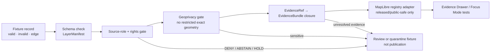

<!-- [KFM_META_BLOCK_V2]
doc_id: kfm://doc/NEEDS-VERIFICATION__data-registry-ecology-map-layers-fixtures-readme
title: data/registry/ecology/map_layers/fixtures
type: standard
version: v1
status: draft
owners: NEEDS-VERIFICATION__data-registry-owner
created: NEEDS-VERIFICATION__repo-history
updated: 2026-04-29
policy_label: NEEDS-VERIFICATION__public-or-restricted
related: [
  ./README.md,
  ../README.md,
  ../../README.md,
  ../../../README.md,
  ../../../../README.md,
  ../../../../catalog/README.md,
  ../../../../published/README.md,
  ../../../../receipts/README.md,
  ../../../../proofs/README.md,
  ../../../../quarantine/README.md,
  ../../../../../schemas/contracts/v1/layer_manifest.schema.json,
  ../../../../../schemas/contracts/v1/evidence_bundle.schema.json,
  ../../../../../schemas/contracts/v1/evidence_drawer_payload.schema.json,
  ../../../../../policy/README.md,
  ../../../../../tests/README.md
]
tags: [kfm, ecology, map-layers, fixtures, maplibre, evidence-drawer, geoprivacy, policy]
notes: [
  Target path supplied by the current documentation task.
  No mounted KFM repository was available in-session; parent links, owner coverage, created date, schema homes, and policy label need checkout verification.
  This README treats fixtures as public-safe, synthetic or reviewable examples for layer-registry validation; production releases, receipts, proofs, raw data, and sensitive exact locations are excluded.
]
[/KFM_META_BLOCK_V2] -->

<a id="top"></a>

# `data/registry/ecology/map_layers/fixtures/`

Small, public-safe fixture home for ecology map-layer registry examples that prove layer governance without becoming production data.

> [!IMPORTANT]
> **Status:** experimental  
> **Document state:** draft  
> **Owners:** `NEEDS-VERIFICATION__data-registry-owner`  
> **Path:** `data/registry/ecology/map_layers/fixtures/README.md`  
> **Policy posture:** fixtures must fail closed when rights, sensitivity, source role, or EvidenceBundle closure is unresolved.  
>
> 
> 
> 
> 
> 
> 
>
> **Quick jumps:** [Scope](#scope) · [Repo fit](#repo-fit) · [Inputs](#accepted-inputs) · [Exclusions](#exclusions) · [Fixture families](#fixture-families) · [Directory tree](#directory-tree) · [Flow](#fixture-flow) · [Validation gates](#validation-gates) · [Definition of done](#definition-of-done) · [Open verification](#open-verification)

---

## Scope

**CONFIRMED:** this document targets `data/registry/ecology/map_layers/fixtures/`.

**PROPOSED:** this directory should hold small, deterministic, reviewable fixtures for ecology map-layer registry behavior. The fixtures are intended to support validators, contract tests, MapLibre layer-registry adapters, Evidence Drawer payload checks, and promotion dry-runs.

**UNKNOWN:** the active repo’s existing parent README files, schema home, validator commands, CI workflow names, and owner rules were not visible in this session.

This directory is a **fixture lane**, not a data lifecycle stage. It may describe simulated layer records, simulated artifact metadata, or intentionally invalid cases. It must not be used to store raw source data, unpublished work products, real sensitive locations, or release-grade map artifacts.

[Back to top](#top)

---

## Repo fit

| Fit item | Target / expected path | Status | Role |
|---|---:|---|---|
| Current README | `data/registry/ecology/map_layers/fixtures/README.md` | CONFIRMED target | Orientation and fixture rules for this directory |
| Parent layer registry | [`../README.md`](../README.md) | NEEDS VERIFICATION | Expected ecology map-layer registry index |
| Ecology registry | [`../../README.md`](../../README.md) | NEEDS VERIFICATION | Expected ecology registry parent |
| Data registry | [`../../../README.md`](../../../README.md) | NEEDS VERIFICATION | Expected registry-wide source/layer routing |
| Data lifecycle root | [`../../../../README.md`](../../../../README.md) | NEEDS VERIFICATION | Expected data boundary and lifecycle overview |
| Catalog outputs | [`../../../../catalog/README.md`](../../../../catalog/README.md) | NEEDS VERIFICATION | Catalog records belong there, not here |
| Release artifacts | [`../../../../published/README.md`](../../../../published/README.md) | NEEDS VERIFICATION | Published bundles and public artifacts belong there |
| Process memory | [`../../../../receipts/README.md`](../../../../receipts/README.md) | NEEDS VERIFICATION | Run receipts belong there |
| Proof objects | [`../../../../proofs/README.md`](../../../../proofs/README.md) | NEEDS VERIFICATION | Proof packs and attestations belong there |
| Policy checks | [`../../../../../policy/README.md`](../../../../../policy/README.md) | NEEDS VERIFICATION | Rights, sensitivity, no-bypass, and publication gates |
| Tests | [`../../../../../tests/README.md`](../../../../../tests/README.md) | NEEDS VERIFICATION | Repo-native test runner and fixture assertions |

> [!NOTE]
> Keep this README linked from the parent `map_layers` README once the actual checkout confirms the parent path. If this directory is moved, preserve a migration note rather than silently orphaning fixture references.

[Back to top](#top)

---

## Accepted inputs

Only fixture material that is **small**, **reviewable**, **deterministic**, and **safe to expose in a public repository** belongs here.

| Fixture input | Belongs here when… | Required posture |
|---|---|---|
| `LayerManifest` examples | They demonstrate a valid, invalid, or edge-case ecology layer record. | Must include source role, rights state, sensitivity summary, publication state, and evidence reference posture. |
| Public-safe layer metadata | They describe a synthetic or generalized layer without embedding production data. | Must not contain exact restricted species, nest, den, roost, hibernacula, spawning, steward-controlled, or embargoed locations. |
| MapLibre style fragments | They are minimal examples used to test layer registry behavior. | Must be presentation-only and must not imply truth authority. |
| Tile or raster metadata stubs | They describe simulated PMTiles, COG, TileJSON, or artifact references. | Must not include full production PMTiles, COGs, source rasters, or generated release bundles. |
| Valid/invalid policy cases | They exercise source-role, rights, geoprivacy, evidence closure, or no-raw-path gates. | Invalid cases should be intentionally labeled and expected to fail. |
| Evidence Drawer payload references | They show how a layer would point to EvidenceBundle-backed UI payloads. | Must not include uncited claims or restricted public fields. |

[Back to top](#top)

---

## Exclusions

| Do not put here | Put it here instead | Why |
|---|---|---|
| RAW source files, live connector payloads, or downloaded source snapshots | `data/raw/`, `data/work/`, or `data/quarantine/` after source-intake rules are verified | Fixtures must not bypass the lifecycle membrane. |
| Production PMTiles, COGs, MBTiles, GeoParquet, large GeoJSON, or generated layer bundles | `data/published/` or repo-approved release artifact storage | This directory is for examples, not release payloads. |
| Receipts, proof packs, signing bundles, release manifests, or promotion decisions | `data/receipts/`, `data/proofs/`, `data/catalog/`, or release directories | Process memory and publication proof must stay separate. |
| Real exact protected-species or steward-controlled occurrence geometry | Do not commit publicly; use quarantine, redaction, generalization, or restricted access | Sensitive ecology locations fail closed. |
| Live GBIF, eBird, iNaturalist, KDWP, NatureServe, USFWS, or other connector outputs | Source-specific lifecycle lanes after rights and source-role verification | A fixture should not imply live connector readiness. |
| AI-generated summaries or Focus Mode answers | Governed API fixtures or runtime test fixtures after citation validation | AI is interpretive only and must not become root truth. |
| Test-run outputs produced by CI | `build/`, `data/receipts/`, or the repo’s generated-artifact convention | Keep this directory stable and reviewable. |

[Back to top](#top)

---

## Fixture families

The examples below are **PROPOSED fixture families**. Rename or reduce them if the mounted repo already uses a different convention.

| Family | Example fixture role | Public-safe expectation |
|---|---|---|
| `habitat_context_public` | Generalized habitat or land-cover context layer manifest | No claim of species presence by itself; method and uncertainty visible. |
| `species_status_by_county` | County-level status or conservation summary layer manifest | Legal/status authority separated from occurrence evidence. |
| `occurrence_density_grid_public` | Aggregated occurrence-density grid manifest | Minimum aggregation threshold; no exact occurrence geometry. |
| `species_richness_grid_public` | Richness summary by grid, county, watershed, or time window | Evidence support count and coverage caveats required. |
| `seasonal_support_public` | Breeding, wintering, migration, or seasonal support context | Time filter and life-stage notice required. |
| `evidence_availability_index` | Evidence coverage layer manifest | Must not imply confirmed absence or presence. |
| `data_quality_coverage` | Source coverage, freshness, and quality layer manifest | Bias, age, and source limitations visible. |
| `invalid_sensitive_exact_geometry` | Negative case for geoprivacy validators | Expected to fail or HOLD; never promoted. |
| `invalid_unknown_rights` | Negative case for rights/publication policy | Expected to DENY, ABSTAIN, or HOLD. |
| `invalid_missing_evidence_bundle` | Negative case for EvidenceBundle closure | Expected to fail evidence-resolution checks. |

[Back to top](#top)

---

## Directory tree

**PROPOSED tree — NEEDS VERIFICATION against the mounted repo before commit.**

```text
data/registry/ecology/map_layers/fixtures/
├── README.md
├── valid/
│   ├── habitat_context_public.layer_manifest.valid.json
│   ├── species_status_by_county.layer_manifest.valid.json
│   ├── occurrence_density_grid_public.layer_manifest.valid.json
│   ├── evidence_availability_index.layer_manifest.valid.json
│   └── data_quality_coverage.layer_manifest.valid.json
├── invalid/
│   ├── unknown_rights.layer_manifest.invalid.json
│   ├── missing_evidence_bundle.layer_manifest.invalid.json
│   ├── sensitive_exact_geometry.layer_manifest.invalid.json
│   ├── raw_source_path.layer_manifest.invalid.json
│   └── source_role_misuse.layer_manifest.invalid.json
└── edge_cases/
    ├── steward_review_hold.layer_manifest.edge.json
    ├── generalized_geometry.layer_manifest.edge.json
    ├── stale_source_freshness.layer_manifest.edge.json
    └── no_artifact_yet.review_payload.edge.json
```

[Back to top](#top)

---

## Fixture flow



**Invariant:** a passing fixture can prove registry behavior, but it still does not publish a layer. Publication requires the governed release path, release manifest, catalog closure, receipts, proofs, and review state.

[Back to top](#top)

---

## Minimal fixture shape

> [!NOTE]
> This skeleton is illustrative and **PROPOSED**. Validate it against the repo’s actual `LayerManifest` schema once the schema home is confirmed.

```json
{
  "schema_version": "kfm.layer_manifest.v1",
  "layer_id": "ecology.habitat_context_public.fixture",
  "domain": "ecology",
  "fixture_case": "valid",
  "fixture_only": true,
  "publication_state": "fixture_only",
  "artifact": {
    "artifact_ref": "fixtures://ecology/habitat_context_public",
    "artifact_media_type": "application/json",
    "artifact_role": "metadata_stub",
    "digest": "sha256:NEEDS_VERIFICATION_FIXTURE_DIGEST"
  },
  "source": {
    "source_ids": ["source://NEEDS_VERIFICATION_SYNTHETIC_PUBLIC_SAFE"],
    "source_role": "context_layer",
    "rights_status": "fixture_public_safe",
    "rights_review_state": "needs_verification"
  },
  "sensitivity": {
    "contains_sensitive_exact_geometry": false,
    "public_geometry_policy": "generalized_or_synthetic_only",
    "sensitivity_summary": "public_safe_fixture"
  },
  "evidence": {
    "evidence_bundle_ref": "kfm://evidence-bundle/NEEDS_VERIFICATION_FIXTURE",
    "evidence_resolution_required": true,
    "claim_support": "fixture_demonstration_only"
  },
  "map": {
    "renderer": "maplibre",
    "style_layer_type": "fill",
    "minzoom": 5,
    "maxzoom": 12,
    "legend_ref": "fixtures://ecology/habitat_context_public.legend"
  },
  "policy": {
    "expected_decision": "ALLOW",
    "fail_closed_on_unknowns": true,
    "blocked_if": [
      "unknown_rights",
      "restricted_exact_geometry",
      "missing_evidence_bundle_ref",
      "raw_or_work_path_reference",
      "source_role_misuse"
    ]
  }
}
```

[Back to top](#top)

---

## Validation gates

| Gate | Pass condition | Negative fixture should prove |
|---|---|---|
| Schema validity | Fixture conforms to the current `LayerManifest` contract. | Missing required fields fail loudly. |
| Source-role discipline | `source_role` is explicit and not overstated. | Occurrence aggregators cannot be treated as legal/status authorities. |
| Rights posture | Public fixtures have known or fixture-safe rights. | Unknown rights block public-positive fixtures. |
| Geoprivacy | Public fixtures contain no restricted exact geometry. | Sensitive exact coordinates DENY or HOLD. |
| Evidence closure | Consequential layer claims resolve to `EvidenceBundle` references. | Missing evidence refs ABSTAIN, DENY, or fail validation. |
| No lifecycle bypass | Fixtures do not reference RAW, WORK, QUARANTINE, canonical DB, or direct source APIs as public layer sources. | Raw/work paths fail. |
| Renderer boundary | MapLibre style and layer examples are presentation contracts only. | Layer or style metadata cannot assert sovereign truth. |
| Promotion dry-run | Valid fixture can participate in a no-network PASS/HOLD dry-run without publication. | Invalid fixtures never become published outputs. |

### Command targets

Actual commands are **NEEDS VERIFICATION**. Use repo-native commands if they already exist.

```bash
# NEEDS VERIFICATION — adapt to the repo's validator entrypoint.
python tools/validators/ecology/validate_layer_fixtures.py \
  data/registry/ecology/map_layers/fixtures

# NEEDS VERIFICATION — expected shape only.
python tools/validators/ecology/validate_public_safety.py \
  data/registry/ecology/map_layers/fixtures/valid
```

[Back to top](#top)

---

## Naming rules

Use names that reveal purpose, status, and expected validator outcome.

```text
<layer-family>.layer_manifest.<valid|invalid|edge>.json
<layer-family>.legend.<valid|invalid|edge>.json
<layer-family>.review_payload.<valid|invalid|edge>.json
```

Recommended conventions:

- Use `valid` only when the fixture is expected to pass all applicable checks.
- Use `invalid` when the fixture is expected to fail at least one named gate.
- Use `edge` when the expected result is HOLD, ABSTAIN, review-required, or unresolved until repo policy is confirmed.
- Keep fixture IDs deterministic and stable across refactors.
- Do not encode real sensitive locations in filenames, IDs, or embedded payloads.
- Prefer `fixture_only: true` on every fixture payload where the schema allows it.

[Back to top](#top)

---

## Maintainer workflow

1. Add or revise the smallest fixture that proves a single behavior.
2. Label the case as `valid`, `invalid`, or `edge`.
3. Keep source roles, rights state, sensitivity state, publication state, and evidence posture explicit.
4. Run schema, policy, geoprivacy, and evidence-closure checks.
5. Update parent README links and any validator registry if the fixture family is new.
6. Record unresolved repo assumptions in [Open verification](#open-verification) rather than smoothing them over.

> [!WARNING]
> Do not “fix” a failing sensitive-location fixture by weakening the policy expectation. Sensitive exact ecology locations should fail closed unless a reviewed, restricted-access path explicitly permits otherwise.

[Back to top](#top)

---

## Definition of done

- [ ] Target path exists in the mounted checkout.
- [ ] Parent README links to this fixture directory.
- [ ] Owners and `policy_label` are confirmed from repo evidence or review.
- [ ] `KFM_META_BLOCK_V2` values are updated from placeholders.
- [ ] Valid fixtures pass schema checks.
- [ ] Invalid fixtures fail the intended gate.
- [ ] Edge fixtures produce HOLD, ABSTAIN, or review-required outcomes as expected.
- [ ] No fixture contains real restricted exact locations.
- [ ] No fixture points public consumers at RAW, WORK, QUARANTINE, canonical DB, or direct model/source APIs.
- [ ] Every consequential positive fixture has an EvidenceBundle posture.
- [ ] Fixture names are deterministic and reviewable.
- [ ] Rollback is simple: remove or revert fixture files without data migration or public release impact.

[Back to top](#top)

---

## FAQ

### Are these fixtures published ecology layers?

No. They are registry examples and validation inputs. A passing fixture may support a release dry-run, but it is not itself a published layer.

### Can this directory contain real occurrence coordinates?

Not exact sensitive or steward-controlled coordinates. Use synthetic geometry, generalized geometry, aggregated grids, county-level summaries, or edge-case fixtures that intentionally prove denial.

### Can these fixtures reference MapLibre?

Yes, but only as a downstream renderer contract. MapLibre style, source, and layer examples must not become source authority, policy authority, citation authority, or publication authority.

### Can these fixtures support Focus Mode?

Only indirectly. Focus Mode should consume governed API responses and released, public-safe EvidenceBundles. Fixture payloads may test that boundary, but they should not include raw model output.

[Back to top](#top)

---

## Open verification

| Item | Status | Why it matters |
|---|---|---|
| Actual target directory exists | NEEDS VERIFICATION | Current session had no mounted repo tree. |
| Parent README locations | NEEDS VERIFICATION | Links should be adjusted to real parent docs. |
| Owner / CODEOWNERS coverage | NEEDS VERIFICATION | Metadata and impact block must reflect actual maintainers. |
| `policy_label` | NEEDS VERIFICATION | This README may be public, but some fixture payload classes may need restrictions. |
| Schema home for `LayerManifest` | NEEDS VERIFICATION | KFM materials note schema-home ambiguity in adjacent lanes. |
| Validator command names | NEEDS VERIFICATION | CI and local commands should use repo-native entrypoints. |
| Ecology layer naming convention | NEEDS VERIFICATION | Avoid parallel naming if `flora`, `fauna`, or `habitat` layers already define IDs. |
| EvidenceBundle schema path | NEEDS VERIFICATION | Positive fixtures should use the actual EvidenceBundle reference shape. |
| Geoprivacy policy package | NEEDS VERIFICATION | Sensitive ecology layer release must fail closed under the repo’s policy engine. |
| Whether fixtures belong here or under `tests/fixtures/` | NEEDS VERIFICATION | This path is suitable for registry examples; test-only fixtures may belong elsewhere. |

[Back to top](#top)

---

<details>
<summary>Appendix — review cues for new fixture files</summary>

Use this quick screen before approving a new fixture:

| Question | Safe answer |
|---|---|
| Is it small enough to review in a PR? | Yes. |
| Does it avoid real restricted exact locations? | Yes. |
| Does it identify source role and rights posture? | Yes. |
| Does it state whether it is valid, invalid, or edge-case? | Yes. |
| Does it avoid RAW, WORK, QUARANTINE, canonical DB, or direct source API references as public layer inputs? | Yes. |
| Does it keep MapLibre downstream of governance? | Yes. |
| Does it include evidence posture for consequential claims? | Yes. |
| Can it be removed without migration, publication rollback, or artifact deletion? | Yes. |

</details>
