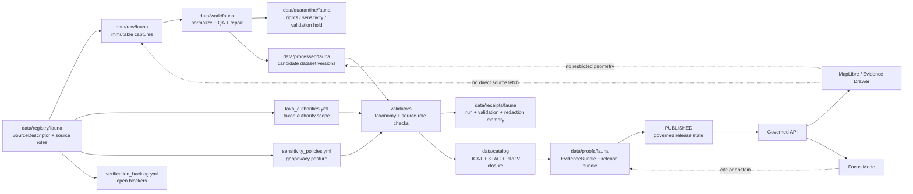

<!-- [KFM_META_BLOCK_V2]
doc_id: TODO-VERIFY(kfm://doc/<uuid>)
title: Fauna Registry
type: standard
version: v1
status: draft
owners: TODO-VERIFY(fauna-registry-owner, biodiversity-steward, policy-steward)
created: TODO-VERIFY(YYYY-MM-DD)
updated: 2026-05-01
policy_label: TODO-VERIFY(public|restricted)
related: [TODO-VERIFY:../README.md, TODO-VERIFY:../../README.md, TODO-VERIFY:../../../README.md, TODO-VERIFY:../../../docs/adr/ADR-fauna-schema-home.md, TODO-VERIFY:../../../docs/domains/fauna/README.md, TODO-VERIFY:../../../schemas/contracts/v1/fauna/README.md, TODO-VERIFY:../../../contracts/source/README.md, TODO-VERIFY:../../../policy/fauna/README.md, TODO-VERIFY:../../../tools/validators/fauna/README.md, TODO-VERIFY:../../../tests/e2e/runtime_proof/fauna/README.md, TODO-VERIFY:../../receipts/fauna/README.md, TODO-VERIFY:../../proofs/fauna/README.md]
tags: [kfm, fauna, registry, source-descriptor, source-role, geoprivacy, evidence, policy]
notes: [Directory README for data/registry/fauna, generated from attached KFM fauna and pipeline doctrine, Exact repo owner/date/policy/path inventory require mounted-repo verification, Registry files are proposed or preserved lineage unless current branch confirms them]
[/KFM_META_BLOCK_V2] -->

<a id="top"></a>

# Fauna Registry

Source-admission and control-plane registry for KFM fauna data before any fauna source, taxon authority, sensitivity rule, or public-safe derivative can move through governed pipelines.


> [!IMPORTANT]
> **Impact block**
>
> | Field | Value |
> |---|---|
> | Status | `experimental` until the mounted repository confirms file inventory, owner coverage, schema home, and validator wiring |
> | Owners | `TODO-VERIFY(fauna-registry-owner, biodiversity-steward, policy-steward)` |
> | Target path | `data/registry/fauna/README.md` |
> | Registry posture | Source roles, rights, sensitivity, cadence, authority scope, and public-release constraints must be visible before connector activation |
> | Public-safety posture | Unknown rights, unknown source role, unresolved taxonomy, or sensitive exact geometry must block public promotion |
> | Verification posture | Current implementation depth is **NEEDS VERIFICATION** until a real KFM checkout is inspected |
>
> **Quick jumps:** [Scope](#scope) · [Repo fit](#repo-fit) · [Accepted inputs](#accepted-inputs) · [Exclusions](#exclusions) · [Directory tree](#directory-tree) · [Quickstart](#quickstart) · [Usage](#usage) · [Diagram](#diagram) · [Operating tables](#operating-tables) · [Task list](#task-list-definition-of-done) · [FAQ](#faq) · [Appendix](#appendix)

---

## Scope

This directory is the **fauna source and policy-admission registry** for Kansas Frontier Matrix.

It is not a data lake, not a live source connector, not a public occurrence store, and not a policy engine. Its job is to make fauna source admission inspectable before data moves into `RAW`, `WORK`, `PROCESSED`, catalog closure, governed APIs, MapLibre layers, Evidence Drawer payloads, Focus Mode, or release gates.

This README covers the registry lane for:

- fauna source descriptors and source-role constraints;
- taxonomic authority references and crosswalk posture;
- sensitivity and geoprivacy policy inputs;
- domain partition rules for fauna object families;
- verification backlog entries that block public release or live connector activation.

**Truth posture:** `PROPOSED` directory README, grounded in attached KFM fauna doctrine and current-session workspace inspection. Actual branch inventory, ownership, and validator entrypoints remain `NEEDS VERIFICATION`.

[Back to top](#top)

## Repo fit

> [!NOTE]
> The relationship paths below are written as **TODO-VERIFY links**. Keep or correct them only after a mounted repository confirms the local tree and adjacent README locations.

| Relationship | Path from this README | Role |
|---|---:|---|
| Current file | `data/registry/fauna/README.md` | Directory landing page and registry boundary |
| Parent registry | [TODO-VERIFY: `data/registry/README.md`](../README.md) | Shared registry rules and source-admission posture |
| Data lifecycle parent | [TODO-VERIFY: `data/README.md`](../../README.md) | RAW / WORK / QUARANTINE / PROCESSED / CATALOG / PUBLISHED separation |
| Repository root | [TODO-VERIFY: root `README.md`](../../../README.md) | Project identity, governance, and repo-wide navigation |
| Fauna domain docs | [TODO-VERIFY: `docs/domains/fauna/README.md`](../../../docs/domains/fauna/README.md) | Human-readable fauna domain model and operating doctrine |
| Schema-home ADR | [TODO-VERIFY: `docs/adr/ADR-fauna-schema-home.md`](../../../docs/adr/ADR-fauna-schema-home.md) | Required before machine schemas are treated as canonical |
| Fauna schemas | [TODO-VERIFY: `schemas/contracts/v1/fauna/README.md`](../../../schemas/contracts/v1/fauna/README.md) | Machine-checkable shape for registry and downstream object families |
| Source contracts | [TODO-VERIFY: `contracts/source/README.md`](../../../contracts/source/README.md) | Human-readable source descriptor contract law |
| Policy gates | [TODO-VERIFY: `policy/fauna/README.md`](../../../policy/fauna/README.md) | Rights, sensitivity, source-role, runtime, and promotion denial rules |
| Validators | [TODO-VERIFY: `tools/validators/fauna/README.md`](../../../tools/validators/fauna/README.md) | Executable checks for registry integrity and public-safety gates |
| Runtime proof | [TODO-VERIFY: `tests/e2e/runtime_proof/fauna/README.md`](../../../tests/e2e/runtime_proof/fauna/README.md) | Fixture-first proof of ANSWER / ABSTAIN / DENY / ERROR outcomes |
| Receipts | [TODO-VERIFY: `data/receipts/fauna/README.md`](../../receipts/fauna/README.md) | Run, validation, redaction, tile-build, and rollback memory |
| Proofs | [TODO-VERIFY: `data/proofs/fauna/README.md`](../../proofs/fauna/README.md) | EvidenceBundle, release bundle, proof pack, and attestation support |

### Upstream / downstream boundary

```text
upstream intent
  docs/domains/fauna/
  docs/adr/
  contracts/source/
  schemas/contracts/v1/fauna/
  policy/fauna/

this registry
  data/registry/fauna/

downstream consumers
  source connectors
  validators
  receipts and proofs
  catalog closure
  governed APIs
  MapLibre layers
  Evidence Drawer
  Focus Mode
  promotion / rollback gates
```

[Back to top](#top)

## Accepted inputs

Only registry-grade, reviewable control-plane records belong here.

| Input family | Belongs here when it includes | Minimum posture |
|---|---|---|
| Source descriptors | `source_id`, publisher, `source_role`, authority scope, rights posture, access class, cadence, endpoints, geoprivacy flags, steward-review requirement, citation/evidence policy | `NEEDS VERIFICATION` until source terms and role are checked |
| Taxon authority references | Authority name, scope, version/date, crosswalk rules, ambiguity handling, migration notes | Ambiguous taxon matches must not silently merge |
| Sensitivity policies | Sensitivity class, public geometry behavior, redaction/generalization rules, embargo logic, steward-review triggers | Fail closed when class or rule is unknown |
| Domain partitions | Object-family ownership for taxon identity, status, occurrence, monitoring, range, habitat support, invasive/disease/mortality, and public-safe derivatives | Derived layers must not replace canonical records |
| Verification backlog | Rights gaps, source-role uncertainties, schema-home decisions, validator gaps, steward-review blockers, connector activation blockers | Clear owner or next proof needed |

### Illustrative source descriptor fragment

The exact schema path and field names are `NEEDS VERIFICATION`. Treat this as a registry intent example, not a canonical contract.

```yaml
# illustrative only — align to fauna_source.schema.json before merge
source_id: kfm://source/fauna/example
publisher: TODO-VERIFY
source_role: observed_occurrence
authority_scope: occurrence_evidence
rights_status: TODO-VERIFY(outward_safe|restricted|unknown|noassertion)
access_class: TODO-VERIFY(public|restricted|steward_only)
cadence: TODO-VERIFY
endpoints: []
geoprivacy:
  exact_public_allowed: false
  source_generalization_applied: TODO-VERIFY
steward_review_required: true
citation_policy:
  evidence_ref_required: true
  evidence_bundle_required_for_runtime: true
```

[Back to top](#top)

## Exclusions

These items do **not** belong in `data/registry/fauna/`.

| Excluded item | Why it is excluded | Expected home |
|---|---|---|
| RAW observation dumps, exports, source payloads | Registry files admit and describe sources; they do not store captured data | `data/raw/fauna/` |
| WORK-stage joins, coordinate cleaning, deduplication, repair outputs | These are transform products and QA intermediates | `data/work/fauna/` or `data/quarantine/fauna/` |
| Precise protected occurrence coordinates | Public leakage risk; governed internal access only | Restricted canonical store or controlled `data/processed/fauna/` lane after policy review |
| Public occurrence derivatives, range products, PMTiles, TileJSON | Published or publishable artifacts must be derived, cataloged, and release-gated | `data/processed/fauna/`, `data/catalog/`, `data/published/`, or release-specific homes |
| Source credentials, API keys, private URLs, tokens | Secrets do not belong in registry docs or YAML | Secret manager / deployment config |
| Executable connector code | Code should not become registry law | `packages/fauna/` or repo-confirmed package path |
| Policy-as-code | Registry inputs inform policy; they do not execute policy | `policy/fauna/` |
| Machine schemas | Registry docs reference schema; they do not define schema authority by prose | `schemas/contracts/v1/fauna/` after ADR |
| Receipts, proof packs, EvidenceBundles | Emitted artifacts support runs and release decisions | `data/receipts/fauna/`, `data/proofs/fauna/` |
| AI summaries or Focus Mode answers | AI is interpretive and must consume evidence-bound outputs | Governed API / runtime receipts / EvidenceBundle-backed response surfaces |

[Back to top](#top)

## Directory tree

`PROPOSED` starter tree. Do not treat these files as present until the active branch confirms them.

```text
data/registry/fauna/
├── README.md
├── sources.yml
├── taxa_authorities.yml
├── sensitivity_policies.yml
├── domain_partitions.yml
└── verification_backlog.yml
```

Optional future subdivision may be useful once the lane grows, but should wait until the first flat registry files become hard to maintain:

```text
data/registry/fauna/
├── source_families/
│   ├── legal_status.yml
│   ├── occurrence_aggregators.yml
│   ├── community_science.yml
│   ├── monitoring.yml
│   └── invasive_disease_mortality.yml
└── steward_review/
    └── README.md
```

[Back to top](#top)

## Quickstart

Use this as an inspection path, not as proof that validators already exist.

```bash
# 1. Confirm that you are in a mounted KFM checkout.
git status --short

# 2. Inspect the fauna registry lane.
find data/registry/fauna -maxdepth 2 -type f | sort

# 3. Confirm the schema-home decision before treating machine files as canonical.
test -f docs/adr/ADR-fauna-schema-home.md

# 4. Run the fauna registry validator when the repo confirms its entrypoint.
python tools/validators/fauna/validate_registry.py data/registry/fauna
```

Expected outcomes:

| Check | Expected result |
|---|---|
| `git status --short` | Shows branch state without fatal Git errors |
| registry file scan | Confirms this README and any registry YAML files present |
| schema-home ADR check | Passes before machine schemas are promoted beyond fixtures |
| registry validator | Fails closed on unknown `source_role`, unknown rights, missing evidence policy, or unsafe public exact geometry |

[Back to top](#top)

## Usage

### Add or revise a fauna source

1. Confirm the source family and intended role.
2. Record `source_role`, `authority_scope`, `rights_status`, `access_class`, cadence, and geoprivacy posture.
3. Link the source to the relevant schema and policy gate.
4. Add verification backlog entries for unresolved terms, licenses, cadence, or steward review.
5. Keep live connector activation blocked until source terms and registry validation pass.

> [!WARNING]
> Occurrence aggregators and community-science feeds can support occurrence evidence. They must not be treated as legal-status authorities unless a source descriptor and authority scope explicitly support that role.

### Add or revise a sensitivity rule

1. Identify the sensitivity class.
2. Define the allowed public geometry behavior.
3. Require redaction/generalization receipts for public derivatives.
4. Confirm the rule is enforced by `policy/fauna/` and tested by negative fixtures.
5. Update the verification backlog when steward review, embargo, or legal rules remain unresolved.

### Add or revise a taxon authority

1. Record authority scope and version/date.
2. Define whether the authority supports accepted names, synonyms, crosswalks, legal status, conservation rank, or all of these.
3. Define ambiguity handling.
4. Require migration mappings when a deterministic taxon identity changes.
5. Block promotion when taxon resolution is ambiguous or unresolved.

[Back to top](#top)

## Diagram



[Back to top](#top)

## Operating tables

### Registry file map

| File | Purpose | Required update triggers | Status |
|---|---|---|---|
| `README.md` | Directory boundary, repo fit, and review expectations | Any source-role, sensitivity, schema-home, validator, policy, API, or promotion behavior change | `draft` |
| `sources.yml` | Source descriptor registry for fauna source families | New source, role change, rights change, cadence change, endpoint change, steward-review change | `PROPOSED / NEEDS VERIFICATION` |
| `taxa_authorities.yml` | Taxonomic authority and crosswalk registry | New authority, synonym/crosswalk policy change, taxon identity migration | `PROPOSED / NEEDS VERIFICATION` |
| `sensitivity_policies.yml` | Sensitivity class and geoprivacy input registry | New class, public geometry rule change, embargo/steward rule change | `PROPOSED / NEEDS VERIFICATION` |
| `domain_partitions.yml` | Fauna object-family boundary map | New fauna subdomain, ownership change, cross-domain habitat/fauna relation change | `PROPOSED / NEEDS VERIFICATION` |
| `verification_backlog.yml` | Reviewable blocker register | Any unresolved rights, source, sensitivity, schema, steward, or connector question | `PROPOSED / NEEDS VERIFICATION` |

### Source-role guardrails

| Source role | Can support | Must not silently support |
|---|---|---|
| `legal_status_authority` | Legal or regulatory species status within declared jurisdiction and date scope | Occurrence proof, range proof, habitat proof |
| `conservation_status_authority` | Conservation rank or status assertion within declared authority scope | Legal status unless separately authorized |
| `observed_occurrence` | Observation or specimen occurrence evidence with event time and spatial support | Legal status, true absence, exact public precision when sensitivity blocks it |
| `modeled_range` | Range or seasonal support model with provenance and uncertainty | Observed occurrence without supporting evidence |
| `habitat_context` | Habitat/covariate support for a fauna claim or derived join | Species presence as canonical truth |
| `monitoring_effort` | Survey, route, transect, protocol, or effort context | Occurrence certainty without detection evidence |
| `invasive_disease_mortality` | Invasive species, disease/pathogen, mortality, or incident evidence | General species distribution without scoped evidence |
| `steward_restricted_record` | Controlled-access record requiring review | Public exact geometry or public unrestricted API payload |

### Sensitivity classes

| Sensitivity class | Meaning | Public geometry behavior |
|---|---|---|
| `public_exact_allowed` | Non-sensitive record with rights and source policy allowing exact geometry | Exact geometry may publish with evidence and rights |
| `public_generalized` | Public release allowed only at county, grid, watershed, bbox, or other generalized support | Generalized or aggregated geometry with redaction receipt |
| `restricted_precise` | Precise coordinates protected by taxon, source, steward, or policy | No public precise geometry |
| `embargoed` | Temporal delay required for observation, nesting, roosting, monitoring, or other event | No public record until embargo release, or public summary only |
| `steward_review_required` | Human/steward decision required before release class is assigned | `HOLD`; no public promotion |
| `quarantine` | Rights, sensitivity, taxonomy, geometry, source role, or validation unresolved | `QUARANTINE`; not public |

### Promotion blockers

| Blocker | Default decision | Registry action |
|---|---|---|
| Unknown `source_role` | `DENY` public authority use | Add or correct source descriptor and role |
| Unknown rights or record-level license | `DENY` public promotion | Add rights verification backlog item |
| Sensitive exact geometry in public payload | `DENY` release | Add geoprivacy rule and redaction receipt requirement |
| Ambiguous taxon resolution | `HOLD` / `ABSTAIN` | Add taxon authority/crosswalk review |
| Missing EvidenceBundle linkage | `ABSTAIN` runtime answer | Add evidence reference policy and catalog closure |
| Live connector without source verification | `BLOCK` activation | Keep synthetic/no-network fixture path only |
| Missing schema-home ADR | `BLOCK` canonical schema promotion | Complete `ADR-fauna-schema-home.md` |

[Back to top](#top)

## Task list: definition of done

The fauna registry can move from `experimental` toward `active` only when these checks are satisfied.

- [ ] **Repo inventory complete:** mounted checkout confirms `data/registry/fauna/` path, owner coverage, adjacent README pattern, and branch state.
- [ ] **Schema-home ADR complete:** `contracts/fauna` versus `schemas/contracts/v1/fauna` is resolved without parallel schema drift.
- [ ] **Registry files present:** `sources.yml`, `taxa_authorities.yml`, `sensitivity_policies.yml`, `domain_partitions.yml`, and `verification_backlog.yml` exist or are explicitly deferred.
- [ ] **Registry schema exists:** source, taxon authority, sensitivity policy, and verification backlog entries are machine-checkable.
- [ ] **Validator emits reports:** registry validation produces machine-readable PASS / HOLD / DENY reports.
- [ ] **Negative fixtures pass:** unknown rights, unknown source role, source-role misuse, and sensitive exact public geometry are denied.
- [ ] **Synthetic-only first slice works:** no-network fixtures can move through source descriptor → RAW → WORK → PROCESSED → catalog closure → EvidenceBundle → promotion dry-run.
- [ ] **No live connector activated:** GBIF, eBird, iNaturalist, KDWP-like, USFWS-like, NatureServe-like, or other source connectors remain disabled until terms and source roles are verified.
- [ ] **Geoprivacy enforced:** public derivatives require redaction/generalization receipts and cannot expose restricted precise geometry.
- [ ] **Docs updated with behavior:** any registry, schema, policy, source, API, UI, or promotion behavior change updates this README or its owning index.
- [ ] **Rollback path recorded:** registry changes can be reverted without deleting receipts, proofs, or correction history.

[Back to top](#top)

## FAQ

### Why does this registry fail closed?

Fauna data can expose protected species locations, nest/den/roost/hibernacula/spawning sites, steward-controlled records, and rights-restricted observations. Unknown source role, rights, sensitivity, or taxonomy is not a harmless gap; it can change whether a public claim is safe or valid.

### Can this directory contain eBird, GBIF, iNaturalist, KDWP-like, or USFWS-like data?

It can contain reviewed source descriptors and source-admission metadata for those families. It must not contain raw source payloads, precise restricted occurrence geometry, credentials, or unverified live connector outputs.

### Does a public occurrence density grid prove species absence?

No. Aggregated public layers are derived public-safe support surfaces. They must carry source coverage, bias, temporal scope, and evidence support. Lack of a public signal is not proof of absence.

### Can Focus Mode answer fauna questions directly from this registry?

No. Focus Mode must consume governed runtime outputs and EvidenceBundle-backed context. The registry can help define source roles and policy posture, but generated language is never root truth.

### What should happen when a taxon name changes?

Do not silently churn identifiers. Record authority version, crosswalk/migration mapping, alternatives considered, and a taxon-resolution receipt. Ambiguous or unresolved mappings hold promotion.

[Back to top](#top)

## Appendix

<details>
<summary>Registry entry checklist</summary>

A fauna registry entry should be reviewable without opening source code.

Minimum review questions:

- What source or authority is being admitted?
- What role is it allowed to play?
- What role is it not allowed to play?
- What rights or license posture governs public use?
- What spatial precision can be served publicly?
- What temporal scope or cadence applies?
- Does steward review apply?
- What evidence reference policy is required?
- What validation, receipt, proof, and rollback objects should exist downstream?
- What open verification item blocks promotion?

</details>

<details>
<summary>Connector activation checklist</summary>

A live connector should remain blocked until:

- source descriptor is complete;
- source rights and terms are verified;
- source role and authority scope are constrained;
- geoprivacy flags are explicit;
- no-network fixture tests pass;
- connector smoke tests do not publish;
- unknown rights deny public promotion;
- sensitive exact geometry cannot enter public outputs;
- receipts and validation reports are emitted;
- catalog closure and EvidenceBundle linkage are proven;
- rollback target is recorded.

</details>

<details>
<summary>Public release checklist</summary>

A fauna-derived public release should require:

- registry validation report;
- schema validation report;
- source-role policy report;
- rights policy report;
- geoprivacy report;
- redaction/generalization receipt where applicable;
- catalog closure: DCAT + STAC + PROV;
- EvidenceBundle resolution;
- release bundle or ReleaseManifest;
- promotion decision;
- rollback reference;
- correction lineage if superseding prior output.

</details>

[Back to top](#top)
