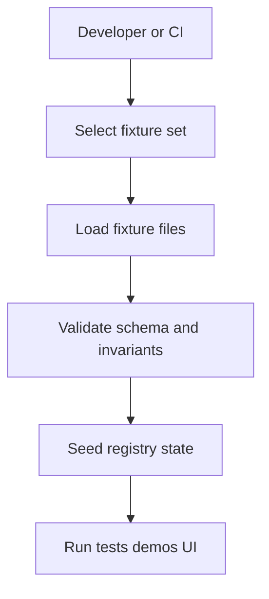

<!-- [KFM_META_BLOCK_V2]
doc_id: kfm://doc/2f9c1e5a-2d5f-4b47-a8f5-8b403d31546e
title: Registry Fixtures
type: standard
version: v1
status: draft
owners: TBD
created: 2026-02-24
updated: 2026-02-24
policy_label: internal
related:
  - ../README.md
  - ../schema/README.md
  - ../registry/README.md
  - ../../governance/README.md
tags: [kfm, data-registry, fixtures]
notes:
  - Deterministic, policy-safe datasets used to seed and test the Data Registry.
  - Do not store real PII or sensitive coordinates in fixtures.
[/KFM_META_BLOCK_V2] -->

# Registry Fixtures

Deterministic, policy-safe fixture datasets used to seed, test, and demo the **Data Registry**.


> ⚠️ **WARNING**
> Fixtures must be **synthetic, anonymized, or non-sensitive**. Never commit real PII, secrets, access tokens, or precise coordinates for vulnerable/private/culturally restricted locations.

---

## Quick navigation

- [Purpose](#purpose)
- [Where this fits](#where-this-fits)
- [What goes here](#what-goes-here)
- [What must not go here](#what-must-not-go-here)
- [Recommended directory structure](#recommended-directory-structure)
- [Fixture manifest](#fixture-manifest)
- [How fixtures are used](#how-fixtures-are-used)
- [Adding or updating fixtures](#adding-or-updating-fixtures)
- [Validation checklist](#validation-checklist)
- [Governance and safety](#governance-and-safety)

---

## Purpose

This folder holds **fixture datasets** that make local development, CI, demos, and regression tests reproducible.

A fixture is a *small, deterministic snapshot* of registry-relevant data (and optional related artifacts) that can be loaded into a test/dev instance of the registry.

Design goals:

- **Deterministic:** the same fixture produces the same registry state.
- **Minimal:** only what’s required to exercise a scenario.
- **Readable:** humans can review and reason about changes in PRs.
- **Policy-safe:** fixtures must not weaken the trust membrane (no sensitive leakage).

[Back to top](#registry-fixtures)

---

## Where this fits

Fixtures are part of the **developer and CI ergonomics layer**:

- They should generally map to **Raw/Work/Test** usage—not **Published** distribution.
- They support **governed APIs** and UI demos by providing stable, known registry states.
- They are governed artifacts: every change should be reviewable, reversible, and traceable.

> NOTE
> If your repository has a formal zone model (Raw → Work/Quarantine → Processed → Published), fixtures typically belong outside Published and should be treated as **test assets**.

[Back to top](#registry-fixtures)

---

## What goes here

Put fixture data that:

- Is used to **seed** the Data Registry for tests/dev/demo.
- Is **small enough** to review in a pull request.
- Has **clear provenance** (even if synthetic): who created it, why it exists, and what scenario it supports.
- Can be validated with lightweight checks (schema, referential integrity, row counts).

### Accepted fixture formats

> These are *recommended* formats. Your repo may support a subset.

| Format | Typical use | Notes |
|---|---|---|
| `*.json` | DTO-like records, small lists | Easy to diff; keep stable ordering. |
| `*.yaml` / `*.yml` | Manifests, metadata, configs | Prefer for human-edited manifests. |
| `*.csv` | Tabular test data | Include header row; avoid locale-dependent formatting. |
| `*.geojson` | Spatial fixtures | Avoid sensitive/targetable locations; consider coarse geometry. |
| `*.ndjson` | Large-ish record streams | Use only when needed; keep files small. |

[Back to top](#registry-fixtures)

---

## What must not go here

Do **not** commit:

- **Secrets**: API keys, tokens, credentials, private URLs.
- **Real PII**: names, emails, phone numbers, addresses, identifiers.
- **Sensitive geospatial data**: precise coordinates for vulnerable/private/culturally restricted sites.
- **Large dumps**: anything that makes reviews slow or bloats the repo.
- **Unlicensed third‑party data**: if you didn’t create it, include license/provenance and ensure it’s allowed.

If you need realism:

- Use **synthetic generation** or **masked/anonymized** samples.
- Prefer **coarse locations** (e.g., county/state level) instead of exact coordinates.

[Back to top](#registry-fixtures)

---

## Recommended directory structure

This is a **template** (illustrative). Adjust to match your repo conventions.

```
data/registry/fixtures/                            # Registry fixtures (deterministic test sets for CI + local dev)
├─ README.md                                       # How fixture sets are used, naming rules, and update workflow
│
├─ manifest/                                       # Fixture manifest (authoritative index + digests)
│  └─ fixtures.manifest.yaml                       # Lists fixture files/sets + expected digests/metadata
│
└─ sets/                                           # Curated fixture sets (each set is a self-contained scenario)
   ├─ minimal/                                     # Minimal registry set (fast smoke validation)
   │  ├─ registry.sources.json                     # Minimal sources registry fixture
   │  └─ registry.datasets.json                    # Minimal datasets registry fixture
   │
   └─ demo_spatial/                                # Demo spatial set (adds geometry + provenance linkage)
      ├─ registry.datasets.geojson                 # Dataset registry with spatial extents (demo)
      └─ registry.provenance.json                  # Provenance registry fixture (links datasets ↔ runs ↔ artifacts)
```

Suggested structure conventions:

- **`manifest/`**: one or more manifest files describing fixture sets.
- **`sets/<fixture_set_id>/`**: each set is self-contained, with the smallest data needed for a scenario.
- **Stable ordering**: keep lists sorted (by `id`) for clean diffs.

[Back to top](#registry-fixtures)

---

## Fixture manifest

A fixture manifest is the contract between fixture files and the code that loads/validates them.

If your repo already has a manifest format, use it.

If not, here is a **recommended** minimal schema (YAML):

```yaml
# data/registry/fixtures/manifest/fixtures.manifest.yaml
version: 1
fixture_sets:
  - id: minimal
    description: Minimal registry state for unit tests
    intended_use: [unit_test, local_dev]
    sensitivity: public_synthetic
    license: internal
    owners: ["TBD"]
    files:
      # ordered load where relevant
      - path: sets/minimal/registry.sources.json
        kind: registry_sources
      - path: sets/minimal/registry.datasets.json
        kind: registry_datasets
    expectations:
      # cheap checks that catch accidental drift
      min_records:
        registry_sources: 1
        registry_datasets: 1
      invariants:
        - "all dataset.source_id values resolve"
        - "ids are unique per kind"
    notes:
      - "Synthetic only; safe for CI logs"
```

Recommendations:

- Treat `id` as a **stable API** (tests and docs will reference it).
- Include a **sensitivity** label. Default to the safest setting.
- Include **expectations/invariants** to prevent silent fixture drift.

[Back to top](#registry-fixtures)

---

## How fixtures are used

Fixtures usually flow through a loader/validator into a local or CI registry instance.



Common use cases:

- Unit/integration tests that assume a known registry state.
- Golden-path demos for UI/Story/Map flows.
- Regression tests for migrations, importers, and provenance logic.

[Back to top](#registry-fixtures)

---

## Adding or updating fixtures

1. **Choose or create** a fixture set directory under `sets/`.
2. Add or edit the fixture files.
3. Update the manifest (`manifest/fixtures.manifest.yaml` or repo equivalent).
4. Run validation (repo-specific).
5. Ensure diffs are **reviewable** and the scenario intent is documented.
6. In your PR description, include:
   - What scenario changed and why
   - Any downstream test changes
   - Any policy/sensitivity notes

### Naming conventions

Keep file names descriptive and stable:

- Prefer `registry.<kind>.<ext>` for single-kind files (e.g., `registry.datasets.json`).
- Prefer `registry.<kind>__<scenario>.<ext>` when multiple variants exist.
- When structure-breaking changes happen, bump a suffix (e.g., `__v2`).

[Back to top](#registry-fixtures)

---

## Validation checklist

Use this checklist when adding/changing fixtures.

- [ ] **No secrets** committed.
- [ ] **No real PII** (including “harmless” emails/phone numbers).
- [ ] **No precise vulnerable locations** (coarsen or synthesize).
- [ ] Fixture set is **minimal** (remove unused fields/rows).
- [ ] Files are **sorted** for stable diffs (by `id`, then `name`).
- [ ] IDs are **unique** within each entity kind.
- [ ] References are **resolvable** (foreign keys resolve inside the set).
- [ ] Manifest updated with description + intended_use + sensitivity.
- [ ] Expectations/invariants updated to prevent drift.

> TIP
> If you need a larger dataset for performance testing, consider generating it on-the-fly in CI rather than committing it.

[Back to top](#registry-fixtures)

---

## Governance and safety

Fixtures are treated as governed artifacts because they can:

- Affect user-facing demos and narratives (Story/Map UI)
- Influence tests and downstream behavior
- Accidentally leak sensitive information if mishandled

Minimum governance expectations:

- **Reviewable diffs**: keep fixtures small and readable.
- **Traceability**: use the manifest to record intent, ownership, and sensitivity.
- **Default-deny**: if sensitivity is unclear, do not include the data until reviewed.

If your project uses promotion gates:

- Fixtures should not be promoted as “Published data.”
- If a fixture is derived from a real dataset, document the transformation and ensure license + redaction requirements are met.

[Back to top](#registry-fixtures)
