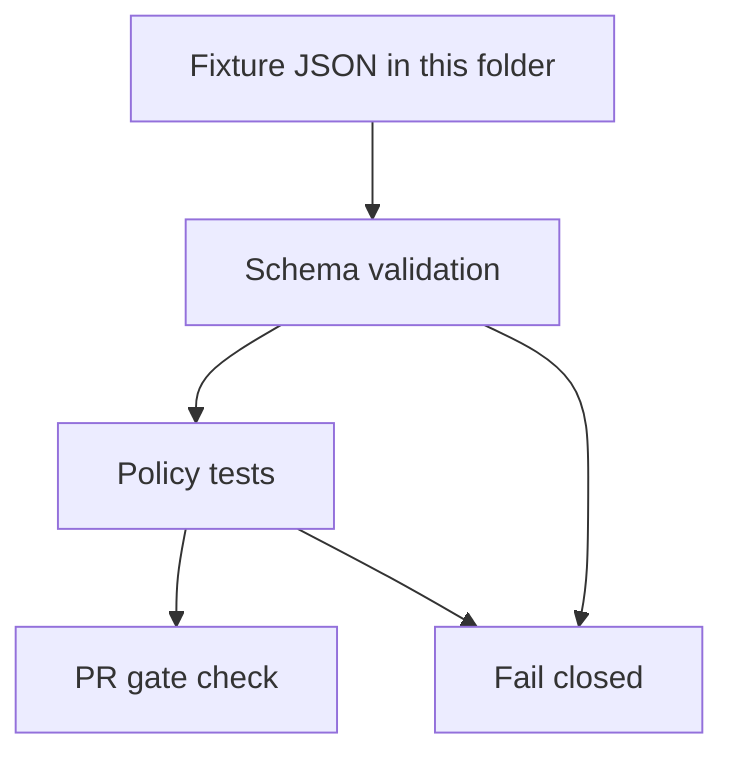

<!-- [KFM_META_BLOCK_V2]
doc_id: kfm://doc/ac9693c7-b8da-4e65-b9b3-ee138a64e351
title: Manifest fixtures
type: guide
version: v1
status: draft
owners: TODO
created: 2026-02-24
updated: 2026-02-24
policy_label: public
related:
  - schemas/run_manifest.v1.schema.json
  - policy/opa/receipts_pr_gate.rego
tags: [kfm, registry, fixtures, manifest, run_manifest]
notes:
  - Golden JSON fixtures for validating the run_manifest promotion contract.
[/KFM_META_BLOCK_V2] -->

# Manifest fixtures

Golden JSON fixtures for validating the **Run Manifest** (`run_manifest`) contract and its **fail-closed** promotion gates.


> **TODO:** Replace these placeholder Shields.io badges with repo-local workflow / CODEOWNERS badges once paths are confirmed.

---

## Quick navigation

- [Purpose](#purpose)
- [What lives here](#what-lives-here)
- [Where this fits in KFM](#where-this-fits-in-kfm)
- [Directory layout](#directory-layout)
- [Fixture rules](#fixture-rules)
- [Run Manifest shape](#run-manifest-shape)
- [Coverage matrix](#coverage-matrix)
- [How fixtures are used](#how-fixtures-are-used)
- [Adding a new fixture](#adding-a-new-fixture)
- [Running the checks](#running-the-checks)
- [Troubleshooting](#troubleshooting)
- [Related](#related)

---

## Purpose

This directory exists to keep **contract + policy enforcement testable and deterministic**:

- Validate that `run_manifest` examples **conform to JSON Schema** before they ever reach a gate.
- Validate that **OPA/Conftest policy gates** behave as intended using **golden pass/fail** fixtures.
- Prevent “silent drift” in what the system considers promotable: if the schema or policy changes, fixtures should fail until explicitly updated.

---

## What lives here

### Acceptable inputs

- **Small** JSON documents representing `run_manifest` objects (typically “v1”).
- Fixtures that represent both:
  - **Pass** cases (valid, promotable-shaped manifests)
  - **Fail** cases (invalid shape, missing required evidence, wrong types, etc.)
- Synthetic or sanitized values:
  - digests like `sha256:<hex>`
  - placeholder `rekor_uuid`
  - dummy `oci://...@sha256:<digest>` references

### Exclusions

- ❌ Real raw/processed data artifacts (those belong in lifecycle zones, not fixtures)
- ❌ Secrets (tokens, cookies, API keys), internal URLs, or credentials
- ❌ PII / sensitive-location details (fixtures should be “public-safe” by default)
- ❌ Large blobs (fixtures should be diff-friendly and fast in CI)

> **NOTE:** If you need to reproduce a real-world failure, extract the *structure* into a fixture, not the original sensitive content.

---

## Where this fits in KFM

Fixtures in this folder are part of the **trust membrane**:

- **Schemas** define what “counts” as a `run_manifest`.
- **Policies** decide whether a manifest is acceptable for a given operation (merge/promotion).
- **Fixtures** are the regression suite that ensures both behave consistently over time.

---

## Directory layout

> This is the **recommended** layout. Your repo may vary — adjust to match your test harness.

```text
data/registry/fixtures/manifest/                     # Manifest fixtures (schema + policy gate test vectors)
├─ README.md                                        # How fixtures are used, naming rules, and CI expectations
│
└─ v1/                                              # Fixture set for manifest v1 (keep stable)
   ├─ pass/                                         # Must pass schema + policy gates
   │  ├─ minimal.valid.json                         # Minimal valid manifest
   │  └─ with_attestations.valid.json               # Valid manifest including attestations/signatures
   │
   └─ fail/                                         # Must fail (schema or policy); filename states the reason
      ├─ missing_spec_hash.invalid.json             # Invalid: missing spec_hash
      ├─ missing_rights.invalid.json                # Invalid: missing rights/license terms
      ├─ missing_rekor_uuid.invalid.json            # Invalid: missing Rekor UUID (if required)
      ├─ empty_signatures.invalid.json              # Invalid: signatures present but empty/invalid
      └─ …                                          # Add more failures as new incident regressions appear
```

---

## Fixture rules

### 1) Make pass/fail intent obvious

Prefer filenames that encode **expected outcome** and **reason**:

- `pass/<scenario>.valid.json`
- `fail/<reason>.invalid.json`

### 2) Fail-closed mindset

If you’re unsure whether a field is required, assume it **is required** and create a fixture that proves it:
- One **pass** fixture showing the minimal acceptable payload.
- One **fail** fixture demonstrating what must be rejected.

### 3) Keep fixtures minimal

- One concern per fixture where possible.
- Avoid “mega fixtures” that make it hard to see what changed.

### 4) Use digest-addressed placeholders

Wherever content identity is referenced, prefer digest-like placeholders (e.g., `sha256:<digest>`) so fixtures match the project’s “pin by digest” posture.

---

## Run Manifest shape

Below is a **representative** `run_manifest` shape used for promotion/PR gating.

```json
{
  "dataset": "example.dataset",
  "run_id": "2026-02-02T12:00Z-abc123",
  "spec_hash": "sha256:...",
  "input_sha256": "sha256:...",
  "rekor_uuid": "c7f2...e1",
  "rights": {
    "license": "...",
    "attribution": "...",
    "redistribution": "..."
  },
  "produced_artifacts": ["oci://...@sha256:<digest>"],
  "materiality_delta": 0.03,
  "publish_candidate": true,
  "signatures": ["..."],
  "attestations": ["oci://..."]
}
```

---

## Coverage matrix

Use this matrix to ensure the folder has **regression coverage** for the key invariants that gates rely on.

| Invariant / requirement | Why it matters | Suggested fixtures (examples) |
|---|---|---|
| `spec_hash` present | Stable identity; gating requires it | `pass/minimal.valid.json`, `fail/missing_spec_hash.invalid.json` |
| `rekor_uuid` present | Transparency log reference for signed artifacts | `fail/missing_rekor_uuid.invalid.json` |
| `rights.*` present | License/attribution/redistribution captured before publish | `fail/missing_rights.invalid.json` |
| `signatures` non-empty | “No unsigned promotion” posture | `pass/with_signatures.valid.json`, `fail/empty_signatures.invalid.json` |
| `attestations` present | Provenance/attestation verification before allowing links | `pass/with_attestations.valid.json`, `fail/missing_attestations.invalid.json` |
| `produced_artifacts` digest-addressed | Prevent tag drift; make verification unambiguous | `pass/digest_pinned.valid.json` |

<details>
  <summary><strong>Appendix: designing a “fail” fixture</strong></summary>

A good fail fixture does **one** thing wrong:

- remove a required field (`spec_hash`)
- change a type (`materiality_delta` from number → string)
- violate a policy constraint (empty `signatures` array)

This keeps failure diffs small and makes policy deny messages easier to interpret.

</details>

---

## How fixtures are used

A typical CI flow for these fixtures looks like:



**Schema validation** blocks malformed manifests early.  
**Policy tests** ensure “deny-by-default” gates only allow manifests that include the required evidence.

---

## Adding a new fixture

1. Pick the scenario (what are you trying to prove?).
2. Decide expected outcome:
   - **Pass**: should validate and be accepted by gates.
   - **Fail**: should be rejected (schema or policy).
3. Create the smallest JSON file that demonstrates the scenario.
4. Add it under `v1/pass/` or `v1/fail/`.
5. (Recommended) Add/adjust policy unit tests so the fixture is asserted explicitly.

### Fixture PR checklist

- [ ] Added at least one **pass** and one **fail** fixture for the change
- [ ] Fixtures contain **no secrets** and are safe to publish
- [ ] Schema validation runs on fixtures in CI
- [ ] Policy unit tests reference fixtures (“golden” regression coverage)
- [ ] Filenames explain the reason for failure clearly

---

## Running the checks

> Exact commands depend on your tooling, but the common pattern is:
> **schema validate → policy test → gate**.

Examples (adjust paths to your repo):

```bash
# 1) JSON Schema validation (example with AJV)
ajv validate \
  -s schemas/run_manifest.v1.schema.json \
  -d "data/registry/fixtures/manifest/v1/**/*.json"

# 2) Policy tests (example with Conftest)
conftest test "data/registry/fixtures/manifest/v1" -p policy/opa
```

---

## Troubleshooting

- **Schema failures**: check required fields, types, and `additionalProperties` rules.
- **Policy failures**: read the deny messages — fixtures should make the reason obvious.
- **Flaky tests**: fixtures must be deterministic; remove timestamps or random IDs unless they are explicitly required.

---

## Related

> Paths below are **expected companions** for this directory; verify the exact locations in your repo.

- `schemas/run_manifest.v1.schema.json` (Run Manifest contract)
- `policy/opa/receipts_pr_gate.rego` (merge/promotion gate)
- `.github/workflows/pr-verify-receipts.yml` (CI wiring)
- `docs/` governance & promotion contract docs

---

[Back to top](#manifest-fixtures)
