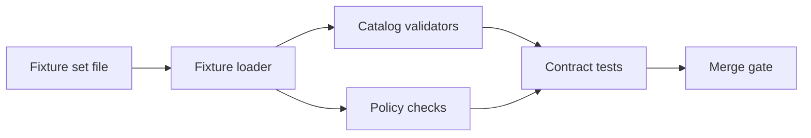

<!-- [KFM_META_BLOCK_V2]
doc_id: kfm://doc/7436af5a-7027-43b0-af8e-11324e3cc991
title: Registry Fixture Sets
type: standard
version: v1
status: draft
owners: <TODO: kfm-maintainers>
created: 2026-02-24
updated: 2026-02-24
policy_label: public
related:
  - <TODO: link to fixture loader docs>
  - <TODO: link to registry contract docs>
tags: [kfm, registry, fixtures, tests]
notes:
  - Synthetic fixture *set* definitions used for deterministic CI + local testing.
  - Keep this directory safe-to-share (no secrets, no real sensitive locations).
[/KFM_META_BLOCK_V2] -->

# Registry Fixture Sets


Curated collections of **dataset-registry** fixture cases used by CI and local development.

> **WARNING**
> These fixtures must be **synthetic**. Do **not** include secrets, personal data, or real sensitive locations.
> If you need to test restricted/sensitive behavior, do it with *synthetic* records + expected allow/deny outcomes.

---

## Quick navigation

- [Purpose](#purpose)
- [Where this fits](#where-this-fits)
- [Directory layout](#directory-layout)
- [Fixture set contract](#fixture-set-contract)
- [How sets are used](#how-sets-are-used)
- [Adding or updating a set](#adding-or-updating-a-set)
- [Definition of done](#definition-of-done)
- [Appendix: example fixture set file](#appendix-example-fixture-set-file)

---

## Purpose

A **fixture set** is a small, named bundle of fixture references that represents a coherent scenario, such as:

- a minimal “public-only” registry (smoke tests)
- a mixed-policy registry (filtering behavior)
- a “bad catalog” set (schema validation must fail)
- a “rights missing” set (promotion gates must fail closed)

Fixture sets exist so multiple test suites can run **the same scenarios** consistently:
registry loading, catalog validation, policy checks, and API contract tests.

[Back to top](#quick-navigation)

---

## Where this fits

This directory lives under:

- `data/registry/fixtures/sets/`

It is intended to support deterministic testing for:

- **Dataset registry + discovery endpoints** (e.g., ensuring results are filtered by policy label and include stable version identifiers).
- **Catalog validators** (DCAT / STAC / PROV profiles).
- **Policy fixture tests** (allow/deny + obligations) that must match CI and runtime semantics.

> **NOTE**
> In KFM, catalogs and policy are treated as contract surfaces and must be validated strictly.
> These fixture sets are one of the safest places to encode “known good” and “known bad” examples.

[Back to top](#quick-navigation)

---

## Directory layout

> Directory Documentation Standard (summary):
> - keep it scannable
> - define what belongs here
> - define exclusions

### Tree

```text
data/registry/fixtures/
  sets/
    README.md
    <set_id>.yml          # preferred: YAML fixture set definition
    <set_id>.json         # allowed: JSON fixture set definition
```

### What belongs here

- Small, text-based fixture set definitions (`.yml` / `.json`).
- Only references to fixture *documents* stored elsewhere (commonly a sibling directory such as `../items/` or `../cases/`).

### What must NOT go here

- Large binary artifacts (GeoTIFFs, Parquet, MBTiles, etc.).
- Real dataset dumps or production exports.
- Secrets, API keys, credentials, tokens.
- Anything requiring restricted handling (unless fully synthetic and explicitly approved by governance).

[Back to top](#quick-navigation)

---

## Fixture set contract

This repo may already enforce a fixture-set schema. If not, **this README defines the v1 contract**.

### Required fields (v1)

| Field | Type | Required | Notes |
|------|------|----------|------|
| `kfm_fixture_set_version` | string | ✅ | Must be `v1` for this contract |
| `set_id` | string | ✅ | Stable identifier (prefer lowercase + `_` / `-`) |
| `title` | string | ✅ | Short human name |
| `description` | string | ✅ | What scenario does this represent? |
| `fixtures[]` | array | ✅ | References to fixture documents |
| `expectations` | object | ⛔️ | Optional: expected allow/deny + obligations |

### Fixture reference fields

Each entry in `fixtures[]` must contain:

| Field | Type | Required | Notes |
|------|------|----------|------|
| `fixture_id` | string | ✅ | Stable identifier within the set |
| `kind` | string | ✅ | e.g., `dcat_dataset`, `stac_collection`, `prov_bundle`, `run_receipt` |
| `path` | string | ✅ | Repo-relative path to the fixture document |
| `policy_label` | string | ⛔️ | Optional: declared label for the fixture (public/internal/restricted/...) |

### Optional expectations

If your tests support it, include an `expectations` block. Typical uses:

- assert registry filtering by policy label
- assert “no restricted leakage” for a public user context
- assert obligations (e.g., “redact_coordinates”)

[Back to top](#quick-navigation)

---

## How sets are used

At a high level, fixture sets support a common workflow:



### Expected invariants

- **Deterministic**: ordering and results should not depend on wall-clock time or network.
- **Small**: fast enough to run in PR CI.
- **Safe**: synthetic-only; avoid sensitive content.

[Back to top](#quick-navigation)

---

## Adding or updating a set

1. Create or update a set file: `data/registry/fixtures/sets/<set_id>.yml`
2. Add/adjust referenced fixture documents (wherever your repo stores them).
3. Add/adjust the tests that exercise the set (policy tests, validator tests, API contract tests).
4. Run the validation harness locally (repo-specific).
5. Ensure CI runs the set (or that the set is included in a known test matrix).

### Repo wiring checklist (minimum verification)

- [ ] Locate the fixture loader implementation and confirm the expected file extension and schema.
- [ ] Confirm which CI jobs validate fixtures (schema validators, Conftest/OPA policy tests, OpenAPI contract tests).
- [ ] Confirm restricted/sensitive simulation is synthetic and does not leak through logs or error messages.

[Back to top](#quick-navigation)

---

## Definition of done

A fixture set change is “done” when:

- [ ] `set_id` is stable, unique, and descriptive
- [ ] all referenced `path`s exist and are repo-relative
- [ ] the set validates against the fixture-set schema (or this README’s v1 contract)
- [ ] the set is covered by at least one test (positive and/or negative)
- [ ] expected policy behavior is documented (allow/deny + obligations when applicable)
- [ ] CI passes and the change is merge-safe (no hidden network dependencies)

[Back to top](#quick-navigation)

---

## Appendix: example fixture set file

<details>
<summary>Click to expand: <code>example_registry_smoke_public_v1.yml</code></summary>

```yaml
kfm_fixture_set_version: v1
set_id: registry_smoke_public_v1
title: Registry smoke tests (public)
description: Minimal public-only registry fixtures for fast CI smoke tests.

fixtures:
  - fixture_id: dcat_public_min
    kind: dcat_dataset
    path: ../items/dcat/public_min.dataset.json
    policy_label: public

  - fixture_id: stac_public_min
    kind: stac_collection
    path: ../items/stac/public_min/collection.json
    policy_label: public

  - fixture_id: prov_public_min
    kind: prov_bundle
    path: ../items/prov/public_min.provn
    policy_label: public

expectations:
  contexts:
    - actor: public_user
      should_allow: true
      obligations: []
```

</details>

---

## Appendix: example negative set

<details>
<summary>Click to expand: “bad catalog must fail” pattern</summary>

```yaml
kfm_fixture_set_version: v1
set_id: registry_bad_catalog_schema_v1
title: Registry negative tests (schema invalid)
description: Contains intentionally invalid catalogs; validators must fail closed.

fixtures:
  - fixture_id: dcat_missing_license
    kind: dcat_dataset
    path: ../items/dcat/invalid_missing_license.dataset.json
    policy_label: public

expectations:
  validations:
    - validator: dcat_profile
      expected: fail
```

</details>

---

### Back to top

[Back to top](#quick-navigation)
