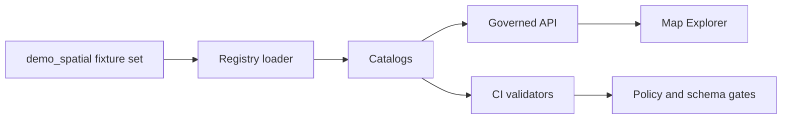

<!-- [KFM_META_BLOCK_V2]
doc_id: kfm://doc/475f51bb-2162-4973-842d-64e71445153c
title: demo_spatial fixture set
type: standard
version: v1
status: draft
owners: KFM Data Registry Maintainers (TODO: set real owners)
created: 2026-02-24
updated: 2026-02-24
policy_label: restricted
related:
  - data/registry/fixtures/README.md (TODO: verify path)
tags: [kfm, registry, fixtures, spatial, demo]
notes:
  - Documents the demo_spatial fixture set used to exercise registry + governed API + map UI flows.
[/KFM_META_BLOCK_V2] -->

<a id="top"></a>

# demo_spatial fixture set

Spatial demo fixtures for exercising **registry → catalogs → governed API → map UI** in a reproducible, policy-aware way.


<!-- TODO: replace placeholder badges with real CI/status badges once paths and workflow names are confirmed -->

**Owners:** _TODO_ • **Lifecycle:** fixtures (CI + local dev) • **Change policy:** small, reversible increments

## Quick links

- [What this is](#what-this-is)
- [Safety rules](#safety-rules)
- [Where it fits in the repo](#where-it-fits-in-the-repo)
- [What belongs here](#what-belongs-here)
- [Recommended layout](#recommended-layout)
- [How to use](#how-to-use)
- [Gates and definition of done](#gates-and-definition-of-done)
- [Troubleshooting](#troubleshooting)
- [Appendix](#appendix)

---

## What this is

`demo_spatial` is a **fixture set**: a small, deterministic bundle of spatial artifacts intended to validate the KFM “golden path” for geospatial content:

- Registry ingestion/discovery (IDs, versions, policy labels)
- Catalog surfaces (**DCAT / STAC / PROV**) validation and link integrity
- Policy fixtures (allow/deny + obligations) for CI and runtime parity
- Map rendering sanity checks (layers load, extents sane, styles present)

> **NOTE**  
> This README intentionally avoids asserting exact filenames and commands that may not exist in your repo yet. Where repo-specific details are unknown, this file uses **TODO** markers and **recommended** conventions.

[↑ Back to top](#top)

---

## Safety rules

> **WARNING**  
> Do **not** add real-world, precise coordinates for vulnerable, sensitive, or culturally restricted locations. If a spatial feature could enable targeting or harm, use **generalized** geometry (aggregation, masking, jittering, coarser resolution) and ensure policy labeling + redaction obligations are captured.

Minimum safety expectations for *any* new/modified fixture content:

- **Default-deny posture for sensitive or restricted material**
- If anything is “publicly representable” only in generalized form, create a **separate generalized version** (do not silently downsample/blur in the UI)
- Avoid leaking restricted metadata in error surfaces (tests should cover this)

[↑ Back to top](#top)

---

## Where it fits in the repo

Path (as requested):

- `data/registry/fixtures/sets/demo_spatial/`

This folder should be treated as a **self-contained, reviewable unit**: changes here should be easy to validate in CI and safe to roll back.

### Flow overview



**Catalogs** are the contract surfaces between pipeline outputs and runtime. This set should therefore include (or be able to produce) strict, validator-friendly catalogs.

[↑ Back to top](#top)

---

## What belongs here

### Acceptable inputs

This folder may contain:

- **Set-level documentation**
  - `README.md` (this file)
  - `manifest.*` describing the fixture set and its members (recommended)
- **One or more demo datasets** (synthetic or cleared-for-use)
  - vector (points/lines/polygons) and/or raster
  - minimal styles for rendering tests (optional)
- **Catalog artifacts** (or fixtures that generate them)
  - DCAT dataset records
  - STAC collections/items
  - PROV run bundles / receipts (as fixtures or generated outputs)
- **Policy fixtures** for allow/deny and obligations (recommended when the set is used in CI)

### Exclusions

This folder must **not** contain:

- Secrets, API keys, tokens, credentials
- Personally identifying information (PII) or private addresses
- Non-cleared third-party data (license unknown/unclear)
- “Mysterious” binary blobs without provenance, checksums, and license metadata
- Any restricted/sensitive location geometry unless explicitly approved and policy-labeled (prefer generalized demos)

[↑ Back to top](#top)

---

## Recommended layout

> **TIP**  
> If your repo already has a fixture-set schema/layout, prefer that. Use this structure only as a baseline.

```text
data/registry/fixtures/sets/demo_spatial/            # Spatial demo fixture set (end-to-end: data + catalogs + prov + policy)
├─ README.md                                        # What this set demonstrates + how CI validates it
├─ manifest.yml                                     # Recommended: set-level manifest (inventory + digests + references)
│
├─ datasets/                                        # Fixture datasets grouped by stable dataset_id
│  └─ <dataset_id>/
│     ├─ dataset.yml                                # Dataset metadata (id, version, policy_label, license, extents)
│     │
│     ├─ data/                                      # Fixture assets (vector/raster; small, deterministic)
│     │  └─ …                                       # e.g., GeoJSON/GeoParquet/COG/PMTiles (bounded; safe)
│     │
│     ├─ catalogs/                                  # Catalog artifacts for this fixture dataset
│     │  ├─ dcat.jsonld                              # DCAT dataset/distribution record (repo convention)
│     │  ├─ stac.collection.json                     # STAC Collection
│     │  └─ stac.items/                              # Optional STAC Items (if itemized assets are used)
│     │     └─ …                                     # One file per item
│     │
│     ├─ prov/                                      # Provenance artifacts for the fixture
│     │  ├─ prov.bundle.jsonld                       # PROV bundle (raw → work → processed lineage)
│     │  └─ run_receipt.json                         # Optional receipt fixture (CI/runtime parity checks)
│     │
│     └─ qa/                                        # Optional QA expectations/thresholds (validation gates)
│        └─ checks.yml                               # Expectations (ranges, nulls, geometry validity, etc.)
│
└─ policy_fixtures/                                 # Optional explicit policy vectors (allow/deny)
   ├─ allow/                                        # Inputs expected to pass policy gates
   └─ deny/                                         # Inputs expected to fail (fail-closed proofs)
```

### Minimal set manifest fields

If you add `manifest.yml`, it should at least answer:

- What datasets are included (stable `dataset_id`)
- What versions are included (`dataset_version_id` or spec-hash-derived version)
- What the set is for (tests/demos it supports)
- Policy label for each dataset and for the set overall
- License/rights signal for each dataset (even if synthetic)

[↑ Back to top](#top)

---

## What’s included

> **NOTE**  
> Fill this in once the actual layer/dataset IDs are finalized.

### Dataset registry

| dataset_id | geometry | policy_label | license | purpose |
|---|---:|---:|---:|---|
| `TODO` | `TODO` | `TODO` | `TODO` | `TODO` |

### Demo layers checklist

- [ ] At least one **point** layer (labels, popups, clustering tests)
- [ ] At least one **line** layer (stroke rendering, joins/attributes)
- [ ] At least one **polygon** layer (fill, outlines, choropleth tests)
- [ ] (Optional) one **raster** asset (tile pyramid / COG tests)

[↑ Back to top](#top)

---

## How to use

Because fixture runners differ by repo, treat the commands below as **examples** and adapt to your actual tooling.

### Example local workflow

```bash
# PSEUDO: validate catalogs for this fixture set
# (Replace with your repo's validator entrypoint)
./tools/validation/catalog/validate.sh data/registry/fixtures/sets/demo_spatial
```

```bash
# PSEUDO: load fixtures into a local registry/dev runtime
# (Replace with your repo's registry loader)
./tools/registry/load_fixtures.sh --set demo_spatial
```

### What “success” should look like

- Catalog validators pass (DCAT/STAC/PROV)
- Policy fixture tests pass (allow/deny behave as expected)
- Demo layers render in the map UI without errors
- No network dependencies required (or they are strictly controlled and documented)

[↑ Back to top](#top)

---

## Gates and definition of done

This fixture set is considered “good” when it supports **CI-enforced, fail-closed governance** and predictable developer workflows.

### Promotion-style gates applied to fixtures

Even though fixtures are not necessarily “Published” datasets, they should still meet the same *shape* of requirements so CI/runtime semantics match.

| Gate | What it protects | Fixture expectations |
|---|---|---|
| Identity and versioning | stable IDs, reproducibility | stable `dataset_id`; immutable version keyed by spec-hash or equivalent |
| Licensing and rights | legal/ethical reuse | explicit license and rights-holder/attribution for each distribution (or “synthetic”) |
| Sensitivity and redaction | harm prevention | default-deny posture for sensitive-location; generalized version if public rendering is allowed |
| Catalog integrity | contract correctness | DCAT/STAC/PROV validate and cross-link correctly |
| Determinism | test stability | deterministic outputs; no time-varying generation without fixed seed |

### Definition of done checklist

- [ ] Set-level README explains purpose, layout, and safety rules
- [ ] Each dataset has explicit **license/rights** metadata
- [ ] Each dataset has an explicit **policy_label**
- [ ] Each dataset includes **spatial extents** and CRS/geometry metadata
- [ ] DCAT/STAC/PROV artifacts validate (or generator + fixtures validate)
- [ ] Policy allow/deny fixtures exist for at least one representative dataset
- [ ] CI runs validators on this set (or on a superset that includes this set)
- [ ] Any breaking change includes an explanation + rollback path

[↑ Back to top](#top)

---

## Troubleshooting

### Catalog validation fails

Common causes:

- Missing required fields (title/description/license/extents)
- Broken cross-links (STAC → DCAT, DCAT → PROV)
- Geometry extents inconsistent with assets

**Fix pattern:** start with DCAT “who/what/license/distributions”, then STAC “what assets/extents”, then PROV “how produced”.

### Map UI renders nothing

Common causes:

- bbox too small/too large
- CRS not supported by the renderer
- styles missing or malformed

**Fix pattern:** ensure the layer has a sane bbox and use a known-good CRS for the demo.

### Policy tests unexpected

Common causes:

- Policy labels missing / ambiguous
- Fixture doesn’t include expected obligations metadata
- CI/runtime policy packs are diverging

**Fix pattern:** ensure the same allow/deny fixtures are used in CI and runtime.

[↑ Back to top](#top)

---

## Appendix

<details>
<summary><strong>Example set manifest (recommended)</strong></summary>

```yaml
# manifest.yml (EXAMPLE — align with your repo schema)
set_id: demo_spatial
title: Demo Spatial Fixtures
description: >
  Small, deterministic spatial fixtures for registry + catalog + policy + map UI tests.
owners:
  - TODO
policy_label: restricted

datasets:
  - dataset_id: TODO.example_points
    dataset_version_id: TODO  # ideally derived from spec_hash-equivalent
    geometry: point
    crs: EPSG:4326
    license: TODO  # or "synthetic"
    sensitivity:
      level: low
      notes: "Synthetic points; safe for demos."
    artifacts:
      - type: stac_collection
        path: datasets/TODO.example_points/catalogs/stac.collection.json
      - type: dcat_dataset
        path: datasets/TODO.example_points/catalogs/dcat.jsonld
      - type: prov_bundle
        path: datasets/TODO.example_points/prov/prov.bundle.jsonld
```

</details>

<details>
<summary><strong>Example dataset metadata stub (recommended)</strong></summary>

```yaml
# datasets/<dataset_id>/dataset.yml (EXAMPLE — align with your repo schema)
dataset_id: TODO.example_polygons
dataset_version_id: TODO
title: "Demo polygons"
description: "Synthetic polygons for choropleth and clipping tests."
policy_label: public  # TODO: confirm allowed label
license: "synthetic"
spatial:
  crs: "EPSG:4326"
  bbox: [-102.05, 36.99, -94.59, 40.00]  # EXAMPLE only
temporal:
  start: null
  end: null
```

</details>
