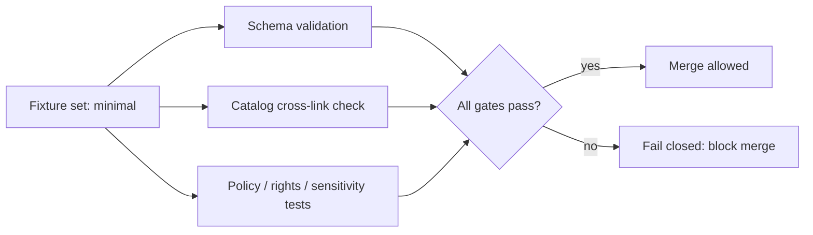

<!-- [KFM_META_BLOCK_V2]
doc_id: kfm://doc/8f2f5d2a-2f3e-4d8e-bc1b-9e8a1d8d0c2b
title: Minimal registry fixture set
type: standard
version: v1
status: draft
owners: TBD
created: 2026-02-24
updated: 2026-02-24
policy_label: public
related:
  - TODO: link to registry contract/spec doc (if present)
  - TODO: link to catalog validator docs (if present)
tags: [kfm, data-registry, fixtures, ci, catalogs]
notes:
  - Keep fixtures small, deterministic, and non-sensitive.
  - Prefer synthetic data; do not include real PII or sensitive locations.
[/KFM_META_BLOCK_V2] -->

# Minimal Registry Fixture Set (`data/registry/fixtures/sets/minimal/`)
> **Purpose:** a *small, deterministic, non-sensitive* fixture bundle used to validate registry + catalog wiring (DCAT/STAC/PROV) and fail-closed gates in CI.


> **TODO (repo wiring):** replace with your real CI badge  
> ``

---

## Quick navigation
- [Purpose](#purpose)
- [Where this fits](#where-this-fits)
- [What’s inside](#whats-inside)
- [Expected directory layout](#expected-directory-layout)
- [How CI uses this set](#how-ci-uses-this-set)
- [Rules and invariants](#rules-and-invariants)
- [How to add or change fixtures](#how-to-add-or-change-fixtures)
- [What must NOT go here](#what-must-not-go-here)
- [Safety and governance notes](#safety-and-governance-notes)
- [Appendix](#appendix)

---

## Purpose
This **minimal** set exists to:
1. Provide the **smallest working “catalog triplet”** (DCAT + STAC + PROV) suitable for automated validation and link-checking.
2. Give CI something stable to run so that **schema/link/policy regressions fail closed** before merge.
3. Serve as a “golden path” reference for creating additional fixture sets (e.g., `extended/`, `restricted/`, `negative/`).

> **NOTE:** This folder is intentionally *boring*. If you need complexity, create a new fixture set rather than bloating `minimal/`.

[Back to top](#minimal-registry-fixture-set-dataregistryfixturessetsminimal)

---

## Where this fits
- **Repo location:** `data/registry/fixtures/sets/minimal/`
- **Primary consumers:** CI jobs that validate registry and catalogs (schema validation + cross-link checks), plus any unit/integration tests that need a known-good registry snapshot.
- **Trust membrane:** fixtures should enable *governed* checks (policy/rights/sensitivity) without including real sensitive content.

[Back to top](#minimal-registry-fixture-set-dataregistryfixturessetsminimal)

---

## What’s inside
KFM treats catalogs as **contract surfaces**, not “nice-to-have metadata”. The minimal set should (at minimum) represent:

| Artifact | Why it exists | Must be present in `minimal/` |
|---|---|---|
| Registry entry (dataset/source) | Identifies the dataset + governance metadata | ✅ |
| DCAT record | “What is this dataset? who publishes? what license? distributions?” | ✅ |
| STAC collection/item(s) | “What assets exist? what spatiotemporal extents? where are files?” | ✅ |
| PROV bundle | “How was it produced? which inputs/tools/params?” | ✅ |
| Negative fixture(s) | Proves CI fails on invalid/missing required fields | ✅ (at least one) |

[Back to top](#minimal-registry-fixture-set-dataregistryfixturessetsminimal)

---

## Expected directory layout
> **IMPORTANT:** The exact filenames may vary by repo conventions. This is a *recommended* shape so tools can target a predictable structure.

```text
data/registry/fixtures/sets/minimal/
  README.md

  registry/
    # Minimal registry entries used by loaders/indexers/tests
    # (JSON/YAML allowed; keep tiny)
    dataset.json          # (example) one dataset record
    source.json           # (example) one upstream source record

  catalogs/
    dcat/
      dataset.jsonld      # (example) DCAT Dataset + Distribution(s)
    stac/
      collection.json     # (example) STAC Collection
      items/
        item-001.json     # (example) STAC Item
    prov/
      bundle.jsonld       # (example) PROV bundle

  negative/
    # Intentionally invalid examples to prove gates fail closed
    dcat.missing_license.jsonld
    stac.bad_extent.json
```

[Back to top](#minimal-registry-fixture-set-dataregistry-fixture-set-dataregistryfixturessetsminimal)

---

## How CI uses this set


### Typical checks
- **Schema validation:** JSON/JSON-LD files conform to the repo’s contracts.
- **Referential integrity:** DCAT ↔ STAC ↔ PROV cross-links resolve (no dangling references).
- **Policy expectations:** at least one deny-case exists (fixtures prove CI blocks unsafe/invalid changes).

> **TIP:** In early phases, it’s acceptable for these validators to run as a “no-op gate” that only targets fixtures; the point is to wire the gate *now* so it can get stricter over time.

[Back to top](#minimal-registry-fixture-set-dataregistryfixturessetsminimal)

---

## Rules and invariants
### Non-negotiable
- **Deterministic:** no timestamps that change every run, no random IDs, no dependence on network access.
- **Small:** keep files tiny (KBs), and keep the set limited to the minimal cross-linked story.
- **Non-sensitive:** do **not** include precise sensitive locations, PII, or restricted partner data.
- **Fail-closed friendly:** include at least one **invalid** example so the gate’s failure mode is exercised.

### Strong conventions (recommended)
- Use **synthetic** geometry/extents (or coarse/generalized extents) unless you have explicit approval to include real coordinates.
- Ensure each fixture clearly states:
  - `policy_label` (e.g., `public`)
  - license/rights info (even if placeholder, it must be structurally valid)
  - stable identifiers

[Back to top](#minimal-registry-fixture-set-dataregistryfixturessetsminimal)

---

## How to add or change fixtures
### Change checklist
- [ ] Keep additions **minimal**; if you need multiple datasets or complex scenarios, create a new fixture set.
- [ ] Add/modify the **registry entry** and the **catalog triplet** (DCAT/STAC/PROV) together.
- [ ] Add a **negative fixture** if you are introducing a new required field or validator behavior.
- [ ] Run the local validation commands used by CI (see below).
- [ ] Confirm the change does **not** introduce sensitive content or rights ambiguity.

### Local validation (examples)
> Replace these with your repo’s real commands/paths.

```bash
# Example: run catalog validators against the minimal set
# (tool name/path may differ)
tools/validation/catalog/validate --set data/registry/fixtures/sets/minimal

# Example: run OPA/Conftest gates (if your repo uses it)
conftest test data/registry/fixtures/sets/minimal -p policy/opa
```

[Back to top](#minimal-registry-fixture-set-dataregistryfixturessetsminimal)

---

## What must NOT go here
❌ **Large binaries** (GeoTIFFs, PMTiles, Parquet, PDFs, etc.)  
❌ **PII** (names, emails, phone numbers, addresses)  
❌ **Sensitive precise coordinates** (archaeology sites, sensitive species, private infrastructure)  
❌ **Rights-unclear media** (images/scans you don’t have permission to redistribute)  
❌ **“Real” production snapshots** that could leak restricted metadata

If you need to test with bigger artifacts, create an **out-of-band** test harness or use generated artifacts in CI with explicit governance review.

[Back to top](#minimal-registry-fixture-set-dataregistryfixturessetsminimal)

---

## Safety and governance notes
- Treat fixtures as governed artifacts: they shape policy behavior and CI promotion gates.
- When in doubt: **default-deny** and/or generalize.

> **WARNING:** If you include location data, validate that no precise sensitive coordinates leak and prefer generalized representations by default.

[Back to top](#minimal-registry-fixture-set-dataregistryfixturessetsminimal)

---

## Appendix
<details>
<summary>Design intent (why “minimal” matters)</summary>

- CI should prove **wiring + invariants** with the smallest reproducible set.
- More fixtures is not always better: oversized fixtures slow CI, increase review burden, and raise accidental leakage risk.
- This set exists to keep the “trust membrane” enforceable in a fast feedback loop.

</details>

---
**End of file.**
