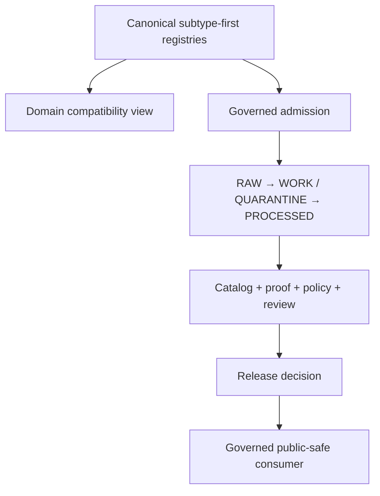

<!-- [KFM_META_BLOCK_V2]
doc_id: kfm://data/registry/flora/readme
name: Flora Registry README
path: data/registry/flora/README.md
type: data-registry-domain-parent-readme
version: v0.3.0
status: draft; compatibility-boundary; no-independent-registry-record-writes
owners:
  - "NEEDS VERIFICATION: registry steward"
  - "NEEDS VERIFICATION: Flora domain steward"
  - "NEEDS VERIFICATION: source, dataset, layer, domain, rights, sensitivity, and crosswalk stewards"
  - "NEEDS VERIFICATION: cultural-review, policy, validation, proof, and release reviewers"
created: 2026-06-28
updated: 2026-07-28
policy_label: restricted-review
truth_posture: cite-or-abstain
responsibility_root: data/
artifact_family: registry
registry_scope: flora-domain-registry-compatibility-parent
domain: flora
path_posture: confirmed-live-domain-first-parent; subtype-first-registry-authority; independent-registry-record-writes-denied; migration-needs-accepted-decision
sensitivity_posture: registry-internal; no-public-path; rare-plant-deny-default; culturally-sensitive-plant-knowledge-protected; source-role-preserving; rights-and-sensitivity-fail-closed; release-gated
related:
  - ../README.md
  - sources/README.md
  - ../sources/README.md
  - ../sources/flora/README.md
  - ../datasets/README.md
  - ../datasets/flora/README.md
  - ../layers/README.md
  - ../domains/README.md
  - ../rights/README.md
  - ../sensitivity/README.md
  - ../crosswalks/README.md
  - ../../raw/flora/README.md
  - ../../work/flora/README.md
  - ../../quarantine/flora/README.md
  - ../../processed/flora/README.md
  - ../../receipts/README.md
  - ../../proofs/flora/README.md
  - ../../catalog/domain/flora/README.md
  - ../../published/flora/README.md
  - ../../../docs/doctrine/directory-rules.md
  - ../../../docs/adr/ADR-0029-adopt-directory-governance-standard-v2.md
  - ../../../docs/sources/SOURCE_DESCRIPTOR_STANDARD.md
  - ../../../docs/domains/flora/SOURCE_REGISTRY.md
  - ../../../contracts/source/source_descriptor.md
  - ../../../contracts/domains/flora/README.md
  - ../../../schemas/contracts/v1/source/README.md
  - ../../../schemas/contracts/v1/domains/flora/README.md
  - ../../../policy/domains/flora/README.md
  - ../../../policy/sensitivity/flora/README.md
  - ../../../fixtures/domains/flora/README.md
  - ../../../control_plane/source_authority_register.yaml
  - ../../../.github/workflows/domain-flora.yml
  - ../../../.github/workflows/link-check.yml
  - ../../../release/candidates/flora/README.md
tags:
  - kfm
  - data
  - registry
  - flora
  - compatibility
  - subtype-first
  - sources
  - datasets
  - layers
  - rights
  - sensitivity
  - crosswalks
  - taxonomy
  - specimens
  - occurrences
  - vegetation
  - rare-plants
  - cultural-sensitivity
  - source-role
  - correction
  - rollback
  - cite-or-abstain
evidence_snapshot:
  repository: bartytime4life/Kansas-Frontier-Matrix
  base_commit: f0dc5ac7298b11c6c330bd96a50f71c6e31ff25c
  prior_blob: 920a4eaa3effb81fde79e09e15399040d493b537
  child_source_view_blob: c94df0312c432c8239bb0a80d17aa79c0ecc3a8f
  canonical_source_lane_blob: 356cd29ca5a764ffe1e774fb565bce50bba46011
  registry_parent_blob: b327d22956f5454482a35dbf265f45b901c1f2a3
  source_registry_parent_blob: 2821e9681273bff6b430920d0a45312c5643ba33
  dataset_registry_parent_blob: d84a9a3f06f8711404112b663aa7af6b33a94b68
  flora_dataset_lane_blob: 025cade8130a07ee2e5243ee5929d86c182e8162
  directory_rules_blob: fd49a0b83e55cef52c1124281f093e263526898d
  adr_0029_blob: cd044a38047cc9b3725d2e083eb201eb86109308
  source_descriptor_standard_blob: 4327c603f76e5b5a76fa058fe24ac2af91e496d8
  source_descriptor_contract_blob: b57ae5ccc042c1423b75c168438800384c9b6713
  source_schema_index_blob: 691e5f76ba800404fff26fabd120b7f42791e79a
  flora_schema_index_blob: 5c15731f849ba65a1b9ef6dafc825b94deef445b
  source_authority_register_blob: 82c23722520922f5ca0dad7f37ed794d1c2edf81
  flora_fixture_index_blob: c7c3d770e39c36be901ad100c749289c8f1e448a
  domain_flora_workflow_blob: c792d126e5726d8895f56fd97800bee7fcba4a15
  link_check_workflow_blob: c91477f6a6da84203e61b3151076eb46b3a65941
  inspection_date: 2026-07-28
notes:
  - "This README preserves the stable identity of the existing domain-first Flora registry parent."
  - "ADR-0029 adopted Directory Rules v2 and makes subtype-first registry placement authoritative."
  - "The confirmed sources/ child is a no-independent-write compatibility view; the subtype-first Flora source lane remains the canonical placement surface."
  - "The canonical Flora dataset lane is confirmed under data/registry/datasets/flora/; this parent must not duplicate it."
  - "The source-authority register is PROPOSED and empty; the Flora and link-check workflows are explicit readiness holds."
  - "Bounded repository inspection does not establish a complete registry-record inventory, active source admission, accepted schema family, or public readiness."
[/KFM_META_BLOCK_V2] -->

<a id="top"></a>

# Flora Registry

[](#status)
[](#authority-and-path-posture)
[](#authority-and-path-posture)
[](#registry-boundary)
[](#flora-sensitivity-and-source-role-boundary)

> **One-line purpose.** Preserve the existing domain-first Flora registry path as a bounded navigation and compatibility parent while authoritative registry records remain in their accepted subtype-first families.

> [!CAUTION]
> Do not add authoritative source descriptors, dataset or layer identities, rights or sensitivity decisions, crosswalk records, payloads, proofs, policies, release objects, or public-facing Flora data under this parent. This path does not activate a source, prove a botanical claim, authorize release, or establish KFM publication.

> [!WARNING]
> Flora material is especially vulnerable to taxonomy, source-role, rights, temporal, spatial, geoprivacy, and join-induced sensitivity collapse. Exact rare or protected plant locations, culturally sensitive plant knowledge, steward-controlled records, and harmful precision remain fail-closed.

**Navigation:** [Status](#status) · [Purpose](#scope) · [Authority](#path-posture) · [Inventory](#current-bounded-inventory) · [Repository fit](#repo-fit) · [Children](#confirmed-child-lanes) · [Boundary](#flora-registry-boundary) · [Flora controls](#flora-sensitivity-and-source-role-boundary) · [Belongs](#accepted-material) · [Exclusions](#exclusions) · [Inputs/outputs](#inputs-and-outputs) · [Lifecycle](#lifecycle-and-publication-boundary) · [Validation](#validation-and-maintenance) · [Verification](#status-notes) · [Rollback](#correction-migration-and-rollback)

<a id="status"></a>

## Status

| Surface | Evidence-backed state |
|---|---|
| Target path | **CONFIRMED** at `main@f0dc5ac7298b11c6c330bd96a50f71c6e31ff25c` |
| Document lifecycle | `draft` |
| README profile | Sensitive `BOUNDARY_COMPACT` compatibility parent |
| Responsibility | Registry-domain navigation, compatibility, and migration boundary only |
| Governing Directory Rules | **CONFIRMED adopted** through [ADR-0029](../../../docs/adr/ADR-0029-adopt-directory-governance-standard-v2.md) |
| Registry placement | Subtype-first is canonical; domain-first registry-record writes are denied |
| Confirmed local child | [`sources/`](sources/README.md), a no-independent-write compatibility view |
| Canonical Flora source lane | [`data/registry/sources/flora/`](../sources/flora/README.md); its topology prose predates adoption |
| Canonical Flora dataset lane | [`data/registry/datasets/flora/`](../datasets/flora/README.md) |
| Source-authority register | **CONFIRMED present**, `PROPOSED`, and empty |
| Source contract and schema posture | Draft/PROPOSED with schema-path and placeholder drift still visible |
| Flora and link-check workflows | Explicit readiness holds; no source admission, registry conformance, release, or publication authority |
| Complete registry-record inventory | **UNKNOWN** in the bounded inspection |
| Independent registry-record writes here | **DENY** |
| Direct public or operational use | **DENY BY DEFAULT** |
| Accountable stewardship assignments | **NEEDS VERIFICATION** |

A path, README, proposed schema, empty register, schema-valid record, held workflow, commit, pull request, or merge does not establish source authority, botanical truth, rights clearance, sensitivity clearance, evidence closure, release approval, public safety, or KFM publication.

<a id="scope"></a>

## Purpose

This README governs the existing domain-first parent:

```text
data/registry/flora/
```

Its bounded responsibilities are to:

- preserve the path's stable navigation identity while registry topology converges;
- route maintainers to the canonical subtype-first family for each governed registry object;
- make the local source compatibility view and canonical source writer explicit;
- prevent this parent from becoming a parallel Flora registry hierarchy;
- preserve source identity, provider lineage, source role, taxonomy, rights, sensitivity, cadence, correction, migration, supersession, withdrawal, and rollback requirements;
- keep rare-plant, cultural-sensitivity, collection-security, land-access, and join-induced sensitivity boundaries visible.

This README does **not** define registry-object semantics, machine shape, policy, source activation, connector or watcher behavior, lifecycle promotion, evidence, proof, catalog closure, release, botanical advice, current legal status, or public delivery.

<a id="path-posture"></a>

## Authority and path posture

Accepted Directory Rules v2 establishes subtype-first registry placement:

```text
data/registry/
├── sources/
├── datasets/
├── layers/
├── domains/
├── rights/
├── sensitivity/
└── crosswalks/
```

The topology is sparse and evidence-driven. It does not authorize every family or a Flora child merely because the domain exists.

| Path shape | Verified repository state | Bounded posture |
|---|---|---|
| `data/registry/flora/` | This parent README and the `sources/` child README | Domain-first compatibility parent; independent registry-record writes denied |
| [`data/registry/flora/sources/`](sources/README.md) | Compatibility README | Read-only source-navigation view under `DIR-SOURCE-004`; no independent descriptor writes |
| [`data/registry/sources/flora/`](../sources/flora/README.md) | Subtype-first Flora source README | Canonical placement surface under `DIR-SOURCE-003`; concrete descriptor inventory and activation remain unverified |
| [`data/registry/datasets/flora/`](../datasets/flora/README.md) | Updated subtype-first Flora dataset README | Canonical placement surface for Flora dataset registry records; concrete record inventory remains unknown |
| [`data/registry/layers/`](../layers/README.md) | Registry-family parent README | Layer identity and delivery metadata only; do not duplicate it under this parent |
| [`data/registry/domains/`](../domains/README.md) | Registry-family parent README | Domain-state records only |
| [`data/registry/rights/`](../rights/README.md) | Registry-family parent README | Rights identities and review posture only |
| [`data/registry/sensitivity/`](../sensitivity/README.md) | Registry-family parent README | Sensitivity identities and profiles only |
| [`data/registry/crosswalks/`](../crosswalks/README.md) | Registry-family parent README | Mapping-state claims only |

`DIR-SOURCE-003` places machine source identities and descriptors under `data/registry/sources/`. `DIR-SOURCE-004` permits `data/registry/<domain>/sources/` only as a generated view when the subtype-first record is canonical; it may not act as an independent writer. `DIR-PLACE-006` prohibits compatibility surfaces from becoming writable alternatives, and `DIR-SCOPELANE-003` prohibits empty symmetry scaffolding.

The parent README itself remains necessary to document the current boundary. The placement outcomes are:

| Proposed action | Outcome | Reason |
|---|---:|---|
| Retain this boundary README at the existing path | `PLACE` | It documents a confirmed authority and exposure boundary |
| Add authoritative registry records under this parent | `DENY` | Would create parallel authority beside subtype-first families |
| Generate a one-way domain view | `MIRROR` only after verification | Requires canonical inputs, generator, digests, parity checks, consumers, owner, rollback, and exit criteria |
| Move, redirect, or delete this parent now | `HOLD` | Writers, consumers, links, aliases, and migration authority are not closed |

> [!IMPORTANT]
> Preserve this parent until its writers, readers, links, aliases, generated views, external-storage relationships, and external consumers are inventoried. Do not delete, redirect, repurpose, or retire it without an accepted migration decision, reference closure, parity evidence where applicable, consumer handling, and a rollback target.

<a id="current-bounded-inventory"></a>

## Current bounded inventory

This inventory is grounded in exact file reads at the pinned base. It is not a complete recursive-tree guarantee.

| Surface | Verified content | What it does not establish |
|---|---|---|
| `data/registry/flora/README.md` | This compatibility-parent README | No registry payload, activation, policy, proof, release, or public-serving state |
| [`sources/README.md`](sources/README.md) | No-independent-write Flora source compatibility view | No local source authority or descriptor inventory |
| [`data/registry/sources/flora/README.md`](../sources/flora/README.md) | Draft subtype-first Flora source-lane README | No accepted schema, active admission, complete inventory, or runtime reader |
| [`data/registry/datasets/flora/README.md`](../datasets/flora/README.md) | Draft canonical subtype-first dataset-lane README | No concrete dataset record, public dataset, or release state |
| [`source_authority_register.yaml`](../../../control_plane/source_authority_register.yaml) | `PROPOSED` metadata with an empty `entries` list | No active source, steward assignment, rights clearance, or activation decision |
| [SourceDescriptor contract](../../../contracts/source/source_descriptor.md) | Draft/PROPOSED semantic contract | No accepted source contract or active registry record |
| [Source schema index](../../../schemas/contracts/v1/source/README.md) | Mixed-maturity PROPOSED schemas, empty scaffolds, and path/name drift | No accepted schema family or registry-wide enforcement |
| [Flora schema index](../../../schemas/contracts/v1/domains/flora/README.md) | Draft schema index with one confirmed redaction-receipt scaffold | No complete Flora schema coverage or accepted public-safe projection |
| [Flora fixtures](../../../fixtures/domains/flora/README.md) | Draft synthetic/public-safe fixture guidance | No authoritative records, live source material, or complete validator coverage |
| [Flora workflow](../../../.github/workflows/domain-flora.yml) | Read-only readiness checks and explicit holds | No source admission, botanical validation, geoprivacy execution, proof, release approval, or publication |
| [Link-check workflow](../../../.github/workflows/link-check.yml) | Documentation-QA readiness hold | No repository-native link checker is currently accepted or executed |

Do not infer absence from bounded inspection alone. A complete inventory requires a pinned recursive tree, file classification, generated-file detection, external-storage review, and writer/consumer analysis.

<a id="repo-fit"></a>

## Repository fit

| Responsibility | Owning surface | Relationship to this path |
|---|---|---|
| Registry governance | [`data/registry/README.md`](../README.md) | Parent registry responsibility boundary |
| Canonical source family | [`data/registry/sources/README.md`](../sources/README.md) | Subtype-first source identity, admission, and routing family |
| Flora source lane | [`data/registry/sources/flora/`](../sources/flora/README.md) | Canonical placement for Flora source records; content remains draft |
| Domain-first source view | [`sources/`](sources/README.md) | Compatibility navigation; no independent descriptor writes |
| Flora dataset lane | [`data/registry/datasets/flora/`](../datasets/flora/README.md) | Canonical dataset identity and state; this parent owns no copies |
| Layer, domain, rights, sensitivity, and crosswalk families | Their subtype-first registry parents | Separate registry responsibilities; this parent owns no copies |
| Human source guidance | [Flora Source Registry](../../../docs/domains/flora/SOURCE_REGISTRY.md) and [Source Descriptor Standard](../../../docs/sources/SOURCE_DESCRIPTOR_STANDARD.md) | Human guidance and admission discipline; not registry records or runtime proof |
| Semantic meaning | [`contracts/source/source_descriptor.md`](../../../contracts/source/source_descriptor.md) and [Flora contracts](../../../contracts/domains/flora/README.md) | Draft semantic meaning and invariants |
| Machine shape | [Source schemas](../../../schemas/contracts/v1/source/README.md) and [Flora schemas](../../../schemas/contracts/v1/domains/flora/README.md) | Machine-shape surfaces; acceptance and enforcement remain unresolved |
| Policy | [Flora domain policy](../../../policy/domains/flora/README.md) and [Flora sensitivity policy](../../../policy/sensitivity/flora/README.md) | Current scaffolds; cannot authorize exposure or release |
| Governance projection | [`control_plane/source_authority_register.yaml`](../../../control_plane/source_authority_register.yaml) | `PROPOSED` and empty at the pinned base |
| Workflow evidence | [`domain-flora.yml`](../../../.github/workflows/domain-flora.yml) | Explicit validation, proof, and release-readiness holds |
| Payload lifecycle | [RAW](../../raw/flora/README.md), [WORK](../../work/flora/README.md), [QUARANTINE](../../quarantine/flora/README.md), and [PROCESSED](../../processed/flora/README.md) | Flora source and derived bytes; never stored in this parent |
| Process and evidence support | [Receipts](../../receipts/README.md) and [proofs](../../proofs/flora/README.md) | Separate process-memory and evidence-support families |
| Discovery and delivery | Current [catalog](../../catalog/domain/flora/README.md), [release candidate](../../../release/candidates/flora/README.md), and [published carriers](../../published/flora/README.md) | Downstream surfaces; none inherits authority from this registry parent |
| Public consumers | Governed APIs and release-approved carriers | Must not read registry internals directly |

<a id="confirmed-child-lanes"></a>

## Confirmed child lanes

The bounded README evidence confirms these local surfaces:

```text
data/registry/flora/
├── README.md
└── sources/
    └── README.md
```

| Child | Confirmed role | Boundary |
|---|---|---|
| [`sources/`](sources/README.md) | Human-readable compatibility view for readers entering through the Flora domain | Not an independent writer, activation lane, payload store, policy source, proof, release record, or public data surface |

This direct-child map does not authorize additional domain-first registry families or claim that payloads exist. Do not create empty dataset, layer, domain, rights, sensitivity, or crosswalk children merely to make this parent look complete.

<a id="suggested-directory-shape"></a>

### Retired proposed shape

The prior version suggested a parent-local `index.local.json`. That sketch is retired because an ungoverned local index could become a second registry authority. Add a generated view only after the canonical inputs, generator, digests, parity validation, owner, consumers, rollback, and exit criteria are accepted and verified.

<a id="flora-registry-boundary"></a>

## Registry boundary

| Rule | Required handling |
|---|---|
| No parallel authority | Do not create authoritative registry records under this parent when a subtype-first family owns the object |
| One canonical identity | Register a source, dataset, layer, rights profile, sensitivity profile, domain, or crosswalk once; derived views carry the canonical ID |
| Read-only compatibility views | Generate from canonical inputs, record source/output digests, verify parity, and prohibit manual copies |
| Preserve source and provider lineage | Retain original publisher, institution, collection, observer, specimen, dataset, aggregator, and access path where applicable |
| Preserve source role | Do not upgrade observed, regulatory, modeled, aggregate, administrative, candidate, synthetic, contextual, or restricted material |
| Preserve temporal context | Keep acquisition, observation, publication, retrieval, revision, review, stale, and supersession time distinct |
| Connectors and watchers are non-publishers | They may emit governed candidates and receipts only within their accepted capabilities; they cannot approve promotion, release, or publication |
| Registry is not semantic authority | Meaning remains under `contracts/` |
| Registry is not schema or policy | Machine shape remains under `schemas/`; policy remains under `policy/` |
| Registry is not validation or proof | Receipts and EvidenceBundle/proof support remain separate |
| Registry is not catalog or release | Catalog projections and release decisions retain their own authority homes |
| Public clients do not read this lane | Public UI/API/AI surfaces use governed interfaces and release-approved carriers |

<a id="flora-sensitivity-and-source-role-boundary"></a>

## Flora sensitivity and source-role boundary

| Risk | Fail-closed handling |
|---|---|
| Rare, protected, threatened, or endangered plants | Deny exact or reverse-engineerable locations unless an accepted policy, authorized transform, receipt, review, release, correction path, and rollback target permit a public-safe derivative |
| Culturally sensitive plant knowledge | Protect stewarded knowledge, access restrictions, source agreements, attribution, and contextual integrity; registry placement does not grant disclosure |
| Collection or land-access security | Exclude private collection detail, collection-security notes, private-land access detail, and operationally harmful precision |
| Unknown or restricted rights | Hold, restrict, abstain, or deny; rights status never overrides sensitivity, sovereignty, geoprivacy, evidence, or release gates |
| Taxonomy collision or authority drift | Preserve source-native names, authority/version, crosswalk class, ambiguity, and correction lineage; do not silently collapse identities |
| Join-induced sensitivity | Recompute sensitivity after joins; individually safe county, habitat, land, observation, and status inputs may create an unsafe product |
| Aggregates, models, and context | Never present aggregate, modeled, remote-sensing, soil, habitat, hydrology, land-cover, road, settlement, or other context as occurrence-level Flora truth |
| Freshness and supersession | Preserve cadence, source head, stale state, revision, correction, withdrawal, and supersession; stale material may require abstention |
| AI, graph, search, or map projection | Treat as downstream interpretation only; none may replace canonical records, evidence, policy, review, or release state |

Source admission, source fetch, registry presence, schema validity, aggregation, geocoding, taxonomic matching, mapping, graph projection, AI summarization, and pull-request merge must never upgrade source role or public-safe posture.

<a id="accepted-material"></a>

## What belongs here

This compatibility parent is intentionally narrow:

- this README and bounded routing notes;
- links to canonical subtype-first registry families and verified child compatibility views;
- an accepted migration, alias, tombstone, correction, supersession, withdrawal, or rollback note for this path;
- a generated, read-only domain view only after its canonical inputs, generator, source/output digests, parity checks, owner, consumers, retention, rollback, and exit criteria are verified;
- explicit `UNKNOWN`, `NEEDS VERIFICATION`, `HOLD`, or `DENY` state when authority, identity, rights, sensitivity, topology, or migration evidence is incomplete.

No registry record should be authored directly at this parent.

<a id="exclusions"></a>

## What does not belong here

| Do not place here | Owning surface |
|---|---|
| SourceDescriptor, dataset, layer, domain, rights, sensitivity, or crosswalk records | Their subtype-first `data/registry/<family>/` lanes |
| Raw source payloads, herbarium archives, occurrence exports, taxonomy tables, vegetation data, remote-sensing assets, or source-native tables | Governed RAW, WORK, QUARANTINE, or PROCESSED lanes |
| Exact sensitive plant coordinates, culturally restricted knowledge, private identifiers, credentials, API keys, or collection-security detail | Governed restricted storage, quarantine, or secret manager |
| Human bibliography, source narrative, domain doctrine, or operational guidance | `docs/sources/`, `docs/domains/flora/`, or `docs/runbooks/` as applicable |
| Semantic contracts | `contracts/` |
| JSON Schema or machine shape | `schemas/` |
| Policy, rights rules, sensitivity rules, geoprivacy rules, or access-control logic | `policy/` |
| Connectors, watchers, pipelines, validators, fixtures, tests, or workflows | Their executable or evidence responsibility roots |
| Run, validation, redaction, review, policy, or process-memory receipts | `data/receipts/` |
| EvidenceBundle records, proof packs, signatures, or citation closure | `data/proofs/` |
| STAC, DCAT, PROV, domain catalog, search, graph, or triplet projections | `data/catalog/` and `data/triplets/` |
| Release manifests, promotion decisions, corrections, withdrawals, signatures, or rollback cards | `release/` |
| Published layers, tiles, reports, API payloads, downloads, or generated answers | `data/published/` and governed delivery surfaces after release |

## Inputs and outputs

| Direction | Accepted surface | Boundary |
|---|---|---|
| Input | Canonical registry identities and their role, rights, sensitivity, cadence, correction, supersession, and rollback metadata | Must resolve from the owning subtype-first family or remain explicitly unavailable |
| Input | Contract, schema, policy, fixture, validator, receipt, proof, catalog, and release references | A reference does not prove the target is accepted, executed, or public-safe |
| Output | Human navigation to canonical Flora registry governance | Read-only and non-authoritative |
| Output | Optional generated domain view | One-way only; requires parity and migration evidence |
| Output | Structured hold, correction, migration, or verification item | Must not activate, ingest, promote, release, or publish |

## Lifecycle and publication boundary



The diagram shows responsibility flow, not implementation maturity. The compatibility view does not sit on a publication edge and cannot bypass source admission, lifecycle validation, evidence, policy, review, catalog closure, release, correction, or rollback.

| Transition | Minimum posture |
|---|---|
| Identity enters a canonical registry | Stable identity, object family, source role, authority scope, owner/steward posture, and unresolved state visible |
| Source material is admitted | Rights, sensitivity, cadence, access, source-head, citation, and activation conditions reviewed |
| Material becomes processed support | Applicable contract/schema validation, evidence, quality, taxonomy, temporal, spatial, and policy checks |
| Material contributes to catalog or proof | Provenance, EvidenceRef/EvidenceBundle, receipt, and catalog/proof closure as applicable |
| A derivative reaches a public surface | Release decision, public-safe transform where needed, correction path, rollback target, and governed consumer boundary |

## Validation and maintenance

### Confirmed evidence

- The target README exists at the pinned base and keeps the same `doc_id` and path.
- ADR-0029 is accepted and adopts Directory Rules v2 at `docs/doctrine/directory-rules.md`.
- Directory Rules v2 makes registry placement subtype-first and prohibits the domain-first source view from acting as an independent writer.
- The local `sources/` README is a no-independent-write compatibility view.
- The subtype-first Flora source and dataset README paths exist.
- The source-authority register is `PROPOSED` and empty.
- The SourceDescriptor contract and source-schema family remain draft/PROPOSED; the schema index records placeholder and naming/path drift.
- The Flora and link-check workflows use read-only permissions and explicit readiness holds.

<a id="required-checks-before-use"></a>

### Required checks before use

- [ ] Re-pin the repository base and re-read the accepted Directory Rules and ADR-0029.
- [ ] Confirm the proposed object belongs in an existing subtype-first registry family rather than this parent.
- [ ] Inventory this path's direct children, writers, readers, references, aliases, generated-file markers, and external consumers.
- [ ] Confirm every compatibility entry resolves to exactly one canonical identity and matching canonical digest.
- [ ] Preserve provider/origin, source role, rights, sensitivity, taxonomy, time/freshness, spatial support, citation, correction, and supersession posture.
- [ ] Confirm no source payload, secret, private identifier, harmful precision, culturally restricted knowledge, or public-serving route is introduced.
- [ ] Resolve consequential EvidenceRefs to EvidenceBundles before authoritative use.
- [ ] Confirm registry state is not being used as proof, catalog closure, policy approval, release approval, or public truth.
- [ ] Confirm public clients, maps, search, graph, vector indexes, and generated-answer surfaces cannot read this parent directly.
- [ ] Verify links, anchors, badges, tables, alerts, code fences, Mermaid, HTML comments, UTF-8 encoding, and final newline.
- [ ] Record migration, parity, correction, and rollback evidence—or retain the path as README-only.

The [`domain-flora`](../../../.github/workflows/domain-flora.yml) workflow is an explicit readiness-hold workflow. It does not validate registry records, admit sources, prove botanical truth, execute geoprivacy, build proof, approve release, or publish. The [`link-check`](../../../.github/workflows/link-check.yml) workflow is also an explicit hold and does not currently run an accepted repository-native link checker.

A green held workflow or source-level Markdown inspection proves only its declared boundary checks. It does not prove registry conformance, source admission, rights clearance, geoprivacy correctness, public safety, evidence closure, release readiness, or publication.

<a id="status-notes"></a>

## Open verification

| Item | Status | Evidence required |
|---|---|---|
| Complete direct-child and registry-record inventory | **UNKNOWN** | Pinned recursive tree and file classifications |
| Active writers and consumers of this exact parent | **UNKNOWN** | Connector, watcher, pipeline, tool, workflow, API/UI, and external-consumer inventory |
| Canonical Flora source-record inventory | **UNKNOWN** | Pinned tree, identity records, rights/sensitivity review, and validation evidence |
| Canonical Flora source README alignment | **NEEDS VERIFICATION** | Replace its pre-adoption topology uncertainty without changing descriptor state |
| Registry and source-parent README alignment | **NEEDS VERIFICATION** | Reconcile their pre-adoption or placeholder authority text in separate scoped changes |
| SourceDescriptor contract and schema acceptance | **NEEDS VERIFICATION** | Accepted semantic contract, one canonical schema path and name, fixtures, validator, and CI |
| Flora rights, sensitivity, taxonomy, stale-state, correction, and rollback enforcement | **UNKNOWN** | Policy, negative fixtures, validator outputs, receipts, and drills |
| Compatibility-view generator and parity check | **NOT VERIFIED** | Repository-owned generator, deterministic fixtures, tests, and output digest |
| Public-consumer isolation | **NEEDS VERIFICATION** | API/UI/search/graph tests denying internal or candidate registry reads |
| Accountable stewards and CODEOWNERS routing | **NEEDS VERIFICATION** | Current path-specific routing and named accountable owners |
| Final parent disposition | **PROPOSED / NEEDS VERIFICATION** | Retained boundary README, generated mirror, redirect/tombstone, or retirement decision |
| Physical deletion eligibility | **HOLD** | Zero-writer, zero-consumer, link-closure, parity/retirement, and rollback evidence |

Unknowns narrow behavior and block higher-authority claims; they do not authorize plausible defaults.

## Correction, migration, and rollback

1. Correct the canonical subtype-first record or governing authority first.
2. Emit the required correction, supersession, withdrawal, deactivation, review, or rollback record through its owning process.
3. Regenerate any admitted compatibility view from corrected canonical inputs.
4. Invalidate stale view bytes and verify parity before consumers resume.
5. If a view cannot be regenerated safely, remove the derived bytes while retaining this boundary README or an approved tombstone.

Moving, redirecting, or deleting this parent requires an accepted decision and migration record covering identities, writers, consumers, links, aliases, digests, parity, effective date, exit criteria, validation, and rollback. Rollback must not recreate two writable authorities.

Before merge, rollback is closing the draft pull request and leaving the branch unmerged. After merge, use a transparent revert or follow-up pull request; do not restore independent registry-record writes at this path. Documentation rollback must not delete or rewrite registry records, lifecycle payloads, receipts, proofs, catalogs, release objects, corrections, or published artifacts.

## Related authority

| Reference | Role |
|---|---|
| [Directory Rules v2](../../../docs/doctrine/directory-rules.md) | Adopted placement doctrine; see data accountability, `DIR-SOURCE-003`, `DIR-SOURCE-004`, compatibility, and README inheritance |
| [ADR-0029](../../../docs/adr/ADR-0029-adopt-directory-governance-standard-v2.md) | Directory Rules adoption and single-authority decision |
| [`data/registry/`](../README.md) | Parent registry responsibility boundary |
| [Subtype-first source registry](../sources/README.md) | Canonical source family |
| [Subtype-first Flora source lane](../sources/flora/README.md) | Canonical source-record placement surface; implementation maturity remains limited |
| [Subtype-first Flora dataset lane](../datasets/flora/README.md) | Canonical dataset-record placement surface |
| [Source Descriptor Standard](../../../docs/sources/SOURCE_DESCRIPTOR_STANDARD.md) | Draft semantic and admission guidance |
| [Flora Source Registry documentation](../../../docs/domains/flora/SOURCE_REGISTRY.md) | Human Flora source guidance |
| [Source authority register](../../../control_plane/source_authority_register.yaml) | Proposed machine projection; empty at the pinned base |
| [Flora workflow](../../../.github/workflows/domain-flora.yml) | Explicit readiness holds; not registry validation, source admission, proof, release, or publication authority |

## Change history

### v0.3.0 — 2026-07-28

- aligned the existing parent with adopted Directory Rules v2 and ADR-0029;
- changed the path posture from unresolved topology to a no-independent-write compatibility parent;
- removed the proposed parent-local index shape that could create parallel authority;
- preserved source-role, provider-origin, taxonomy, rights, sensitivity, geoprivacy, correction, rollback, and public-boundary controls;
- added evidence-backed status, inventory, placement outcomes, lifecycle, validation, workflow-scope, migration, and open-verification sections.

### v0.2.0 — 2026-06-28

- replaced the original greenfield stub with a detailed Flora registry parent;
- recorded the then-unresolved domain-first versus subtype-first registry topology.

<a id="maintainer-note"></a>

## Maintainer note

The safe chain is:

```text
canonical registry identity
  -> governed source or dataset admission
  -> lifecycle processing
  -> evidence + validation + policy + review
  -> catalog/proof closure
  -> release decision
  -> governed public-safe consumer
```

Never collapse it into:

```text
domain registry parent -> public Flora truth
```

[Back to top](#top)
