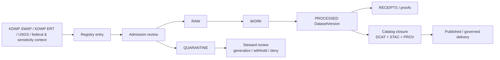

<!-- [KFM_META_BLOCK_V2]
doc_id: kfm://doc/NEEDS-VERIFICATION-UUID
title: Kansas SGCN / SWAP Registry Surface
type: standard
version: v1
status: draft
owners: @bartytime4life
created: YYYY-MM-DD
updated: YYYY-MM-DD
policy_label: NEEDS-VERIFICATION
related: [data/registry/README.md, data/raw/README.md, data/work/README.md, data/quarantine/README.md, data/processed/README.md, data/receipts/README.md, data/catalog/README.md, data/catalog/stac/README.md, data/catalog/dcat/README.md, data/catalog/prov/README.md, contracts/README.md, schemas/README.md, policy/README.md, tests/README.md, tools/README.md, docs/README.md]
tags: [kfm, kansas, sgcn, swap, biodiversity, registry]
notes: [Path target is PROPOSED / NEEDS VERIFICATION; owner is based on current public /data/ CODEOWNERS coverage; resolve doc_id, dates, policy label, and exact branch path before merge]
[/KFM_META_BLOCK_V2] -->

# Kansas SGCN / SWAP Registry Surface

Registry-facing README for admitting Kansas Species of Greatest Conservation Need and SWAP source families into KFM without collapsing biodiversity sensitivity or downstream lifecycle boundaries.

> Status: experimental  
> Owners: `@bartytime4life` (current public `/data/` CODEOWNERS coverage)  
> Path target: `data/registry/kansas_sgcn/README.md` (`PROPOSED` / `NEEDS VERIFICATION`)  
> Repo fit: parent [../README.md](../README.md) · lifecycle [../../raw/README.md](../../raw/README.md), [../../work/README.md](../../work/README.md), [../../quarantine/README.md](../../quarantine/README.md), [../../processed/README.md](../../processed/README.md), [../../receipts/README.md](../../receipts/README.md) · catalog [../../catalog/README.md](../../catalog/README.md), [../../catalog/stac/README.md](../../catalog/stac/README.md), [../../catalog/dcat/README.md](../../catalog/dcat/README.md), [../../catalog/prov/README.md](../../catalog/prov/README.md) · shared [../../../contracts/README.md](../../../contracts/README.md), [../../../schemas/README.md](../../../schemas/README.md), [../../../policy/README.md](../../../policy/README.md), [../../../tests/README.md](../../../tests/README.md), [../../../tools/README.md](../../../tools/README.md), [../../../docs/README.md](../../../docs/README.md)  
>      
> Quick jumps: [Scope](#scope) · [Repo fit](#repo-fit) · [Accepted inputs](#accepted-inputs) · [Exclusions](#exclusions) · [Directory tree](#directory-tree) · [Quickstart](#quickstart) · [Usage](#usage) · [Diagram](#diagram) · [Tables](#tables) · [Task list](#task-list-and-definition-of-done) · [FAQ](#faq) · [Appendix](#appendix)

> [!IMPORTANT]
> Current public `main` confirms the parent `data/registry/` lane and the surrounding `data/` lifecycle surfaces, but it does **not** confirm a checked-in `data/registry/kansas_sgcn/` subtree. Treat this README as a branch-ready starter surface unless the target branch already proves the directory exists.

> [!CAUTION]
> Biodiversity is a burden-bearing lane. Public-safe range or habitat overlays are not the same thing as precise occurrence points. Exact-location publication, if any, belongs behind explicit sensitivity handling, steward review, and visible publication class.

## Scope

`data/registry/kansas_sgcn/` is the proposed source-admission surface for Kansas SGCN / SWAP material inside KFM.

Its job is to keep the **identity, source hierarchy, rights posture, sensitivity posture, cadence, and downstream handoff** of Kansas biodiversity sources reviewable before any fetch, normalization, catalog closure, or publication work begins. In KFM terms, this is where a Kansas biodiversity lane becomes inspectable as a governed admission record rather than as an ad hoc downloader script.

### What this README is for

Use this surface to:

1. declare what Kansas SGCN / SWAP source families KFM intends to admit,
2. keep state authority, national comparison, and sensitivity-heavy corroboration clearly separated,
3. mark what can become public-safe only after generalization or steward review,
4. hand work off cleanly into `RAW`, `WORK`, `QUARANTINE`, `PROCESSED`, `RECEIPTS`, and `CATALOG`.

### Truth labels used here

| Label | Meaning in this README |
|---|---|
| **CONFIRMED** | Directly supported by current public repo evidence or attached March–April 2026 KFM doctrine. |
| **INFERRED** | Conservative bridge from confirmed doctrine or repo shape into this lane-specific README. |
| **PROPOSED** | Doctrine-consistent target shape not yet proven as checked-in branch reality. |
| **NEEDS VERIFICATION** | Explicit placeholder for path, endpoint, schema-home, dates, or operational detail that must be checked before merge. |
| **UNKNOWN** | Not supported strongly enough in this session to present as current repo fact. |

## Repo fit

This README sits at the seam between **source onboarding** and the broader KFM truth path.

| Relation | Path / surface | Status here | Why it matters |
|---|---|---|---|
| Parent registry lane | [../README.md](../README.md) | **CONFIRMED** | The parent registry README defines `data/registry/` as the source-admission lane and confirms that registry material should stay small, explicit, diffable, and PR-reviewable. |
| Sibling lifecycle lanes | [../../raw/README.md](../../raw/README.md) · [../../work/README.md](../../work/README.md) · [../../quarantine/README.md](../../quarantine/README.md) · [../../processed/README.md](../../processed/README.md) · [../../receipts/README.md](../../receipts/README.md) | **CONFIRMED** | This registry surface should hand work off into the truth path instead of absorbing raw capture, transforms, release evidence, or publication responsibilities. |
| Catalog closure | [../../catalog/README.md](../../catalog/README.md) · [../../catalog/stac/README.md](../../catalog/stac/README.md) · [../../catalog/dcat/README.md](../../catalog/dcat/README.md) · [../../catalog/prov/README.md](../../catalog/prov/README.md) | **CONFIRMED** | Registry entries should anticipate outward `DCAT + STAC + PROV` closure rather than stop at source notes. |
| Shared machine contract lane | [../../../contracts/README.md](../../../contracts/README.md) · [../../../schemas/README.md](../../../schemas/README.md) | **CONFIRMED** | Stable contract and schema authority should remain explicit instead of drifting into registry prose. |
| Shared policy / verification / tooling | [../../../policy/README.md](../../../policy/README.md) · [../../../tests/README.md](../../../tests/README.md) · [../../../tools/README.md](../../../tools/README.md) | **CONFIRMED** | Rights, sensitivity, validation, catalog QA, and diff helpers belong in executable or reusable surfaces, not hidden registry prose. |
| This sub-surface | `data/registry/kansas_sgcn/README.md` | **PROPOSED / NEEDS VERIFICATION** | The uploaded draft clearly aims at a Kansas SGCN subdirectory, but current public `main` does not yet prove that subtree exists. |

### Working interpretation

A good Kansas SGCN / SWAP registry README should do five jobs well:

1. keep **Kansas-first source hierarchy** explicit,
2. prevent **state authority**, **national comparison**, and **corroborative occurrence** data from being flattened together,
3. make **generalize / withhold / review** posture visible before downstream work starts,
4. point to the exact lifecycle and catalog lanes that must take over next,
5. stay honest about what is still placeholder, provisional, or branch-only.

## Accepted inputs

The following belong here or in immediately adjacent registry-owned files if the target branch adopts this subtree.

| Belongs here | Why it belongs here | Current posture |
|---|---|---|
| Directory README and entry notes | This is the smallest reviewable way to explain the lane, source hierarchy, and downstream handoff. | **PROPOSED** |
| One descriptor per source family or dataset entry | Small, diffable records are the core purpose of a registry lane. | **PROPOSED** |
| Acquisition/query templates | Kansas SGCN surfaces are likely ArcGIS-backed and benefit from explicit, read-only query patterns. | **INFERRED / PROPOSED** |
| Rights, sensitivity, and publication-class notes | Biodiversity requires visible redaction and steward-review posture before public-safe release. | **CONFIRMED** |
| Downstream handoff references | Registry entries should state which lifecycle and catalog surfaces they are expected to feed. | **CONFIRMED / INFERRED** |
| Tiny valid/invalid examples if registry-local schema authority is chosen | Useful only if the branch explicitly assigns local schema ownership here. | **NEEDS VERIFICATION** |

## Exclusions

Keep this surface narrow. The following do **not** belong here as authoritative storage or control surfaces.

| Do not put this here | Goes instead | Why |
|---|---|---|
| Raw snapshots, zipped downloads, checksum manifests | `../../raw/` or `../../work/` | Registry records describe admission; they are not the captured bytes. |
| Precise occurrence points or sensitive coordinates | `../../quarantine/` or a steward-only release path | Biodiversity precision is not public by default. |
| Full transform logic, normalization code, or emitted receipts | `../../work/`, `../../receipts/`, or the owning pipeline/tool surface | Runtime behavior belongs to execution and audit lanes. |
| Policy bundles, Rego, or reasons/obligations registries | `../../../policy/` | Deny-by-default enforcement must stay executable. |
| Canonical contracts, JSON Schemas, and controlled vocabularies that are shared across lanes | `../../../contracts/` and `../../../schemas/` | Shared machine authority should not fork silently into one registry entry. |
| STAC, DCAT, or PROV closure objects | `../../catalog/` | Catalog closure is downstream of admission and processed version identity. |
| Derived analytics or narrative products | `../../processed/`, `../../published/`, or docs-owned surfaces | Admission is not the same thing as publication or interpretation. |

## Directory tree

Proposed starter shape for this sub-surface:

```text
data/
└── registry/
    ├── README.md
    ├── schemas/
    │   └── README.md
    └── kansas_sgcn/                 # PROPOSED / NEEDS VERIFICATION
        ├── README.md                # this file
        ├── sources.yaml             # PROPOSED source family descriptors
        └── datasets/
            ├── sgcn_species.yaml    # PROPOSED
            ├── habitats.yaml        # PROPOSED
            └── priority_areas.yaml  # PROPOSED
```

This tree keeps the confirmed parent lane intact while making the Kansas SGCN branch of work explicit and reviewable.

## Quickstart

### 1) Recheck the active branch before trusting this path

```bash
find data/registry -maxdepth 3 -print 2>/dev/null | sort

for f in \
  data/registry/README.md \
  data/raw/README.md \
  data/work/README.md \
  data/quarantine/README.md \
  data/processed/README.md \
  data/receipts/README.md \
  data/catalog/README.md \
  data/catalog/stac/README.md \
  data/catalog/dcat/README.md \
  data/catalog/prov/README.md
do
  test -f "$f" && { echo "===== $f"; sed -n '1,120p' "$f"; }
done
```

### 2) Create the subtree only if the target branch intends to add it

```bash
mkdir -p data/registry/kansas_sgcn/datasets
```

### 3) Start with a small, reviewable descriptor

Illustrative starter only — field names and schema authority still need verification:

```yaml
id: ks_kdwp_ert_sgcn_species
title: Kansas ERT — SGCN species surface
publisher: Kansas Department of Wildlife and Parks
source_role: state_authority
acquisition:
  type: arcgis_feature_service
  base_url: NEEDS-VERIFICATION
  layer_id: NEEDS-VERIFICATION
  format: geojson
cadence: weekly
default_publication_class: NEEDS-VERIFICATION
downstream_targets:
  - data/work/
  - data/receipts/
  - data/catalog/
status: PROPOSED
notes:
  - Public-safe geometry class must be confirmed before release work begins.
```

### 4) Smoke-test a read-only ArcGIS query after verifying the endpoint

```bash
curl \
  "$BASE_URL/query?where=1%3D1&outFields=*&f=geojson&resultRecordCount=1" \
  -o /tmp/ks_sgcn_smoke.geojson
```

Do **not** hard-code live URLs or layer IDs into this README until the branch proves them.

## Usage

### Admission pattern

1. Register the source family and give it a stable KFM-facing identity.
2. State whether the source is **Kansas authority**, **national comparison**, **federal status context**, or **corroborative occurrence / sensitivity context**.
3. Declare expected acquisition shape, cadence, and minimum public-safe geometry posture.
4. Send real fetches and normalizations into `RAW`, `WORK`, or `QUARANTINE`, not back into the registry.
5. Emit receipts, diffs, and validation results in downstream lanes.
6. Compile `DCAT + STAC + PROV` only after a processed version and review-bearing publication posture exist.

### Public-safe first product

For this lane, the safest early release target is usually **generalized habitat / range / priority-area context**, not exact occurrence points.

That means this surface should bias toward:

- statewide or county-safe status lists,
- generalized range or habitat overlays,
- conservation-priority polygons whose release posture is already public-safe,
- explicit withholding or steward-review markers where precision is too sensitive.

## Diagram



## Tables

### Source-role hierarchy

| Source family | Why it belongs in this lane | Default handling posture |
|---|---|---|
| **KDWP SWAP / SGCN lists and range-context material** | Kansas-first authority for state status and Kansas-specific scope. | Treat as the state baseline for this lane. |
| **KDWP Ecological Review Tool (ERT) ArcGIS layers** | Kansas-native GIS delivery surface for habitats, ranges, conservation priority areas, and related ecology context. | Treat as the likely primary registry target for Kansas-native geospatial intake once exact layer IDs are verified. |
| **USGS national SGCN database** | Useful for Kansas subset comparison, historical cross-state context, and normalized national framing. | Comparison / corroboration, not a replacement for Kansas state authority. |
| **USFWS ECOS** | Federal listed-species and critical-habitat context may be relevant where state and federal status need to remain visibly distinct. | Adjacent status context; do not collapse into state SWAP semantics. |
| **NatureServe / Kansas Natural Heritage / broader occurrence networks** | Sensitivity, stewardship, and corroborative occurrence context often matter for review, withholding, or generalization decisions. | Treat as redaction-heavy sources; exact coordinates are not ordinary public data. |

### Minimum registry descriptor fields

| Field | Why it matters here |
|---|---|
| `id` | Stable KFM-facing identity for the source or dataset family. |
| `title` | Human-readable review surface for PRs and downstream handoff. |
| `publisher` | Keeps state, federal, and corroborative sources visibly distinct. |
| `source_role` | Prevents authority drift between Kansas state lists, national comparisons, and occurrence context. |
| `acquisition.type` | Makes connector expectations explicit before runtime code exists. |
| `base_url` / `layer_id` / query template | Pins the exact target once verified. |
| `cadence` | Supports polling, stale-state review, and expected change rhythm. |
| `rights_posture` | Keeps redistribution and reuse constraints visible. |
| `default_publication_class` | Makes generalized, restricted, or withheld posture explicit before publication. |
| `downstream_targets` | Routes work into lifecycle and catalog surfaces instead of trapping it in the registry. |
| `notes` | Small, reviewable place for lane-specific cautions and obligations. |

### Change-detection ladder

| Signal | Use it for | Posture |
|---|---|---|
| `lastEditDate` in service metadata | Cheap first-pass detection when the ArcGIS surface exposes edit metadata. | Useful but not guaranteed. |
| HTTP `ETag` / `Last-Modified` | Low-cost “nothing changed” detection before downloading full snapshots. | Preferred where supported. |
| Canonical row hashing | Deterministic fallback when service metadata is weak or absent. | Required if service-side signals are incomplete. |
| Geometry normalization before diffing | Prevents noisy false deltas from formatting or ordering drift. | Especially important for biodiversity polygons and generalized geometries. |
| Reviewer summary + machine diff | Keeps changes inspectable for humans and machines. | Recommended before promotion decisions. |

## Task list and definition of done

Use this checklist before treating this README as ready for commit.

- [ ] Confirm whether `data/registry/kansas_sgcn/` already exists on the active branch.
- [ ] Replace the `doc_id`, `created`, `updated`, and `policy_label` placeholders in the meta block.
- [ ] Verify owner routing against the active branch’s `.github/CODEOWNERS`.
- [ ] Confirm the exact KDWP ERT layer inventory and stable ArcGIS endpoint IDs.
- [ ] Decide whether any entry schemas live under `data/registry/schemas/` or only under shared top-level contract/schema lanes.
- [ ] Add at least one real descriptor file if this subtree is created.
- [ ] Make generalized-versus-restricted publication posture explicit for each admitted source family.
- [ ] Confirm downstream handoff paths and relative links render correctly on GitHub.
- [ ] Do not merge any example that publishes exact occurrence coordinates without explicit steward-reviewed justification.

## FAQ

### Why is this a registry README instead of a work-lane README?

Because the confirmed purpose of `data/registry/` is **source admission**: stable identity, publisher, acquisition, rights, cadence, and handoff. Fetches, transforms, receipts, and processed artifacts belong downstream.

### Why start from ArcGIS / FeatureService patterns here?

Because the strongest Kansas-specific geospatial starter signal in the attached SGCN packet is the KDWP Ecological Review Tool and its ArcGIS-backed layer pattern. That gives this lane a plausible, read-only source-admission shape without pretending the exact endpoint inventory is already verified.

### Does this README authorize publishing precise occurrence points?

No. It does the opposite. The lane assumes biodiversity is sensitivity-heavy and defaults toward **generalize, withhold, or route for steward review** unless the source and publication class prove otherwise.

### What is the safest first public-facing product for this lane?

A generalized status / habitat / range / priority-area product with visible freshness, source, and publication posture. Exact occurrence coordinates are a later and heavier burden, if they become publishable at all.

### What should stay UNKNOWN until the branch proves it?

The exact subdirectory path, live endpoint IDs, local schema home, validator inventory, merge gates, and any claim that a public-safe Kansas SGCN dataset version is already emitted by the repo.

## Appendix

<details>
<summary>Illustrative source descriptor skeleton</summary>

```yaml
id: ks_kdwp_ert_priority_habitat
title: Kansas ERT — conservation priority habitat
publisher: Kansas Department of Wildlife and Parks
source_role: state_authority
acquisition:
  type: arcgis_feature_service
  base_url: NEEDS-VERIFICATION
  layer_id: NEEDS-VERIFICATION
  format: geojson
  query_defaults:
    where: "1=1"
    outFields: "*"
    f: geojson
cadence: monthly
rights_posture: NEEDS-VERIFICATION
default_publication_class: generalized_or_restricted
downstream_targets:
  - ../../work/
  - ../../receipts/
  - ../../catalog/stac/
  - ../../catalog/dcat/
  - ../../catalog/prov/
status: PROPOSED
```

</details>

<details>
<summary>Read-only ArcGIS query pattern</summary>

```text
/FeatureServer/{layer_id}/query
  ?where=1=1
  &outFields=*
  &f=geojson
  &resultRecordCount=...
  &resultOffset=...
```

Recommended use:
- verify layer identity first,
- prefer `f=geojson` for portable review and diffing,
- use pagination controls for large layers,
- keep smoke tests read-only,
- record exact request shape in downstream receipts rather than only in prose.
```

</details>

<details>
<summary>Registry handoff checklist for one admitted source family</summary>

1. Registry descriptor reviewed and merged.
2. Exact source URL and layer ID verified on the active branch.
3. Rights and sensitivity posture recorded.
4. Read-only smoke query captured.
5. Downstream `RAW` / `WORK` / `QUARANTINE` destination chosen.
6. Receipt, diff, and validation expectations named.
7. Planned `DCAT + STAC + PROV` closure path linked.

</details>

[Back to top](#kansas-sgcn--swap-registry-surface)
