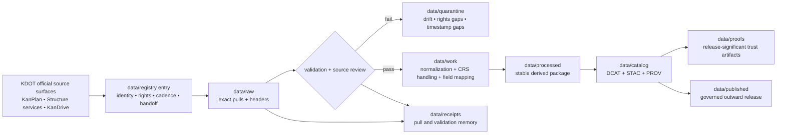

<!-- [KFM_META_BLOCK_V2]
doc_id: kfm://doc/NEEDS-VERIFICATION
title: KDOT Transportation ArcGIS Sources
type: standard
version: v1
status: draft
owners: @bartytime4life
created: 2026-04-08
updated: 2026-04-08
policy_label: NEEDS-VERIFICATION
related: [data/registry/README.md, data/registry/schemas/README.md, data/raw/README.md, data/work/README.md, data/quarantine/README.md, data/processed/README.md, data/catalog/README.md, data/catalog/dcat/README.md, data/catalog/stac/README.md, data/catalog/prov/README.md, data/receipts/README.md, data/proofs/README.md, data/published/README.md, contracts/README.md, schemas/README.md, policy/README.md, tests/README.md, tools/README.md]
tags: [kfm, kansas, transportation, kdot, arcgis, registry]
notes: [doc_id placeholder; target path is proposed because current public main does not yet expose dataset-entry files under data/registry/; policy label remains unresolved pending per-surface rights review]
[/KFM_META_BLOCK_V2] -->

# KDOT Transportation ArcGIS Sources

Governed source-entry README for official KDOT transportation ArcGIS surfaces used in clearance, restricted-bridge, and KanDrive onboarding.

> Status: experimental · Doc state: draft  
> Owners: `@bartytime4life` (via current public `/data/` CODEOWNERS coverage)  
> Path target: `data/registry/kdot-transportation-arcgis/README.md` — **PROPOSED**; current public `main` confirms `data/registry/README.md` and `data/registry/schemas/README.md`, not dataset-entry files  
> Repo fit: parent [../README.md](../README.md) · local schema boundary [../schemas/README.md](../schemas/README.md) · lifecycle [../../raw/README.md](../../raw/README.md), [../../work/README.md](../../work/README.md), [../../quarantine/README.md](../../quarantine/README.md), [../../processed/README.md](../../processed/README.md), [../../receipts/README.md](../../receipts/README.md), [../../published/README.md](../../published/README.md), [../../proofs/README.md](../../proofs/README.md) · catalog [../../catalog/README.md](../../catalog/README.md), [../../catalog/dcat/README.md](../../catalog/dcat/README.md), [../../catalog/stac/README.md](../../catalog/stac/README.md), [../../catalog/prov/README.md](../../catalog/prov/README.md) · shared [../../../contracts/README.md](../../../contracts/README.md), [../../../schemas/README.md](../../../schemas/README.md), [../../../policy/README.md](../../../policy/README.md), [../../../tests/README.md](../../../tests/README.md), [../../../tools/README.md](../../../tools/README.md)  
>       
> Quick jump: [Scope](#scope) · [Repo fit](#repo-fit) · [Accepted inputs](#accepted-inputs) · [Exclusions](#exclusions) · [Directory tree](#directory-tree) · [Quickstart](#quickstart) · [Usage](#usage) · [Diagram](#diagram) · [Tables](#tables) · [Task list](#task-list--definition-of-done) · [FAQ](#faq) · [Appendix](#appendix)

> [!IMPORTANT]
> This file is intentionally public-main-grounded rather than branch-assumptive. Current public `main` confirms the broader `data/` lifecycle lanes and the `data/registry/` boundary, but it does **not** yet confirm dataset-entry files below `data/registry/`. Treat this README as a **PROPOSED** new entry document until the active branch lands a concrete path.

> [!CAUTION]
> The `Vertical_Clearances` source publishes source-specific legal/warranty text. Do not inherit a blanket rights posture across all KDOT transportation surfaces without per-surface review and explicit registry fields.

## Scope

This README defines the source-facing contract for a KDOT transportation source family built from official KDOT GIS pages, public ArcGIS REST services, and the KanDrive traveler-information surface.

It is written to support four things:

1. source admission and registry review,
2. raw acquisition planning,
3. normalization and catalog-closure design,
4. reviewer-visible governance before anything becomes publishable.

The source family currently centers on three lanes:

- vertical clearances,
- restricted bridges,
- KanDrive / 511-style travel-condition events.

### Truth labels used here

| Label | Meaning in this README |
| --- | --- |
| **CONFIRMED** | Directly supported by current public repo evidence, attached KFM doctrine, or current official KDOT / ArcGIS source pages. |
| **INFERRED** | Strongly suggested by current evidence, but not re-proven as checked-in implementation on the active branch. |
| **PROPOSED** | Doctrine-consistent target shape or working rule that fits KFM, but is not asserted as current repo reality. |
| **UNKNOWN** | Not supported strongly enough in this session to present as settled fact. |
| **NEEDS VERIFICATION** | Explicit placeholder that should be checked before merge. |

### Current evidence boundary

| Signal | Current reading |
| --- | --- |
| Public repo tree | **CONFIRMED**: `data/registry/` exists on public `main`, but currently shows only `README.md` and `schemas/README.md`. |
| Wider lifecycle context | **CONFIRMED**: public `main` exposes `data/raw/`, `data/work/`, `data/quarantine/`, `data/processed/`, `data/catalog/`, `data/receipts/`, `data/published/`, and `data/proofs/` README surfaces. |
| Official KDOT landing surfaces | **CONFIRMED**: KDOT’s GIS page points to KanPlan and lists KanDrive as a frequently used web application. |
| Official ArcGIS service surfaces | **CONFIRMED**: public `MapServer` services exist for `Structures/Vertical_Clearances` and `Structures/Restricted_Bridges`. |
| Unresolved details | **NEEDS VERIFICATION**: active-branch landing path, exact registry-entry body shape, live validator wiring, emitted receipt/proof packs, and the exact KanDrive event-layer endpoint(s) / layer IDs. |

[Back to top](#kdot-transportation-arcgis-sources)

## Repo fit

This document belongs at the seam between source admission and the governed truth path. It should describe what KFM intends to integrate and under what governance, while sibling lifecycle lanes carry bytes, working transforms, catalog closure, receipt memory, proof packs, and publication state.

| Relation | Surface | Status here | Why it matters |
| --- | --- | --- | --- |
| Parent | [../README.md](../README.md) | **CONFIRMED** | `data/registry/` is the admission lane for dataset or source-family identity, cadence, rights posture, and downstream handoff. |
| Local schema boundary | [../schemas/README.md](../schemas/README.md) | **CONFIRMED** | Registry-local schema authority exists as a public boundary, but is still README-first on public `main`. |
| Sibling lifecycle lanes | [../../raw/README.md](../../raw/README.md), [../../work/README.md](../../work/README.md), [../../quarantine/README.md](../../quarantine/README.md), [../../processed/README.md](../../processed/README.md), [../../receipts/README.md](../../receipts/README.md), [../../published/README.md](../../published/README.md), [../../proofs/README.md](../../proofs/README.md) | **CONFIRMED** | Registry material should hand off to these lanes rather than silently absorbing raw capture, QA, proof, or publication duties. |
| Catalog closure | [../../catalog/README.md](../../catalog/README.md), [../../catalog/dcat/README.md](../../catalog/dcat/README.md), [../../catalog/stac/README.md](../../catalog/stac/README.md), [../../catalog/prov/README.md](../../catalog/prov/README.md) | **CONFIRMED** | KFM doctrine expects outward closure through linked `DCAT + STAC + PROV`, not a lone registry record. |
| Shared machine-contract lanes | [../../../contracts/README.md](../../../contracts/README.md), [../../../schemas/README.md](../../../schemas/README.md) | **CONFIRMED** | Cross-cutting trust objects and shared schemas should not be silently re-homed inside a source-entry README. |
| Policy and verification | [../../../policy/README.md](../../../policy/README.md), [../../../tests/README.md](../../../tests/README.md), [../../../tools/README.md](../../../tools/README.md) | **CONFIRMED** path · **INFERRED** deeper role | Deny-by-default policy, fixtures, contract tests, and tooling are downstream obligations, even when the exact branch-level implementation is not yet proven here. |

### Minimum intent for this entry

A reviewer should be able to answer these questions from this file and its companion registry payloads:

- What is the source family called in KFM?
- Who publishes it?
- Which public source surfaces are in scope?
- What formats, cadences, and rights notes apply?
- What raw, working, processed, catalog, receipt, proof, and published lanes should receive the handoff?
- Which unresolved points must stay visible before promotion?

[Back to top](#kdot-transportation-arcgis-sources)

## Accepted inputs

This README should accept only material that helps make source admission explicit, reviewable, and machine-checkable.

- official KDOT landing pages,
- official ArcGIS REST service URLs,
- confirmed layer IDs and public item IDs,
- declared cadence and freshness assumptions,
- source-specific rights / warranty language,
- canonical field-family notes,
- declared CRS / geometry expectations,
- downstream handoff notes to `raw`, `work`, `processed`, `catalog`, `receipts`, `proofs`, and `published`,
- links to shared contracts, schemas, policy, tests, or tools that the entry is expected to feed.

### Preferred explicitness

Prefer:

- declared source URLs over hidden discovery,
- layer IDs over informal prose references,
- per-surface rights notes over blanket assumptions,
- explicit CRS handling over “standard ArcGIS output” shorthand,
- explicit cadence / freshness notes over vague “near real time” wording,
- explicit unresolved items over confident guesswork.

## Exclusions

This README is not the authoritative home for everything related to these sources.

| Does not belong here | Goes instead | Why |
| --- | --- | --- |
| Raw downloads, pull snapshots, or checksum packs | `data/raw/` | Registry describes admission; it is not the captured byte store. |
| Working transforms, QA scratch files, or blocked runs | `data/work/` or `data/quarantine/` | Transform and blocked-state evidence belong in lifecycle zones. |
| Process memory for pulls, validations, or corrections | `data/receipts/` | Receipts should remain separate from the source-entry description. |
| Release-significant proof packs, manifests, or attestations | `data/proofs/` | Proof artifacts are promotion-facing, not registry-local. |
| Published release payloads | `data/published/` | Publication remains a governed downstream state transition. |
| Shared KFM trust-object schemas | `contracts/` and/or the authoritative shared schema home | Avoid parallel authority. |
| Policy bundles or reason / obligation registries | `policy/` | Policy should remain executable and separately reviewable. |
| Runtime routing decisions or traveler-facing assertions | governed APIs and runtime surfaces | This document describes source onboarding, not live user answers. |

## Directory tree

### Current public `main` snapshot

```text
data/
└── registry/
    ├── README.md
    └── schemas/
        └── README.md
```

### Proposed addition for this source family

```text
data/
└── registry/
    ├── README.md
    ├── schemas/
    │   └── README.md
    └── kdot-transportation-arcgis/
        ├── README.md                 # this file
        ├── source.json              # PROPOSED source entry payload
        ├── endpoints.yaml           # PROPOSED endpoint inventory
        └── fields.md                # OPTIONAL / PROPOSED reviewer aid
```

### Lifecycle handoff shape

```text
data/
├── raw/
│   └── kdot-transportation-arcgis/      # PROPOSED exact pull payloads + headers
├── work/
│   └── kdot-transportation-arcgis/      # PROPOSED normalization + QA staging
├── quarantine/
│   └── kdot-transportation-arcgis/      # PROPOSED drift / rights / timestamp failures
├── processed/
│   └── kdot-transportation-arcgis/      # PROPOSED stable derived packages
├── catalog/
│   ├── dcat/
│   ├── stac/
│   └── prov/
├── receipts/
│   └── kdot-transportation-arcgis/      # PROPOSED pull + validation + correction memory
├── proofs/
│   └── kdot-transportation-arcgis/      # PROPOSED release-significant proof objects
└── published/
    └── kdot-transportation-arcgis/      # PROPOSED outward release state
```

> [!NOTE]
> The public repo currently proves the lifecycle lane names above, but not the source-specific child paths. Treat the child directories here as a commit-ready working proposal, not as current public-main inventory.

## Quickstart

### 1) Inspect the confirmed public service surfaces first

```bash
curl "https://kanplan.ksdot.gov/arcgis_web_adaptor/rest/services/Structures/Vertical_Clearances/MapServer?f=pjson"
curl "https://kanplan.ksdot.gov/arcgis_web_adaptor/rest/services/Structures/Restricted_Bridges/MapServer?f=pjson"
```

### 2) Pull one confirmed layer, not the whole world

```bash
curl "https://kanplan.ksdot.gov/arcgis_web_adaptor/rest/services/Structures/Vertical_Clearances/MapServer/0/query?where=1%3D1&outFields=*&f=geojson"
```

```bash
curl "https://kanplan.ksdot.gov/arcgis_web_adaptor/rest/services/Structures/Restricted_Bridges/MapServer/0/query?where=1%3D1&outFields=*&f=geojson"
```

### 3) Respect service limits in the first connector draft

```bash
curl "https://kanplan.ksdot.gov/arcgis_web_adaptor/rest/services/Structures/Restricted_Bridges/MapServer/0/query?where=1%3D1&outFields=*&resultRecordCount=1000&resultOffset=0&f=json"
```

### 4) Do not freeze KanDrive event queries until the entry payload records the underlying service

The current public evidence is strong enough to confirm KanDrive as an official KDOT travel-information surface. It is **not** yet strong enough, in this session, to treat a specific KanDrive event-layer URL or field map as settled. Record the official event endpoint in `source.json` or `endpoints.yaml` before adding runtime or polling examples here.

## Usage

### Confirmed public source basis

KDOT’s official GIS page says KDOT maintains GIS maps through KanPlan and lists KanDrive as a frequently used web application. Public ArcGIS REST services are directly visible today for two structure-related source families: `Structures/Vertical_Clearances` and `Structures/Restricted_Bridges`. Those two services are enough to treat this registry entry as a real candidate for governed onboarding rather than a generic transportation placeholder.

### Source surfaces in scope

#### 1) Vertical clearances

Use this lane for bridge / structure clearance constraints that matter for routing, freight, hazard avoidance, and corridor-awareness use cases.

Current public signals:

- service name: `Structures/Vertical_Clearances`,
- public item id: `4fe285fc44a04b7a8e0f36cf0f47643d`,
- layer bands: `Less than 15 feet`, `15 to 16 feet`, `Greater than 16 feet`,
- geometry type: point,
- query formats: `JSON`, `geoJSON`, `PBF`,
- max record count: `1000`,
- source copyright text: Bureau of Transportation Planning, Kansas Department of Transportation.

#### 2) Restricted bridges

Use this lane for posted bridge weight restrictions on the Kansas state highway system.

Current public signals:

- service name: `Structures/Restricted_Bridges`,
- public item id: `fb04156c5fcb4e1699cf703129c8b7fc`,
- layer name: `Restricted Bridges`,
- geometry type: point,
- query formats: `JSON`, `geoJSON`, `PBF`,
- max record count: `1000`,
- source description: 120,000-pound gross vehicle weight restriction,
- maintenance note: inventory of state-system bridges is on a two-year-or-less cycle.

#### 3) KanDrive / traveler-information events

Use this lane for freshness-sensitive travel-condition context such as incidents, closures, and other roadway events.

Current public signals:

- KDOT lists KanDrive as an official frequently used web application,
- the Kansas Geoportal item describes KanDrive as a traveler-information surface,
- the underlying event-layer service URL and layer IDs remain **NEEDS VERIFICATION** in this session.

### Acquisition rules

#### ArcGIS REST posture

For the two confirmed MapServer sources, registry material should declare:

- exact service URL,
- exact layer IDs,
- expected query format,
- pagination plan,
- header capture plan,
- CRS transformation plan,
- cadence / freshness assumption,
- quarantine triggers.

#### Header and drift capture

Capture these values in `data/receipts/`, not in the published release surface:

- HTTP status,
- `ETag`,
- `Last-Modified`,
- pull timestamp,
- response record count,
- geometry type summary,
- field-shape summary,
- source URL and layer ID,
- any source-side service version or item id visible in the payload.

#### Slow-changing vs freshness-sensitive lanes

- Vertical clearances: slow-changing, scheduled pull, diff-aware if practical.
- Restricted bridges: slow-changing, scheduled pull, diff-aware if practical.
- KanDrive events: frequent polling or request-time evidence, with stricter stale-source handling and tighter negative-outcome behavior.

### Normalization rules

#### Geometry

- Preserve the exact source payload in `data/raw/`.
- Normalize into a canonical downstream geometry carrier only after the source CRS is explicitly recorded.
- Prefer WGS84 / EPSG:4326 for portable downstream GeoJSON or GeoParquet outputs, while preserving the original CRS and transform note in receipts / provenance.
- Treat the current service CRS as a projected Kansas Lambert Conformal Conic surface unless the target-branch connector proves a more precise authority string and handling path.

#### Units

- Do not silently reinterpret clearance or weight units.
- Preserve source-native units first.
- Add derived metric values only when the transform is declared and reproducible.
- Keep source-specific banding for vertical clearances even if a later derived field also stores numeric harmonization.

#### Time

For KanDrive-style events:

- preserve source timestamps verbatim,
- normalize to one canonical timestamp format,
- record timezone assumptions explicitly,
- never invent a missing end time,
- let missing or contradictory freshness data fail closed.

### Rights and policy posture

A blanket rights assumption is unsafe for this source family.

- `Vertical_Clearances` publishes explicit source-specific legal/warranty language.
- `Restricted_Bridges` needs its own rights/terms verification in the branch that lands this entry.
- KanDrive needs per-surface rights and redistribution review before this entry is promoted beyond registry admission.

Working default posture:

- **Policy label:** **NEEDS VERIFICATION**
- **Working operational assumption:** a public-facing starting posture may be possible for some surfaces, but only after the entry records source-specific terms, attribution, and any litigation / evidence / warranty constraints.

### Catalog closure expectations

Registry admission is not publication. Downstream work should be prepared to emit:

- **DCAT** for outward dataset and distribution discovery,
- **STAC** where spatial itemization or time-bounded event packaging is meaningful,
- **PROV** for acquisition, normalization, validation, and publication lineage.

A registry entry should also point toward:

- the eventual canonical spec or connector input that drives `spec_hash`,
- the receipt family that records pulls and validation,
- the proof family that records release-significant trust artifacts.

[Back to top](#kdot-transportation-arcgis-sources)

## Diagram



## Tables

### Confirmed public source inventory

| Surface family | Current public surface | Current confirmed details | Registry implication |
| --- | --- | --- | --- |
| KDOT GIS landing | KDOT GIS & Maps page | KDOT says it maintains GIS maps through KanPlan and lists KanDrive among frequently used web applications. | Use as canonical `landingPage` / source-overview reference. |
| Vertical clearances | `Structures/Vertical_Clearances` MapServer | 3 layer bands; point geometry; query formats `JSON`, `geoJSON`, `PBF`; `maxRecordCount=1000`; public item id `4fe285fc44a04b7a8e0f36cf0f47643d`. | Treat as a confirmed slow-changing ArcGIS source with source-specific rights notes. |
| Restricted bridges | `Structures/Restricted_Bridges` MapServer | 1 layer; point geometry; query formats `JSON`, `geoJSON`, `PBF`; `maxRecordCount=1000`; 120,000-pound gross vehicle weight restriction; public item id `fb04156c5fcb4e1699cf703129c8b7fc`. | Treat as a confirmed slow-changing ArcGIS source with a declared inventory-maintenance note. |
| KanDrive | official KDOT web application / Kansas Geoportal item | Official traveler-information surface; current public evidence confirms app existence, but not the underlying event service URL or layer inventory. | Keep event endpoint(s) and field map explicitly unresolved until recorded in the branch entry payload. |

### Canonical field families

| Canonical family | Meaning | Notes |
| --- | --- | --- |
| `source_family` | KFM entry family id | e.g. `kdot-transportation-arcgis` |
| `surface_id` | source surface key | e.g. `vertical_clearances`, `restricted_bridges`, `kandrive_events` |
| `source_feature_id` | upstream object identifier | keep source-native first |
| `feature_class` | normalized semantic class | e.g. `vertical_clearance_band`, `bridge_weight_posting`, `traffic_event` |
| `route_ref` | route or roadway identifier | do not infer if absent |
| `structure_ref` | bridge / structure identifier | especially relevant for bridge lanes |
| `admin_area` | county / district / other administrative area | source-native if present |
| `classification_band` | categorical restriction band | especially useful for vertical-clearance layers split by band |
| `limit_value` | numeric restriction value | only when source actually exposes a stable numeric field |
| `limit_unit` | source-native unit | preserve first, derive second |
| `event_type` | closure / incident / detour / work-zone-like event type | KanDrive lane only after endpoint verification |
| `valid_from` | effective start time | preserve exact source semantics |
| `valid_to` | effective end time | do not invent if absent |
| `status` | active / inactive / unknown | surface-specific |
| `source_url` | exact pull URL | capture in receipts and provenance |
| `pulled_at` | acquisition timestamp | required for replay and freshness reasoning |

### Freshness and runtime posture

| Surface | Freshness class | Negative-path expectation |
| --- | --- | --- |
| Vertical clearances | low / slow-changing | quarantine on shape drift or rights gaps; otherwise schedule normally |
| Restricted bridges | low / slow-changing | quarantine on shape drift or rights gaps; otherwise schedule normally |
| KanDrive events | high / freshness-sensitive | prefer `ABSTAIN`, `DENY`, or `ERROR` over speculative live claims when current evidence is missing or stale |

## Task list / definition of done

- [ ] Confirm the active-branch landing path for this README and its companion registry payloads.
- [ ] Record exact source URLs and confirmed layer IDs for every admitted surface.
- [ ] Record per-surface rights / warranty language; do not inherit one blanket label.
- [ ] Add raw-landing rules under `data/raw/` for exact source payload capture.
- [ ] Add normalization and QA rules under `data/work/`.
- [ ] Add quarantine triggers for shape drift, invalid geometry, timestamp gaps, or unresolved rights.
- [ ] Declare the canonical spec or connector input that will later drive `spec_hash`.
- [ ] Add receipt expectations for pull, validation, and correction memory under `data/receipts/`.
- [ ] Plan catalog closure to `DCAT + STAC + PROV`.
- [ ] Define what release-significant proof belongs under `data/proofs/`.
- [ ] Recheck whether KanDrive event ingestion should be polling-based, request-time only, or both.
- [ ] Add tests and policy checks before promotion claims are widened.

## FAQ

### Does current public `main` already expose this source entry?

No. Current public `main` confirms the `data/registry/` lane and its local schema boundary, but not a checked-in KDOT-specific entry below it.

### Is `data/registry/kdot-transportation-arcgis/README.md` a confirmed path?

No. It is a practical **PROPOSED** landing path for this draft. Recheck the active branch before merge.

### Are the exact KanDrive event-service URLs settled here?

No. This README confirms KanDrive as an official KDOT surface, but keeps the exact event-layer URL(s), layer IDs, and field map as **NEEDS VERIFICATION**.

### Is `public-safe` the settled default label for this family?

No. That may remain a workable starting hypothesis for some surfaces, but current evidence shows at least one source publishes explicit legal / warranty language. Treat the final label as unresolved until the branch records per-surface rights notes.

### Is this README the authority for schema and policy?

No. Shared schema and policy authority belong in the repo’s contract, schema, and policy lanes. This file is a source-entry README and handoff guide.

## Appendix

<details>
<summary>Appendix A — Confirmed public source URLs</summary>

- KDOT GIS landing page  
  `https://www.ksdot.gov/about/our-organization/divisions/planning-and-development/kansas-maps-and-gis-resources`

- Vertical clearances MapServer  
  `https://kanplan.ksdot.gov/arcgis_web_adaptor/rest/services/Structures/Vertical_Clearances/MapServer`

- Vertical clearances item info  
  `https://wfs.ksdot.org/arcgis_web_adaptor/rest/services/Structures/Vertical_Clearances/MapServer/info/iteminfo`

- Restricted bridges MapServer  
  `https://kanplan.ksdot.gov/arcgis_web_adaptor/rest/services/Structures/Restricted_Bridges/MapServer`

- KanDrive public map  
  `https://www.kandrive.gov/`

- KanDrive geoportal item  
  `https://hub.kansasgis.org/datasets/kandrive`

</details>

<details>
<summary>Appendix B — Suggested companion registry payloads</summary>

### `source.json` (PROPOSED)

```json
{
  "source_id": "kdot-transportation-arcgis",
  "title": "KDOT Transportation ArcGIS Sources",
  "publisher": "Kansas Department of Transportation",
  "landing_page": "https://www.ksdot.gov/about/our-organization/divisions/planning-and-development/kansas-maps-and-gis-resources",
  "policy_label": "NEEDS-VERIFICATION",
  "source_type": "arcgis_rest",
  "surfaces": [
    {
      "surface_id": "vertical_clearances",
      "service_url": "https://kanplan.ksdot.gov/arcgis_web_adaptor/rest/services/Structures/Vertical_Clearances/MapServer",
      "layer_ids": [0, 1, 2],
      "status": "CONFIRMED"
    },
    {
      "surface_id": "restricted_bridges",
      "service_url": "https://kanplan.ksdot.gov/arcgis_web_adaptor/rest/services/Structures/Restricted_Bridges/MapServer",
      "layer_ids": [0],
      "status": "CONFIRMED"
    },
    {
      "surface_id": "kandrive_events",
      "service_url": "NEEDS-VERIFICATION",
      "layer_ids": [],
      "status": "NEEDS-VERIFICATION"
    }
  ]
}
```

### `endpoints.yaml` (PROPOSED)

```yaml
source_id: kdot-transportation-arcgis
capture_headers:
  - etag
  - last-modified
query_defaults:
  outFields: "*"
  formats:
    - json
    - geojson
pagination:
  max_record_count:
    vertical_clearances: 1000
    restricted_bridges: 1000
cadence:
  vertical_clearances: NEEDS-VERIFICATION
  restricted_bridges: NEEDS-VERIFICATION
  kandrive_events: NEEDS-VERIFICATION
quarantine_triggers:
  - source_shape_change
  - unresolved_rights
  - invalid_geometry
  - missing_or_contradictory_event_time
  - pagination_without_continuation_handling
```

</details>

[Back to top](#kdot-transportation-arcgis-sources)
