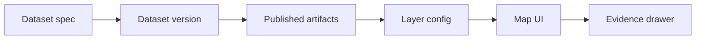

<!-- [KFM_META_BLOCK_V2]
doc_id: kfm://doc/7921f3fc-1a6d-48b0-9398-6149ee303aaf
title: Layer Registry
type: standard
version: v1
status: draft
owners: TBD
created: 2026-02-24
updated: 2026-02-24
policy_label: public
related:
  - kfm://doc/kfm-definitive-design-and-governance-guide-vnext
tags: [kfm]
notes:
  - Directory-level registry for map-renderable layer configuration files.
[/KFM_META_BLOCK_V2] -->

# Layer Registry

**Purpose:** versioned, machine-readable layer configuration files that connect catalogs → map rendering → evidence behavior.

  

## Navigation

- [What belongs here](#what-belongs-here)
- [What must not go here](#what-must-not-go-here)
- [Directory layout](#directory-layout)
- [Layer config shape](#layer-config-shape)
- [Operational notes](#operational-notes)

---

## What belongs here

✅ **Acceptable inputs**

- One JSON file per map layer ("layer configuration file").
- Optional registry index / inventory file(s) for discovery.
- Human-readable docs that explain conventions and validation.

## What must not go here

🚫 **Exclusions**

- Raw datasets, processed artifacts (PMTiles/COGs/Parquet), or any large binaries.
- Secrets / credentials.
- Anything not intended to be referenced by governed APIs and UI.

---

## Directory layout

```text
data/registry/layers/
  README.md
  index.json                  # (optional) simple inventory of layer configs
  noaa_storm_events.layer.json # example layer config (starter)
```

---

## Layer config shape

A layer configuration file connects catalogs to map rendering and evidence behavior.

Minimum starter fields (illustrative):

- `kfm_layer_config_version`
- `layer_id`
- `title`
- `dataset_slug`
- `dataset_version_id`
- `policy_label`
- `delivery` (how the UI fetches tiles)
- `style` (legend + paint rules)
- `time` (how time filtering applies)
- `identify` (feature identify + evidence reference linkage)
- `attribution` (license / credit)

### Flow diagram



---

## Operational notes

- Keep layer configs **small and diff-friendly**. This directory is meant to be reviewed in PRs.
- When a dataset is promoted, update the layer config to reference the new `dataset_version_id` and artifact `digest`.
- Treat `policy_label` as the top-line access control intent for the layer.

> TIP: If you implement CI validation, add JSON schema checks for layer configs and ensure `delivery.digest` is present for published artifacts.
